# Single-vial magnetic stirrer for the CubXL (after the Pioreactor)

A stir plate for one 20 mL vial that drops into the CubXL deck like any other
Cubware holder. It is the "stir plate under one vial" option from
[`vial-mixing.md`](../../cubos/docs/vial-mixing.md), built around the Pioreactor's
stirring stack: a 40 mm fan with two opposite-pole magnets on its hub, a PTFE bar in
the vial, a Hall sensor counting turns, and a closed speed loop. Asked for by
@sgbaird on [PR #269](https://github.com/vertical-cloud-lab/byu-vcl/pull/269), after
@benwhitney5463's question on [#169](https://github.com/vertical-cloud-lab/byu-vcl/issues/169).

**Status: designed, not built.** Nothing here has been printed, wired or run. The
numbers that matter most (coupling, the Hall signal, the vial grip) are estimates
until a first build.

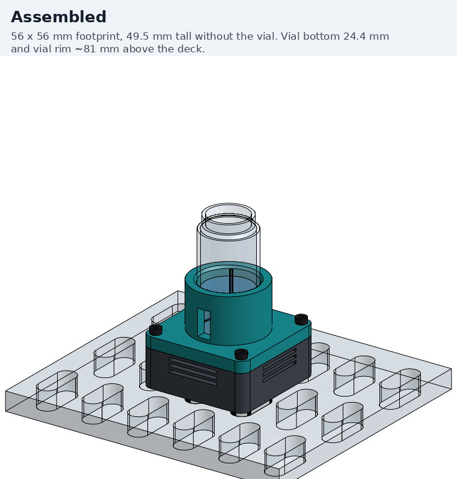

| | |
|---|---|
| Footprint | 56 × 56 mm, two deck keys in adjacent slots |
| Height | 50 mm without the vial; vial bottom 25 mm and rim ~82 mm above the deck |
| Vial | 28 mm OD, 20 mL VOA (Ben's), on a 1.2 mm printed floor |
| Drive | Orion OD4010-12HSS fan (the Pioreactor's), 5 V, 200 Hz PWM through a low-side MOSFET |
| Magnets | 2 × N52, 1/4 × 1/16 in, opposite poles up, 9.8 mm apart (the Pioreactor's) |
| Speed sensing | US1881 Hall latch beside the magnets, 1 pulse per turn |
| Controller | Seeed XIAO RP2040, USB-C to the CubXL Pi, MicroPython |
| Fasteners | 4 × M3 × 16 and 4 × M3 × 12 socket head screws, 8 × M3 heat-set inserts |
| Parts cost | about $20–25 per stirrer, after the multi-packs below |

## Contents

| Path | What |
|---|---|
| [`onshape/vial_stirrer.fs`](onshape/vial_stirrer.fs) | The whole model as one FeatureScript feature. All dimensions are constants at the top |
| [`build_onshape.py`](build_onshape.py) | Pushes the FeatureScript to Onshape, rebuilds, renders every step, exports the STLs |
| [`onshape/render_steps.json`](onshape/render_steps.json) | Camera and caption for each render |
| [`onshape/document.json`](onshape/document.json) | Onshape document ids |
| [`stl/`](stl) | Printed parts, in assembly position: `base`, `vial_holder`, `magnet_carrier`, `deck_key` (print two) |
| [`img/`](img) | Renders: steps 1–10, assembled, exploded, section, contact sheet, GIF |
| [`firmware/main.py`](firmware/main.py) | MicroPython speed controller for the XIAO RP2040 (untested) |
| [`RESEARCH.md`](RESEARCH.md) | What the Pioreactor does, other open-source stirrers, design lessons |
| [`../../outputs/issue-169-magnetic-stirrer/`](../../outputs/issue-169-magnetic-stirrer) | Edison answers and the raw vendor lookups |

The Onshape document is
[`single-vial-stirrer-cubxl (byu-vcl #169)`](https://cad.onshape.com/documents/80ec0345c92398198316197e/w/96eb770a6ced683a7077e0ec/e/033fb4b0b500e5c15762a06c).
It holds the Feature Studio, a Part Studio with the one feature, an Assembly with that
Part Studio inserted, and Onshape's BOM of the assembly. It was made through the API
with the lab's key, so it sits in @sgbaird's Onshape account, unshared. It is
disposable: `build_onshape.py --new` rebuilds it from the FeatureScript in a fresh
document.

## What comes from the Pioreactor, and what changed

The Pioreactor 20 mL holds the same class of vial (27.5 × 57.4 mm) and stirs it the
same way, so its proven choices are kept. Sources are in [`RESEARCH.md`](RESEARCH.md).

| | Pioreactor v1.5 | This stirrer | Why |
|---|---|---|---|
| Fan | Orion OD4010-12HSS, 12 V 2-wire, run at 5 V | same | Their part. A 12 V fan at 5 V tops out lower, which suits stirring |
| Magnets | 2 × 0.250 × 0.060 in, opposite poles, 9.8 mm apart | 2 × 1/4 × 1/16 in N52, 9.8 mm apart | same |
| Magnet holder | Ø24 × 3.23 mm, pockets Ø6.66 × 1.675 mm open to the vial | Ø19, same thickness and pockets | Smaller, to leave room for the Hall sensor |
| Drive | Software PWM at 200 Hz; a low-side MOSFET (BSS316N footprint on the HAT, inferred from its STEP) | 200 Hz hardware PWM, IRLZ44N | IRLZ44Ns are already in the capper BOM |
| Speed sensing | DRV5021A3 Hall switch over the magnets, on the heater board | US1881 Hall latch beside the magnets | No heater board here, so nothing sits over the magnets |
| Control | Additive P loop (Kp 0.005), kick from rest and on stall, on the Pi | Same structure, on the XIAO, plus a setpoint ramp | Self-contained over USB; ramping is the literature's advice |
| Magnet face to vial bottom | about 7 mm (estimated from their CAD) | 2.4 mm (1.2 air + 1.2 print) | No heater board. See the coupling note under Risks |
| Mounting | Pi HAT faceplate | Two Cubware deck keys | CubXL deck |

## How it sits on the CubXL deck

The CubXL+ deck is Cubware's `PandaDeck.step`: a 10 mm polycarbonate plate cut with
10 × 25 mm pill-shaped slots (R5 ends), long axis along deck Y, on a **25 mm (X) ×
45 mm (Y)** grid. Holders do not bolt down. Each carries pill-shaped keys,
9.8 × 24.8 × 10 mm, that drop into the slots with 0.1 mm clearance a side and are
held by gravity
([Cubware `9VialHolder-key.step`](https://github.com/Ursa-Laboratories/Cubware/blob/352aa95/cubxl_plus/labware/vial_holder/9VialHolder-key.step),
[deck](https://github.com/Ursa-Laboratories/Cubware/blob/352aa95/cubxl_plus/deck/polycarbonate_deck/PandaDeck.step)).

- **Two keys, 25 mm apart in X**, so they sit in adjacent slot columns of one row. One key
  would already locate the stirrer; two cut its rotational play.
- The keys are Cubware's: same pill, same 2 mm rounded-triangle nub (equilateral,
  3.1 mm circumradius, R1.0 corners, one corner toward −Y), glued into 2.1 mm pockets
  with R1.1 corners. [`stl/deck_key.stl`](stl/deck_key.stl) is that key, and Cubware's
  own `9VialHolder-key.stl` fits the same pockets.
- **Where the vial ends up:** midway between the two slot columns, on a row centre.
  With the slot centres inferred from Ben's deck file (vial_1 at (136.668, 45) sits
  over a slot centre), that is about **X = 149.2 + 25n, Y = 45 + 45m** in deck
  coordinates, ±1.5 mm. Teach it like any new labware; this is only a starting point.
- **Heights:** the vial's bottom is 25.0 mm above the plate. In the 9-vial holder it is
  18.0 mm, so every vial Z (rim, pipette and capper heights) moves up about **7 mm**.
- The deck plate's real thickness hasn't been measured. The STEP says 10 mm, and the
  keys are 10 mm like Cubware's, which already work on this deck.

## Parts list

Prices and links were looked up from the CubXL Pi on 2026-10-10 (Amazon search pages,
K&J, Adafruit and the Pioreactor shop; DigiKey and Mouser refuse it). The raw results
are in [`vendor_lookup_amazon_20261010.json`](../../outputs/issue-169-magnetic-stirrer/vendor_lookup_amazon_20261010.json)
and [`…b.json`](../../outputs/issue-169-magnetic-stirrer/vendor_lookup_amazon_20261010b.json).
Amazon prices move; treat them as of that date.

### Printed

| Part | File | Qty | Volume | Print |
|---|---|---|---|---|
| Base | [`base.stl`](stl/base.stl) | 1 | 23.8 cm³ | Floor down. The key pockets are on the bed face |
| Vial holder | [`vial_holder.stl`](stl/vial_holder.stl) | 1 | 27.5 cm³ | Flange top down. The 1.2 mm floor then bridges over the Ø28.8 mm bore, and the crush ribs print vertically |
| Magnet carrier | [`magnet_carrier.stl`](stl/magnet_carrier.stl) | 1 | 0.8 cm³ | Pockets up |
| Deck key | [`deck_key.stl`](stl/deck_key.stl) | 2 | 2.3 cm³ | Nub up. Fix elephant's foot first; Cubware says to |

The STLs come out of Onshape in assembly position, so rotate them in the slicer. PETG
or better: the Pioreactor prints its bottom holder in PC-CF, and its forum reports PLA
warping at high temperature.

### Bought

| # | Part | Qty | Source (2026-10-10) | Price | Notes |
|---|---|---|---|---|---|
| 1 | Fan, Orion **OD4010-12HSS**, 40 × 40 × 10.5 mm, 12 V, 2-wire | 1 | [Amazon B00JJ402HY](https://www.amazon.com/dp/B00JJ402HY) (Digi-Key 1053-1205-ND) | $7.43 | The Pioreactor's fan. Run at 5 V |
| 2 | Magnet, N52 disc, **1/4 × 1/16 in** | 2 | [K&J D41-N52](https://www.kjmagnetics.com/d41-n52-neodymium-disc-magnet), or [Amazon B0DGG2Y6F7](https://www.amazon.com/dp/B0DGG2Y6F7) (200) | $0.32 each, or $23.99 | The Pioreactor's size |
| 3 | Stir bar, PTFE, **15 × 6 mm** with pivot ring | 1 | [Pioreactor SKU 2046](https://pioreactor.com/products/15x6mm-ptfe-stir-bar), or [Amazon B074FX1XJ2](https://www.amazon.com/dp/B074FX1XJ2) (10, plain) | $2.24, or $14.99 | The Pioreactor's 20 mL bar is 3 × 12 mm; this is their 40 mL bar, sturdier for paint |
| 4 | Seeed **XIAO RP2040** | 1 | [Amazon B09NNVNW7M](https://www.amazon.com/dp/B09NNVNW7M), or [Seeed](https://www.seeedstudio.com/XIAO-RP2040-v1-0-p-5026.html) | $9.99 | 21 × 17.5 mm, USB-C, MicroPython |
| 5 | N-MOSFET, **IRLZ44N**, TO-220 | 1 | Capper BOM spares, or [Amazon B0FPQC8SV8](https://www.amazon.com/dp/B0FPQC8SV8) (12) | $6.99 | [Adafruit 355](https://www.adafruit.com/product/355) (IRLB8721, $2.25) also works |
| 6 | Schottky diode, **1N5819**, DO-41 | 1 | [Amazon B079KG1TN2](https://www.amazon.com/dp/B079KG1TN2) (100) | $7.99 | Flyback across the fan |
| 7 | Hall latch, Melexis **US1881**, TO-92UA | 1 | [Amazon B0D2XX9HY7](https://www.amazon.com/dp/B0D2XX9HY7) (20) | $9.99 | 3.5–24 V, BOP ≤ 9.5 mT ([datasheet](https://www.melexis.com/-/media/files/documents/datasheets/us1881-datasheet-melexis.pdf)) |
| 8 | Resistors: 100 Ω ×1, 10 kΩ ×2 | 3 | Lab stock | — | Gate, gate pull-down, Hall pull-up |
| 9 | Heat-set insert, **M3 × 5.7 mm** (ruthex RX-M3x5.7) | 8 | [Amazon B08BCRZZS3](https://www.amazon.com/dp/B08BCRZZS3) (100) | $9.99 | Ø4.0 mm holes, 6.5 mm deep |
| 10 | Socket head screw kit, **M3, 304 stainless**, 6–30 mm | 1 kit | [Amazon B0D4L6QRZB](https://www.amazon.com/dp/B0D4L6QRZB) (Taiss, 540 pcs, 8 lengths) | $9.99 | Uses M3 × 12 and M3 × 16 |
| 11 | USB-A to USB-C cable, 1 ft | 1 | [Amazon B07F17X6CP](https://www.amazon.com/dp/B07F17X6CP) (2) | $3.99 | To the CubXL Pi |
| 12 | CA glue, 26 AWG hookup wire, heat shrink | — | Lab stock | — | Keys, magnets, carrier, Hall sensor |

Per stirrer, from those packs: fan $7.43, magnets $0.64, bar $2.24, XIAO ~$5–10,
MOSFET, diode and Hall latch ~$1.20, inserts and screws ~$1, filament ~$1.50: about
**$20–25**.

## Fasteners

All M3, all from the two kits above. Use **stainless** screws. Two of the Pioreactor's
stirring faults trace to magnets pulling on steel nearby: grinding when the magnets
catch on the screws, and stalls when they sit too close to the heater board's steel
standoffs.

| Fastener | Qty | Joins | Engagement |
|---|---|---|---|
| M3 × 16 socket head (DIN 912), A2 stainless | 4 | Fan to the base posts (32 mm square) | 5.7 mm (full insert), tip 0.5 mm above the hole floor |
| M3 × 12 socket head, A2 stainless | 4 | Vial-holder flange to the base corner posts (47 mm square) | 5.7 mm, tip 0.5 mm above the hole floor |
| M3 × 5.7 mm brass heat-set insert | 8 | In the base: 4 fan posts, 4 corner posts | Ø4.0 × 6.5 mm holes |

The fan-screw heads sit about 12 mm outside the magnets' path, in pockets under the vial
holder. Glue holds the rest: the deck keys, the magnets, the carrier on the hub and the
Hall sensor.

## Wiring

```
                     USB-C VBUS (5 V)
                          |
          +---------------+----------------------+
          |               |                      |
     fan red (+)     1N5819 cathode         US1881 pin 1 (VDD)
     fan black (-)   1N5819 anode                |
          |               |                 US1881 pin 2 (GND) -- GND
          +-------+-------+                 US1881 pin 3 (OUT) --+-- XIAO D2 (GP28)
                  |                                              |
           IRLZ44N drain (pin 2, tab)                10 k to XIAO 3V3
           IRLZ44N source (pin 3) -- GND
           IRLZ44N gate (pin 1) --- 100 R --- XIAO D1 (GP27)
                                 |
                                10 k to GND
```

- **The fan's ground is switched** (low side), as on the Pioreactor HAT. At 200 Hz,
  rpm comes from the Hall sensor, not a fan tach wire.
- **US1881 runs from 5 V** (its minimum is 3.5 V). Its output is open drain, so the
  10 kΩ pull-up to **3.3 V** keeps 5 V off the RP2040 pin.
- **IRLZ44N at 3.3 V gate drive:** its threshold is 1–2 V, and the fan draws under
  0.1 A, so 3.3 V switches it fully enough. Any logic-level N-MOSFET with a threshold
  well under 3.3 V works.
- **Hall signal, estimated:** with the latch flat on the pocket ceiling, branded face
  down, magpylib gives ±19 mT at its element as the magnets pass (N52 at 1.45 T).
  That is about twice the US1881's worst-case 9.5 mT trip point. If a build misses
  pulses, the SS49E linear sensor has the same pinout and footprint; read it on an
  ADC pin with a software threshold.

## Firmware and the host side

[`firmware/main.py`](firmware/main.py) is MicroPython for the XIAO. It mirrors the
Pioreactor's `stirring.py`:

- 200 Hz PWM on the gate.
- Falling edges from the Hall latch, 1 per turn.
- An additive P loop, each step clamped to ±7.5 % duty.
- A full-power kick from rest, and stall kicks capped at 60 % duty.
- Its own addition: the setpoint ramps at 100 rpm/s.

Commands over USB serial, one per line: `RPM 600`, `STOP`, `?` (status), `ID`. It is a
sketch and has not been run. Expect to tune `KP`, `DC_START` and `RAMP` on the bench.

On the CubXL Pi, address the board by its USB serial, never by `/dev/ttyACM*`. The PAW
Arduino already owns `ttyACM0`, and the CLAUDE.md notes on enumeration order apply here
too.

```python
import glob, serial
port = next(p for p in glob.glob("/dev/serial/by-id/*") if "MicroPython" in p)  # pin the exact id once known
with serial.Serial(port, 115200, timeout=2) as s:
    s.write(b"RPM 600\n"); print(s.readline().decode().strip())
    # ... stir ...
    s.write(b"STOP\n"); print(s.readline().decode().strip())
```

CubOS has no `stir` command. Until it does, a protocol can stir from a separate script
step. Stop the stirrer before the tip goes in: the vortex lowers the surface at the
centre, and the bar sits where the tip goes.

## Assembly

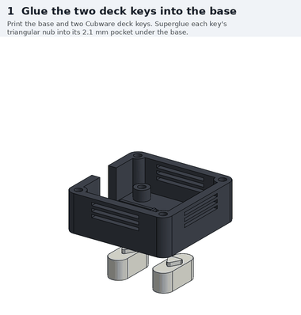

| | |
|---|---|
| 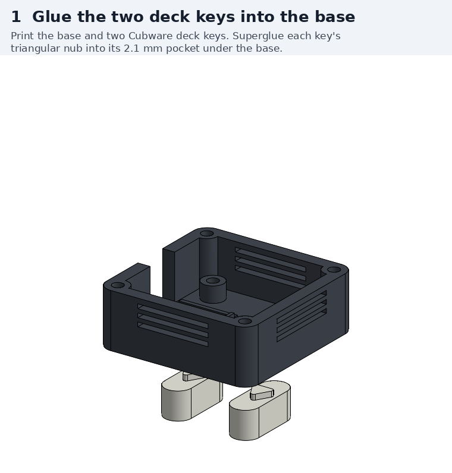 | **1. Glue the two deck keys into the base.** Superglue each key's triangular nub into its 2.1 mm pocket under the base. Glue both while the base sits in two deck slots, so the keys end up exactly 25 mm apart. |
| 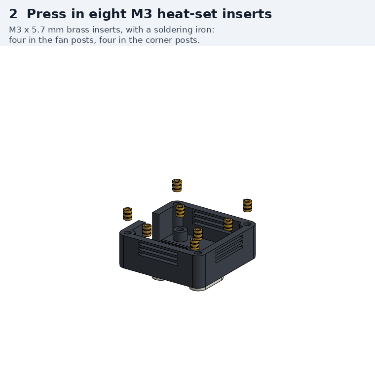 | **2. Press in eight M3 heat-set inserts.** Use a soldering iron at the insert maker's temperature: four go in the fan posts and four in the corner posts. Keep them square, as the fan screws pull straight down into them. |
| 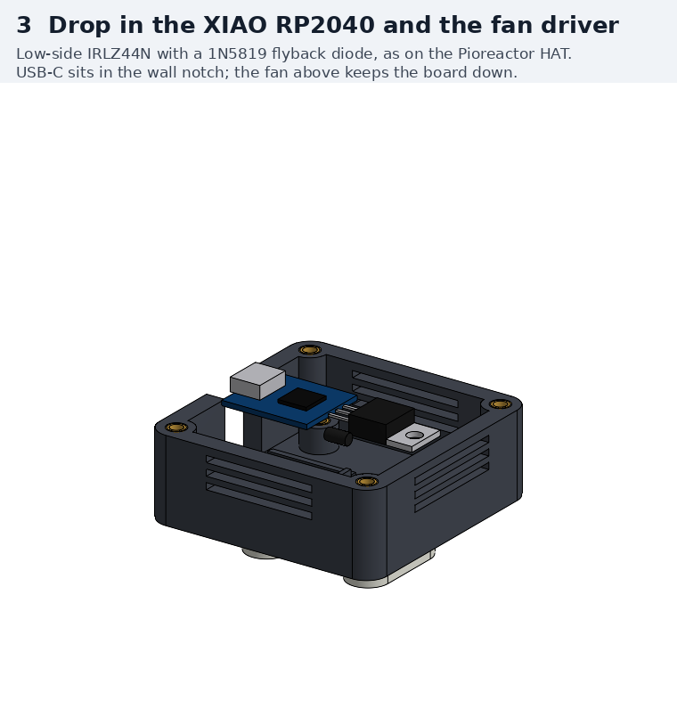 | **3. Wire the electronics, then drop them in.** Solder per the wiring diagram, leaving about 60 mm of lead for the Hall sensor. The XIAO's USB-C goes into the notch in the −X wall, and the rails and the stop locate the board. The MOSFET and diode lie flat on the +X side, held with a dab of hot glue. |
| 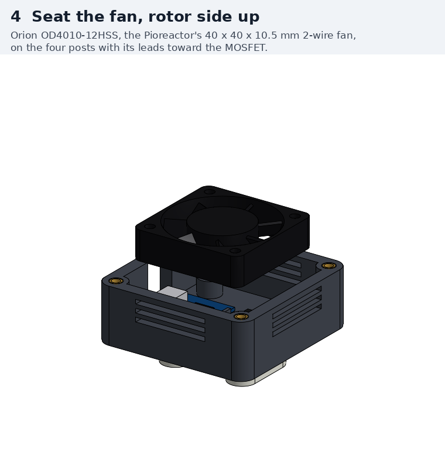 | **4. Seat the fan, rotor side up.** It goes on the four posts with the label side up, so the hub faces the vial. Run its leads to the MOSFET. |
| 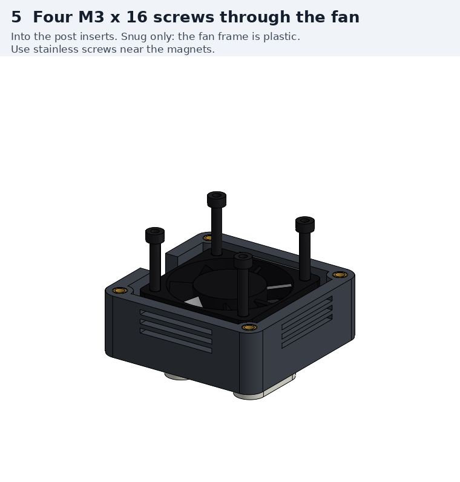 | **5. Four M3 × 16 screws through the fan.** Tighten them snug only, since the fan frame is plastic. Screwed down, the fan can't be lifted by the magnets, which happened on one Pioreactor ([forum 781](https://forum.pioreactor.com/t/self-test-failure-the-fan-stirring-is-spinning-but-no-rpms-were-measured/781/4)). |
| 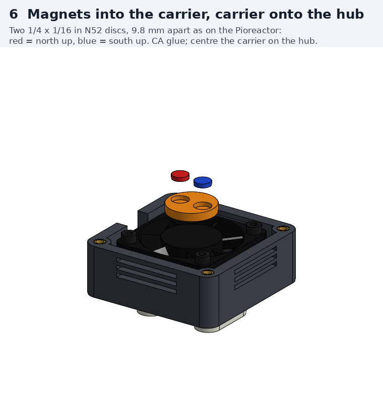 | **6. Magnets into the carrier, carrier onto the hub.** One magnet goes north up and one south up; check with a third magnet, which one attracts and the other repels. CA the magnets into the pockets and the carrier onto the hub, centred: a misaligned drive makes the bar walk. |
| 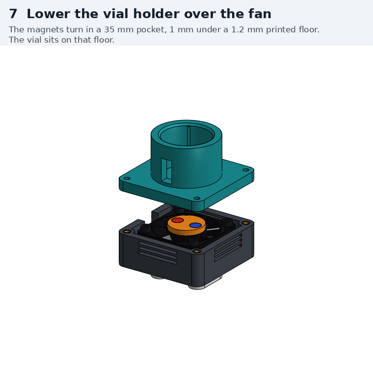 | **7. Glue in the Hall sensor, lower the vial holder.** Glue the US1881 flat on the pocket ceiling at −X, branded face down, beside (not over) the magnets' path. Lay its leads in the groove. Spin the fan by hand before closing up: nothing may touch the carrier. |
| 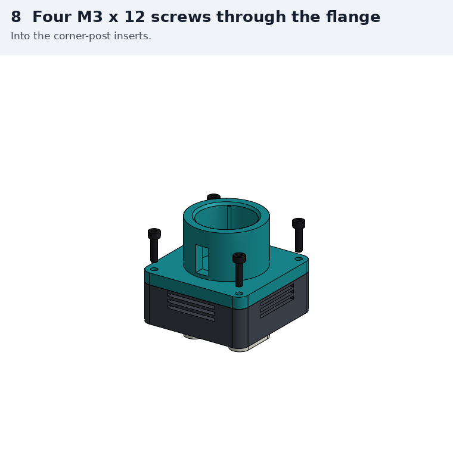 | **8. Four M3 × 12 screws through the flange.** These go into the corner-post inserts. |
| 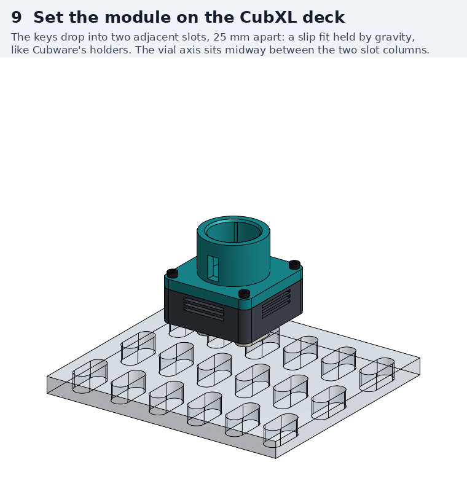 | **9. Set the stirrer on the deck.** The keys drop into two adjacent slots. Route the USB cable away from the gantry's path. |
| 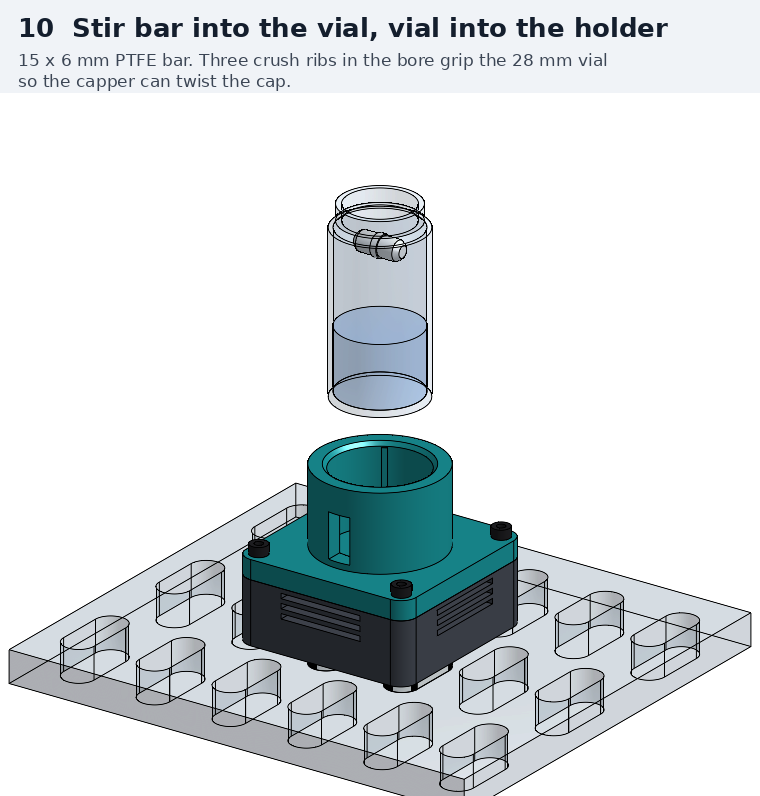 | **10. Stir bar into the vial, vial into the holder.** Three crush ribs grip the 28 mm vial. If the vial is loose or too tight, change `RIB_R` in the FeatureScript and reprint the holder. |

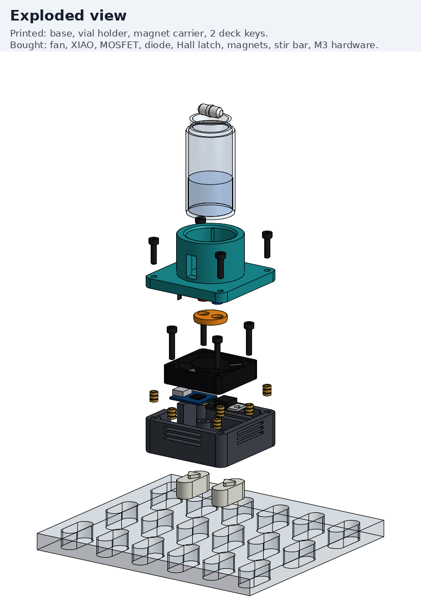

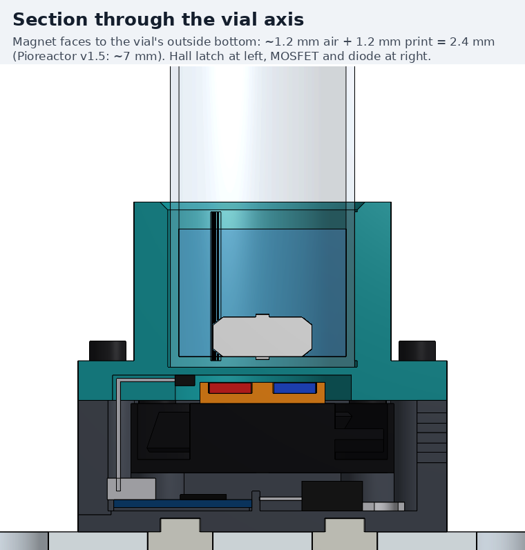

## The numbers behind the stack

z is measured from the top of the deck plate, in mm.

| z | What |
|---|---|
| −10 → 0 | Deck plate; keys in the slots |
| 0 → 3.2 | Base floor (key pockets 2.1 mm deep, 1.1 mm left above them) |
| 3.7 → 8.2 | XIAO RP2040 with USB-C; the MOSFET lies at 3.2 → 7.7 |
| 9.0 → 19.5 | Fan |
| 19.5 → 22.7 | Magnet carrier; magnet faces at 22.6 |
| 22.7 → 23.8 | Running gap, 1.1 mm (Pioreactor: ~1.1) |
| 22.2 → 23.8 | Hall latch, beside the carrier at r 10.3–13.3 mm |
| 23.8 → 25.0 | Printed floor, 1.2 mm |
| 25.0 | Vial bottom (9-vial holder: 18.0) |
| 50.1 | Top of the vial holder |
| ~82 | Vial rim |

From the magnet faces it is 2.4 mm to the vial's outside bottom, and ~4 mm to its inside
bottom with 1.6 mm glass. magpylib puts the horizontal field at the axis of a
15 × 6 mm bar at **~18 mT**. At the Pioreactor's estimated ~7 mm spacing it is ~4 mT.

## Risks and open questions

1. **Coupling may be too strong rather than too weak.** The field at the bar is about
   4× the Pioreactor's, and its users report trouble when the magnets get too close.
   One user's bar would not speed up until the vial was lifted ~6 mm
   ([forum 262](https://forum.pioreactor.com/t/stirring-calibration-intercept/262)).
   Another's stirring stopped at random at 200–250 rpm, which staff put down to the
   magnets sitting too close to the heater board
   ([forum 789](https://forum.pioreactor.com/t/stirring-randomly-stops/789/4)).
   It is cheap to test: print Ø27.6 mm spacer discs, 1, 2 and 3 mm thick, to go under
   the vial, and try each.
2. **A fan-side rpm is not the bar's rpm.** The Hall sensor measures the magnets. The
   Edison coupling summary is explicit that drive feedback cannot see the bar slip.
   Confirm coupling by eye or on camera through the window in the holder's front; the
   deck cameras look down into the vial, which shows the bar too.
3. **The vial must not lift out when the capper pulls a cap.** The keys are a gravity
   slip fit. If the crush ribs grip the vial harder than the stirrer weighs (~80–100 g),
   the whole stirrer comes up with it. PANDA-BEAR has a slide-lock that hooks under the
   plate (`Pill_Slider` + `PillRetainingPin`) if that happens.
4. **Hall margin** is an estimate (±19 mT against a ≤ 9.5 mT trip point). See Wiring
   for the SS49E fallback.
5. **Not measured:** the deck plate (10 mm per the STEP, 9 mm recommended by PANDA-BEAR),
   the Orion hub height (modelled flush with the frame, ±0.5 mm on the fan's 10.5 mm),
   and Ben's vials' actual OD and bottom.
6. **Heating** is unknown. The fan is rated 0.72 W at 12 V and runs here at 5 V. If
   temperature matters, measure the liquid with the stirrer on and off.

## Rebuilding the CAD

```bash
pip install requests pillow
export ONSHAPE_ACCESS_KEY=... ONSHAPE_SECRET_KEY=...    # cad.onshape.com key with write access
python hardware/vial-stirrer-cubxl/build_onshape.py           # upload, rebuild, export STLs, render
python hardware/vial-stirrer-cubxl/build_onshape.py --only section --no-stl   # one render
python hardware/vial-stirrer-cubxl/build_onshape.py --new     # into a fresh document
```

The feature has three inputs: `step` (0 = assembled, 1–10 = the assembly steps),
`exploded`, and `section` (cuts away y < 0). Parts that are bought rather than printed
are modelled from their datasheet dimensions, with no vendor CAD:

- the Orion fan from its 40 × 40 × 10.5 mm envelope and 32 mm hole square;
- the XIAO from Seeed's 21 × 17.5 mm outline;
- the TO-220, TO-92UA and DO-41 packages from their package outlines.

The deck section comes from Cubware's `PandaDeck.step`.
