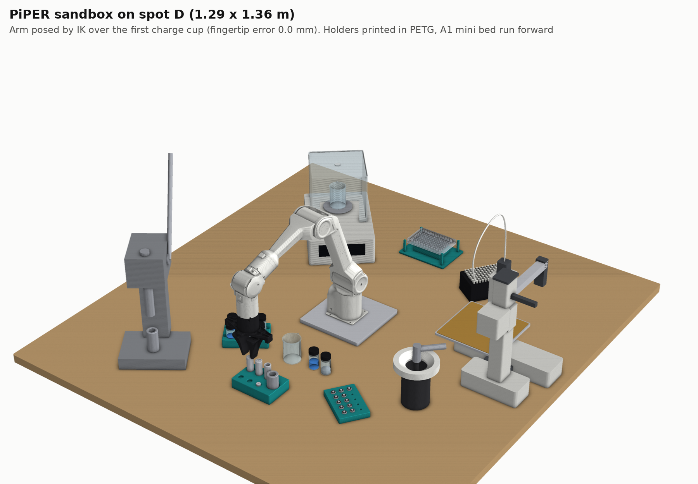
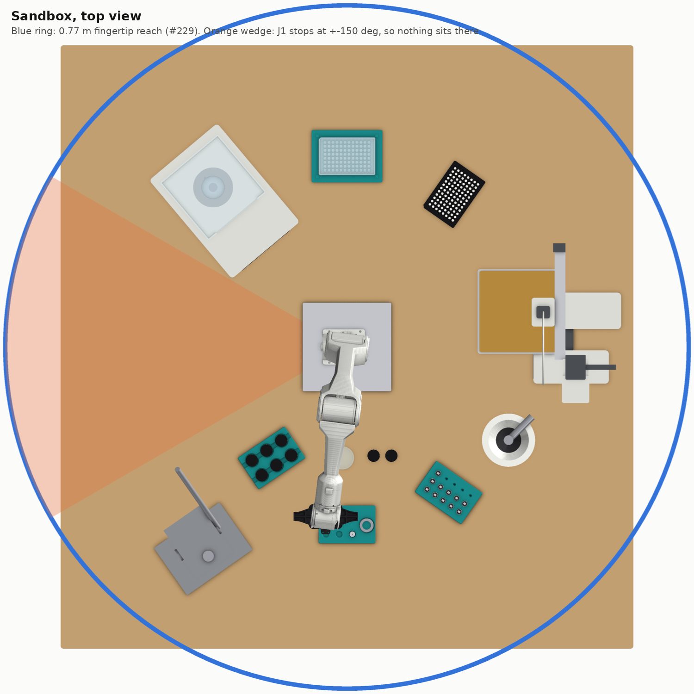
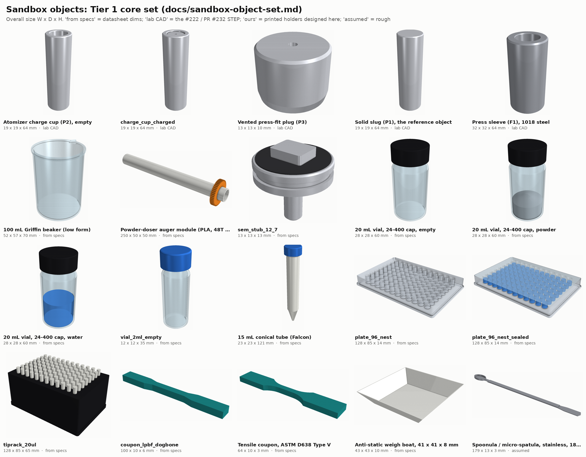
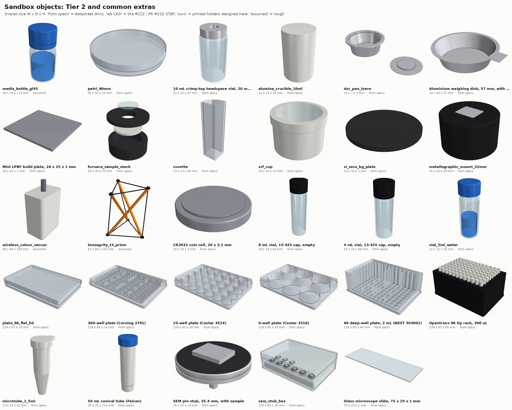
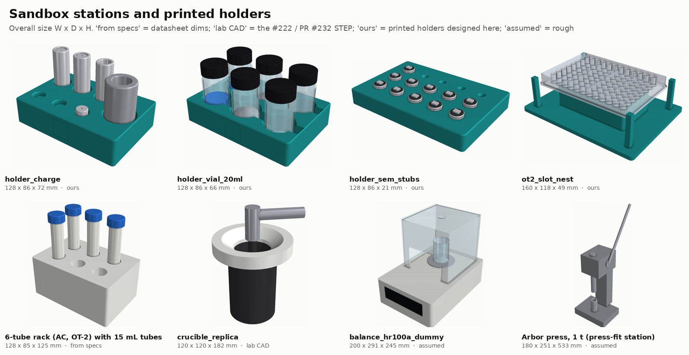
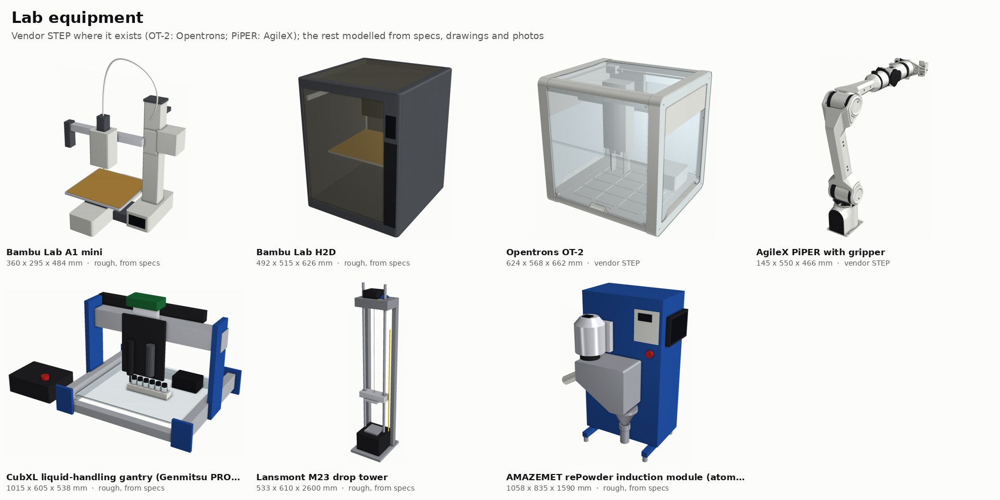
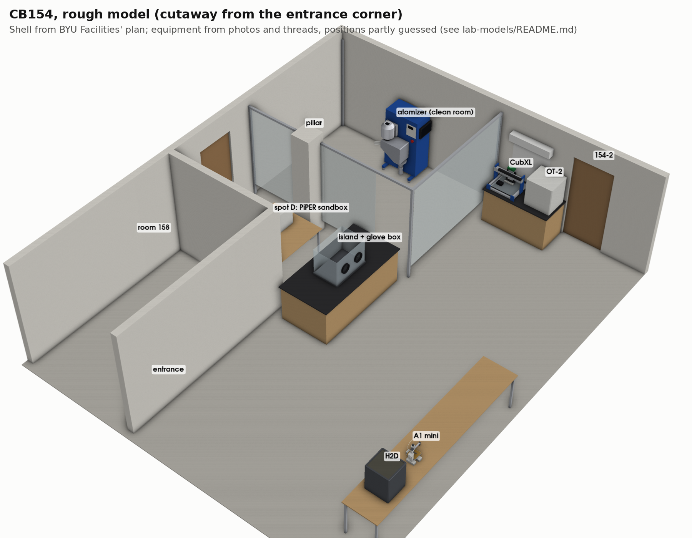
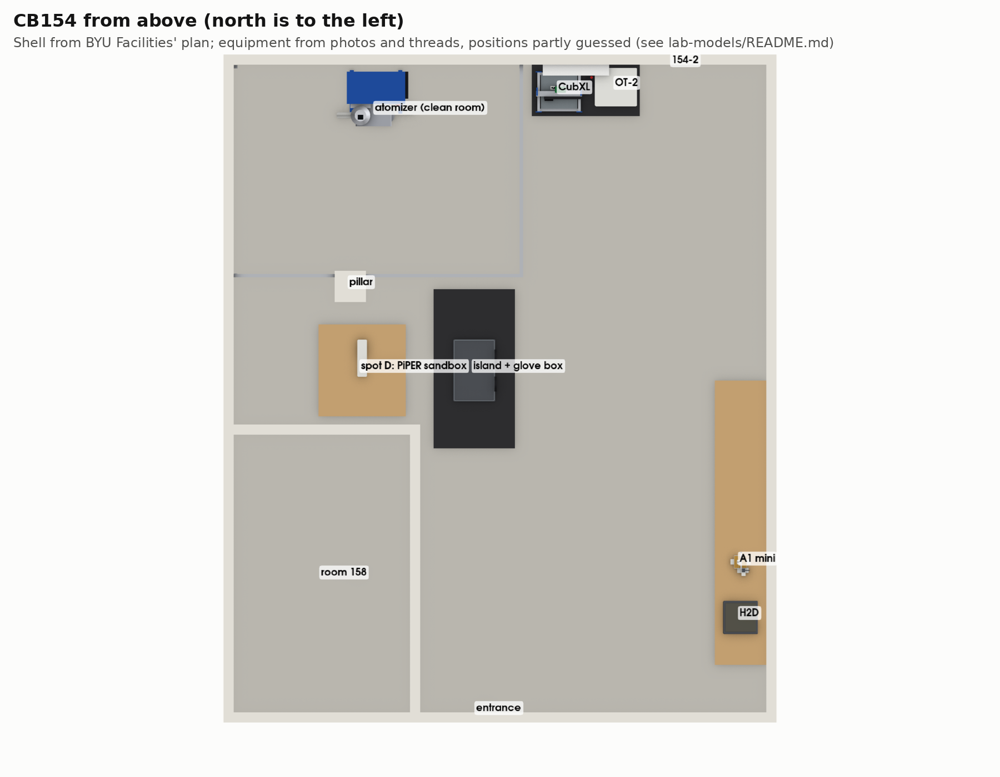
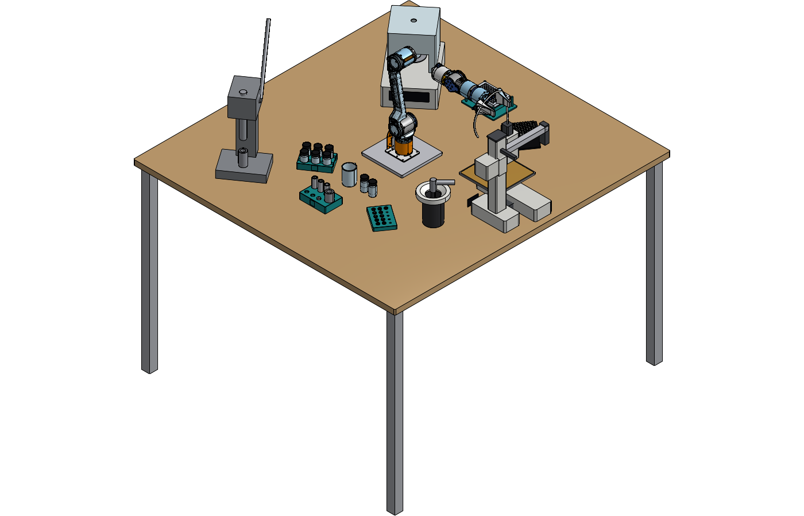
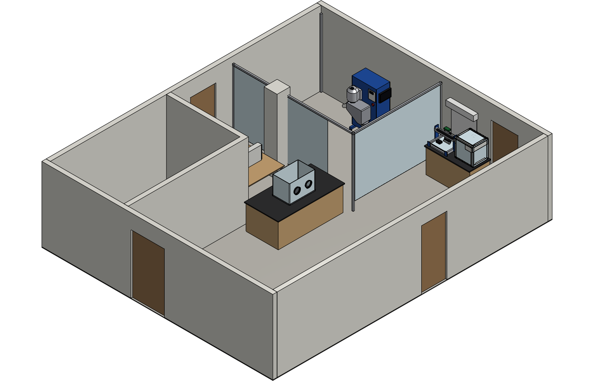

# Lab models: sandbox objects, equipment and CB154

CAD for the PiPER sandbox in [#199](https://github.com/vertical-cloud-lab/byu-vcl/issues/199) and the
lab around it, requested on [PR #240](https://github.com/vertical-cloud-lab/byu-vcl/pull/240):

- the objects in [`docs/sandbox-object-set.md`](../docs/sandbox-object-set.md), plus the stations and
  printed holders they move between;
- the A1 mini, H2D, OT-2, CubXL, PiPER, drop tower and atomizer;
- a rough model of room CB154.

Everything is in Onshape, in **vcl-shared › [Lab Models](https://cad.onshape.com/documents?nodeId=4213db40f9a2525e7c715685&resourceType=folder)**
(links to each document are in [Onshape](#onshape)).

| Where a model comes from | Which ones |
|---|---|
| **Vendor CAD, used as-is** | OT-2 (Opentrons' reference STEP), PiPER with gripper (AgileX's STEP; its URDF meshes pose the arm in renders) |
| **Lab CAD from another branch** | Charge cup, plug, slug and press sleeve, and the crucible replica: #222 / PR #232's STEP files, copied into [`cad/inputs/atomizer-charge/`](cad/inputs/atomizer-charge/) |
| **Modelled from vendor drawings, standards and datasheets** | Every other sandbox object. The sources for each dimension, with verbatim quotes, are in [`sources/labware.json`](sources/labware.json) |
| **Rough models from a spec envelope plus photos** | A1 mini, H2D, CubXL, drop tower, atomizer, and the room |
| **Our designs** | The printed holders and the OT-2 slot nest. Their STLs are in [`exports/labware/`](exports/labware/) |

## Sandbox



The layout is spot D from [#229](https://github.com/vertical-cloud-lab/byu-vcl/issues/229): a 1.29 × 1.36 m table
with the arm in the middle. The stations sit 250–550 mm from the base axis, inside the 0.77 m fingertip reach.

The arm is AgileX's URDF, posed by a small IK solver ([`cad/piper_pose.py`](cad/piper_pose.py)). It is
holding the first charge cup with the fingertips pointing straight down.

**J1 turns only ±150°.** That leaves a 60° wedge on one side that the arm can't face, so nothing goes
there. My first layout had put the A1 mini in that wedge. It now sits on the other side, bed run
forward, where the IK reaches it.



## Sandbox objects

The groups follow [`docs/sandbox-object-set.md`](../docs/sandbox-object-set.md):

- **Tier 1:** all 15 core objects, with their fill states.
- **Tier 2:** most of the extension list.
- **Extras:** vials, plates and tubes that the object list dropped as redundant, kept because they're common.
- **Stations:** the stations and printed holders.







The holders follow the fixture rules in the object list:

- 1–1.5 mm lead-in chamfers.
- ≥1.2 mm diametral clearance.
- Tapered bores for SEM stub pins.
- Finger-relief slots between vials.
- A raised nest narrower than the plate, so stepped fingers can reach under it.
- A 22 mm recess for a 20 mm AprilTag on the front face.

A pitch that leaves the fingers room costs positions. The 20 mL rack holds six vials at 40 mm pitch,
not the 15 a tight grid would fit.

**Dimensions to check against a caliper before trusting them:**

- **Masses, and most glass wall thicknesses.** Vendors don't publish them, so they are estimates
  (marked `estimated_keys` in `sources/labware.json`).
- **The HR-100A dummy and arbor press.** Their outer dimensions are assumed.
- **The crucible replica.** PR #232 scaled it from a drawing; it hasn't been measured.

## Equipment



| Model | Envelope, W × D × H mm | Basis |
|---|---|---|
| Bambu A1 mini | 347 × 315 × 365 | Bambu spec. The layout follows Bambu's own outline drawing, read at 1.615 px/mm: Z column on the right toward the back, X arm cantilevered left, screen on the column base, 183 mm plate |
| Bambu H2D | 492 × 514 × 626 | Bambu spec: 325 × 320 × 325 mm build volume with one nozzle (350 mm wide across both), glass door and lid, dual toolhead |
| Opentrons OT-2 | 624 × 567 × 662 | Opentrons' reference STEP ([github.com/Opentrons/ot2](https://github.com/Opentrons/ot2), "Detailed"). Official size is 63 × 57 × 66 cm |
| AgileX PiPER | 626.75 mm reach | AgileX's arm-plus-gripper STEP, in the pose it ships in. 0–70 mm gripper |
| CubXL | 740 × 605 × 488 | The frame is a **Genmitsu PROVerXL 4030 V2**: the badge is in the #133 and #200 photos, and the [SainSmart spec](https://www.sainsmart.com/products/proverxl-4030-v2) gives 400 × 300 × 110 mm travel. The slotted acrylic deck, tool plate, six-vial rack and control box are from photos |
| Lansmont M23 drop tower | 533 × 610 × 2440 | Lansmont data sheet: 21 × 24 in envelope, 96–120 in tall, 9.06 × 9.06 in table, 60 in max drop |
| AMAZEMET rePowder | 1000 × 800 × 1600 | O&MM p. 42 and Facility Guide p. 7, as restated in the `repowder-reference.zip` uploaded to PR #232 ([unpacked here](https://github.com/vertical-cloud-lab/byu-vcl/tree/323adba/atomizer-charge/repowder-reference)): ≈300 kg on four feet at 714 × 600 mm. Layout from the #124 crate photo and AMAZEMET's render |

**The H2D and A1 mini have no usable vendor CAD.** Bambu publishes none. The best leads are a measured
H2 enclosure STEP on MakerWorld and GrabCAD models, and all of them need an account to download.
MakerWorld returns HTTP 403 even from the CubXL Pi's residential IP. So they stay spec-based until
someone with an account fetches one. The URLs are in [`sources/equipment.json`](sources/equipment.json).

**The Pi did get Bambu's own spec pages.** bambulab.com returns 403 to the runner and 200 through the
CubXL Pi, which confirmed 347 × 315 × 365 mm (5.5 kg) and 492 × 514 × 626 mm (31 kg)
([`sources/bambu_specs_via_pi.json`](sources/bambu_specs_via_pi.json)). A community A1 mini STEP on
Printables turned out to be a loose Y-up likeness at 219 × 272 × 346 mm, so it isn't used.

## CB154



**The shell is from BYU Facilities Planning's plan** ([`cb154.pdf`](../cb154.pdf), annotated copy
[`cb154-annotated.pdf`](../cb154-annotated.pdf)):

- 25.78 × 31.38 ft (7.86 × 9.57 m) inside, 2.62 m to the usable ceiling (#7).
- The doors, pillar and room 158 were read off the plan at about 27.7 mm/px, to about ±0.1 m.
- The atomizer's 14 × 10 ft clean room is in the page's top-left corner (#31).
- Spots D and E are from #229.

**The equipment positions are the rough part.** They come from photos and threads, and
[`cad/room.py`](cad/room.py) marks each one:

- **Placed from evidence:**
  - The atomizer, inside its clean room against a cinderblock wall (#31, #124, the 2026-09-03 "Placing the Atomizer" short).
  - The OT-2, at the right end of the wood counter under the pass-through window, with door 154-2
    immediately to its right. This comes from the OT-2 livestream after the 2026-09-10 move and the #7 photos.
  - The black island with the glove box (#7 photos, the 2026-08-26 multi-doser short).
  - Spot D (#229).
- **Guessed:** the CubXL beside the OT-2 (it moved into CB154 in #133, onto a dark wood bench like
  this one), and the printers on the right-wall tables.
- **Not placed:** the drop tower, which the tensegrity project uses in another lab (#27, #28).



## Onshape

Every document is in vcl-shared › **[Lab Models](https://cad.onshape.com/documents?nodeId=4213db40f9a2525e7c715685&resourceType=folder)**,
owned by the Vertical Cloud Lab team. Each was created straight into the folder, so nothing is left in
the API key owner's account.

| Document | Tabs |
|---|---|
| [Sandbox objects (48a9e11)](https://cad.onshape.com/documents/5964e87149b77f1dbd8048a4/w/bb280ae6b3866dad924c1a29) | `labware_lineup`, every sandbox object in one Part Studio, part names prefixed by object. `sandbox_layout`, spot D. AgileX's PiPER. An assembly, *Sandbox with PiPER*, with the arm on its plate |
| [Lab equipment (48a9e11)](https://cad.onshape.com/documents/5a6a6f0f7cf6afc32e46d316/w/54106e8f2c24cc33369314ff) | A1 mini, H2D, OT-2 (Opentrons' STEP), PiPER (AgileX's STEP), CubXL, Lansmont M23 drop tower, rePowder atomizer |
| [CB154 room (48a9e11)](https://cad.onshape.com/documents/83cbdf78254f49ff840c86f0/w/185522a505c325c4b23f5efc) | The room with its equipment, including Opentrons' real OT-2. The PiPER is an envelope here |

These are Onshape's own shaded views, from the API:

| Sandbox assembly | CB154 |
|---|---|
|  |  |

**The tabs keep their STEP file names.** The public API has no element rename: `POST /elements/...` is
HTTP 405. The run spent 11 calls finding that out before the rename step was dropped.

**A whole-Part-Studio insert makes one assembly instance per part.** For AgileX's arm that is 74
instances, so they all have to be moved together. My first transform moved one, which left the arm
lying on the table. It took 2 more calls to fix.

**The A1 mini's screen changed after the import.** In the Onshape copies it stands 25 mm proud of the
column base. The repo's STEP, made after the import, has it flush.

**API keys *can* create folders.** `POST /folders` works when the body names the owner (`ownerId` of the
team, `ownerType: 1`), and returns HTTP 400 without them. Documents can likewise be created straight
into a team folder, so nothing is left in the key owner's account. Moving an existing document is
still web-app only (#234).

The plan allows 2,500 calls a year, so
[`onshape/onshape_import.py`](onshape/onshape_import.py) waits once before polling rather than polling
fast. This session used **49 calls**, recorded in [`onshape/run_2026-09-26.json`](onshape/run_2026-09-26.json):

- 3 to make the folder;
- 41 for the import, including the 11 failed renames;
- 5 for the shaded views and the arm fix.

A research sub-agent also searched Onshape's public documents for H2D CAD with the same key, read-only.
That search found only a crude block model, and it spent a few more calls.

The imported parts are solids, not native Onshape features. To edit one, change the numbers in the
CadQuery source and re-import.

## Running it

```bash
pip install -r cad/requirements.txt
cd cad
python build.py                                                             # STEP + STL into ../exports
xvfb-run -a -s "-screen 0 1920x1080x24" python build.py --render --onshape  # + renders, + the Onshape scene files
cd ../onshape && python onshape_import.py --dry-run                         # what an import would upload
```

- **Vendor CAD is fetched, not committed.** [`cad/vendor.py`](cad/vendor.py) downloads AgileX's and
  Opentrons' STEP files into `cad/.cache/` and checks each one's SHA-256. Neither ships with a
  licence file. Opentrons' README offers the files "for our community to modify their OT-2 robots
  however they choose".
- **Exports that hold vendor geometry stay out of git.** `exports/onshape/` is the room and sandbox
  with the real OT-2 and PiPER in them.
- **Three large aggregates are also left out**, since `build.py` rebuilds them in about a minute:
  the labware lineup (20 MB), the sandbox layout and the 384-well plate.
