# Lab models: sandbox objects, equipment and CB154

CAD for the PiPER sandbox in [#199](https://github.com/vertical-cloud-lab/byu-vcl/issues/199) and the
lab around it, requested on [PR #240](https://github.com/vertical-cloud-lab/byu-vcl/pull/240):

- the objects in [`docs/sandbox-object-set.md`](../docs/sandbox-object-set.md), plus the stations and
  printed holders they move between;
- the A1 mini, H2D, OT-2, CubXL, PiPER, drop tower and atomizer;
- the doser's HR-100A balance with its breeze break, the cheap glove box from PR #78, and the
  Aconity MIDI metal printer;
- a rough model of room CB154.

Everything is in Onshape, in **vcl-shared › [Lab Models](https://cad.onshape.com/documents?nodeId=4213db40f9a2525e7c715685&resourceType=folder)**
(links to each document are in [Onshape](#onshape)).

| Where a model comes from | Which ones |
|---|---|
| **Vendor CAD, used as-is** | OT-2 (Opentrons' reference STEP), PiPER with gripper (AgileX's STEP; its URDF meshes pose the arm in renders) |
| **Lab CAD from another branch** | Charge cup, plug, slug and press sleeve, and the crucible replica: #222 / PR #232's STEP files, copied into [`cad/inputs/atomizer-charge/`](cad/inputs/atomizer-charge/) |
| **Modelled from vendor drawings, standards and datasheets** | Every other sandbox object. The sources for each dimension, with verbatim quotes, are in [`sources/labware.json`](sources/labware.json). Also the HR-100A ([`sources/hr100a.json`](sources/hr100a.json)), and the glove box's liner, window, ports and transfer chamber ([`sources/glovebox.json`](sources/glovebox.json)) |
| **Rough models from a spec envelope plus photos** | A1 mini, H2D, CubXL, drop tower, atomizer, Aconity MIDI ([`sources/aconity_midi.json`](sources/aconity_midi.json)), the glove box's control column and rear, and the room |
| **Our designs** | The printed holders and the OT-2 slot nest. Their STLs are in [`exports/labware/`](exports/labware/) |

## Sandbox

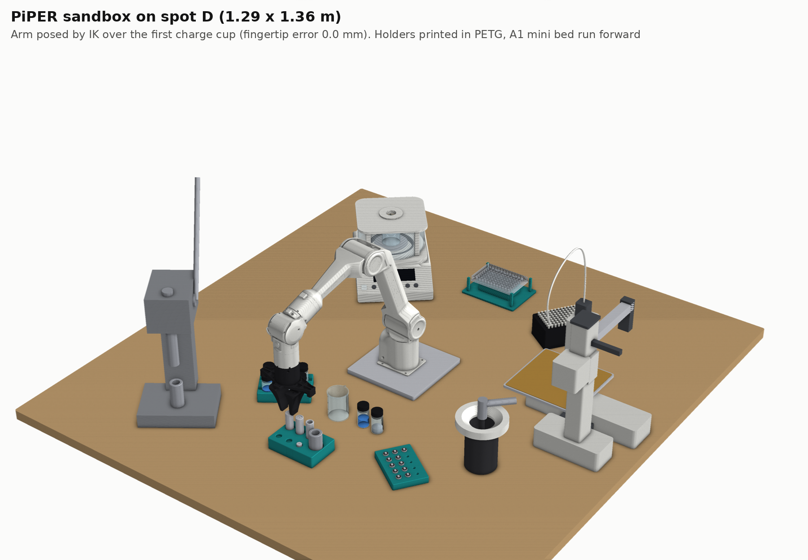

The layout is spot D from [#229](https://github.com/vertical-cloud-lab/byu-vcl/issues/229): a 1.29 × 1.36 m table
with the arm in the middle. The stations sit 250–550 mm from the base axis, inside the 0.77 m fingertip reach.

The arm is AgileX's URDF, posed by a small IK solver ([`cad/piper_pose.py`](cad/piper_pose.py)). It is
holding the first charge cup with the fingertips pointing straight down.

**J1 turns only ±150°.** That leaves a 60° wedge on one side that the arm can't face, so nothing goes
there. My first layout had put the A1 mini in that wedge. It now sits on the other side, bed run
forward, where the IK reaches it.

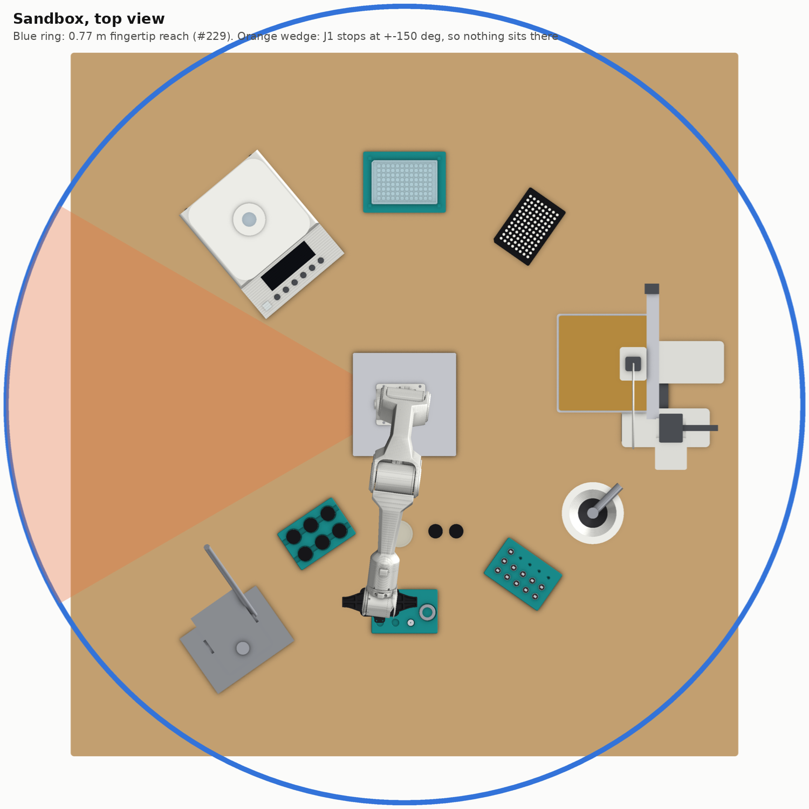

## Sandbox objects

The groups follow [`docs/sandbox-object-set.md`](../docs/sandbox-object-set.md):

- **Tier 1:** all 15 core objects, with their fill states.
- **Tier 2:** most of the extension list.
- **Extras:** vials, plates and tubes that the object list dropped as redundant, kept because they're common.
- **Stations:** the stations and printed holders.

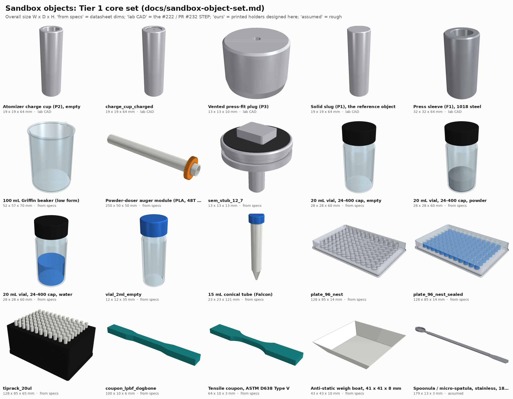

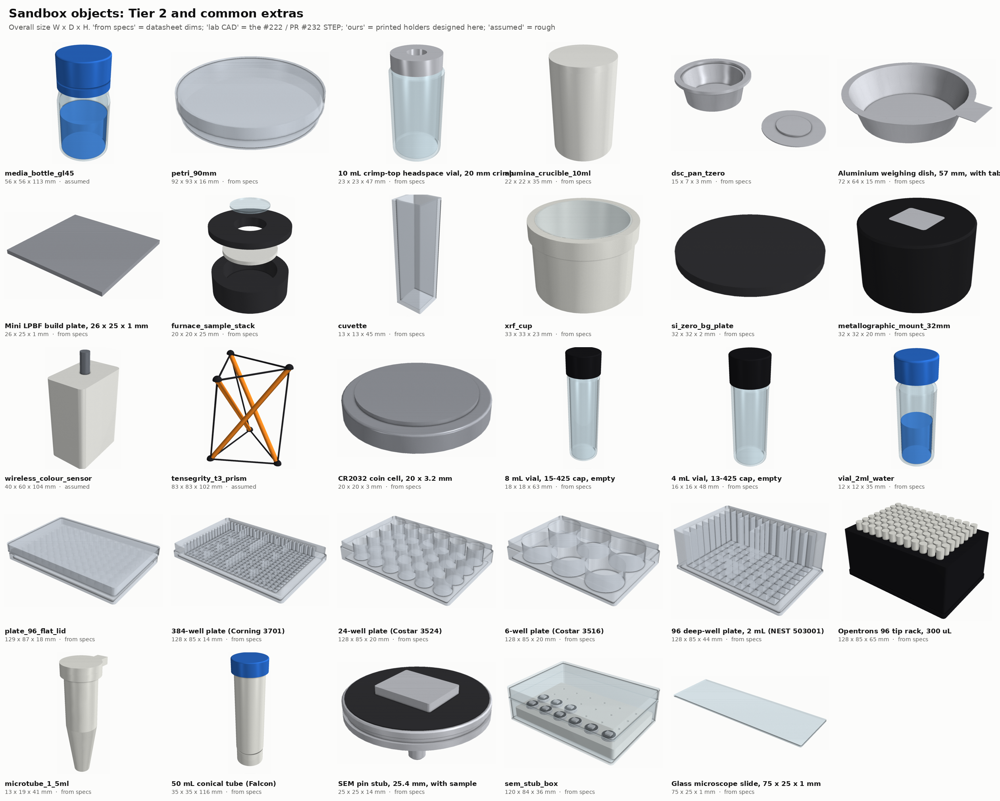

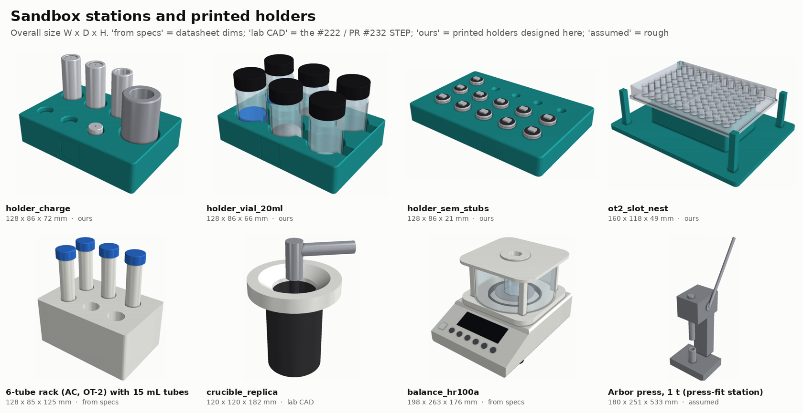

The holders follow the fixture rules in the object list:

- 1–1.5 mm lead-in chamfers.
- ≥1.2 mm diametral clearance.
- Tapered bores for SEM stub pins.
- Finger-relief slots between vials.
- A raised nest narrower than the plate, so stepped fingers can reach under it.
- A 22 mm recess for a 20 mm AprilTag on the front face.

A pitch that leaves the fingers room costs positions. The 20 mL rack holds six vials at 40 mm pitch,
not the 15 a tight grid would fit.

**Dimensions to check against a caliper before trusting them:**

- **Masses, and most glass wall thicknesses.** Vendors don't publish them, so they are estimates
  (marked `estimated_keys` in `sources/labware.json`).
- **The HR-100A's pan height and lid.** The model uses the manual's 86.5 mm pan, which matches the
  lab's 79.4 mm pan-to-lid measurement. Units with A&D's 2022 one-piece pan sit at 90.5 mm. The lid
  looks clear rather than white in the August rig photos, so it may have been swapped.
- **The arbor press.** Its outer dimensions are assumed.
- **The crucible replica.** PR #232 scaled it from a drawing; it hasn't been measured.

## The doser's balance: HR-100A with its breeze break

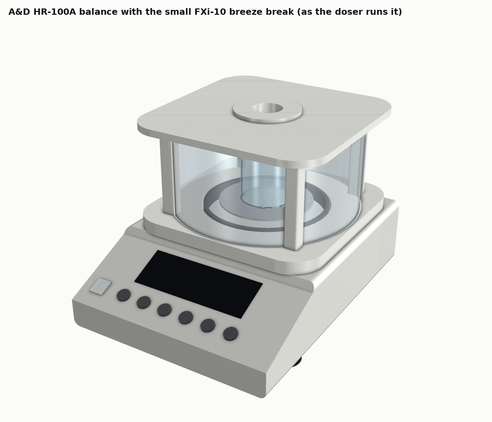

**The lab doesn't run the stock breeze break.** The HR-100A ships with a 315 mm tall cylindrical
chamber. The lab's unit carries A&D's small FXi-10 break instead: the set-up photo in #2 matches it,
and no doser photo shows the tall one. It has a white base plate, four posts, four bowed clear panels
and a lid with a centre cap. The dummy this replaces was a 200 × 290 mm body under a 160 mm box, so
it was too deep and too tall.

- **Overall:** 198 × 262 × 176 mm and 3.5 kg, with a Ø90 mm pan centred 168.5 mm back from the front.
- **The break:** 184 × 184 mm outside, 171.5 mm inside. Each clear panel lifts out and leaves a
  115 × 83.5 mm opening, which is the arm's way in.
- **The drop hole is the lid's centre opening,** about Ø28 mm with the cap out. The doser's auger
  sits on a bridge above the break and drops powder through it into the beaker. Nothing comes in
  from the side.
- **Vessels must be under 3 in** because the lab measured 79.4 mm (3.125 in) from the pan to the
  lid's underside. The 70 mm Griffin beaker clears it by about 9 mm. On 2026-08-19 a taller beaker
  let the lid rest on it and overloaded the balance.
- **Sourced vs scaled:** A&D's drawings and spec pages give the outline, the pan, the feet and the
  break's 184, 171.5, 115 and 83.5 mm. The deck height, display slope, post positions and lid details
  are scaled off A&D's vector drawings (±3 mm). [`sources/hr100a.json`](sources/hr100a.json) marks
  each one, and also has the stock chamber's dimensions.

Two things aren't modelled. The doser's bridge has a ~265 mm leg span, but that is a one-photo
estimate. The granite slab proposed in powder-doser#146 is still an open issue.

## Equipment

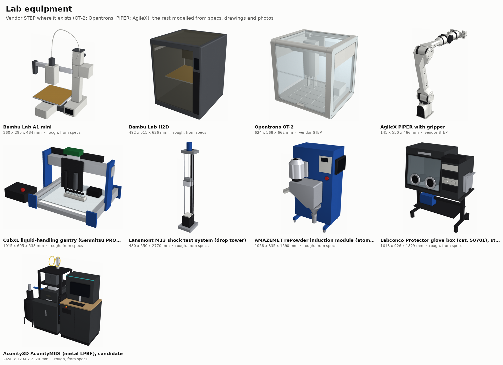

| Model | Envelope, W × D × H mm | Basis |
|---|---|---|
| Bambu A1 mini | 347 × 315 × 365 | Bambu spec. The layout follows Bambu's own outline drawing, read at 1.615 px/mm: Z column on the right toward the back, X arm cantilevered left, screen on the column base, 183 mm plate |
| Bambu H2D | 492 × 514 × 626 | Bambu spec: 325 × 320 × 325 mm build volume with one nozzle (350 mm wide across both), glass door and lid, dual toolhead |
| Opentrons OT-2 | 624 × 567 × 662 | Opentrons' reference STEP ([github.com/Opentrons/ot2](https://github.com/Opentrons/ot2), "Detailed"). Official size is 63 × 57 × 66 cm |
| AgileX PiPER | 626.75 mm reach | AgileX's arm-plus-gripper STEP, in the pose it ships in. 0–70 mm gripper |
| CubXL | 740 × 605 × 488 | The frame is a **Genmitsu PROVerXL 4030 V2**: the badge is in the #133 and #200 photos, and the [SainSmart spec](https://www.sainsmart.com/products/proverxl-4030-v2) gives 400 × 300 × 110 mm travel. The slotted acrylic deck, tool plate, six-vial rack and control box are from photos |
| Lansmont M23 drop tower | 533 × 610 × 2800 | Lansmont data sheet: 21 × 24 in envelope, 96–120 in tall, 9.06 × 9.06 in table. The frame is from the lab's photos ([`sources/drop_tower.json`](sources/drop_tower.json)): two ~25 mm rods ~280 mm apart, one rear column, a latch head, ~2.8 m as set up. It lives in the SMASH Lab, CB 152A |
| AMAZEMET rePowder | 1000 × 800 × 1600 | O&MM p. 42 and Facility Guide p. 7, as restated in the `repowder-reference.zip` uploaded to PR #232 ([unpacked here](https://github.com/vertical-cloud-lab/byu-vcl/tree/323adba/atomizer-charge/repowder-reference)): ≈300 kg on four feet at 714 × 600 mm. Layout from the #124 crate photo and AMAZEMET's render |
| Labconco Protector glove box, cat. 50701 (not bought) | 1613 × 762 × 1829 on its stand | Labconco's drawing and 2002 manual for the liner, window, ports and transfer chamber; the seller's 38 in height; the LabX listing's 44 photos for the control column, purifier and bubbler ([`sources/glovebox.json`](sources/glovebox.json)) |
| Aconity3D AconityMIDI (candidate) | 2450 × 1500 × 2320 | Aconity's current spec, 1450 kg, Ø170 × 200 mm build. Blocks scaled from front photos; every depth is a guess ([`sources/aconity_midi.json`](sources/aconity_midi.json)) |

**The H2D and A1 mini have no usable vendor CAD.** Bambu publishes none. The best leads are a measured
H2 enclosure STEP on MakerWorld and GrabCAD models, and all of them need an account to download.
MakerWorld returns HTTP 403 even from the CubXL Pi's residential IP. So they stay spec-based until
someone with an account fetches one. The URLs are in [`sources/equipment.json`](sources/equipment.json).

**The glove box is the cheap pick from PR #78:** the used $2,999 Labconco in Alabama that Gage
proposed and Sterling agreed to on 2026-07-20. Nothing has been bought or quoted since. Its photos
correct two earlier assumptions:

- **It isn't fiberglass.** The data plate reads catalog 50701-00, which Labconco's 2002 manual
  decodes as a type 304 stainless liner with automatic pressure control, 115 V. That makes it
  groundable.
- **It isn't purge-only.** An AtmosPure 51218-00 purifier is already mounted at the back. Its
  condition is unknown.

Two more things to settle before buying:

- **The listing may be stale.** Its record says available 2024-04-13 to 2024-07-12, though it is
  still flagged active.
- **The Welch pump is listed separately.** Ask whether it is included.

Inside, the box is 902 W × 711 D × 813 H mm at the front. The two 8 in ports are at 1.10 m on the
34 in stand, and the transfer chamber on the right end is 11 × 13 × 20 in inside. The HR-100A fits
the transfer chamber easily. The doser's bridge must fit it too, or go in through the window frame.

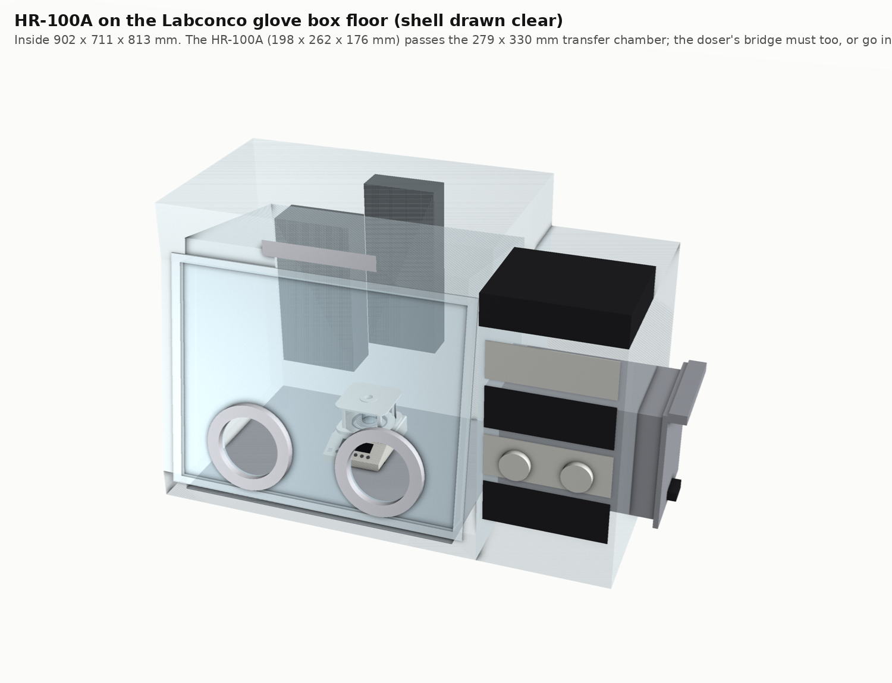

**The Aconity MIDI is a candidate, not a purchase.** Aconity's current figure is 2450 × 1500 ×
2320 mm and 1450 kg. The 2018 and 2022 sheets give 2170 × 1590 × 2340 mm for the older design, so a
box covering both is 2450 × 1590 × 2340. The machine has three parts:

- a side-standing filter unit;
- the base cabinet, with the exchangeable Ø170 × 200 mm process chamber on top and an aluminium
  portal carrying two scan heads above that;
- a control cabinet with a wood worktop.

It has no glove ports. It is anthracite, not white. It also needs services the model doesn't show:

- argon and compressed air at 6 bar;
- 208 V three-phase at 32 A (Aconity's UL option);
- a ~15 kW chiller for the heated platform or lasers over 400 W.

At ~3.9 kN/m² on levelling feet, check the floor rating. The MIDI+ is bigger all round: 2700 ×
1800 × 3000 mm, a Ø250 × 250 mm build and up to four lasers.

**The Pi did get Bambu's own spec pages.** bambulab.com returns 403 to the runner and 200 through the
CubXL Pi, which confirmed 347 × 315 × 365 mm (5.5 kg) and 492 × 514 × 626 mm (31 kg)
([`sources/bambu_specs_via_pi.json`](sources/bambu_specs_via_pi.json)). A community A1 mini STEP on
Printables turned out to be a loose Y-up likeness at 219 × 272 × 346 mm, so it isn't used.

## CB154

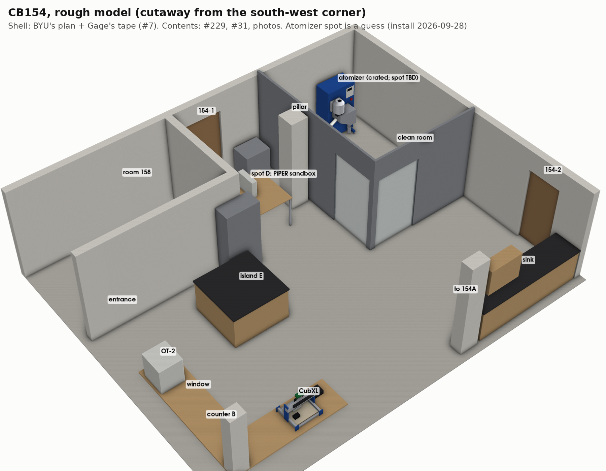

**Frame:** compass coordinates. The origin is the inside south-west corner, +x points east along the long
walls and +y points north. The plan's north arrow points to the page's left, so on
[`cb154.pdf`](../cb154.pdf) page-top is east.

**The shell** is 9601 × 7874 mm (378 × 310 in) inside, with 2.62 m to the lowest ducts:

- **The size is Gage's tape measurement in #7.** BYU Facilities' plan and its annotated copy
  (25.78 × 31.38 ft) agree with it to within 0.5%.
- **Room 158** is cut into the NW corner.
- **Doors:** the entrance is in the west wall, 154-2 in the east wall, 154-1 in the north wall and the
  door to 154A in the south wall.
- **Other features:** the roll-up service window in the west wall, the pillar, the pilaster, and the
  steel-walled 14 × 10 × 9 ft clean room in the NE corner.

**What's in it** is from [`sources/cb154_room.json`](sources/cb154_room.json). A research pass built
that file by checking the plan against the #7 sketch, the #229 render, #31 and the room photos:

- **Sure:**
  - The wall-hung L-counter in the SW corner: leg B along the west wall under the window, leg A along
    the south wall with black shelves above.
  - The sink and eyewash casework from the SE corner to the pilaster.
- **Placed:**
  - The OT-2, at the north end of counter B next to the entrance, where the livestream shows it.
  - The CubXL on counter A, moved in on 2026-09-22.
  - Spot D, the PiPER tables against room 158's east wall (#229).
- **Approximate (±0.5 m):** island E.
- **A guess:** the atomizer. It is still crated in the clean room, and AMAZEMET places it at install
  (2026-09-28).
- **Low confidence:** the grey cabinet and the transformer. The transformer's size is assumed.
- **Not in CB154:**
  - the drop tower, which the tensegrity project uses in another lab;
  - the printers;
  - the glove box and the metal printer. Neither has been bought, but both are modelled under
    [Equipment](#equipment).

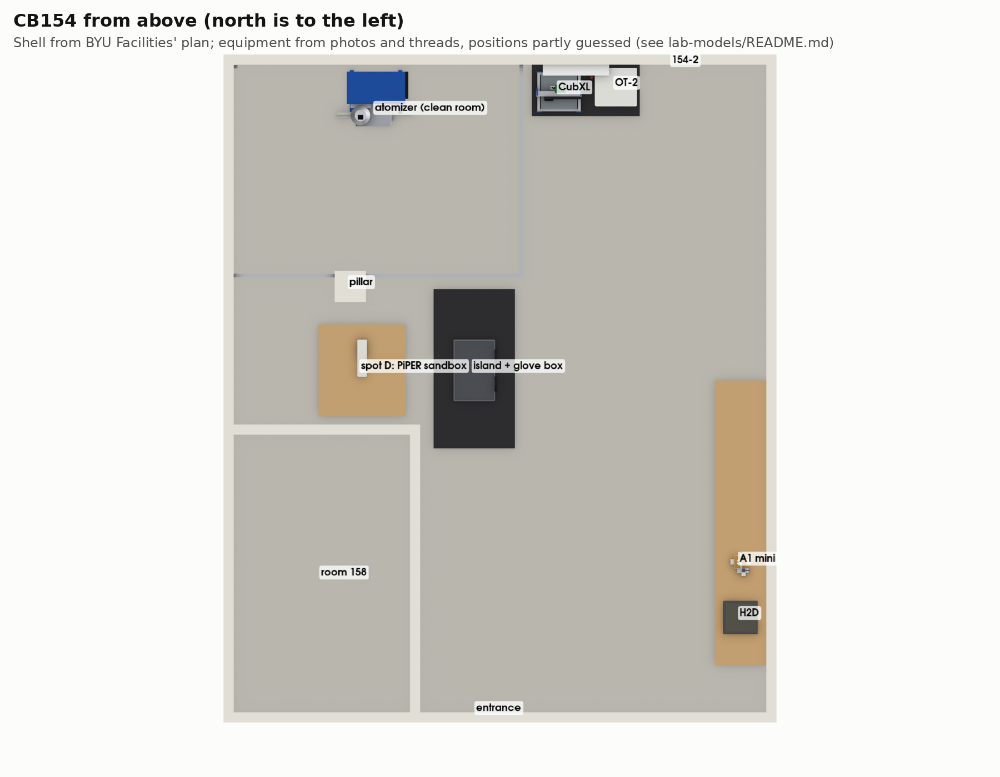

## Onshape

Every document is in vcl-shared › **[Lab Models](https://cad.onshape.com/documents?nodeId=4213db40f9a2525e7c715685&resourceType=folder)**,
owned by the Vertical Cloud Lab team. Each was created straight into the folder, so nothing is left in
the API key owner's account.

| Document | Tabs |
|---|---|
| [Sandbox objects (48a9e11)](https://cad.onshape.com/documents/5964e87149b77f1dbd8048a4/w/bb280ae6b3866dad924c1a29) | `labware_lineup`, every sandbox object in one Part Studio, part names prefixed by object. AgileX's PiPER. The layout twice: `sandbox_layout_hr100a` is current, and `sandbox_layout` is the earlier one with the dummy balance. `balance_hr100a` on its own. Two assemblies with the arm on its plate: *Sandbox with PiPER (HR-100A)* is current |
| [Lab equipment (48a9e11)](https://cad.onshape.com/documents/5a6a6f0f7cf6afc32e46d316/w/54106e8f2c24cc33369314ff) | A1 mini, H2D, OT-2 (Opentrons' STEP), PiPER (AgileX's STEP), CubXL, rePowder atomizer, `balance_hr100a`, `labconco_glovebox`, `aconity_midi`, and the drop tower twice. `lansmont_m23_drop_tower_from_photos` is current; `lansmont_m23_drop_tower` is the earlier data-sheet-only model |
| [CB154 room (968a35d)](https://cad.onshape.com/documents/83cbdf78254f49ff840c86f0/w/185522a505c325c4b23f5efc) | The room with its equipment, including Opentrons' real OT-2. The PiPER is an envelope here. It has two `cb154_room` tabs: the **newer** one is the corrected layout, and the older one has walls in the wrong places |

These are Onshape's own shaded views, from the API:

| Sandbox assembly | CB154 |
|---|---|
| 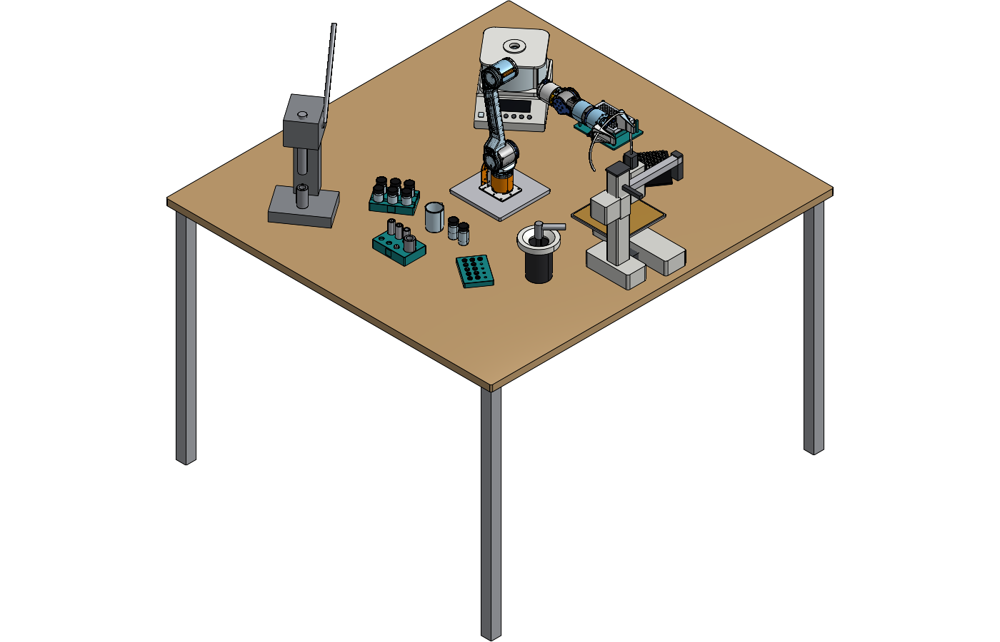 | 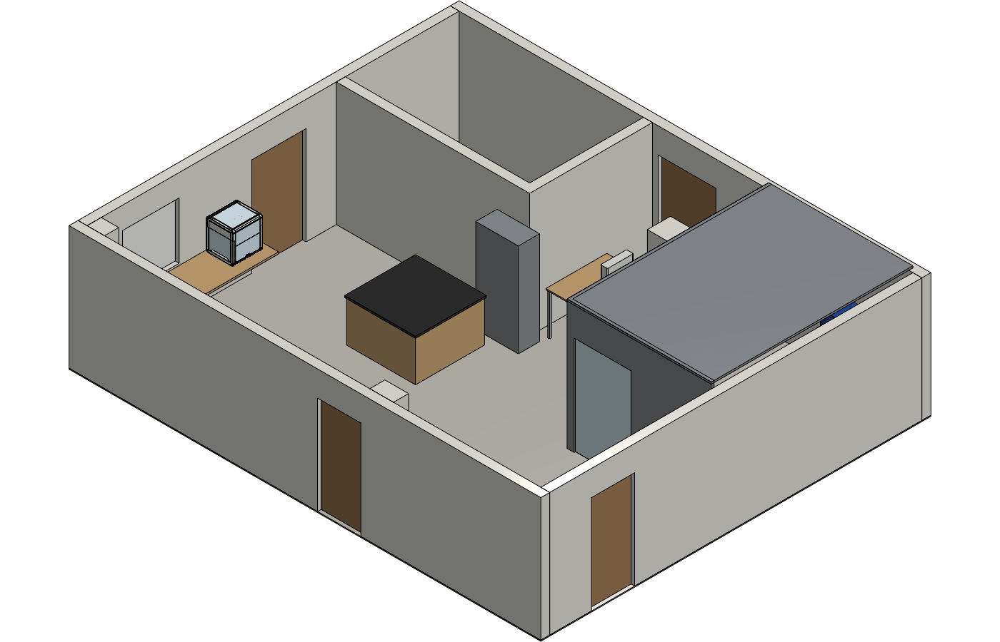 |
| **Glove box** | **Aconity MIDI** |
| 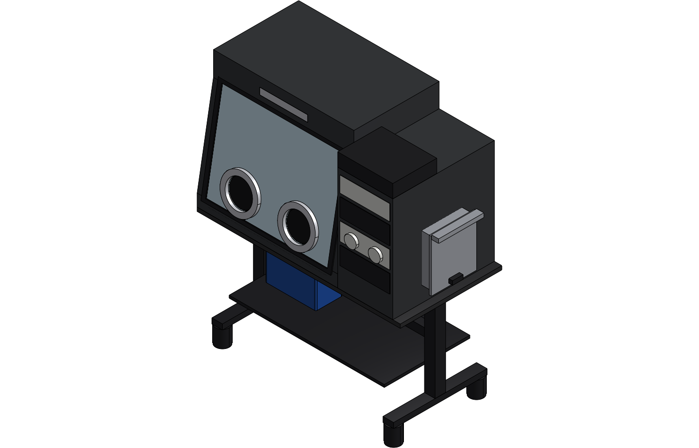 | 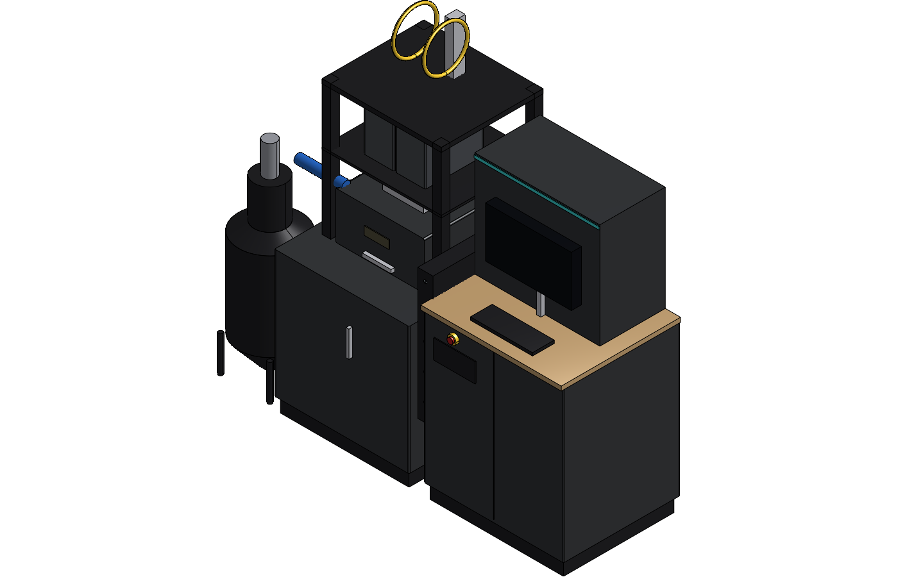 |

**The tabs keep their STEP file names.** The public API has no element rename: `POST /elements/...` is
HTTP 405. The run spent 11 calls finding that out before the rename step was dropped.

**A whole-Part-Studio insert makes one assembly instance per part.** For AgileX's arm that is 74
instances, so they all have to be moved together. My first transform moved one, which left the arm
lying on the table. It took 2 more calls to fix.

**The API key has no delete scope.** `DELETE /elements/...` returns HTTP 403 "Invalid API key state", so
the superseded room and drop tower tabs have to be deleted in the web app.

**The A1 mini's screen changed after the import.** In the Onshape copies it stands 25 mm proud of the
column base. The repo's STEP, made after the import, has it flush.

**API keys *can* create folders.** `POST /folders` works when the body names the owner (`ownerId` of the
team, `ownerType: 1`), and returns HTTP 400 without them. Documents can likewise be created straight
into a team folder, so nothing is left in the key owner's account. Moving an existing document is
still web-app only (#234).

**The budget is 2,500 calls a year, shared by the whole company.** That is the *EDU Educator / Pro
Discovery* row of [Onshape's limits](https://onshape-public.github.io/docs/auth/limits/), "2,500 per
Company". Only 2xx and 3xx responses count, so [`onshape/onshape_import.py`](onshape/onshape_import.py)
waits once before polling rather than polling fast. The first session made **57 calls**, recorded in
[`onshape/run_2026-09-26.json`](onshape/run_2026-09-26.json). About 45 of them counted, because the
refused renames and the refused delete were free:

- 3 to make the folder;
- 41 for the import, including the 11 failed renames;
- 5 for the shaded views and the arm fix;
- 8 to re-import the corrected room and the refined drop tower, including one refused delete.

A research sub-agent also searched Onshape's public documents for H2D CAD with the same key, read-only.
That search found only a crude block model, and it spent a few more calls. **Don't repeat it.**
Onshape's API terms bar automated "data gathering" from public documents.

The second session made **19 calls**, all counted:

- 15 to add the HR-100A, glove box and Aconity tabs and the new layout and assembly
  (`--add equipment sandbox`, recorded in [`onshape/run_2026-09-27_add.json`](onshape/run_2026-09-27_add.json));
- 4 for the shaded views above.

**Getting more calls:**

- **A second person's own key adds their budget, not the lab's.** Calls count against whoever
  owns the key. A key made in *My Account › Developer* draws on that user's allowance, which is
  2,500 a year on EDU Student, Free and Standard. Share the Lab Models folder with them and the key
  can import into these documents.
- **Import into the shared documents rather than making new ones.** A document a Free account
  *owns* is public.
- **Onshape's own route is to buy more.** "Additional API calls are available for purchase upon
  request."
- **Browser and mobile use is free.** Neither counts, so web-app clean-up such as deleting the
  superseded tabs costs nothing.

The imported parts are solids, not native Onshape features. To edit one, change the numbers in the
CadQuery source and re-import.

## Running it

```bash
pip install -r cad/requirements.txt
cd cad
python build.py                                                             # STEP + STL into ../exports
xvfb-run -a -s "-screen 0 1920x1080x24" python build.py --render --onshape  # + renders, + the Onshape scene files
cd ../onshape && python onshape_import.py --dry-run                         # what an import would upload
```

- **Vendor CAD is fetched, not committed.** [`cad/vendor.py`](cad/vendor.py) downloads AgileX's and
  Opentrons' STEP files into `cad/.cache/` and checks each one's SHA-256. Neither ships with a
  licence file. Opentrons' README offers the files "for our community to modify their OT-2 robots
  however they choose".
- **Exports that hold vendor geometry stay out of git.** `exports/onshape/` is the room and sandbox
  with the real OT-2 and PiPER in them.
- **Three large aggregates are also left out**, since `build.py` rebuilds them in about a minute:
  the labware lineup (20 MB), the sandbox layout and the 384-well plate.
