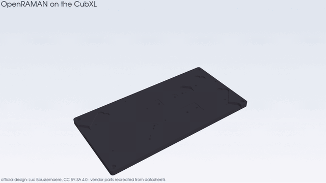
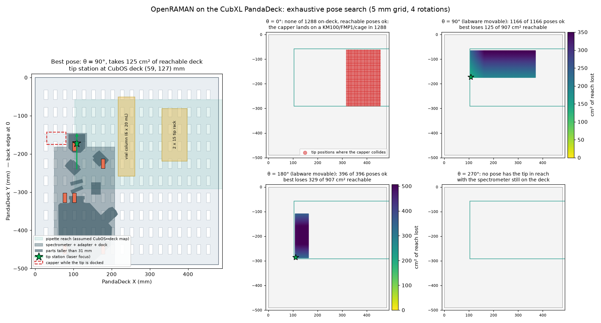

# OpenRAMAN on the CubXL

The [OpenRAMAN](https://www.open-raman.org/) base spectrometer, priced line by line and
brought onto the CubXL's PandaDeck peg board with a dock that holds a pipette tip at the
laser focus, as Ben sketched in
[#213](https://github.com/vertical-cloud-lab/byu-vcl/issues/213).



| | |
|---|---|
| Spectrometer as specified (official BOM, custom parts printed in-house) | **$2,750.12** |
| Running on the CubXL with the tip dock | **$2,914.72** |
| Official vial cuvette instead of / as well as the tip dock | +$214.14 |
| For comparison: OpenRAMAN's assembled base spectrometer ([shop](https://www.open-raman.org/shop/)) | €4,999 |

Prices are list prices fetched on 2026-10-10 from the stream-cam Pi, without shipping or tax.
The camera ($850.50) and the Thorlabs optics and mechanics ($2,005.66) are 98 % of the total.

## What's here

| Folder | Contents |
|---|---|
| [`bom/`](bom/) | [`bom_tables.md`](bom/bom_tables.md) (every line, totals, shopping list by vendor) and `bom.csv`, generated by `build_bom.py` from the raw vendor responses in `bom/raw/` |
| [`cad/`](cad/) | `openraman_assembly.py` puts the official parts in one frame; `cubxl_parts.py` has the deck, the head's envelope, and the two new parts; `build_cad.py` exports them to [`cad/export/`](cad/export/) |
| [`layout/`](layout/) | `optimize_layout.py`: exhaustive pose search on the deck, [`best_pose.json`](layout/best_pose.json), [`layout_optimization.png`](layout/layout_optimization.png) |
| [`render/`](render/) | `render_assembly.py` and its output: [MP4](render/openraman_cubxl_assembly.mp4) (1280 × 720, 42.5 s) and the GIF above |

## The design files are the official ones

OpenRAMAN is now Luc Boussemaere's 2026 "Community Edition": a 300 × 150 mm machined
baseplate, Thorlabs optics and mounts, and a FLIR Blackfly S camera. The CAD and the BOM
CSVs are in `https://git.thepulsar.be/openraman/cad.git` (commit `778dfda`, CC BY-SA 4.0).
The download link on docs.open-raman.org (`vault.thepulsar.be/files/openraman-latest.zip`)
returns 404, from the runner and from the Pi alike; the git repository is what the docs'
contributing page points to.

The STEP exports are each in their own part frame, and the SolidWorks assembly that places
them is not readable here. [`cad/openraman_assembly.py`](cad/openraman_assembly.py) recovers
every placement from geometry in the official files rather than by eye:

- the baseplate's hole pattern locates each mount: the laser holder's two M4 holes 22.5 mm
  apart, the camera bracket's two M4 holes 34.0 mm apart at 42.5°, the FMP1, KM100, cage
  and sample-port bracket holes;
- `P00006 OPTICAL PATH` and `P00007 LASER PATH` are the Zemax layout as solids. Lining up
  their filter, laser and lens elements with those holes puts the optical plane 22.0 mm
  above the baseplate (the laser holder says 21.97, the camera bracket 21.58) and the Raman
  axis 95.08 mm from the baseplate's camera-side long edge;
- the cover's three Ø4.8 mm holes fit the baseplate's three cover taps to within 0.0013 mm.

The vendor parts (KM100, FMP1, cage plates, rods, CPS532, camera, lens) are simplified
recreations at roughly datasheet size, good for the render and the clearance checks but
not for making anything. The real vendor CAD is in the OpenRAMAN repo's `externals/` under
each vendor's own terms, mostly as SolidWorks parts.

The assembly order in the animation is the official drawing's: sheets 2 to 7, then sheet 1.

## Bill of materials

Full tables: [`bom/bom_tables.md`](bom/bom_tables.md). Quantities follow the official CSVs.
Where they needed a decision:

- **Two parts are superseded.** Thorlabs' own replacement field maps CRM1/M → **CRM1T/M**
  and CP02B → **CP33B**; those are what is priced.
- **NMV50M23** is the Navitar lens Thorlabs sells as MVL50M23.
- **FMP1 → FMP1/M.** The FMP1s are screwed up from under the baseplate with M4, so the
  M4-tapped version is the one that fits. Same price.
- **Fasteners** are Thorlabs 50-packs (M4 × 6, 10, 12, $8.07–8.72 each), since the rest of
  the order is Thorlabs anyway. The 3 × 8 mm dowel pins come from Amazon.
- **Custom parts are priced as in-house ASA prints** on the lab's Bambu H2D: filament only,
  from each STEP's volume at 65 % effective fill. The official specification is anodised
  6061 aluminium for the baseplate and holders and ABS for the cover. A CNC quote needs an
  uploaded model and an account (Xometry, as the OpenRAMAN docs recommend), so it is not in
  the total. A printed baseplate is fine for a demo; it will drift more with temperature.
- **Section D** is what the official BOM leaves out but the instrument needs: a PoE injector
  and cable for the camera, and Thorlabs' CPSA USB → 2.5 mm phono cable so the laser runs
  from a USB port on the CubXL Pi. Powering it from the Pi means software can switch it off.
- **Section E** is the CubXL hardware: the adapter, the dock, four ruthex M4 inserts, the
  dock's lens and two ER1 rods. Its screws, setscrews and epoxy come out of packs already
  bought in section B.

### How the prices were fetched

All from the stream-cam Pi's residential IP, stdlib Python only, about one request a second.
The scripts are in `bom/`, the responses in `bom/raw/`.

| Vendor | Route | Result |
|---|---|---|
| Thorlabs | thorlabs.com is now a Vue app with no prices in its HTML. Its storefront GraphQL (`/graphql`, store `Thorlabs-Website`, USD) answers anonymous queries; parts are matched on the exact code | all 25 Thorlabs lines |
| Teledyne FLIR | product page, JSON-LD price | BFS-PGE-31S4M-C $850.50, in production |
| Amazon | search and product pages | inserts, dowel pins, PoE injector, cable, filament |
| MISUMI, McMaster-Carr, Bolt Depot, B&H | 403, or a JavaScript shell with no prices in the HTML, from the Pi too | not used |

## The tip dock

[`cad/export/cubxl_tip_dock.step`](cad/export/cubxl_tip_dock.step), black ASA.

It uses the official liquid cuvette's interface and optics: two ER1 rods into the
sample-port CP33B, and an AC127-019-A glued into its snout at the same station as the
cuvette's lens. Where the cuvette has a test tube, the dock has a vertical channel at the
lens focus, 15.9 mm past the lens (its back focal length), with a funnel at the top. The
transmitted beam goes on into a blind trap whose back wall is inclined 45°. The dock's top
is 8 mm above the beam, low enough for the capper to pass over it (see below). The pipette
parks the tip with its end 4 mm below the beam, so the focus is inside 20 µL. The nozzle is
then 71 mm above the deck.

### Does the pipette tip change the result? Yes, in three ways

1. **Polypropylene has its own Raman spectrum** in the window: about 809, 841, 973, 998,
   1152, 1168, 1330, 1360, 1435 and 1458 cm⁻¹, and the C–H stretches at 2840–2960 cm⁻¹.
   (Its 398 cm⁻¹ band falls below the window: the 550 nm longpass cuts everything under
   about 615 cm⁻¹.) Focus in the middle of the liquid, use natural uncoloured tips, and
   subtract an empty-tip spectrum taken from the same lot at the same position.
2. **The tip is a lens.** The official liquid cuvette carries a cylindrical lens,
   LK1085L1-A, only to correct a test tube's curvature. A tip's radius at the focus is
   roughly an order of magnitude smaller. The gantry can scan the tip ±5 mm along the beam to find the strongest
   signal, and the layout below keeps that range reachable.
3. **There is little liquid in the beam.** The official cuvette uses about 1.5 mL test tubes
   and 10 s exposures for solvents (OpenRAMAN docs). A 20 µL tip puts about 1 mm of liquid
   across the beam, about the depth of focus of the f = 19 mm lens. Expect less signal and a
   larger share from the wall. The 300 µL head Ben mentioned would be wider at the same
   height.

If the tip proves too noisy, glass capillary tips are the next thing to try. The other
option is the official cuvette (section F, +$214), with the pipette dispensing into a glass
tube instead.

**Laser safety.** The CPS532 is Class 3R, 4.5 mW at 532 nm. The beam is enclosed except at
the dock, where the trap stops the transmitted beam and only the funnel opens, upward.
Software should keep the laser off unless a tip is docked. The lab SOP needs an entry
before first light.

## Layout optimisation



[`layout/optimize_layout.py`](layout/optimize_layout.py) tries every pose: 4 rotations and
a 5 mm grid of translations, 7,420 in all that keep the footprint's bounding box on the deck. The adapter's keys are generated for
whichever slots end up under it, so a pose does not have to sit on the 25 × 45 mm slot
pitch. The hard constraints:

1. the spectrometer, adapter and dock stay on the 480 × 490 mm deck, since the gantry's
   side plates run just outside it;
2. the pipette reaches the tip station, plus 5 mm either way along the beam for an
   autofocus scan;
3. **the capper clears every part taller than 31 mm** while the tip is docked. The capper
   hangs 17 mm below the nozzle and sits 54 mm to −x and 13 mm to −y of it
   (`cub_xl_ben_pipette_capper.yaml`), so with the tip docked its underside is 36 mm above
   the baseplate. The KM100s, FMP1s, cage, camera and cover are all taller;
4. Ben's current vial column and 2 × 15 tip rack stay where they are;
5. at least four slots under the adapter, spanning two rows and two columns.

The objective is the pipette-reachable deck area the installation takes away from labware.

| Rotation (beam direction) | Poses with the tip reachable | Fail: capper hits a tall part | Fail: overlaps Ben's labware | Feasible if the labware moves | Feasible as the deck is now |
|---|---:|---:|---:|---:|---:|
| 0° (towards +X) | 1288 | 1288 | 1288 | 0 | 0 |
| **90° (towards the back)** | 1166 | 0 | 1125 | **1166** | **41** |
| 180° (towards −X) | 396 | 0 | 396 | 396 (best loses 329 cm²) | 0 |
| 270° (towards the front) | 0 | — | — | 0 | 0 |

**The answer is θ = 90°.** The beam points to the back of the machine and the spectrometer's
body sits in the front strip of the deck, which the gantry cannot reach. Only the dock's end
reaches into the pipette's range, taking 125 cm² of the 907 cm² it can reach. The same
pose wins whether or not the labware is allowed to move. Pointing the beam at +X fails every
time, because the capper lands on the dichroic and mirror mounts. Tip station: CubOS deck
(58.9, 127.4) mm, PandaDeck (108.9, −172.4) mm. Keys in the slots at PandaDeck X/Y
(77.5, −450), (177.5, −450), (102.5, −180), (177.5, −225), (77.5, −315), (102.5, −315).

### The one assumption

Nothing in the repo ties CubOS deck coordinates to the PandaDeck's slots. From Ben's
2026-10-09 photo, the vial column and tip rack put CubOS x ≈ PandaDeck X − 50 and
CubOS y ≈ −PandaDeck Y − 45, with y growing towards the front. That is
`CUBOS_FROM_DECK` in [`cad/cubxl_parts.py`](cad/cubxl_parts.py). To pin it, jog the pipette
over two slot centres, put the readings in, and rerun `optimize_layout.py` then `build_cad.py`.
The adapter's keys move with it. The rotation should not change, since it follows from where
the reachable band and the capper are, not from the exact offset.

## Reproduce

```bash
git clone https://git.thepulsar.be/openraman/cad.git /tmp/openraman && git -C /tmp/openraman checkout 778dfda
git clone --depth 1 https://github.com/Ursa-Laboratories/Cubware.git /tmp/cubware
pip install cadquery pyvista shapely imageio imageio-ffmpeg matplotlib
DECK=/tmp/cubware/cubxl_plus/deck/polycarbonate_deck/PandaDeck.step
python layout/optimize_layout.py /tmp/openraman                  # ~45 s
python cad/build_cad.py /tmp/openraman                           # exports + printed_parts.json
python bom/build_bom.py                                          # bom.csv, bom_tables.md
xvfb-run -a python render/render_assembly.py /tmp/openraman "$DECK"   # ~3 min, MP4 + GIF
```

Re-fetching prices needs the Pi: `ssh <pi> python3 - <codes…> < bom/thorlabs_prices.py`.

## Licence

The OpenRAMAN design is CC BY-SA 4.0, © Luc Boussemaere. This folder does not copy its
files: the scripts fetch them at a pinned commit. The animation and
`cad/export/openraman_on_pandadeck.step` include OpenRAMAN geometry, and the dock follows
the official cuvette's interface, so this folder's CAD, renders and exports are released
under CC BY-SA 4.0 as well, unlike the rest of this repository (MIT). The PandaDeck is Ursa Laboratories'
([Cubware](https://github.com/Ursa-Laboratories/Cubware)), which has no licence file, so it
is loaded from there and not copied here.
