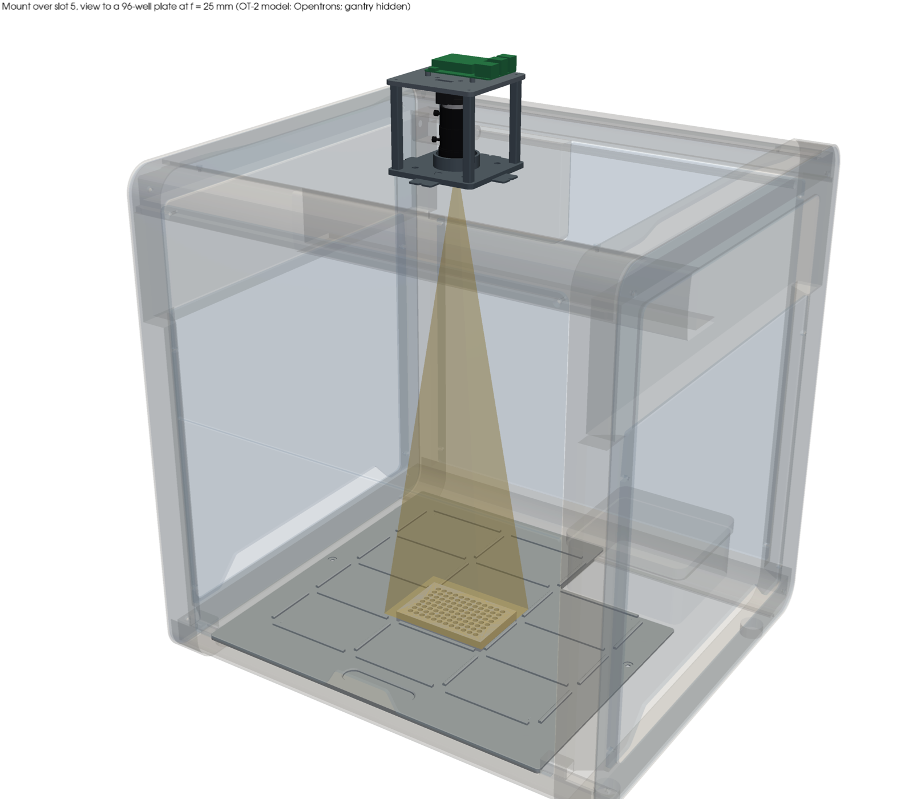
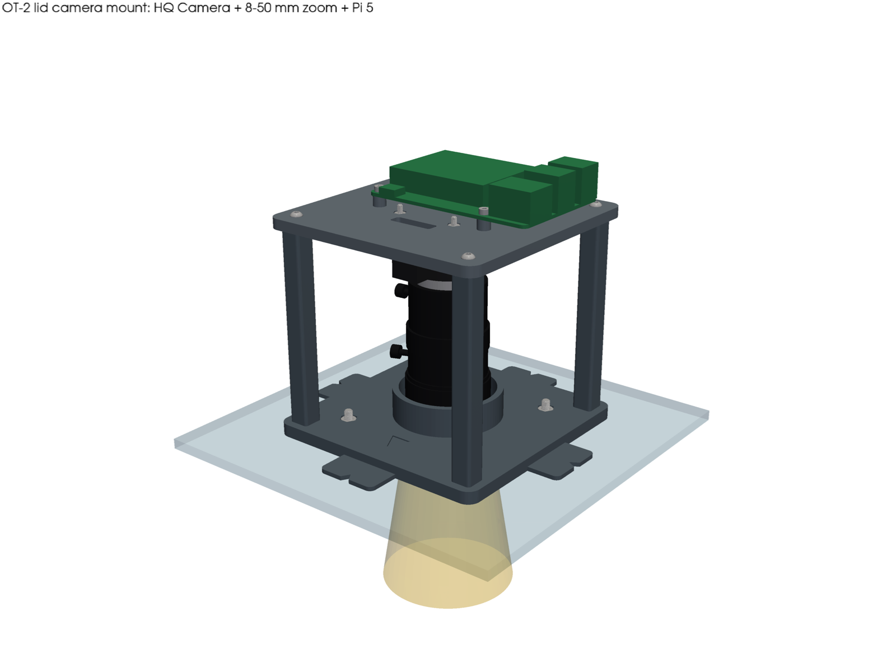
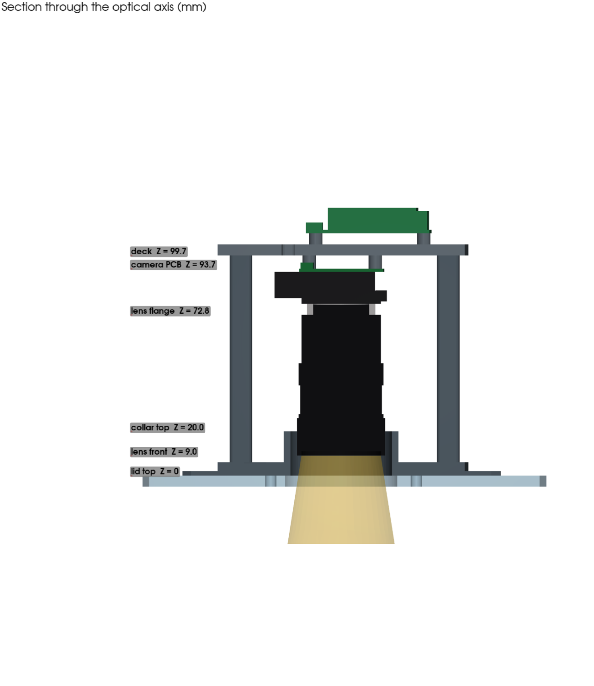
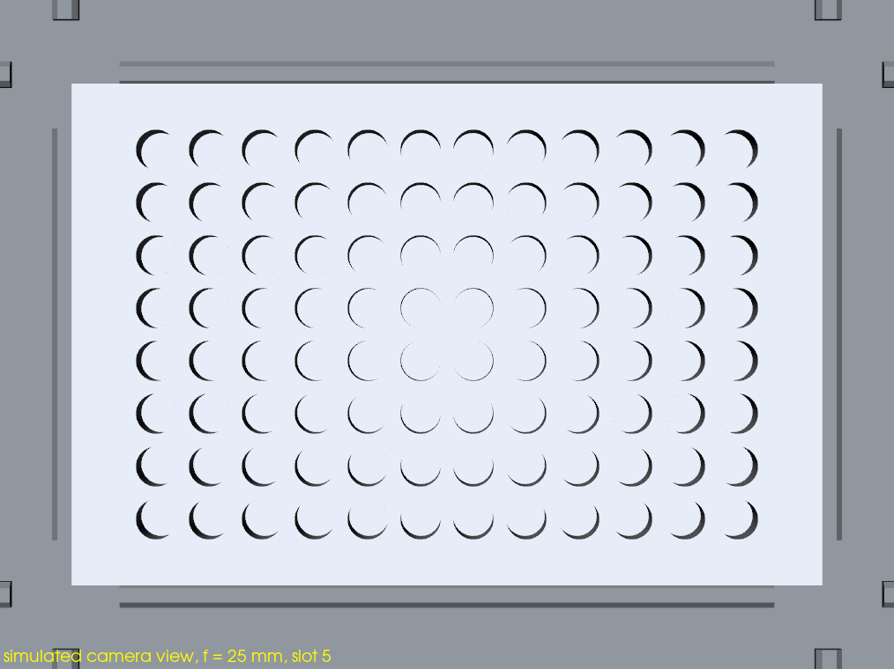
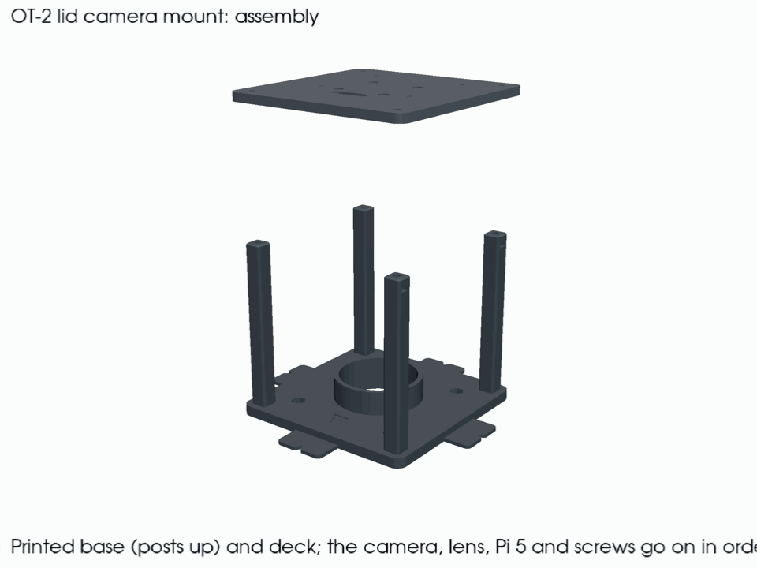
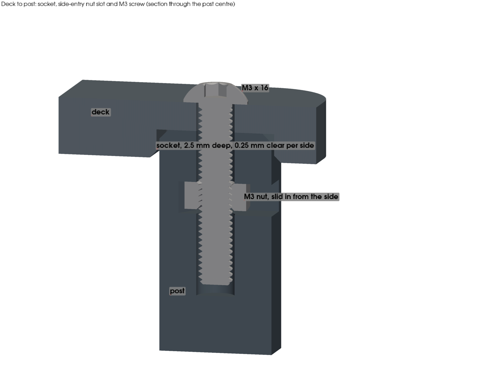
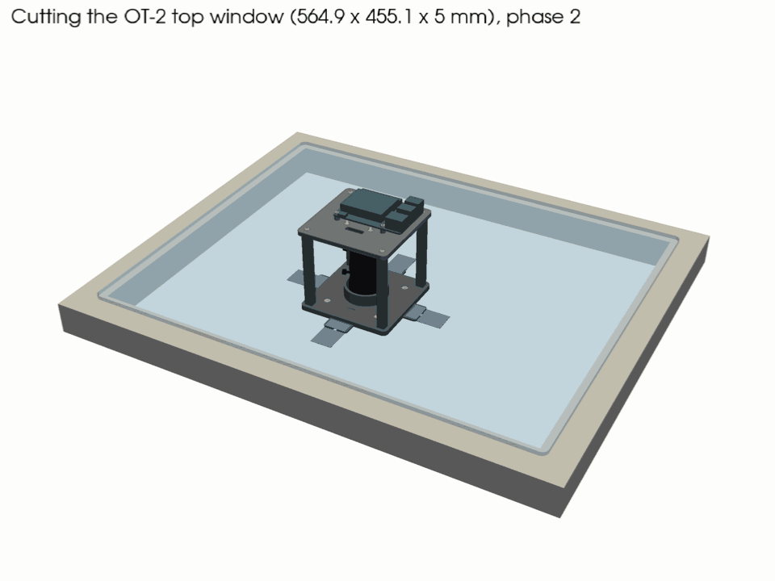
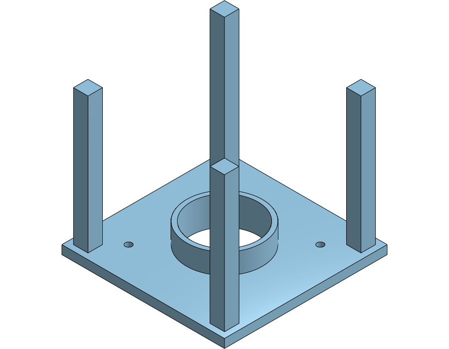
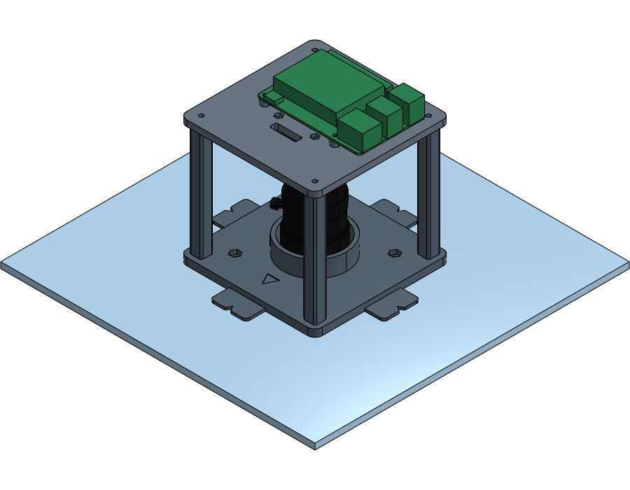
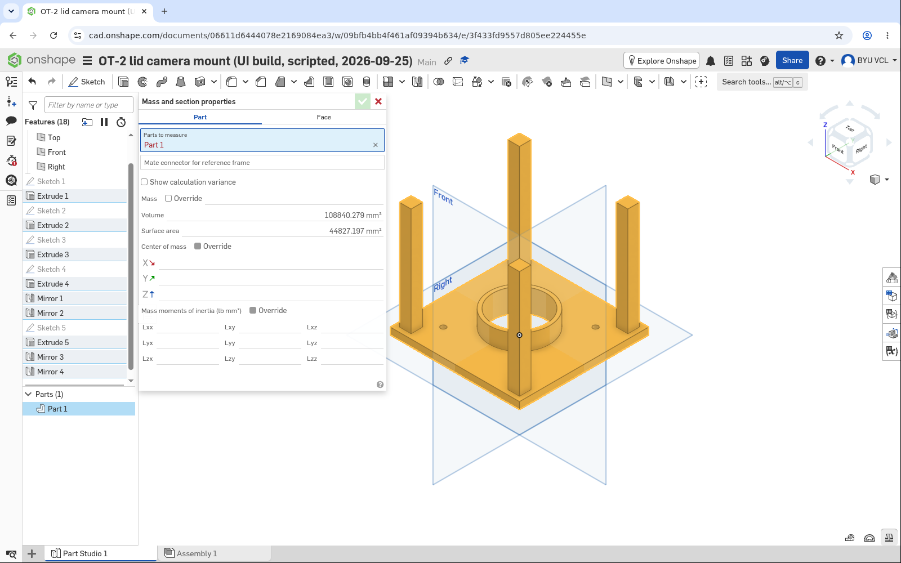

# OT-2 lid camera mount

A mount that holds the **Raspberry Pi HQ Camera + Waveshare 8–50 mm C-mount zoom**
pointing straight down through the OT-2's top window ("the plexiglass"), with the
**Raspberry Pi 5** riding on top. It tapes down first, so you can position and test it
without cutting anything, and later bolts through four holes next to a small lens cutout.



| Assembly | Section through the optical axis | Simulated camera view, f = 25 mm |
|---|---|---|
|  |  |  |

It was built along two paths, as requested in
[#84](https://github.com/vertical-cloud-lab/byu-vcl/pull/84):

| Path | What | Status |
|---|---|---|
| **A: programmatic CAD** | [`cad/lid_mount.py`](cad/lid_mount.py), a parametric CadQuery model with automated clearance checks; [`cad/ot2_context.py`](cad/ot2_context.py), which checks it against Opentrons' own OT-2 model; renders; a 1:1 drill template | Built, checked, exported |
| **B: Onshape** | [`onshape/onshape_api.py`](onshape/onshape_api.py) (REST API: native sketch/extrude features plus a STEP import) and [`onshape/onshape_ui.py`](onshape/onshape_ui.py) (Playwright, working the Part Studio with mouse clicks, drags and typed dimensions in a headed browser on a Pi) | **Both run against the live service** (2026-09-25). Each built the base to the same volume as the CadQuery model, 108,840.279 mm³. See [Path B](#7-path-b-onshape). |

---

## 0. The OT-2 lid, from Opentrons' CAD

Opentrons publishes a STEP model of the OT-2 and DXFs of its windows at
[github.com/Opentrons/ot2](https://github.com/Opentrons/ot2) (2018).
[`cad/ot2_context.py`](cad/ot2_context.py) downloads it and measures it; the file itself
isn't committed here, because that repo has no licence file.

| | | |
|---|---|---|
| Top window | **5.00 mm** thick, 564.9 × 455.1 mm | measured from the STEP |
| Deck surface → underside of the window | **585.2 mm** | measured from the STEP. #84's options doc estimated ~400 mm from the robot's outside height; that estimate is wrong, and the real ~590 mm from deck to lid is the "~24 in" case |
| Pipette-head top cover → underside of the window | **9.1 mm**, and the head can travel under the whole window | measured from the STEP. **Nothing may hang more than a few mm below the lid**, which is why the bolts below have low heads |
| How it's held | 4 × M4 × 12 low-profile screws in corner slots; the front and back edges rest on ledges, and the sides tuck under 2 mm lips | [manual](https://opentrons-landing-img.s3.amazonaws.com/Manuals/OT2_Manual.pdf), [window DXF](https://github.com/Opentrons/ot2/blob/master/windows/TOP_WINDOW_RevA2.DXF) |
| Removable? | **Yes**: unscrew the 4 screws, slide it, lift it off. That means it can be drilled on a bench | [Opentrons support](https://support.opentrons.com/s/article/HEPA-Module) |
| Material | The 2018 drawing says acrylic; the current specs and the manual say polycarbonate. **Check yours, and machine it as if it were acrylic.** | [specs](https://docs.opentrons.com/ot-2/system-description/specs/) |

Two more constraints. The HEPA Module replaces the top window, so this mount doesn't
work on a HEPA-equipped OT-2. The window also presses a safety switch: if the door
safety switch is enabled in Robot Settings, the robot won't run while the window is off.

---

## 1. What's in the box

| Part | File | Notes |
|---|---|---|
| Base | [`exports/base.stl`](exports/base.stl) | 112 × 112 mm plate (144 mm across the tape tabs), a Ø46 mm lens aperture inside a 14 mm light collar, four M4 nut traps, and four 10 mm posts, each with a side slot for an M3 nut near its top |
| Deck | [`exports/deck.stl`](exports/deck.stl) | The camera hangs underneath from its four M2.5 holes, the Pi 5 sits on top, and a slot passes the ribbon cable. Four sockets in its underside take the post tops |
| Drill template | [`exports/drill_template.stl`](exports/drill_template.stl), or print [`exports/drill_template_1to1.pdf`](exports/drill_template_1to1.pdf) on paper | Marks the lens cutout and the four bolt holes |
| Spacers | [`exports/spacers.stl`](exports/spacers.stl) | 4 × 5 mm Pi 5 standoffs, plus 4 × 2 mm shims that raise the deck if the lens ever needs to sit higher |
| Everything, in colour | [`exports/assembly.step`](exports/assembly.step) | With reference models of the lid, camera, adapter, lens and Pi 5 |

STEP files for every printed part sit next to the STLs. The drill template also comes as a
[DXF](exports/drill_template_1to1.dxf) for a laser cutter.

**Print** in black PETG or PLA, which is opaque and cuts stray light. Use 0.2 mm layers,
3–4 walls (the screw bosses need them) and 20–30 % infill. Every STL is already in print
orientation, and **none needs supports** (see [`renders/print_layout.png`](renders/print_layout.png)).

**Bambu Lab A1 mini:** [`slice/lid_mount_A1mini_PLA.3mf`](slice/lid_mount_A1mini_PLA.3mf) is
already sliced for PLA on three plates: 4 h 33 min and 157 g in all. It uses these settings
and the Textured PEI plate. Bambu's support check and slicer both came back clean; the only
warning concerns timelapse mode. See [`slice/README.md`](slice/README.md).

### Hardware

| Qty | Part | Where |
|---|---|---|
| 4 | M2.5 × 16 mm screw + M2.5 nut ([91292A018](https://www.mcmaster.com/91292A018/), [91828A113](https://www.mcmaster.com/91828A113/)) | camera → deck (nuts sit in traps on the deck top) |
| 4 | M2.5 × 16 mm screw + M2.5 nut (same) | Pi 5 → spacers → deck (nuts in traps on the deck underside) |
| 4 | M3 × 16 mm button head + M3 nut ([92095A184](https://www.mcmaster.com/92095A184/), [91828A211](https://www.mcmaster.com/91828A211/)) | deck → posts (the nuts slide into slots in the posts; see [the joint](#the-deck-to-post-joint)) |
| 4 | **M4 × 16 button-head (ISO 7380)** + M4 nut + thin nylon washer ([92095A194](https://www.mcmaster.com/92095A194/), [91828A231](https://www.mcmaster.com/91828A231/), [95610A550](https://www.mcmaster.com/95610A550/)) | base → lid, **phase 2 only**. The low 2.2 mm head keeps the screw clear of the pipette head underneath. M4 × 12 ([92095A192](https://www.mcmaster.com/92095A192/)) also works; it just reaches through the nut |
| – | Painter's or gaffer tape, Command strips, or 3M Dual Lock SJ3560 | **phase 1** (see [§4](#4-install-phase-1-tape-no-cutting)) |
| – | Optional: 1–2 mm black adhesive foam | light seal under the base, around the aperture |

The camera, lens, C–CS adapter, Pi 5, Active Cooler and 200 mm Pi 5 camera cable are the
parts already bought on ME order 12704 (see #84). The fasteners are McMaster-Carr parts, and
the renders use McMaster's own STEP models of them; see [`hardware/`](hardware/README.md).

---

## 2. Assemble



The GIF comes from [`cad/animate.py`](cad/animate.py), with the McMaster fasteners.

1. Drop four **M4 nuts** into the hex traps on the base.
2. Slide four **M3 nuts** into the slots near the tops of the posts, lying flat, and push each
   one in until it stops. The hex end of the slot then holds it on the screw axis.
3. Drop four **M2.5 nuts** into the traps on the top of the deck. Hang the camera under the
   deck with M2.5 × 16 screws, driven up from the lens side through the camera's corner
   holes. The **ribbon connector goes toward the cable slot**, the side marked by the
   arrow engraved on the base (−Y).
4. Plug the camera cable into the camera and feed it up through the slot.
5. Screw on the lens with **one** C–CS adapter. The lens and the camera each ship with one,
   and in July the camera wouldn't focus because the adapter ring had been pushed in too far
   (#84). Set the zoom to **about 25 mm**. At the lid, the lens front is 585 mm from the top
   of a plate, which gives a 152 × 114 mm field of view: the plate plus a margin on every
   side, at 26.7 px/mm (~180 px across each well). Above about 27.6 mm the margin
   around the plate drops below 5 mm.
6. Lower the deck onto the posts; their tops drop 2.5 mm into the sockets in its underside.
   Drive the M3 screws down through the deck into the nuts, snug.
7. Fit the Pi 5 on the four printed spacers with M2.5 × 16 screws down into the nuts on the
   deck underside, with its power/HDMI edge toward the cable slot. Connect the cable to
   either CAM/DISP port.

The zoom, focus and iris rings stay reachable through the 84 mm windows between the posts.
Their thumbscrews sweep about Ø55 mm, and the posts are 33 mm clear of that.

### The deck-to-post joint



The screws used to cut their own threads in Ø2.6 mm pilots in the PLA posts. That holds, but
PLA threads strip after a few removals and creep under load, and the deck was located only by
the screws. Two changes, both in `Params`:

- **The post tops key into the deck.** Each post rises 2.5 mm (`socket_depth`) into a socket in
  the deck's underside, with 0.25 mm clearance per side (`socket_clear`) and 45° lead-ins on
  both parts. The deck stays put without the screws; the screws are the insurance.
- **An M3 nut in each post, slid in from the side** in the OpenFlexure way. The slot is
  5.7 × 2.8 mm and ends in a hex, 4.5 mm below the post top, so the screw clamps the top of the
  post between the nut and the deck instead of threading into plastic. The slots open outward
  along X, just below the deck.

If the posts won't go into the sockets, file or sand the post tops rather than forcing them; if
they're loose, reprint the deck with a smaller `socket_clear`. The slot is only 0.2 mm wider
than the nut's 5.5 mm across flats, and printed slots come out slightly narrow, so a nut should
need a push and then stay put. If it's too tight, clean the slot out with a blade. The
2 mm shims still work: a shim sits on the post top inside the socket, raising the deck by 2 mm
and shortening the post's engagement by 2 mm, and the M3 × 16 still reaches 4.6 mm past the nut.

---

## 3. Where on the lid

The mount fits over **slots 4–11**. Over the front row (slots 1–3) the base would run into
the frame at the window's front edge; `ot2_context.py` finds 210 mm³ of overlap there.
**Slot 5** is the natural choice. It's in the middle column, clear of the gantry's home
position at the back right, and 81 mm in front of the window's centre. That is closer
to the front edge, which carries the panel, so it sags less there than in the middle.

Where the lens axis goes, measured on the window from its centre. The centre is the middle
of the four screw slots; +x points right and +y points toward the back:

| Slot | 4 | 5 | 6 | 7 | 8 | 9 | 10 | 11 |
|---|---|---|---|---|---|---|---|---|
| x (mm) | −132.5 | **0** | +132.5 | −132.5 | 0 | +132.5 | −132.5 | 0 |
| y (mm) | −81.0 | **−81.0** | −81.0 | +9.5 | +9.5 | +9.5 | +100.0 | +100.0 |

These come from 2018 CAD, so treat them as a starting point and let the live preview in
phase 1 decide. The same numbers, measured from the window's front-left corner, are in
[`exports/ot2_fit.json`](exports/ot2_fit.json).

Because the sensor's long axis is X, the plate's 12 columns should run **left to right**
across the OT-2, which is how labware normally sits on the deck.

## 4. Install, phase 1: tape, no cutting

1. Home the robot (the gantry parks at the back right, out of view) and put a plate in
   the slot you picked.
2. Put the mount on the lid above that slot, with the arrow on the base pointing at the door.
3. Start `preview_server.py`
   ([#84](https://github.com/vertical-cloud-lab/byu-vcl/blob/e949ad0/ot2-overhead-camera/README.md#5-zoom-and-focus-live-preview))
   and slide the mount until the plate is centred and square in the preview. Zoom first,
   then focus.
4. Tape the four tabs down.

At this stage it images **through the window**. The collar keeps room light off the patch
of window under the lens, which is where reflections would come from. If the images are
good enough like this, the cutout is optional.

**Holes are optional.** The mount sits on top of the lid, so the adhesive only has to stop
it sliding when the gantry moves; it never hangs from anything. Three ways to hold it
without drilling:

| Holding method | Good for | Notes |
|---|---|---|
| Painter's or gaffer tape over the four tabs | finding the spot | Re-tape as often as you like. |
| Command strips (large, stretch-release) | "done moving it" | Made for smooth surfaces. They pull off with no residue, but each pair is single-use. |
| **3M Dual Lock SJ3560** ([data sheet](https://multimedia.3m.com/mws/media/2366353O/3m-dual-lock-reclosable-fastener-sj3560.pdf)) | **repositionable, semi-permanent** | Clear acrylic adhesive, rated for acrylic and polycarbonate. It keeps about half its grip after ~1000 open/close cycles. Put one pad under each tab and its mate on the lid, and the base snaps on and off. The lid pads can be moved if the slot changes. |

Avoid PVC suction cups, whose plasticizer can stress-crack both plastics, and any
solvent-based adhesive, primer or remover, which can craze them. Clean the lid with soap
and water first.

## 5. Install, phase 2: cutout and bolts



**Which tool, and where.** The window is small enough for a bench: 564.9 × 455.1 × 5 mm,
about 1.5 kg, and it comes off with four screws. A waterjet isn't needed. It would also be
the riskiest option for acrylic, which can chip or crack where the jet pierces it. Work out
the material first ([§0](#0-the-ot-2-lid-from-opentrons-cad)); the edge-on colour is a quick
check (a polycarbonate edge tends to look bluish, an acrylic one clear).

| Window is… | Best | Also fine |
|---|---|---|
| **Acrylic** (2018 drawing) | **Laser cutter**, all five holes in one job with polished edges. The ME Prototyping Lab (117 EB) has a 40 × 28 in laser, so the panel fits. The HBLL makerspace laser's 24 × 18 in bed leaves only ~2 mm to spare | 5 mm holes with an acrylic bit (60–90° point, zero rake) in a hand drill. For the Ø50.8 mm hole use a drill press, with a hole saw or circle cutter at low speed over a backer. Acrylic makers advise against hand-held hole saws |
| **Polycarbonate** (current spec) | **Hand drill** for the four 5 mm holes: ordinary HSS bits work. For the 2 in hole, a bi-metal hole saw with a pilot bit, low speed (~300 rpm), clamped over scrap MDF | The ISM-408 CNC router in 117 EB. **Never laser polycarbonate**: it chars amber and gives off fumes, and the HBLL makerspace prohibits it |

At BYU: the **Project Support Center** (EB 107) lends hand and power tools, and the **ME
Prototyping Lab** (117 EB, [booking](https://byuprojectslab.simplybook.me/v2/), Mon–Fri
8–5) has the laser and the CNC router, and the ECE shop has a drill press (training through
ytrain). The Manufacturing Engineering waterjet
in CTB 108 (byuwaterjet@byu.edu) is staff-run and quoted; it isn't worth it for five holes.
A step bit is **not** a good choice for the lens hole: common ones stop at 1⅛ in, and
acrylic makers limit step bits to sheet up to 3 mm.

1. With the mount in its final spot, **trace the base outline and the four tab notches**
   onto the window with a fine marker, then lift the mount off.
2. **Take the window off** (4 screws, slide, lift) and drill it on a bench. That keeps chips
   out of the robot and avoids leaning on the panel.
3. Print [`drill_template_1to1.pdf`](exports/drill_template_1to1.pdf) at 100 % /
   "Actual size", **check the 50 mm and 2 in scale bars with a ruler**, and line it up
   with the tracing. Alternatively, use the printed drill template. Centre-punch the
   five marks.
4. Drill the four **Ø5 mm** bolt holes. The extra 1 mm over M4 gives the panel room to
   expand. Clamp the panel over a wooden backer board, leave any protective film on, and
   drill a pilot first, at low speed with light pressure. Use an acrylic bit (60–90° point)
   on acrylic; an ordinary sharp HSS bit is fine on polycarbonate. A step bit leaves a
   stepped hole in 5 mm sheet.
5. Cut the lens hole with a **2 in (50.8 mm) hole saw** and its pilot bit at ~300 rpm, into
   the backer, then deburr both edges. Use a drill press for acrylic, or have acrylic
   laser-cut instead. On polycarbonate a hand drill with a side handle also works.
6. Put the window back so it presses the safety switch again. Bolt the base down with
   the M4 button-heads from **inside** the robot, up into the trapped nuts, with the
   nylon washer under the head. Tighten them snug and no more; over-tightening cracks
   acrylic.
7. **Check the clearance.** With the robot homed (head fully up), jog the gantry slowly
   under the mount and look along the lid. The screw heads plus washers hang about 3 mm
   below the window, against 9.1 mm of clearance in the CAD. The window already sags
   about 1 mm under its own weight across the 450 mm span, and the ~0.4 kg mount adds up
   to about 0.5 mm; both are simply-supported beam estimates, not measurements.

Why 2 in: the view cone from the lens front clears a 50.8 mm hole across the **whole 8–50
mm zoom range**. At the 25 mm working zoom it is only ~40 mm across at the window's
underside, so a 1¾ in (44.5 mm) saw would also work. There is 19 mm of panel between the
cutout and each bolt hole.

---

## 6. Design and checks

Coordinates: the optical axis is at X = Y = 0, Z = 0 is the top face of the window, and +Z
is up. Every height follows from the camera and lens stack:

| Z (mm) | |
|---:|---|
| −590.2 | deck surface (Opentrons CAD) |
| 0 | top of the window |
| 9.0 | lens front, 3 mm above the base and inside the collar |
| 20.0 | top of the collar |
| 72.8 | lens flange |
| 77.8 | camera CS seat (after one 5.03 mm C–CS adapter) |
| 93.7 | back of the camera PCB |
| 99.7 | deck underside (6 mm standoff clears the FPC connector) |
| 102.2 | top of the posts, 2.5 mm up inside the deck's sockets |
| ~127 | top of the Pi 5 and cooler, the tallest point |

`python cad/lid_mount.py` rebuilds the parts and runs these checks, saved to
[`exports/checks.json`](exports/checks.json). `python cad/ot2_context.py` adds the OT-2
checks, saved to [`exports/ot2_fit.json`](exports/ot2_fit.json). Everything passes except
the front-row slots, which is why the mount goes over slots 4–11:

| Check | Result |
|---|---|
| Interference, 13 pairs: base and deck against each other and against the camera, lens, Pi 5, spacers and window, plus the thumbscrew sweep and the view cones | 0 mm³ for every pair |
| Post to deck socket | 0.25 mm clearance per side, 2.5 mm deep |
| M3 × 16 past its nut | 6.6 mm |
| Lens front barrel to collar | 3.0 mm radial gap |
| Thumbscrews to the nearest post | 32.8 mm |
| View cone vs. base aperture and lid cutout | clear from 7.5 mm focal length up, i.e. the full 8–50 mm zoom range |
| Pi 5 board to the deck screw heads (plan view) | 4.25 mm, so the deck comes off without removing the Pi |
| Base vs. the OT-2 frame, mount over each slot | 0 mm³ for slots 4–11; overlaps for 1–3 |

Sources for the numbers:
- The HQ Camera's
  [official mechanical drawing](https://datasheets.raspberrypi.com/hq-camera/hq-camera-cs-mechanical-drawing.pdf):
  38 mm board, Ø2.5 holes 4 mm from each edge on a 30 mm square, and 18.58 mm overall depth
  including the 2.75 mm connector.
- Waveshare's [8–50 mm lens spec](https://www.waveshare.com/8-50mm-Zoom-Lens-for-Pi.htm):
  Φ40 × 68.3 mm, 148 g, minimum object distance 0.20 m.
- Opentrons' OT-2 model, as described above.

**Estimates to check on the bench.** Each one is a single number in `Params`:
- `lens_thread_len = 4.5` and the layout of the rings and thumbscrews come from product
  photos, not a drawing. If the lens front ends up lower than expected, there are still
  9 mm before it touches the window. Add a 2 mm shim on each post, inside the deck's socket,
  for each 2 mm you need.
- `ring_sweep_d = 64` is generous; the modelled thumbscrews reach Ø55 mm.
- The simulated view's pinhole sits 20 mm inside the lens front (`PUPIL_IN_LENS`). Moving
  it changes the field of view by about 3 %.

At 585 mm the view is close to straight down but not telecentric. Toward the plate's
edges the camera sees about 1 mm of each well's wall, which is visible in the simulated
view. Keep that in mind when you segment wells near the edges.

To rebuild:

```bash
pip install -r cad/requirements.txt
cd cad
python lid_mount.py                  # checks + STEP/STL/assembly -> ../exports
python template.py                   # 1:1 SVG/DXF/PDF drill template
xvfb-run -a -s "-screen 0 1920x1080x24" python render.py        # PNG renders
xvfb-run -a -s "-screen 0 1920x1080x24" python ot2_context.py   # OT-2 fit, FOV, context renders
```

Drop `xvfb-run ...` on a machine with a display.

---

## 7. Path B: Onshape

Both scripts were run against the live service on 2026-09-25, with the credentials that
`claude.yml` now passes (`ONSHAPE_ACCESS_KEY`/`ONSHAPE_SECRET_KEY` for the API,
`ONSHAPE_USERNAME`/`ONSHAPE_PASSWORD` for the browser). Every route gives the same base.
The volume below is for the simplified base, without tabs, fillets or nut traps:

| Route | Account | Result | Volume of the base |
|---|---|---|---|
| CadQuery, the same simplified geometry | — | reference | 108,840.279 mm³ |
| [`onshape_api.py`](onshape/onshape_api.py), REST API | Sterling's (the API key's owner) | [document](https://cad.onshape.com/documents/443cb9b65c87663ba09bfe83/w/c9a919c669b084a190eb18cd): native "Base (native features)" Part Studio (4 sketches, 4 extrudes) plus all 5 STEP files imported | **108,840.279 mm³**, bounding box ±56 × ±56 × 0–99.66 mm |
| [`onshape_ui.py`](onshape/onshape_ui.py), mouse and keyboard in a headed browser on a Pi | BYU VCL | [document](https://cad.onshape.com/documents/06611d6444078e2169084ea3/w/09bfb4bb4f461af09394b634/e/3f433fd9557d805ee224455e): 5 sketches, 5 extrudes, 4 feature mirrors, first attempt, 8 minutes | **108,840.279 mm³**, from Onshape's own mass properties panel |

**The deck sockets and nut slots (2026-09-26)** went in over the REST API, as three more STEP
imports into the lab-owned copy of the REST document in **vcl-shared › OT-2 Overhead Camera**
([document](https://cad.onshape.com/documents/b861aa8c20186efe903944e2/w/92e2f78805c144a49d3ac0a0)):
*base v2 (M3 nut slots in the posts)*, *deck v2 (post sockets)* and *assembly v2 (nut slots and
sockets)*. Before importing them, the document was saved as the version *Before M3 nut slots and
deck sockets*, so the older tabs can still be compared against it. Onshape's mass properties
match CadQuery to the thousandth: 111,243.380 mm³ for the base and 60,669.349 mm³ for the deck
([base](onshape/evidence/api-v2-base.png), [deck from below](onshape/evidence/api-v2-deck.png)).
That took 16 API calls in all. The native features still build the earlier simplified base:
posts that stop at the deck's underside (99.66 mm), with no slots, which is what the volumes
below were measured on.

Both documents are private to their accounts. Share one from Onshape, or with
`onshape_api.py --share EMAIL` if the key has the Share scope. The full record is in
[`evidence/runs.json`](onshape/evidence/runs.json).

| REST: native features | REST: imported assembly | UI: the Pi's screen at the end of the run |
|---|---|---|
|  |  |  |

**What the live API changed.** The first run built all 8 native features, but every STEP
import failed with HTTP 400 "An illegal argument was provided". The cause was the
`storeInDocument` and `yAxisIsUp` form fields. The script now sends exactly the fields
of Onshape's
[documented example](https://onshape-public.github.io/docs/api-adv/translation/)
(`formatName` empty, `flattenAssemblies`, `translate`), and imports finish in under 10 s
each. `--document URL` and `--step NAME` add files to an existing document. The whole
session used about 38 API calls. Free, Standard and EDU Student plans get
[2,500 a year](https://onshape-public.github.io/docs/auth/limits/).

**What the live UI changed.** The browser runs headed on a Raspberry Pi's virtual display,
so the sign-in comes from a residential IP. The runner drives it through an SSH tunnel to
Chromium's DevTools (`--cdp`). [`onshape/pi/README.md`](onshape/pi/README.md) has the
setup, which needs no `apt` and no `sudo`. Sign-in met no CAPTCHA or 2FA. The first
version of the script would have stopped at its first dimension. It had six problems,
all fixed and described in the script's docstring:

- It used the wrong selector for the dimension box.
- It clicked on an edge's midpoint. Seen from the Top, the Right plane runs edge-on
  through that point, so the click picks the plane
  ([screenshot](onshape/evidence/pitfall-midpoint-pick-selects-right-plane.png)).
- It clicked the canvas without hovering first. Onshape needs most of a second to
  pre-select under software WebGL.
- It cut Through all without **Symmetric**. Remove flips the default direction, which
  from the Top plane points away from the part
  ([screenshot](onshape/evidence/pitfall-remove-through-all-misses.png)).
- It dimensioned to the Origin picked from the feature list, which the dimension tool
  ignores. The sketches are now located from the Right and Front planes, picked on the
  canvas ([post sketch](onshape/evidence/ui-09-post-sketch.png)).
- It took pixels per millimetre from a small shape, while zoom-to-fit changes as the
  part grows. The scale now comes from each positional dimension's pre-filled value.

> ⚠️ **Onshape's [Terms of Use](https://www.onshape.com/en/legal/terms-of-use), section 4(a)(ix),
> forbid "any robot, spider, scraper or other automated means to access the Service."**
> The REST API is the sanctioned route, so use `onshape_api.py` for real work. The UI run
> above was made at the account owner's request in
> [#234](https://github.com/vertical-cloud-lab/byu-vcl/pull/234). Otherwise, treat
> `onshape_ui.py` as the manual recipe below.

### Running them again

```bash
pip install -r onshape/requirements.txt
python onshape/onshape_api.py                          # new document; add --share EMAIL, or --public on a Free plan
python onshape/onshape_api.py --document URL --skip-native --step deck   # one more STEP into an existing document
python onshape/onshape_ui.py --cdp http://127.0.0.1:9222   # a browser on a Pi, see onshape/pi/README.md
python onshape/onshape_ui.py --headed --slow 300           # or launch one here and watch it
```

### Manual recipe

This is the sequence `onshape_ui.py` automates. Everything is sketched on the **Top**
plane, and it takes about ten minutes by hand:

| # | Sketch | Feature |
|---|---|---|
| 1 | Centre-point rectangle on the origin, 112 × 112 | Extrude 6 mm, **New** |
| 2 | Circle on the origin, Ø52 | Extrude 20 mm, **Add** |
| 3 | Circle on the origin, Ø46 | Extrude **Through all**, **Remove**, **Symmetric** (Remove flips the default direction away from the part) |
| 4 | Centre-point rectangle 10 × 10, centre 47 mm right of and 47 mm above the origin | Extrude 99.66 mm, **Add**; then **Mirror** (Feature mirror) across *Right*, then the extrude and that mirror across *Front* |
| 5 | Circle Ø4.5, centre at (33, 33) | Extrude **Through all**, **Remove**, **Symmetric**; mirror the same way |

To check it, import [`exports/base.step`](exports/base.step) into the same document. The
two should coincide apart from the nut traps, tape tabs, fillets and engraved arrow,
which only the CadQuery model has.
