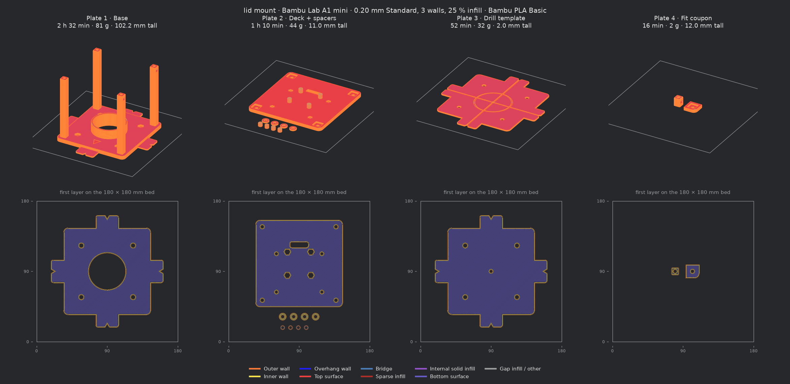
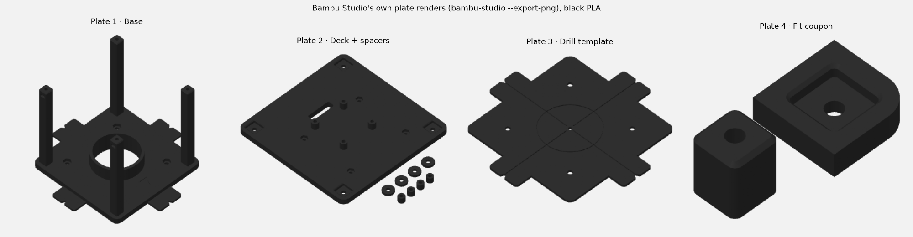

# Sliced for a Bambu Lab A1 mini, in PLA

[`lid_mount_A1mini_PLA.3mf`](lid_mount_A1mini_PLA.3mf) is a Bambu Studio project with every
printed part already sliced. Open it in Bambu Studio (or send it from Bambu Handy) and print
plate by plate. It was produced headless by the Bambu Studio **02.08.02.61** command-line
slicer, and [`report.json`](report.json) holds the numbers below.

| Plate | Parts | Time | PLA |
|---|---|---|---|
| 1 | Base | 2 h 32 min | 81.1 g (26.8 m) |
| 2 | Deck + 4 Pi 5 standoffs + 4 deck shims | 1 h 10 min | 43.5 g (14.3 m) |
| 3 | Drill template (optional; the paper PDF does the same job) | 52 min | 31.8 g (10.5 m) |
| 4 | Fit coupon (optional): the top 12 mm of a post, nut slot included, and the deck around a socket, cut from the real parts. Print it first to try both fits | 16 min | 2.5 g (0.8 m) |
| | **Total** | **4 h 49 min** | **158.9 g** |

Only plates 1 and 2 are needed: 3 h 42 min and 124.6 g.

**Settings.** These are Bambu's own system presets: printer `Bambu Lab A1 mini 0.4 nozzle`,
process `0.20mm Standard @BBL A1M` and filament `Bambu PLA Basic @BBL A1M` (220 °C nozzle).
On top of them go the main README's print settings: **3 walls and 25 % infill**, where the
stock preset has 2 walls and 15 %. Three more settings:

- **Build plate: Textured PEI**, with the bed at 65 °C. This is the plate the A1 mini ships
  with.
- **Filament colour: black**, as the README recommends for blocking stray light. The colour
  only affects the preview and AMS slot matching; any PLA prints the same.
- **Auto circle contour-hole compensation: on** (`enable_circle_compensation`, off in the stock
  process preset). It widens round holes by the error model in the PLA Basic preset, so the
  M2.5, M3 and M4 clearance holes print at their drawn sizes instead of 0.3–0.4 mm small. It
  only touches round features, and it only has coefficients for Bambu PLA Basic, PLA CF,
  PETG HF and the CF grades; pick another filament in Studio and it does nothing. See
  [Will it fit first time?](#will-it-fit-first-time)

Supports are off, and every part stays in the orientation its STL was exported in.



The picture above is read straight from the G-code inside the 3MF, in Bambu Studio's
Preview colours ([`render_preview.py`](render_preview.py)). Below are Bambu Studio's own
renders of the same plates (`bambu-studio --export-png`), which are also the thumbnails
embedded in the 3MF for the printer's screen:



## Warnings

| Check | Result |
|---|---|
| Slicer warnings (the CLI's `found … slicing warnings` log lines) | **None** on any plate |
| Bambu's support-necessity check (floating regions, floating cantilevers, large overhangs) | Ran on all 5 objects and flagged nothing. This agrees with the README's "none needs supports" |
| Toolpaths outside the 180 × 180 mm bed / G-code path conflicts | None / none |
| G-code warnings stored in the 3MF (`slice_info.config`) | `not_support_traditional_timelapse` on every plate, see below |

`not_support_traditional_timelapse` is the only warning, and every single-colour print on an
A1 or A1 mini carries it. It appears only if you send the job with timelapse switched on. The
text is *"Enabling traditional timelapse photography may cause surface imperfections. It is
recommended to change to smooth mode."* Leave timelapse off, or switch to smooth mode (that
needs a prime tower).

Two more points that aren't slicer warnings:

- **The four posts** on plate 1 are 10 × 10 mm and stand 96 mm above the plate. The A1 mini
  moves the bed in Y, so watch the last few centimetres for ringing.
- **The M3 nut slots** near the post tops each have a 5.8 mm bridge for a roof, with the screw
  hole through it; in the G-code the slot runs from Z 94.6 to 97.6 mm and the layer above it
  is a Bridge. Bambu's support check doesn't flag them, and bridges that short normally print
  clean. The slot is 3.0 mm tall for a 2.4 mm nut, so a little sag still leaves room.
- **The four camera nut traps** on the deck open onto the build plate, where the first layer
  squashes out. The A1 mini presets set elephant-foot compensation to 0, so each trap's mouth
  now has a 0.4 mm 45° flare (`first_layer_flare`) instead.

## Will it fit first time?

Nothing has been printed yet, so these are predictions. [`fit_sim.py`](fit_sim.py) makes them
in about 2 s, in three steps:

1. **As sliced.** It reads the G-code inside the 3MF and rebuilds each fit-critical layer from
   its extrusion moves, each as wide as the `; LINE_WIDTH` Bambu writes before it (arc moves
   included). Then it measures that plastic. The slicer reproduces the CAD to within 0.005 mm
   in XY: 0.20 mm per side on the socket flats and a
   5.80 mm nut slot. Z is the one place it moves things. Layers
   are 0.2 mm, so the nut slot comes out at Z 94.6–97.6 mm, 0.06 mm lower than
   drawn, and its roof prints as a Bridge layer.
2. **As printed.** Bambu's own error model is then applied. The filament preset
   `Bambu PLA Basic @BBL A1M` carries the coefficients behind Studio's "Auto circle
   contour-hole compensation", applied per side in
   [`LayerRegion::auto_circle_compensation`](https://github.com/bambulab/BambuStudio/blob/f977235e6d/src/libslic3r/LayerRegion.cpp#L69):
   - A round hole of diameter *d* prints clamp(0.23415 − 0.008 *d*, 0.088, 0.22) mm small.
   - A round outline prints clamp(0.008 *d* − 0.041, −0.035, 0.033) mm small.
   - Straight walls take the large-diameter limits: 0.088 mm small for a flat-sided hole,
     0.033 mm for an outline.
   - A corner arc of radius *r* is treated like a circle of diameter 2*r*.
3. **Spread.** A Monte Carlo of 200,000 draws adds what the model leaves out. **The spreads
   are assumptions, not measurements:**
   - ±0.03 mm (1σ) printer-to-printer on the model.
   - M3 nuts anywhere in ISO 4032's 5.32–5.50 mm across flats.
   - 0.1 % differential shrinkage between the base and the deck.
   - 0.05° of XY skew.
   - 0.05 mm of lean at each post top.


| Fit | Before (a2a0794) | Now | Predicted now |
|---|---|---|---|
| Post top in deck socket | 0.25 mm per side, socket corners concentric with the post's (r 1.75): **74 %** chance every post top fits without trimming | 0.20 mm per side, socket corners r 1.0 (`socket_corner_r`) | 0.14 mm per side on the flats (0.07–0.21), 0.10 mm in the corners: **99%** fit without trimming |
| M3 nut in side slot | 5.7 × 2.8 mm: 92 % of nuts slide in | 5.8 × 3.0 mm | 5.62 mm wide: **99.8%** slide in; 14% have over 0.3 mm of play, which is harmless because the hex end holds the nut on the screw axis |
| M3, M2.5, M4 clearance holes | 3.4, 2.8, 4.5 mm, predicted to print 2.98, 2.37, 4.10 | Same CAD; circle compensation on | 3.40, 2.80, 4.50 mm |
| M2.5 camera nut traps, open onto the bed | 5.3 mm across flats | Plus a 0.4 mm 45° flare at the mouth | 5.12 mm inside, 5.72 mm at the first layer |
| M2.5 Pi and M4 nut traps | 5.3 and 7.3 mm | Unchanged | 5.12 and 7.12 mm, for nuts of 4.82–5.00 and 6.78–7.00 mm |

**Two things the model found.**
- **The old sockets would have bound at the corners, not the flats.** Small concave arcs print
  small. The old socket corners were concentric with the post's, so the corner gap was the
  same 0.25 mm as the flats and would have closed to about 0.02 mm. The socket corners are
  now rounded tighter than the post's, which puts the socket's arcs where the post has already
  curved away: 0.33 mm of gap there as sliced. Only the flats touch now, and on the flats the
  prediction is plain.
- **Post position doesn't matter; post size does.** Each post is a 96 mm cantilever, about
  6.5 N/mm at its tip (3*EI*/*L*³ for the walls alone, *E* = 3 GPa). So a post top a tenth of a
  millimetre out of place bends into line under well under a newton. Only a post top that is
  bigger than its socket can jam. The model gives a 38% chance that all four
  line up with no flexing at all, and it makes no practical difference.

**How far to trust it.**
- **The coefficients are generic, not tuned for the A1 mini.** The A1 mini, A1, P1 and X1 PLA
  Basic presets share them ([`fdm_filament_common.json`](https://github.com/bambulab/BambuStudio/blob/f977235e6d/resources/profiles/BBL/filament/fdm_filament_common.json)).
  The H2D, H2S, P2S and X2D have their own, about half the size. Bambu's wiki says the feature
  is [mainly optimised for the H2D](https://wiki.bambulab.com/en/knowledge-sharing/3d-prints-shrinkage).
- **Owners report smaller hole errors than the model predicts,** so the model is probably
  pessimistic for small holes:
  - Bambu's own [hole-compensation example](https://wiki.bambulab.com/en/software/bambu-studio/xy-hole-contour-compensation)
    measured a 6.0 mm hole at 5.9 mm; the model says 5.63.
  - An A1 owner reports [holes 0.2 mm small](https://makerworld.com/en/models/778608).
  - An X1C user reports [about 0.3 mm small](https://www.printables.com/model/112181).

  That makes the "before" column pessimistic too. The changes only add margin, so they hold
  either way. With compensation on, a clearance hole the model over-corrects just ends up a
  little loose, which does no harm.
- **The as-printed flats agree with community practice.** On Bambu printers, separate parts
  are usually given [0.15–0.20 mm](https://forum.bambulab.com/t/how-do-you-use-tolerance-value-in-your-design-with-bl/123711),
  and A1 mini owners report print-in-place joints [passing at 0.15 mm, with 0.1 mm a bit tight](https://makerworld.com/en/models/423905).
- **The slot follows a tested reference.** OpenFlexure's M3 slot, tuned over many prints, is
  [6.0 × 3.0 mm](https://gitlab.com/openflexure/openflexure-microscope/-/blob/master/openscad/libs/compact_nut_seat.scad).
  It is wider than this one because it holds the nut by pulling it into a taper. Bambu's XY
  hole compensation would not help a slot like this anyway: it only acts on closed loops, and
  the slot opens to the side.
- **Elephant's foot isn't in the G-code, so the model can't see it.** Bambu zeroed the A1
  mini's compensation in [e6d2c53](https://github.com/bambulab/BambuStudio/commit/e6d2c532d023f31d59d5b0da61a5fb1edb9d9772)
  ("Can not see obvious eleplant foot after printing"). One A1 mini owner on a textured plate
  [measured a ~0.3 mm lip](https://forum.bambulab.com/t/bottom-layers-lip/179917). The 0.4 mm
  flare covers that where it matters: the camera's nut traps, the only fit on the first layer.
- **Skew and shrinkage are small.** CNC Kitchen found retail A1 minis' skew
  [insignificant](https://www.cnckitchen.com/blog/calibration-cubes-are-bad-this-is-how-you-calibrate-your-3d-printer)
  (one pre-production unit had 0.55°). PLA shrinks about 0.35 %, but the base and the deck
  shrink alike.
- **To know rather than predict, print plate 4 first** (16 minutes). It is the top 12 mm of a
  post and the deck around its socket, cut from the real parts
  ([`exports/fit_coupon.stl`](../exports/fit_coupon.stl)). The post top should drop into the
  socket by hand, and an M3 nut should slide into the slot. If they do, the base and the deck
  will fit too. The one difference is that a short coupon post cools faster than the top of a
  96 mm post.
- **Studio has no tolerance calibration of its own.** Its calibration menu covers
  temperature, flow, pressure advance, max flow rate, VFA and retraction. If a first print
  does come out tight or loose, the knob is "User Customized Offset"
  (`circle_compensation_manual_offset`) for round holes, and the parameters in
  `cad/lid_mount.py` for everything else. Positive values loosen the fit, whatever Studio's
  tooltip says ([#8873](https://github.com/bambulab/BambuStudio/issues/8873)).

## Running it again

```bash
# Bambu Studio for Linux: the AppImage, extracted (needs no FUSE)
curl -LO https://github.com/bambulab/BambuStudio/releases/download/v02.08.02.61/BambuStudio_ubuntu24.04-v02.08.02.61-20260820225108.AppImage
chmod +x BambuStudio_*.AppImage && ./BambuStudio_*.AppImage --appimage-extract
sudo apt-get install libwebkit2gtk-4.1-0 libgstreamer-plugins-base1.0-0 libwayland-server0

# optional, for thumbnails and Bambu's own renders: a headless Wayland display and OSMesa
sudo apt-get install weston libosmesa6 gcc
export XDG_RUNTIME_DIR=/tmp/xdg && mkdir -p -m 700 $XDG_RUNTIME_DIR
weston --backend=headless --socket=wayland-bambu --idle-time=0 &
export WAYLAND_DISPLAY=wayland-bambu

pip install numpy matplotlib shapely
python slice_a1mini.py --bambu squashfs-root   # -> lid_mount_A1mini_PLA.3mf, report.json
python render_preview.py                       # -> preview/*.png
python fit_sim.py                              # -> fit_sim.json, preview/fit_sim.png
```

The whole run takes about 15 s. Change `OVERRIDES`, `FILAMENT_COLOUR` or `PLATES` at the top
of [`slice_a1mini.py`](slice_a1mini.py) to reprint differently, and `PRESETS` in
[`flatten_presets.py`](flatten_presets.py) for another printer, process or filament.

### What the CLI does not tell you

Four behaviours of Bambu Studio's command line cost time here. Each one fails silently or
with a misleading message:

1. **Preset files must be complete.** `--load-settings` and `--load-filaments` read one JSON
   each and ignore `inherits` and `include`, so a system preset loaded straight from
   `resources/profiles/BBL/` quietly falls back to a built-in default for every key its
   parents set. [`flatten_presets.py`](flatten_presets.py) walks the chain and writes
   complete files.
2. **The build plate defaults to Cool Plate**, whatever the printer's profile says. The A1
   mini's profile names Textured PEI as its default and lists Cool Plate as unsupported. Left
   alone, the bed heats to 35 °C and the start G-code's Textured-PEI Z offset is skipped, with
   no warning. So `--curr-bed-type "Textured PEI Plate"` is passed explicitly. Command-line
   overrides use dashes (`--wall-loops 3`); underscores are rejected.
3. **Auto-arrange rotates parts.** With `need_arrange` it turned the 144 mm base and the
   template 22.5° on the bed. Positions are therefore fixed in the `--load-assemble-list`
   file, which is also how the CLI takes several plates in one project.
4. **Thumbnails need an OpenGL context, and the stock build can't get one headless.** On
   Linux the CLI asks GLFW for an OSMesa context. This GLFW build is Wayland-only (under
   Xvfb, `glfwInit` fails), and its statically linked GLEW is GLX-only, so under Wayland
   `glewInit` fails. Either way the 3MF comes out with no plate pictures. The slice itself is
   unaffected; only the pictures are missing. [`glxshim.c`](glxshim.c) (20 lines) fixes it
   when preloaded with `libOSMesa.so.8`: it answers GLEW's GLX probes and routes GL calls to
   OSMesa. `slice_a1mini.py` compiles and preloads it automatically when `WAYLAND_DISPLAY` is
   set.

The CLI also writes a garbage `first_layer_time` into `slice_info.config` for one plate. The
value changes from run to run, `7.2e31` for example. It is display-only metadata and doesn't
affect the G-code.
