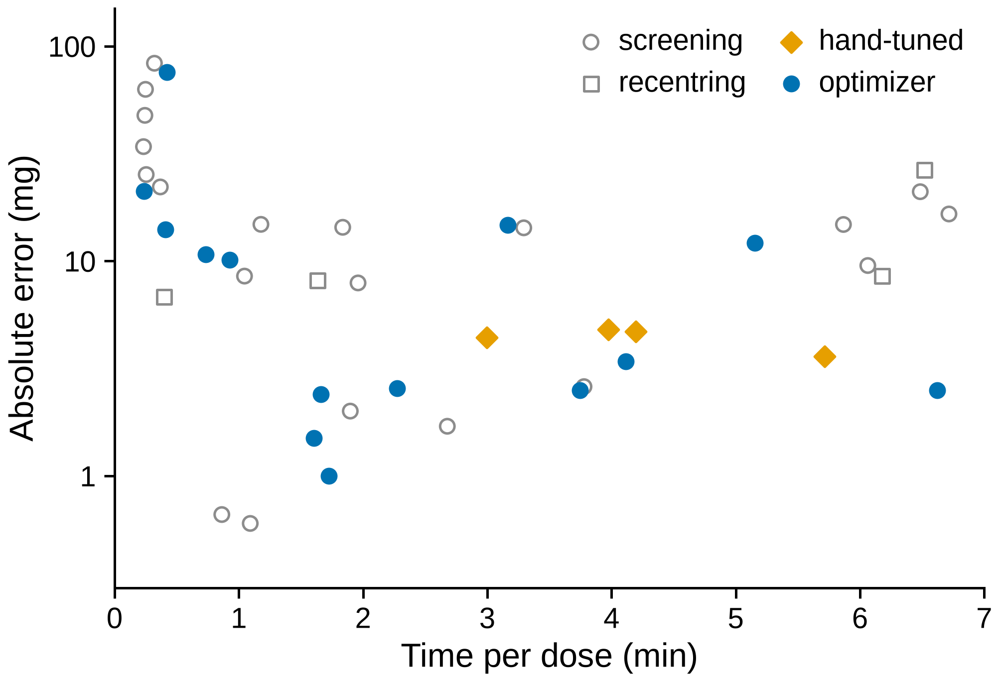
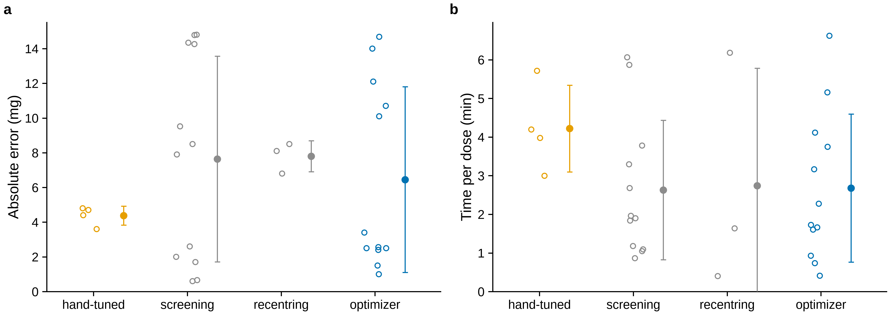

# Paper kit

A shared starting point for the lab's TMS 2027 papers: one figure style, one
way to get from data to figure, a manuscript skeleton for each publisher we
target, the declarations every journal asks for, and the checks to run
before review and submission. It lives here for now and can move to its own
public repository later.

Copy this folder into the project's repository as `paper/`, delete the
`main-*.tex` of the journals you are not targeting and the example figures,
and go.

```bash
pip install -r requirements.txt      # matplotlib, numpy, pandas, pillow, pinned
make figures                         # every figures/fig*.py -> figures/out/
make pdf J=asme                      # build/main-asme.pdf, todonotes hidden
make todos J=asme                    # build/main-asme-todos.pdf, with margin notes
make diff J=asme REV=g3              # changes since the git tag g3, marked up
make check                           # conventions, and what is left to fill
```

LaTeX: TeX Live with `latexmk` and `latexdiff` (on Debian or Ubuntu:
`texlive-latex-extra texlive-publishers texlive-science texlive-fonts-extra
tex-gyre latexmk latexdiff`). `make fetch` downloads the Springer Nature and
RSC classes, which TeX Live does not carry. Overleaf works too: upload the
folder and set the main document to one `main-*.tex`.

## What is in it

| Path | What it is |
|---|---|
| [`vcl_style.py`](vcl_style.py) | The figure style: `use("paper")` or `use("slide")` |
| [`data/`](data/) | The only thing figures read: snapshots, each with a README (units, n, provenance) |
| [`figures/`](figures/) | One script per figure, `figN_slug.py`; output in `figures/out/` |
| [`manuscript/`](manuscript/) | `main-<journal>.tex` per publisher, shared `sections/`, `declarations/`, `macros.tex` |
| [`boilerplate/`](boilerplate/) | The declarations explained: CRediT, availability, funding, conflict of interest, generative AI |
| [`checklists/`](checklists/) | Preprint policy and licence per journal, co-author sign-off, colour-blind check, clean rebuild |
| [`scripts/`](scripts/) | The checks behind `make check`, `colorblind`, `rebuild-check`, `credit`; `snapshot_data.py` |
| [`trackers/`](trackers/) | Draft tracker issues for the 13 student TMS 2027 abstracts (not yet posted) |

## Figures

`vcl_style.py` has two presets.

**`paper`.** Every figure is drawn at its printed size and never scaled: 85 mm
wide for one column, 175 mm for two. No text is smaller than 7 pt and every
line is at least 0.6 pt. Colours come from the Okabe-Ito palette. There are
no titles, because the caption carries the message, and axes are labelled
"Quantity (unit)" (`vs.qty("Time", "min")`). `vs.save(fig)` writes a vector PDF
(fonts embedded as TrueType, so text stays text) and a 600 dpi PNG. It
**refuses** a figure with a title, text under 7 pt, a line under 0.6 pt or a
width other than 85 or 175 mm, and warns about an axis label with no unit.
Some Springer journals ask for 8 to 12 pt lettering; `vs.use("paper",
text_pt=8)` raises every size by 1 pt.

**`slide`.** The powder-doser slides' look (`docs/optimization/slides/slide_style.py`
in vertical-cloud-lab/powder-doser, branch `claude/opt-results-slides-20261005`):
a 13.33 × 7.5 in canvas, so a matplotlib point is a PowerPoint point;
nothing under 24 pt; one message per slide as a full sentence, top left; no
titles, no legends and no grid; horizontal y labels above the axis; faded
same-colour callouts instead of legends; orange for hand tuning, blue for
the optimizer, grey for context. The helpers keep their powder-doser names
(`slide`, `style_axes`, `ylabel_top`, `xlabel`, `callout`, `save`,
`to_image`, `write_gif`, `write_mp4`). `style_axes` and `callout` also work in
the `paper` preset, at paper sizes.

### The convention

- **One script per figure**, `figures/figN_slug.py` (`fig1_dose_error.py`,
  `figS2_setup.py` for the SI). It reads only from `data/`
  (`vs.read_csv("name.csv")`) and writes only to `figures/out/` (`vs.save(fig)`).
- **Every data file has a README** stating units, n and provenance
  ([`data/README.md`](data/README.md)). `vs.read_csv` will not read a file
  without one, and `make check` fails while one has `FILL` lines.
  `python scripts/snapshot_data.py <file>` copies a file in and starts its
  README with the provenance git can supply.
- **`make figures` rebuilds everything**, with `VCL_STRICT_DATA=1`, under which
  a script that opens a data file from outside `data/` stops with an error.
- **Every figure gets a caption stub**, written by `vs.caption(...)` to
  `figures/out/figN_slug.caption.tex`. It states n, computed from the data and
  never typed in, and what the error bars are, or that there are none and
  why. The manuscript uses it with `\figcaption{figN_slug}`, and the one-sentence
  finding stays a violet `[placeholder]` until it is written.
- Figures are committed, so co-authors and Overleaf see them without Python,
  and `make rebuild-check` proves they are what the scripts make.

The two example figures use a real snapshot, the powder-doser salt campaign
(42 doses, [`data/salt_doses.README.md`](data/salt_doses.README.md)):

| `fig1_time_vs_error` (85 mm) | `fig2_group_spread` (175 mm) |
|---|---|
|  |  |

## Manuscript

One body, five front ends. `manuscript/sections/*.tex` and
`manuscript/declarations/*.tex` are shared, and each `main-<journal>.tex`
holds only what its publisher's class needs: front matter, the order and
headings of the declarations, and the bibliography style.

| `J=` | Class | Journals |
|---|---|---|
| `springer-nature` | `sn-jnl` (Springer Nature, `make fetch`) | JOM, IMMI, *Metall. Mater. Trans.*, npj, Scientific Reports, ... |
| `elsevier` | `elsarticle` (TeX Live) | *Additive Manufacturing*, *Materials & Design*, *Powder Technology*, ... |
| `hardwarex` | `elsarticle`, plus HardwareX's specifications table and sections | HardwareX |
| `rsc` | RSC article template (`make fetch`) | *Digital Discovery*, *J. Mater. Chem. A*, ... |
| `asme` | `asmejour` (TeX Live) | *J. Mech. Des.*, *J. Manuf. Sci. Eng.*, ... |

From tensegrity-optimization PR 76:

- **todonotes, toggled by the Makefile.** `make pdf` passes `\def\TODOOPTS{disable}`
  and every `\todo` vanishes; `make todos` shows them with a list of todos.
  `\fillme{...}`, for things to fill from the record, is violet in **both**
  builds, so a PDF that leaves the lab cannot hide one, and
  `make submission-check` fails while any are left.
- **latexdiff against any revision.** `make diff J=asme REV=<tag>` flattens
  the old and new manuscripts and marks the changes. Tag each gate
  (`git tag g3`) so a co-author can be sent exactly what changed since they
  last read it.
- **A data snapshot folder**, here `data/` with a README per file.

## Before review and submission

| When | Run | Checklist |
|---|---|---|
| G1, choosing the journal | n/a | [`preprint-and-license.md`](checklists/preprint-and-license.md) |
| G2, results freeze | `make figures check colorblind` | [`colorblind.md`](checklists/colorblind.md) |
| G3, draft to co-authors | `make credit pdf`, `git tag g3` | [`coauthor-signoff.md`](checklists/coauthor-signoff.md) |
| G4, before internal review | `make rebuild-check` | [`clean-rebuild.md`](checklists/clean-rebuild.md) |
| G5, preprint and submission | `make submission-check`, `make diff REV=g3` | sign-off round 2, [`generative-ai.md`](boilerplate/generative-ai.md) |
