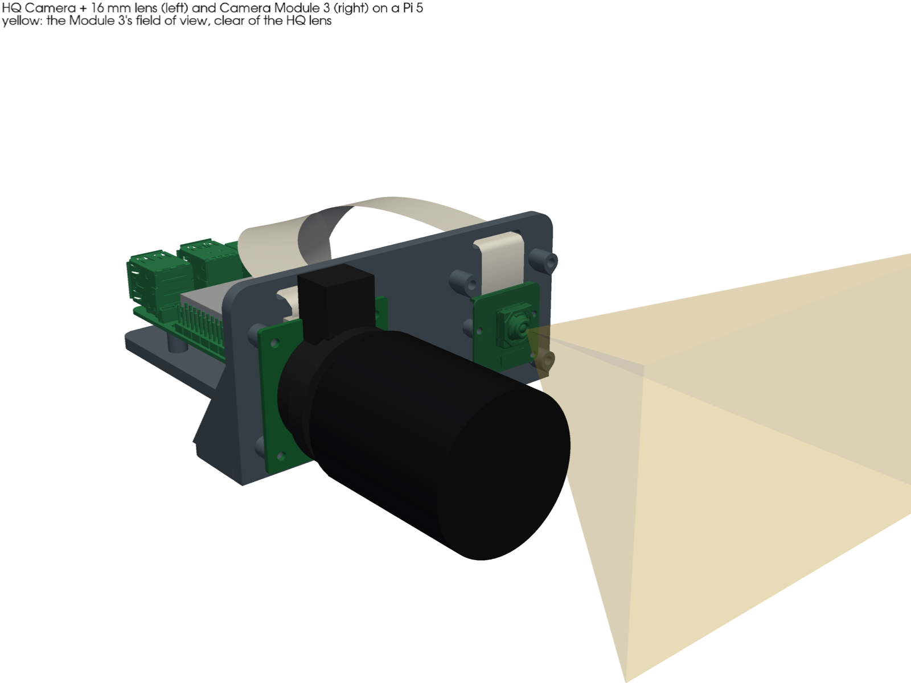
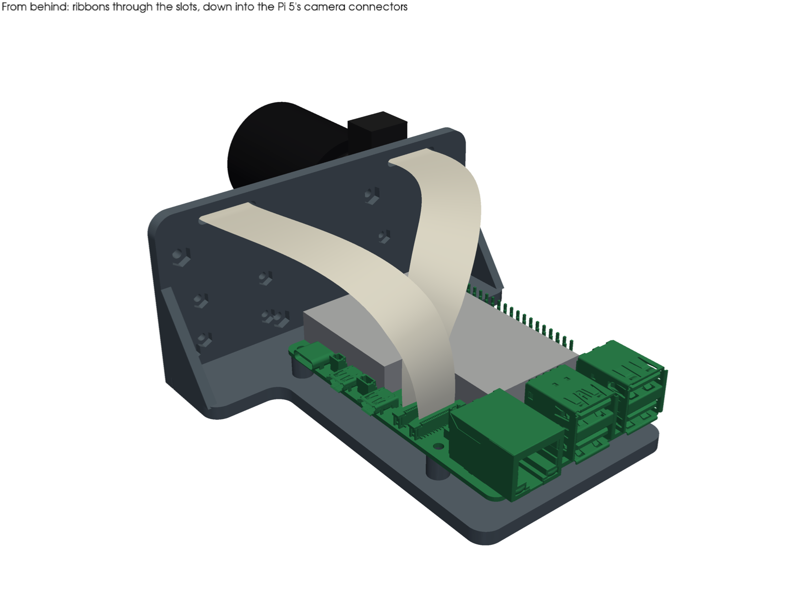
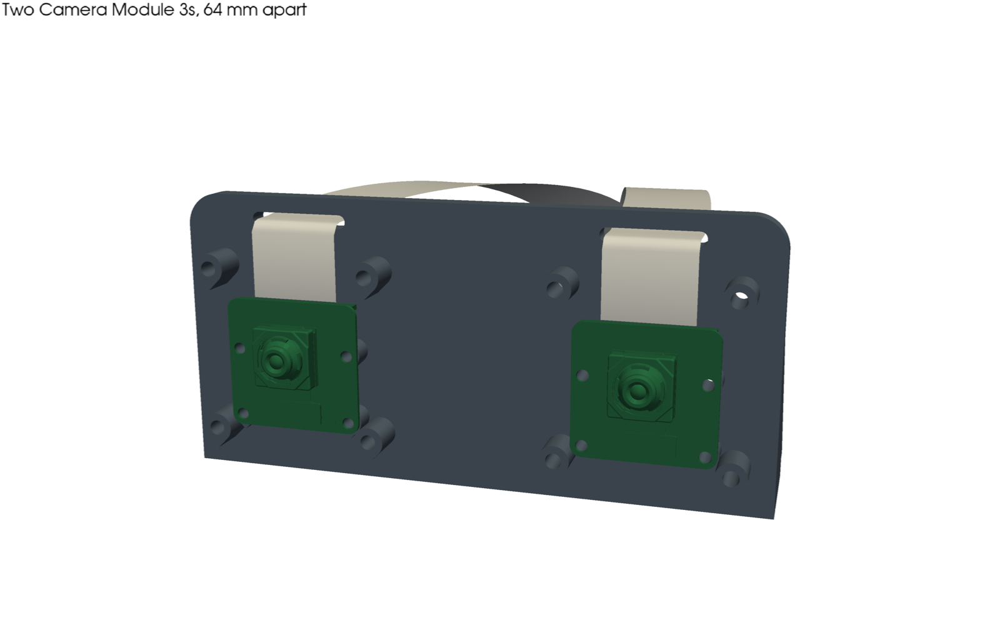
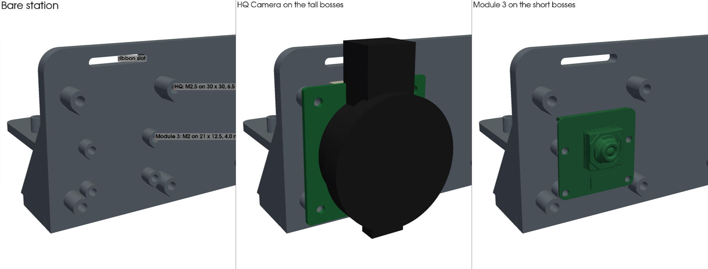

# Raspberry Pi 5 dual-camera mount

This is the Raspberry Pi 5 version of the Pi Zero 2 W "picam mount v2" from ac-dev-lab
([`picam/_design`](https://github.com/AccelerationConsortium/ac-dev-lab/tree/main/src/ac_training_lab/picam/_design),
[ac-dev-lab#292](https://github.com/AccelerationConsortium/ac-dev-lab/pull/292)). It is one printed L-bracket that
sits on the same desk-clamp stand, using the same 1/4"-20 stud and thin nut. The Pi 5 lies on the base, and the
upright has **two identical camera stations**. Each station takes either:

- a **Raspberry Pi HQ Camera** (CS or M12 mount): 4 × M2.5 on 30 × 30 mm, or
- a **Camera Module 3** (standard, wide or NoIR): 4 × M2 on 21 × 12.5 mm.

So the mount holds an HQ Camera plus a Module 3 (either way round), or two Module 3s. Two HQ Cameras fit too; that
layout was checked with 6 mm lenses. Issue: [#238](https://github.com/vertical-cloud-lab/byu-vcl/issues/238).



| From behind: ribbons and the Pi 5 | Two Camera Module 3s |
|---|---|
|  |  |



The Pi 5 and Camera Module 3 in these renders are Raspberry Pi's own STEP models
([`cad/fetch_models.py`](cad/fetch_models.py)). The HQ Camera, its lens and the Active Cooler are simplified models
built from Raspberry Pi's drawings.

## What's here

| Path | What it is |
|---|---|
| [`exports/mount.stl`](exports/mount.stl), [`mount.step`](exports/mount.step) | The printed part, already in print orientation (base on the bed) |
| [`exports/assembly_hq_cm3.step`](exports/assembly_hq_cm3.step), [`assembly_2x_cm3.step`](exports/assembly_2x_cm3.step) | Colour assemblies with the Pi 5, Active Cooler and cameras |
| [`exports/checks.json`](exports/checks.json), [`params.json`](exports/params.json) | Check results and the parameters they came from |
| [`cad/mount.py`](cad/mount.py) | Parametric CadQuery model; builds, checks and exports everything above |
| [`cad/render.py`](cad/render.py), [`cad/fetch_models.py`](cad/fetch_models.py) | Renders, and the download of Raspberry Pi's models they use |
| [`slice/`](slice/) | A1 mini PLA slice (3MF + report) and the script that makes it |

```bash
pip install -r cad/requirements.txt
cd cad
python mount.py                   # build, check, export (about 10 s)
python fetch_models.py            # optional: Raspberry Pi's Pi 5 and Module 3 models, for the renders
xvfb-run -a -s "-screen 0 1920x1080x24" python render.py
```

## Parts

**Printed:** `mount.stl`, one part, 108 × 115 × 52 mm and 50 cm³. It prints in the orientation it's exported in,
with no supports. The bosses on the front have 45° teardrop undersides, the nut pockets in the upright have pointed
roofs, and the cable slots are short bridges. It fits an A1 mini bed (180 × 180 mm). PLA or PETG both work, and
black keeps reflections out of the lenses.

**Sliced for an A1 mini** ([`slice/pi5_dual_camera_mount_A1mini_PLA.3mf`](slice/pi5_dual_camera_mount_A1mini_PLA.3mf),
[`report.json`](slice/report.json)): **1 h 33 min and 44.6 g of PLA**. It used the Bambu Studio 02.08.02.61 CLI with
Bambu's own A1 mini / 0.20 mm Standard / PLA Basic presets, 3 walls, 25 % infill and the Textured PEI plate at 65 °C.
The results:

- No slicer warnings, no toolpaths off the bed, and Bambu's support check flags nothing.
- The only G-code warning is `not_support_traditional_timelapse`, which every single-colour A1 mini print carries.
  Leave timelapse off.
- [`slice/slice_a1mini.py`](slice/slice_a1mini.py) and [`flatten_presets.py`](slice/flatten_presets.py) are the OT-2
  lid mount's scripts ([PR #234](https://github.com/vertical-cloud-lab/byu-vcl/pull/234)), pointed at `mount.stl`.
- On Ubuntu the CLI also needs `libwebkit2gtk-4.1-0`, `libgstreamer-plugins-base1.0-0` and `libwayland-server0`.

**Hardware** (nylon or steel; the M2 parts are the same as the Zero 2 W mount's):

| Qty | Part | For |
|---|---|---|
| 4 | M2.5 × 12 screw + M2.5 nut | Pi 5. The nuts sit in hex pockets under the base, and the screw ends flush with the underside |
| 4 | M2.5 × 12 screw + M2.5 nut | HQ Camera. The nuts sit in pockets in the back of the upright |
| 4 per camera | M2 × 10 screw + M2 nut | Camera Module 3. The Zero 2 W kit's M2 × 12 nylon screws also work; they stick out 2.9 mm behind the upright |
| 1 | 1/4"-20 thin hex nut, 7/16" across flats ([McMaster 91078A029](https://www.mcmaster.com/91078A029/)) | Stand stud, as on the Zero 2 W mount |
| 1 per camera | **Raspberry Pi 5 camera cable, "Standard–Mini", 200 mm** | The cable in the camera's box is Standard–Standard (15-way at both ends) and **does not fit the Pi 5**. The Pi 5's connectors are the 22-way mini type |
| 1 | Raspberry Pi Active Cooler | Recommended for the Pi 5; it is included in all the checks |
| 1 | Pi 5 USB-C supply (27 W) | |

The desk-clamp stand and 7/16" nut driver are the same as the Zero 2 W setup's
(see the [picam README](https://github.com/AccelerationConsortium/ac-dev-lab/blob/main/src/ac_training_lab/picam/README.md#mounting-hardware)).

## Assembly

1. **Stand nut.** Drop the 1/4"-20 thin nut into the hex collar on the base, behind the upright. The collar stops the
   nut turning, so the mount screws straight onto the stand's stud; a 7/16" nut driver still reaches it.
2. **Pi 5.** Put M2.5 nuts in the four hex pockets under the base. Fit the Active Cooler to the Pi first, then screw
   the Pi down with its microSD edge towards the upright. The USB-C and HDMI ports then face right (seen from the
   front) and Ethernet/USB face the back. The holes would also fit the Pi turned round, but then the ports face the
   upright and the camera cables have to cross the whole board.
3. **Cables first.** Push each camera's Standard–Mini cable, 15-way end first, through the slot at the top of its
   station from behind, and connect it to the camera.
4. **Cameras, cable up.** Mount each camera with its ribbon connector at the **top**:
   - An **HQ Camera** goes on the four tall (6.5 mm) bosses. Its tripod foot points up, clear of everything.
   - A **Module 3** goes on the four short (4 mm) bosses. The HQ bosses stand beside it and don't touch it.

   Nuts go into the pockets in the back of the upright. Hold each one with a finger while you turn the screw.
5. **Pi end.** Lead each ribbon back over the Pi and down into one of the two camera connectors (CAM/DISP 0 and 1,
   between the micro HDMI ports and the Ethernet jack), with the contacts facing away from the latch. The modelled
   routes are 114–125 mm long, so a 200 mm cable leaves spare length for a loose loop. A ribbon can twist to make up
   the sideways offset; don't crease it.

**Image orientation.** With the cables up, the cameras are upside down compared with the usual cable-down mounting.
If the picture comes out inverted, rotate it 180° in software: `rpicam-vid --rotation 180`, `Transform(hflip=1,
vflip=1)` in picamera2, or both `CAMERA_VFLIP` and `CAMERA_HFLIP` in ac-dev-lab's picam `device.py`. With two
cameras, pick one with `--camera 0` or `--camera 1` (`rpicam-hello --list-cameras` lists them). The Pi 5 has no
hardware H.264 encoder, so two simultaneous streams are encoded on the CPU.

## Design decisions

- **The cameras mount on the front of the upright.** The Zero 2 W mount clamps its Module 3 *behind* the upright,
  with the lens through a window. That can't work for the HQ Camera: its integrated tripod foot sticks out 11 mm
  past the board and reaches back to the board's rear face, so the upright would need a slot through it. On the
  front, the foot hangs in air, and every lens, focus and back-focus ring can be reached.
- **One station fits both cameras**, because the two boss sets are different heights. The HQ board sits 2.5 mm above
  the Module 3 boss tops, and the Module 3 board clears the HQ bosses by 1.3 mm. Its corners are notched, as in
  Raspberry Pi's STEP model. The Module 3 bosses are placed from its drawing so that its lens lands on the HQ
  Camera's axis: swapping cameras doesn't move the view.
- **Cables go up, not down.** The Pi 5's camera connectors take the ribbon from above, and they sit right next to the
  Active Cooler's fan. With the cables running up over the upright and down into the connectors, the cables never lie
  on the cooler. They also need no twist at the camera end: at both ends the ribbon's width runs along X, which is why
  the Pi lies lengthways, microSD edge first. Cable-up also keeps the HQ Camera's foot away from the stand's head.
- **Stations are 64 mm apart**, which is also a typical human eye spacing, if the two Module 3s are used as a stereo
  pair. The spacing was chosen so that the official 16 mm lens stays out of a standard Module 3's view beside it
  (`station_pitch` in `Params`):

  | HQ lens | Beside a Module 3 (66° × 41°) | Beside a Module 3 Wide (102° × 67°) |
  |---|---|---|
  | 6 mm, Ø30 × 34 mm | clear (it needs ≥ 41 mm) | clear (≥ 63 mm) |
  | 16 mm, Ø39 × 50 mm | clear (≥ 59 mm) | **in view** (needs ≥ 93 mm) |
  | 8–50 mm zoom, Ø40 × 68 mm | **in view** (needs ≥ 71 mm) | **in view** (≥ 116 mm) |

  "In view" means the lens barrel appears at the edge of the Module 3's image on the HQ side. Crop it off, or raise
  `station_pitch` and re-export. The figures come from a solid view pyramid of each Module 3 intersected with the
  lens envelope (`fov_intrusion_mm3` in `checks.json`).
- **The stand interface is unchanged:** a Ø7 mm clearance hole for the stud and the same thin nut. It sits
  centred, 13 mm behind the upright's front face (18 mm on the Zero 2 W mount).

## Checks (`python mount.py`, results in [`exports/checks.json`](exports/checks.json))

- **Interference: 35 pairs, all 0 mm³.** The mount was checked against the Pi 5, the Active Cooler with its push
  pins, a USB-C plug, and every camera part. Four layouts were checked: HQ + Module 3, Module 3 + HQ, two Module 3s,
  and two HQ Cameras with 6 mm lenses.
- **Closest approaches:** Active Cooler push pins to a Pi boss 1.0 mm; USB-C plug to the base 1.85 mm; HQ connector to
  the nearest boss 2.45 mm; Module 3 connector to its own lens-side boss 0.57 mm.
- **Screw stacks:** Pi 5 and HQ 12.0 / 11.9 mm, which an M2.5 × 12 spans with the nut fully engaged. Module 3 9.1 mm,
  for an M2 × 10.

## Where the numbers come from

| Part | Source |
|---|---|
| Raspberry Pi 5 | [Mechanical drawing](https://datasheets.raspberrypi.com/rpi5/raspberry-pi-5-mechanical-drawing.pdf) and the official [STEP model](https://datasheets.raspberrypi.com/rpi5/RaspberryPi5-step.zip) (MIT). The camera-connector positions and heights, microSD and push-pin holes were read from the STEP |
| Camera Module 3 | [Standard](https://datasheets.raspberrypi.com/camera/camera-module-3-standard-mechanical-drawing.pdf) and [wide](https://datasheets.raspberrypi.com/camera/camera-module-3-wide-mechanical-drawing.pdf) drawings, and the [STEP model](https://pip.raspberrypi.com/categories/1207-design-files). The holes are Ø2.2 slots, ±0.7 mm across |
| HQ Camera | [CS-mount drawing](https://datasheets.raspberrypi.com/hq-camera/hq-camera-cs-mechanical-drawing.pdf) and [product brief](https://datasheets.raspberrypi.com/hq-camera/hq-camera-product-brief.pdf). The foot and skirt outlines are estimates |
| Active Cooler | [Mechanical drawing](https://datasheets.raspberrypi.com/cooling/raspberry-pi-active-cooler-mechanical-drawing.pdf): 63.5 × 42.5 mm, notched around the camera connectors. The ~9 mm height above the board is read off that drawing |
| Lenses | Official 6 mm (Ø30 × 34 mm) and 16 mm (Ø39 × 50 mm) lens listings; the 8–50 mm zoom as used in the [OT-2 lid mount](https://github.com/vertical-cloud-lab/byu-vcl/pull/234) |
| Zero 2 W mount | `picam3-mount-v2.stl`, measured: 3 mm L-bracket, 43 × 105 mm base, Ø7 stud hole, Module 3 holes at two heights |

## Not done yet

- **Nothing has been printed.** The boss and nut-pocket fits use the same allowances as the OT-2 lid mount: +0.4 mm
  across the nut flats, and clearance holes of Ø2.4 (M2) and Ø2.8 (M2.5).
- **The 3MF has no plate thumbnail.** Headless, the CLI needs the OpenGL workaround described in PR #234's slice
  README for that. It doesn't affect the print.
- **Image orientation** with the cables up hasn't been checked on hardware; see *Image orientation* above.
- **The HQ Camera's back** isn't in any Raspberry Pi model. The 2.5 mm between its board and the Module 3 bosses
  assumes nothing on its back is taller than that apart from the connector, which is modelled.
