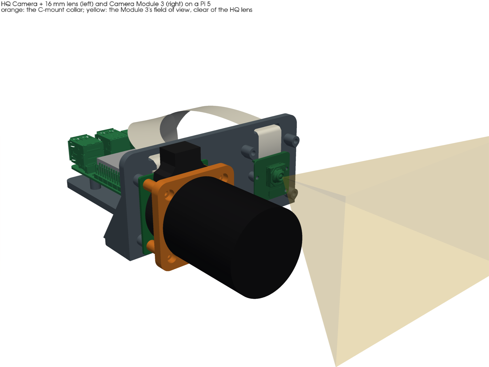
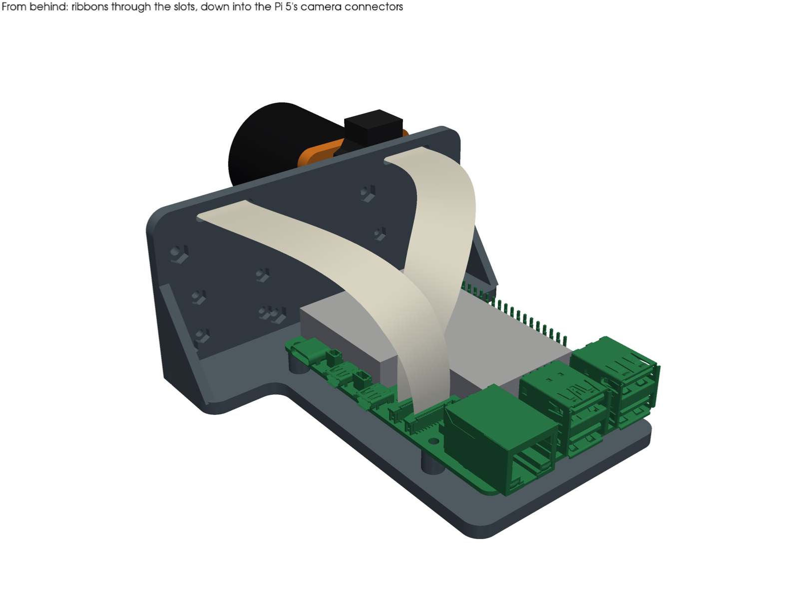
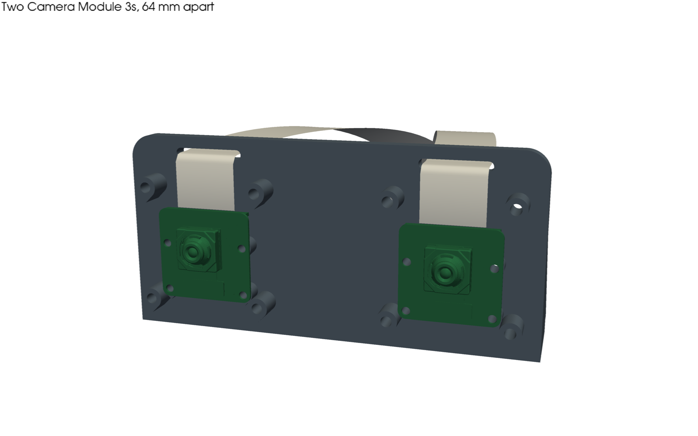
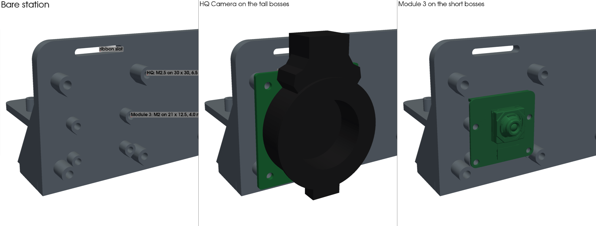
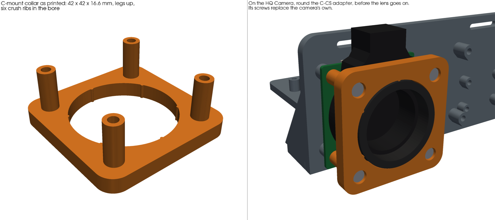
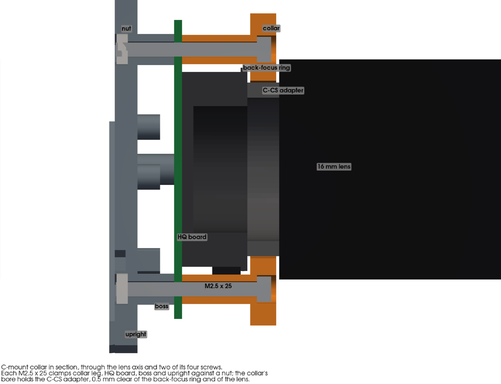
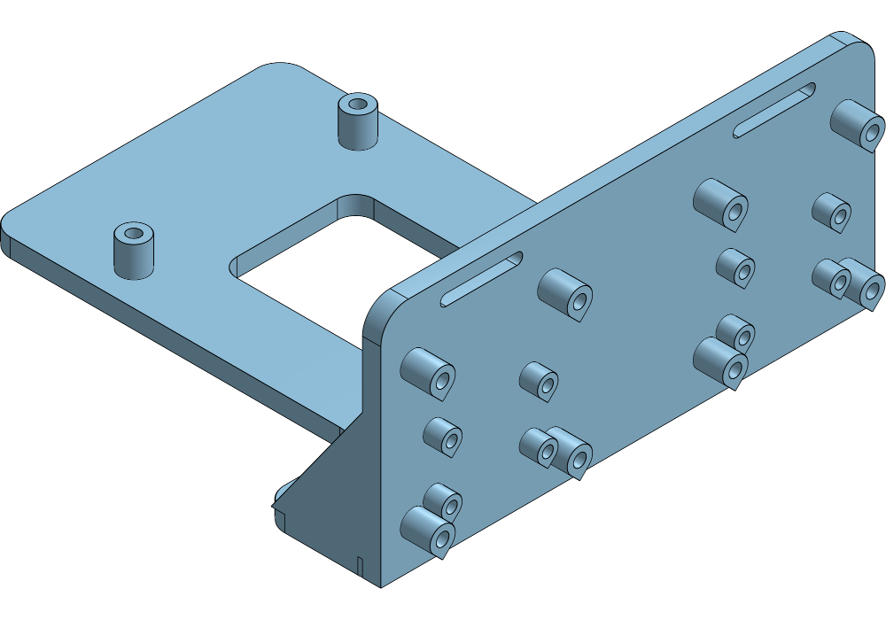
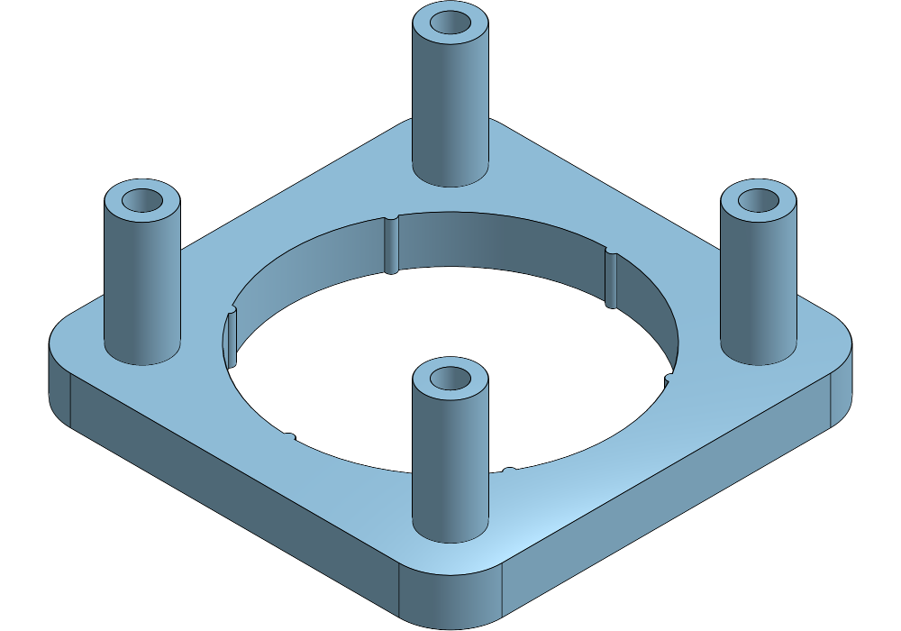
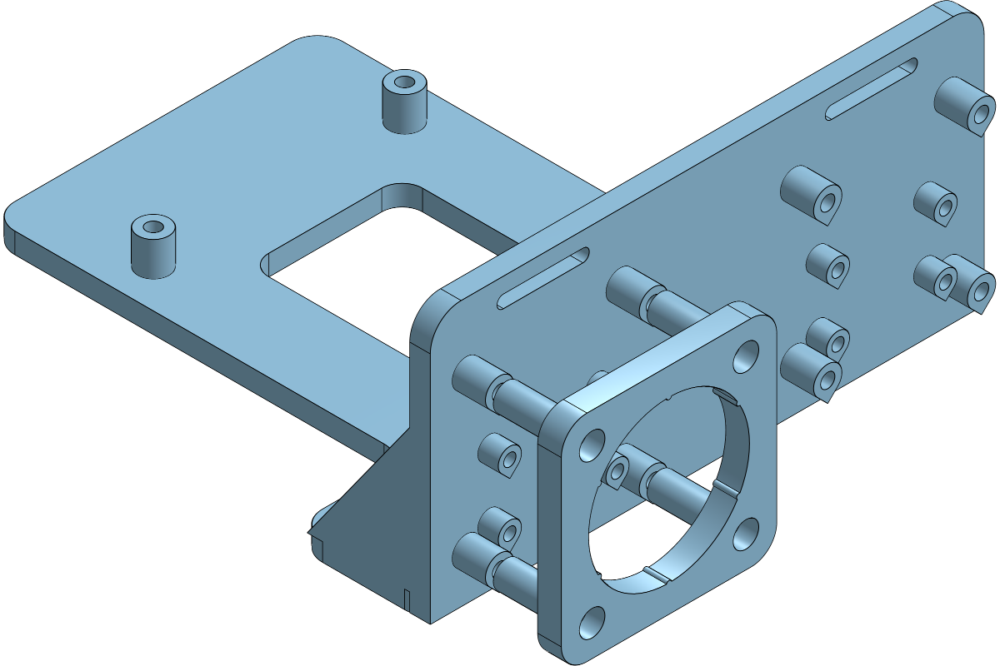
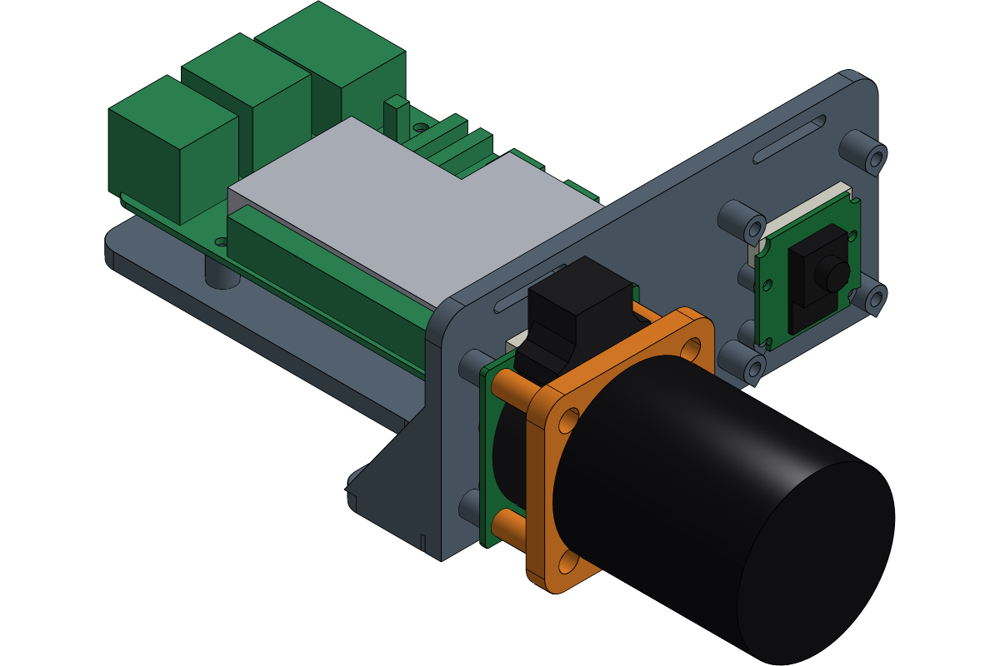

# Raspberry Pi 5 dual-camera mount

This is the Raspberry Pi 5 version of the Pi Zero 2 W "picam mount v2" from ac-dev-lab
([`picam/_design`](https://github.com/AccelerationConsortium/ac-dev-lab/tree/main/src/ac_training_lab/picam/_design),
[ac-dev-lab#292](https://github.com/AccelerationConsortium/ac-dev-lab/pull/292)). It is one printed L-bracket that
sits on the same desk-clamp stand, using the same 1/4"-20 stud and thin nut. The Pi 5 lies on the base, and the
upright has **two identical camera stations**. Each station takes either:

- a **Raspberry Pi HQ Camera** (CS or M12 mount): 4 × M2.5 on 30 × 30 mm, or
- a **Camera Module 3** (standard, wide or NoIR): 4 × M2 on 21 × 12.5 mm.

So the mount holds an HQ Camera plus a Module 3 (either way round), or two Module 3s. Two HQ Cameras fit too; that
layout was checked with 6 mm lenses. An HQ Camera also gets a **[C-mount collar](#c-mount-collar)**, a small second
printed part that holds its lens all round at the root. Both parts are also in
**[Onshape](#onshape)** as native, editable features. Issue: [#238](https://github.com/vertical-cloud-lab/byu-vcl/issues/238).



| From behind: ribbons and the Pi 5 | Two Camera Module 3s |
|---|---|
|  |  |



The Pi 5 and Camera Module 3 in these renders are Raspberry Pi's own STEP models
([`cad/fetch_models.py`](cad/fetch_models.py)). The HQ Camera, its lens and the Active Cooler are simplified models
built from Raspberry Pi's drawings.

## C-mount collar

A C lens on the HQ Camera hangs off a chain of threads. The lens screws into the C-CS adapter, the adapter into the
back-focus ring, and the ring into the camera's housing, which sits on the 38 mm camera board. The board is held
only by its four corner screws. The official 16 mm lens weighs about 134 g and is 50 mm long, so its front is about
63 mm off the board. A knock on the lens, or a firm twist of its focus ring, goes through all those threads and the
board into four 5.5 mm printed bosses.

The collar is a second printed part, one for each HQ Camera. It is a 42 mm square plate that goes **all the way round
the C-CS adapter**. It stands on four legs, one on each of the camera's corner holes. The camera's own screws,
lengthened to M2.5 × 25, run through the legs, the camera board and the bosses into the nuts already in the upright.
So:

- **The lens is held all round at its root.** Its weight, or a knock, reaches the screws through the collar, not
  through the camera's lens-mount joint and its board.
- **The camera board is clamped** between the collar's legs and the bosses, instead of hanging on four screw heads.
- **The collar can't be off-centre.** It is located by the same four holes as the camera, so it is concentric
  with the lens by construction.





It grips the C-CS adapter, not the lens. So it fits any C lens and leaves the focus, iris and zoom rings free. It
sits in the one place nothing moves, between the back-focus ring (0.5 mm behind it) and the back of the lens
(0.53 mm in front). Six crush ribs in the Ø31.4 bore reach Ø30.6, just inside the adapter's Ø30.75 knurl. They take
up the printer's hole tolerance, so it is a light push fit. A 6 mm CS lens has no adapter. Its Ø30 barrel passes
through the ribs with 0.3 mm to spare, so the collar can stay on, though a lens that light hardly needs it.

It is a separate part, not part of the upright, so either station can still take a Module 3. The collar doesn't
change where the load ends up: it still reaches the upright through the same four bosses and nuts. What it removes
is the weak middle of the path: the camera's own joints and board no longer carry the lens.

## What's here

| Path | What it is |
|---|---|
| [`exports/mount.stl`](exports/mount.stl), [`mount.step`](exports/mount.step) | The printed mount, already in print orientation (base on the bed) |
| [`exports/collar.stl`](exports/collar.stl), [`collar.step`](exports/collar.step) | The C-mount collar, in print orientation (front face on the bed, legs up) |
| [`exports/assembly_hq_cm3.step`](exports/assembly_hq_cm3.step), [`assembly_2x_cm3.step`](exports/assembly_2x_cm3.step) | Colour assemblies with the Pi 5, Active Cooler, cameras and collar |
| [`exports/checks.json`](exports/checks.json), [`params.json`](exports/params.json) | Check results and the parameters they came from |
| [`cad/mount.py`](cad/mount.py) | Parametric CadQuery model; builds, checks and exports everything above |
| [`cad/render.py`](cad/render.py), [`cad/fetch_models.py`](cad/fetch_models.py) | Renders, and the download of Raspberry Pi's models they use |
| [`onshape/`](onshape/) | The Onshape version: the feature list, the REST script, and the run's record and images |
| [`slice/`](slice/) | A1 mini PLA slice of the mount and a collar (3MF + report) and the script that makes it |

```bash
pip install -r cad/requirements.txt
cd cad
python mount.py                   # build, check, export (about 20 s)
python fetch_models.py            # optional: Raspberry Pi's Pi 5 and Module 3 models, for the renders
xvfb-run -a -s "-screen 0 1920x1080x24" python render.py
```

## Parts

**Printed:**

- `mount.stl`, one part, 108 × 115 × 52 mm and 50 cm³. It prints in the orientation it's exported in, with no
  supports. The bosses on the front have 45° teardrop undersides, the nut pockets in the upright have pointed roofs,
  and the cable slots are short bridges.
- `collar.stl`, one per HQ Camera, 42 × 42 × 17 mm and 4.9 cm³. It prints front face down, with its four legs
  standing up, also without supports.

Both fit an A1 mini bed (180 × 180 mm). PLA or PETG both work, and black keeps reflections out of the lenses.

**Sliced for an A1 mini** ([`slice/pi5_dual_camera_mount_A1mini_PLA.3mf`](slice/pi5_dual_camera_mount_A1mini_PLA.3mf),
[`report.json`](slice/report.json)): one plate with the mount and one collar beside it, **1 h 44 min and 49.3 g of
PLA**. The mount alone was 1 h 33 min and 44.6 g. It used the Bambu Studio 02.08.02.61 CLI with Bambu's own A1 mini /
0.20 mm Standard / PLA Basic presets, 3 walls, 25 % infill and the Textured PEI plate at 65 °C. The results:

- No slicer warnings, no toolpaths off the bed, and Bambu's support check flags neither part.
- The only G-code warning is `not_support_traditional_timelapse`, which every single-colour A1 mini print carries.
  Leave timelapse off.
- [`slice/slice_a1mini.py`](slice/slice_a1mini.py) and [`flatten_presets.py`](slice/flatten_presets.py) are the OT-2
  lid mount's scripts ([PR #234](https://github.com/vertical-cloud-lab/byu-vcl/pull/234)), pointed at `mount.stl` and
  `collar.stl`. For two HQ Cameras, add a second collar to `PLATES`.
- On Ubuntu the CLI also needs `libwebkit2gtk-4.1-0`, `libgstreamer-plugins-base1.0-0` and `libwayland-server0`.

**Hardware** (nylon or steel; the M2 parts are the same as the Zero 2 W mount's):

| Qty | Part | For |
|---|---|---|
| 4 | M2.5 × 12 screw + M2.5 nut | Pi 5. The nuts sit in hex pockets under the base, and the screw ends flush with the underside |
| 4 per HQ Camera | **M2.5 × 25** socket-head screw + M2.5 nut | HQ Camera with its collar. The heads sit in counterbores in the collar, clear of the lens, and each screw ends 0.15 mm inside the upright's back face, through the nut in its pocket. Without the collar, M2.5 × 12 |
| 4 per camera | M2 × 10 screw + M2 nut | Camera Module 3. The Zero 2 W kit's M2 × 12 nylon screws also work; they stick out 2.9 mm behind the upright |
| 1 | 1/4"-20 thin hex nut, 7/16" across flats ([McMaster 91078A029](https://www.mcmaster.com/91078A029/)) | Stand stud, as on the Zero 2 W mount |
| 1 per camera | **Raspberry Pi 5 camera cable, "Standard–Mini", 200 mm** | The cable in the camera's box is Standard–Standard (15-way at both ends) and **does not fit the Pi 5**. The Pi 5's connectors are the 22-way mini type |
| 1 | Raspberry Pi Active Cooler | Recommended for the Pi 5; it is included in all the checks |
| 1 | Pi 5 USB-C supply (27 W) | |

The desk-clamp stand and 7/16" nut driver are the same as the Zero 2 W setup's
(see the [picam README](https://github.com/AccelerationConsortium/ac-dev-lab/blob/main/src/ac_training_lab/picam/README.md#mounting-hardware)).

## Assembly

1. **Stand nut.** Drop the 1/4"-20 thin nut into the hex collar on the base, behind the upright. The collar stops the
   nut turning, so the mount screws straight onto the stand's stud; a 7/16" nut driver still reaches it.
2. **Cables through the slots.** Push each camera's Standard–Mini cable, 15-way end first, through the slot at the
   top of its station from behind, and connect it to the camera.
3. **Cameras, cable up**, before the Pi goes on, so the nut pockets in the back of the upright are easy to reach.
   Mount each camera with its ribbon connector at the **top**. Hold each nut in its pocket with a finger while you
   turn the screw.
   - An **HQ Camera** goes on the four tall (6.5 mm) bosses. Its tripod foot points up, clear of everything.
     1. Check that its back-focus ring is screwed fully in, with the back-focus lock screw tight, as Raspberry Pi's
        lens guides say.
     2. For a C lens, screw the C-CS adapter into the ring on its own, without the lens.
     3. Push the collar over the adapter, legs first, so the legs land on the camera's four corner holes.
     4. Fit the four M2.5 × 25 screws through the collar, the camera board and the bosses into the nuts.
     5. Screw the lens into the adapter last.
   - A **Module 3** goes on the four short (4 mm) bosses. The HQ bosses stand beside it and don't touch it.
4. **Pi 5.** Put M2.5 nuts in the four hex pockets under the base. Fit the Active Cooler to the Pi first, then screw
   the Pi down with its microSD edge towards the upright. The USB-C and HDMI ports then face right (seen from the
   front) and Ethernet/USB face the back. The holes would also fit the Pi turned round, but then the ports face the
   upright and the camera cables have to cross the whole board.
5. **Pi end.** Lead each ribbon back over the Pi and down into one of the two camera connectors (CAM/DISP 0 and 1,
   between the micro HDMI ports and the Ethernet jack), with the contacts facing away from the latch. The modelled
   routes are 114–125 mm long, so a 200 mm cable leaves spare length for a loose loop. A ribbon can twist to make up
   the sideways offset; don't crease it.

**Image orientation.** With the cables up, the cameras are upside down compared with the usual cable-down mounting.
If the picture comes out inverted, rotate it 180° in software: `rpicam-vid --rotation 180`, `Transform(hflip=1,
vflip=1)` in picamera2, or both `CAMERA_VFLIP` and `CAMERA_HFLIP` in ac-dev-lab's picam `device.py`. With two
cameras, pick one with `--camera 0` or `--camera 1` (`rpicam-hello --list-cameras` lists them). The Pi 5 has no
hardware H.264 encoder, so two simultaneous streams are encoded on the CPU.

## Design decisions

- **The cameras mount on the front of the upright.** The Zero 2 W mount clamps its Module 3 *behind* the upright,
  with the lens through a window. That can't work for the HQ Camera: its integrated tripod foot sticks out 11 mm
  past the board and reaches back to the board's rear face, so the upright would need a slot through it. On the
  front, the foot hangs in air, and every lens, focus and back-focus ring can be reached.
- **One station fits both cameras**, because the two boss sets are different heights. The HQ board sits 2.5 mm above
  the Module 3 boss tops, and the Module 3 board clears the HQ bosses by 1.3 mm. Its corners are notched, as in
  Raspberry Pi's STEP model. The Module 3 bosses are placed from its drawing so that its lens lands on the HQ
  Camera's axis: swapping cameras doesn't move the view.
- **The C-mount collar is a separate part that uses the camera's own screw holes** (see [above](#c-mount-collar)).
  A collar printed as part of the upright would stop the camera board getting onto its bosses. Legs that landed on
  the upright beside the camera board would need their own holes and a wider upright, and would only line up with
  the lens to the tolerance of two sets of holes.
- **Cables go up, not down.** The Pi 5's camera connectors take the ribbon from above, and they sit right next to the
  Active Cooler's fan. With the cables running up over the upright and down into the connectors, the cables never lie
  on the cooler. They also need no twist at the camera end: at both ends the ribbon's width runs along X, which is why
  the Pi lies lengthways, microSD edge first. Cable-up also keeps the HQ Camera's foot away from the stand's head.
- **Stations are 64 mm apart**, which is also a typical human eye spacing, if the two Module 3s are used as a stereo
  pair. The spacing was chosen so that the official 16 mm lens stays out of a standard Module 3's view beside it
  (`station_pitch` in `Params`):

  | HQ lens | Beside a Module 3 (66° × 41°) | Beside a Module 3 Wide (102° × 67°) |
  |---|---|---|
  | 6 mm, Ø30 × 34 mm | clear (it needs ≥ 40 mm) | clear (≥ 60 mm) |
  | 16 mm, Ø39 × 50 mm | clear (≥ 58 mm) | **in view** (needs ≥ 90 mm) |
  | 8–50 mm zoom, Ø40 × 68 mm | **in view** (needs ≥ 70 mm) | **in view** (≥ 113 mm) |

  "In view" means the lens barrel appears at the edge of the Module 3's image on the HQ side. Crop it off, or raise
  `station_pitch` and re-export. The figures come from a solid view pyramid of each Module 3 intersected with the
  lens, camera and collar (`fov_intrusion_mm3` in `checks.json`). The collar itself never enters the view.
- **The stand interface is unchanged:** a Ø7 mm clearance hole for the stud and the same thin nut. It sits
  centred, 13 mm behind the upright's front face (18 mm on the Zero 2 W mount).

## Checks (`python mount.py`, results in [`exports/checks.json`](exports/checks.json))

- **Interference: 73 pairs, all 0 mm³.** The mount was checked against the Pi 5, the Active Cooler with its push
  pins, a USB-C plug, and every camera part. Four layouts were checked: HQ + Module 3, Module 3 + HQ, two Module 3s,
  and two HQ Cameras with 6 mm lenses. Each collar was also checked against every other part in its layout.
- **The only overlap is designed in:** 0.73 mm³ where the crush ribs bite the C-CS adapter's knurl, 0.075 mm per side
  (`press_fit_mm3`).
- **Collar clearances:** 0.5 mm to the back-focus ring and 0.53 mm to a C lens. The legs clear the ring by 0.61 mm
  and the tripod foot's skirt by 0.77 mm. A 6 mm lens clears the crush ribs by 0.3 mm a side.
- **Closest approaches, as before:** Active Cooler push pins to a Pi boss 1.0 mm; USB-C plug to the mount 1.85 mm; HQ
  connector to the nearest boss 2.45 mm; Module 3 connector to its own lens-side boss 0.57 mm.
- **Screw stacks:** Pi 5 and bare HQ 12.0 / 11.9 mm, which an M2.5 × 12 spans with the nut fully engaged. HQ with the
  collar 25.15 mm, for an M2.5 × 25. Module 3 9.1 mm, for an M2 × 10.

## Onshape

Both printed parts are in Onshape as **native features**, in the lab's **vcl-shared** folder. The document is
[Pi 5 dual-camera mount (2958f20)](https://cad.onshape.com/documents/a7f8eebd3fd360dd05a430d2/w/fe08f15a192259fd4c73ef83),
owned by Vertical Cloud Lab, like the lab's copy of the OT-2 lid mount.

| Tab | What it is |
|---|---|
| **Mount (native features)** | 27 features: sketches on the Top, Front and Right planes, and the extrudes that use them. Change a sketch or a depth and the part rebuilds |
| **C-mount collar (native features)** | 10 features, in print orientation |
| **Mount + C-mount collar (native parts)** | An assembly of those two parts, with the collar where it sits on the left station |
| mount, collar, assembly_hq_cm3, assembly_2x_cm3 | The STEP exports, imported for reference. The assemblies carry the Pi 5, cooler, cameras and lens |

**Onshape's own mass properties match CadQuery to the thousandth of a mm³:** 50,276.095 mm³ for the mount and
4,891.852 mm³ for the collar, with identical bounding boxes.

| Native mount | Native collar | Native assembly | Imported HQ + Module 3 assembly |
|---|---|---|---|
|  |  |  |  |

How it was built:

- [`onshape/features.py`](onshape/features.py) lists both parts as Onshape sketches and extrudes.
- It also replays that list in CadQuery, using Onshape's plane and extrude conventions from the FeatureScript
  standard library ([`defaultFeatures.fs`](https://github.com/javawizard/onshape-std-library-mirror/blob/without-versions/defaultFeatures.fs),
  [`extrude.fs`](https://github.com/javawizard/onshape-std-library-mirror/blob/without-versions/extrude.fs)). The
  replay matches `mount.py` with zero symmetric difference, so the list was known to be right before any API call.
- [`onshape/onshape_api.py`](onshape/onshape_api.py) sends the list over the REST API. It follows the OT-2 lid mount's
  script from #234.
- Every feature regenerated OK on the first attempt. The whole job took 97 API calls, out of the company's 2,500 a
  year; [`evidence/runs.json`](onshape/evidence/runs.json) has the record.

```bash
pip install -r onshape/requirements.txt
cd onshape
python features.py                # CadQuery replay against mount.py: should print zero differences
python onshape_api.py --dry-run   # no network; every request goes to dry_run.json
python onshape_api.py --parent 222f47147b861ce6fc04396f --owner-id 69eaf7207a4e49d261c433fb --owner-type 1
                                  # a new document in vcl-shared; needs ONSHAPE_ACCESS_KEY and ONSHAPE_SECRET_KEY
```

- **Delete the empty "Part Studio 1" tab by hand.** Every new document starts with one, and this API key can't
  delete tabs (HTTP 403). The script now renames that tab and builds the mount in it, so a new run leaves nothing
  behind.
- **The sketches carry no dimensions or constraints.** Their geometry is exact, so to change one, drag it or add
  dimensions in Onshape. Or change `Params` in `mount.py` and run the script again.

## Where the numbers come from

| Part | Source |
|---|---|
| Raspberry Pi 5 | [Mechanical drawing](https://datasheets.raspberrypi.com/rpi5/raspberry-pi-5-mechanical-drawing.pdf) and the official [STEP model](https://datasheets.raspberrypi.com/rpi5/RaspberryPi5-step.zip) (MIT). The camera-connector positions and heights, microSD and push-pin holes were read from the STEP |
| Camera Module 3 | [Standard](https://datasheets.raspberrypi.com/camera/camera-module-3-standard-mechanical-drawing.pdf) and [wide](https://datasheets.raspberrypi.com/camera/camera-module-3-wide-mechanical-drawing.pdf) drawings, and the [STEP model](https://pip.raspberrypi.com/categories/1207-design-files). The holes are Ø2.2 slots, ±0.7 mm across |
| HQ Camera | [CS-mount drawing](https://datasheets.raspberrypi.com/hq-camera/hq-camera-cs-mechanical-drawing.pdf), [lens-mount parts](https://pip-assets.raspberrypi.com/categories/659-raspberry-pi-high-quality-camera/documents/RP-008199-DS-1-hq-camera-cs-lensmount-drawing.pdf) and [product brief](https://datasheets.raspberrypi.com/hq-camera/hq-camera-product-brief.pdf). See the note below |
| Active Cooler | [Mechanical drawing](https://datasheets.raspberrypi.com/cooling/raspberry-pi-active-cooler-mechanical-drawing.pdf): 63.5 × 42.5 mm, notched around the camera connectors. The ~9 mm height above the board is read off that drawing |
| Lenses | Official 6 mm (Ø30 × 34 mm) and 16 mm (Ø39 × 50 mm, about 134 g) lens listings and the [C-mount lens guide](https://datasheets.raspberrypi.com/hq-camera/c-mount-lens-guide.pdf); the 8–50 mm zoom as used in the [OT-2 lid mount](https://github.com/vertical-cloud-lab/byu-vcl/pull/234) |
| Zero 2 W mount | `picam3-mount-v2.stl`, measured: 3 mm L-bracket, 43 × 105 mm base, Ø7 stud hole, Module 3 holes at two heights |

**How the HQ Camera's lens mount was read.** The CS-mount drawing is drawn to scale (6.66 pt/mm), so where a size
isn't labelled, it was measured off the drawing's own vector geometry:

- The main housing is Ø34.5 and 10.35 mm long.
- The back-focus ring's knurled flange is Ø36 × 1.2 mm.
- The C-CS adapter's knurl is Ø30.75, and the drawing shows it fitted.
- The tripod foot's skirt comes within 3.37 mm of the two mounting holes beside it.

The drawing's overall **18.58 mm** runs from the C flange to the **board's back face**. Its extension line points
at the connector, but the drawn geometry says otherwise, and so does the Global Shutter camera's drawing, whose
25.07 mm is exactly 18.58 plus that camera's 6.49 mm back cover. So a C lens starts 17.18 mm in front of the board.
The first version of this model had read that length as running to the connector (14.43 mm). Its lenses therefore
sat about 2.3 mm further forward than they should, which is why the field-of-view figures above moved slightly.

## Not done yet

- **Nothing has been printed**, the collar included.
  - The boss and nut-pocket fits use the same allowances as the OT-2 lid mount: +0.4 mm across the nut flats, and
    clearance holes of Ø2.4 (M2) and Ø2.8 (M2.5).
  - How tight the collar's crush ribs grip depends on the printer; they are meant to be a light push fit.
- **The collar assumes the back-focus ring is screwed fully in,** as Raspberry Pi's lens guides say. If yours is
  backed out, the ring comes forward to meet the collar; put M2.5 washers under the collar's legs to match.
- **The 3MF has no plate thumbnail.** Headless, the CLI needs the OpenGL workaround described in PR #234's slice
  README for that. It doesn't affect the print.
- **Image orientation** with the cables up hasn't been checked on hardware; see *Image orientation* above.
- **The HQ Camera's back** isn't in any Raspberry Pi model. The 2.5 mm between its board and the Module 3 bosses
  assumes nothing on its back is taller than that apart from the connector, which is modelled.
