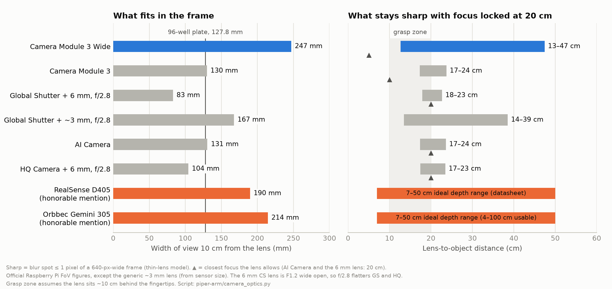

# Eye-in-hand camera for the AgileX PiPER

Research notes on choosing, and then mounting, the wrist camera for the lab's AgileX PiPER
6-DOF arm ([issue #233](https://github.com/vertical-cloud-lab/byu-vcl/issues/233)). The
camera is fixed to the gripper looking down the end effector ("eye-in-hand"), is driven from a
Raspberry Pi, and is for AI and computer-vision research on objects within the arm's reach.

> **Short answer.** Mount a **Camera Module 3 Wide**, which the lab already stocks, with its
> focus locked at about 20 cm. Design the mount around a swappable camera plate so that an
> **Intel RealSense D405** can go on later, once the work needs metric depth. For this job the
> four Raspberry Pi cameras rank **Camera Module 3 (Wide) > Global Shutter > AI Camera > High
> Quality**.

## What the wrist position asks of a camera

Some numbers for scale, from the
[AgileX quick-start manual](https://static.generation-robots.com/media/agilex-piper-user-manual.pdf).
The PiPER has 6 DOF, weighs 4.2 kg, carries a **1.5 kg payload**, reaches 626.75 mm, repeats
to ±0.1 mm, and turns its wrist joints (J4–J6) at up to 225°/s.

It costs **$1,999** on [AgileX's own store](https://global.agilex.ai/products/piper). The
parallel gripper is about $250 more
([AIFITLAB](https://aifitlab.com/products/agilex-piper-robotic-arm)); it weighs 500 g and
opens 70 mm or 100 mm, depending on the version. US resellers ask $2,950–$3,990. **Every
Raspberry Pi camera in this note costs 1–4 % of the arm, and even a depth camera costs only
10–12 % of the arm plus gripper.** Price is therefore a tie-breaker here, not a deciding
factor.

| Requirement | Why it matters at the wrist |
|---|---|
| Close focus and deep depth of field | With the lens on the gripper about 10 cm behind the fingertips, the object is 10–20 cm away during a grasp and 20–50 cm away on the approach. |
| Wide field of view | The frame has to show both fingertips, the object, and enough of the bench to find the next target. |
| Small and light | Every millimetre adds to the collision envelope, and every gram at the wrist costs payload and inertia. |
| Optics that stay put | Hand-eye calibration assumes the camera's intrinsics are fixed. AgileX publishes an ArUco-based [`handeye_calibration_ros`](https://github.com/agilexrobotics/handeye_calibration_ros) for this. A focus ring that gets knocked, or autofocus that hunts, both break the calibration. |
| Tolerance of motion | The camera moves with the wrist, so rolling-shutter skew and motion blur land on the very frames that matter. |
| A cable route | The wrist has only an XT30 port carrying 24 V at 2 A plus CAN. There is no USB and no spare wiring through the arm ([manual](https://cdn.shopify.com/s/files/1/0673/6848/5000/files/AgileX_PIPER_Product_User_Manual.pdf)), so any camera cable runs along the outside of the arm. J6 does not spin continuously (its range is ±100° to ±170°, depending on version), so a service loop is enough slack. |

## The four candidates

Specs are from Raspberry Pi's product briefs and its
[camera documentation](https://www.raspberrypi.com/documentation/accessories/camera.html).

| | **Camera Module 3 Wide** | Camera Module 3 | Global Shutter | AI Camera | High Quality |
|---|---|---|---|---|---|
| List price | **$35** (lab has stock) | $25 | $50 + lens | $70 | $50 + lens |
| Sensor | IMX708, 11.9 MP, 1.4 µm | IMX708 | IMX296, 1.58 MP, 3.45 µm | IMX500, 12.3 MP, plus an on-sensor NPU | IMX477, 12.3 MP, 1.55 µm |
| Shutter | rolling | rolling | **global** | rolling | rolling |
| Lens | 2.75 mm f/2.2 | 4.74 mm f/1.8 | C/CS mount (no M12 option) | 4.74 mm f/1.79, fixed | C/CS, or M12 version |
| FoV, H × V | **102° × 67°** | 66° × 41° | 45° × 34° with the 6 mm lens | 66° × 52° | 55° × 45° with the 6 mm lens |
| Focus | autofocus, **5 cm–∞** | autofocus, 10 cm–∞ | manual; 6 mm lens focuses no nearer than 20 cm | **manual, 20 cm–∞** | manual; 6 mm lens focuses no nearer than 20 cm |
| Fast modes | 2304×1296 @ 56 fps, 1536×864 @ 120 fps (cropped) | same | 1456×1088 @ 60 fps | 2028×1520 @ 30 fps | 1332×990 @ 120 fps, 2028×1520 @ 40 fps |
| HDR | yes (up to 3 MP) | yes | — | — | — |
| Size and mass | 25×24×12.4 mm, **4 g** | 25×24×11.5 mm, 4 g | 38×38×19.8 mm, 34 g + 53 g lens | 25×24×11.9 mm, 6 g | 38×38×18.4 mm, 30 g + 53 g lens |

US shop prices run a little above list (for example $38.50 for the Camera Module 3 Wide at
[PiShop](https://www.pishop.us/product-category/raspberry-pi/raspberry-pi-cameras/)).
None of Raspberry Pi's four memory-driven price-rise announcements in 2025–26 names a
camera.

## What each camera sees, and what it keeps sharp

*Made by [`camera_optics.py`](camera_optics.py). "Sharp" means a blur spot no bigger than one
pixel of a 640-px-wide frame, which is the resolution a detector or policy network actually
consumes (YOLO uses 640; ACT uses 480×640).*

Two results decide most of this comparison:

- **Field of view.** At 10 cm from the lens, the Camera Module 3 Wide sees a 25 cm-wide strip
  of bench. That is a whole 96-well plate with room for both fingers. The standard
  Camera Module 3 and the AI Camera see about 13 cm, and the Global Shutter with its official
  6 mm lens sees 8 cm.
- **Depth of field with focus locked.** For robotics you *want* focus locked, because every
  refocus shifts the intrinsics. With focus locked at 20 cm, the Wide's 2.75 mm lens stays
  sharp from **13 cm to 47 cm**, which covers the whole approach and grasp. The 4.74–6 mm
  lenses on the other cameras hold only **17–24 cm**, so the object goes soft the moment it is
  between the fingers. The AI Camera and the 6 mm lens cannot focus nearer than 20 cm at all.

## What other labs put on the wrist

| Project | Wrist camera | What it tells us |
|---|---|---|
| [ALOHA](https://arxiv.org/abs/2304.13705) (Stanford) and [Mobile ALOHA](https://arxiv.org/abs/2401.02117) | Logitech C922x webcam, 480×640 at 50 Hz | A consumer rolling-shutter RGB camera was enough for ACT. |
| [ALOHA 2](https://arxiv.org/abs/2405.02292) (Google DeepMind) | RealSense D405 | Chosen for "a larger field of view", depth, global shutter and customisation, and for a lower profile that "reduces the number of collision states". The authors say depth and global shutter "were not necessary" for the first ALOHA's results and call them "nice to haves". |
| [UMI](https://arxiv.org/abs/2402.10329) (Stanford / Columbia / TRI) | GoPro Hero 9 with a 155° fisheye lens | **Field-of-view ablation:** cropping to 69° × 69° (their stand-in for a D415) dropped cup-arrangement success from **20/20 to 11/20**. That is roughly the field of view of a standard Camera Module 3 or the AI Camera. |
| [BridgeData V2](https://arxiv.org/abs/2308.12952) (UC Berkeley) | "a custom 3D printed mount to attach a **Raspberry Pi camera module** to the gripper", 640×480 | This is direct precedent for a Pi camera at the wrist. |
| [FurnitureBench](https://arxiv.org/abs/2305.12821) (KAIST) | RealSense D435, downsampled to 224×224 | Removing the wrist camera cut the score from 3.8 to 2.0 at low randomness and from 3.0 to 1.3 at medium. |
| [DROID](https://arxiv.org/abs/2403.12945) | ZED Mini (stereo), 1280×720 at 15 Hz | The wrist camera was recorded, but the paper's diffusion-policy baselines used only the two external cameras. |
| [LeRobot SO-101](https://github.com/TheRobotStudio/SO-ARM100) (Hugging Face) | Optional; the recommended one is a 32 × 32 mm USB module with a 130° lens (about $20), run at 640×480 and 30 fps | The low-cost reference build also goes wide and cheap. |
| [π0](https://arxiv.org/abs/2410.24164) (Physical Intelligence) | Every platform has wrist cameras, including "Bimanual AgileX" (two wrist cameras plus one base camera; models not given) | A foundation model trained on AgileX arms leans on wrist views. |
| PiPER papers: [χ0](https://arxiv.org/abs/2602.09021), [DexWrist](https://arxiv.org/abs/2507.01008), [Video2Act](https://arxiv.org/abs/2512.03044) | RealSense D435i at 640×480 and 30 Hz; D405; Orbbec DaBai | Most PiPER work uses a USB depth camera but feeds the policy RGB. AgileX's own Cobot Magic uses Orbbec DaBai, whose 0.3 m minimum depth is too far for use at the wrist. |

The pattern: wrist cameras are small, wide (78°–155°), and mostly RGB-only as policy input.
A wide field of view has measured value (UMI, FurnitureBench), and depth and global shutter are
upgrades rather than prerequisites (ALOHA 2's own words). Most projects use USB because their
compute is a workstation. Where a Pi drives the camera, BridgeData V2 shows that a
Pi camera module at the wrist works.

## Ranking of the four Raspberry Pi cameras

### 1. Camera Module 3, Wide variant ($35 list; $0 to us)

- **Widest view, closest focus, deepest depth of field** of the four (see the figure). Locked at
  about 20 cm, it needs no autofocus at all. That means fixed intrinsics for calibration and no
  hunting when the fingers fill the frame. Set it with `AfMode` manual and `LensPosition` 5.0
  dioptres (= 20 cm) in Picamera2, or `--autofocus-mode manual --lens-position 5` in rpicam
  ([docs](https://www.raspberrypi.com/documentation/computers/camera_software.html)).
- **4 g and 25 × 24 × 12.4 mm**, so it barely changes the gripper's collision envelope or
  payload.
- Frame rates are more than enough (2304×1296 at 56 fps, or 120 fps cropped). HDR helps with
  shiny, backlit labware.
- **The lab already has the units and the software.** It is the same camera, driven by the
  same Picamera2/libcamera stack, as the AC [`picam`](https://ac-training-lab.readthedocs.io/en/latest/devices/picam.html)
  stream cams. For ROS 2 there is [`camera_ros`](https://github.com/christianrauch/camera_ros);
  on Ubuntu this needs Raspberry Pi's libcamera fork built from source. LeRobot can take it
  over the network through its `ZMQCamera` class
  ([LeRobot cameras](https://github.com/huggingface/lerobot/blob/main/docs/source/cameras.mdx)).
  That is the same split LeKiwi uses: a Pi on the robot, and the policy on a GPU at the desk.
- **Costs to plan for:**
  - **Rolling shutter.** A frame is read out over up to about 18 ms. At the PiPER's 225°/s
    wrist limit that skews it by about 4°. At ordinary manipulation speeds it is a few pixels.
  - **Less light.** f/2.2 gathers less, so add a light (see mount notes).
  - **Barrel distortion.** Calibrate it; OpenCV's fisheye or rational model handles it.
  - **No depth.**
  - **The ribbon cable.** See the mount notes.

### 2. Global Shutter Camera ($50 + a lens)

- **The only global shutter of the four**, so there is no skew or wobble while the wrist moves.
  This is the one sensor property software cannot fix. It also has large 3.45 µm pixels,
  1456×1088 at 60 fps (plenty for 640-px models), exposures down to 30 µs, and an
  external-trigger input for syncing frames to the arm.
- **Do not pair it with the official 6 mm lens.** On this sensor that lens gives 45° × 34°, the
  narrowest view here, and cannot focus nearer than 20 cm. Fit a ~3 mm CS-mount lens (rated for
  1/2.7" or larger) instead, which gives about 80° horizontal. The same optics model then gives
  about 14–39 cm sharp at f/2.8 with focus at 20 cm (the figure's fourth row).
- **Bulk.** The body is 38 × 38 × 19.8 mm and 34 g, before the lens, which is about 20 times the
  mass of the Camera Module 3 at the wrist. Its manual focus and iris rings need locking, or the
  calibration drifts.
- **Why it is #2.** Its weakness (the lens) can be fixed, and its strength (global shutter) is
  not available from the others. Buy one if visual servoing during fast motion becomes a
  research thread.

### 3. AI Camera ($70)

- **Strengths.** It is the same size as a Camera Module 3 (25 × 24 × 11.9 mm, 6 g) and sees
  66° × 52°. Its on-sensor NPU runs small int8 networks and hands the results over with each
  frame. The model budget is 8 MB shared with firmware and working memory, and the input can be
  at most 640 × 640. Ultralytics exports YOLOv8n and YOLO11n to it at about 17 fps
  ([Ultralytics](https://docs.ultralytics.com/integrations/sony-imx500/)).
- **Wrong optics for the wrist.** The lens is fixed and focuses manually from **20 cm to ∞**, so
  it cannot focus on anything between the fingers. Its view is also narrower than the Wide's.
- **The NPU limits more than it helps here.** Sony's toolchain (Model Compression Toolkit, then
  the IMX500 converter, then the packager) restricts you to small static CNNs. Loading a model
  that is not cached can take minutes. The models manipulation research actually uses (grasp
  networks, segmentation foundation models, ACT and diffusion policies, VLAs) run on a GPU host
  anyway.
- **Better route to on-Pi acceleration.** A Pi 5 with an
  [AI HAT+](https://www.raspberrypi.com/news/raspberry-pi-ai-hat/) (Hailo-8L at 13 TOPS for
  $70, or Hailo-8 at 26 TOPS for $110) behind a Camera Module 3 Wide runs the same detectors and
  more.
- **When it would move up.** It would be #2 only if edge-AI deployment were itself the research
  goal.

### 4. High Quality Camera ($50 + a lens)

- It takes the best still image of the four (12.3 MP IMX477, interchangeable C/CS or M12
  lenses), but it is the wrong tool for the wrist.
- It has a rolling shutter like the Camera Module 3, plus the bulk and manual lens of the Global
  Shutter camera: 38 × 38 × 18.4 mm and 30 g, plus 53 g for the 6 mm lens. That lens gives
  55° × 45° and focuses no nearer than 20 cm.
- Its 12 MP will be downsampled to 0.3 MP before any model sees it.
- **Where it belongs:** on a fixed mount, as an overhead ("eye-to-hand") camera or a
  sample-inspection station.

## Two honorable mentions

### Intel RealSense D405 ($272). Would it replace #1? Not as the first camera, but yes as the next one to buy

- **Built for exactly this job**
  ([specs](https://www.realsenseai.com/products/stereo-depth-camera-d405/)):
  - stereo depth tuned for **7–50 cm** (7 cm minimum)
  - global-shutter RGB from the same imagers, so colour and depth line up pixel for pixel
  - 87° × 58° field of view, factory calibrated
  - 42 × 42 × 23 mm, under 60 g, USB-C
  - [$272 in stock](https://store.realsenseai.com/buy-intel-realsense-depth-camera-d405.html)
- **The research default for wrists.** It is on ALOHA 2 and DexWrist (on a PiPER). SO-101 has
  a mount for it. LeRobot has a native `RealSenseCamera` class, and AgileX's hand-eye tutorial
  uses a RealSense.
- **Why not first.**
  - ALOHA 2's own authors call depth and global shutter "nice to haves".
  - The Camera Module 3 Wide sees wider (102° vs 87°) and costs nothing today.
  - Stereo depth fails on transparent and specular objects
    ([ClearGrasp](https://sites.google.com/view/cleargrasp)), and clear vials, well plates and
    glassware are much of a wet lab's labware.
- **Why second.** It is the one camera here that gives metric depth at the fingertips, which
  3D grasp planning needs.
- **On a Pi 5 it works, but not out of the box.**
  - RealSense ships ARM64 packages for Ubuntu, not Raspberry Pi OS.
  - `pyrealsense2`'s ARM64 wheels skip Pi OS's Python 3.11 and 3.13
    ([PyPI](https://pypi.org/project/pyrealsense2/#files)).
  - So either run Ubuntu 24.04 on the Pi, which PiPER's ROS 2 packages want anyway, or build
    librealsense with the RSUSB backend.
  - Use the official 5 A supply. On a 3 A supply the Pi 5 gives all USB devices only 600 mA
    between them.
- **Vendor risk.** RealSense spun out of Intel in July 2025, and Cognex
  [announced it will buy it](https://www.prnewswire.com/news-releases/cognex-to-acquire-realsense-expanding-machine-vision-leadership-into-high-growth-robotic-perception-market-302885738.html)
  on 22 September 2026. The D405 is still sold.

### Orbbec Gemini 305 ($229). Would it replace #1? No

- **Launched at CES in January 2026** as "purpose-built for robotic wrist mounting"
  ([The Robot Report](https://www.therobotreport.com/orbbec-releases-two-new-gemini-stereo-cameras-for-robotics/)).
- **On paper it beats the D405**
  ([specs](https://www.orbbec.com/products/stereo-vision-camera/gemini-305/),
  [store](https://store.orbbec.com/products/gemini-305)):
  - depth down to **4 cm** (ideal 7–50 cm)
  - global-shutter RGB at 1280×800 and 60 fps
  - a wider 94° × 68° RGB view
  - the same 42 × 42 × 23 mm envelope
  - $43 cheaper
- **Why not.**
  - Orbbec's ARM64 testing covers Jetson only, and Pi 5 operation is unverified. A Gemini 2
    kept reconnecting on a Pi 5 ([issue](https://github.com/orbbec/OrbbecSDK_ROS2/issues/122)).
  - LeRobot has no Orbbec class.
  - AgileX's own tutorials warn that the ROS driver for the Orbbec cameras they use
    (Petrel/DaBai) publishes wrong intrinsics
    ([Agilex-College](https://github.com/agilexrobotics/Agilex-College/tree/master/piper/cubeAndLineDet)).
    That may not apply to the Gemini 305's newer SDK, but it is worth checking.
- **Worth a bench test** against the D405 when the lab buys its depth camera. Both are
  42 × 42 × 23 mm, so one plate design can be adapted to either.

**Also considered:**

- **Luxonis OAK-D SR** ($329): its 20 cm minimum depth is too far for a wrist camera.
- **Arducam OV9281** (about $26): a global shutter on the Camera Module 3's board size with
  native Pi 5 support, but it is 1 MP and **mono**. Colour matters in a colour-mixing lab.
- **Innomaker 130° USB module** (about $20, the LeRobot pick): no better optically than the
  Camera Module 3 Wide, but it is the fallback if the ribbon cable proves unreliable.
- **ZED Mini**: needs a CUDA GPU.

## Camera Module 3 Wide vs standard: the Wide is better for this job

| | **Wide** | Standard |
|---|---|---|
| Field of view, H × V | **102° × 67°** | 66° × 41° |
| View 10 cm from the lens | **247 × 132 mm** | 130 × 75 mm |
| Closest focus | **5 cm** | 10 cm |
| Sharp range with focus locked at 20 cm | **13–47 cm** | 17–24 cm |
| Largest lens height above the finger axis that still shows the fingertips 10 cm ahead, with no tilt | **66 mm** | 37 mm |
| Aperture | f/2.2 | **f/1.8** (about 1.5× the light) |
| Pixels across a 10 mm feature at 15 cm, 640-px frame | 17 | **33** |
| Price | $35 | **$25** |

- **What the standard lens does better.** It puts about twice the pixels on a target at the
  same distance, gathers about 0.6 stop more light, and has less distortion.
  - At the wrist those matter less. The camera can move closer, or you can crop from the full
    12 MP frame.
  - They matter more for a fixed camera looking at a scene from a set distance. That is where
    the standard lens belongs.
- **What the Wide does better.** The Wide's advantages are the ones that decide a wrist camera:
  - it keeps both fingers and the surroundings in view, which UMI measured as worth 55 % → 100 %
    success on its cup task
  - it stays sharp from grasp to approach with focus locked
  - it can sit higher on the gripper without tilting
- **Cost.** The lab already has plenty of Wide units, so the better option is also the free one.

## Notes for the mount design

- **Placement.** Put the camera on the gripper body, looking along the approach axis, with the
  lens 40–60 mm above the plane of the fingers. With 67° of vertical view, the fingertips
  (about 10 cm ahead) sit at the bottom of the frame without tilting the camera. Keep the
  camera inside the gripper's silhouette, and do not cover the teach button or status light
  between J5 and J6.
- **Interface to the arm.** The gripper bolts to an adapter flange on J6: 6 × M3 on a Ø27 mm
  circle, with a Ø57 mm adapter. That pattern is *derived from AgileX's CAD
  ([STEP](https://robotopian.com/cdn/shop/files/agilex-piper-robotic-arm-agilex-flange.step)),
  so measure before machining*. There are two options:
  - clamp the mount to the gripper housing, or
  - sandwich a thin camera collar between the flange and the gripper. If you do, update the
    TCP offset in the URDF by the collar's thickness.

  [OpenDriveLab's kai0](https://github.com/OpenDriveLab/kai0/tree/main/setup) publishes a PiPER
  wrist mount for a D435i (STEP, Apache-2.0) that is worth starting from.
- **Holding the camera.** The Camera Module 3 board is 25 × 23.9 mm, with four Ø2.2 mm holes on
  a **21 × 12.5 mm** pattern and the lens centred 14.4 mm above the bottom edge
  ([drawing](https://pip-assets.raspberrypi.com/categories/1207-design-files/documents/RP-008155-DS-1-camera-module-3-wide-mechanical-drawing.pdf)).
  Use M2 screws into heat-set inserts.
- **Stiffness.** Hand-eye calibration is only as good as the mount's rigidity.
  - Print in PETG, ASA or PA-CF rather than PLA, which creeps when warm next to the J6 motor.
  - Rib the bracket.
  - Use metal fasteners.
- **Swappable plate.** Give the camera plate a common two-bolt or dovetail interface, so that a
  Camera Module 3 plate and a D405 (or Gemini 305) plate interchange. Re-run hand-eye
  calibration after every swap.
- **Cable.** The ribbon is the weak link. A Raspberry Pi engineer notes that CSI-2
  ["was designed for going a few centimetres across a PCB"](https://forums.raspberrypi.com/viewtopic.php?t=275445),
  and Arducam puts the practical ribbon limit near 2 m, citing brittleness and noise. A ribbon
  the whole way is fine for bench tests, but not for thousands of wrist cycles next to the
  joint motors. Two routes work:
  1. **Pi 5 at the base plus an Arducam CSI-to-HDMI extension**
     ([B0091](https://docs.arducam.com/Camera-Extension-Solution/HDMI-Extension-Kit/),
     supports the IMX708 and the Pi 5, 3–5 m). A short ribbon runs to an adapter on the mount,
     and a slim shielded HDMI cable runs along the arm with a service loop at the wrist.
  2. **A Pi Zero 2 W on the forearm or the mount**, using the AC `picam` recipe. Only power, and
     Ethernet if wanted, runs down the arm, and frames stream over the network.
- **Light.** A small diffuse LED ring or strip on the mount gives constant illumination and
  shorter exposures, and so less blur. It makes up for the Wide's f/2.2.
- **Focus and calibration.**
  1. Lock focus at about 20 cm.
  2. Calibrate the intrinsics at that setting (OpenCV).
  3. Run AgileX's `handeye_calibration_ros` in eye-in-hand mode.

  Raspberry Pi notes that lens calibration differs between modules of the same model, so
  calibrate each unit.

## Final recommendation

**Put a Camera Module 3 Wide from the lab's stock on the PiPER's gripper, and make it the
lab's eye-in-hand camera.**

1. **Now (about $20–60 of new parts, under 3 % of the arm):**
   - a Camera Module 3 Wide on a printed PETG/ASA mount with a swappable camera plate
   - a Pi 5 at the base, reached through the CSI-to-HDMI extension. Alternatively, a Pi Zero 2 W
     riding on the arm.
   - focus locked at about 20 cm
   - an LED ring
   - intrinsic and hand-eye calibration

   That covers object detection, fiducial pose, visual servoing, and teleoperated demonstrations
   for RGB policies (ACT, diffusion policies, SmolVLA/π0-class models). Those are the workflows
   the published wrist-camera results rest on.
2. **When the work moves to depth-based grasping (about $272):** add a **RealSense D405** on the
   same mount interface. If Orbbec's Pi 5 support has matured by then, bench-test it against a
   Gemini 305. Keep the Camera Module 3 Wide as a second view.
3. **Don't buy** the AI Camera or the High Quality camera for the wrist. Buy the Global Shutter
   only if global shutter becomes a demonstrated need, and then with a ~3 mm lens rather than
   the 6 mm one.
