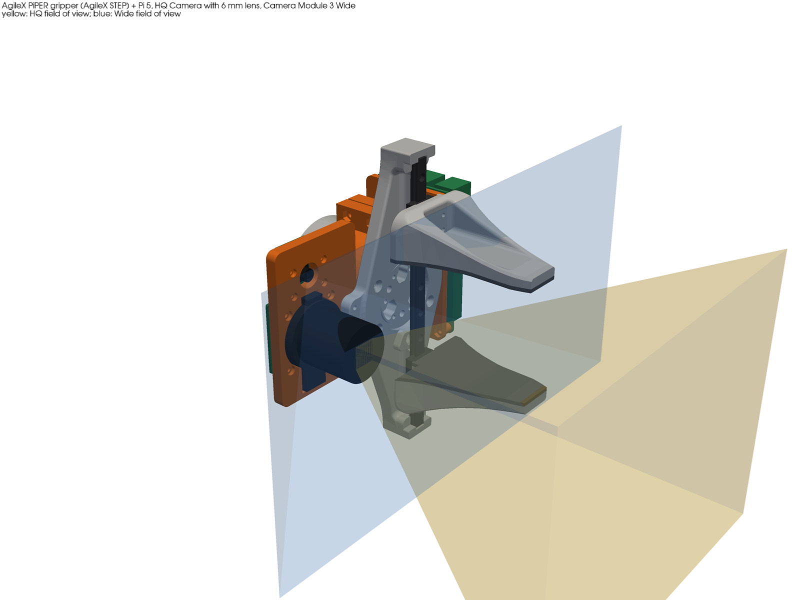
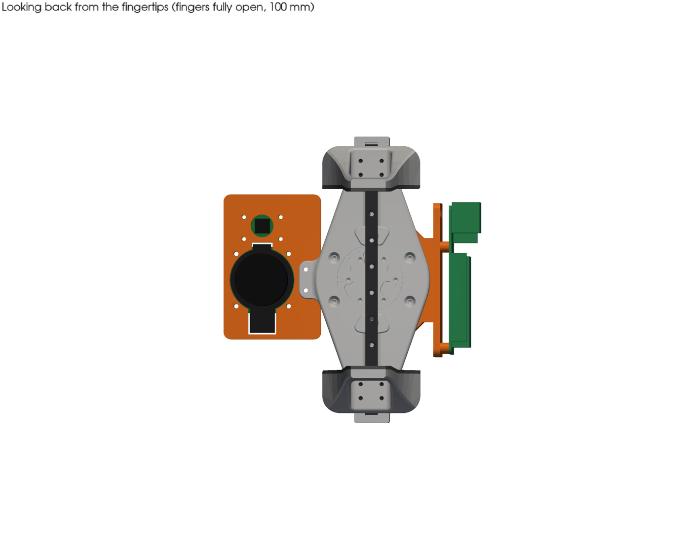
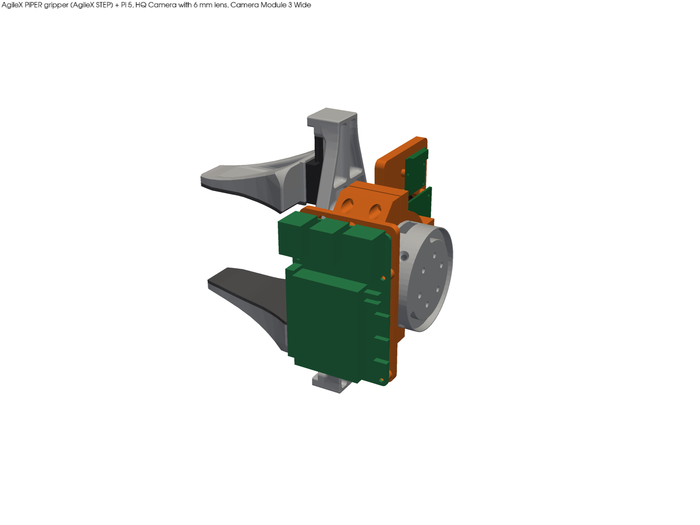
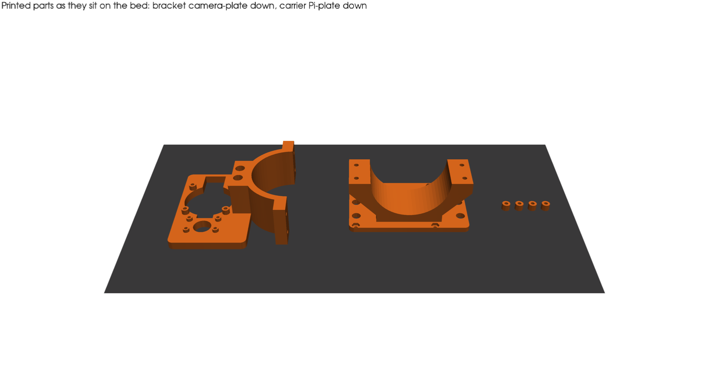
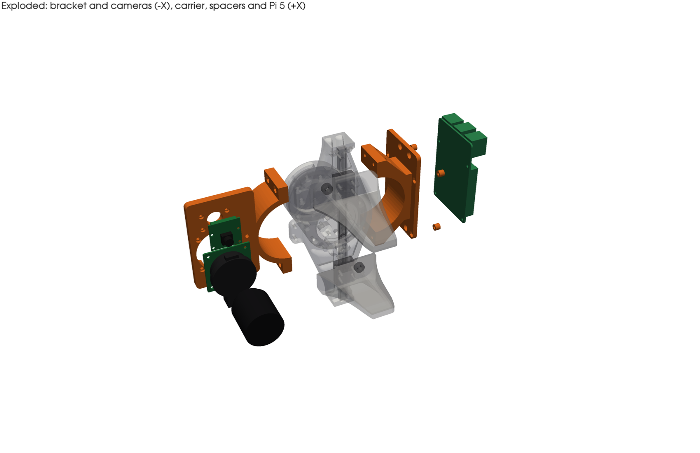
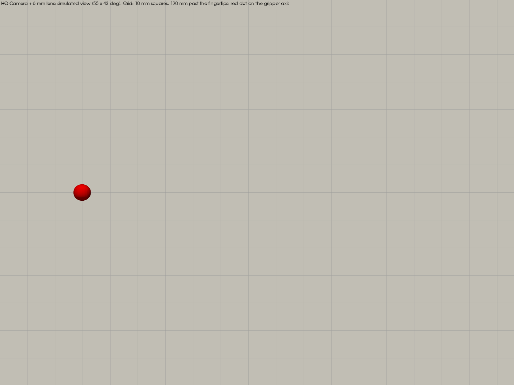
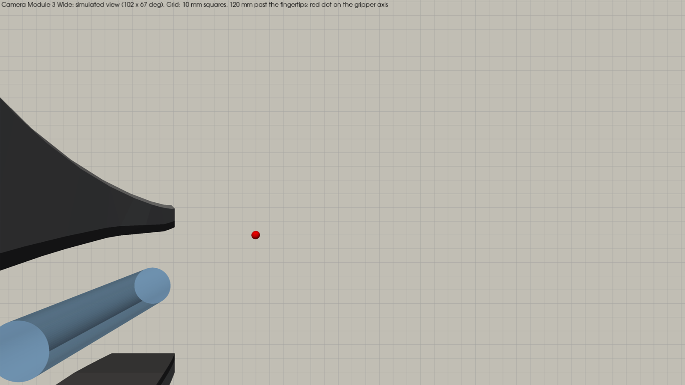

# AgileX PiPER wrist camera mount: Pi 5 + HQ Camera + Camera Module 3 Wide

Issue [#239](https://github.com/vertical-cloud-lab/byu-vcl/issues/239). A printed mount that puts a
**Raspberry Pi 5** and up to **two cameras** on the PiPER's two-finger gripper:

- a **Raspberry Pi HQ Camera** with the official 6 mm CS-mount lens, for repeatable positioning, and
- a **Camera Module 3 Wide** (optional) for streaming.

It follows the OT-2 lid mount in [#234](https://github.com/vertical-cloud-lab/byu-vcl/pull/234)
(`ot2-overhead-camera/lid-mount/`): a parametric CadQuery model built around the maker's own CAD,
with interference checks, exports and renders from one script. The design notes gathered in
[borysgroup/aurora-cloud-infra#5](https://github.com/borysgroup/aurora-cloud-infra/issues/5) are
the starting point for the PiPER side.



| Looking back from the fingertips | Pi 5 side |
|---|---|
|  |  |

## How it attaches

AgileX's gripper STEP (fetched at run time, see below) shows two features to hold on to:

1. **A side tab on the finger plate with two M3 tapped holes**, 12 mm apart and 6.5 mm deep, opening
   toward the arm (at x = -45.91, z = 7.92 and -4.08 in the STEP's frame). Two M3 x 12 screws
   through the bracket's camera plate go into these. They locate the mount and stop it turning,
   without touching the screws that hold the gripper to its flange.
2. **A plain O57 mm body** from the back of the finger plate to the J6 flange (motor housing, back
   cover and flange, y = 14.5 to 65). A two-piece collar clamps round the first 31 mm of it with
   four M3 screws across the split.

The cameras hang on the tab side (-X) and the Pi 5 on the other side (+X), so the load on J6 roughly
balances. The collar joins the two halves, and the tab screws lock the whole ring against rotation.

**Nothing goes behind the J6 flange face.** The rearmost point is 64.5 mm (the Pi 5's USB-C socket)
against a flange face at 64.98. So the mount can't reach the J6 housing or link 5 at any J5 or J6
angle. From AgileX's full-arm STEP, everything behind the flange stays within about 33 mm of the J6
axis for the next 125 mm. The mount's own sweep as J6 turns (98 mm radius at the camera plate's
outer corner) is about the same as the gripper's (82 mm at the ends of the finger plate).

## The parts

| Part | What it is | Print |
|---|---|---|
| `bracket` | Camera plate (also the pad on the tab), half the collar, and the web between them. HQ Camera on four M2.5 bosses; Camera Module 3 Wide on four M2 bosses | Camera-plate face down; the collar stands up, so nothing overhangs |
| `carrier` | The other half of the collar and a 4 mm plate for the Pi 5, with M2.5 nut traps | Pi plate face down; 45 degree gussets under the clamp ears |
| `spacers` | 4 x Pi 5 standoffs, 5 mm | Flat |



Both cameras sit **behind** the plate, and their lens mounts poke through it:

- **HQ Camera:** the board is 4 mm behind the plate and the CS mount passes through a O37 mm hole,
  with notches for the tripod foot and the back-focus lock. The 6 mm lens front ends up 57.6 mm
  behind the fingertips.
  - It hangs connector-down, so rotate its image 180 degrees in software, e.g.
    `Picamera2().configure(... transform=Transform(hflip=1, vflip=1))`.
  - The tripod foot can stay on.
- **Camera Module 3 Wide:** 2.5 mm behind the plate, with the lens module through a O13 mm hole.
  Its connector faces up.



## What the cameras see

| HQ Camera + 6 mm lens (55 x 43 degrees) | Camera Module 3 Wide (102 x 67 degrees) |
|---|---|
|  |  |

Both views are simulated in pyvista from the modelled camera positions. The target is a 10 mm grid
120 mm past the fingertips, and the red dot marks the gripper axis. A 12 mm vial is held in the
fingers, which are 40 mm apart.

- **HQ Camera:** the fingers never enter its view, at any opening (0 mm³ of overlap between its
  view frustum and the fingers, from closed to fully open).
  - Its axis is 63 mm to the side of the gripper's, and parallel to it.
  - A point on the gripper axis comes into view 63 mm past the fingertips and moves toward the
    centre from there. So put the fiducials the positioning routine needs to one side of the
    target, or add toe-in (below).
- **Camera Module 3 Wide:** it sees the fingertips, the vial and the scene around them, which is
  what a stream needs.

**Toe-in isn't usable yet.** `toe_deg` (`python piper_mount.py --toe 12`) turns both camera stations
toward the gripper axis about Z. At 12 degrees, the gripper axis comes into the HQ view 6.5 mm past the
fingertips instead of 63 mm. But the plate's clearance cuts don't follow the tilted cameras yet, so the
check fails with 350 mm³ of plate inside the HQ mount. Only 0 degrees, the default, passes, and the
exports and renders here are all at 0 degrees.

## Hardware

| Qty | Part | Where |
|---|---|---|
| 2 | M3 x 12 socket head (ISO 4762) | Camera plate into the tab. Drive them through the O7 channels in the web with a 2.5 mm hex key |
| 4 | M3 x 16 socket head + 4 M3 nuts | Collar clamp. Heads on the carrier side, nuts in the bracket's ears |
| 4 | M2.5 x 12 + 4 M2.5 nuts | HQ Camera: heads in counterbores on the plate front, nuts on the camera's back |
| 4 | M2 x 10 + 4 M2 nuts | Camera Module 3 Wide, the same way |
| 4 | M2.5 x 12 | Pi 5, through the spacers into the nut traps in the carrier |
| 2 | Raspberry Pi Standard-Mini camera cable, 300 mm | The HQ cable goes under the collar and the Wide cable over it. Each path is about 200 mm, so the 200 mm cable is too short |
| 1 | Pi 5 Active Cooler | Faces outward (+X) |
| 1 | USB-C 5 V / 5 A supply on a long lead | Run it along the arm. The PiPER's XT30 at J6 gives 24 V / 2 A that the gripper shares, and [ac-dev-lab#328](https://github.com/AccelerationConsortium/ac-dev-lab/issues/328) came to the same conclusion for the UR3e: power the Pi separately |

**Assembly order:**
1. Screw the bracket to the tab.
2. Close the collar with the carrier.
3. Mount the Pi 5 last. The clamp screws are reached through holes in the carrier plate that the
   Pi covers.

**Payload:** printed parts about 85 g in PLA, the Pi 5 with cooler about 66 g, the HQ Camera and
6 mm lens 83 g, the Wide 4 g, and screws and cables about 25 g. That's roughly **0.26 kg**. The PiPER
carries 1.5 kg and the gripper takes 0.5 kg of that, which leaves about 0.7 kg for what it picks up.

## Checks (`exports/checks.json`)

`piper_mount.py` builds everything, runs the checks and exits non-zero if anything interferes. All
pass:

- **Overlap:** 0 mm³ for all 38 pairs. Each part is checked against the gripper body, and against
  the fingers both closed (0 mm) and fully open (100 mm), as well as against each other.
- **Clearance to the fingers:** the nearest part stays 15.6 mm away when the fingers are closed and
  17.8 mm away when they're fully open.
- **Split:** the collar halves meet with 1.0 mm to spare, so tightening the clamp squeezes the body.
  The bore is 0.15 mm over the body per side.
- **Rear limit:** the rearmost point is 64.5 mm, against the flange face at 64.98.

**AgileX's flange solid is a special case.** OCC treats it as touching everything: the distance to
the Pi 5, 15 mm away, comes out as 0. So the checks stand a plain O57 x 10.5 mm cylinder in its place
(`reference.flange_proxy`). The cylinder is solid where the flange is hollow, which only makes the
checks stricter.

## Running it

```bash
pip install -r cad/requirements.txt
cd cad
python piper_mount.py                                              # checks + exports/*.step, *.stl
xvfb-run -a -s "-screen 0 1920x1080x24" python render.py          # renders/*.png
```

- **AgileX's STEP isn't committed.** AgileX publishes it with no licence, so
  [`cad/reference.py`](cad/reference.py) downloads it from AgileX's CDN into `cad/.cache/` (about
  2.9 MB), the same way the lid mount handles Opentrons' OT-2 STEP. It also records the SHA-256 it was
  checked against.
- **The exports contain only our parts** (and simple envelopes of the Pi and cameras), not AgileX's
  geometry.

## Assumptions and what to check first

- **The tab's M3 threads** come from the CAD: O2.5 holes, 6.5 mm deep. Check a real gripper before
  printing, and check that nothing else uses the tab, such as a cable clamp or AgileX's own camera
  bracket.
- **The PiPER's STEP** has no cable or connector for the gripper's power and CAN lead, so check
  where it runs on the real arm. The collar keeps to y ≤ 46, clear of the notch in the gripper's
  back cover at y ≈ 48 to 54, which is probably where that lead goes in.
- **Estimated dimensions:**
  - The 6 mm lens's O30 x 34 mm and 53 g are the maker's figures; its thread length (4 mm) is an
    estimate.
  - The Pi 5's connector positions are read off Raspberry Pi's drawing, and its outline is a
    simplified envelope, as in #234.
  - The 16 mm C-mount telephoto (O39 x 50 mm, with a 5 mm C-CS adapter) should also fit, with 1.6 mm
    to spare next to the tab. It isn't modelled.
- **Nothing has been printed yet.**
  - The clearances reuse the numbers from #234's A1 mini fit study (M3 nut slot 5.8 mm across
    flats, 0.15 mm per side on the body).
  - The collar's grip depends on the 1 mm split closing up. If it slips, a strip of 0.5 mm rubber
    inside it will help.
  - PETG is worth considering over PLA for the collar, because it creeps less under clamp load. The
    xArm mount in [ac-dev-lab#527](https://github.com/AccelerationConsortium/ac-dev-lab/issues/527)
    was PETG.
- **Relation to #238** (Pi 5 dual-camera mount): that design wasn't ready when this was made.
  - The camera stations here use the same hole patterns: HQ M2.5 on a 30 mm square, Camera Module 3
    M2 on 21 x 12.5 mm.
  - If #238 settles on a camera module, the camera plate can be swapped for it without touching the
    collar or the tab interface.
- **HQ Camera alone:** it can stream as well as take snapshots, using the picamera2 main + lores +
  `CircularOutput` approach tested in
  [borysgroup/streamingLambda#10](https://github.com/borysgroup/streamingLambda/pull/10). In that
  case, leave the Wide off; its station is just four holes.
- **Side mounting:** the mount doesn't care which way up the arm is. If the arm is side-mounted as
  discussed in [#229](https://github.com/vertical-cloud-lab/byu-vcl/issues/229#issuecomment-5826036827),
  include the mount's ~0.26 kg in `set_payload()`.
