# AgileX PiPER wrist camera mount: Pi 5 + HQ Camera + Camera Module 3 Wide

Issue [#239](https://github.com/vertical-cloud-lab/byu-vcl/issues/239). A printed mount that puts a
**Raspberry Pi 5** and up to **two cameras** on the PiPER's two-finger gripper:

- a **Raspberry Pi HQ Camera** with the official 6 mm CS-mount lens, for repeatable positioning, and
- a **Camera Module 3 Wide** (optional) for streaming.

It follows the OT-2 lid mount in [#234](https://github.com/vertical-cloud-lab/byu-vcl/pull/234)
(`ot2-overhead-camera/lid-mount/`): a parametric CadQuery model built around the maker's own CAD,
with interference checks, exports and renders from one script. The design notes gathered in
[borysgroup/aurora-cloud-infra#5](https://github.com/borysgroup/aurora-cloud-infra/issues/5) are
the starting point for the PiPER side. **Nothing has been printed yet.**

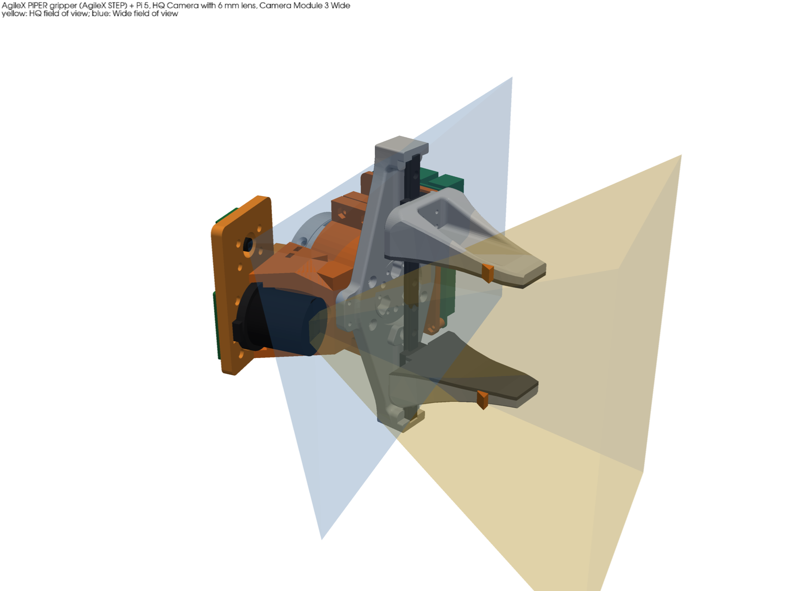

| Looking back from the fingertips (fully open) | Pi 5 side |
|---|---|
| 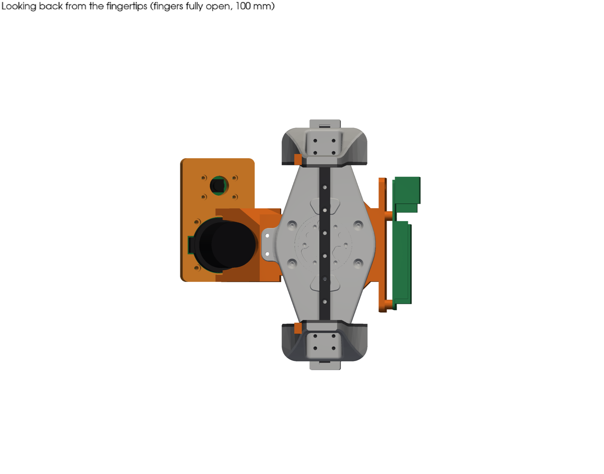 | 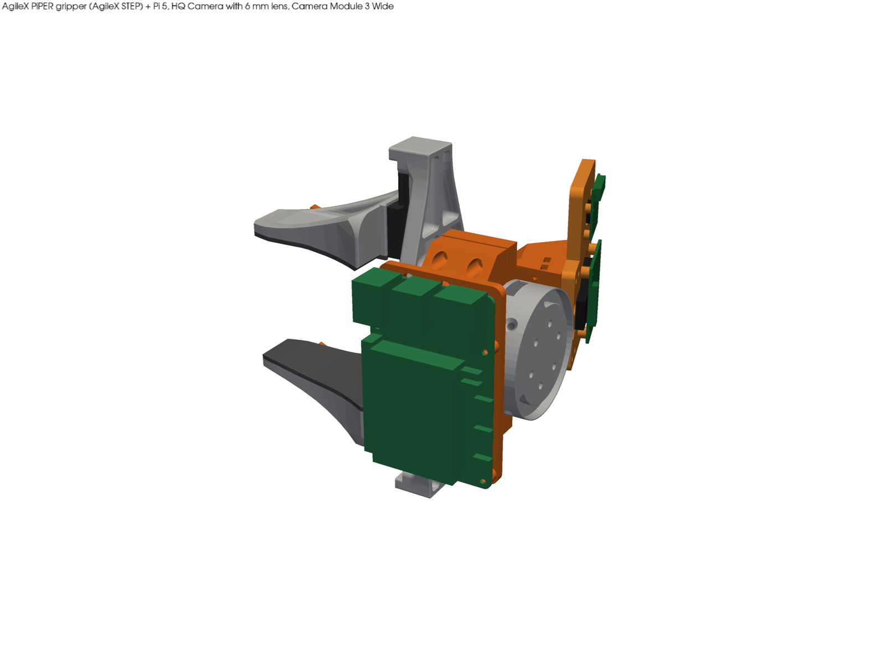 |

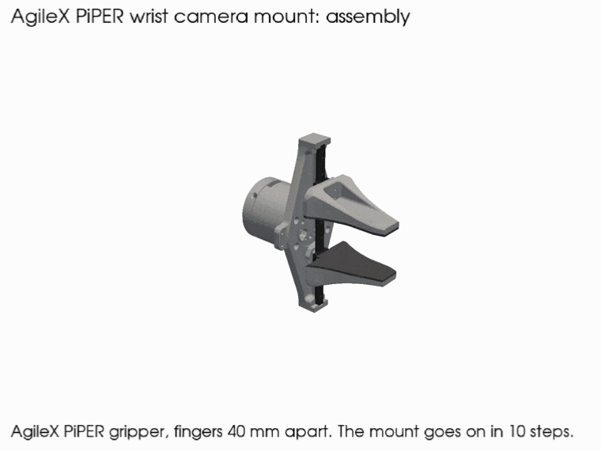

## How it attaches

AgileX's gripper STEP (fetched at run time, see below) and AgileX's own manuals and setup videos
show two features to hold on to:

1. **The finger plate's side tab**, which AgileX calls the *reserved camera mounting platform*. It
   has **two M3 brass inserts**, 12 mm apart and 6.5 mm deep, opening toward the arm (at x = -45.91,
   z = 7.92 and -4.08 in the STEP's frame, 38 mm off the axis). AgileX's own D435 wrist bracket
   bolts to it, and the gold inserts show in AgileX's 1080p setup video. Two M3 x 12 screws through
   the bracket's pad go into them. They locate the mount and stop it turning, without touching the
   screws that hold the gripper to its flange.
2. **A plain O57 mm body** from the back of the finger plate to the J6 flange (motor housing, back
   cover and flange, y = 14.5 to 65). A two-piece collar clamps round the first 31 mm of it with
   four M3 screws across the split.

The cameras hang on the tab side (-X) and the Pi 5 on the other side (+X), so the load on J6 roughly
balances. The collar joins the two halves, and the tab screws lock the whole ring against rotation.

**Nothing goes behind the J6 flange face.** The rearmost point is 64.5 mm (the Pi 5's USB-C socket)
against a flange face at 64.98. So the mount can't reach the J6 housing or link 5 at any J5 or J6
angle. From AgileX's full-arm STEP, everything behind the flange stays within about 33 mm of the J6
axis for the next 125 mm.

## The parts

| Part | What it is | Print |
|---|---|---|
| `bracket` | The pad on the tab, half the collar, and the **pod seat** (below) | Pad face down; the seat's outer face is at 45 degrees, the collar stands up |
| `pod` | The camera plate, turned 17 degrees toward the gripper axis: HQ Camera on four M2.5 bosses, Camera Module 3 Wide on four M2 bosses above it | Plate face down |
| `carrier` | The other half of the collar and a 4 mm plate for the Pi 5, with M2.5 nut traps | Pi plate face down; 45 degree gussets under the clamp ears |
| `spacers` | 4 x Pi 5 standoffs, 5 mm | Flat |
| `tag_wedge` | 2 x 35 degree wedges that turn a 5 mm AprilTag on each finger toward the HQ Camera | Base down |

None of them needs supports (see [Printing](#printing)).

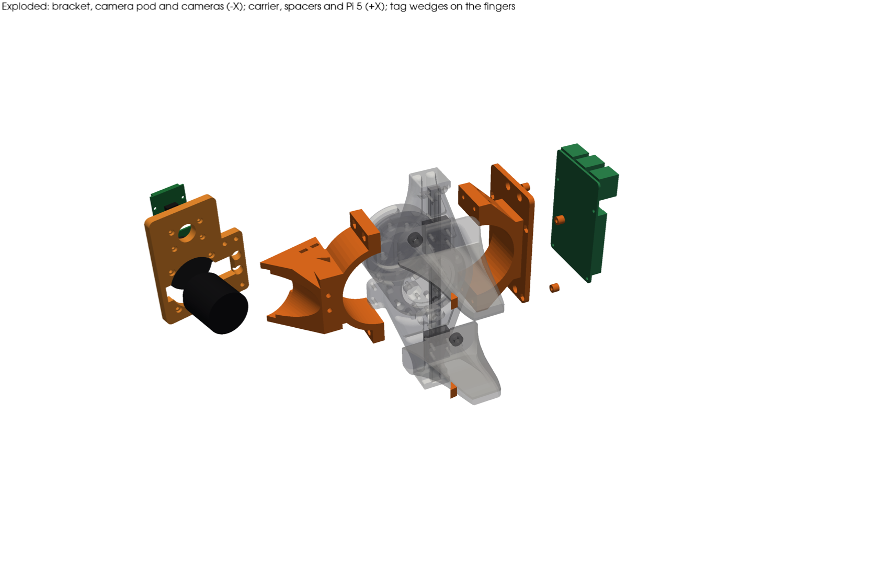

## The pod seat

The pod carries both cameras about 60 mm out from the gripper axis, so how it sits on the bracket
decides how still the cameras are. In the first version of the turned-in pod it touched the bracket
only on an 11 x 40 mm strip along its inner edge (**325 mm²**, 2 x M3), with the cameras
cantilevered about 50 mm beyond it.

Now the bracket widens outward at 45 degrees from its pad until it meets the pod's front face. The
pod sits on it from its inner edge out to the HQ lens axis, and along its top and bottom edges
either side of the lens:

- **987 mm² of contact** (3 times as much), measured by `piper_mount.py` (`pod_joint` in
  `checks.json`).
- **4 x M3 x 16**, 38 mm apart vertically and 9 mm across, into nuts dropped into slots in the
  seat's top and bottom faces. The heads are on the pod's back, clear of the HQ ribbon.
- The lens and its mount sit in a cradle cut through the seat with 1.5 mm to spare, so the pod goes
  on and off straight down its lens axis with the lens fitted.
- **Neither camera sees it.** The HQ sees no printed part at all. The seat's top corner is bevelled
  along the bottom of the Wide's view, so the Wide sees no more of the bracket than it did before
  (the collar's top ear and the old web's front edge, at the bottom-left of its picture).
- The seat adds 20.5 cm³ to the bracket (36.3 to 56.9 cm³ solid).

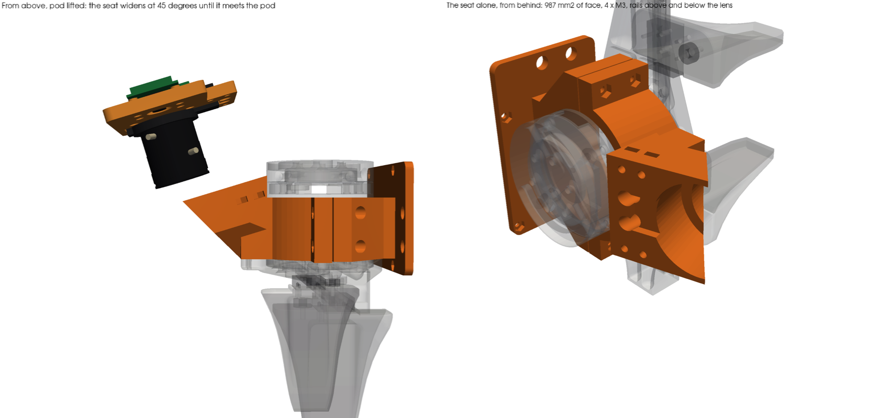

**How much stiffer, simulated.** [`sim/joint_fea.py`](sim/joint_fea.py) meshes bracket and pod
as one bonded body (quadratic tets, gmsh + scikit-fem), fixes the collar bore and the pad round the
tab screws, and loads the HQ bosses with the camera and lens (83 g) at 1 g, one direction at a time
([`sim/joint_fea.json`](sim/joint_fea.json)):

| 83 g at 1 g along | HQ moves, old → new (µm) | optical axis tilts, old → new (arcmin) | picture shifts, old → new (px) |
|---|---|---|---|
| Y (gripper pointing down) | 12.1 → 0.96 | 1.77 → 0.16 | 2.0 → 0.18 |
| Z (finger travel) | 4.2 → 0.97 | 0.16 → 0.010 | 0.18 → 0.011 |
| X | 0.64 → 0.48 | 0.018 → 0.029 | 0.02 → 0.03 |

- The worst case, along Y, is **about 11 times stiffer in tilt and 13 times in displacement**. The
  first natural frequency goes from about 110 Hz to 360 Hz (a Rayleigh-Ritz upper bound).
- **These flatter the old joint.** Bonding says the joint never slips or opens, and solid PLA at
  2.4 GPa is stiffer than a 25 % infill print. The old joint's real weakness was the strip itself: a
  pod pivoting on an edge 5 mm from its two screws, where any creep in the plastic lets it rock.
  Read the table as a comparison, not as the printed part's numbers.
- **Also left out:** the camera and lens's centre of mass sits about 2 cm in front of the bosses, and
  the load is applied at the bosses, so tilt under sideways loads is understated for both designs.

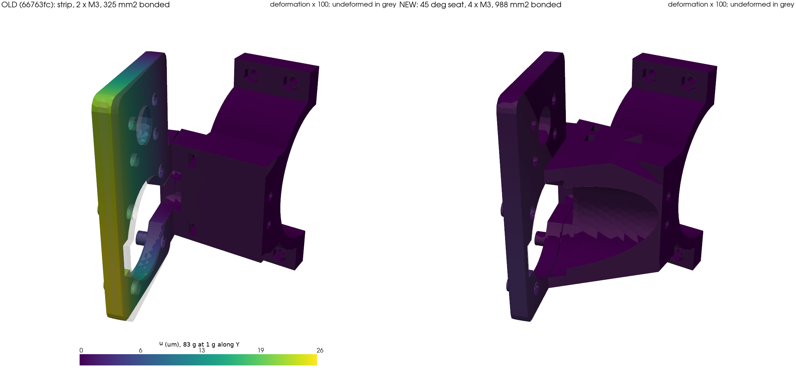

## What the cameras see

| HQ Camera + 6 mm lens (55 x 43 degrees), 20 mm target 60 mm past the tips | Camera Module 3 Wide (102 x 67 degrees) |
|---|---|
|  | 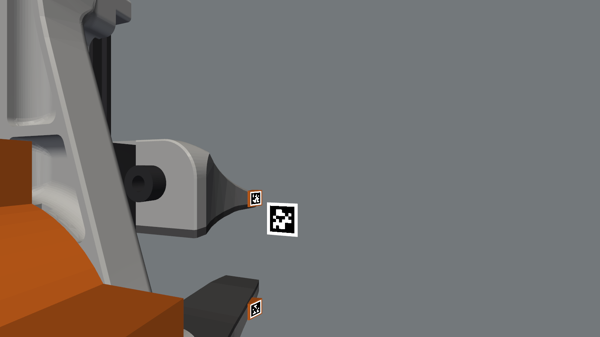 |

Both views are rendered in pyvista from the modelled camera positions (`fiducials.py`), with the
fingers 40 mm apart.

- **HQ Camera:** the lens front sits 89.5 mm behind the fingertips, 16.5 mm behind the finger
  plate's front face and 60 mm out from the gripper axis. Turned 17 degrees in, it has the gripper
  axis in view from the fingertips on, the fingertips at every opening up to 80 mm, and both finger
  tags from 0 to 60 mm. The fingers are at the bottom of the picture, and the finger travel runs
  along its long side.
- **Camera Module 3 Wide:** it sees the fingertips and the scene around them, which is what a
  stream needs.

**Is the 17 degree turn worth it?** For locating a fiducial on the gripper and one on the object in
the same picture, yes: it is what puts both in view. With the pod set back and not turned, the
gripper axis only comes into the HQ's view 64 mm past the fingertips, and neither the fingertips
nor the finger tags are in view at any opening. The
costs are the seat above (the pod needs real support), 10 mm more width on the camera side (below),
and a target straight ahead is seen 17 degrees off square, which the pose solve handles. A wider lens
at 0 degrees would also get the fingers in view, but with fewer pixels on the target and more
distortion.

### Fiducials

`fiducials.py` puts AprilTag 36h11 tags in the rendered HQ picture and runs OpenCV's detector and
`solvePnP` (IPPE_SQUARE) on it, from 0 to 100 mm of opening:

- **Finger tags** (#1 and #2, 5 mm) on the printed wedges, 17.5 mm behind each fingertip: detected
  from 0 to 60 mm of opening, seen 33 to 39 degrees off square (stuck flat on the finger it would be
  66 to 68), about 100 px across.
- **Target tag** (#10, 20 mm) 60 or 120 mm past the fingertips: detected at every opening. At
  30 mm past the tips, from 20 mm of opening up.
- Worst errors against the true poses: 0.76 mm and 0.98 degrees for any tag, and 1.04 mm for the
  target's position relative to a finger tag.

The pictures are ideal (no blur, noise or distortion), so these show geometry, not a real camera's
accuracy. [`exports/fiducials/tags.pdf`](exports/fiducials/tags.pdf) is the tags at exact size;
print it at 100 %.

### Tight spaces


From `envelope.py` (`exports/envelope.json`), fingers 40 mm apart:

- **The mount adds no width for the first 85.5 mm behind the fingertips** (58 mm in the first
  version, whose cameras sat on the tab). The finger tag wedges are the exception: 5.2 mm on the
  camera side from 14 mm behind the tips.
- **Behind that, the wrist is 157 mm across in X** (the bare gripper is 75 mm, the first version
  147 mm): 96 mm out on the camera side and 62 mm on the Pi side. Along the finger travel it is no
  bigger than the fingers themselves (82 mm).
- For working inside a rack or a narrow gap, go in with the camera side facing the open side.

## Hardware

| Qty | Part | Where |
|---|---|---|
| 2 | M3 x 12 socket head (ISO 4762) | Bracket pad into the tab's brass inserts, down the O7 channels with a 2.5 mm hex key. Snug only |
| 4 | M3 x 16 socket head + 4 M3 nuts | Collar clamp. Heads on the carrier side, nuts in the bracket's ears |
| 4 | M3 x 16 socket head + 4 M3 nuts | Pod onto the seat. Nuts dropped into the seat's top and bottom slots |
| 4 | M2.5 x 12 + 4 M2.5 nuts | HQ Camera: heads in counterbores on the pod's front, nuts on the camera's back |
| 4 | M2 x 10 + 4 M2 nuts | Camera Module 3 Wide, the same way |
| 4 | M2.5 x 12 | Pi 5, through the spacers into the nut traps in the carrier |
| 2 | Raspberry Pi Standard-Mini camera cable, 300 mm | Routes are about 206 mm (HQ) and 212 mm (Wide), so the 200 mm cable is too short |
| 1 | Pi 5 Active Cooler | Faces outward (+X) |
| 1 | 24 V supply at the base, a 24 V to 5 V / 5 A USB-C buck converter on the carrier, and a magnetic breakaway | Along the arm; see below and [`power/`](power/README.md) |

**Power** ([`power/README.md`](power/README.md) has the numbers and a shopping list). The Pi 5 gets
its own lead up the arm, with a service loop at each joint. It does not share the gripper's supply:

- **Don't run 5 V up the arm, and don't use a USB-C extension.** The Pi 5 flags under-voltage below
  4.63 V, and a USB-C cable may lawfully drop 0.75 V at its rated current. Over 3 m, even a 5 A
  cable ends up at about 4.55 V under load. With an extension it's 4.4 V or less.
- **Send 24 V (or 12 V) instead, and convert next to the Pi.** Use a small 24 V supply at the base,
  a two-core high-flex lead up the arm, and a 5 V / 5 A buck converter with a USB-C output on the
  carrier, plus a 10 to 15 cm lead to the Pi. The loss in the lead is under 1 %. Most of these
  converters don't speak USB-PD; set `PSU_MAX_CURRENT=5000` in the Pi's EEPROM to tell it the supply
  can do 5 A. Power over Ethernet is the alternative if the streams should be on a wire too.
- **The gripper's power/CAN lead is not for the Pi.** It is a short 4-wire jumper from a socket on
  J6 into a notch in the gripper's back cover, right at the flange ring (y ≈ 48 to 54). The mount
  only has to stay out of its way, and it does: the collar stops at y = 46.
- The PiPER's XT30 at J6 gives 24 V / 2 A that the gripper shares, and
  [ac-dev-lab#328](https://github.com/AccelerationConsortium/ac-dev-lab/issues/328) came to the same
  conclusion for the UR3e: power the Pi separately.
- **Make sure a yank can't reach the Pi's socket**, which is how a lab Pi 5 lost its USB-C port
  ([#234](https://github.com/vertical-cloud-lab/byu-vcl/pull/234#issuecomment-5841723129)). Clamp
  the lead to the carrier 20 to 30 mm from the plug, and put a magnetic breakaway on the arm's side
  of the clamp so a snag pulls it apart (the quick-disconnect idea from ac-dev-lab#328). On a USB-C
  lead, Adafruit's [Magnetic Right Angle USB Type C Adapter](https://www.adafruit.com/product/5521)
  (product 5521, 120 W) also turns the lead 90 degrees to run back along the arm. On the 24 V lead, a
  two-pin magnetic DC connector does the same job and only has to carry about 0.6 A.
- **Check that the Pi 5 sees a 5 A supply.** If the USB-PD offer doesn't get through, the Pi 5
  treats the supply as 3 A and limits its USB ports to 600 mA. That's fine for two CSI cameras,
  which don't use USB, but the Pi will warn about it at boot.

**Assembly order** (the GIF above):

1. Nuts into the bracket: four in the clamp ears and four in the pod seat's slots.
2. Bracket onto the gripper, pad against the tab; the two tab screws.
3. Pi nuts into the carrier, then close the collar with it: the four clamp screws, evenly, to snug
   (about 0.1 N m, or 200 N per screw). The split stays about 0.35 mm open. Don't try to close it:
   that takes about 0.5 N m, which is more than PLA ears take (see [Stress](#stress-calculix)). The
   GIF's caption still says to close it.
4. Cameras onto the pod, the lens into the CS mount, both ribbons plugged in.
5. Pod down its lens axis onto the seat; its four screws.
6. Pi 5 on its spacers, then the ribbons, then the tag wedges on the fingers.

The pod comes off without disturbing the collar or the tab screws. To take the gripper off its
flange, take the mount off first: it covers two of the four countersunk M3 screws in the flange
ring that hold the gripper on.

**Payload:** printed parts 87 g in PLA (Bambu's figure for the whole plate), the Pi 5 with cooler
about 66 g, the HQ Camera and 6 mm lens 83 g, the Wide 4 g, and screws and cables about 27 g. That's
roughly **0.27 kg**. The PiPER carries 1.5 kg and the gripper takes 0.5 kg of that, which leaves
about 0.7 kg for what it picks up.

## Printing

[`slice/`](slice/README.md) slices everything for a Bambu Lab A1 mini in PLA with the Bambu Studio
CLI, the same way as #234 and #238, and writes
[`slice/piper_camera_mount_A1mini_PLA.3mf`](slice/piper_camera_mount_A1mini_PLA.3mf) and
[`slice/report.json`](slice/report.json):

- **One plate:** all five part types, **2 h 49 min and 87.4 g** with 3 walls and 25 % infill on the
  Textured PEI plate.
- **No supports.** Supports are off, and Bambu's own support check flags none of the six objects.
  There are no slicer warnings and no toolpaths off the bed.
- **Overhangs** (`slice/overhangs.json`): the only faces steeper than 45 degrees are the roofs of
  nut slots and counterbores, which print as short bridges. The largest is 34.5 mm² on the bracket.
  The seat's outer face and the carrier's gussets are drawn at exactly 45 degrees.

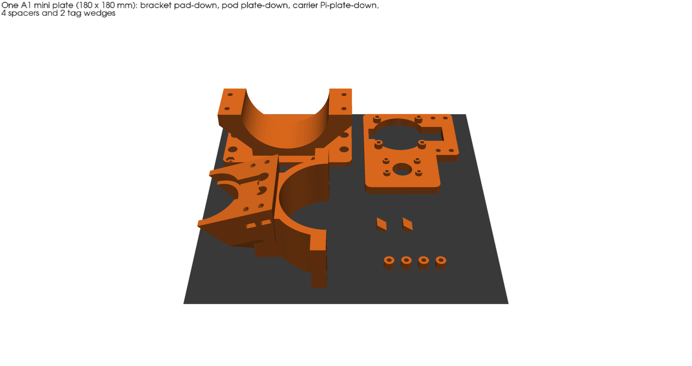

### Material: PAHT-CF on the H2D

PLA is fine for a first fit check. For the mount that stays on the arm, print the bracket and
carrier (and ideally the pod) in **Bambu PAHT-CF** on the H2D. The numbers are from Bambu's
datasheets, dry specimens. "Along" means along the layers, "across" means across them:

| | PLA Basic | PETG HF | PETG-CF | **PAHT-CF** | PET-CF | PPA-CF |
|---|---|---|---|---|---|---|
| Tensile strength along / across (MPa) | 35 / 31 | 34 / 23 | 35 / 29 | **88 / 64** | 74 / 35 | 168 / 57 |
| Tensile modulus along / across (MPa) | 2580 / 2060 | 1810 / 1540 | 2460 / 1340 | 3860 / 2180 | 4730 / 2160 | 11800 / 4300 |
| Heat deflection at 1.8 MPa (°C) | 54 | 62 | 68 | 170 | 182 (annealed) | 196 |
| Water taken up, saturated | 0.43 % | 0.40 % | 0.30 % | 0.88 % | 0.37 % | 1.30 % |
| US price per kg | $20 | n/a | $35 | $95 | $85 | $200 |

Why PAHT-CF:

- **It has the most strength across the layers**, 64 MPa, double PLA's. That's where the clamp loads
  the carrier (see [Stress](#stress-calculix)).
- **It holds screw preload.** It's a PA12-based nylon, and in
  [CNC Kitchen's week-long bolted test](https://www.cnckitchen.com/blog/carbon-fiber-nylon-in-3d-printing-pa6-vs-pa12-tested)
  a PA12-CF joint needed re-tightening once. A PA6-CF joint needed it almost daily.
  [Dimitrellou et al. 2024](https://doi.org/10.1007/s11665-024-09144-9) rank PAHT-CF above PC and
  PLA for creep.
- **It doesn't mind warmth.** It deflects at 170 °C against PLA's 54 °C. PLA sits a few centimetres
  from the Pi 5's heatsink here.
- **The H2D already has what it needs.** Its status report, read over LAN MQTT through the CubXL Pi
  on 2026-09-27, shows:
  - a 0.4 mm hardened-steel hotend on the left. The right is a 0.6 mm TPU High-Flow hotend, so keep
    carbon fibre off that one.
  - an AMS HT, which dries at up to 85 °C. PAHT-CF wants 80 °C for 8 to 12 h, and printing and
    storage below 20 % RH.
  - a heated chamber that reaches 65 °C. PAHT-CF wants 45 to 60 °C.
- **It costs about $7 for this mount.**

The other options:

- **PET-CF** is stiffer along the layers and takes up less water. But it's brittle across them:
  35 MPa, with 2.4 % elongation at break. The carrier's collar is loaded across its layers.
- **PPA-CF** is the stiffest by far. But it's brittle across the layers (0.9 % elongation) and wants
  drying at 100 to 140 °C, which is beyond the AMS HT. It also costs $200/kg.
- **PETG-CF isn't an upgrade.** It's no stiffer than PLA and deflects at 68 °C.
- **Avoid PA6-CF and PA6-GF** in an unconditioned lab. They take up 2.4 to 2.6 % water, and damp
  PA6 loses much of its stiffness.

Notes for printing it:

- **Check the fits first.** Print a coupon with the bore and an M3 nut slot, and measure it,
  because the shrinkage differs from PLA's.
- **Don't expect the split to close** (see [Stress](#stress-calculix)). Tighten the four clamp
  screws evenly to snug.
- **Carbon-fibre prints are static-dissipative, not conductive.** The one measured CF nylon was
  about 10⁹ Ω. The Pi sits on its standoffs, clear of the plate, anyway.

Source notes, with every value's datasheet link, are in
[`sim/materials_2026-09-27.md`](sim/materials_2026-09-27.md).

## Stress (CalculiX)

[`sim/ccx_stress.py`](sim/ccx_stress.py) solves the printed parts in [CalculiX](http://www.calculix.de/)
2.21 (`apt install calculix-ccx`). It uses `joint_fea.py`'s gmsh meshes, with a node added at each
edge midpoint, so the elements are CalculiX's C3D10 quadratic tets: 99,060 nodes for bracket + pod.
The results are in [`sim/ccx_stress.json`](sim/ccx_stress.json).

**CalculiX gives the same answer as scikit-fem.** Here are `joint_fea.py`'s three cases on the same
mesh (the same node and tet counts) with the same supports:

| 83 g at 1 g along | HQ moves (µm), ccx / scikit-fem | Optical axis tilts (arcmin), ccx / scikit-fem | Largest displacement (µm), ccx / scikit-fem |
|---|---|---|---|
| X | 0.4769 / 0.477 | 0.02944 / 0.0294 | 0.9320 / 0.932 |
| Y | 0.9640 / 0.964 | 0.16157 / 0.1616 | 2.7802 / 2.780 |
| Z | 0.9746 / 0.975 | 0.00958 / 0.0096 | 1.8602 / 1.860 |

They agree to every digit `joint_fea.json` keeps, so the stiffness numbers in
[The pod seat](#the-pod-seat) don't depend on the solver.

**The stress cases.** The model is solid, isotropic PLA, but for a given load the stress hardly
depends on the material. "Across layers" is the normal stress through the layers, using each
part's print orientation from the Printing table. Bump and yank peaks are taken at least 2 mm from
the supports, and clamp peaks at least 1.5 mm from the screw seats.

| Case | Load | Peak von Mises | Peak max principal | Peak tension across layers | Where |
|---|---|---|---|---|---|
| Camera inertia | 83 g at 1 g, each direction | 0.1 MPa | | | |
| Pod bumped | 10 N on the pod's outer edge, worst direction (+Y, toward the arm) | 3.0 MPa | 3.4 MPa | 1.5 MPa | Round the pod seat's top nut slot |
| Cable yank | 10 N at the USB-C plug, worst direction (+X, off the board) | 3.6 MPa | 4.4 MPa | 3.5 MPa | Where the Pi plate meets the collar, at its rear end |
| Clamp, snug | 200 N in each M3 | 13.8 MPa | 17.4 MPa | 6.9 MPa | The bracket's ear roots, on the collar's outer face |
| Clamp, about 0.3 N m | 500 N in each M3 | 33.5 MPa | 42.5 MPa | 16.8 MPa | Same place |

What it means, against Bambu's datasheet strengths (PLA Basic 35 MPa along the layers and 31 across;
PAHT-CF 88 and 64):

- **The camera's weight and ordinary bumps are no problem.** The pod takes about 100 N (10 kgf) on
  its outer edge before solid PLA reaches its strength, and less with 25 % infill. The seat's nut
  slots are where it would give first.
- **A cable yank is fine once the lead is clamped to the carrier.** Solid PLA takes about 80 N
  sideways before the plate-to-collar joint reaches its strength (about 180 N in PAHT-CF).
  - The Pi's socket gives up long before that. A straight pull unplugs a USB-C plug at 8 to 20 N (the
    USB-C spec's range), and a sideways pull levers on the socket instead.
  - So the clamp should carry the pull, and the breakaway should let go below what the socket takes.
    See [`power/`](power/README.md).
- **The clamp screws are the real load.** 500 N per screw is only about 0.3 N m on a dry M3, easy
  to reach with a hex key.
  - At 500 N the bracket's ear roots reach 42.5 MPa, above PLA's 35 MPa.
  - In PLA, stop at snug (200 N, about 0.1 N m), where the peak is 17 MPa, and expect PLA to relax
    at that stress over weeks.
  - PAHT-CF holds 500 N with a margin of about 2 along the layers and 4 across.
- **The split never closes.** The 1 mm split closes by 0.64 mm at 200 N per screw and by 0.82 mm at
  500 N. Closing it fully would take roughly 800 N per screw (about 0.5 N m), more than PLA ears
  take. The assembly step above now says so.
- **A possible design change, not made here:** shrink `split_gap` from 1.0 to about 0.6 mm. The
  halves would then meet at roughly 200 N per screw, the split would act as a stop, and more torque
  would go into the split faces instead of bending the ears.

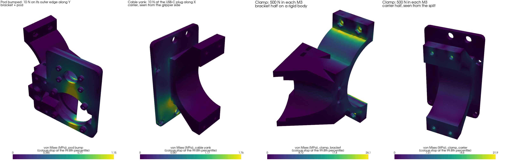

How each case is set up:

- **Pod bump:** bracket + pod bonded, collar bore and tab pad fixed, as in `joint_fea.py`.
- **Cable yank:** the carrier alone with its bore fixed. The plug force is carried to the four
  standoff seats as if through a rigid board.
- **Clamp:** each half on its own, round a rigid, frictionless O57 body, 0.15 mm clear all round.
  Contact is an active set of radial constraints on the bore nodes, iterated until it settles
  (6 to 15 solves). Each screw's force goes onto its nut-pocket floor or head seat. The screws
  themselves and the tab screws are not modelled.

Limits of the model:

- **The model is solid and isotropic.** A print with 3 walls and 25 % infill is weaker.
- **The peaks sit at sharp inside corners** (the ear roots and nut slots), where the value depends
  on the mesh. A fillet at the ear roots would lower them.

## Checks (`exports/checks.json`)

`piper_mount.py` builds everything, runs the checks and exits non-zero if anything interferes. All
pass:

- **Overlap:** 0 mm³ for all 49 pairs. Each part is checked against the gripper body, against the
  fingers both closed (0 mm) and fully open (100 mm), and against each other.
- **Clearance to the fingers:** the nearest part stays 15.6 mm away with the fingers closed and
  17.8 mm away fully open. The finger tag wedges stay 72 mm from the mount.
- **Views:** no printed part is inside the HQ's view. The Wide's view takes in 2,879 mm³ of the
  bracket, exactly as before the seat was added, and 126 mm³ of the carrier's edge.
- **Split:** the collar halves meet with 1.0 mm to spare, so tightening the clamp squeezes the body.
  The bore is 0.15 mm over the body per side.
- **Rear limit:** the rearmost point is 64.5 mm, against the flange face at 64.98.

**AgileX's flange solid is a special case.** OCC treats it as touching everything: the distance to
the Pi 5, 15 mm away, comes out as 0. So the checks stand a plain O57 x 10.5 mm cylinder in its place
(`reference.flange_proxy`). The cylinder is solid where the flange is hollow, which only makes the
checks stricter.

## Onshape

The final design is in Onshape in the lab's **vcl-shared › 6DOF Robot Arm** folder:
[PiPER wrist camera mount (4be6e17)](https://cad.onshape.com/documents/93ef145982c24192bfd160be/w/e3d08fcb2dcad7c92e183721).
It's owned by Vertical Cloud Lab and it's private. Open the **Mount on gripper** tab:

| Tab | What's in it |
|---|---|
| Mount on gripper | The assembly. Both Part Studios below are inserted whole, at the origin, so the mount sits on the gripper exactly as in the renders |
| Mount parts (exports/assembly.step) | Our parts, plus envelopes of the Pi 5 and the cameras |
| AgileX gripper (reference, do not share) | AgileX's gripper STEP, 13 parts. Onshape shows AgileX's Chinese part names garbled; they read 电机加底座 (motor and base), 法兰 (flange), 夹爪 (jaw) and 推力轴承 (thrust bearing), and MGN7 is the linear rail and its carriages |
| Part Studio 1 | Empty. Onshape's default tab, which the API key can't delete (HTTP 403), so delete it in the web app |

AgileX's gripper went in on 2026-09-27 with
[`onshape/add_gripper.py`](onshape/add_gripper.py) (about 15 API calls,
[record](onshape/run_2026-09-27_gripper.json)). The mount was built in the frame of that STEP, so
the two line up with no mates. AgileX publishes the STEP without a licence, so the repo downloads it
at run time instead of committing it. For the same reason, **keep this document private** (the script
refuses to import into a public one).


[`onshape/onshape_import.py`](onshape/onshape_import.py) made the document over the REST API in
**7 calls**, plus 3 to check the copy and fetch the shaded view below (the plan allows 2,500 a
year):

1. Create a document.
2. Import `exports/assembly.step`.
3. Copy the workspace into the folder with the documented `copyWorkspace` call.

API keys can't move a document between folders; the web app's endpoint for that returns 403, as
found in #234. So the uncopied original is also left in the API key owner's account, and can be
deleted from there. The run record is in
[`onshape/run_2026-09-27.json`](onshape/run_2026-09-27.json). The earlier import of the first
version, [PiPER wrist camera mount (9f691e6)](https://cad.onshape.com/documents/e22711217c260359b417d4ab/w/a89539f5f5ee3273f944af9c)
([record](onshape/run_2026-09-26.json)), is in the same folder and can be deleted.

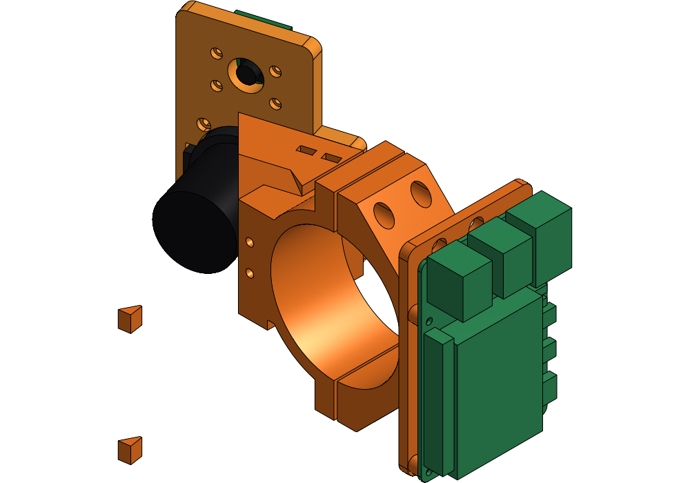

The parts are imported solids, not native sketch-and-extrude features. For editable geometry,
rebuild from `Params`, the way #234's `onshape_api.py` does for the lid mount's base.

## Running it

```bash
pip install -r cad/requirements.txt       # plus opencv-contrib-python, shapely, matplotlib, pillow for the extras
cd cad
python piper_mount.py                                                # checks + exports/*.step, *.stl
xvfb-run -a -s "-screen 0 1920x1080x24" python render.py            # renders/*.png
xvfb-run -a -s "-screen 0 1920x1080x24" python fiducials.py         # renders/view_*.png, exports/fiducials/
python envelope.py                                                   # renders/tight_spaces.png
xvfb-run -a -s "-screen 0 1920x1080x24" python animate.py           # renders/assembly_steps.gif (gifsicle shrinks it)
python ../slice/slice_a1mini.py --bambu ~/bambu/squashfs-root       # see slice/README.md
python ../sim/joint_fea.py                                           # pod joint stiffness, scikit-fem
xvfb-run -a -s "-screen 0 1920x1080x24" python ../sim/ccx_stress.py  # stresses in CalculiX (apt install calculix-ccx)
python ../power/voltage_drop.py                                      # power/README.md's table
python ../onshape/add_gripper.py --doc 93ef145982c24192bfd160be --ws e3d08fcb2dcad7c92e183721   # done once
```

- **AgileX's STEP isn't committed.** AgileX publishes it with no licence, so
  [`cad/reference.py`](cad/reference.py) downloads it from AgileX's CDN into `cad/.cache/` (about
  2.9 MB), the same way the lid mount handles Opentrons' OT-2 STEP. It also records the SHA-256 it was
  checked against.
- **The exports contain only our parts** (and simple envelopes of the Pi and cameras), not AgileX's
  geometry.

## Assumptions and what to check first

- **Which gripper the lab has.** AgileX has made two. On the 0 to 100 mm gripper the tab's inserts
  sit 38 mm off the axis, as in the STEP used here. On the older 0 to 70 mm gripper they sit at
  36 mm, and the pad would need moving 2 mm. Tell them apart by the maximum opening, or by the
  finger plate's width: about 164 mm against 145 mm.
- **The tab screws go into brass inserts in the gripper's plastic.** Snug them; don't torque them.
- **Estimated dimensions:**
  - The 6 mm lens's O30 x 34 mm and 53 g are the maker's figures; its thread length (4 mm) is an
    estimate.
  - The Pi 5's connector positions are read off Raspberry Pi's drawing, and its outline is a
    simplified envelope, as in #234.
- **Nothing has been printed yet.**
  - The clearances reuse the numbers from #234's A1 mini fit study (M3 nut slot 5.8 mm across
    flats, 0.15 mm per side on the body).
  - The collar grips by squeezing the body, not by closing the split. At a snug 200 N per screw,
    each half presses on the body with 800 N and the split stays about 0.35 mm open. If it slips, a
    strip of 0.5 mm rubber inside it will help.
  - For the parts that stay on the arm, print in PAHT-CF rather than PLA (see
    [Material](#material-paht-cf-on-the-h2d)), because PLA creeps under clamp load. The xArm mount
    in [ac-dev-lab#527](https://github.com/AccelerationConsortium/ac-dev-lab/issues/527) was PETG.
- **Relation to #238** (Pi 5 dual-camera mount): that design wasn't ready when this was made.
  - The pod uses the same hole patterns: HQ M2.5 on a 30 mm square, Camera Module 3 M2 on
    21 x 12.5 mm.
  - If #238 settles on a camera module, a new pod can take its place on the same seat and four
    screws, without touching the collar or the tab interface.
- **HQ Camera alone:** it can stream as well as take snapshots, using the picamera2 main + lores +
  `CircularOutput` approach tested in
  [borysgroup/streamingLambda#10](https://github.com/borysgroup/streamingLambda/pull/10). In that
  case, leave the Wide off; its station is just four holes.
- **Side mounting:** the mount doesn't care which way up the arm is. If the arm is side-mounted as
  discussed in [#229](https://github.com/vertical-cloud-lab/byu-vcl/issues/229#issuecomment-5826036827),
  include the mount's ~0.27 kg in `set_payload()`.
