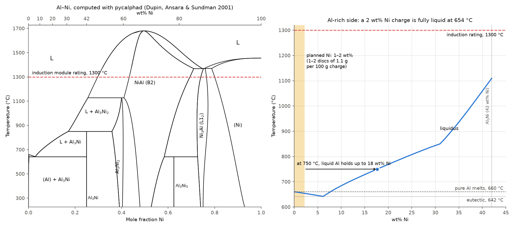

# Ni in the Al cup, solute purity with a 4N/5N base, and the industrial feedstock recipe (2026-10-07)

Issue #161, answering three questions from 2026-10-07:

1. Get the Al–Ni phase diagram. Would a small Ni puck (1 mm slices of the Ø1/2" Nickel 200
   rod, [9136K23](https://www.mcmaster.com/9136K23/)) dissolve in an Al cup?
2. The 2026-10-06 note waved off solute purity against the 99.7% Al base. We expect to move
   to higher-purity Al rods, so does that still hold?
3. What feedstock (form, purity, supplier) do industrial gas atomizers melt to make
   commercial AlSi10Mg and Scalmalloy powder? Could we buy from the same suppliers?

Scripts: [`al_ni_phase_diagram.py`](al_ni_phase_diagram.py) (pycalphad; cached results in
[`al-ni-phase-diagram-data.json`](al-ni-phase-diagram-data.json)) and
[`impurity_budget_vs_al_base.py`](impurity_budget_vs_al_base.py).

## Short answers

- **Ni disc in the Al cup: yes.** On the Al side Al–Ni is a *eutectic* system: a 2 wt% Ni charge
  is fully liquid at 654 °C, below pure Al's melting point, and at 750 °C liquid Al can hold
  17.7 wt% Ni. Ni dissolves faster than any of our other high-melting solutes (~4× Fe, ~50×
  Ti/Zr at equal stirring). Estimate for a 1 mm disc: 5–20 min with induction stirring, hours
  without. Hold 20–30 min at 780–800 °C on the first run and check the button.
- **Purity: you're right, it can't be dismissed.** With a 4N rod the solutes carry 33–76% of
  the metallic impurity budget, and a Nickel 200 rod at its 99.0% floor brings 2.4× what the
  base does. Commercial master alloys cast on 99.7% Al would quietly undo most of a 4N upgrade
  for the Sc/Zr/Er family.
- **Industry recipe: commercial AlSi10Mg and Scalmalloy are made from primary 99.7% (P1020)
  grade metal, not 4N.** No atomizer names its suppliers. Their powder's Fe (0.12–0.29 wt%)
  and the standard grades point to P1020A Al, metallurgical Si, 9980A Mg, and Al-2Sc /
  AlZr10 / Al-Mn masters (or 75–85% tablets), inert-gas atomized. The closest "same supplier"
  routes are **Valimet** (already quoting us, and signed with APWORKS for Scalmalloy),
  **Belmont Metals** (sells AM feedstock to powder makers) and **BAM-M319** certified
  Scalmalloy powder (100 g, €267) as a benchmark.

## 1. The Al–Ni phase diagram

Computed with pycalphad 0.11 and the Dupin, Ansara & Sundman assessment of Al–Ni
(*Calphad* 25 (2001) 279–298, the TDB that ships with pycalphad's test databases). The
COST507 database used for Al–Ti has the Ni element but none of the Al–Ni intermetallics, so
it cannot be used here.

| Feature | Computed | Reported |
| --- | ---: | ---: |
| Al + Al₃Ni eutectic | 642 °C at ~6.0 wt% Ni | 639.9 °C at ~5.7 wt% (2.7 at%) Ni |
| Al₃Ni forms peritectically (L + Al₃Ni₂ → Al₃Ni) | 850 °C | 854 °C |
| Al₃Ni₂ forms peritectically (L + NiAl → Al₃Ni₂) | 1128 °C | 1133 °C |
| NiAl (B2) melts congruently | ~1680 °C | 1638 °C classically; later measurements ~40 °C higher |
| Pure Ni melts | 1455 °C | 1455 °C |

**Al–Ni is a eutectic system on the Al side, unlike Al–Ti.** Adding Ni *lowers* the
liquidus until ~6 wt% Ni:

| wt% Ni | Liquidus (°C) |
| ---: | ---: |
| 0.5 | 658.9 |
| 1.0 | 657.5 |
| 2.0 | 654.5 |
| 4.0 | 648.6 |
| 6.0 | 642.1 (eutectic) |
| 10 | 684 |
| 20 | 769 |
| 30 | 843 |
| 42 (Al₃Ni) | 1110 |

So the 1300 °C induction rating is irrelevant for Ni additions. A 1–2 wt% Ni charge is fully
liquid a few degrees below pure aluminium's own melting point. The limit on dissolving a Ni
disc is how fast it dissolves, not what temperature the melt can reach. Even pure Ni
(1455 °C) never has to melt.

## 2. Would a Ni disc dissolve in the Al cup?

**Thermodynamically, yes, easily.** Liquid Al can hold far more Ni than we need before an
aluminide has to form (the hypereutectic liquidus read sideways, from the same calculation):

| Melt temperature | Ni the liquid can hold | vs a 2 wt% charge |
| ---: | ---: | ---: |
| 700 °C | 11.7 wt% | 5.8× |
| 750 °C | 17.7 wt% | 8.8× |
| 800 °C | 24.0 wt% | 12× |
| 850 °C | 31.0 wt% | 15× |

So the melt keeps pulling Ni off the disc at nearly full driving force until the disc is gone.
The reaction also runs downhill in heat. Dissolving solid Ni into liquid Al releases
**137 kJ per mol Ni** (computed, same database): 4.7 kJ for 2 g of Ni in a 100 g charge,
released over minutes and mostly at the disc face, where it helps a little.

**Kinetically: minutes with stirring, hours without.**

Ni dissolves through two thin interface layers, Al₃Ni₂ against the Ni and Al₃Ni against the
melt ([Bouché, Barbier & Coulet 1997](https://www.osti.gov/etdeweb/biblio/520244), 695–800 °C).
The rate is set by diffusion through the liquid boundary layer, so it follows an Arrhenius law
and scales with the solute's equilibrium solubility
([Darby, Jugle & Kleppa 1963](https://www.onemine.org/documents/extractive-metallurgy-division-the-rate-of-solution-of-some-transition-elements-in-liquid-aluminum)).
That makes Ni the *easiest* of our high-melting solutes, not a slow one. How much of each the
liquid can hold (same calculations; Ni from Dupin 2001, the rest from COST507):

| | Ni | Mn | Fe | Cr | Ti | Zr |
| --- | ---: | ---: | ---: | ---: | ---: | ---: |
| 750 °C (wt%) | **17.7** | 6.3 | 4.1 | 1.3 | 0.33 | 0.26 |
| 800 °C (wt%) | **24.0** | 9.2 | 5.8 | 2.6 | 0.55 | 0.43 |

At the same stirring, Ni should go in ~4× faster than Fe and ~50× faster than Ti or Zr. (This
corrects the 2026-10-06 note, which grouped Ni with Fe as slow.)

I could not open any paper that gives a measured µm/min for pure Ni. The ones that have it are
paywalled: [Gairola, Tiwari & Ghosh 1971](https://doi.org/10.1007/BF02917540) (Ni cylinder,
free convection) and [Zhao et al. 2007](https://doi.org/10.1016/j.actamat.2007.06.016)
(767–867 °C), both worth pulling through the library. Meanwhile, a mass-transfer estimate:
flux = k × ρ_melt × (saturation − bulk), with the saturation values above,
D(Ni in liquid Al) ≈ 4×10⁻⁹ m²/s, and k = 2–5×10⁻⁵ m/s for induction-stirring flows of
0.02–0.1 m/s.

| Melt | Ni recession, stirred | 1 mm disc lying on the floor (one face) | 0.5 mm per face, no convection at all |
| ---: | ---: | ---: | ---: |
| 700 °C | 34–85 µm/min | 12–29 min | ~17 h |
| 750 °C | 53–133 µm/min | 8–19 min | ~7 h |
| 800 °C | 73–184 µm/min | 5–14 min | ~3.6 h |

Allow 2–3× longer for the interface layers. **The stirring is what makes this work.** The
Ni-rich liquid next to the disc is denser than the melt, so without flow it pools on the disc
and dissolution falls toward the last column. Rizov et al. made Al-20 wt% Ni in a cup at
950–970 °C with hand stirring
([2016](https://doi.org/10.12776/ams.v22i4.814)). Fine Ni particles (< 1.4 mm) heated the
melt by 100–150 °C as they reacted. Coarse 3–4 mm spheres gave no measurable rise even with
mixing, which is the size effect at work.

**Industrial practice** for Ni in aluminium is AlNi10 or AlNi20 master alloy (waffle or ingot),
or high-Ni compacted tablets (Arconic-Köfém's
[AlNi80 spec](https://arconic.com/documents/d/arconic/o-spec-92); HOESCH 75/80/85% Ni). A
dense slice of pure Ni is a small-scale version of the same idea.

**Is there a risk?** Not at 1–2 g. Reactive Ni/Al multilayer foils only self-propagate
because their layers are nanometres thick. The measured heat of solution is
−149.2 ± 0.6 kJ/mol Ni at 1123 K
([Rzyman & Gachon 2010](https://doi.org/10.2478/v10172-010-0004-6)); the Dupin database gives
−137. Net of heating the Ni from room temperature, 2 g raises a 100 g charge ~33 K if none of
the heat escaped. The real risk is a **Ni-rich layer left on the crucible floor**. A pocket
at 10 wt% Ni has a liquidus of 684 °C, and at 20 wt% it is 769 °C. Atomizing near 700 °C
before that layer has mixed could send primary Al₃Ni needles or leftover Ni flakes to the
sonotrode.

**What to do on the first Ni run**

1. **Slice thinner rather than thicker.** Time scales with the half-thickness. Two 0.5 mm
   slices dissolve in about half the time of one 1 mm slice, and 1 mm is already fine with
   stirring.
2. **Expect the disc on the crucible floor.** Ni is 3.8× denser than liquid Al, so it sinks
   as soon as the cup melts and lies flat, with mostly one face exposed. Count it as one
   face when choosing the hold.
3. **Superheat to 780–800 °C and hold 20–30 min with the induction stirring on, then drop
   to the atomization setpoint.** That is 2–4× the stirred estimate, to cover the interface
   layers. Charges that also carry Ti already get the 20–30 min hold at 950–1000 °C from
   [`al-ti-melt-window.md`](al-ti-melt-window.md), which covers Ni with a wide margin.
4. **Check the first button, not the powder.** Undissolved Ni shows as a bright disc or an
   Al₃Ni-rimmed remnant on the bottom face. Section it, or ICP top and bottom halves. Ni
   coming in low with no remnant means it went to the crucible, not into the powder.
5. **A solid slice beats fine Ni powder here.** Bartosz's caveat from 9/17 (loose powder
   sinters into a cake instead of dissolving) is about fine powder. A dense slice has
   ~1,000× less surface oxide per gram than 3 µm powder and nothing to sinter.

## 3. Solute purity once the Al base is 4N or 5N

The 2026-10-06 note compared solute impurity against **2,715 ppm from a 99.7% base**. With a
4N rod the base contributes ~85–95 ppm, and with 5N ~9 ppm, so the solutes stop being a
rounding error. Re-scored per alloy family (family compositions from
[`purchase_quantity_model.py`](purchase_quantity_model.py), each solute at the purity it is
being sourced at, Ni at the Nickel 200 spec floor of 99.0%):

| Family | 99.7% base | 4N base | 5N base | Biggest single source at 4N |
| --- | ---: | ---: | ---: | --- |
| Al-Mn-Cr-Zr | 2,820 ppm (4% from solutes) | 196 (54%) | 114 (92%) | Al base, 91 ppm |
| Al-Zr-Er-Sc | 2,934 (2%) | 144 (33%) | 58 (83%) | Al base, 96 ppm |
| Al-Ce-Mg | 2,780 (9%) | 344 (76%) | 268 (97%) | Ce, 200 ppm |
| Al-Si-Mg-Cu | 2,630 (7%) | 267 (69%) | 193 (96%) | Si, 120 ppm |
| Al-Zn-Mg-Cu(-Ni) | 2,808 (9%) | 343 (75%) | 267 (97%) | **Ni, 200 ppm** |
| Al-Li-Cu | 2,880 (2%) | 154 (39%) | 69 (86%) | Al base, 94 ppm |

You were right that it can't be dismissed. A 4N base cuts the total 8–20× and hands the
budget to the solutes, and a 5N base buys only another 1.3–2.5× unless the solutes improve
with it.

**The Ni line.** At 2 wt% Ni:

| Ni source | Ni brings | vs a 4N base (~85 ppm) | vs a 5N base (~8.5 ppm) |
| --- | ---: | ---: | ---: |
| Nickel 200 rod at its ASTM B160 floor, 99.0% (McMaster's page says only "over 98% pure") | 200 ppm | 2.4× | 24× |
| A typical Nickel 200 heat, ~99.6% | 80 ppm | 0.9× | 9× |
| McMaster 1402N24 powder, labelled 99.9%, no certificate | 20 ppm | 0.2× | 2.4× |
| Ni 270 or carbonyl Ni pellets, 99.97% | 6 ppm | 0.07× | 0.7× |

Nickel 200 is a commercially pure *engineering* grade. Its ceilings are Fe 0.40, Mn 0.35,
Si 0.35, Cu 0.25, C 0.15 and S 0.01 wt%. At 2 wt% Ni those become up to **80 ppm Fe**, 70 Mn,
70 Si, 50 Cu, 30 C. The Fe matters most, because Fe is the impurity that sets ductility in
Al alloys, and 80 ppm is more than a 1199-grade (4N) base may bring at all (Fe ≤ 0.006 wt% in
the Al, ≤ ~53 ppm in the alloy). The rod's lot certificate gives
the real numbers, so read it before slicing. With a 4N base, a certified heat at ≥99.5% Ni
is acceptable. With a 5N base, use Ni 270 or carbonyl-Ni pellets instead.

**Rule of thumb: a ~10 wt% solute can be one nine less pure than the base, and a ~1 wt% solute
two nines less pure, before it adds as much impurity as the base does.** "Parity purity" is
the purity at which a solute adds as much impurity as the Al base itself:

| Solute (wt%) | Parity with a 4N base | Parity with a 5N base |
| --- | ---: | ---: |
| Si (12) | 99.93% | 99.993% |
| Ce (10) | 99.91% | 99.991% |
| Zn (8) | 99.89% | 99.989% |
| Mg (6) | 99.85% | 99.985% |
| Mn (5) | 99.82% | 99.982% |
| Cu (4) | 99.78% | 99.978% |
| Ni (2) | 99.56% | 99.956% |
| Fe (1) | 99.12% | 99.912% |
| Sc (0.8) | 98.9% | 99.89% |

So with a 4N rod, the 3N solutes already on order are at or just above parity, except the
three heaviest additions (Si, Ce, Zn), which sit right at it. With a 5N rod every solute would need to
be ~4N, and 4N Mg, Ce and Mn are specialty items. **A 4N base with 3N solutes is the balanced
point. 5N only pays off if the solutes go to 4N with it.**

**Master alloys bring their own aluminium.** This is the bigger catch. The Al-Zr-Er-Sc family
made with Al-10Zr, Al-10Er and Al-2Sc masters is **65 g of master per 100 g charge**, and Al-2Sc
alone is 40 g. If those masters are cast on primary 99.7% Al, as commercial masters usually
are, they bring ~1,850 ppm. A 4N rod then only cuts the family's total from 2,934 to 1,934 ppm,
not to 144. Either buy the Sc/Er/Zr elementally (as the September plan does) or ask
each master-alloy supplier for the Fe and Si of the Al it is cast on.

Two cautions on reading these numbers. They are metals basis only: oxygen is the larger
impurity for any fine powder (quote review §5), and the 3–5 µm McMaster Ni and Fe carry far
more surface oxide per gram than a Ni slice. And impurities are not interchangeable. 100 ppm
of Fe is not the same as 100 ppm of Mn, so the specific limits that matter are in §4. On those, the industrial
yardstick is much looser than 4N: see §4–5.

## 4. The industrial recipe: what goes into commercial AM aluminium powder

No producer publishes its melt charge, so the recipe below is inferred from specs, measured
lots and the standard industrial grades. Sources are linked inline and listed at the end;
anything taken from a secondary source rather than the producer's own page says so.

### 4.1 AlSi10Mg

**No atomizer publishes its melt charge.** Valimet, Kymera/ECKA, Gränges, Höganäs and
ECKART TLS describe their process only as "inert gas atomized" (ECKART TLS adds EIGA, which
atomizes pre-alloyed round bar). Nobody names an ingot brand or element grades. The only
explicit charge found is a Chinese patent (CN107716918B, Beijing Baohang):
**Al-Si master alloy + Al ingot + Mg ingot**, melted under vacuum with Ar or N₂ backfill and
atomized with Ar. Getting "the" recipe from Valimet et al. means asking them.

**The chemistry still tells you what grade they melt.** The standard ingot is **AA C360.2 /
EN AB-43000**: Si 9.0–11.0, Mg 0.25–0.45, Fe ≤ 0.40, Cu ≤ 0.03, Mn ≤ 0.45, Zn ≤ 0.10.
The casting/powder grade, C360.0 / EN AC-43000, allows Fe ≤ 0.55. Note that **A360 is not
AlSi10Mg**: it is a die-casting alloy with Fe up to 1.3 and Cu up to 0.6. Measured
commercial powder runs well inside those limits:

| Source | Fe (wt%) | O (wt%) |
| --- | ---: | ---: |
| Höganäs forAM AlSi10Mg 20-63 GA, typical | 0.15 | 0.02 |
| Powder bought from SLM (PMC9415272) | 0.12 | — |
| Concept Laser CL31 (PMC9656814) | — | 0.088 |
| Renishaw AlSi10Mg-0403 spec | < 0.25 | < 0.20 |
| ASTM F3318 / EN AC-43000 / Nikon SLM / EOS / Gränges spec | ≤ 0.55 | — |

Fe at 0.12–0.15 wt% is what **primary** feedstock gives:

| Ingredient | Industrial grade | Key limits |
| --- | --- | --- |
| Aluminium | **LME P1020A** (99.70% Al) | Fe ≤ 0.20, Si ≤ 0.10, Zn ≤ 0.03, Ga ≤ 0.04, V ≤ 0.03 |
| Silicon | Metallurgical Si **553 / 441 / 3303 / 2202**, named for Fe-Al-Ca maxima (553 = Fe 0.5, Al 0.5, Ca 0.3) | 98.5–99.5% Si |
| Magnesium | **ASTM B92 9980A** ingot | ≥ 99.80% Mg |
| or pre-alloyed | **C360.2 / EN AB-43000 ingot** | Fe ≤ 0.40, Cu ≤ 0.03 |

P1020A plus 553 silicon gives at most 0.896 × 0.20 + 0.10 × 0.5 ≈ **0.23 wt% Fe**, which
matches the 0.12–0.15 measured in real powder. Secondary (recycled) 43000 ingot, at up to
0.40 Fe, could not guarantee Renishaw's < 0.25.

**So for AlSi10Mg, an industrially realistic charge is 99.7% Al, not 4N.** The industry's own
base metal is P1020A. That is the same 99.7% as the AEE AL-111 the August quote review
flagged as "the only real purity problem". By the industrial yardstick, AL-111 is the
realistic choice and a 4N or 5N rod makes the alloy cleaner than any commercial powder. That
is fine for science, but then the results are not "industrially realistic". See §5.

### 4.2 Scalmalloy

**Spec and measured lots (wt%)**

| Source | Mg | Sc | Zr | Mn | Fe | Si | O |
| --- | --- | --- | --- | --- | --- | --- | --- |
| Nikon SLM datasheet (MDS 2024-11.1) | 4.50–4.90 | 0.68–0.84 | 0.2–0.4 | 0.2–0.7 | ≤ 0.20 | ≤ 0.20 | ≤ 0.05 |
| APWORKS powder spec (as quoted in *Toxics* 2025) | 4.20–5.10 | 0.68–0.88 | 0.20–0.50 | 0.30–0.80 | ≤ 0.40 | ≤ 0.40 | ≤ 0.10 |
| **BAM-M319**, certified analysis of a Toyo Aluminium production lot | 4.96 | 0.847 | 0.324 | 0.371 | **0.291** | 0.104 | — |
| Lot supplied by Höganäs (Mehta et al., *Metals* 2022) | 4.7 | 0.7 | 0.27 | 0.48 | **0.12** | 0.06 | — |

**Correction to earlier docs:** the "Scalmalloy Fe limit 0.068 wt%" used since July (from the
first Edison report, via the August quote review) was one lot's measured value, not a limit.
The limit is 0.20–0.40, and real lots carry 0.12–0.29 wt% Fe. That is what a **P1020-grade
base** gives. Dated notes are added where the old figure appeared.

**Who makes it.** APWORKS: "Scalmalloy powder is only available through APWORKS or one of our
licensed producers". The licensees are **Toyal Europe** (licensed since 2017; the BAM lot came
from Toyo Aluminium's Higashiyama plant in Japan) and **CNPC** (Vancouver, licensed 2024; a
California VIGA/EIGA/PREP plant is due Q1 2027). **Equispheres** and **Valimet** signed in
April 2025 and are not yet producing; Valimet's agreement was non-binding, to make Scalmalloy
powder in the US. Process per the Airbus patent family (US11433489B2): melt the alloy
mixture and atomize it with inert gas (He, Ne, Ar, N₂). No SAE AMS spec exists for Scalmalloy
yet. AlSi10Mg (AMS7018), F357 (AMS7020), A20X (AMS7033) and Aheadd CP1 (AMS7074, Dec 2025)
have them, and ASTM WK96951 covers LPBF Scalmalloy parts.

**Industrial recipe.** No producer names its suppliers, so this is the industry-standard
form of each ingredient:

| Ingredient | Industrial form | Grade | Named producers |
| --- | --- | --- | --- |
| Al | Primary ingot or pre-alloyed billet | P1020A (99.7%), consistent with measured Fe | Rio Tinto's hydro smelters (in Amaero's chain) |
| **Sc** | **Al-2Sc master alloy**, waffle | 2% Sc, impurity sheet on request | KBM Affilips; Rio Tinto (Element North 21 oxide, Sorel-Tracy QC); Rusal (ScAlution); Hunan Oriental Scandium |
| Mg | Pure ingot | ASTM B92 9980A / 9990A (99.8 / 99.9%) | Imports, mostly Israel and Turkey; US primary Mg ended in 2022 |
| Zr | Al-Zr master alloy | AlZr5 / AlZr10 (AA H2600) | KBM Affilips |
| Mn | Al-Mn master alloy, or Mn 75–85% compacted tablets | flux-free tablets exist | KBM Affilips; Hoesch (via Cometal) |
| Melt → powder | Inert-gas atomization (VIGA / EIGA) | — | Toyo/Toyal, CNPC |

One public supply chain is explicit. Rio Tinto supplies Amaero with "alloy billets" made
from its own low-carbon aluminium and scandium oxide (SEC 6-K, 2021), i.e. pre-alloyed billet
straight from the primary producer.

Al-2Sc master alloy, 1–30 kg lots ex-works China, averaged **~$30/kg in 2025** (USGS MCS 2026),
but Chinese Sc metal, alloys and oxide have needed a MOFCOM export licence since April 2025,
and that control was never suspended. Western sources are KBM Affilips (Netherlands) and Rio Tinto (Quebec).
Neither publishes small-lot sales, so ask.

**The best buy in this whole section: BAM-M319**, a certified Scalmalloy reference powder from
a Toyo production lot. 100 g for €267
([BAM webshop](https://webshop.bam.de/webshop_en/bam-m319.html)), d50 ≈ 93 µm, with a
certified composition. It is the industrial benchmark to atomize against or remelt as a
control charge, and its certificate states exactly what a production lot contains.

### 4.3 Buying from the same suppliers

The atomizers won't say whose metal they melt, but several of the companies in the chain
sell to labs or can be asked directly:

| Who | Why them | What to ask or buy |
| --- | --- | --- |
| **Valimet** (Stockton CA; sales@valimet.com, (209) 444-1600) | Already quoting 2 kg of 4N Al. Atomizes AlSi10Mg and F357, signed with APWORKS to make Scalmalloy in the US, and offers toll atomization | Which ingot or feedstock (grade, Fe/Si, supplier) they melt for AlSi10Mg. Would they sell 1–5 kg of that same feedstock, or a small lot of their AlSi10Mg powder as a benchmark? |
| **Belmont Metals** (Brooklyn NY; 1-833-4-ALLOYS) | Says of powder producers: "we don't compete with the giant powder producers; we fuel them". Supplies AM feedstock "typically High-Quality Shot or Polished Granules", sells F357 ingot "Optimized for Additive Manufacturing", says it supplies Scalmalloy (form not stated), runs an "R&D Atomizer… for small-batch experimentation", and sells small lots of 50/50 Mg-Al, 20% Ni, 20% Cr, 60% Mn, 6% Ti and 5% Li masters | Their AM feedstock grade (Fe/Si of the Al base). Scalmalloy and AlSi10Mg (C360.2) feedstock in 1–5 kg. Price of their 20% Ni-Al |
| **BAM** (German federal materials institute) | BAM-M319 certified Scalmalloy reference powder from a Toyo production lot | **Buy 100 g (€267)** as the benchmark |
| **KBM Affilips** (via Allied Metals in the US) | The industrial Al-2Sc and AlZr5/10 masters | Datasheet with Fe/Si of the Al base, and smallest lot |
| **Rio Tinto, Element North 21** | The only North American Sc producer, and supplies Amaero with pre-alloyed billet | Long shot for a university lot, but a free email |
| **Rotometals** | 99.8% Al ingot "P0610", ~52 lb, $312.56 ([page](https://www.rotometals.com/aluminum-ingot-99-8-min-52-pounds-p0610-standard-ingot/)) | Primary-grade base metal, machinable into cups. The industrial counterpart of the 4N rod |
| **Höganäs** (forAM AlSi10Mg 20-63 GA, typical Fe 0.15 / O 0.02) or MTI (10 kg minimum) | Commercial AlSi10Mg powder with a published typical analysis | 10 kg drums, so only if a bigger benchmark is wanted. The AlSi10Mg powder already in the lab may do |

The C360.2 / EN AB-43000 pre-alloyed ingot route (e.g. Raffmetal, Avon Metals) sells by the
pallet. For 100 g batches, the elements in their industrial grades (or Belmont's shot) are
the practical route.

## 5. Industrially realistic or clean: pick per family

§3 and §4 point in opposite directions, and both are right for different goals:

| Goal | Al base | Solutes | What you get |
| --- | --- | --- | --- |
| **Industrially realistic**: results transfer to commercial powder | P1020-class, 99.7% (AEE AL-111, Rotometals P0610 99.8% ingot), or the producer's own pre-alloyed ingot/shot | Industrial grades: metallurgical Si, 9980A Mg, the producer's masters | Fe ~0.1–0.2 wt%, like commercial AlSi10Mg. Compare directly against bought powder |
| **Clean**: isolate the effect of the intended solutes | 4N rod | ≥ 3N everywhere, Ni ≥ 99.5% certified, masters on 4N Al or elemental | ~150–350 ppm metallic impurity, ~10× cleaner than any commercial powder |
| **Ultra-clean** | 5N rod | ~4N for everything at ≥ 2 wt% | Only worth it for solubility or precipitation-kinetics studies where tens of ppm of Fe matter |

The baseline AlSi10Mg (and F357 / AlSi7Mg) runs should use the realistic column, since their
purpose is comparison with the commercial powders. The exploratory
families (Al-Zr-Er-Sc, Al-Mn-Cr-Zr, Al-Ce-Mg) are where "clean" earns its keep, because Fe
and Si interfere directly with the L1₂ and Al₁₁Ce₃ chemistry being studied. Mixing the two
within one family makes composition–property data hard to interpret, so fix the choice per
family before the first run.

## 6. Actions

1. **Ni.** Slice the Ø1/2" Nickel 200 rod (9136K23) to 0.5–1 mm. Read its lot certificate
   first: ≥ 99.5% Ni is fine with a 4N base. For a 5N base, use **Thermo 042331.QK, Ni slug
   Puratronic 99.995%**, Ø6.35 × 6.35 mm, ~1.8 g each, 25 for $230 list
   ([page](https://www.thermofisher.com/order/catalog/product/042331.QK)), cut into ~1.5 mm
   pieces. First run: 780–800 °C, 20–30 min stirred hold, then inspect the button's bottom
   face and assay Ni top and bottom.
2. **Purity.** Decide per family between "industrially realistic" (99.7% base) and "clean"
   (4N base + ≥ 3N solutes) before buying more rod. Don't buy 5N unless the solutes go to 4N
   with it. Ask every master-alloy supplier for the Fe/Si of the Al the master is cast on.
3. **Industry recipe.** Add two questions to the open Valimet thread: what feedstock their
   AlSi10Mg is melted from, and whether they'd sell that feedstock in kg. Call Belmont about
   their AM feedstock grade, Scalmalloy and C360 feedstock in 1–5 kg, and the 20% Ni-Al.
   **Buy BAM-M319 (100 g, €267)** as the Scalmalloy benchmark.
4. **Library.** Pull Gairola, Tiwari & Ghosh 1971 and Zhao et al. 2007 for measured Ni
   dissolution rates, to replace the model estimate in §2.

## Sources

- Phase diagram: Dupin, Ansara & Sundman, *Calphad* 25 (2001) 279
  ([DOI](https://doi.org/10.1016/S0364-5916(01)00049-9)); TDB in
  [pycalphad](https://github.com/pycalphad/pycalphad/blob/develop/pycalphad/tests/databases/alni_dupin_2001.tdb);
  COST507 for Fe/Mn/Cr/Ti/Zr; invariants cross-checked against
  [Zhu, Li & Liu 2002](https://doi.org/10.1016/S0921-5093(01)01549-0),
  [Rizov 2016](https://doi.org/10.12776/ams.v22i4.814), NASA
  ([NTRS 19850013012](https://ntrs.nasa.gov/api/citations/19850013012/downloads/19850013012.pdf)).
- Ni dissolution: [Bouché, Barbier & Coulet 1997](https://www.osti.gov/etdeweb/biblio/520244);
  [Darby, Jugle & Kleppa 1963](https://www.onemine.org/documents/extractive-metallurgy-division-the-rate-of-solution-of-some-transition-elements-in-liquid-aluminum);
  [Rzyman & Gachon 2010](https://doi.org/10.2478/v10172-010-0004-6);
  [Horbach et al. 2007](https://arxiv.org/abs/0704.0534); Arconic-Köfém
  [AlNi80 spec](https://arconic.com/documents/d/arconic/o-spec-92).
- Purity: [1199 composition](https://en.wikipedia.org/wiki/1199_aluminium_alloy);
  [Nickel 270, Special Metals](https://www.specialmetals.com/documents/technical-bulletins/nickel-270.pdf);
  [Thermo 042331.QK](https://www.thermofisher.com/order/catalog/product/042331.QK).
- AlSi10Mg: [Aluminum Association Pink Sheets 2025](https://www.aluminum.org/sites/default/files/2025-10/Pink%20Sheets%202025.pdf);
  [LME aluminium brands chemistry](https://www.lme.com/-/media/Files/Physical-services/Brands/Chemical-composition/Chemical-composition-Aluminium.pdf);
  [Westbrook silicon grades](https://www.wbrl.co.uk/pure-metals/silicon-metal);
  [Höganäs forAM AlSi10Mg](https://chinafytarget.hoganas.com/globalassets/downloads/libary/additive-manufacturing_foram-alsi10mg-20-63-ga_3313hog.pdf);
  [Renishaw AlSi10Mg-0403](https://www.renishaw.com/media/pdf/en/0c48b4800c17480393f17ceaacb4ecdb.pdf);
  [Nikon SLM AlSi10Mg MDS](https://nikon-slm-solutions.com/wp-content/uploads/2025/11/mds5123.pdf);
  [PMC9415272](https://pmc.ncbi.nlm.nih.gov/articles/PMC9415272/);
  [PMC9656814](https://pmc.ncbi.nlm.nih.gov/articles/PMC9656814/);
  [CN107716918B](https://eureka.patsnap.com/patent-CN107716918B);
  [Valimet AM powders](https://valimet.com/additive-manufacturing-and-cold-spray-powders/);
  [ECKART TLS](https://3dadept.com/eckart-tls-broadens-its-metal-powder-portfolio-for-additive-manufacturing/);
  [USGS magnesium 2026](https://pubs.usgs.gov/periodicals/mcs2026/mcs2026-magnesium-metal.pdf).
- Scalmalloy: [APWORKS powder page](https://www.apworks.de/scalmalloy-powder);
  [Nikon SLM Scalmalloy MDS (copy)](https://www.indus3design.com/wp-content/uploads/2026/08/i3d-datasheets-nikon-slm-solutions-scalmalloy.pdf);
  [BAM-M319 report](https://webshop.bam.de/media/wysiwyg/Kategorien/Referenzmaterialien/Nichteisenmetalle/Aluminium/Berichte/bam_m319repe.pdf);
  [Mehta et al. 2022](https://research.chalmers.se/publication/528006/file/528006_Fulltext.pdf);
  [Toxics 2025](https://pmc.ncbi.nlm.nih.gov/articles/PMC12116082/);
  [US11433489B2](https://patents.google.com/patent/US11433489);
  [Valimet–APWORKS](https://www.alcircle.com/news/valimet-signs-non-binding-agreement-with-apworks-aims-to-produce-scalmalloy-powder-domestically-113780);
  [CNPC plant](https://www.voxelmatters.com/cnpc-powder-breaks-ground-on-california-facility/);
  [KBM AlSc2](https://www.kbmaffilips.com/aluminium-based/aluminium-scandium/);
  [KBM AlZr](https://www.kbmaffilips.com/aluminium-based/aluminium-zirconium/);
  [Rio Tinto scandium](https://www.riotinto.com/en/can/news/releases/2022/rio-tinto-becomes-the-first-producer-of-scandium-oxide-in-north-america);
  [Rio Tinto–Amaero 6-K](https://www.sec.gov/Archives/edgar/data/863064/000162828021006327/ex07d10printing3d.htm);
  [USGS scandium 2026](https://pubs.usgs.gov/periodicals/mcs2026/mcs2026-scandium.pdf);
  [Cometal/Hoesch tablets](https://cometalsa.com/wp-content/uploads/2023/02/Products_FP_AF_ProductsForTheAluminiumIndustry.pdf);
  [SAE AMS7074](https://saemobilus.sae.org/standards/ams7074-aluminum-alloy-powder-11zr-10fe-aheadd-cp1).
- Belmont: [feedstock post](https://www.belmontmetals.com/the-secret-to-perfect-powder-it-starts-with-the-feedstock/),
  [Scalmalloy post](https://www.belmontmetals.com/unlocking-scalmalloy-properties-and-additive-manufacturing-applications-at-belmont-metals/),
  [F357 ingot](https://www.belmontmetals.com/product/f357-aluminum-alloy-beryllium-free-a357/),
  [master alloys](https://www.belmontmetals.com/product-category/aluminum-master-alloys/).

*No supplier was contacted. The Pi was not needed: the phase diagram is computed, not
fetched, and no page that mattered was IP-blocked (blocked pages are listed in the job
log only). Dissolution times are a model estimate, not a measurement.*
