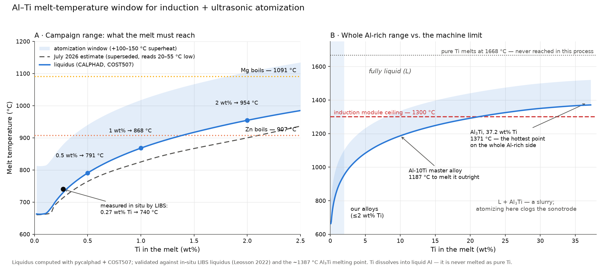

# Al–Ti melt-temperature window for induction-heated ultrasonic atomization

**Context:** [Issue #161 — Atomizer Powder Acquisition](https://github.com/vertical-cloud-lab/byu-vcl/issues/161),
answering: *what is the minimum temperature required for induction-based ultrasonic atomization to handle
Al and Ti together — or do we need Al/Ti as a master alloy?*

**Date:** 2026-09-03 · **Supersedes** the July 2026 liquidus estimate in
[`al-ti-liquidus-annotated.png`](al-ti-liquidus-annotated.png), which reads 20–55 °C low across
0.2–3 wt% Ti (see §7).

---

## 1. Short answer

| Question | Answer |
| --- | --- |
| Minimum melt temperature for Al + Ti | The **liquidus of the final composition**: 791 °C at 0.5 wt% Ti, 868 °C at 1 wt%, 954 °C at 2 wt% |
| Practical atomization setpoint | Liquidus **+ 100–150 °C** superheat → ~**900–1100 °C** for our compositions |
| Is that within the machine? | Yes, comfortably. The rePOWDER induction module is rated to **1300 °C**; Al–Ti does not reach that until ~**20 wt% Ti** |
| Does pure Ti's 1668 °C melting point matter? | **No.** Ti dissolves into liquid Al; it is never melted as pure Ti |
| Do we need an Al-Ti master alloy? | **Not for temperature reasons** — a master alloy does not lower the liquidus by one degree. It buys **dissolution kinetics and safety**, which is a real but separate argument (§6) |
| What actually limits us | Not the machine — the **volatile solutes** (Zn boils at 907 °C, Mg at 1091 °C), crucible attack, and hydrogen pickup (§5) |

---

## 2. The physics: dissolving is not melting

Ultrasonic atomization needs a liquid that is homogeneous and above its liquidus at the sonotrode. It does
**not** need every constituent to be individually molten. Solid Ti placed in liquid Al dissolves — atoms
leave the solid into a liquid that already exists — exactly as sugar disappears into hot tea far below
sugar's melting point. Two different quantities govern the process:

1. **The liquidus** — the temperature above which a given *overall composition* is 100 % liquid. This is a
   hard floor: below it, solid Al₃Ti coexists with the melt and you would atomize a slurry.
2. **Dissolution kinetics** — how fast the solid actually goes into solution (particle size, stirring, hold
   time). This is what the feedstock form (elemental powder vs. master alloy) changes.

The single most important consequence: **the liquidus depends only on composition, not on how the Ti was
delivered.** An Al-1 wt% Ti melt has a liquidus of 868 °C whether the titanium arrived as elemental powder
or as Al-10Ti master alloy. Master alloys help with (2), never with (1).

Al–Ti is a *peritectic* system, so adding Ti **raises** the liquidus above pure Al's 660 °C (unlike Al–Si,
where the eutectic drops it to 577 °C). The rise is steep, which is why the numbers below matter.

---

## 3. The numbers (CALPHAD, validated against experiment)

Computed with [pycalphad](https://pycalphad.org) + the public COST507 light-alloy database by
[`al_ti_melt_window.py`](al_ti_melt_window.py); the "setpoint" column adds 100 °C of superheat.

| Ti in melt (wt%) | at% Ti | Liquidus (°C) | Minimum atomization setpoint (°C) |
| ---: | ---: | ---: | ---: |
| 0.10 | 0.06 | 664 | 764 |
| 0.16 | 0.09 | 683 | 783 |
| 0.27 | 0.15 | **730** *(measured: 740)* | 830 |
| 0.50 | 0.28 | **791** | 891 |
| 0.75 | 0.42 | 834 | 934 |
| **1.00** | 0.57 | **868** | 968 |
| 1.50 | 0.85 | 917 | 1017 |
| **2.00** | 1.14 | **954** | 1054 |
| 3.00 | 1.71 | 1010 | 1110 |
| 5.00 | 2.88 | 1083 | 1183 |
| 10.0 | 5.89 | 1187 | 1287 |
| 20.0 | 12.4 | 1292 | 1392 |
| 37.2 (Al₃Ti) | 25.0 | 1371 | — |

**Validation.** Three independent checks, all agreeing:

- In-situ LIBS liquidus of an Al-0.27 wt% Ti melt: **740 °C measured** vs. **730 °C computed**
  ([Leosson et al. 2022](https://www.sciencedirect.com/science/article/abs/pii/S0584854722000313)).
- Maximum Ti in liquid Al at solidification: **~0.16 wt% measured** vs. 0.16 wt% computed (683 °C).
- Al₃Ti (25 at% Ti): **~1387–1390 °C reported** vs. **1371 °C computed**.

**Zirconium is the stricter case, and it is already in the plan.** The same calculation for Al–Zr gives
726 °C at 0.2 wt% Zr, **894 °C at 1 wt%**, and 986 °C at 2 wt% — a slightly higher floor than Ti at the
same wt%. Whatever melt practice is set for Ti covers Zr with a little more margin.

---

## 4. The machine

| Module | Rating | Source |
| --- | --- | --- |
| Induction | **up to 1300 °C** (an 1800 °C variant exists) — "best suited for non-ferrous materials", ceramic crucible | [AMAZEMET FAQ](https://www.amazemet.com/faq/), [rePOWDER page](https://www.amazemet.com/repowder/) |
| Arc / plasma | up to 3000–3500 °C, water-cooled copper crucible, no crucible reactions | same |
| Atmosphere | O₂ below **50 ppm** (below 10 ppm with getter heating + recirculation) | same |
| Batch | "a few to a few hundred grams" — our 100 g runs are mid-range | same |

At ≤2 wt% Ti we need ≤1054 °C, i.e. **~250 °C of headroom below the induction ceiling** even before
considering the 1800 °C or arc options. Ti stops being reachable on induction only above ~20 wt% Ti —
about 20× more titanium than any planned composition.

**The vendor's own recommendation**, verbatim from the AMAZEMET FAQ, is worth having on record:

> "For aluminum alloys modified with high melting point elements such as zirconium, titanium, or hafnium,
> a two step approach can be used. First, a custom master alloy containing the modifying element is
> prepared using plasma arc melting in a water cooled copper crucible. This allows full melting and
> homogenization of the high melting point addition without the risk of crucible reactions or inclusions.
> In the second step, the master alloy is charged together with the remaining base element into the
> induction crucible for ultrasonic atomization."

Note what this is and is not: it is a **kinetics/cleanliness** recommendation (make the hard-to-dissolve
addition once, under conditions that guarantee homogeneity), not a claim that induction cannot reach the
temperature. **Open question for the lab: does our rePOWDER have the arc/plasma module, or induction
only?** If arc is available, the two-step route is free and is the best practice. If not, §6 applies.

---

## 5. What actually constrains the melt temperature

The atomizer is not the limit. These are, in order of how binding they are for this campaign:

### 5.1 Volatile solutes — the real ceiling

Equilibrium vapour pressure of the pure liquid metal (kPa; 101 kPa = boiling):

| Element | 800 °C | 900 °C | 1000 °C | 1100 °C |
| --- | ---: | ---: | ---: | ---: |
| **Zn** | 32 | **95** | 239 | 527 |
| **Mg** | 4.8 | 16 | **46** | **110** |
| Li | 0.6 | 2.2 | 6.7 | 17 |
| Mn | <0.01 | <0.01 | 0.01 | 0.04 |
| Al | ~0 | ~0 | ~0 | ~0 |

In a dilute Al melt the partial pressure is roughly `x_i × P°`, so these are not literal boil-off rates —
but the **ratio** is: every extra 100 °C roughly **triples** Mg's and Zn's evaporation driving force.
Consequences for alloy design:

- **Do not put Zn and Ti in the same composition.** Zinc's pure-metal boiling point (907 °C) sits *below*
  the liquidus of Al-1.3 wt% Ti. Either keep Ti ≤0.3 wt% in Zn-bearing alloys (liquidus 740 °C), or keep
  Zn out of the Ti-bearing family entirely.
- **Mg tolerates Ti** at ≤1 wt% Ti (≈970 °C setpoint, P°Mg ≈ 30 kPa) with the 5–15 % over-charge already in
  the [purchase model](purchase-quantity-model.md); at 2 wt% Ti (≈1050 °C) the Mg over-charge needs to be
  re-measured, not assumed.
- **Mn is not actually a volatility problem** — its vapour pressure is four orders of magnitude below Mg's
  at these temperatures. Mn losses in Al melts are oxidation/dross losses, so the mitigation is the argon
  cover and a short hold, not an evaporation over-charge.

### 5.2 Crucible chemistry

Induction melting uses a ceramic (or graphite) crucible, and molten aluminium is aggressive: graphite is
attacked to form Al₄C₃ and oxide crucibles are progressively reduced, both increasingly fast above ~900 °C
and with hold time. This argues for the **shortest possible hold at the top temperature** — reach the
dissolution temperature, hold only as long as needed, then drop to the atomization setpoint.

### 5.3 Hydrogen

Hydrogen solubility in liquid Al rises steeply with temperature, and dissolved H is the classic source of
gas porosity in atomized Al powder (see the [Edison feedstock report](edison-lpbf-feedstock-purity-report.md)).
Combined with 5.2: high temperature is a cost, not a free parameter. Dry all feedstock (80 °C, ≥10 h) before
charging.

### 5.4 Sonotrode

The sonotrode is a consumable rated at ">30 hours of continuous operation"; higher melt temperature means
faster erosion and more pickup into the powder (~2.6 at.% Mo has been reported on rePOWDER-type systems).
Another reason to run the *lowest* temperature that keeps the melt above its liquidus.

### 5.5 Dissolution kinetics — the one place Ti is genuinely awkward

Published practice for dissolving elemental titanium into aluminium:

- Ti sponge into molten Al at **950 °C with mechanical or electromagnetic stirring**.
- Ti machining chips at **950–1100 °C for 30–90 min**; 30 min leaves **incomplete dissolution**
  ([Materials 2021](https://www.ncbi.nlm.nih.gov/pmc/articles/PMC8510386/)).
- Al₃Ti **forms or dissolves within minutes** when the melt crosses the liquidus (LIBS, above) — so once
  the Ti is in solution, the response to a temperature change is fast, but getting a *dense, oxide-skinned
  solid particle* into solution the first time is the slow step.

Ti (4.5 g/cm³) and Al₃Ti (3.3 g/cm³) both sink in liquid Al (~2.35 g/cm³), so undissolved particles settle
to the crucible floor and out of the atomized stream — the composition error is silent. Induction's
electromagnetic stirring is a real advantage here; use it.

Our ESPI −325 mesh (≤45 µm) Ti powder has ~100× the specific surface of machining chips, so it should
dissolve far faster than the 30–90 min figures — but fine powder also floats on the oxide skin and can
agglomerate rather than wet. **Plan a 20–30 min stirred hold at 950–1000 °C for the first Ti-bearing run,
then verify by ICP or by sectioning a button and looking for Al₃Ti before shortening it.**

---

## 6. Elemental Ti powder vs. Al-Ti master alloy — the decision

|  | Elemental Ti powder | Al-Ti master alloy |
| --- | --- | --- |
| Liquidus of the final alloy | identical | **identical — no benefit** |
| Temperature to dissolve the addition | 950–1000 °C, 20–30 min, stirred | ~800–900 °C, minutes (Al₃Ti is already the equilibrium phase, finely dispersed, no oxide skin) |
| Risk of undissolved dense particles | real; settles silently | low |
| Oxygen/nitrogen carried in | Ti powder surface oxide + adsorbed N₂ | already dissolved away when the master was made |
| Fire/dust hazard | −325 mesh Ti is UN 2546 Class 4.2, MIE 3–30 mJ | none (granules/chips) |
| Availability at ≤300 µm | ESPI −325 mesh (quoted), AEE TI-109 −100 mesh | quote-only; standard forms are waffle/rod, needs a crushed/screened cut |
| Cost for the campaign | ~$130 (already quoted) | quote-driven |
| To melt/atomize the master *by itself* | n/a | **Al-10Ti needs 1187 °C**, i.e. ~1290 °C with superheat — right at the induction ceiling |

**Verdict.** For the planned compositions (≤1–2 wt% Ti) an Al-Ti master alloy is **not required**, and it is
not a temperature question either way. Buy the elemental Ti already quoted and give the first Ti run a
stirred hold at 950–1000 °C. Escalate to a master alloy — or to the vendor's two-step arc route — only if
one of these shows up:

1. ICP or metallography shows Ti coming in low / Al₃Ti sitting in the button (undissolved feedstock);
2. a Ti-bearing composition also needs Mg or Zn, and the required hold is costing composition control;
3. the fine −325 mesh Ti proves unmanageable to handle at the glovebox or in the auger.

The last row of the table is the one worth remembering for the *other* master alloys: **Al-10Zr needs
1260 °C to be melted outright** (~1360 °C with superheat), which is **above the 1300 °C induction ceiling** —
so re-atomizing the Al-10Zr master alloy on its own is out of reach on induction, even though *dissolving*
it into an Al melt at 0.5–1 wt% Zr (815–894 °C) is trivial. For comparison, Al-20Ce (768 °C) and Al-5Li
(635 °C) melt outright without difficulty.

---

## 7. Melt practice for a Ti-bearing 100 g run

1. **Charge** Al + Ti + the other non-volatile solutes (Cr, Mn, Si, Cu, Ni, Fe) cold. Dry everything at
   80 °C for ≥10 h first; keep the reactive additions under Ar.
2. **Dissolve:** ramp to **950–1000 °C**, hold **20–30 min** with electromagnetic stirring. This is the only
   part of the cycle that needs to be hot.
3. **Add volatiles last:** drop to the atomization setpoint, then add Mg / Zn / Al-Li, short hold, over-charge
   per the [purchase model](purchase-quantity-model.md).
4. **Atomize at liquidus + 100–150 °C** for the *final* composition (Table §3) — never lower. Al₃Ti
   precipitates within minutes once the melt crosses the liquidus, and a slurry will not atomize cleanly.
5. **Never park the melt below the liquidus** while waiting on the sonotrode.

---

## 8. Correction to the July 2026 figure

[`al-ti-liquidus-annotated.png`](al-ti-liquidus-annotated.png) was hand-drawn from approximate anchor points
and reads systematically **low** in the region we care about:

| Ti (wt%) | July estimate | This work (CALPHAD) | Error |
| ---: | ---: | ---: | ---: |
| 0.19 | 690 °C | 700 °C | −10 |
| 1.0 | 825 °C | 868 °C | **−43** |
| 2.0 | 900 °C | 954 °C | **−54** |
| 3.5 | 1000 °C | ~1030 °C | −30 |
| 37.2 | 1412 °C | 1371 °C | +41 |

The July figure's qualitative conclusion (Ti is fully workable below the atomizer ceiling) stands and is if
anything strengthened; only the setpoint numbers change. Use this document's Table §3 for melt setpoints.

---

## 9. Sources

- [AMAZEMET rePOWDER specifications](https://www.amazemet.com/repowder/) and
  [FAQ](https://www.amazemet.com/faq/) — induction 1300 °C, arc/plasma 3000–3500 °C, O₂ <50 ppm,
  sonotrode >30 h, and the two-step master-alloy recommendation for Zr/Ti/Hf.
- K. Leosson et al., "Analysis of dissolved titanium concentration and phase transformation in molten Al–Ti
  alloy using LIBS," *Spectrochim. Acta B* **190** (2022) 106387 —
  [publisher](https://www.sciencedirect.com/science/article/abs/pii/S0584854722000313) ·
  [open PDF](https://static1.squarespace.com/static/655c8be2b316370dccfbbc4e/t/664f1a6ef655be56b7c6dd47/1770895563133/DTE_RU_Spectrochimica_Acta_2022.pdf).
  In-situ liquidus measurements; AlTi6 master added to an 800 °C melt; Al₃Ti forms/dissolves in minutes.
- COST507 thermodynamic database for light alloys (Ansara, Dinsdale, Rand, EUR 18499, 1998) — used via
  [this corrected copy](https://gist.github.com/bocklund/c4714ddbc0500c78e6fe255a763e7550); calculations
  run with [pycalphad](https://pycalphad.org).
- J.C. Schuster and M. Palm, "Reassessment of the binary aluminum–titanium phase diagram,"
  *J. Phase Equilib. Diffus.* **27** (2006) 255 — assessed Al–Ti diagram.
- [Preparation process and phase transformation of Al-5Ti-0.25C master alloy from Ti machining chips](https://www.ncbi.nlm.nih.gov/pmc/articles/PMC8510386/)
  — Ti chip dissolution at 950–1100 °C, 30–90 min.
- [Dezellus, Gardiola & Andrieux, "On the solubility of group IV elements (Ti, Zr, Hf) in liquid aluminium below 800 °C," *J. Phase Equilib. Diffus.* 34 (2013)](https://link.springer.com/article/10.1007/s11669-013-0278-2)
  — settling + ICP-AES solubility measurements (abstract only; paywalled).
- Vapour pressures: Clausius–Clapeyron from CRC boiling points and enthalpies of vaporisation — order of
  magnitude, not three significant figures.
