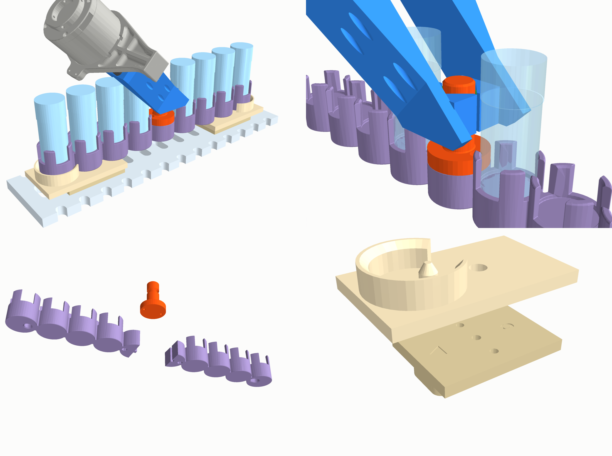
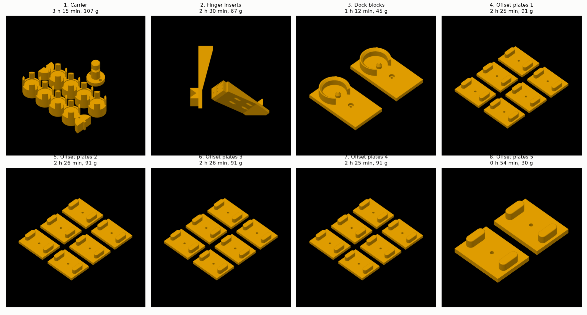
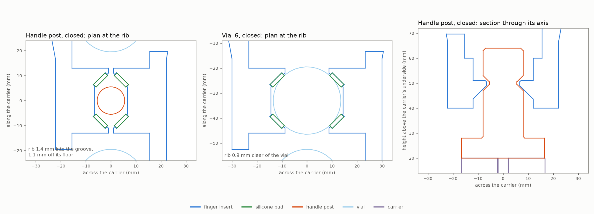
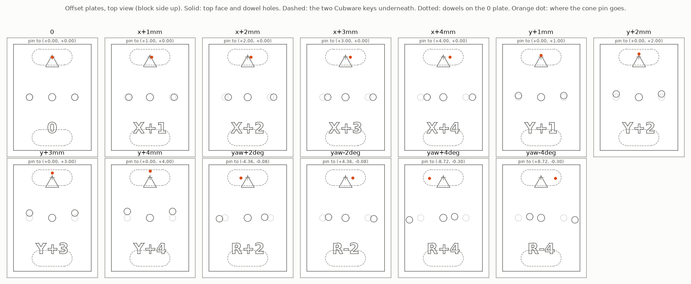

# PiPER ↔ CubXL vial handling

Figures and numbers behind the review in
[#266](https://github.com/vertical-cloud-lab/byu-vcl/issues/266): what Chris's CubXL mock-up
covers, what it leaves out, and a proposed handoff dock for the PiPER. Below that are the printable
parts for that dock (mock-up v2).

| File | What it is |
|---|---|
| `sketch-2d.png` | Plan, a section on the arm's centre line, and a detail of the dock |
| `layout-3d.png` | The same layout in 3D, with a close-up of the 45° grasp on the carrier's handle post |
| `geometry.py` | Fetches the mock-up parts and Cubware's real deck, and places the CubXL, dock and carrier |
| `analysis.py` | Measures the parts, then works out tool windows, payload and grip, reach and IK, and tolerances. Writes `results.json` |
| `render.py` | Draws the two figures |
| `piper_fk.py` | PiPER kinematics from AgileX's URDF, copied from `robot-arm/enclosure/` on #254 |

To regenerate, run `python analysis.py && xvfb-run -a python render.py`. The scripts fetch three
things into `/tmp`, so nothing third-party is vendored here:
- Chris's parts, from the zip attached to #266
- the PandaDeck plate from [Ursa-Laboratories/Cubware](https://github.com/Ursa-Laboratories/Cubware) at `352aa95`
- `agilexrobotics/piper_ros` at `ac41fcb`, for the URDF and meshes

They need `trimesh`, `manifold3d`, `pycollada`, `scipy`, `pyvista` and `matplotlib`.

## Printable parts for mock-up v2

The v2 recommendation as parts for the A1 mini: the dock, the 8 + 1 carrier, the finger inserts and
the offset plates for the capture-envelope test. They are parametric in CadQuery and built from
Cubware's `PandaDeck.step`, `9VialHolder.step` and `9VialHolder-key.step` at `352aa95`, and from
AgileX's gripper STEP (the file #245 used, checked by SHA-256). All four are fetched at run time.



| File | What it is |
|---|---|
| `sources.py` | Fetches the four STEPs into `/tmp/cubxl-vial-handling` and measures every number the parts take from them: deck slots and pitch, key, pockets, seat, taper, outline, key sockets, the jaw's carriage, screws and bearing, and the tool axis |
| `parts.py` | Builds the parts. Writes `exports/*.step`, plus `exports/*.stl` in print orientation and `exports/params.json` (parameters, measured numbers, volumes, grip openings) |
| `checks.py` | Interference checks on the B-rep solids. Writes `exports/checks.json` |
| `slice/slice_a1mini.py` | Bambu Studio CLI slice with supports off. Writes `slice/mockup_v2_A1mini_PLA.3mf` (8 beds) and `slice/report.json` |
| `payload.py` | Masses from the per-part slices and the carrier's payload. Writes `exports/payload.json` |
| `ik_margins.py` | Joint margins with the inserts' grasp centre. Writes `exports/ik_margins.json` |
| `stock_jaws_check.py` | The same grasps with AgileX's own jaws, for comparison. Writes `exports/checks_stock_jaws.json` |
| `render_parts.py` | `parts-assembly.png`, `grasp-sections.png`, `offset-plates.png`, `print-beds.png` |

To regenerate:

```bash
pip install cadquery trimesh manifold3d scipy pyvista matplotlib
python parts.py && python checks.py && python ik_margins.py && python stock_jaws_check.py
python slice/slice_a1mini.py --bambu ~/bambu/squashfs-root   # Bambu Studio 02.08.02.61 AppImage, extracted
python payload.py && xvfb-run -a python render_parts.py
```

`slice/` reuses #245's pipeline. `flatten_presets.py` and `glxshim.c` are copied unchanged, and
`piper-camera-mount/slice/README.md` covers the CLI's setup and traps.

### The parts

| Part | Print | PLA (Bambu, 3 walls, 25 %) | What it does |
|---|---|---|---|
| `carrier_half_a`, `carrier_half_b` | 1 each | 49.2 g each | Cubware's 9VialHolder solid, cut in half through slot 5: 33.4 × 151.7 and 33.4 × 148.7 mm, so each fits the 180 mm bed. Slot 5's pocket and fingers are gone, and so are Cubware's key sockets. Pockets 1–4 and 6–9 get a 1 mm × 45° entry chamfer. Under pocket 1 is a Ø8.1 cone-pin hole and under pocket 9 an 8.1 × 12 mm slot, both 125 mm from the centre and chamfered. A tongue on half A locates half B |
| `handle_post` | 1 | 8.7 g | A Ø16 post on a Ø33 flange. The flange bolts across the joint with 2 × M3 × 20, nuts in pockets underneath. A 45° V groove 6 mm wide and 2.5 mm deep sits 50 mm above the carrier's underside, the grasp height `analysis.py` used |
| `dock_block` | 2 | 22.6 g each | One under each end of the carrier. A cup round the end pocket's disc has 0.5 mm clearance and a **3 mm × 45° lead-in**. A **cone pin** (Ø7.9, 30° tip) goes in the carrier's hole at one end and its slot at the other, so the two blocks are the same part. Two Ø4 dowel holes underneath (one a slot), and an M4 counterbore |
| `plate_*` | 2 of each of 13 | 15.3 g each | **Offset plates.** Two of Cubware's own keys, integral and turned so their long axis crosses the carrier, fit two deck slots 50 mm apart. Two Ø4 dowels carry the dock block. `plate_0` is the permanent mount; the others move the block (below) |
| `finger_insert_upper`, `_lower` | 1 each | 33.4 and 33.8 g | Replace AgileX's jaws on the MGN7 carriages, using the same 4 × M2 screws and the same F4-9M bearing, moved over. Each is a **90° V-block** whose V runs vertical at the 45° grasp, with **recesses for 1.5 mm silicone pads** (6.5 × 17.5 mm, 1 mm deep, two per insert) and a **rib** at the bottom of the V that drops into the post's groove. The two are mirror images in the V |

The job is 8 beds, **17.6 h and 614 g**. Bambu's support check ran on all 33 objects and flagged
none. No supports were generated and nothing leaves the 180 mm bed (`slice/report.json`). The
inserts print standing on the jaw with the V upright, the plates upside down with their keys on
top, and everything else as it sits on the deck.



**Hardware:**
- 2 × M3 × 20 socket head screws and 2 × M3 nuts, for the carrier joint
- 4 × Ø4 × 8 mm dowel pins (printed ones will do)
- 2 × M4 × 25 screws, with a washer and nut under the deck, for the permanent mount on the 0 plates
- a 1.5 mm silicone sheet, Shore 30–50A, for the four pads. Glue them with a silicone adhesive

### What building it changed

1. **The palm, not the fingers, hits the vials.** At the 45° grasp, AgileX's finger plate and motor
   housing are only 50 mm behind the pad centre. They come down onto the vials between the grasp and
   J1. With the post grasped at AgileX's pad centre, `checks.py` found the finger plate 2,857 mm³ and
   the motor housing 897 mm³ inside vial 3's cap. The inserts therefore reach **42 mm further**
   (`reach_extension`), which puts the grasp centre 162 mm past the flange. With that, nothing on the
   gripper touches a vial in any checked grasp; at the post, the finger plate passes 12.7 mm from
   vial 2. The joint margins hold:

   | Grasp at 45° | AgileX's pad centre (120 mm) | Inserts (162 mm) |
   |---|---|---|
   | Handle post | 54.6° | 51.4° |
   | Slot 1 (nearest) | 44.0° | 42.2° |
   | Slot 9 (farthest) | 19.8° | 31.8° |

   The longer reach puts a larger moment on the MGN7 carriages for the same grip, so start the grip
   low, around 20 N. The rib holds the carrier's weight without friction. On a vial, the V gives 1.4
   times the friction of flat pads: 79 N of hold at 40 N of grip, against a 0.45 N vial.
2. **A rib that fits the post's groove would also hit a vial of the same diameter.** Whatever reaches
   into the groove reaches into a smooth cylinder of that size too. So the rib sits at the bottom of
   the V and the post is Ø16 rather than vial-sized. A Ø27 vial sits higher in the V and stops short
   of the rib. The Ø16 post sits deeper, so the rib reaches its groove (`grasp-sections.png`):

   | | Silicone pads fitted | Bare flanks |
   |---|---|---|
   | Rib clear of a Ø27 vial | 0.90 mm | 0.19 mm |
   | Rib into the post's groove | 1.38 mm | 2.09 mm |
   | Rib off the groove's floor | 1.12 mm | 0.41 mm |

   Fit the pads before gripping vials. The V centres the post or vial along the carrier, and the
   groove's 45° flanks give ±2 mm of vertical capture.
3. **AgileX's own jaws would also hit the next vial along.** The jaw is 56 mm wide at its root, so at
   the post grasp each jaw and pad goes 466 + 885 mm³ into vial 4. The inserts' jaw blocks stay within
   ±13 mm along the carrier. Their beams sit at least 15.5 mm out from the post's axis, outside every
   cap (Ø28).
4. **The carrier is 297 mm long; the bed is 180 mm.** Hence the two halves and the bolted post.
   Cubware's keys sat under pocket 1 and between pockets 7 and 8. They are replaced by the pin hole and
   slot, 250 mm apart (10 deck pitches), so both pins land on deck slots.



**Gripper openings.** These are what the SDK would report for AgileX's own fingers at the same
carriage position:
- **open: 60.0 mm**, which leaves 3 mm of clearance round a vial on the way in
- **vial: 44.6 mm**
- **post: 29.0 mm**

Without pads, the vial and post openings are 43.2 and 27.6 mm. The inserts only work in one of the
two wrist orientations 180° apart about the tool axis. If the V comes out horizontal, swap the two
inserts between the carriages.

### Interference checks (`exports/checks.json`)

Everything below was checked in the carrier's frame. The parts are the deck strip, two 0 plates and
four dowels, both dock blocks, the carrier halves and post, eight vials (Ø27 body, Ø28 cap, 64.2 mm),
and AgileX's gripper with the inserts and pads. Each pair reports the volume the two solids share.

| Check | Clashes | Closest approach |
|---|---|---|
| Parts at rest: deck strip, plates, dowels, dock, carrier, post, vials | none | Each vial shares 74 mm³ with its pocket's fingers. That is Cubware's tight fit, by design |
| The dock blocks on each of the 13 offset plates | none | |
| Inserts and pads against the gripper at the open, vial and post openings | none | The inserts' back faces sit on the carriages and the bearings on their seats |
| Post: closed, open, and open at 30 and 60 mm back along the approach | none | The PLA flanks are 0.44 mm from the post (the pads touch it). The finger plate passes 12.7 mm from vial 2 |
| Vials 1, 4, 6 and 9: closed, and open at 30 mm back | none | The flanks are 0.5 mm from the vial (the pads touch it). The nearest other vial is 8.4 mm away |
| AgileX's own jaws at the same grasps (`stock_jaws_check.py`) | the palm in the vial two places nearer J1 (2,857 + 897 mm³); on the post, each jaw and pad also in vial 4 (466 + 885 mm³) | This is why the inserts reach further and keep their jaw blocks narrow |

The pairs inside AgileX's own model are not checked, because its carriages overlap its rail.

### The capture-envelope test

The plates are drawn in the dock block's frame: x across the carrier, y along it, with the engraved
arrow pointing out towards the carrier's end. Each plate's label and arrow are engraved in its top face.



| Move the whole dock by | Under the block at pocket 1 | Under the block at pocket 9 |
|---|---|---|
| 0 | `plate_0` | `plate_0` |
| +d mm in x or y | `x+d` or `y+d`, arrow out | the same plate, arrow in (turned 180°) |
| −d mm in x or y | `x+d` or `y+d`, arrow in | the same plate, arrow out |
| ±2° or ±4° about the carrier's centre | `yaw±…`, arrow out | `yaw±…`, arrow out |

So a full set is two of each of the 13 designs, and the job prints them. Turning about the
carrier's centre moves each pin sideways by 125 × sin θ: 4.4 mm at 2° and 8.7 mm at 4°. Both are
past the 3 mm lead-in at the ends, so the yaw plates should find the edge of the envelope rather
than sit inside it. 3 mm at 125 mm is about 1.4°. Teach the place pose on the 0 plates. Every plate
is 6 mm thick, so the dock's height is the same on all of them. For the permanent mount, stay on the
0 plates and bolt through the block, plate and deck slot. The offset plates go unbolted.

### Payload (`exports/payload.json`)

- **Printed carrier: 107 g.** The halves and post are 107.1 g, plus 3.8 g of screws and nuts.
- **Full carrier: 479 g** with eight vials at 46 g each (20 g glass, 6 g cap, 20 g water). That is
  **32 % of the PiPER's 1.5 kg**, or 65 % if the 0.5 kg gripper counts against it. With Chris's
  dummy vials printed solid (46.8 g) it is 485 g.
- **Finger inserts: 67 g the pair**, in place of AgileX's jaws and pads (28.2 cm³ each).
- **Lopsided load:** four full vials on one side of the post still put 0.149 N·m on the grip. The
  rib holds the carrier up positively, so its weight does not rely on friction.

## Findings

**The mock-up against the real deck.**

| | Mock-up | CubXL+ deck (Cubware `PandaDeck`) |
|---|---|---|
| Plate | 310 × 305 × 10 mm, PLA, on four 38 mm legs (top 58.6 mm up) | 480 × 490 × 10 mm, polycarbonate |
| Slots | 42 (7 × 6), 24.9 × 9.8 mm | 180 (18 × 10), 24.9 × 10.0 mm |
| Pitch | 45 mm along the slot, **35.6 mm** across | 45 mm along the slot, **25 mm** across |
| Key in slot | 0.0 mm clearance | 0.2 mm clearance |

Neither slot has a chamfer. The holder's two keys are 225 mm apart and go 10 mm deep.

**The holder and the vials.**
- **Holder:** a single row of nine pockets, 33 mm apart, with the vial seat 18 mm up.
- **Pockets:** each is four printed fingers, 17 mm tall. Their inner radius narrows from 13.76 mm
  at the seat to 12.93 mm at the top, against a 13.5 mm vial body. That is a 0.57 mm squeeze,
  the "tight fit" that holds the vial down while the electromagnet pulls the cap.
- **Printed vial:** 64.2 mm tall, a 27 mm body with a 28 mm cap from 45.5 mm up, and 46.8 g if
  printed solid. The CubOS deck files list vials as 83 mm tall, so check which is right.

**Tool windows.** CubOS turns a deck position into a gantry move by subtracting each tool's
offset. With the 2026-09-26 calibration, the capper and the pipette (offset 54.0, 13.0 mm) can
both reach:
- **Along X:** 334 mm (54–388), enough for 11 vials at 33 mm.
- **Along Y:** 220.7 mm (13–233.7), enough for only **7**.

A 9-position holder spans 264 mm, so it fits only along X.

**Reach.** These come from the URDF, with the pad centre 120 mm past the flange.
- **Straight down:** J5 stops at ±70°, so the gripper can point straight down only below about
  0.10 m above the arm's base and within about 0.34 m of J1. With 15° kept clear of every joint
  limit, it can't go above 0.05 m.
- **At 45°, 15° clear of every limit:** the pad can reach 0.23–0.65 m at 0.10 m height and
  0.13–0.64 m at 0.15 m.
- **Carrier direction:** a 45° grasp along a carrier that points at J1 works. Along a carrier
  that runs across the arm's line, IK finds no solution.

| Handoff point (grasp 117 mm above the bench) | Radius | Smallest joint margin |
|---|---|---|
| Handle post, 45° | 0.519 m | 54.6° |
| Handle post, 60° | 0.519 m | 27.4° |
| Nearest vial (slot 1), 45° | 0.387 m | 44.0° |
| Farthest vial (slot 9), 45° | 0.651 m | 19.8° |
| Single-vial pocket, 45° | 0.408 m | 50.1° |
| Handle post, straight down | 0.519 m | unreachable |
| Far deck corner (direct reach-in), 45° | 0.824 m | unreachable |

**Payload and grip.**
- **Mass:** a full carrier weighs 0.53–0.66 kg, depending on the holder's infill. That is 35–44%
  of the PiPER's 1.5 kg, or 53–66% if the 0.5 kg gripper counts against it.
- **Vertical slip:** at 40 N, the grip holds 20 N with bare fingers on glass (μ 0.25), or 56 N
  with silicone pads (μ 0.7).
- **Lopsided load:** with four full vials on one side of a centre handle, the twist on the grip
  is 0.149 N·m. Bare 20 × 20 mm pads resist 0.153 N·m, so they are right at slipping. Silicone
  pads resist 0.429 N·m.
- **End grip:** holding the carrier by one end puts 0.74 N·m on the grip. That needs pins or a
  dovetail; friction alone won't hold it.

**Placement tolerance.**
- **Arm error budget:** ±0.10 mm arm repeatability, ±0.5 mm gripper, ±0.3 mm teaching and
  registration, ±0.25 mm structure and humidity. That gives ±0.64 mm combined (RSS) and ±1.15 mm
  worst case.
- **Capture range of each feature:**
  - pill key: ±0.2 mm
  - tight pocket: ±0.6 mm
  - a 3 mm lead-in nest: ±3 mm
  - a chamfered loose pocket: ±2.5 mm

## Assumptions

- **CubXL frame:** rail, member, beam and backboard positions are placeholders scaled from the
  #133 photos, and the gantry's travel is assumed centred on the deck. Only SainSmart's overall
  641 × 755.5 × 580 mm and the configs' working volume are real. Measure the rest before
  trusting a clearance.
- **Deck height:** taken from Chris's mock-up (58.6 mm). Measure the real one.
- **Masses:** 20 g glass, 6 g cap and 20 g water per vial, and a 75 g holder at 15% infill
  (202 g solid). Weigh yours.
- **Friction:** μ 0.25 for bare PLA or aluminium on glass, 0.7 for silicone on glass.
- **Holder size:** the holder Chris attached is 33.4 × 297.4 mm, while Cubware's
  `9VialHolder.yaml` says 36.2 × 300.2 mm. The analysis uses the attached part. The printable carrier
  is cut from Cubware's own `9VialHolder.step`, which measures 33.4 × 297.4 mm too.
- **Vial height:** the parts assume Chris's 64.2 mm vial. With the 83 mm vials of the CubOS deck
  files, the palm comes down on the caps again. Raise `reach_extension` to about 70 mm, then re-run
  `checks.py`.
- **AgileX's STEP is the real gripper.** #245's camera mount was printed against it, but nothing yet
  has been fitted to its jaw interface: 4 × M2 into each MGN7 carriage, 12 × 8 mm apart, and the
  F4-9M bearing on an M3 tapped 2.5 mm. Check both on the arm before taking a jaw off. If the jaws
  turn out to be held differently, only `finger_insert()` changes.
- **PLA shrinkage** over the 250 mm between the pins is taken up by the 12 mm slot in half B
  (±1.95 mm).
