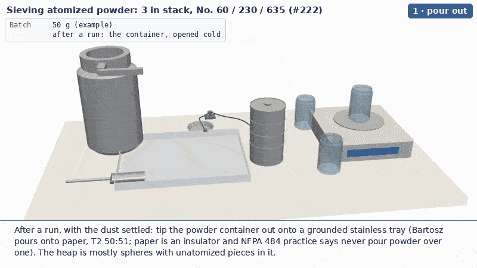

# 3-D animation of the sieving procedure

The procedure in [`docs/sieve-order.md`](../../docs/sieve-order.md), drawn from a CadQuery model and rendered with
PyVista, the same pipeline as #255's [`atomizer-training/viz3d`](../../atomizer-training/viz3d/README.md)
(`scene.py` here is a copy of that framework). Parts move along the paths hands would take them; there is no operator
figure. The stack is cut open at y = 0 only while the powder is moving through it.



One animation, `sieving`, in six steps: pour the container out onto a grounded stainless tray, pick the pieces out,
scoop the powder into a funnel on the No. 60, cover on, sieve (cutaway), unstack each sieve through the funnel into
its own jar with the print fraction weighed, then lids, label and the doser cartridge for scale. The tray, the scoop
and the green bonding leads to the brass ground stud are the combustible-dust practice the order document asks for
(NFPA 484 / 77); Bartosz pours onto paper, which the literature says not to do with Al powder.

## Real dimensions, and which ones are not

| Part | Size in the model | Source |
| --- | --- | --- |
| Gilson 3 in all-stainless full-height sieves (V3SF #60, #230, #635), pan (V3SFXPN), cover (V3SFXCV) | frame OD 3 in = 76.2 mm; overall height 1.75 in = 44.5 mm; stacked height 1-1/8 in = 28.6 mm; so the skirt that nests in the sieve below is 5/8 in = 15.9 mm; mesh diameter 74 mm | [globalgilson.com product pages](https://www.globalgilson.com/3-inch-sieve-all-stainless-full-height-number-635), read 2026-10-07. The cover's height (12 mm) and the pan's (same as a sieve) are assumed |
| Mesh | drawn as a 0.45 mm disc, coloured by fineness | 20-250 µm wires are below the drawing's resolution |
| rePowder powder container | Ø130 × 202 mm, Ø108 top tube, handle | #255's `model.py`, where its position is observed on video and its size **assumed**. Not measured yet |
| Tray | stainless, 280 × 220 × 18 mm, 1 mm wall (the part is still called `paper` in the code: the first draft used a letter sheet) | a grounded tray in place of Bartosz's paper (T2 50:51); stand-in size |
| Scoop | stainless half-tube, Ø30 × 70 mm with a Ø6 × 90 mm handle | a conductive lab scoop, stand-in size |
| Bonding leads | two flexible leads with clips, tray and stack to a brass ground stud at the back of the bench | NFPA 484 / 77 practice; drawn as tubes, not modelled parts |
| Jars | 100 mL, Ø50 × 80 mm | "smaller jars than the ones from Chem Stores" (#222, 2026-09-29); a stand-in size |
| Funnel | Ø75 mm top, Ø10 mm stem | a stainless powder funnel, stand-in |
| Balance | 190 × 210 × 42 mm body, Ø120 mm pan | stand-in for a top-loading balance |
| Powder doser cartridge | Ø25.0 × 100 mm tube with cap | [vertical-cloud-lab/powder-doser PR #170](https://github.com/vertical-cloud-lab/powder-doser/pull/170): the auger tube is Ø25.0 from the STEP files |
| Powder | 50 g batch; 1.6 g/cm³ tapped | the density from #232's `charge_cad.py`; 50 g on a 3 in mesh (40.7 cm²) is a 7.7 mm bed |
| Split | 3 g on the No. 60, 8 g on the No. 230, 33 g on the No. 635, 6 g in the pan | **an example**, chosen to show the layers; not a measurement |

The sieves really do nest only 15.9 mm, so a stack of three plus pan and cover is 143 mm tall, and the whole bench
fits in 0.8 m. The container looks big beside the sieves because it is: its mouth is wider than the sieve, which is
why the powder goes via the tray and a scoop and not straight from the container.

## Running

```bash
export PIP_TIMEOUT=600 PIP_RETRIES=2
pip install cadquery pyvista pillow numpy          # plus: apt-get install xvfb libgl1-mesa-dri gifsicle ffmpeg
cd sieving/viz3d
python model.py                                                  # builds and caches the meshes, lists the parts
PREVIEW=1 xvfb-run -a -s "-screen 0 1920x1080x24" python steps.py   # last frame of each sub-step -> /tmp/preview_sieving.png
xvfb-run -a -s "-screen 0 1920x1080x24" python steps.py             # out/sieving.gif, out/sieving_still.png, out/mp4/sieving.mp4
```

About a minute to tessellate, then about 0.25 s a frame: four to five minutes for the GIF (800 × 450, 10 fps) and the
MP4 (1280 × 720, 15 fps, not committed). `out/sieving.json` has the frame range of each sub-step.

## Files

| File | What it is |
| --- | --- |
| `model.py` | The parts as named CadQuery solids with colours, in their assembled places (mm, z up from the bench, the operator at -y): the stack, the container, tray and scoop, the ground stud and the bonding-lead paths, the dish, jars and lids, funnel, balance, doser cartridge, the pieces, and the grit left on the No. 60. `meshes()` tessellates them (whole and halved at y = 0) and caches them; `heap_meshes()` prebuilds the powder heaps at a series of levels (a cone on the paper, a layer on a mesh, a layer in a jar). |
| `scene.py` | #255's Scene framework, unchanged: grouped actors with parents, eased moves, cutaway blending, leader labels, readouts, captions; GIF and MP4 writers. |
| `steps.py` | The animation. `Heap` swaps in the prebuilt heap mesh nearest a level; `Drops` is the powder in motion, points with gravity in slow motion that vanish into the heap they land on. |
