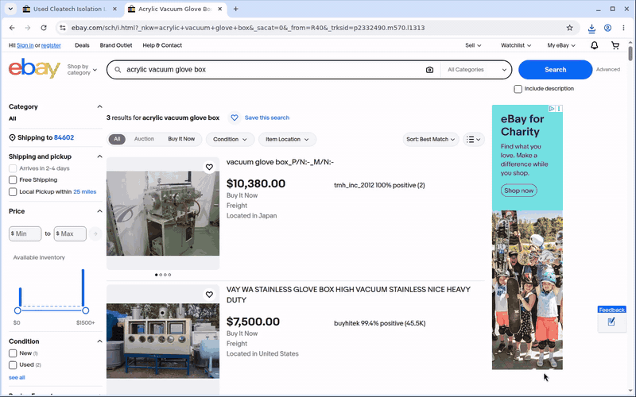
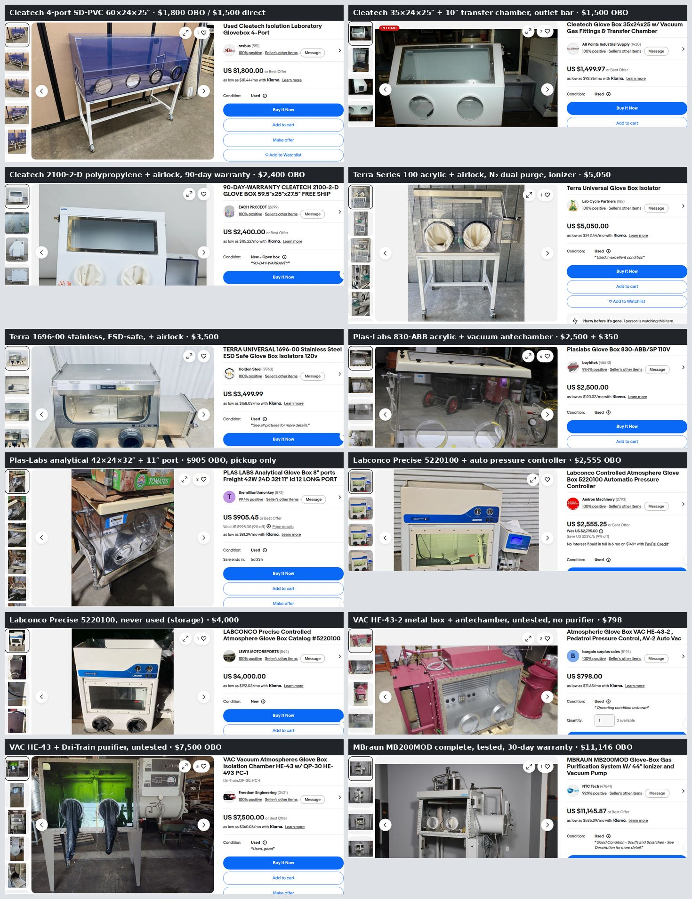

# Headed browser through a lab Pi

This is for sites that refuse datacenter IPs or scripted clients, such as eBay or YouTube's player. It runs a
real, headed Chrome on the CI runner and drives it only through X input: curved mouse moves, clicks,
drags and keystrokes via `xdotool`. Its traffic leaves through a lab Pi over an `ssh -D`
tunnel.



## Why it is shaped this way

- **The browser runs on the runner, not the Pi.** The OT-2 stream-cam Pi is a Pi Zero 2 W
  with 512 MB of RAM that carries a livestream, and Chrome would not fit beside it. Over the
  tunnel the Pi only relays bytes, and nothing gets installed on it.
- **No automation hooks.** There is no WebDriver, no `--remote-debugging-port` and no
  `--enable-automation`. Input arrives through XTEST, so `event.isTrusted` is true and the
  page has nothing to detect. Pages are read back through the clipboard (`hb.py text`) or
  Ctrl+S, not DevTools.
- **Rate-capped.** Everything the browser downloads leaves the Pi as *upload*, which is the
  livestream's direction too. `ratelimit_pipe.py` caps it at ~2.4 Mbit/s by default.

## Run it

```bash
sudo apt-get install -y xdotool xclip imagemagick openbox        # on the runner only
PI=OT2_STREAM_CAM setsid -f tools/headed-browser/tunnel.sh        # SOCKS5 on 127.0.0.1:1080
tools/headed-browser/start_browser.sh https://www.ebay.com
export DISPLAY=:99
tools/headed-browser/hb.py shot home               # then look at the PNG
tools/headed-browser/hb.py click 600 157           # eBay's search box
tools/headed-browser/hb.py type "plas labs glove box"
tools/headed-browser/hb.py click 1258 157          # Search
```

`PI` selects the env-var prefix: `OT2_STREAM_CAM`, `RPI_STREAM_CAM` or `CUBXL_PI`. Check
which Pis are online first. On 2026-09-25 only the OT-2 one was. To stop everything:
`pkill -f '[s]sh -N -D'; pkill -f '[/]opt/google/chrome/chrome'; pkill -x Xvfb`. Keep the
brackets, because a bare `pkill -f google-chrome` matches your own shell's command line and
kills it.

`ebay/search.sh` wraps search → Ctrl+S → parse, and `ebay/item.sh` wraps listing →
description. Their coordinates assume the 1440×900 window that `start_browser.sh` opens.

## What was learned (2026-09-25, issue #30)

- **Tailscale SSH allows dynamic forwarding (`ssh -D`)** from the tagged runner. No ACL
  change is needed, and it stays inside the `tcp:22` grant.
- **The OT-2 stream-cam Pi exits through BYU's campus network (AS6510)**, not a residential
  ISP, and it geolocates to 84602. As a result eBay's shipping estimates come out for BYU.
- **A fresh Chrome profile pulled ~35 MB of components and models through the tunnel before
  it loaded a single page.** At the capped rate that pushed page loads into timeouts. The
  `--disable-background-networking` family of flags, plus `proxy.pac` sending Chrome's own
  update hosts direct, cut a fresh profile's idle traffic to 0.04 MB.
- **eBay served this browser with no challenge.** The homepage, search, listings and seller
  descriptions all loaded at ~1.5 MB per page. The 2026-09-23 session had scripted requests
  refused from a Pi as well as from the runner, so eBay rejects the client and not only
  the IP. Headed Chrome straight from the runner's Azure IP was not tried.
- **Fast `view-source:` fetches tripped eBay's "Pardon Our Interruption… Checking your
  browser" interstitial.** They are raw HTML requests that never run the page's scripts. The
  interstitial cleared by itself. Saving the already-rendered page with Ctrl+S (HTML only)
  makes no new request, and it didn't trip the check again.
- **The livestream didn't notice.** About 79 MB was relayed over ~30 min, including the 35 MB
  above. ffmpeg held `speed=1x` at 10 fps, and its cumulative dropped-frame counter went
  from 41 to 42.

Screenshots can carry location, because eBay prints the geolocated ZIP ("Shipping to …") on
search pages. Here it was BYU's own ZIP, but check before committing any screenshot.


