# P20 Fake-Tip CAD — Test Array, Deck Plate, and Mock Sensor Package

Parametric [build123d](https://build123d.readthedocs.io/) models implementing the
test-array strategy from [`../p20-fake-tip-design.md`](../p20-fake-tip-design.md).
Requested in [issue #33](https://github.com/vertical-cloud-lab/byu-vcl/issues/33)
/ [PR #114](https://github.com/vertical-cloud-lab/byu-vcl/pull/114); workflow
conventions follow
[vertical-cloud-lab/powder-doser](https://github.com/vertical-cloud-lab/powder-doser)
(`cad_model.py` + `Params` dataclass, per-part STL/STEP exports, `renders/`).

## Provenance: measured from the original P300 part

The original Acceleration Consortium
[`Sensor package main enclosure.step`](https://github.com/AccelerationConsortium/wireless-color-sensor/blob/main/CAD-File/STEP/Sensor%20package%20main%20enclosure.step)
(P300 version) was imported and measured with build123d/OpenCascade:

| Feature | Measured value |
|---|---|
| Fake-tip post | Ø9.5 mm × 13 mm (R2 fillet into top face) |
| Bore | entry Ø≈5.15 mm → Ø≈4.19 mm over 14.5 mm depth |
| Bore taper half-angle | **1.78°** (conical surface in the STEP) |
| Overall part height | 84 mm (matches the team's labware `tipLength: 84`) |
| Body footprint | 40 × 60 mm |

The 1.78° half-angle is the empirical GEN2 nozzle taper from the working P300
design and is reused for the P20 socket bores here (the design doc's "~2–3°"
estimate, refined).

## Parts

| File | What it is |
|---|---|
| `stl/fake_tip_test_array.stl` | 10 round-1 test tips, bore ID 3.40–3.85 mm in 0.05 mm steps (straight bore, no slits). Each tip: body Ø8 × 10, flange Ø10 × 2, socket Ø6 × 8 mm; the 2-digit size code (e.g. `55` = 3.55 mm) is engraved on the underside. Laid out in the same 2 × 5 / 18 mm-pitch grid as the deck-plate pockets. |
| `stl/fake_tip_test_array_slit.stl` | The **round-2** array: same 10 tips but with the final socket geometry — **1.78° tapered bore + 6 spring-finger slits**. Round-1 is deliberately straight-bored/slitless so the *bore diameter alone* is measured cleanly; round-2 adds the slits so the chosen winner can be re-checked for grip and ejection with the production geometry. |
| `stl/fake_tip_test_array_slit_small.stl` | The **round-1.5** array: 10 slitted tips (same 1.78° tapered bore + 6 spring-finger slits) stepping **down** from 3.40 mm to **2.95 mm** in 0.05 mm steps — i.e. its largest bore equals the *smallest* bore of `fake_tip_test_array_slit`. Round-1 slitted testing only picked up the 3.40 mm tip, so this probes the smaller bores the (sub-3.70 mm) nozzle actually needs. Size codes engraved underneath are the bore ID in hundredths of a mm (`40` = 3.40, `00` = 3.00, `95` = 2.95). |
| `stl/deck_plate_base.stl` | ANSI/SLAS-footprint (127.76 × 85.48 × 24 mm) plate that sits in an OT-2 deck slot. 10 drop-in pockets register the test tips without locking them down; bore sizes, a title, and an `A1` corner marker are engraved on top. Underside is hollowed (3 mm shell + columns under each pocket). |
| `stl/fake_tip_insert.stl` | Final-geometry modular insert per the design-doc table: peg Ø6 × 5 + flange Ø8 × 2 + socket Ø6 × 8 with **tapered bore (1.78°)** and **6 spring-finger slits** (0.5 mm wide, 6 mm deep, rounded roots). |
| `stl/mock_sensor_package.stl` | Drop-in stand-in for the wireless color sensor: original 40 × 60 mm footprint and **84 mm overall height**, topped with the P20 socket (tapered bore + spring fingers at the nominal 3.55 mm mid-bore). Because the envelope matches the original P300 part, the existing `byu_color_sensor_charging_port` labware definition (`tipLength: 84`) from PR #116 works unchanged. |
| `stl/real_enclosure_p20_tip.stl` | The **actual printed enclosure with its fake tip swapped** for the tested "best" P20 tip. The body is `reference/sensor_package_main_enclosure_7p5mm.step` imported **unmodified** (the reference keeps the old fake-tip post as its own solid, concentric on the part axis, so lopping it off is exact); the residual ~2 mm of the old Ø7.4 bore in the body top wall is plugged, and a new tip is grafted **concentric on the old post axis** with the **same 19.5 mm post height** (top face stays at the original z, bbox unchanged at 40 × 60 × 90.5 mm). The new tip mirrors the round-1 winning test-tip stack: base flare matching the old Ø14 base circumference → Ø8 stem → Ø10 flange → **Ø6 × 8 mm socket** with the tapered bore at mid-ID **3.40 mm** (round-1 slitted winner + FEA recommendation) and **6 spring-finger slits**. Its socket profile is section-for-section identical to the tested `fake_tip_test_array_slit` 3.40 mm tip. Verified by `verify_real_enclosure_p20_tip()`: tip-axis offset from the old post axis **0.0 mm**, body volume delta below the post base = +81.5 mm³ (exactly the plugged bore void), single watertight solid; slices cleanly in PrusaSlicer. |
| `stl/real_sensor_package_p20.stl` | A **from-scratch parametric recreation** of the real printed sensor-package enclosure ([issue #33](https://github.com/vertical-cloud-lab/byu-vcl/issues/33#issuecomment-4489837433), the 7.5 mm-rebored P300 part). The outer silhouette, 60 mm depth, open tray, pedestal/foot and tapered post are rebuilt as a hollow 2 mm-walled shell from dimensions measured off the reference STEP — its volume matches the import to **+3.0 %** (23.8 vs 23.1 cm³). The P20 socket (tapered bore + 6 spring-finger slits) is then bored **concentric with the post axis**. The original Ø7.5 mm bore sat 3.7 mm off-centre — re-boring it in place breached the post wall and looked non-concentric — so the new socket is centred on the post so it engages the ~3.6 mm nozzle and stays inside the wall. |

The original f3d / STEP / STL of the real enclosure are committed under `reference/`
(zip from [issue #33 comment](https://github.com/vertical-cloud-lab/byu-vcl/issues/33#issuecomment-4489837433)).
`real_sensor_package_p20` is rebuilt **from scratch** in `cad_model.py` (not imported);
the reference STEP is used only by `verify_real_package_volume()` to confirm the
recreation reproduces the real part's volume before its tip is changed.

STEP equivalents are in `step/`; PNG renders (iso/front/top per part) in `renders/`.

### Renders

| | iso | top |
|---|---|---|
| Test array (round-1) |  |  |
| Test array (round-2, slits) | 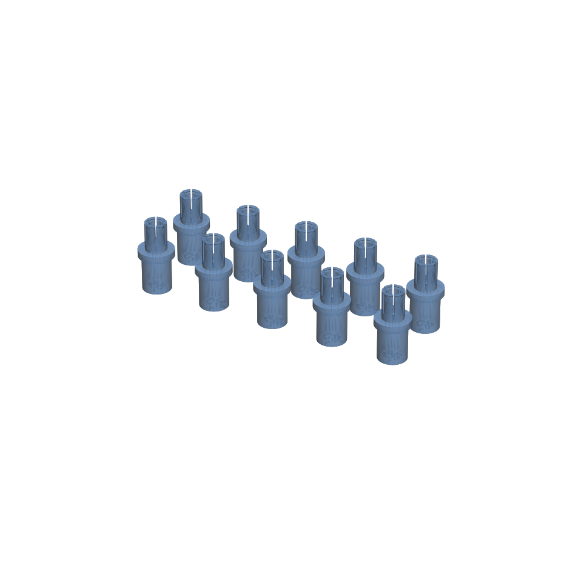 |  |
| Test array (round-1.5, smaller slits) |  |  |
| Deck plate | 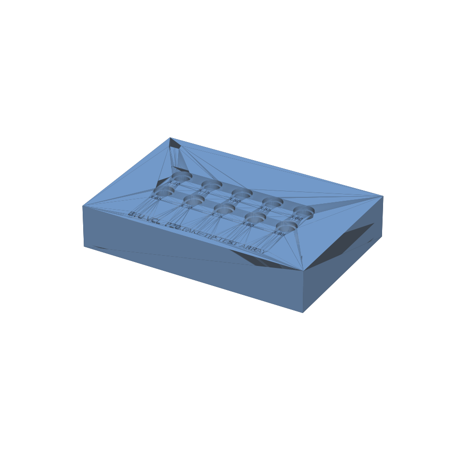 | 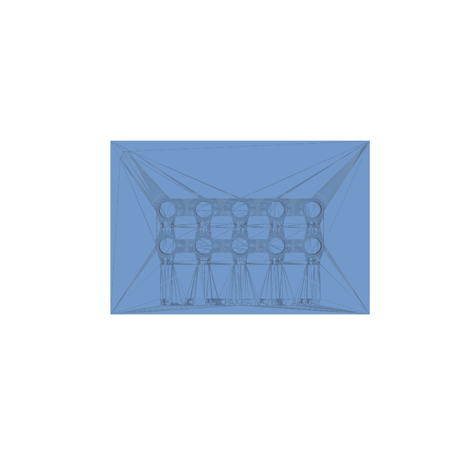 |
| Insert | 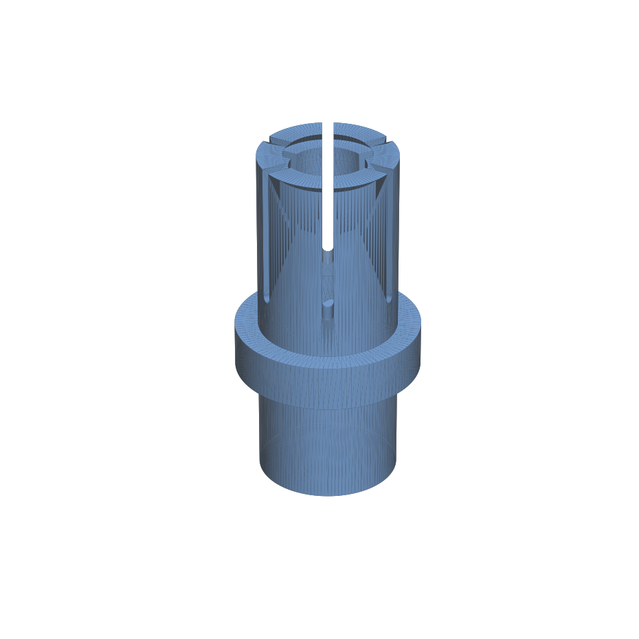 | 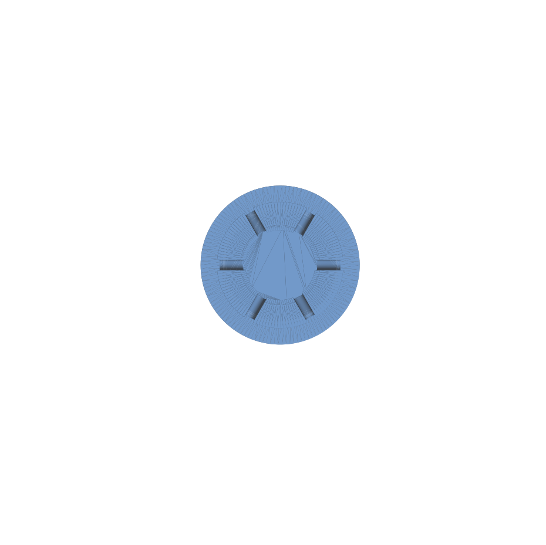 |
| Mock package | 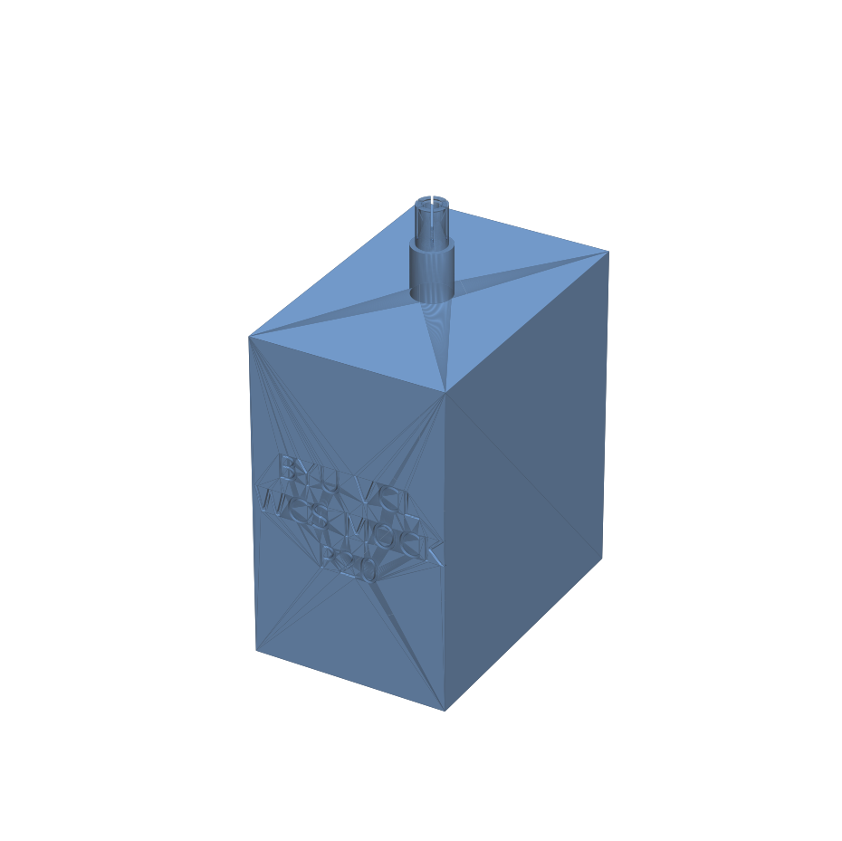 | 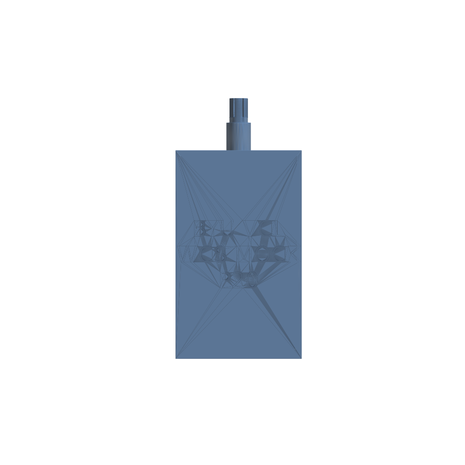 |
| Real package + P20 tip | 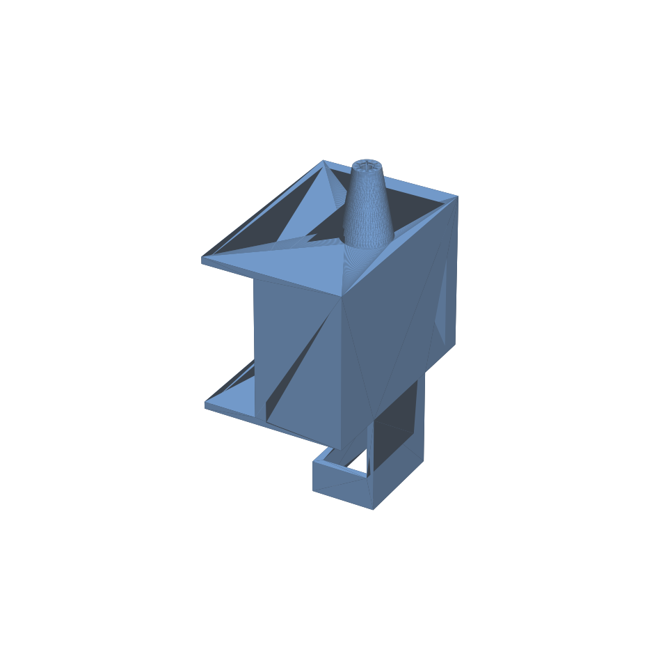 |  |
| Actual enclosure, tip swapped | 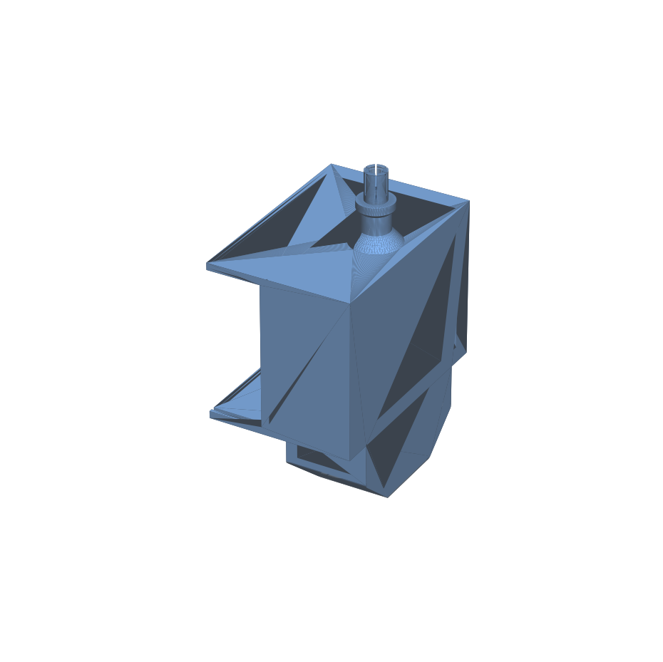 | 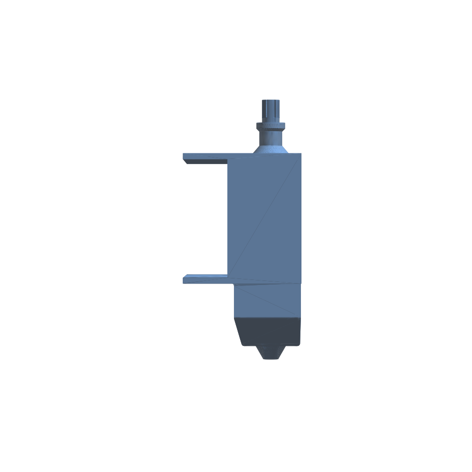 |

## Printing (Bambu Lab A1 mini, 180 × 180 × 180 mm)

All parts fit the A1 mini bed (the deck plate is 127.8 × 85.5 mm).

- **Material:** PETG, black (per design doc; PLA acceptable for the round-1 array).
- **Test array & insert:** as oriented (sockets up), 0.12–0.16 mm layers,
  100 % infill, no supports, enable hole/X-Y contour compensation in Bambu
  Studio. Print the whole array in one batch so all bores share identical
  printer error.
- **Deck plate:** as oriented, 0.20 mm layers, 15 % infill, no supports
  (the hollow underside prints as bridges over the 3 mm shell; enable
  "bridge" defaults).
- **Mock package:** as oriented, 0.20 mm layers, **~8 % gyroid infill** so
  the printed mass lands near the real sensor package (~40–50 g) — solid
  PETG would be ~200 g and over-test retention.

## OT-2 testing

`protocol_test_array.py` is a self-contained OT-2 protocol (API 2.12, same
upload path as the working scripts in
[PR #116 comment](https://github.com/vertical-cloud-lab/byu-vcl/pull/116#issuecomment-4665074566)):

1. Put the deck plate in **slot 8**, engraved `A1` marker at the **back-left**.
2. Drop the 10 test tips into their pockets (sizes engraved next to each pocket).
3. Run the protocol: for each pocket it picks the tip up, lifts, pauses for a
   retention check, then ejects it **low in the pocket** (release ~2 mm above
   the seated position, not above the rim) so the pocket walls guide the tip
   back into its hole, and pauses for a drop-off check. Record pass/fail per
   the evaluation criteria in the design doc.

The mock sensor package needs no new script — it is a drop-in replacement for
the real sensor in the existing PR #116 pick-and-place protocols. So is
`real_sensor_package_p20` (the actual enclosure with a P20 tip).

### Uploading without the Opentrons app (`run_robot.py`)

`run_robot.py` pushes a protocol to the OT-2 over HTTP and starts the run — the
same upload path @timothy-commins used, but with the robot address and protocol
path factored out so nothing secret is committed:

1. Copy `my_secrets.example.py` to `my_secrets.py` and set `ROBOT_IP` (from the
   Opentrons app under *Robot Settings → Networking*). `my_secrets.py` is
   git-ignored.
2. `python run_robot.py` uploads `protocol_cyclic_loading.py` by default, or
   pass a path: `python run_robot.py protocol_fake_tip_test.py`.
3. Type `cancel` + Enter at any time to stop the robot.

### Cyclic (fatigue) loading of the survivors (`protocol_cyclic_loading.py`)

Once the single-pass sweep identifies which bores grip, this protocol repeats
pick-up → transport → drop **many times** (default 1000 cycles/tip) on just the
surviving wells to measure insert/remove cycle life. Edit `CYCLE_WELLS` and
`NUM_CYCLES` at the top of the file to match what your print passed, then upload
with `run_robot.py`. It prints progress every `COMMENT_EVERY` cycles and pauses
for a wear inspection every `PAUSE_EVERY` cycles (the run log records the cycle
number, so any failure is timestamped). At ~6 s/cycle, 1000 cycles/tip is
~1.7 h, so budget run time before raising `NUM_CYCLES` into the thousands.
Each cycle ejects the tip **low in its pocket** (`DROP_RELEASE_Z` ≈ 2 mm above
the seated position) so the walls catch it and it lands back in the hole — this
is what makes unattended cycling possible (no human repositioning missed tips
between cycles, per the [PR #60 drop-off videos](https://youtu.be/qi_fUC_InB8)).

Round-1 results (@timothy-commins,
[comment](https://github.com/vertical-cloud-lab/byu-vcl/pull/60#issuecomment-4792616426)):
**solid** bores 3.40–3.50 mm and **slitted** 3.40 mm held; those are the
defaults in `CYCLE_WELLS`.

### Recommendations

- **Material: PETG, single material (no TPU).** PETG's higher elongation-at-yield
  vs PLA is what lets the socket flex without micro-cracking over many cycles,
  and the FEA endurance limit assumes PETG. A TPU insert would grip better but
  needs a dual-nozzle printer (e.g. H2D); keeping the part pure PETG keeps it
  printable on the A1 mini / Thumbelina single-extruder fleet. Reprint the
  survivors in **PETG** before the cyclic test — round 1 appears to have been PLA.
- **Run both designs through the cyclic test.** Solid bores grip on diameter
  alone and over-stress with no compliance, so they whiten/loosen fastest;
  slitted bores spread the strain across six spring fingers and should last
  far longer, which is exactly what the cyclic test will quantify. Carry the
  slitted **3.40 mm** and the solid **3.40–3.50 mm** survivors forward.
- **Re-center round 2 on the FEA winner.** With the nozzle tip OD now measured
  ([2.83 mm](https://github.com/vertical-cloud-lab/byu-vcl/pull/60#issuecomment-4837845180))
  and the engagement OD anchored on round 1 (≈ 3.42 mm), the re-run fit study
  recommends a **3.40 mm** bore — matching the round-1 slitted result exactly,
  and confirming the real nozzle/printed-bore is much smaller than the original
  3.70 mm assumption. Every bore tighter than 3.40 mm grips too hard to eject, so
  center round 2 just **above 3.40 mm (3.38–3.44 mm in 0.02 mm steps)**. A
  caliper reading of the nozzle OD a few mm **up from the tip** (where the socket
  actually seats) would pin the engagement OD directly and tighten this further.

### What to send back after printing/testing

The single most useful thing to report is, **per bore size, three pass/fail
flags plus a note** — that is exactly what the protocol pauses for:

1. **Picks up?** does the nozzle seat and lift the tip out of its pocket.
2. **Holds inverted / through a move?** does it stay on during transit (this is
   the retention check the FEA models against package weight).
3. **Ejects cleanly?** does `drop_tip` release it without dragging.
4. **Wear note** after ~10 insert/remove cycles (any whitening, cracks at the
   slit roots, or loosening).

A filled-in copy of the table below (just `Y`/`N` per column) pins down the
real nozzle OD and lets us pick the round-2 ±0.02 mm sweep. If you have
**calipers**, a measurement of an actual P20 nozzle OD and of one printed bore
(to get the printer's hole-compensation error) would let us skip a round.
Photos of any cracked slit roots are also directly actionable for the FEA.

| bore (mm) | picks up | holds move | ejects | wear after 10× |
|---|---|---|---|---|
| 3.40 … 3.85 | | | | |

### As-built socket taper — measured finding (PR #60 tip swap)

While verifying `real_enclosure_p20_tip`, sectioning the exported solids showed
that the socket's tapered bore is **inverted relative to the design intent** in
every tapered part generated by `_cut_socket_features` — including the
already-printed-and-tested `fake_tip_test_array_slit`: the narrowest ring
(Ø ≈ 3.18 mm for the "3.40" tip) sits ~0.5 mm below the mouth, and the bore
*widens* with depth (to Ø 3.65 mm at the bottom for the "3.40" tip), instead of
narrowing nozzle-style. In practice this makes each slitted tip grip on a single
mouth ring rather than along the taper.

**This as-built geometry is what won round 1** (the "3.40" tip gripped, "3.45"
— mouth ring Ø ≈ 3.23 — slid off), so `real_enclosure_p20_tip` deliberately
replicates the tested profile exactly rather than "fixing" it: the validated
part is the ring-grip one, and a corrected (mouth-widest) 3.40 mm taper would
have its narrowest point at Ø 3.40 at the bottom, which round 1 suggests would
slide off. Two consequences worth carrying forward:

- The nozzle **engagement OD at the seat is bracketed at ≈ 3.18–3.23 mm**
  (ring Ø 3.18 gripped, Ø 3.23 slipped) — tighter than the earlier 3.42 mm
  estimate, which assumed distributed taper contact.
- A future round could compare the as-built ring-grip profile against a
  corrected nozzle-matched taper centered on a ≈ 3.20 mm mouth; until then,
  keep printing the as-tested geometry.

### Why the current 7.5 mm adapter can't eject (Opentrons mechanics)

Per the [Opentrons GEN2 pipette white paper](https://opentrons-landing-img.s3.amazonaws.com/pipettes/Opentrons-Master-Pipette-White-Paper.pdf)
and support docs, GEN2 tips seat on the **nozzle proper** (P20: ~3.6–3.8 mm OD)
and the **ejector sleeve** surrounding the nozzle pushes the tip collar off.
A 7.5 mm bore grips the sleeve itself, so the ejector has nothing to push
against — matching the observed "picks up fine, won't eject" failure
([PR #116](https://github.com/vertical-cloud-lab/byu-vcl/pull/116)). The test
array's 3.40–3.85 mm bores engage the nozzle below the sleeve, and the Ø6 mm
socket rim gives the sleeve a proper shoulder to push on. This is also why
`real_sensor_package_p20` replaces the real enclosure's off-centre Ø7.5 mm bore
with a concentric P20 socket.

Two Opentrons details encoded in the labware/protocol:

- During `pick_up_tip` the nozzle presses ~`tipLength + 4.5 mm` below the
  well top, so the plate is 24 mm tall (tip seat at z = 11.8 mm) to keep the
  press above the deck (verified with `opentrons.simulate`).
- `tipOverlap: 8.0` mirrors the stock 20 µL tip overlap (8.25 mm) so motion
  planning assumes a realistic nozzle engagement depth.

## Spring-finger FEA fit study (CalculiX) — which bore is best

`fea_spring_finger.py` meshes one spring finger (annular 60° sector — matching
the as-built **6-finger** socket, Ø6 mm socket OD, 6 mm long) with gmsh and runs
a CalculiX static analysis: base fixed, the tip band pushed radially outward by
the interference and the radial reaction force read back as the inward **grip**.

`fea_fit_study.py` then runs that solve on **every bore in the array**, against
the **empirically anchored engagement OD** (see note below), and folds in the
**real package weight** and ejectability:

- *Deflection* per bore = (nozzle OD − bore ID)/2 (interference per side).
- *Durability* = peak von Mises vs PETG yield (50 MPa) and a released-cycle
  (R=0) endurance limit (~25 MPa); below the limit the finger lasts
  effectively unlimited cycles.
- *Retention* = friction grip `μ·F_grip` (μ≈0.30) vs the pull-off the loaded
  package needs while the OT-2 moves it, with safety factor 3. The package mass
  is built up from a documented **bill of materials** (`PACKAGE_BOM_G` in
  `fea_fit_study.py`: Pico W, AS7341 sensor, LiPo SHIM, 500 mAh battery, Qi
  receiver, cabling/screws, and the ~23 cm³ PETG enclosure) → **≈ 50 g**, the
  conservative top of the repo's own ~40–50 g estimate (the mock package's ~8 %
  infill is tuned to mass-match the real one). That gives ≈ **2.2 N required**.
- *Ejectability* = grip below what the P20 ejector can overcome (~20 N).
- *Repeated FEA* = a 3-cycle load→release→load run on the winner confirms the
  stress repeats on insertion and returns to ~0 on release (elastic shakedown,
  no ratcheting).

**Nozzle OD — measured.** Tim measured the P20 nozzle OD with calipers at the
**bottom face** of the pipette (where a fake tip first meets the nozzle):
[**2.83 mm**](https://github.com/vertical-cloud-lab/byu-vcl/pull/60#issuecomment-4837845180).
The nozzle is tapered, and the OT-2 drives the fake tip *up* the cone to a fixed
depth, so the socket grips higher up where the OD is larger than the 2.83 mm
tip — not at the tip itself. Round-1 brackets that **engagement OD**: the
slitted socket gripped only at bore ID 3.40 mm (3.45 mm+ slid off), so the
effective OD where the slitted socket seats is just above 3.40 mm. The study is
therefore anchored on an engagement OD of **3.42 mm** (and swept over the
actually-printed `fake_tip_test_array_slit_small` bores, 2.95–3.40 mm) rather
than the old Ø3.70 mm guess.

Results (`fea/fit_study_results.json`, plot `renders/fea_fit_study.png`):

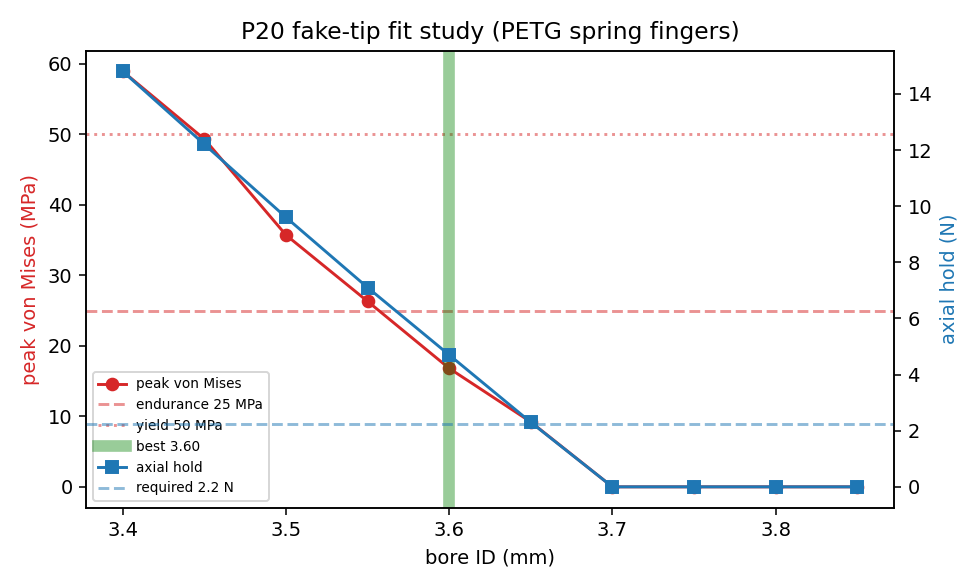

| bore ID | interf. | defl. | peak vM | grip | axial hold | holds? | ejects? | est. cycles |
|---|---|---|---|---|---|---|---|---|
| **3.40** | **+0.02** | **0.010** | **4.3** | **7.8** | **2.3** | **Y** | **Y** | **∞** |
| 3.35 | +0.07 | 0.035 | 14.0 | 27.6 | 8.3 | Y | **no** | ∞ |
| 3.30 | +0.12 | 0.060 | 24.5 | 48.2 | 14.4 | Y | **no** | ∞ |
| 3.25 | +0.17 | 0.085 | 34.9 | 70.8 | 21.2 | Y | **no** | 4e4 |
| 3.20 | +0.22 | 0.110 | 47.6 | 93.5 | 28.1 | Y | **no** | 2e3 |
| 3.15 | +0.27 | 0.135 | 59.1 | 115.6 | 34.7 | Y | **no** | 1e3 |
| 3.10 | +0.32 | 0.160 | 78.4 | 137.4 | 41.2 | Y | **no** | 1e3 |
| 3.05 | +0.37 | 0.185 | 87.4 | 162.7 | 48.8 | Y | **no** | 1e3 |
| 3.00 | +0.42 | 0.210 | 87.1 | 186.2 | 55.9 | Y | **no** | 1e3 |
| 2.95 | +0.47 | 0.235 | 107.5 | 210.4 | 63.1 | Y | **no** | 1e3 |

**Recommended bore ID ≈ 3.40 mm** — which matches the round-1 slitted result
exactly (3.40 mm was the only slitted tip that gripped). At the 3.42 mm
engagement OD it is the *largest* (loosest) bore in the small array and the only
one that both holds (2.3 N ≈ the required 2.2 N) and stays under the 20 N eject
cap. That 2.3 N grip retains up to **~52 g** at SF 3 — only a thin margin over
the ~50 g BOM, but round-1 testing independently confirms this bore held the
real loaded package, so the conservative μ/SF assumptions are not over-stating
the requirement. (If the assembled unit is heavier than ~52 g, the binding
constraint flips back to *hold*, favouring a slightly tighter bore — worth a
quick check on the connected scale.) Every tighter bore (≤ 3.35 mm) grips far harder — 27–210 N — so it would
hold strongly but **resist ejection** and, below ~3.25 mm, exceed the PETG
endurance limit. In other words, for the slitted socket the binding constraint
is **ejection, not hold**: stepping the bore down toward the 2.83 mm nozzle tip
buys grip the design doesn't need and loses the ejectability it does. The
smaller array's real value is to empirically map where grip crosses the eject
threshold — the FEA puts that crossing right at the top of the sweep, so the
round-2 sweep should center just **above 3.40 mm (3.38–3.44 mm in 0.02 mm
steps)** to find the loosest reliable grip.

> The model is anchored on the measured **2.83 mm nozzle-tip OD** plus the
> round-1 grip onset (engagement OD ≈ 3.42 mm); both are set at the top of
> `fea_fit_study.py`. The largest remaining unknown is the nozzle **taper**
> (how fast OD grows above the tip) and the seating depth — a caliper reading of
> the nozzle OD a few mm up from the tip would pin the engagement OD directly
> and let the sweep tighten further.

```bash
sudo apt-get install calculix-ccx && pip install gmsh
python fea_spring_finger.py   # single conservative case (3.55 mm, 0.10 mm)
python fea_fit_study.py       # full sweep + retention + repeated-cycle + plot
```

## Regenerating

```bash
pip install build123d trimesh matplotlib shapely networkx opentrons
python cad_model.py        # exports stl/ + step/ (incl. real_sensor_package_p20)
python render_views.py     # renders renders/*.png
python fea_fit_study.py    # FEA sweep -> fea/fit_study_results.json + plot
python -m opentrons.simulate protocol_test_array.py   # sanity-check protocol
```

Edit the `Params` dataclass in `cad_model.py` to iterate (e.g. set
`bore_ids` to the round-2 ±0.02 mm sweep once a round-1 winner is found).
`real_sensor_package_p20` is built from scratch in `cad_model.py`;
`reference/sensor_package_main_enclosure_7p5mm.step` is only read by
`verify_real_package_volume()` to confirm the volume match, so it is optional
for generating the part but keep it for the validation check.
