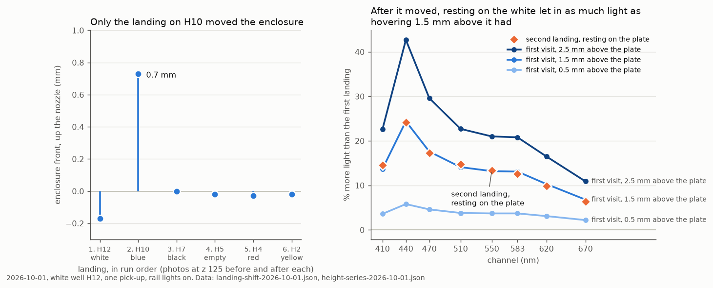
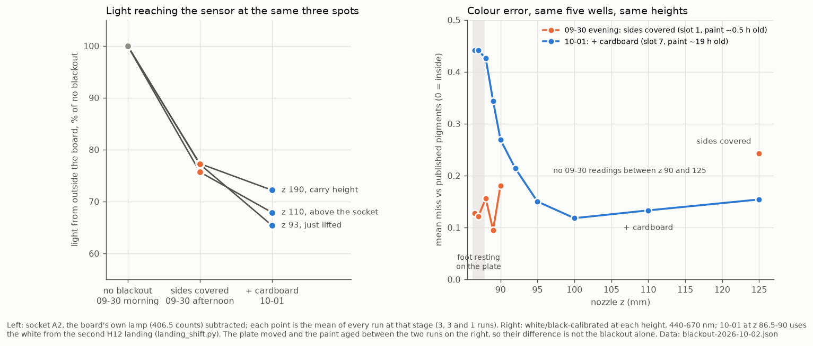
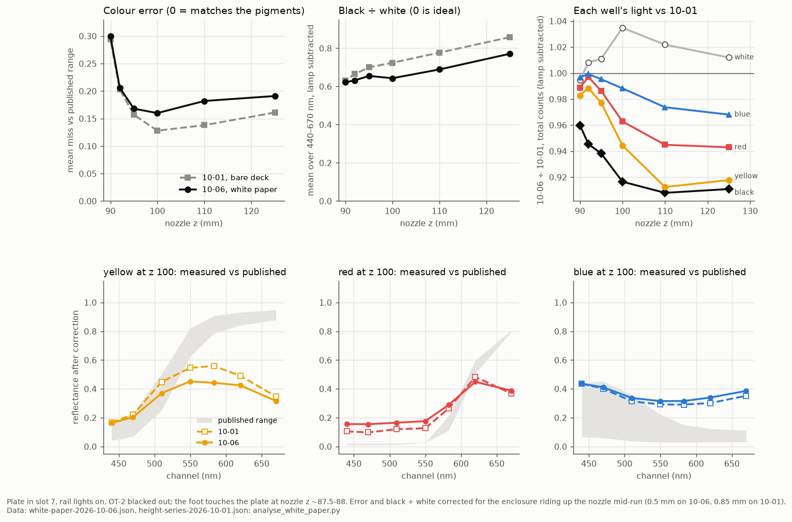

# OT-2 colour X-scan: pick up from slot 10, read three X positions over the scan slot

The test @timothy-commins asked for in
[issue #33](https://github.com/vertical-cloud-lab/byu-vcl/issues/33):

> make the color sensor pick up the enclosure from well 10, and then place it
> into 3 different places in the x direction on well 8. the test will then
> test the color at each of the 3 places in well 8

```
seated baseline read
  -> pick up the enclosure from slot 10        (proven descent/entry/press recipe)
  -> grip check                                (the sensor's own counts confirm the lift)
  -> carry to slot 8, x = centre - 30 mm       descend to the read height, read 3x
  -> carry to slot 8, x = centre               descend to the read height, read 3x
  -> carry to slot 8, x = centre + 30 mm       descend to the read height, read 3x
  -> carry back to slot 10, reseat, home
  -> reseat-confirm read
```

Every reading goes to `digital-wetlab.sensor-data` in MongoDB and to a local
JSON file.

## Standing settings for the colour read (as of 2026-10-06)

Asked on [PR #202](https://github.com/vertical-cloud-lab/byu-vcl/pull/202) to remember
the read height. Use these unless a later entry below changes them:

| | value | from |
| --- | --- | --- |
| **read height** | **nozzle z 86.5**: the enclosure's foot pressed ~1 mm onto the plate | picked by @timothy-commins on 2026-09-30 over A1 |
| first touch of the plate | z ≈ 87.9 at A1 and ≈ 88.4 at the centre (plate in slot 1); **z ≈ 87.5 on the H row with the plate in slot 7** | 09-30, 10-01 |
| candidate | **z 100** (foot ~12 mm up) scored best of ten heights on 10-01, and again on fresh paint over white paper on 10-06 (miss 0.16 against 0.49 resting). Resting on the plate scored worst both times. Recommended; not switched until @timothy-commins says so | [`results-height-series-2026-10-01.md`](results-height-series-2026-10-01.md), [`results-white-paper-2026-10-06.md`](results-white-paper-2026-10-06.md) |
| pressing | a landing can push the enclosure up the nozzle, invisibly: one 10-01 landing that pressed ~2.5 mm past first touch moved it ~0.7 mm, and the same well then read 12% brighter; on 10-06 a press of ~1 mm past touch at H12 moved it 0.5 mm. In contact, re-read the first well at the end of a run. Over white paper the light no longer shows the touch: find it with the camera ([`analyse_white_paper.py`](analyse_white_paper.py)) | [`landing_shift.py`](landing_shift.py), 10-02, 10-06 |
| plate | **slot 7** since 10-01 (moved by hand from slot 1): `--plate-slot 7`; H row at y 192.24, H1 x 14.38, 9 mm pitch. **On a sheet of white paper since 10-06**; that day only H12 rested on the plate by z 87, so check it lies flat | 10-06 |
| paint | yellow H2, red H4, blue H10 (200 µL from the vials), black H7 and white H12 undiluted, refilled 10-06. **The open vials lost ~1 cm in six days:** draw at tip-end z 28, not 38. Tips used through A3 (C2–H2 were already gone): next fresh tip B3 | [`paint_transfer.py`](paint_transfer.py), 10-06 |
| enclosure | right-hand socket A2, (92.8, 316.5), label to the front; carried via z 190, 3 mm/s aboard | |
| sensor | gain **256x** (the chip default; the firmware's 128x is ignored), 2 × 558.8 ms per reading; not settable without [`../pico/`](../pico/) | 10-01 |
| light | rail lights on; the OT-2 blacked out: sides since 09-30 midday, cardboard and wood over the rest since 10-01. No measurable room light on 10-01; re-read the white and black after any change to the cover | [`results-blackout-2026-10-02.md`](results-blackout-2026-10-02.md) |

```
enclosure_height_cal.py --socket-x 92.8 --socket-y 316.5 --press-z 89.0 --carry-z 125 \
    --carry-segment 400 --drop-dx 0 --max-speed 3 --no-live --floor 86 --clear-z 90 \
    --plate-slot 7 --target-x <well x> --target-y 192.24
```

## Run it

The script has to run on **the machine with the USB-Ethernet cable to the
OT-2**. The robot answers only on the link-local address
`169.254.51.252:31950`, and the same machine needs internet for HiveMQ and
MongoDB — so it must be one host, not two.

As of 2026-09-09 that machine is the Pi behind **`RPI_STREAM_CAM_HOSTNAME`**,
not the one behind `OT2_STREAM_CAM_HOSTNAME`. The adapter is a Realtek RTL8153
on `eth1` holding `169.254.210.205/16`. The `OT2_STREAM_CAM_HOSTNAME` Pi has no
ethernet interface and no USB devices at all, so `169.254.51.252` times out from
there — which is what "the OT-2 is not answering" looked like in the previous
session. Check with `ip -4 -br addr` before concluding the robot is down.

**`carrier` is not evidence.** On 2026-09-10 the adapter's USB interrupt
endpoint died with `Stop submitting intr, status -71` and the robot went
unreachable for eight hours while `eth1` still read `carrier=1`, `operstate=up`
and held its `169.254.210.205/16` address. `ethtool` was no better — after the
fault its register reads are garbage. **Judge this link by a ping to the robot
and nothing else.** `ot2_link_recover.sh` does exactly that, and repairs it:

```bash
./ot2_link_recover.sh --check      # touches nothing, no root
sudo ./ot2_link_recover.sh         # check, then repair if the robot is silent
```

Do **not** reach for `ip link set eth1 down/up`. It triggers a USB port reset
the wedged adapter cannot complete, after which the driver reads chip version
`0x0000`, refuses to bind, falls back to USB configuration 2 and `eth1`
disappears entirely. See the header of `ot2_link_recover.sh` for the three
stages that do work.

Stage 2 needs `uhubctl`, installed on the `RPI_STREAM_CAM_HOSTNAME` Pi on
2026-09-11 (`sudo apt-get install -y uhubctl`, binary at `/usr/sbin/uhubctl`).
It is the only package this adds to that host.

The root cause looks like USB 3 link power management: the boot log carries
`usb 4-1: enable of device-initiated U2 failed.`, and `-EPROTO` on an RTL8153 at
SuperSpeed is a well-worn symptom. Stage 0 of the script sets the `NO_LPM`
usbcore quirk, which is **runtime-only** — `/sys/module/usbcore/parameters/quirks`
resets on reboot. To make it permanent, append to `/boot/firmware/cmdline.txt`
(one line, space-separated, and a typo there stops the Pi booting):

```
usbcore.quirks=0bda:8153:k
```

The durable fix is physical, and costs nothing: **move the adapter to one of the
Pi's USB 2.0 ports**. 480 Mbps is about 48x what this link ever carries, and it
sidesteps the SuperSpeed signalling entirely.

**2026-09-23 — stop treating that move as optional.** The adapter was re-plugged
into the same SuperSpeed port (`/sys/bus/usb/devices/2-1`, `speed=5000`) at
12:50:47 and wedged at 12:53:36. Across one session the interval between a
successful repair and the next `-71` collapsed **2m42s → 90s → 18s**, and the
`NO_LPM` quirk was set for the middle two — it does not prevent the fault, so
stage 0 is worth keeping but is not a fix. Stage 1 stopped working entirely
(`r8152 failed probe after 3 tries; giving up`); only the stage 2 power cycle
still recovers it, and a **15 s** off period worked where the script's default
6 s did not. A link that survives 18 seconds cannot carry an X-scan, so the
adapter now has to move to a black USB 2.0 port before any further automated
run is attempted.

**2026-09-25 — retire the adapter; the Pi's own port is ready.** The Pi had been
off the tailnet since 2026-09-24 11:59 and was power-cycled at about 14:24. The
adapter was back in the same SuperSpeed port (`2-1`) for that cold boot and
never came up at all: `Failed to read 4 bytes at 0xe040/0x0133 (-71)`, then
`r8152 failed probe after 3 tries; giving up`, so no `eth1` and nothing for
`ot2_link_recover.sh` to repair. It was unplugged at 14:39:39. Rather than keep
nursing it, the Pi's built-in `eth0` now has a link-local profile of its own,
the twin of `ot2-usb`:

```bash
sudo nmcli connection add type ethernet con-name ot2-eth0 ifname eth0 \
  ipv4.method link-local ipv6.method ignore \
  connection.autoconnect yes connection.autoconnect-priority 10
```

It is inert until a cable is in `eth0`. The priority of 10 is what makes it win
over the stock `netplan-eth0` (DHCP, priority 0), which on a robot-only link
would never get an address. So the robot's cable goes straight into the Pi's
own RJ45 jack, with no adapter in between. If `eth0` is ever wanted on a real
network again, `sudo nmcli connection delete ot2-eth0` puts DHCP back. Why the
Pi went quiet on 2026-09-24 cannot be recovered: journald there is
`Storage=volatile`, so the power cycle wiped the previous boot's log.

**2026-09-25, 15:51 — the adapter can be put on USB 2.0 without touching it.**
After that power cycle the cable went back into the dongle, not `eth0`. The
dongle was on the other blue port (`4-1`) and wedged 8 minutes after boot.
Switching off only the SuperSpeed half of that port made it re-enumerate at
once on the port's USB 2.0 companion (`3-1`, 480 Mbit/s). That is exactly the
move to a black port asked for above, and it answered 2 787 pings in a row
afterwards:

```bash
echo 1 | sudo tee /sys/bus/usb/devices/4-0:1.0/usb4-port1/disable   # 2-0:1.0/usb2-port1 for the other blue port
```

It is runtime only. A reboot puts the port back to USB 3, and writing `0`
undoes it sooner. Check `lsusb -t` after a reboot: if the dongle is back at
`5000M`, run the line again before an automated run.

The venv is already set up on that Pi at `~/.venvs/xscan` (`paho-mqtt`,
`pymongo`, `requests`; the system Python 3.13 is externally managed, hence the
venv). To rebuild it elsewhere:

```bash
python3 -m venv ~/.venvs/xscan
~/.venvs/xscan/bin/pip install paho-mqtt pymongo requests

export MQTT_BROKER=... MQTT_PORT=8883 MQTT_USERNAME=... MQTT_PASSWORD=...
export PICO_ID=... MONGODB_URI=... MONGODB_DATABASE=digital-wetlab
```

Then, in order:

```bash
# 0. is the enclosure actually on the deck? One HTTP call, no motion.
~/.venvs/xscan/bin/python deck_photo.py -o deck.jpg

# 1. confirm the pickup coordinate. Homes, hovers the BARE nozzle 30 mm above
#    the computed pickup point, and stops. Slide the base under it.
~/.venvs/xscan/bin/python run_xscan_test.py --align

# 2. sensor + database only -- the robot never moves
~/.venvs/xscan/bin/python run_xscan_test.py --dry-run

# 3. the real test
~/.venvs/xscan/bin/python run_xscan_test.py
```

**Step 0 is not optional when nobody is standing at the robot.** The grip check
catches an empty pickup, but only after the nozzle has already descended and
pressed at slot 10. A photograph costs one HTTP call and answers the same
question before anything moves — on 2026-09-09 it found the deck completely
bare, with nothing in slot 10 or slot 8.

Run `--align` **every time the base is moved**. The slot-10 pickup coordinate
below is the proven slot-8 coordinate translated by the OT-2 slot pitch, not a
measured one — `--align` turns that assumption into a 30-second visual check
before anything presses down on the enclosure.

## Deck layout

| | |
|---|---|
| Enclosure base | slot **10**, socket at (36.55, 315.5) |
| Read positions | slot **8**, x = 166.38 / 196.38 / 226.38, all at y = 225.0, z = 120.0 |
| Pipette | `p300_single_gen2`, left mount |

The pickup offset within the slot is (36.55, 44.0) — the same offset the
[PR #60 sessions](../camera/) used for the base in slot 8, so slot 10 gives
(0, 271.5) + (36.55, 44.0). The read Y uses the same within-slot 44.0 mm, which
lands on y = 225.0 in slot 8 — the exact Y those camera-verified sessions ran at.

**Only X changes between the three reads.** The 2026-08-10 session measured
that raw counts are dominated by pose — the same sensor read ~15× higher lifted
than seated — so a scan that also varied Y or Z would be measuring the pose
rather than the sample. Y, Z, settle time and command values are identical at
all three positions.

At z = 120 the nozzle is 29.5 mm above its press depth, so the enclosure's
aperture sits about **29.5 mm above the deck**. If you put a plate or a
backlight in slot 8, raise or lower with `--read-z`; the aperture height is
always `read_z - 90.5`.

## Motion recipe

Unchanged from the recipe that completed **9 of 9** pick-and-reseat cycles in
July/August 2026 ([`../camera/pickup-test-2026-08-10-pick-and-reseat/`](../camera/pickup-test-2026-08-10-pick-and-reseat/)).
Only the start slot and the read positions are new.

| stage | value |
|---|---|
| Descent ladder | z 170 → 150 → 120 → 105 → 101 → 99 |
| Straight entry | z = 95 @ 5 mm/s |
| Press | z = 90.5 @ 5 mm/s (≥ 7 mm engagement, so eject works later) |
| Lift test | z = 110 + 4 s dwell |
| High lift | z 130 → 150 → 170 @ 15 mm/s |
| Carry | 8.5 mm segments @ 10 mm/s |
| Read | descend to z = 120 @ 10 mm/s, settle 1.5 s, read ×3 |
| Drop-off | pickup x − 4 mm (anti-tilt, `--drop-dx`), staged descent 130 → 110 → 108 → 101 → 95.5 |
| Eject | `dropTipInPlace`, clear to z = 128, home |

The staged climbs and segmented carries are not decoration: on 2026-07-31 the
module came off the nozzle during a single long Z move.

## Safety behaviour

**Grip check.** After the lift test the script takes two readings and compares
them with the seated baseline. Lifting the enclosure off its base uncovers the
aperture, which raised the counts ~15× in the 2026-08-10 session. If the counts
do not rise by at least 2× (`--grip-ratio`), the nozzle came up empty and the
script aborts before the carry rather than flying an empty nozzle to slot 8 and
then "reseating" it next to a still-seated enclosure. `--skip-grip-check`
disables it.

**Reseat on failure.** Any exception during the carry or the reads triggers the
reseat leg and a home before the script exits, so the enclosure is not left
hanging. If that also fails, the message points at
[`../cad/recover_reseat.py`](../cad/recover_reseat.py), which recovers a
stranded grip — but look inside the robot first.

**Preflight.** Before the robot is touched: the broker connection is proved by
publishing a probe to our own topic and waiting for the echo (a broker can grant
a subscription and then deliver nothing), the sensor is proved by taking the
seated baseline, and every coordinate is bounds-checked against its slot.

## Files

| file | what it is |
|---|---|
| `run_xscan_test.py` | the test |
| `sensor_read.py` | one MQTT connection held open for the run; `read()` returns the 8 channels |
| `deck.py` | OT-2 slot origins and slot/offset maths, with no `opentrons` dependency |
| `check_reachability.py` | pushes every planned coordinate through the Opentrons simulator |
| `stream_index.py` | every reading → its UTC instant → a timestamped livestream link |
| `frames_from_stream.py` | pulls one frame per measurement and OCR-verifies it against the clock burned into the stream |
| `plot_spectra.py` | 300 px spectra in the light-mixing `basic_plotting.py` style |
| `build_gallery.py` | stitches frame + spectrum + link into `measurement-gallery.md` |
| `stream_grab_pi.py` | the Pi-side half of the frame grab (lives there as `~/ytframes/grab.py`) |
| `blank_correction.py` | divides a sample run by a blank run per position, offset removed |
| `ot2_link_recover.sh` | checks the link by pinging the robot, and repairs a wedged USB-Ethernet adapter |
| `find_ot2.sh` | run on the *Ubuntu* machine holding the robot's cable: lists interfaces, asks avahi and sends the app's own mDNS query, finds the robot's current address, prints a verdict |
| `find_ot2.ps1` | the same thing for a Windows machine, plus which adapter Windows actually routes `169.254` traffic out of |
| `test_find_ot2/run.sh` | replays real Windows adapter lists against `find_ot2.ps1`, with a stand-in robot in a network namespace (needs `pwsh` and `sudo`) |
| `led_probe.py` | zero-motion check of whether the module's LEDs respond (they do not) |
| `analyse_person_effect.py` | whether somebody at the machine moves the readings; `--gate` screens a run for a background that shifted mid-position |
| `deck_photo.py` | one HTTP call to the OT-2's own overhead camera; turns the frame 180° upright, `--fix FILE` corrects a saved one |
| `robot_lights.py` | read or set the deck rail lights; one HTTP call, no motion |
| `analyse_rail_lights.py` | what the rail lights buy: precision, uniformity, colour self-consistency |
| `reseat_module.py` | recovery when a release fires and the module stays on the nozzle; `--check` moves nothing |
| `background_baseline.py` | seated background of the closed enclosure; says whether the offset has moved |
| `test_measurement_timestamps.py` | tries to break PR #201's timestamp work; `--live` adds MQTT + Atlas, never the robot |
| `plot_timestamp_lag.py` | how late the pre-fix MongoDB `timestamp` field was, per reading |
| `calibration_status.py` | read-only report of which OT-2 calibrations are present and which are missing |
| `enclosure_height_cal.py` | runs on the Pi, one step per command: align over a socket, press in photographed steps, carry, step down over the plate. Silence for 10 min sets the enclosure down. **Dropped the enclosure on its only carry**: see below. `jiggle` tests the grip inside the pocket, and `--simulate` runs it with no robot |
| `grip_shift.py` | from robot-camera photos: did the enclosure move with the nozzle, and by how much |
| `release_in_place.py` | lets go of the enclosure over its pocket from a stopped run (used once, 2026-09-29) |
| `tip_cal.py` | runs on the Pi, one step per command: hover the bare nozzle over a tip, Opentrons' own pick-up, step the tip into a plate well, aspirate/dispense, return the tip. Silence for 15 min puts the tip back and homes. `--simulate` runs it with no robot |
| `camera_model.py` | fits how each camera sees a 1 mm move in X/Y/Z; reads the nozzle's true height from its shoulder, which is how a jammed press shows up |
| `live_frame.py` | newest livestream frame (~3 s behind), fetched on the Pi |
| `livestream_replay.py` | frames from the stream's last ~15 minutes, by lab clock time |
| `livestream-pi/stream-watchdog.{sh,service,timer}` | copies of the livestream Pi's watchdog, which restarts a stalled or given-up stream |
| `livestream-pi/test-stream-watchdog.sh` | runs the watchdog against a throwaway unit (needs `sudo`; safe on the Pi) |

## Lining a reading up against the livestream

`python3 stream_index.py` writes `measurement-stream-index.{json,md}`: all 114
readings of the 2026-09-09 session with a UTC instant and a `?t=` link into the
archived stream. `frames_from_stream.py` then pulls the frame at each instant.

Two things to know before trusting a link:

* **The archive timeline is not wall clock.** For `bQDrYpT3vaE` it runs 67 s
  behind `release_timestamp` from the third hour onward — a step, not a drift.
  That is more than one scan position, so `--offset-shift` is not cosmetic.
* **The stream burns a `%Y-%m-%d_%H-%M-%S` clock (lab local, UTC−6) into every
  frame**, which is how the offset is verified rather than assumed. Every
  committed frame records its OCR'd clock in `frames/frames.json`.

YouTube refuses player extraction from a GitHub Actions runner; the fetching
half runs over SSH on the stream-cam Pi (`~/ytframes/grab.py` there).

## When the livestream restarts, and why the archive has gaps

The OT-2 livestream runs on a Pi Zero 2 W (`OT2_STREAM_CAM_HOSTNAME`), set up
in [#172](https://github.com/vertical-cloud-lab/byu-vcl/issues/172#issuecomment-5139754959)
from the Acceleration Consortium's
[picam README](https://github.com/AccelerationConsortium/ac-dev-lab/blob/87a3ccb/src/ac_training_lab/picam/README.md#L255-L303)
plus one local watchdog. As of 2026-09-25 it restarts the stream at three
levels:

| what restarts | when | details |
| --- | --- | --- |
| the whole Pi | 5 am, 1 pm, 9 pm lab time | root crontab `0 5,13,21 * * * /sbin/shutdown -r now`, from [ac-dev-lab#231](https://github.com/AccelerationConsortium/ac-dev-lab/issues/231#issuecomment-3091508574). Each boot ends the YouTube broadcast and starts a new one, hence the ~8 h videos; YouTube only [archives streams under 12 h](https://support.google.com/youtube/answer/6247592) |
| the stream program | 10 s after it exits | `device.service`, `Restart=always`. **At most 3 starts per hour, the boot's included** (`StartLimitBurst=3`, `StartLimitIntervalSec=3600`), the guard against a crash loop from [ac-dev-lab#72](https://github.com/AccelerationConsortium/ac-dev-lab/issues/72#issuecomment-2735038969) |
| the stream program | YouTube acknowledges no new bytes for 3 one-minute checks, or systemd has given up on it for 10 min | `stream-watchdog.timer` → `/usr/local/bin/stream-watchdog.sh`, at most 6 restarts a day. Local, not in the upstream README. Designed in [streamingLambda#2](https://github.com/vertical-cloud-lab/streamingLambda/pull/2#issuecomment-4898600779); copies of all three files are in [`livestream-pi/`](livestream-pi/) |

### When systemd gives up on the stream

`device.py` exits whenever its Lambda call fails, for instance while DNS is
down. Three such exits within an hour hit the start limit, and systemd marks
`device.service` failed. **Until 2026-09-25 the stream then stayed down until
the next scheduled reboot.** The watchdog skipped any unit that was not active.
That was deliberate: in streamingLambda#2 it was one of three limits stacked
against "hundreds of streams for very short amounts of time". It happened five
times in the ten days on record, about 20 h of missing footage in all:

| service gave up | next start |
| --- | --- |
| 09-16 12:35 | 13:00 reboot |
| 09-18 15:35 | 21:00 reboot |
| 09-19 23:04 | 05:00 reboot |
| 09-24 12:06 | 13:00 reboot |
| 09-24 13:28 | 21:00 reboot |

**Since 2026-09-25 the watchdog starts it again.** Once `device.service` has
been failed for 10 minutes, the watchdog tries a TCP connection to
`a.rtmp.youtube.com:1935`, where the stream goes. If that connects, it runs
`systemctl reset-failed` (which also clears the start limit) and
`systemctl start`, and counts that against the same 6-a-day budget as a stall
restart. If it doesn't connect, the watchdog logs
`… is unreachable - waiting for the network` and tries again a minute later
without spending budget. A service stopped by hand is `inactive`, not `failed`,
so it is left alone.

The daily ceiling on starts is unchanged, which is what keeps this from
producing the pile of repeat broadcasts seen upstream in
[ac-dev-lab#231](https://github.com/AccelerationConsortium/ac-dev-lab/issues/231#issuecomment-2898447847).
Every start follows either a boot or one of the watchdog's 6 daily restarts,
and the start limit caps each of those at 3 starts, itself included. That is
at most (3 reboots + 6) × 3 = 27 starts a day, plus 3 per power cut, the same
ceiling as before. Only a start whose Lambda call gets through creates a
broadcast, and while DNS is down none do.

**It would not have helped on 09-24.** The Pi's DNS was down from about 12:00
until the 9 pm reboot, apart from 20 minutes after the 1 pm reboot: `tailscaled`
logged about 150 failed lookups in every 10 minutes of it. DHCP renewals kept
succeeding every 30 minutes, so the Wi-Fi link itself stayed up; what failed
was reaching the campus DNS servers. The new check would have waited all
afternoon, as intended. The journal no longer goes back to 09-16–09-19, so
whether those three were short outages that this now covers can't be checked.

What changed on the Pi, and how to undo it:

- `/usr/local/bin/stream-watchdog.sh` was replaced by
  [`livestream-pi/stream-watchdog.sh`](livestream-pi/stream-watchdog.sh); the
  diff is [`5c6b417`](https://github.com/vertical-cloud-lab/byu-vcl/commit/5c6b417).
  The service and timer are unchanged.
- The old script is at `/var/backups/stream-watchdog.sh.2026-09-25`. To undo:
  `sudo install -m 755 /var/backups/stream-watchdog.sh.2026-09-25 /usr/local/bin/stream-watchdog.sh`.
  The timer runs whichever version is in place at its next check, so nothing
  needs restarting.
- `sudo ./test-stream-watchdog.sh`, in [`livestream-pi/`](livestream-pi/),
  runs the script against a throwaway unit with the same start limit, never
  `device.service`, so it is safe on the Pi. All 24 checks passed there and on
  a GitHub runner.

The powder-doser camera got the same watchdog in streamingLambda#2 and was not
changed.

### Power cuts

The Pi has no power switch. It runs while its micro-USB cable has power, and
boots and resumes streaming on its own about a minute after power returns. A
cut shows up in `journalctl -b -1` as a log that stops mid-task, with none of
the `Shutting down` … `Journal stopped` lines a reboot writes. Three are on
record:

| power lost | stream back | notes |
| --- | --- | --- |
| 09-23 ~12:34 | 13:15 | cron then rebooted it once more at 13:16 (below) |
| 09-25 ~13:10 | 14:58 | plugged into the lab computer's USB port. The 13:00 video, `9XQqOj42GLw`, is only 9 min long |
| 09-25 ~15:17 | 15:20 | likely the planned move off that USB port. New video `3rBdrVeUvlk` |

No boot on record logged an under-voltage warning, so the supply was adequate
while it was on. It should be on a wall adapter rated 5 V 2.5 A, the figure in
the [product brief](https://datasheets.raspberrypi.com/rpizero2/raspberry-pi-zero-2-w-product-brief.pdf),
not a computer's USB port.

**After a cut, early log timestamps are wrong.** The Pi has no real-time clock,
so for the ~45 s until network time arrives it runs on the last time it saved,
and `journalctl --list-boots` shows a boot starting before the previous one
ended. Each time the stream started a few seconds after the sync, so the
burned-in overlay was right from its first frame. But cron reads the clock jump
as time that passed: if the jump is under 3 hours and crosses 5 am, 1 pm or
9 pm, it runs that reboot at once. That was the extra 13:16 restart on 09-23.

## Options

```
--home-slot 10 --scan-slot 8      which slots to use
--base-dx / --base-dy             where the socket sits within the home slot
--drop-dx -4.0                    release column, as an X offset from the pickup column
--scan-dx -30,0,30                X offsets from the scan slot's centre (any number of them)
--scan-dy 44.0                    within-slot Y for the reads
--read-z 120 --carry-z 170        heights
--press-z 90.5                    pickup press depth; lower = deeper = tighter fit
--reads 3                         readings per position
--rgb 0,0,0                       R,Y,B sent with each read command
--align / --dry-run / --simulate  the three rehearsal modes
--no-mongo --out results.json     where the data goes
```

`--simulate` prints the whole motion plan with no robot and no sensor — useful
for checking a changed layout before taking it anywhere near hardware.

## The background (blank) measurement

A background — or blank — is **a reading of the empty well, taken at the same
pose, under the same light, immediately before the sample goes in.** It is not a
dark reading and it is not a calibration constant: it is the *same measurement
with the sample removed*, so that dividing the sample by it cancels everything
that is not the sample.

The sensor never measures colour. It measures how many photons land in each of
its eight bands, which is the product of four things:

```
counts(λ)  =  source(λ)  ×  path(λ)  ×  sample(λ)  ×  responsivity(λ)
```

Only `sample(λ)` is wanted. The blank contains the other three at that exact
spot, so `sample / blank` leaves the sample's own spectrum — the room light's
warm cast, the deck's colour, the enclosure's geometry and the AS7341's uneven
per-channel sensitivity all divide out. Without one, a raw count is a statement
about the room, not the liquid; every run before 2026-09-09 demonstrated that.

**One blank per well, not one per plate.** The blank has to be taken where the
sample will be, because this rig's background is strongly position-dependent.
An *empty* slot 7 at read z 128 already disagrees with itself between its three
stops — 620 nm is 23.1 % / 20.9 % / 28.6 % of the total with nothing on the deck
at all. Borrowing a neighbour's blank injects a **37–92 %** error, against a
largest-ever colour signal of about ±30 %.

**Subtract before dividing.** About 439 counts of every reading are a fixed
green glow inside the closed enclosure (`ch410` was exactly 6 on all 26 seated
reads across seven runs and eight hours). Because it is *additive*, it must be
removed from both numbers before the ratio:

```
             sample(λ) − offset(λ)
ratio(λ)  =  ─────────────────────
             blank(λ)  − offset(λ)
```

Dividing without subtracting drags ch510/ch550 toward 1.0 by up to 6 %, and at
read z 128 that offset is 36–47 % of ch510 — against 18 % at z 120, which is
another reason the lower read height is the better one.

**Dry blank or solvent blank.** Both are useful and they answer different
questions. A *dry* empty well is the background for everything that is not the
liquid. A well holding the same volume of plain water is the stricter blank: it
also cancels the meniscus, the refraction at the water surface and water's own
weak absorption, leaving pigment alone. Take the dry one first — it is free —
and the water one when comparing dilutions against each other.

**Freshness matters more than it looks.** The blank and the sample must be
minutes apart with nobody near the machine. The archived-stream frames showed a
person in shot during 11 of the 27 readings on 2026-09-09, including the whole
of the "empty-slot baseline at z 128" that the paint run was normalised
against — so that pair was never a valid blank/sample pair.

### Doing it with what is already here

No new flag is needed. Run the *same* command twice, changing only the well's
contents and the output file:

```bash
# 1. blank: the well is empty. Stand clear of the machine.
python3 run_xscan_test.py --scan-slot 7 --read-z 120 --out blank.json

# 2. add the sample, move nothing else, stand clear again.
python3 run_xscan_test.py --scan-slot 7 --read-z 120 --out sample.json

# 3. the ratio, with the additive offset removed and a per-position cross-check
python3 blank_correction.py --blank blank.json --sample sample.json --cross-check
```

Positions are matched by the labels `run_xscan_test.py` writes (`pos1-dx-30` and
so on), so both runs must use the same `--scan-dx`.

**What a blank does not fix.** It cancels a *stable* background, so it cannot
rescue a background that changed between the two reads — someone leaning over
the deck, a light switched, the module reseated at a slightly different depth.
It also cannot create signal that was never there: under warm ambient light a
blue vial reflects in a band that barely exists, and blue's spectral signature
is a −0.954 match for the sensor's own two-cycle readout artefact. A blank is
necessary for this measurement to mean anything; it is not sufficient on its
own, and a controlled light source still is the larger fix.

## What has been verified, and what has not

Verified on 2026-09-04 from CI:

- `sensor_read.py` against the live board — 8 channels back in 1.5 s.
- `--dry-run` end to end — baseline reads, MongoDB write into
  `digital-wetlab.sensor-data`, JSON output.
- `check_reachability.py` — all 28 planned coordinates in bounds for a
  left-mount P300; `deck.py`'s slot origins match the packaged Opentrons deck
  definition. Negative controls confirm the checker has teeth: `--scan-dx
  -100,0,100` is rejected as off-slot and `--read-z 250` is rejected as above
  the 218 mm Z limit.
- `--simulate` — 72 moves planned, segmentation and staging as intended.

Not verified on 2026-09-04: **the motion itself.** The OT-2 did not answer on
`169.254.51.252`, which was read at the time as a disconnected USB-Ethernet
adapter.

### 2026-09-09 — the robot answers; the deck is empty

That reading was half right. The adapter was never missing, it is on the *other*
Pi (see [Run it](#run-it)). From `RPI_STREAM_CAM_HOSTNAME` the robot answers
immediately:

```
GET /health -> 200  {"name": "OT2CEP20210722R13", "robot_model": "OT-2 Standard",
                     "api_version": "8.8.1", "system_version": "v1.19.6"}
GET /instruments    -> p300_single_gen2, left mount, ok=true
GET /calibration/status -> deckCalibration OK (2026-01-27)
```

Also verified this session, from the Pi that would drive the run:

- Sensor over MQTT — 8 channels, total 770 ± 1 across five reads, ~1.4 s each.
- `--dry-run` — broker delivery PASS, baseline reads, 2 documents written to
  `digital-wetlab.sensor-data`, JSON out.
- `--simulate` — 72 moves.
- `check_reachability.py` — 28/28 coordinates in bounds, slot origins match the
  packaged deck definition.
- **The maintenance-run command path, on the real robot.** Create run →
  `loadPipette` → `home` → `savePosition` → delete, all succeeded: pipette
  loaded in 2.4 s, home in 12.5 s, nozzle parked at (384.05, 349.93, 199.60).
  This is the path every move in the test goes through, and it had never been
  exercised before. Home was safe to run precisely because the deck was
  photographed empty first.

**The motion still did not run, for a different reason: the deck is bare.**
`deck_photo.py` shows all eleven slots empty — no enclosure, no base in slot 10,
nothing in slot 8. Running the test in that state would have descended on an
empty slot, come up with nothing, and aborted at the grip check without
measuring anything.

So the remaining blocker is now purely physical: stand the enclosure on its base
in slot 10, then run step 0, `--align`, and the test.

### 2026-09-09 — slot 7 at two heights; the LEDs were off the whole time

Two more complete cycles, both with slot 7 empty: the run asked for on #197
(`--scan-slot 7 --read-z 125`) and a control at the previous height
(`--scan-slot 7 --read-z 120`). The control exists because the requested run
changes both the slot and the height at once, so alone it cannot attribute the
difference to either. Grip check 5.1× and 5.3×; reseat confirmed on both.

Full write-up and data: [`results-slot7-2026-09-09.md`](results-slot7-2026-09-09.md).

Two things came out of it that change how the test should be run:

- **`--rgb` defaults to `0,0,0`, so every scan measures ambient light only.**
  The module's own illumination is never switched on. *Superseded in part later
  the same day:* `--rgb` turns out to be **inert** — the board acknowledges every
  level and colour but nothing lights (`led-probe-2026-09-09.json`), so "set
  `--rgb`" is not an available fix. Controlled illumination needs a working light
  source in the enclosure. This still reframes the "46% swing" finding: it is a
  symptom of reading with no illumination, not an inherent property of the deck.
- **Raising the aperture makes everything worse.** 5 mm higher cost 9–42% of the
  signal and made read-to-read repeatability 30–300× worse (0.03–0.07% at
  z 120 against 1–11% at z 125), and reversed the sign of the positional
  gradient. Slot 7 at z 120 gives ~7000 counts, a −5.5% gradient over 60 mm and
  reads that agree to within 2–5 counts; it beats both slot 8 and the raised
  pose on every measure. Default to it.

### 2026-09-09 — read z 129 with a 0.5 mm deeper press

Requested on #197 after the module worked loose and came off its base at the end
of the previous session: read 1 mm higher, press 0.5 mm deeper for a tighter fit.
`--press-z` was added for it, and it shifts the release height by the same delta
so the module is set down from the height the proven recipe used rather than
dropped from 0.5 mm up.

    run_xscan_test.py --scan-slot 7 --read-z 129 --press-z 90.0

Cycle completed, grip 4.6×, reseat confirmed at 436 against a seated 445. Full
write-up: [`results-z129-press90-2026-09-09.md`](results-z129-press90-2026-09-09.md).

Three things worth carrying forward:

- **A deeper press also raises the read height.** Seating the nozzle further into
  the socket makes the module ride higher on it, so `--read-z 129 --press-z 90.0`
  puts the aperture 39.0 mm off the deck — 1.5 mm above the previous run, not the
  1.0 mm the `--read-z` number alone suggests. `aperture_height_mm` in the run
  JSON is the number to compare across runs, not `--read-z`.
- **One clean cycle does not validate a grip fix.** The previous session's
  three-position cycle also completed cleanly; the module was lost during the
  longer second cycle that followed. And the grip *ratio* is a light reading at
  the lift height, not a measure of fit — a deeper press moves the aperture, so
  the ratio shifts for reasons unrelated to how tightly the module is held.
- **Bare deck is not spectrally flat, and differs by position.** At x = 93.88 the
  620 nm share is 28.6% against 20.9% at the slot centre, in the empty run and
  both paint runs alike. A per-position empty reference is the only valid
  baseline; "looks reddish" is not evidence of a red sample.

## 2026-09-09, late — why only yellow ever registers (no motion)

Re-analysis of every scan on record, prompted by the question on #197: if the
aperture clears the deck and passes over a vial at each stop, why does only one
colour show? Full write-up:
[`results-why-only-yellow-2026-09-09.md`](results-why-only-yellow-2026-09-09.md);
regenerate the figure with `python3 plot_why_only_yellow.py`.

- **Read height decides whether this instrument works.** Spread of the spectral
  shape across the three stops of an **empty** slot 7, worst channel, in points of
  share: **0.14 at z 120 · 1.52 at z 125 · 7.69 at z 128.** Fifty-five times worse
  for an 8 mm rise, with nothing on the deck. The colour effects reported earlier
  in the day are ~1.3 points, i.e. smaller than the artefact at the height they
  were measured at.
- **The height needed to clear a tall vial is the height at which measuring
  stops working.** Prefer flat opaque targets at z 120 over vials at z 128.
- **Occlusion and yellow paint have the same spectrum.** The room light carries 4×
  more flux in 583–670 than in 410–470, and 440/470 sit on a white LED's blue pump
  peak while 410 sits below it. So losing sight of the cool component reads as
  "440/470 down, 410 flat, red up" — indistinguishable from a yellow absorber
  without an illuminant of your own. Blue samples have no flux to reflect; red
  samples darken an already-red background, which is the artefact's own signature.
- **Check a claimed detection in absolute counts.** The "yellow" at x = 33.88 came
  with the total up 17% and 410 nm up 12% while 440 nm fell 25%. An absorber does
  not raise the total, and yellow's absorption edge is monotone below ~480 nm, so
  it must cut 410 at least as hard as 440. That was the room light changing between
  two runs six minutes apart, not a sample.
- **To settle it: move the sample, re-scan.** If the feature follows the vial it is
  real; if it stays at the same X it is the machine.

## 2026-09-09, later — three instrument artefacts, none of them ambient light

Asked on #197 whether ambient light is the whole story, given that our sample is a
19 mm vial top rather than `ac-dev-lab#552`'s thin transparent columns. It is not.
Full write-up:
[`results-instrument-artefacts-2026-09-09.md`](results-instrument-artefacts-2026-09-09.md);
regenerate with `python3 analyse_instrument_artefacts.py`. No hardware needed —
it reads only the committed `xscan-*.json` files.

- **A green LED is on inside the enclosure.** 26 seated reads across 7 runs and ~8 h
  give 439 counts, `ch410` exactly 6 every time, peaked at 510/550 nm. That is an
  indicator LED (Pico W or breakout), not room light and not darkness. It is a fixed
  *additive* term nobody subtracts, and it is **36–47% of ch510 at read z 128** against
  18% at z 120 — so its share moves with signal level, bending the normalised spectrum
  position to position with an empty slot. **Subtract the seated vector before
  normalising.**
- **One reading is two measurements.** The AS7341 has 11 photodiodes and 6 ADCs, so
  F1–F4 and F5–F8 are separate integrations. The repeat-read correlation matrix breaks
  *exactly* there: **+0.970 within F1–F4, +0.978 within F5–F8, +0.649 across**, and a
  scan over all seven possible split points peaks sharply at 510\|550 (+0.325 vs +0.157
  next best). 410 and 510 are 100 nm apart and correlate at 0.97; 510 and 550 are 40 nm
  apart and correlate at 0.61 — spectral adjacency does not predict that, ADC scheduling
  does. Per-read half-to-half mismatch reaches 12.4%.
- **That artefact is spectrally degenerate with yellow — and with blue inverted.**
  Cosine similarity against the artefact: **blue −0.954**, yellow +0.761, red +0.566.
  The x = 33.88 "yellow" feature matches real yellow pigment at +0.808 and a pure
  readout half-step at +0.804. Indistinguishable. This is why yellow is the only colour
  that has ever appeared, and it would still be true in a blacked-out room.
- **A 19 mm vial fills 49% of the spot at z 128** (~±20° FOV, no lens; 79% at z 120),
  and a clear vial over the deck is a double-pass filter, not a reflector, so contrast
  is `f·(1−T²)` ≈ 18% best case against a 7.69-point empty-slot artefact.
- **The sensor runs at 5% of full scale** — largest count on record 3404 of 65535.
- **The payload returns 8 numbers and nothing else.** No gain, no integration time, so
  two runs cannot be checked for comparability — and the AS7341 samples `Clear` in
  *both* SMUX cycles, which is exactly the factor needed to stitch the halves together.
  The firmware measures it and throws it away.
- **Untried and free: the OT-2's own rail lights.** `POST /robot/lights {"on": true}`,
  one HTTP call, no motion — a controllable source already on the machine. `#552` found
  them too bright, which with 20× of ADC headroom is the good failure mode.


## 2026-09-10 — testing PR #201's timestamp work (no motion)

`test_measurement_timestamps.py`, **39 of 40 checks pass**. Full write-up in
[`results-fix-verification-2026-09-10.md`](results-fix-verification-2026-09-10.md).

| leg | how it was tested | result |
| --- | --- | --- |
| reading → timestamp | fake broker driving the real `SensorLink` | id, ISO strings and epoch fields agree to the ms and bracket an independent measurement |
| reading → MongoDB | real driver, real Atlas cluster, scratch collection, cleaned up after | 0.0 ms drift through BSON; two readings 163 s apart stay 163 s apart; `stored_at` separate and later |
| reading → livestream link | regenerate the committed index; cross-check all 27 frames | byte-identical, 114/114 linked, worst OCR-clock error 0.8 s |
| **sensor → reading** | **not tested** | the board did not answer; it is on battery, not on the Pi's USB |

The pre-fix documents still in `sensor-data` quantify what the fix removes:
median **103 s** late, worst **258 s**, always late and never early.
## 2026-09-10 — the reads police themselves; gate a blank before trusting it (no motion)

Prompted by the push-back on #197 that the overhead camera is not the sensor.
That is right, and the 2026-09-09 write-up was sloppy to say "a person in shot"
as though the livestream did something — the frame is only evidence that
somebody was at an open machine. Full write-up:
[`results-person-effect-2026-09-10.md`](results-person-effect-2026-09-10.md);
reproduce with `python3 analyse_person_effect.py`.

- **The enclosure is sealed only while it is on its base.** Closed, it reads
  **439.2 counts, sd 2.39** over 26 reads and ~8 h with people coming and going,
  `ch410` exactly 6 every time. Lifted over a slot it reads 2134–7263, so
  **79–94 % of every measurement is light that entered from outside.** During a
  measurement it is a funnel pointed at a room-lit deck, not a dark box.
- **A person at the machine moves the reading, and the sensor says so itself.**
  The three reads at a position are 1.4 s apart with the gantry parked, so only
  the light can change between them. Quiet: `7084, 7083, 7086` — 0.04 %, every
  channel within one count. With somebody there, at the same aperture height:
  `3431, 3298, 4345` — **+31.7 % in 1.4 s**, warm-weighted (583 nm +47 %, 410 nm
  +8 %), which is light *added* by a large close skin-coloured reflector, not a
  shadow. Across all 27 positions: spread over 1 % for 9 of 10 with somebody
  there against 3 of 17 without, Fisher exact **p = 0.00075**; height-stratified
  permutation **p = 0.0033**.
- **Gate a run instead of watching the video.** A quiet position repeats to
  0.03–0.13 %, so `analyse_person_effect.py --gate FILE` flags any position whose
  reads disagree by more than **0.5 %**. It catches three positions the frames
  called clear, because somebody just out of frame is invisible to the camera and
  obvious to the sensor. **A blank whose own background moved cannot cancel the
  sample's** — gate the blank before pipetting.
- Caveats worth carrying: the 39.0 mm stratum contradicts the trend on n=1;
  person and object-being-placed are entangled at the position level (the 1.4 s
  step is not); and one frame per ~4.2 s position understates the effect.

## 2026-09-10, post-move — rail lights on by default; the background moved

The lab setup was moved and re-assembled. Full write-up:
[`results-postmove-2026-09-10.md`](results-postmove-2026-09-10.md).

- **The OT-2 has no network link.** Its USB-ethernet adapter is still on the
  stream-cam Pi and the driver still loads, but `/sys/class/net/eth1/carrier`
  is `0` — `NO-CARRIER` since boot, so nothing is plugged into it. Not a
  wrong-Pi mix-up (the other Pi has no ethernet interface at all), not moved
  onto Wi-Fi (port 31950 closed across the Pi's whole `/24`, no mDNS). **Check
  `carrier` before assuming an address is stale**: with no carrier, no address
  on that interface can work.
- **The rail lights are now on by default.** `run_xscan_test.py --lights
  {on,off,leave}`, default `on`, set *before* the seated baseline so the
  baseline and the scan it references share one illuminant. If the robot cannot
  be reached the run stops rather than producing a reading that is not
  comparable with a lit one; `--lights leave` is the explicit opt-out. The
  state is recorded as `run.lights` in the JSON and in every MongoDB document,
  so two runs can finally be checked for comparability. `robot_lights.py` is
  the standalone one-call version. **Untested against hardware** — the robot
  was unreachable when this was written.
- **The closed-enclosure background moved −5.9 %** (439.19 → 413.27 counts,
  **10.9 sd** of the old spread; `background_baseline.py`, 30 seated reads).
  Not a uniform dimming: the 510/550 nm core held (−2 to −3.5 %) while the
  wings fell 8–32 %, so the indicator LED is steady and what has gone is
  broadband room light that used to leak into the closed box. The new baseline
  is *steadier* — total sd 1.34 against 2.39 — which fits. **Every offset
  vector and blank from 2026-09-09 is stale.** `blank_correction.py` already
  defaults to taking its offset from the blank and sample runs themselves, so a
  fresh pair is self-consistent; do not reuse an old blank against a new sample.
- **Run `background_baseline.py` after anything is unplugged, re-seated,
  re-sited or re-batteried.** It needs no robot and no tailnet — MQTT only —
  and it says outright whether the offset has moved beyond noise.
- **`test_measurement_timestamps.py --live` is 44/44.** The sensor → reading
  leg, untested on 2026-09-10 03:02 because the board was silent, now passes;
  the fixed code has written its first real documents. Section 10's *"the fix
  has never run for real"* marker was spent and is replaced by a check that no
  post-fix document collapses its reading time onto its write time.
- **A live frame can be pulled from the OT-2 stream when the camera is busy.**
  The streamer holds the camera exclusively, so `rpicam-still` is not an
  option on that Pi; `yt-dlp -g` on the channel's `/live` URL returns a URL
  that is already a *media* playlist (segments, not variants), so fetch its
  last segment and hand ffmpeg the local file.

## 2026-09-10, 19:50 — the background with the rail lights on

Full write-up: [`results-background-lights-2026-09-10.md`](results-background-lights-2026-09-10.md).
Two cycles at slot 7 / read z 129 / press z 90.0 with the vials off the deck,
differing only in the rail lights.

- **Rail lights on is now the standing default**, at the user's request on #197.
  `--lights on` is already `run_xscan_test.py`'s default; `--lights leave` opts
  out. Measured against an unlit control minutes apart: **5.6× more signal**
  (15224 vs 2724 counts), worst read-to-read spread **0.31 % vs 2.71 %**, zero
  positions over the 0.5 % stability gate against one, and the fixed internal
  green offset down from 14.9 % of the reading to **3.1 %** (on ch510, 38.3 %
  to 8.3 %). Still 4.9 % of full scale, so the gain and integration-time
  registers are untouched headroom.
- **The cost, stated plainly: the rails are not uniform over the deck.** They
  add a 6.7 % gradient across 60 mm of X where the unlit deck had 2.2 %, and
  the between-stop colour disagreement is 0.30 points lit against 0.11 unlit.
  Both are fixed lamp geometry, which is what a per-position blank divides out;
  the unlit run's 2.71 % was the room stepping mid-run, which a blank cannot
  rescue.
- **A blank is only valid for the same pose *and* the same lights state.** The
  rails leak into the closed enclosure too — seated 467 lit against 406 unlit.
- **The OT-2 camera is mounted inverted; frames need 180°, not 90°.** And the
  old correction was a silent no-op whenever Pillow was missing, which it was
  on the Pi — so every frame before today was raw. Fixed, loudly: `rotate()`
  raises and `deck_photo.py` exits 3 rather than shipping an unrotated frame.
  The 14 committed robot-camera frames have been turned upright in place, and
  one earlier conclusion changes with them: the 19:41 frame showed the vials
  **off** the deck, not on it.
- **A release can fail to let go.** `dropTipInPlace` fired and the module
  stayed on the nozzle (reseat-confirm 1010 vs seated 406). That is recoverable
  — `reseat_module.py` retried it, 1016 → 419 — because the module's position
  is known. A module lying on the *deck* is not; tell them apart with a photo.
  This is the other edge of the 0.5 mm deeper press.


## 2026-09-10, 21:10 — the reseat moved 2 mm right, and the units got names

No hardware and no motion: a code default, plus arithmetic on the committed
JSON. [`analyse_lights_and_offset.py`](analyse_lights_and_offset.py) reproduces
every number; the write-up is
[`results-lights-and-offset-2026-09-10.md`](results-lights-and-offset-2026-09-10.md).

- **The release column moved 2 mm right** — `DROP_DX` −6.0 → **−4.0**, now the
  `--drop-dx` flag on `run_xscan_test.py` and `reseat_module.py`. The module had
  been landing ~2 mm left of centre on its base. **The pickup X is unchanged:**
  pickup has never missed, and re-tuning a proven socket entry to fix the *other*
  half of the cycle would risk the half that works. The new column sits between
  the old release column and the pickup, both already validated in-slot, so it
  cannot leave the slot; re-checked anyway — 28/28 in bounds at slot 10 → slot 7,
  read z 129, press z 90.0. **Untested on hardware.**

- **Three units, and every percentage now names its denominator.** `counts` (raw
  ADC, 0…65535), `share` (a channel ÷ *that same reading's* total, ×100), and
  `share point` (one percentage point of share — the unit an error and a colour
  signal are compared in). "Accuracy" is the **resolution floor**: 2 × the sd of
  a channel's share across the repeat reads at one position, in share points.

- **Rails on, decided on numbers rather than a hunch.** Resolution floor
  **0.018** share points lit against **0.338** unlit — 19×, or 8× if you drop the
  one unlit position whose room stepped mid-run. 5.6× the signal, and 4.9 % of
  full scale, so the gain and integration-time registers are still untouched.

- **The green core of the sealed offset is a lamp, not leaked light.** Across ten
  sealed conditions ch510/ch550 hold to **5 %** while every other channel swings
  **29–126 %**; rails-on minus rails-off gives ch670 +55.8 % against ch510 +3.0 %.
  Green core = **329 counts, 81 %** of the darkest sealed reading.

- **The lamp is bias, never noise — so subtracting it *is* removing it.** Over 30
  sealed reads every channel's sd is **0.18–0.54 counts regardless of level**,
  1.4–17 % of shot noise. Its bias is **4.19** share points unlit and **0.75** lit
  if nobody subtracts, **0.00** if anybody does. It also can never help see
  colour: 81 % of its output is in two green channels, so it emits nothing at
  410–470 or 583–670 to tell blue from red with. **Not worth a session to remove
  for accuracy.** If it is the Pico W's onboard LED, *strobing* it — read on,
  read off, subtract — measures the offset at the exact pose and instant and is
  strictly better than either option.

- **The error budget, in share points, against a 2.61-point largest-ever colour
  signal.** Resolution floor 0.018 · lamp bias once subtracted 0.00 · a
  one-day-stale offset 0.037 · a blank from the wrong X stop 0.295 · **a person
  at the machine during the reading 1.40** · **a blank taken with the lights in
  the other state 2.55–2.80** · **a blank taken at a different read height
  3.12–9.67**. The last two exceed the whole signal. The instrument is far better
  than the procedure around it.

## 2026-09-25 — enclosure height over the plate: not calibrated; the enclosure fell

Asked for on [PR #202](https://github.com/vertical-cloud-lab/byu-vcl/pull/202):
set the enclosure just above the 96-well plate in slot 1. Full write-up in
[`results-enclosure-height-2026-09-25.md`](results-enclosure-height-2026-09-25.md).

- **The enclosure is in the base's *right* socket now (A2), not the left (A1)
  every September run used.** It had moved by 2026-09-12. The pick-up that
  works there is **(92.8, 316.5)**: A1 + (56.25, 1.0), not the definition's
  A1 + (55.95, 0).
- **A press can jam without the robot noticing.** The first press into A2 stalled
  ~2.3 mm in; the Z motor skipped 7 mm of steps and the nozzle came up empty.
  Only a photo showed it, and only a home clears it.
  `enclosure_height_cal.py` now presses in ≤ 2 mm steps and
  `camera_model.py press` reads the nozzle's real height from each photo.
- **The grip check passed at 10.7× and the enclosure still fell**, ~85 mm to
  the deck about 6 s into the carry, as on 2026-09-09. Someone in the lab put it
  back within 30 s, and it still reads 440 counts seated. The grip check
  measures light, not grip. **No carry should run unattended until something
  that tests the grip is in place.**

## 2026-09-29 — grip tested over the pocket: the enclosure slides; not carried

Asked on [PR #202](https://github.com/vertical-cloud-lab/byu-vcl/pull/202):
can the pipette sense how tightly it holds the enclosure, and re-run 09-25's test.
Full write-up in [`results-enclosure-grip-2026-09-29.md`](results-enclosure-grip-2026-09-29.md).

- **The OT-2 cannot sense the grip.** In `opentrons==8.8.1`, tip presence is
  *"not supported on the OT2"*. It has no encoders, and its acceleration is fixed
  (X 3000, Y 2000, Z 1500 mm/s²) whatever speed a move asks for.
- **So the grip is now tested with the load itself, where failing is harmless.**
  `jiggle` shakes the enclosure while it still hangs inside its own pocket.
  One pick-up at A2 went to full depth with no jam. Raised to z 94, the enclosure
  was ~2.1 mm off its seat. After 80 jolts at the carry's 10 mm/s (12 s), it was
  ~0.4 mm off: **it slid 1–1.8 mm down the nozzle.** It was released back onto
  its seat and never carried. Nothing fell.
- **Before the next carry:** look at the collar on the enclosure's top for damage
  from the 09-25 jam. Then repeat the in-pocket shake until it holds, e.g. with a
  0.5 mm deeper press. `--carry-z 125 --carry-segment 400` then halves the fall
  height and cuts the carry from 72 jolts to 2.
- **The sensor board did not answer** (flat battery, most likely), and **the
  livestream camera is pointed at another machine**. The robot's own camera was
  the only view.

## 2026-09-29 (evening) — height found at nozzle z 99.5; the enclosure fell on the way back

> **Corrected 2026-09-30:** the height below is wrong. At z 98.9 the enclosure was
> still ~10 mm above the plate; it touches at z ≈ 88.1–88.4. See the 2026-09-30
> (morning) entry.

Asked on [PR #202](https://github.com/vertical-cloud-lab/byu-vcl/pull/202): test
that the enclosure won't fall off, then calibrate, stopping if it falls. Full
write-up in [`results-enclosure-carry-2026-09-29.md`](results-enclosure-carry-2026-09-29.md).

- **At 10 mm/s the grip still fails the in-pocket shake**, even pressed 0.5 mm
  deeper (z 89.5). The nozzle seems to bottom out in the collar at about z 90.
- **At 3 mm/s it passed: no slip in 240 jolts** (80 each in X, Y and Z). The
  slower lift also left it hanging twice as high off its seat.
- **The carry route no longer passes the base's tower.** It goes straight out to
  the front at the socket's X, then across. The return is the reverse, and it
  lets go inside the pocket. `--max-speed 3` caps every move with the enclosure
  aboard.
- **Over the plate's centre it touches at nozzle z ≈ 98.9, so "just above" is
  z 99.5** (~0.6 mm clear), for a 3 mm/s lift after a press to 89.5. Found with
  the robot camera: the enclosure stops moving with the nozzle at contact. The
  sensor's reading shows no step there.
- **Then it fell** during the 91 s run back towards the base, onto the deck in
  front of it. It still answers. The tips-and-liquid stage was not started.
  Either it slid off during the long slow move, or its foot clipped the front of
  the base; there was no video to tell which.

## 2026-09-29 (night) — a 300 µL tip picked up first time, into plate well A1 and back

Asked on [PR #202](https://github.com/vertical-cloud-lab/byu-vcl/pull/202): the
tips calibration test, while the enclosure is off its base. Full write-up in
[`results-tip-pickup-2026-09-29.md`](results-tip-pickup-2026-09-29.md).

- **The tip rack is in slot 6**, not slot 9 as in the AC protocol. The slot numbers
  etched in the deck settled it.
- **One pick-up, at the nominal position, worked first time.** Opentrons' own
  `pickUpTip` is a 17 mm press at 0.125 A, so a miss would only have stalled on the
  rim. The tip came up straight.
- **Into plate well A1 in 5 mm steps, down to 8 mm below the rim** (2.67 mm over
  the floor, nominally). 50 µL of air was aspirated above the well and dispensed
  and blown out in it. There is no liquid on the deck.
- **Put back in A1 of the rack.** Then homed, run closed, lights off as found.
- **Limits:** the robot camera checks the centring to only 1–2 mm. All heights are
  nominal, because this P300 has no tip-length or pipette-offset calibration. Only
  well A1 was visited.

## 2026-09-30 — the enclosure was back, but upside down; stopped before the pick-up

Asked on [PR #202](https://github.com/vertical-cloud-lab/byu-vcl/pull/202): grip
test over the base, pressing a little deeper, then the height calibration, until
done or the enclosure can't be picked up. Full write-up in
[`results-enclosure-upside-down-2026-09-30.md`](results-enclosure-upside-down-2026-09-30.md).

- **It was in A2 upside down.** Its wide sensor end stood up where the collar had
  been, top at about z 105–120. The pick-up ladder (z 105, 101, 99, then the press)
  would have driven the nozzle into it. The bare nozzle went only to z 150 over the
  socket, then home.
- **The sensor board does not answer** (broker fine, 2 × 20 s). The livestream
  camera still points at another machine.
- **`enclosure_height_cal.py` now comes back high over the base.** It stays at
  `--approach-z 150` (foot ~65 mm off the deck) until clear of the base's front
  (`--approach-y 220`), and only carries at `--carry-z` in front of that. The long
  leg is split every `--leg 60` mm with a photo at matching poses out and back. The
  bare nozzle's first alignment stop is z 150. Simulated end to end, not yet run
  with the enclosure aboard.

## 2026-09-30 (morning) — height found at nozzle z ≈ 88.1–88.4; carried there and back twice via z 190

Asked on [PR #202](https://github.com/vertical-cloud-lab/byu-vcl/pull/202): the same
request as the entry above, once the enclosure was right way up. Full write-up in
[`results-enclosure-height-2026-09-30.md`](results-enclosure-height-2026-09-30.md).

- **The enclosure's foot touches the plate's centre at nozzle z ≈ 88.1, 88.4 and
  88.4** (three pick-ups). **Read at z 89.0**, 0.5–0.9 mm clear. The foot hangs ~74 mm
  below the nozzle, as the charging-base definition implies.
- **The 09-29 entry's z 98.9 / 99.5 is wrong by ~10 mm.** Its 0.5 mm steps were
  read from a camera patch with the still plate behind the enclosure, which pulls
  sub-pixel shifts towards zero. Find contact from the light reading, which stops
  falling when the foot lands. Confirm it with a patch that contains only the
  enclosure, measured against a photo a few mm higher.
- **The grip held**: 400 jolts plus ~95 s of 7 mm strokes in the socket, the
  carries, and the touch-down, at 3 mm/s after a press to z 89.0.
- **Run 1 fell off in the last 44 s of the return**, moving back towards the socket
  at z 150 beside the base's ~100 mm tower. It landed to the right of the base,
  as on 09-25. All three falls happened moving sideways next to that tower with
  the foot below its top.
- **Runs 2 and 3 did every sideways move near the base at z 190** (foot ~16 mm
  above the tower; the nozzle homes at 199.6) and came down beside it only
  vertically. Both were carried to the plate and back and seated (502–504 and
  507–508 counts). That is now `--approach-z`'s default.
- **Where the enclosure sits in A2 varies when it's put back by hand.** In run 1 it
  sat ~2 mm high and off-centre, and the collar was at (90.6, 317.6), not (92.8,
  316.5). It was found by light touches with the bare nozzle, watching whether the
  enclosure moved.

## 2026-09-30 (midday) — over well A1 it touches at nozzle z ≈ 87.9, ~0.5 mm lower than the centre

Asked on [PR #202](https://github.com/vertical-cloud-lab/byu-vcl/pull/202): run the
height test again. One pick-up, carried to well A1 (where the yellow paint goes)
instead of the plate's centre. Write-up in
[`results-enclosure-height-a1-2026-09-30.md`](results-enclosure-height-a1-2026-09-30.md).

- **Read height over A1: nozzle z 86.5, picked by eye.** Timothy Commins, watching,
  [at 11:40:45](https://github.com/vertical-cloud-lab/byu-vcl/pull/202#issuecomment-5916514275):
  "the height that it currently is at is perfect". The enclosure was sitting on the
  plate, ~1.4 mm past its first touch, which is what the AC's `plate[well].top(z=-1.3)`
  asks for too. This replaces the session's own "read at z 88.5". Only A1 has been
  pressed this far; at the centre the same press would be z ≈ 87.0, untested.
- **Over A1 the foot first touches at nozzle z ≈ 87.9** (between 88.0 and 87.75, on
  two descents), so z 88.5 is ~0.6 mm clear. At the centre it was 88.4 with the same
  hang, so the plate sits ~0.5 mm lower under A1 than under its centre. To stay
  clear of the plate everywhere, use z 89.0.
- It looked stopped from outside for ~20 min, but it made 46 moves over A1 in that
  time: 0.25–0.5 mm each near the plate, too small to see, and the PR comment went
  un-updated after 11:22. On a long ladder, update the comment as it goes.
- At A1 the light does not go flat at once, as it does at the centre. It breaks from
  ~35 to ~16 counts per 0.25 mm, then keeps easing off to ~4 by z 87.0. The foot
  overhangs the plate's back and left edges there.
- **The room light drifted by up to ~300 counts a minute** during this run, so only
  descents taken while it was steady count. Check a repeated reading at a fixed
  height before trusting a step's drop.
- Grip: 160 jolts in the socket with no slip, grip check 11.7×, carried out and back
  via z 190, **released seated** (495–499 counts).

## 2026-09-30 (afternoon) — paint into A1–A3 and read: yellow and red read as themselves

Asked on [PR #202](https://github.com/vertical-cloud-lab/byu-vcl/pull/202): take the
paint from the vials in slot 3 with a tip, put each colour in its own well, and read
it with the sensor. Write-up in
[`results-paint-plate-2026-09-30.md`](results-paint-plate-2026-09-30.md).

- **200 µL each: yellow → A1, red → A2, blue → A3**, with one fresh tip each (B1,
  C1, D1), all dropped in the trash. The driver is [`paint_transfer.py`](paint_transfer.py).
- **The vials are loose, not in a rack**: three open ~23 mm glass vials in a row
  across slot 3, paint ~48 mm deep. Their centres came from a camera model fitted
  to 40 photos of the bare nozzle (0.40 px rms), plus a cylinder fitted to each
  vial's outline. Blue is at (291.6, 41.9), yellow at (326.4, 39.4), red at
  (367.6, 41.8). The tip goes straight down to z 38, ~10 mm under the paint, and
  every photo out of a vial showed the tip full of that colour.
- **Read with the enclosure resting on the plate at nozzle z 86.5**, five readings
  per well, rail lights on, and the empty well A6 for comparison. Against A6,
  red's 620 nm share is **+4.16 share points**, the largest colour signal this rig
  has produced (previous record 2.61). Yellow's 440 nm share is −2.82. Blue passes
  the most 440–470 nm of the three paints, but against A6 it is mostly just darker.
- The spread across five readings was ≤ 0.036 share points per channel.
- **The pipette's body pressed down on the vials once.** A calibration look with
  the bare nozzle at (245, 45, 20) brought it down on them. The body reaches at
  least ~35 mm to +X of the nozzle. Nothing moved, and Z lost ~7.25 mm of steps
  until the next home. Low looks are now limited to x ≤ 200.
- `enclosure_height_cal.py --clear-z 91` crosses the known-clear stretch above the
  plate in one move. The enclosure script records totals only, so the full
  spectra were read over MQTT from the runner while it sat still. The enclosure
  was **released seated** in A2 (482–488 counts).

## 2026-09-30 (evening) — how accurate were the paint readings? Squeezed, not wide (no motion)

Asked on [PR #202](https://github.com/vertical-cloud-lab/byu-vcl/pull/202) whether
yellow reading "too wide of a spectrum" meant the readings were off. Write-up in
[`results-paint-accuracy-2026-09-30.md`](results-paint-accuracy-2026-09-30.md);
[`analyse_paint_accuracy.py`](analyse_paint_accuracy.py) compares each paint with
published spectra of its pigments (Liquitex lists PY74; PR170 + PR9; PB15:3).

- **Yellow is supposed to be wide.** PY74 absorbs below ~500 nm and reflects
  everything from ~550 nm up. Only its 410 nm reading is wrong (0.73 of the empty
  well against 0.47 at 440, where the pigment is equally dark); treat 410 as
  unreliable under the rail lights. Red has the right shape. Blue doesn't: it is
  flat from 410 to 583 nm instead of peaking at 440–480.
- **Repeatable, not accurate.** A perfectly black paint would read ~0.55 of the
  empty well and a perfectly white one ~0.9, so colour differences come out ~2.7× smaller than they
  are. Red reflects 1–3% at 440–550 nm and read 0.46–0.57 there.
- **Fix: a white and a black well on every plate** (BASICS Titanium White and Mars
  Black, watered down in the same ratio as the colour vials, 200 µL each), and
  `reflectance = (paint − black) ÷ (white − black)` per channel. Stir every vial
  just before the run: watered-down paint settles, white and black fastest.

## 2026-09-30 (late afternoon) — a white and a black well: the correction fails because the black reads grey

Asked on [PR #202](https://github.com/vertical-cloud-lab/byu-vcl/pull/202): Titanium
White in A4 and Mars Black in A5 (the black "appears to be gray" watered down); read
the colours for accuracy. No pipetting. Write-up in
[`results-white-black-2026-09-30.md`](results-white-black-2026-09-30.md);
[`analyse_white_black.py`](analyse_white_black.py) redoes every number.

- **`(paint − black) ÷ (white − black)` gives −0.25 to 1.35** for the three colours
  at 440–670 nm, scaled to the pigments' published reflectance. Only 2 of 21 values
  land in the pigments' ranges. The shapes are right; the scale isn't.
- **The black is grey to the sensor too.** The red (440–550 nm) and the blue
  (510–670 nm), both near-black there, read 3–8% below it; it acts like a ~15–20%
  grey. **The white is too dim**: the yellow reads 4–8% above it from 550 nm up. The
  black reads 68–89% of the white, so the span between them is small.
- **Neighbours matter.** With the white and black in A4 and A5, the empty A6 read
  7–13% lower than at 13:31 and the blue A3 2–5% lower; A1 and A2, whose neighbours
  didn't change, repeated within 1% over three hours. Light passes between wells
  through the clear plate.
- **Repeatable**: ≤ 0.7% within a visit, ≤ 1.7% between two trips 32 min apart.
- **Next**: charge the sensor (it lasted 16 and 14 min off its base); put each paint
  in a well with empty wells all round it; make the black and white less watery,
  until they look black and white. Watering them down like the colours was wrong.
- `enclosure_height_cal.py` now writes every reading's 8 channels to
  `readings.jsonl`, and `read [n] [tag]` labels them. With the sensor dead, the
  release was confirmed from the photo instead: the same pose before the pick-up
  and after the eject, compared with `grip_shift.py`.

## 2026-09-30 (night) — five paints with empty wells between them: the black is black now; the colours still read too light

Asked on [PR #202](https://github.com/vertical-cloud-lab/byu-vcl/pull/202): white in H12
and black in H7 of a fresh plate; run the test again with an empty well between the
paints. Write-up in [`results-spaced-wells-2026-09-30.md`](results-spaced-wells-2026-09-30.md);
[`analyse_spaced_wells.py`](analyse_spaced_wells.py) redoes every number.

- **Layout, all in row H**: yellow H2, red H4, black H7, blue H10, white H12, every
  other well empty. The robot pipetted the three colours (200 µL, tips F1–H1).
  Loaded tips went along y 2, in front of the row, never over a well.
- **`paint_transfer.py mix`** stirs a vial at the draw depth first. Its dispenses say
  `pushOut: 0`: without that, Opentrons 8.8.1 refuses the next aspirate in place
  (`PipetteNotReadyToAspirateError`), which stopped the first try after one cycle.
- **The black now reads below every colour** at 440–670 nm (by 9–61%); at 15:36 the
  red and the blue read 3–8% below it. The black ÷ white is 0.53–0.74 (was 0.68–0.89).
- **The calibration stays within 0.24–0.98** (was −0.25 to 1.35), with the right
  shapes, including a real blue peak at 440–470 nm. But each colour has a floor of
  0.24–0.36 where its pigment is near-black, and the yellow only matches the white
  at 550–620 nm. Mean distance outside the pigment's range: yellow 0.09 (was 0.27),
  blue 0.09 (0.15), red 0.25 (0.20).
- **Where the enclosure lands matters.** Red, read twice, changed by up to 12.5% at
  440 nm and not at 620–670. That fits the sensor seeing 13% empty plate in place of
  paint (R² 0.91). The likely cause of the floor is the same bright background,
  coming in under and around the paint. **Next**: black paper under the plate, then
  less watery colours and 200 µL in every well.
- **The enclosure was in the base's left socket** (moved by hand by 18:05). It was
  picked up at `--socket-x 36.55 --socket-y 315.5` unadjusted and released seated
  there. The sensor lasted the whole 22-minute trip.

## 2026-10-01 — how much did the white/black correction fix? About half of the squeeze (no motion)

Asked on [PR #202](https://github.com/vertical-cloud-lab/byu-vcl/pull/202) to what
degree the white and black wells fixed the distortion. Write-up in
[`results-white-black-correction-2026-10-01.md`](results-white-black-correction-2026-10-01.md);
[`analyse_white_black_correction.py`](analyse_white_black_correction.py) scores all
three 2026-09-30 runs the same way, against the pigments' published ranges at
440–670 nm.

- **A black paint would read 0.55 before, −0.23 on the 1st try and 0.27 on the 2nd**
  (0 is accurate). Colour differences came out 2.6× too small, 1.8× too big, then
  1.3× too small. The average miss went 0.29, 0.20, 0.14.
- **The 2nd try took out about half**: 51% of the floor, 63% of the squeeze, 51% of
  the miss. All three paints now have their own pigment's shape; before, the blue
  had a red paint's.
- **The black does the work.** On the same readings, dividing by the white alone
  leaves them as squeezed as before.
- **What's left is a floor of 0.24–0.36** where the pigments are near-black. It isn't
  the references (a grey black pushes those values down, a dim white leaves them
  alone): it's light that reaches the colour wells and not the black well. Next is
  unchanged: black paper under the plate, then 200 µL in every well.

## 2026-10-01 (afternoon) — six wells at ten heights: resting on the plate is the least accurate height

Asked on [PR #202](https://github.com/vertical-cloud-lab/byu-vcl/pull/202) to try the
read height, gain and reading time. Write-up in
[`results-height-series-2026-10-01.md`](results-height-series-2026-10-01.md); data in
[`height-series-2026-10-01.json`](height-series-2026-10-01.json), scored by
[`analyse_height_series.py`](analyse_height_series.py). One pick-up from A2, one carry,
no slip, released seated. The plate had been moved to **slot 7**, so the driver gained
`--plate-slot`.

- **Height is the biggest lever, and contact is the worst place.** With each height's
  own white and black as references, the mean miss is 0.12 at z 100 and 0.92 at
  z 86.5 (0.44 once corrected, see the 10-02 entry below). In contact the empty well
  and the colours read brighter than the white: the light reaching the well comes up
  through the clear plate, which white paint blocks.
- **Landing again on the same well changed the reading by 12%**; one landing repeats
  to 0.04–0.12%. The 10-02 entry below finds the cause: the H10 landing pushed the
  enclosure ~0.7 mm up the nozzle.
- **The blackout works:** rail lights off, the reading is just the board's own lamp.
- **Gain and integration time are fixed in the firmware, and the gain was never set:**
  the chip runs at its 256x default. [`../pico/`](../pico/) makes both settable per
  reading over MQTT; it needs one USB visit to flash.
- The paints were ~19 h old. Confirm on fresh paint before moving the read height.

## 2026-10-02 — why landing on H12 twice read 12% apart: the H10 landing pushed the enclosure up the nozzle (no motion)

Asked on [PR #202](https://github.com/vertical-cloud-lab/byu-vcl/pull/202) by
@timothy-commins: the enclosure doesn't look as if it sits differently each time, so
did the same test really give different results? Yes. Same pick-up, same well, same
commanded pose and lights, 15 minutes apart, and the second landing read 12% more.
[`landing_shift.py`](landing_shift.py) re-measures the 10-01 robot-camera photos
([`photos-2026-10-01/`](photos-2026-10-01/)) to ~0.01 px. Details are in §2 of
[`results-height-series-2026-10-01.md`](results-height-series-2026-10-01.md#2-landing-the-same-well-twice-differs-by-12-because-the-h10-landing-moved-the-enclosure).

- **The 10-01 camera check was wrong.** It compared whole pixels and called the two
  landings identical. The enclosure had moved by 0.7 px, under a millimetre, which
  neither that check nor an eye can see.
- **One landing did it: H10 (blue), the second of the run.** Across it the enclosure
  rose ~0.7 mm on the nozzle (front 0.88 mm, top 0.55, nozzle 0.15). The other five
  landings moved it under 0.05 mm. The plate, the deck and the camera didn't move.
- **After that, resting on the white let in the light of hovering 1.5 mm up.** The
  second landing's spectrum matches the first visit's at z 89 in all 8 channels,
  within 0.7%.
- **Probably because H10 pressed hardest.** Over H10 the light stopped falling at
  z ≈ 89, earliest of the six wells, so that landing pressed ~2.5 mm past first touch
  instead of ~1–1.5 mm.
- **It overstated how bad contact is.** The 10-01 white was read before the shift and
  the black and colours after. With the second landing's white, the miss at z 86.5 is
  0.44, not 0.92. z 100 (0.12) is still best.



## 2026-10-02 — what the blackout did: less stray light, steadier readings, no measurable colour gain (no motion)

Asked on [PR #202](https://github.com/vertical-cloud-lab/byu-vcl/pull/202) by
@timothy-commins: how did blacking out the OT-2 affect the accuracy?
[`analyse_blackout.py`](analyse_blackout.py) answers from runs already on file; details in
[`results-blackout-2026-10-02.md`](results-blackout-2026-10-02.md).

- **It removed 28–35% of the light** at three fixed spots over the base (socket A2, z 93,
  110 and 190), where no paint or plate is involved: ~23% when the sides were covered
  (09-30, between the 11:18 and 13:19 runs), then another 7–15% of the rest with the
  cardboard (10-01). The cardboard's share was warmer than the rail light. With the rail
  lights off the sensor now sees only its own lamp.
- **Readings are steady:** none of 151 back-to-back pairs on 10-01 differed by more than
  0.24%; on 09-30, 30 of 394 did by 0.5–5.4%. Not all of that is the blackout: the quiet
  09-30 morning runs, with no blackout, were as steady as 10-01.
- **No measurable colour gain from the cardboard.** Same five wells, same heights, sides
  covered (09-30 19:14) → cardboard (10-01): miss 0.24 → 0.15 at z 125, 0.13 → 0.44 at
  z 86.5. The plate also moved slot 1 → 7 and the paint aged ~19 h, so neither change is
  the blackout's alone. A steady, even room light is cancelled by the white/black
  correction anyway; what is left comes from the rail lights through the clear plate.



## 2026-10-02 — what the manufacturers and the standards say would make it more accurate (no motion)

Asked on [PR #202](https://github.com/vertical-cloud-lab/byu-vcl/pull/202) by
@timothy-commins: pull from manufacturer and accredited sources, double-check them, and
see what more can be done with the factors that already helped. Write-up in
[`accuracy-sources-2026-10-02.md`](accuracy-sources-2026-10-02.md); every quotation in it was
found again in a separately downloaded copy of its source. Two checks from runs on file in
[`analyse_source_checks.py`](analyse_source_checks.py).

- **Black ÷ white is the number to drive down.** Published Mars black reads 0.02 of titanium
  white; our black well reads 0.52–0.73 of our white at best (09-30, spaced wells) and
  0.66–0.83 at z 100. So about half to nine-tenths of what the sensor sees over the white
  well isn't the white paint.
- **ams wants a diffuser over the sensor**, and says the datasheet's figures only hold with
  one. Nothing on file shows one in our enclosure: look up into its opening.
  *Correction, 10-02 evening:* that is ams's rule for light from a source; its own kit for
  coloured surfaces has no diffuser. See the next entry.
- **Plate makers:** clear plates have the most well-to-well cross-talk, and opaque walls
  prevent it (Revvity, Corning).
- **Liquitex** rates the three colours semi-opaque and only the white and black opaque.
- **The colour-measurement standards** (ISO 13655, ISO 18314-1, ISO 5-4, ISO 2469; NPL's and
  NIST's guides) want a light trap for the zero, a white of known reflectance, coloured control
  samples every run, blackened surfaces inside the instrument, and a defined backing: a layer that
  isn't opaque reads differently over black and over white, so test the paints over both.
- **ams's calibration note** calls our white/black correction its simplest method; more
  reference targets "can increase accuracy for calibration dramatically".
- **Peer-reviewed AS7341 studies** (30 read): none measured paint or a 96-well plate. They support
  fixing the gain and raising counts with the integration time, using the Clear and NIR channels in
  any calibration, and calibrating each unit (channel peaks can sit 10 nm off).
- **The ±10 nm channel tolerance in the datasheet is not what limits the score:** moving every
  passband within it changes the miss by at most ±0.015.
- **Two earlier statements corrected:** the gain is 256x, not 128x (here and in
  [`accuracy-provenance.md`](accuracy-provenance.md)), and the board's own LED never saturated
  upstream; it made the colours indistinguishable.

## 2026-10-02 (evening) — which diffuser? White PTFE tape on the chip, with the hole blackened; a modest fix (no motion)

Asked on PR #202: what kind of diffuser, and would semi-transparent tape do? Details and sources
in [*Which diffuser, and whether tape will do*](accuracy-sources-2026-10-02.md#which-diffuser-and-whether-tape-will-do-added-10-02-evening).

- **What ams asks for:** a thin white *volume* diffuser that spreads light evenly to at least
  ±45°, the same at every colour, with a grain much finer than the chip's Ø0.9 mm window when it
  sits on the chip. Its examples are white films 0.1–0.25 mm thick (Lexan 8B28, Kimoto 100 PBU,
  Kimoto OptSaver L-57).
- **Tape:** frosted office tape is a surface diffuser and probably too weak; masking and painter's
  tape are tinted; **white PTFE plumber's tape, 2–4 layers, is the cheap first try**. Screen any
  material by holding it 1 cm above printed text: if the letters are still readable, it doesn't
  spread light enough.
- **Where:** on the chip, inside the enclosure, covering the window and clear of the board's LEDs;
  not across the outside of the tip. **Blacken the funnel and bore it looks through at the same
  time**, because a diffuser takes in light from every direction, not just the chip's 40° cone.
- **Expect a modest gain.** ams's own kit for coloured surfaces has no diffuser, since reflected
  light is already diffuse. Here it should stop the colour channels seeing different mixes of paint
  and plate; it can't block the stray light that sets the black ÷ white floor. Counts will fall to
  half or less, and white and black need re-reading after it goes on.
- **Enclosure geometry, from the upstream CAD** (assuming ours was printed from it): the sensor
  looks out through a Ø4.5 mm bore at the tip of a 30° cone, Ø5.2 mm at the tip. The tip enters a
  well ~1.4 mm before the cone meets the rim, which is the upstream protocol's `top(z=-1.3)`: our
  "touching the plate" is the cone seating in the rim.
- **Corrected:** the 10-02 PR comment called a missing diffuser "a likely part of the 12% landing
  error". That error was light getting in after the enclosure moved up the nozzle, which a diffuser
  doesn't block.

## 2026-10-06 — fresh colours over white paper, undiluted white and black: no gain in accuracy

Asked on [PR #202](https://github.com/vertical-cloud-lab/byu-vcl/pull/202) by
@timothy-commins: white paper under the plate, the black and white refilled undiluted by
hand; refill the dried colours from the vials and check how the accuracy changed. Write-up in
[`results-white-paper-2026-10-06.md`](results-white-paper-2026-10-06.md);
[`analyse_white_paper.py`](analyse_white_paper.py) scores the run height for height against
10-01.

- **Refilled** yellow H2, red H4, blue H10, 200 µL each (tips A2, B2, A3). The vials had lost
  ~1 cm since 09-30: the first draw, at tip-end z 38, came up clear, so every colour was drawn
  at z 28. Tips C2–H2 were already gone; the C2 pick-up got nothing, and the bare nozzle never
  came within ~18 mm of the paint.
- **No gain.** z 100 is still the best height (miss 0.160, was 0.128), z 90–92 are unchanged,
  and resting on the plate is still the worst (0.49, was 0.44).
- **The references improved; the colours didn't.** The undiluted black reads 8–9% darker and the
  white 1–3.5% brighter, so black ÷ white at z 100 fell from 0.65–0.82 to 0.54–0.77. But the
  yellow reads 6–9% darker, and the red's dark channels came out lighter (0.16–0.18, was
  0.10–0.13): the colour wells get light the opaque black doesn't.
- **The paper only matters close to the plate.** At z 90–92 nothing changed beyond the black;
  resting, the white reads 7–9% brighter, and the light curve flattens ~1 mm before contact, so
  the touch has to be found with the camera.
- **Only H12 rested on the plate**; over the other four wells the enclosure still moved with the
  nozzle at z 86.5. The H12 landing pushed the enclosure 0.5 mm up the nozzle; scores corrected.
- **Next:** read at z 100; black paper under the plate (with today's white, the ISO backing
  test); thicker colours; cap the vials.



## Calibrating with the Opentrons UI instead of hand-tuned offsets

Suggested on [#197](https://github.com/vertical-cloud-lab/byu-vcl/issues/197) by
@sgbaird: rather than nudging constants like `--base-dx` / `--drop-dx` a
millimetre at a time, let the robot own the geometry — calibrate in the
Opentrons App and position against a labware definition.

**Why none of that reaches this script today.** `run_xscan_test.py` drives the
robot through `POST /maintenance_runs/.../commands` with `moveToCoordinates`
and absolute deck numbers (`run_xscan_test.py:179`). There is no labware in the
picture, so a Labware Position Check offset stored by the app is never applied
— and `dropTipInPlace` bypasses Opentrons' own tip press/retract logic, which
is the half that has twice mis-seated the module. Using the UI calibration
means running a *protocol*, not a maintenance run.

**The AC has already done this, and their definitions are public.** Both live
in `src/ac_training_lab/ot-2/_scripts/` on `main`:

| file | what |
|---|---|
| [`ac_color_sensor_charging_port.json`](https://github.com/AccelerationConsortium/ac-dev-lab/blob/main/src/ac_training_lab/ot-2/_scripts/ac_color_sensor_charging_port.json) | the sensor dock, as a 2-well "tiprack" in slot 10. Wells **A1 (36, 43)** and **A2 (91.95, 43)**, `z` 16, depth 84 |
| [`ac_6_tuberack_15000ul.json`](https://github.com/AccelerationConsortium/ac-dev-lab/blob/main/src/ac_training_lab/ot-2/_scripts/ac_6_tuberack_15000ul.json) | the 3×2 paint-vial rack, slot 3 |

Our hand-tuned pickup offset within slot 10 is (36.55, 44.0). Their A1 is
(36, 43) — so the number this issue arrived at by trial is their definition to
within 0.55 mm in X and 1.0 mm in Y. Worth adopting the file rather than
re-deriving it.

**The protocol pattern** —
[`OT2mqtt.py`](https://github.com/AccelerationConsortium/ac-dev-lab/blob/main/src/ac_training_lab/ot-2/_scripts/OT2mqtt.py),
run from the robot's own Jupyter notebook via `opentrons.execute`:

```python
protocol = opentrons.execute.get_protocol_api("2.18")   # see API-level note below
dock  = protocol.load_labware_from_definition(json.load(open("ac_color_sensor_charging_port.json")), 10)
plate = protocol.load_labware("corning_96_wellplate_360ul_flat", location=1)

p300.pick_up_tip(dock["A2"])                 # Opentrons' own press + retract
p300.move_to(plate[well].top(z=-1.3))        # 1.3 mm BELOW the well rim
...
p300.drop_tip(dock["A2"].top(z=-80))         # release, relative to the dock
```

`plate[well].top(z=-1.3)` is the whole point: the read height is expressed
relative to the well, so "just above the liquid" survives a plate swap, a
re-calibration and a slot change without anyone editing a Z constant. It is
also how the AC got the sensor as close to the surface as #197 wants.

**Calibration, in order:**

1. Opentrons App ([download](https://opentrons.com/ot-app)) → *Robot Settings →
   Calibration* — deck, pipette offset, tip length. Ours currently reports OK.
2. *Labware* tab → import the two AC JSONs as custom labware
   ([custom labware docs](https://docs.opentrons.com/v2/new_labware.html#custom-labware);
   new definitions via the [Labware Creator](https://labware.opentrons.com/create/),
   stock ones in the [Labware Library](https://labware.opentrons.com/)).
3. Run the protocol from the app once and do
   [**Labware Position Check**](https://docs.opentrons.com/v2/robot_position.html#using-labware-position-check)
   — jog the pipette over each labware, and the app stores the offset. Robot
   software 6.0.0+ reapplies it for the same labware type in the same slot,
   across protocols.
4. For the Jupyter/`opentrons.execute` path
   ([docs](https://docs.opentrons.com/v2/new_advanced_running.html#from-jupyter-notebook))
   the app's stored offsets do **not** apply automatically — read the LPC
   numbers off the app and set them in code with
   [`labware.set_offset(x, y, z)`](https://github.com/Opentrons/opentrons/blob/edge/api/src/opentrons/protocol_api/labware.py).

⚠️ **API-level gotcha.** `set_offset()` raises at protocol API **2.14–2.17**,
and the AC script requests `2.16`. Use **2.18 or later** (2.31 is the current
maximum) if you want LPC offsets applied in a Jupyter protocol.

Reference: well geometry for the stock plate is in
[`corning_96_wellplate_360ul_flat/2.json`](https://github.com/Opentrons/opentrons/blob/edge/shared-data/labware/definitions/2/corning_96_wellplate_360ul_flat/2.json)
— A1 at (14.38, 74.24), depth 10.67 mm, 6.86 mm diameter. Note that a 6.86 mm
well is *smaller* than the ~21 mm spot the aperture sees at z 120, so a 96-well
plate makes the per-well blank ([#197](https://github.com/vertical-cloud-lab/byu-vcl/issues/197))
mandatory rather than optional. The workflow history is
[ac-dev-lab#552](https://github.com/AccelerationConsortium/ac-dev-lab/issues/552).

## Calibrating in the Opentrons App

Hand-tuning `--read-z`, `--drop-dx` and friends a millimetre at a time is not
the intended way to position this rig. The Opentrons App calibrates once and the
numbers follow the labware. See
[`opentrons-calibration.md`](opentrons-calibration.md) for the full procedure;
the short version:

- **Four calibrations, in order: deck → tip length → pipette offset → Labware
  Position Check.** Calibrating the deck *clears* the other two, so order is not
  a suggestion. Only the first three live under Robot Settings; LPC exists only
  inside a protocol run.
- **The 96-well plate needs no import.** `corning_96_wellplate_360ul_flat` is a
  stock definition. Only the sensor dock is custom (and the 6-tube paint
  reservoir, if the robot is to dispense the paint itself).
- **The sensor dock is declared `isTiprack: true`, so it needs its own tip
  length calibration** with the attached pipette — a calibration against the
  300 µL rack does not cover it. This is the step that is easy to miss.
- **None of it reaches `run_xscan_test.py` as written.** That drives
  `moveToCoordinates` inside a maintenance run, where no labware is loaded and
  no LPC offset is applied. The payoff comes with the port to a real protocol.
- **"No robots found" is almost always discovery, not the cable.** The app finds
  robots only by mDNS, and its query interval backs off to **one every 128 s**,
  so a fresh plug-in can take over two minutes to register. Replugging the
  USB-Ethernet adapter forces an immediate re-scan; adding the robot by IP under
  App Settings → Advanced skips discovery altogether. Prior SSH use to the robot
  is *not* a factor — different port, different daemon, no session lock. Full
  decision tree in
  [`opentrons-calibration.md`](opentrons-calibration.md#if-the-app-still-cannot-find-the-robot).
- **`http://169.254.51.252:31950/health` loading nothing does not mean the robot
  is down.** It equally means *this* machine has no `169.254.x.x` address of its
  own — both ends of a link-local cable need one. It also equally means the
  robot's self-assigned address is no longer that one. Run
  [`find_ot2.sh`](find_ot2.sh) on the Ubuntu machine
  ([`find_ot2.ps1`](find_ot2.ps1) on Windows) rather than guessing between them;
  it separates the three cases in one pass.
- **On Windows, the robot adapter needs an address *and* the best route.**
  Tailscale, Bluetooth and Wi-Fi Direct adapters hold `169.254` addresses too.
  A logged-out Tailscale's `169.254.0.0/16` route outranks a 1 Gb/s port's
  (metric 5 against 25, because Wintun reports 100 Gb/s), so robot traffic goes
  into Tailscale even after the cable's adapter has a static address. Give that
  adapter `-InterfaceMetric 1` as well. The 2026-09-25 lab machine had both
  problems at once: `Ethernet 2` was `Up` with no IPv4 address, and Tailscale
  held `169.254.83.107`. Commands in
  [`opentrons-calibration.md`](opentrons-calibration.md#on-windows-the-address-and-the-adapter-that-steals-its-traffic).
- **On Ubuntu that address does not appear by itself, and this is the trap.**
  Windows falls back to APIPA when DHCP times out; NetworkManager does not.
  `ipv4.link-local` defaults to `auto`, which assigns a link-local address only
  when `ipv4.method` is *itself* `link-local`, so a wired connection left on DHCP
  with nothing serving DHCP ends up with **no IPv4 address at all**, forever. Set
  the connection to **Link-Local Only** (Settings → Network → ⚙ → IPv4, or
  `nmcli connection modify "Wired connection 1" ipv4.method link-local`). The
  `fallback` value that would behave like Windows arrived in NetworkManager 1.52;
  Ubuntu 24.04 ships 1.46.
- **The Opentrons OT-2 App on Ubuntu is an AppImage, and it needs FUSE 2.**
  `chmod +x` it, then `sudo apt install libfuse2t64` on 24.04 (`libfuse2` on
  22.04) or it exits at once with `error loading libfuse.so.2`. Launch it from a
  terminal the first time — that is the only place its startup errors go.

`python3 calibration_status.py --labware protocols/ac_color_sensor_charging_port.json`
reports what is present and what is missing. It is read-only and moves nothing;
run it from the Pi that holds the OT-2's ethernet link.

## Has this ever worked? — prior art and the accuracy ledger

[`accuracy-provenance.md`](accuracy-provenance.md) answers "has anyone got
accurate colour results from this rig", with sources. Short version: **yes,
twice upstream at the AC, never yet in this repo.** The quantified one is
Yanghuang Lin's per-well white reference (Feb 2025), which took repeatability
from 6–7 % RSD to 1.2–2.3 %. The second is Kelvin Chow's March 2026 recovery —
light panel under the plate, curtains, per-well blank normalisation.

It also records three firmware facts read from
[`wireless-color-sensor`](https://github.com/AccelerationConsortium/wireless-color-sensor)
source rather than inferred:

- **`R`/`Y`/`B` in the MQTT payload are paint volumes in µL, not LED colours.**
  `--rgb` was never a light command, which is why it appeared inert.
- **The AS7341 has a controllable white LED** (`set_led_current`, 4–20 mA),
  disabled by two commented-out lines in the board's `main.py`. It was tried
  upstream and deliberately rejected: with it on, most channels rose to 10k–20k
  counts (410 nm to ~2k) and the colours stopped being distinguishable. (Corrected 2026-10-02: an
  earlier version said it "saturates the enclosure walls"; nothing saturated.)
- **One reading is two SMUX integrations** (`F1F4CN` then `F5F8CN`), 558.8 ms
  each at the shipped `atime=200, astep=999`, so 1.118 s of the ~1.42 s round
  trip. `Clear` is sampled in both cycles and discarded in both. Gain is 256×
  against a 512× maximum: the firmware asks for 128×, but `set_again()` ignores
  that value and the chip keeps its default (found 2026-10-01, corrected here
  2026-10-02).

---

## Opentrons App protocols — `protocols/`

Two protocols to run from the Opentrons App, replacing hand-tuned deck
coordinates with labware the app can calibrate. See
[`protocols/README.md`](protocols/README.md).

- [`protocols/01_pickup_both_sides.py`](protocols/01_pickup_both_sides.py) —
  can the P300 use **both** sockets of the charging base? Hover over each, pick
  up in place, or shuttle the enclosure A1 → A2 → A1.
- [`protocols/02_read_height_over_well.py`](protocols/02_read_height_over_well.py) —
  carry the enclosure to one well of a 96-well plate and step through read
  heights, expressed relative to the **well rim** rather than as an absolute
  deck Z.

Three constraints found by simulating against `opentrons==8.8.1`, the robot's
own software version:

- **`pick_up_tip` from the 2-well dock fails at `apiLevel` 2.14 and above** —
  `InvalidStoredData: ... less dense than an SBS 96 standard`. The newer
  tip-tracking code assumes a rack at least 12 wells wide and 8 tall. Both
  protocols are pinned to **2.13**, which uses the older core. The cost is no
  runtime parameters; Labware Position Check still works.
- **Labware Position Check cannot separate A1 from A2** — one offset per
  labware, so it slides both sockets together. A per-socket error has to be
  fixed by editing `wells.A2.x` / `.y` in the definition.
- **A bare P300 GEN2 on the left mount bottoms out at deck z 29.45 mm**, about
  +15 mm over a 96-well plate rim. Dry runs can only rehearse the top of a
  height ladder; the rest needs the 84 mm enclosure attached.
