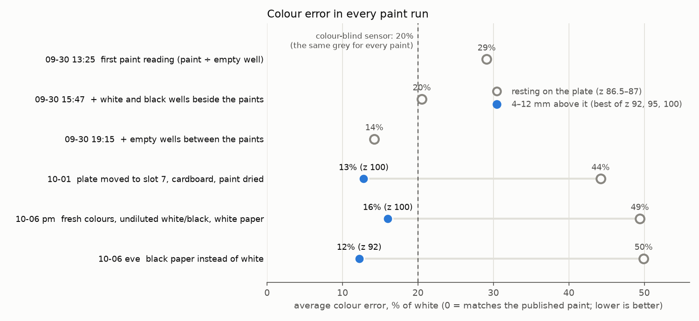

# 2026-10-09 — Accuracy so far: what affects it, every attempt, and where each colour stands

Asked on [PR #202](https://github.com/vertical-cloud-lab/byu-vcl/pull/202) by
@timothy-commins: the factors that affect accuracy; every attempt so far and how much each
helped, as a percentage; the current accuracy per colour; and what is half-tested or untried.
No hardware. The numbers come from [`analyse_accuracy_summary.py`](analyse_accuracy_summary.py)
→ [`accuracy-summary-2026-10-09.json`](accuracy-summary-2026-10-09.json) and the chart,
re-scored from the values the earlier analyses committed.

## The scale

- **Error**: how far each colour's 7 readings (440–670 nm) are from the published colour of
  its pigment, on average, with white = 100%. "Published" is a range, from the pigment alone
  to the pigment mixed 1:1 with titanium white (red: PR170 to PR9); inside the range counts
  as 0. This is the `miss` of [`analyse_white_black_correction.py`](analyse_white_black_correction.py),
  used since 2026-09-30, as a percentage.
- **Accuracy** = 100% − error.
- **For scale**, a sensor that sees no colour at all: one grey (0.144) for every channel of
  every paint, chosen to score best. It scores **20% error overall**: yellow 38%, red 21%,
  blue 0.7%. Picking the grey with the answers in hand makes this a floor for a colour-blind
  sensor.

## On the AC's paint-to-water ratio

The AC used acrylic "thinned in water, probably a 10:1 water:paint ratio, if not weaker"
([ac-dev-lab#152](https://github.com/AccelerationConsortium/ac-dev-lab/issues/152#issuecomment-2599366053),
2025-01-17), and @timothy-commins says our colour vials follow it. Our data agree that the
water is not the main problem: over black paper, 4% (yellow), 8% (red) and 11% (blue) of
each colour's reading came through the paint
([`results-black-paper-2026-10-06.md`](results-black-paper-2026-10-06.md)), and the yellow
was already too dark over white paper, where see-through paint would read lighter. "Thicker
colours" is off the next steps.

The AC's success was a different test. Yanghuang Lin's per-well white reference took
**repeatability** from 6–7% to 1.2–2.3% RSD
([#152](https://github.com/AccelerationConsortium/ac-dev-lab/issues/152#issuecomment-2654927124)),
and Kelvin Chow's light panel let the optimiser find a target colour measured by the same
sensor ([#552](https://github.com/AccelerationConsortium/ac-dev-lab/issues/552#issuecomment-4101574167)).
Neither compared readings with the paint's published colour, which is what "error" means
here ([`accuracy-provenance.md`](accuracy-provenance.md) §1). Our readings repeat about as
well: within 0.1% at one landing, within 1.7% between trips 30 min apart, unless a landing
pushes the enclosure up the nozzle (12% on 10-01).

## 1. What affects accuracy

- **Read height**, and **whether the enclosure presses on the plate**: a press can push it up
  the nozzle without showing ([`landing_shift.py`](landing_shift.py)).
- **Light coming up through the clear plate**, and light passing between neighbouring wells.
- **What is under the plate**: bare deck, white paper or black paper.
- **Where the plate sits**: resting on the plate scored 14% in slot 1 and 44–50% in slot 7
  (other things changed too).
- **Room light and people moving nearby**: now blocked by the blackout.
- **The rail lights**, the only light source. Their colour divides out through the white well;
  only a drift, e.g. while warming up, would matter.
- **The white and black wells**: how white and how black they are, and how full.
- **The paint**: how see-through, how full the well, time since it was poured (drying), and
  whether the vial was stirred.
- **Sensor settings**: gain and reading time. The 410 nm channel is too weak under the rail
  lights to use.
- **No diffuser** over the sensor chip.
- **Checked, and not factors**: the number of readings per landing, and the board's green LED.

## 2. Every attempt, and how much it helped

Before paint was in a plate (09-09 and 09-10, empty wells; share points against the largest
colour signal of the time, 2.61; [`accuracy-provenance.md`](accuracy-provenance.md) §4):

| when | attempt | how much it helped |
| --- | --- | --- |
| 09-09 | read at z 120 instead of z 128 | 99% less disagreement between readings (55.7% → 0.8%) |
| 09-10 | rail lights on | 5.6× the signal; 95% less noise (0.338 → 0.018 share points) |
| 09-10 | reference read at the same spot, height and lights as the sample | avoids errors of 11% (spot), 120–370% (height) and 98–107% (lights) of the colour signal |
| 09-10 | subtract the board's green glow before dividing | removes all of it (8% of the 510 nm reading) |
| 09-10 | nobody near the robot during a reading | avoids an error of 54% of the colour signal |

With paint in the plate (error as defined above; lower is better):

| when | attempt | error before → after | how much it helped |
| --- | --- | --- | --- |
| 09-30 | paint in a 96-well plate instead of vials | | colour signal 59% stronger (2.61 → 4.16 share points) |
| 09-30 | robot's sides blacked out | | 23% less room light |
| 09-30 | white and black wells beside the paints | 29% → 20% | 30% better |
| 09-30 | empty wells between the paints (also new white and black, vials stirred) | 20% → 14% | 31% better |
| 10-01 | cardboard and wood over the robot | no clear change¹ | 7–15% less room light; biggest jump between two readings 96% smaller (5.35% → 0.24%) |
| 10-01 | **read 4–12 mm above the plate instead of resting on it** | 44–50% → 12–16% | **68–76% better, in 3 runs of 3** |
| 10-01 | more readings per landing | | 0%: 16 readings already agree within 0.1% |
| 10-02 | the board's green LED (checked whether to turn it off) | | 0%: a fixed offset that cancels out |
| 10-06 | fresh colours, undiluted white and black, white paper (all at once) | 13% → 16% at z 100 | 25% worse at z 100; no change at z 92 (20% → 21%); black ÷ white 11% lower |
| 10-06 | black paper instead of white | 21% → 12% at z 92 | 41% better at z 92, 11% at z 100 (16% → 14%); none resting (49% → 50%) |

¹ Between those runs the plate also moved from slot 1 to slot 7 and the paint dried: at z 125
the error went 24% → 15%, resting 13% → 44% ([`results-blackout-2026-10-02.md`](results-blackout-2026-10-02.md)).

**Overall: 29% error at the first paint reading, 12% at the best setting so far (z 92 over
black paper): 58% better.** But resting on the plate, which is still the standing read
height, has been 44–50% since the plate moved to slot 7: worse than a colour-blind sensor.

## 3. Current accuracy, per colour

The 10-06 evening run: black paper, plate in slot 7, undiluted white and black.

| | 4–12 mm above the plate (z 92–100) | resting on the plate (standing read height) | colour-blind sensor, for scale |
| --- | --- | --- | --- |
| yellow | 73–86% | 54% | 62% |
| red | 83–87% | 58% | 79% |
| blue | 95–99% | 38% | 99% |
| all three | 86–88% | 50% | 80% |

- **Blue's score says little.** Published blue paint is dark at every wavelength (its range
  is also the widest, 0.23 on average against red's 0.03), so a dark reading of any shape
  scores well; the colour-blind sensor scores 99%.
- **Yellow is the real test.** Its bright half (550–670 nm) reads about 40% (z 100) to 65%
  (z 92) as bright as it should.
- **All three colours are recognised**: each reading's shape matches its own pigment best.
- Colour differences still come out 2.6× (z 92) to 4.4× (z 100) smaller than they are.

Per height (error %; values inside the published range, of 7):

| | z 92 | z 95 | z 100 | resting |
| --- | --- | --- | --- | --- |
| yellow | 14.5 (1) | 23.3 (3) | 26.9 (3) | 45.6 (0) |
| red | 17.0 (1) | 13.5 (0) | 14.3 (1) | 42.0 (0) |
| blue | 5.3 (3) | 1.9 (4) | 1.5 (5) | 62.1 (0) |
| all three | 12.2 (5) | 12.9 (7) | 14.3 (9) | 49.9 (0) |

## 4. Started, not finished

1. **Read height.** 4–12 mm above beat resting in 3 runs of 3, but the standing read height is
   still resting on the plate (z 86.5), pending @timothy-commins's OK.
2. **Why resting got worse.** It scored 14% on 09-30 with the plate in slot 1, and 44–50% since
   the plate moved to slot 7. Not tested: the plate back in slot 1.
3. **Backing paper.** White and black paper were each tried once, 1.3 h apart, while the paint
   aged. Not tried: both at the same paint age, or bare deck against paper in one run.
4. **White and black wells.** Undiluted now, but hand-filled to an unknown level: the main
   suspect for the yellow reading too dark. Not tried: both filled to exactly 200 µL, like the
   colours.
5. **Blackout.** The cardboard is temporary. Re-read the white and black after the black paper
   goes up.
6. **Gain and reading time.** The firmware change is written and tested ([`../pico/`](../pico/))
   but not installed: the Pico W has to be plugged into the Pi by USB once.
7. **Paint dilution.** See-through measured (4–11%); thicker paint not tried. Low priority,
   given the AC's ratio.

## 5. Not tried yet

1. **A diffuser on the sensor chip**: white PTFE plumber's tape, 2–4 layers, with the inside
   of the hole blackened ([`accuracy-sources-2026-10-02.md`](accuracy-sources-2026-10-02.md)).
2. **A black- or white-walled plate** instead of a clear one, so less light passes between wells
   and up through the plate.
3. **A white reference at every well's own position**, read before the paint goes in: the AC's
   1.2–2.3% result.
4. **A light panel under the plate**: the AC's 2026 fix.
5. **More than two reference colours.** ams recommends 8 or more.
6. **A 30-minute warm-up** of the rail lights before reading.
7. **The same time between pouring and reading** for every well.
8. **Two separate landings per well**, averaged.
9. **A short black tube** so the sensor sees only its own well.

## Caveats

- "Above" is the best of z 92, 95 and 100 in each run, so it leans optimistic; the per-height
  table shows the spread.
- The published ranges describe dried paint films; ours is watered-down wet paint in a well.
  Inside the range counts as no error, which flatters every number here, blue most.
- The 09-30 runs read resting on the plate only; from 10-01 each run read a ladder of heights.
- The 10-01 resting score uses the second-landing white
  ([`results-height-series-2026-10-01.md`](results-height-series-2026-10-01.md) §1); as
  measured it was 92%.
