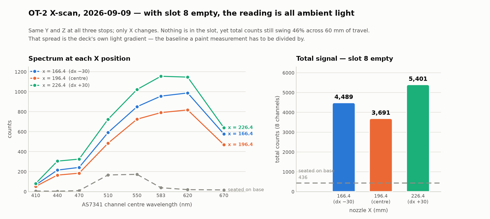

# X-scan run, 2026-09-09 — first complete pick-and-scan on hardware

Requested on [#197](https://github.com/vertical-cloud-lab/byu-vcl/issues/197); the test
itself is the one prepared on [#33](https://github.com/vertical-cloud-lab/byu-vcl/issues/33).
Slot 8 was deliberately **empty** — the point was to exercise the motion and get a
calibration baseline, not to measure paint.

Robot `OT2CEP20210722R13`, API 8.8.1, `p300_single_gen2` on the left mount.
Raw data: [`xscan-run-2026-09-09.json`](xscan-run-2026-09-09.json) (15 readings, also in
`digital-wetlab.sensor-data`).

## What ran

`run_xscan_test.py` end to end: seated baseline → pick up from slot 10 → grip check →
carry to slot 8 → read at three X positions → carry back → reseat → home. No aborts.

| stage | result |
| --- | --- |
| Seated baseline | 436 counts |
| Grip check | 436 → 2253 = **5.2x** (threshold 2.0) — pickup confirmed |
| Reseat confirmation | 438, back to the seated level — module is on its base |

## The three positions

Same Y (225.0) and Z (120.0) at each; only X changes. Aperture ~29.5 mm off the deck.

| X (mm) | dx | 410 | 440 | 470 | 510 | 550 | 583 | 620 | 670 | total |
| --- | --- | --- | --- | --- | --- | --- | --- | --- | --- | --- |
| 166.38 | −30 | 67 | 216 | 242 | 592 | 850 | 956 | 988 | 577 | **4489** |
| 196.38 | 0 | 52 | 165 | 185 | 485 | 725 | 791 | 818 | 469 | **3691** |
| 226.38 | +30 | 81 | 305 | 326 | 724 | 1023 | 1155 | 1147 | 640 | **5401** |
| — | seated | 6 | 4 | 10 | 167 | 173 | 39 | 21 | 18 | 437 |

## What it means

**The 46% spread between positions is the headline, and it is not a colour signal.**
Nothing was in the slot, so it is the OT-2 deck's own light gradient. Raw counts are
therefore not comparable between X positions. Any future paint measurement has to be
divided by an empty-slot reading at that same X — the table above is exactly that
reference — or the enclosure has to be made light-tight.

**Position 2 was unstable in a way the other two were not.** Its three reads were 3431,
3298, **4345** — the third 32% above the second, while positions 1 and 3 repeated to
within 0.1–4%. The jump is concentrated in 550/583 (624→893, 672→987) rather than spread
across the spectrum, which looks like a change in the light reaching the aperture — a
reflection or a passing shadow — not sensor noise. Worth repeating before trusting a
centre-slot number.

**The spectral shape is identical at all three positions** — the same rise to a
583/620 nm peak, scaled up or down. Consistent with one illuminant at three intensities,
which is what an empty slot under uneven lighting should look like, and a reassuring sign
that the sensor is behaving linearly.

## Still to do

Vials of diluted acrylic in slot 8 and a re-run, so there is something to actually
measure against this baseline. That is the original ask on #197.
