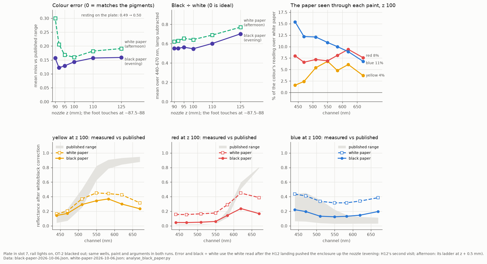
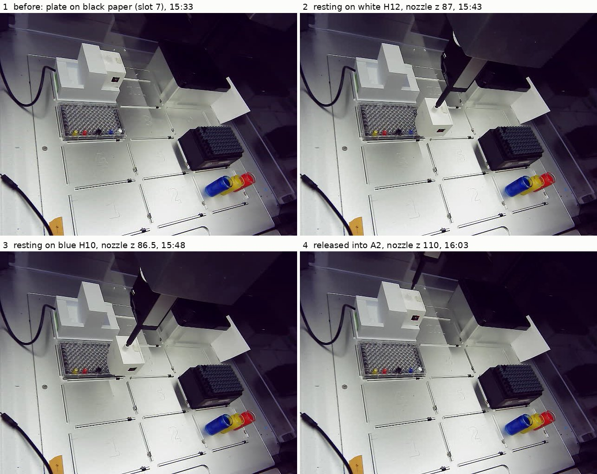

# 2026-10-06 evening — the same wells over black paper: lower error above the plate, the yellow worse

**2026-10-06, 15:31–16:04 MDT. Asked on [PR #202](https://github.com/vertical-cloud-lab/byu-vcl/pull/202)
by Timothy Commins:** "run the same test again. I removed the white backing witha black backing".

Between the afternoon run ([`results-white-paper-2026-10-06.md`](results-white-paper-2026-10-06.md),
read 14:16–14:37) and this one, the white paper under the plate was swapped for black paper.
Nothing else was changed on purpose: the same plate in slot 7, the same paint (no refill),
the same blackout, the same driver arguments and the same ladder. One pick-up read the five
paint wells, then two visits the afternoon had skipped, above the plate only: the empty H5,
and the white H12 a second time.

- **The colour error fell at every height above the plate**, most near it: z 92 0.21 → **0.12**,
  z 95 0.17 → 0.13, z 100 0.16 → 0.14. z 92 is now the best height measured on this rig
  (10-01's z 100 was 0.128). Resting on the plate it did not change (0.49 → 0.50).
- **Every colour read darker.** That fixed their dark halves and hurt their bright halves. At
  z 100 the red's 440–550 nm channels now read 0.04–0.06 (published 0.01–0.03; afternoon
  0.16–0.18), and the blue is inside its published range from 440 to 583 nm (miss 0.015, was
  0.107). But the yellow's 550–670 nm channels read 0.23–0.37 where PY74 is 0.63–0.95 (afternoon
  0.32–0.45), so the yellow got worse (0.215 → 0.270).
- **Colour differences are still ~4× too small** at z 100 (4.6× → 4.4×). What improved is the
  floor: a perfectly black paint would now read 0.11 instead of 0.25.
- **Black ÷ white fell** from 0.64 to 0.55 at z 100 (0 is ideal; Mars black on titanium white is
  ~0.02).
- **The backing test: all three colours are partly see-through.** The opaque white and black
  lost the same counts as each other over the black paper (the light from around the well),
  and the colours lost more. The extra is 4% of the yellow's reading over white paper at z 100,
  8% of the red's and 11% of the blue's, and in each case most in the paint's own colour:
  the blue at 440 nm (15%), the red at 620 nm (9%), the yellow at 550 nm (7%). That is light
  that went through the paint to the paper and back.
- **The see-through part is too small to explain the yellow's dark bright half**, which was
  already too dark over white paper. That points to something that makes the colour wells
  read dimmer than the white well whatever the backing; the hand-filled white and black wells,
  volume unknown, are the next thing to check (below).
- **The same landing problem as the afternoon:** the H12 landing pushed the enclosure 0.85 mm up
  the nozzle (afternoon 0.57 mm), and in the same 0.5 mm step the light over H12 fell 12%. The
  second H12 visit gives the white in the shifted state directly; it agrees with the
  afternoon's interpolated correction to within 0.007 of error at every height.
- **The colours were 1.3 h older than in the afternoon** (dispensed 13:24–13:49, read here
  15:47–15:57). Drying could account for part of their extra darkening; this run can't separate it.

Every reading is in [`black-paper-2026-10-06.json`](black-paper-2026-10-06.json);
[`analyse_black_paper.py`](analyse_black_paper.py) reproduces every number below and the
chart, and writes [`black-paper-analysis-2026-10-06.json`](black-paper-analysis-2026-10-06.json).
The photos it reads are in [`photos-2026-10-06-black/`](photos-2026-10-06-black/).

## The scores

Each height's three colours calibrated against that height's white and black and scored
against the published pigment ranges at 440–670 nm, as in the afternoon
([`analyse_white_paper.py`](analyse_white_paper.py)). "Direct" takes the white from H12's
second visit, read after the landing that moved the enclosure, like every other well;
"corrected" instead takes it from H12's own ladder at z + 0.85 mm, the afternoon's method.

| nozzle z | gap | miss, white paper¹ | miss, black paper (direct / corrected) | black ÷ white, white paper | black ÷ white, black paper |
| --- | --- | --- | --- | --- | --- |
| 125 | ~37 mm | 0.191 | 0.159 / 0.162 | 0.77 | 0.70 |
| 110 | ~22 mm | 0.182 | 0.157 / 0.162 | 0.69 | 0.60 |
| 100 | ~12 mm | 0.160 | 0.143 / 0.147 | 0.64 | 0.55 |
| 95 | ~7 mm | 0.168 | 0.129 / 0.133 | 0.66 | 0.56 |
| **92** | **~4 mm** | 0.206 | **0.122 / 0.123** | 0.63 | 0.55 |
| 90 | ~2 mm | 0.300 | 0.157 / 0.150 | 0.62 | 0.55 |
| resting | 0 | 0.494 | 0.499 | 0.67 | 0.72 |

(miss: mean distance outside the published range, 0 = inside. Black ÷ white: mean over
440–670 nm, lamp subtracted.) ¹ The afternoon's corrected rows, as published there.

At z 100, per paint (white paper → black paper, direct):

| | miss | dark channels | bright channels |
| --- | --- | --- | --- |
| yellow | 0.215 → **0.270** | 0.16–0.20 → 0.14–0.17 at 440–470 nm (published 0.04–0.23) | 0.32–0.45 → 0.23–0.37 at 550–670 nm (published 0.63–0.95) |
| red | 0.157 → 0.143 | 0.16–0.18 → **0.04–0.06** at 440–550 nm (published 0.01–0.03) | 0.39–0.45 → 0.17–0.24 at 620–670 nm (published 0.51–0.81) |
| blue | 0.107 → **0.015** | 0.32–0.39 → 0.12–0.20 at 550–670 nm (published 0.03–0.22) | 0.41–0.44 → 0.20–0.22 at 440–470 nm (published 0.06–0.45) |

Values inside the published range at z 100: 5 of 21 → 9 of 21 (z 92: 2 → 5). All three still
have their own pigment's shape. The straight-line fit of measured against published
(analyse_white_black_correction.py): a perfectly black paint reads 0.25 → 0.11, colour
differences come out 4.6× → 4.4× too small.

## The backing test

ISO 13655's test for whether a layer hides its backing: read it over black and over white
(see [`accuracy-sources-2026-10-02.md`](accuracy-sources-2026-10-02.md)). Here every well lost
light, so the comparison is per channel on what each well lost, against what the two opaque
wells lost:

**Each well over black paper ÷ over white paper**, total counts, lamp subtracted:

| nozzle z | white | black | yellow | red | blue |
| --- | --- | --- | --- | --- | --- |
| 125 | 0.761 | 0.672 | 0.671 | 0.637 | 0.661 |
| 100 | 0.761 | 0.631 | 0.646 | 0.599 | 0.590 |
| 92 | 0.734 | 0.637 | 0.640 | 0.614 | 0.594 |
| resting | 0.640 | 0.673 | 0.638 | 0.617 | 0.645 |

- **The white and black lost the same counts**, channel by channel: at z 100, 39–519 counts
  each (the "surround"), and the two differ by at most 38. That light never went through
  paint: it is the black paper seen through the clear plate around the well. A light term
  common to every well cancels in (paint − black) ÷ (white − black).
- **The colours lost more.** The extra, as a share of each colour's reading over white paper:

| at z 100 | 440 | 470 | 510 | 550 | 583 | 620 | 670 nm | mean |
| --- | --- | --- | --- | --- | --- | --- | --- | --- |
| yellow | 1.6% | 2.4% | 5.4% | 6.8% | 4.8% | 6.1% | 3.7% | 4.4% |
| red | 8.0% | 6.6% | 7.2% | 6.9% | 8.1% | 9.4% | 7.6% | 7.7% |
| blue | 15.4% | 12.2% | 12.1% | 10.9% | 10.0% | 8.9% | 6.8% | 10.9% |

  At z 92 the means are 7.9%, 8.5% and 12.0%. Each paint loses most where it passes light:
  the blue at the blue end, the red at 620 nm, the yellow at 550–620 nm. A layer that hid the
  paper would lose nothing extra.
- That extra does not cancel, which is why the calibrated colours moved. The white − black
  span is small (black ÷ white 0.55–0.65), so a few percent of a colour's counts is a large
  step in calibrated reflectance: the yellow's 108 extra counts at 620 nm moved it 0.42 → 0.30.

**Which backing is right?** Neither, for a layer that doesn't hide it. Over white paper a
see-through paint reads lighter than the same paint thick enough to hide anything, and over
black darker. The published spectra are of drawdowns that hide their backing. Over black
paper the dark paints (red and blue) land close to theirs, because a strongly absorbing
layer barely needs to be thick; the yellow, which absorbs little at 550–670 nm, would need
the thickest layer to read right there.

**But the yellow's bright half was too dark over white paper as well** (0.32–0.45, published
≥ 0.63), and only 4–7% of its reading there came through from the paper. So most of that
shortfall is something else: the colour wells read dimmer than the white well regardless of
backing. One candidate is fill level. The colours hold 200 µL (surface ~5 mm below the rim);
the white and black were refilled by hand, volume not recorded, and on the afternoon's probe
both surfaces were more than 2 mm below the rim, but not how much more. A white surface a
few millimetres closer to the sensor reads brighter, and every colour calibrated against it
reads darker. That has not been measured.

## The empty well and the second white

- **The empty H5 over black paper reads 1.03–1.08× the Mars black paint** in H7 at z 100,
  channel by channel. Through the plate, the paper is nearly as dark as the paint.
- **H12's second visit** (15:59–16:00, after every other landing) against its first (15:41–15:42),
  totals: 0.968 at z 125, 0.960 at 110, 0.974 at 100, 1.011 at 95, 1.016 at 92, 1.040 at 90. The
  robot camera puts the enclosure 0.21 mm lower at the front and 0.10 mm higher at the top,
  and the nozzle 0.15 mm higher, than straight after the H12 landing: at the edge of what the
  method resolves (controls 0.03–0.08 mm). Scoring with this white or with the afternoon's interpolation gives the same
  error to within 0.007 at every height, so the scores don't depend on which is used.

## Where the enclosure touched

Below z 90 each step's photo registered against the well's own z 90 photo, as in the
afternoon. A face that follows less than 40% of a step is resting on the plate.

| well | face movement per mm of nozzle travel, each step from z 90 down |
| --- | --- |
| H12 | 0.46, 0.44 to z 88.5; **0.23, 0.11, 0.08 at z 88, 87.5, 87**: resting from ~88 |
| H10 | 0.67, 0.53, 0.79, 0.58 to z 87.5; **0.13, −0.03 at z 87, 86.5**: resting from ~87 |
| H7 | 0.63, 0.78, 0.49 to z 87; 0.27 at 86.5: touching at about 86.5 |
| H4 | 0.47, 0.57, 0.88 to z 87; 0.29 at 86.5: touching at about 86.5 |
| H2 | 0.62, 0.89, 0.64, 1.64 (the last is more than the nozzle moved; template match 0.45, so not reliable) |

In the afternoon only H12 rested. The black paper may sit flatter, or thicker, than the white.

**The light at H12** fell 352 counts from z 90 to 89, then 27, 25 and 17 per 0.5 mm to z 87.5
(the foot resting), then **566 counts (12%) from 87.5 to 87**, where the afternoon's same step
lost 18. The z 125 photos before and after that landing put the enclosure 0.85 mm higher on the
nozzle at the front and 0.52 mm at the top, so it moved, and tilted, in that last step. Its
eight resting readings at z 87 (4,137–4,142) are after the move.

## Landings

Robot-camera photos at z 125 before and after each landing, in mm of upward travel
([`landing_shift.py`](landing_shift.py)'s method):

| landing | front | top | nozzle | tip rack (control) |
| --- | --- | --- | --- | --- |
| H12, pressed to z 87 | **+0.85** | **+0.52** | −0.01 | +0.02 |
| H10 | −0.09 | +0.09 | +0.03 | +0.03 |
| H7 | −0.09 | −0.03 | +0.02 | +0.01 |
| H4 | 0.00 | +0.01 | +0.06 | +0.02 |
| H2 | −0.02 | +0.02 | −0.01 | +0.01 |

Before it, the enclosure hung as in the afternoon (H12 at z 125: front +0.06, top +0.03 mm
against the afternoon's photo). Pressing ~1 mm past first touch at H12 has now moved it in
all three runs that did it (10-01: 0.85 mm at H10; 10-06: 0.57 and 0.85 mm at H12).

## What this means for the next run

1. **Keep the black paper.** It lowered the error at every height above the plate and put the
   red and blue close to their published spectra.
2. **Read above the plate, at z 92–100.** All three scored 0.12–0.14 tonight; resting on the
   plate scored 0.50 and is where landings move the enclosure.
3. **Fill the white and black like the colours**, 200 µL each, or measure how full H7 and H12
   are now. The colours read too dark at their bright end over both backings, and an unequal
   fill is the first thing that would do that.
4. **Thicker colours.** All three are partly see-through (4–11% of their reading over white
   paper came from the paper). Over black paper that matters least for the dark paints and
   most for the yellow.
5. To separate drying from the backing, read the same wells over white paper again at the
   same paint age. Not needed for the decisions above.

## How it ran

**Before anything moved (15:31–15:33).** Robot link 0.86 ms, no maintenance run open, rail
lights off. Sensor 384–386 counts on its base, lights off. The robot-camera photo shows the
plate in slot 7 on the black paper, in the same place as in the afternoon.

**The trip** ([`enclosure_height_cal.py`](enclosure_height_cal.py), maintenance run `367adfb2`,
the afternoon's arguments: `--socket-x 92.8 --socket-y 316.5 --press-z 89.0 --carry-z 125
--carry-segment 400 --drop-dx 0 --max-speed 3 --no-live --floor 86 --clear-z 90 --plate-slot 7
--target-x 113.38 --target-y 192.24`, the same scripts byte for byte):
- Bare nozzle over A2 at z 150, 130, 120, 110 and 102. At 120, 110 and 102 the enclosure sat
  within 0.01 px of the afternoon's photos at the same heights, so it had not been moved.
  Pressed 99 → 89 in 2 mm steps; at every step the nozzle and the enclosure were within
  0.02 px of the afternoon's photo (enclosure +0.76 px at z 89; afternoon +0.78). Lifted to z 93: −2.13 px (−2.09). 160 jolts at 3 mm/s: −2.11 px, no slip.
  Grip check 9.2×, as in the afternoon.
- Carried via z 190 to H12: 9,341 counts at z 125, against 12,156 over the white paper.
- H12: z 125, 110, 100, 95, 92, 90 (two readings each), 89 to 87 in 0.5 mm steps, eight
  readings at z 87. H10: the same to z 86.5. H7, H4, H2: 1 mm steps below z 90, to 86.5, eight
  readings there. Then H5 and H12 again at z 125 to 90 only.
- The light over the base didn't change between the runs: 813 / 4,011 / 9,119 counts at the
  three fixed spots on the way out (lifted to z 93, z 110, z 190), against 803 / 4,022 / 9,326
  in the afternoon. The z 190 spot sees the most of the deck.
- Returned via z 190 and released into A2: 469–471 counts after (afternoon 471), 464–466 homed;
  the release photo matches the pre-pick-up photo at z 110 to 0.08 px. Rail lights off, run
  closed. The sensor was off its base 15:38–16:03 and answered throughout.

## Files

| file | what |
| --- | --- |
| [`black-paper-2026-10-06.json`](black-paper-2026-10-06.json) | every reading (8 channels, time, pose, well, visit, stage) and the trip |
| [`analyse_black_paper.py`](analyse_black_paper.py) | the scores against the afternoon, the backing test, contact and landing checks, the chart |
| [`black-paper-analysis-2026-10-06.json`](black-paper-analysis-2026-10-06.json) | its output |
| [`black-paper-2026-10-06.png`](black-paper-2026-10-06.png) | the chart |
| [`black-paper-2026-10-06.jpg`](black-paper-2026-10-06.jpg) | robot-camera photos: the deck before, resting on H12 and H10, released |
| [`photos-2026-10-06-black/`](photos-2026-10-06-black/) | the 47 robot-camera photos the analysis and the montage read |

On the Pi (`RPI_STREAM_CAM_HOSTNAME`), in `~/color-read-1006b/enc/`: 98 photos, `log.txt`,
`readings.jsonl`, `state.json`, and the scripts it ran. MQTT credentials went in over stdin.
No services, timers or settings were changed.
