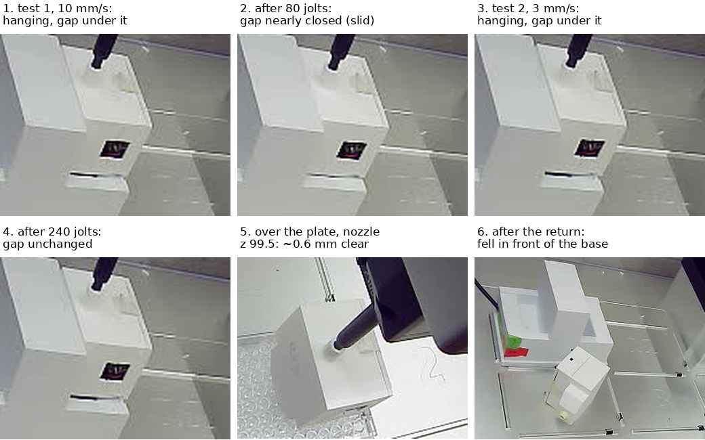

# Enclosure carried to the plate and its height found, then it fell on the way back

**2026-09-29, 17:07–17:33 MDT. Asked on [PR #202](https://github.com/vertical-cloud-lab/byu-vcl/pull/202):
"the sensor has battery. The enclosure has no cracks in it. please run tests to
confirm the enclosure won't fall off and then the calibration tests as asked
earlier until; 1, the job is complete or 2 the enclosure unexpectedly falls off
of the pipette".** Two pick-ups, one test each. The first failed its grip test at
the old carry speed and was let go in its pocket. The second passed the same test
at 3 mm/s, was carried to the plate, and gave the height. **It touches the plate at
nozzle z ≈ 98.9, and was held just above, at z 99.5.** On the way back to its base
it came off the nozzle and fell to the deck in front of the base. That is stop
condition 2, so the tips-and-liquid stage was not started.

All numbers below are in [`enclosure-carry-2026-09-29.json`](enclosure-carry-2026-09-29.json).

## Before anything moved

- The robot answered on the link (0.8 ms), with no run open and the rail lights off.
- The sensor answered: 432–433 counts with the lights off, 502–506 with them on,
  i.e. closed on its base.
- The enclosure was in the base's right-hand socket (A2). The hover photo at z 120
  matched 09-29's afternoon photo to within 0.03 px on every patch, and at z 99
  to 0.04 px, so the pick-up point (92.8, 316.5) applied unchanged.
- The stream titled "OT-2 stream picam-ot2" still showed another machine, so the
  robot's own camera was the only view again.

## The carry route used to pass the base's tower

The base has a tall tower between its two sockets, about as tall as a seated
enclosure. The old carry went up to the carry height and then straight to the plate
on a diagonal. From A2 that diagonal drifts towards the tower (−0.1 mm in X per mm of
Y) while the enclosure is still alongside it. At `--carry-z 125`, as recommended this
afternoon, the enclosure's foot is about 40 mm off the deck, far below the tower's top.

[`enclosure_height_cal.py`](enclosure_height_cal.py) now carries straight out to the
front at the socket's X and then across. The return is the reverse, and it lets go
inside the pocket from the `release-here` pose. The drop column's −4 mm anti-tilt
offset was tuned at A1, and at A2 it points at the tower. `--max-speed` caps every
move made with the enclosure aboard.

## Grip test 1, at 10 mm/s: failed

`--press-z 89.5`, 0.5 mm deeper than before, as the 09-29 write-up suggested.

- **The press went to full depth with no jam.** The nozzle moved 10.05 px for 9.5 mm.
- **Pressing deeper did not help.** The last 0.5 mm moved the nozzle only 0.28 px and
  pushed the enclosure 0.15 px further into its springy seat. The nozzle seems to
  reach the bottom of the collar at about z 90.
- **The lift itself cost grip.** After a 4 mm lift at 10 mm/s, the enclosure hung
  only ~1 mm (−0.99 px) above its seat, against ~3 mm if it had been held rigidly.
- **80 jolts in Y at 10 mm/s and the gap closed** (panels 1–2). It slid down the
  nozzle, the same as 09-29. It was let go in place and settled onto its seat
  (505–506 counts; −0.04 px).

## Grip test 2, at 3 mm/s: passed

The same pick-up, but every move with the enclosure aboard was capped at 3 mm/s.
The OT-2's acceleration is fixed, so a slower move changes speed over a shorter
time, and the jolt is smaller.

| | enclosure (px) | seam | sensor |
| --- | --- | --- | --- |
| after a 4 mm lift at 3 mm/s | −2.18 | 59.4 | 1064–1065 |
| + 80 jolts in Y (`jiggle y 0.3 40 3`) | −2.21 | 60.8 | |
| + 80 jolts in X (`jiggle x 0.3 40 3`) | −2.20 | 58.0 | |
| + 80 jolts in Z (`jiggle z 1.0 20 3`) | −2.18 | 58.9 | 1065–1066 |

**No slip in 240 jolts**, more than the 160 this afternoon's write-up asked for
(panels 3–4). **The slow lift also left it hanging twice as high** (−2.18 px against
−0.99 px), so about a millimetre of test 1's slip came from the lift alone. At z 110
the light-based grip check read 11.2×.

## The carry and the height

Up to z 125 (17:20:34), straight out to the front, then across, all at 3 mm/s:
over the plate at 17:22:32. Then down over the plate's centre (63.88, 42.74), with
a robot-camera photo and two readings at every step.

**How contact shows.** The camera looks down too steeply to see a gap under the
enclosure. What it can see is the enclosure moving: its top face moved a steady
1.30–1.32 px per 1 mm step all the way down to z 99. The plate stayed within
0.02 px throughout.

| step | enclosure moved | expected |
| --- | --- | --- |
| 101 → 100 | 1.30 px | 1.31 |
| 100 → 99 | 1.32 px | 1.31 |
| **99 → 98.5** | **0.13 px** | 0.66 |
| back up to 99 | **0.00 px** from the earlier z 99 photo | |

From 99 to 98.5 the enclosure, its collar and the nozzle tip all moved about a
tenth of what they should have. Going back up to 99 gave a photo identical to the
first one at z 99. So the Z axis lost no steps and the enclosure did not slide up
the nozzle. The half step was taken up by the enclosure resting on the plate and the
Z axis flexing, which 09-25 measured at up to 0.6 mm under a press.

**So the enclosure touches the plate at nozzle z ≈ 98.9, and "just above" is
z 99.5, about 0.6 mm clear** (panel 5). It read 10,636–10,646 counts there, with the
rail lights on. On the way down the reading fell smoothly, about 75–100 counts per mm
below z 106, with no step at contact. So the sensor alone can't find the height.

What the number depends on:

- **The pick-up.** It is the height for a 3 mm/s lift after a press to z 89.5. A
  10 mm/s lift left the enclosure hanging about 1 mm lower on the nozzle.
- **Where on the plate.** It was measured at the plate's centre only. Whether the
  plate and deck are level under other wells was not checked.
- **The plate.** For a plate top at the nominal 14.22 mm, the enclosure's foot hangs
  84.7 mm below the nozzle. That puts the pocket's floor at about z 7, not the 16 in
  the AccelerationConsortium definition, and matches 09-25's estimate of 82 mm below
  a z 90 press.

## The fall

`return` at 17:28:54. The move log, which records when each move finished, gives:

| MDT | move |
| --- | --- |
| 17:29:03 | up to z 125 over the plate |
| 17:29:13 | across to x 92.8 |
| **17:30:44** | **straight back to y 316.5, towards the base: 274 mm at 3 mm/s, 91 s** |
| 17:30:50–53 | down to z 110, then 100, over the pocket |
| 17:30:59 | photo: **nozzle empty, pocket empty, enclosure on the deck** |

It was on the nozzle at 17:28:09. It came down on the deck just in front of the
base, in A2's column, leaning against the base (panel 6). A fall at the plate would
have landed on the plate, and one over the pocket would have landed in it. So it came
off during the long run back towards the base, most likely in its last 20–30 s.
Nothing filmed it: the livestream camera is pointed elsewhere.

After that the eject fired on an empty nozzle, the sensor reported 10,544 (not ~505)
and the script held still instead of homing. The `seated` command was then used only
to home the empty nozzle and close the run. It rose straight up first, away from the
fallen enclosure. The rail lights went back off. **The enclosure still answers**,
10,211–10,336 counts, lying in the light.

**Why, as far as can be told from here.** Two explanations fit and nothing here
separates them:

1. **It slid off during the long slow move.** The in-pocket test gave 240 short
   jolts. It did not give 91 s of continuous stepping at 3 mm/s, and a stepper at low
   speed vibrates. The run out to the plate was the same length and it survived that,
   so it could have slid part of the way on each run.
2. **Its foot clipped the front of the base.** At z 125 the foot is about 40 mm off
   the deck, and the return approached the base head-on. It cleared on the way out,
   but only if it hung no lower on the way back.

Either way, the friction fit is the weak point. At 3 mm/s it held for 240 jolts, the
lift, the carry out, the ladder and the touch-down, and then it let go.

## What would have to be true before trying again

1. **Someone puts the enclosure back in A2** and checks it over: it fell about 40 mm
   onto its side against the base.
2. **Point the OT-2 livestream camera back at the OT-2.** A second view would have
   shown which of the two explanations above is right.
3. **A grip that does not depend on this collar.** Twice now it has passed a check
   and then let go. A tighter bore, a sleeve or a latch would all do more than any
   motion setting.
4. Until then, if it is carried again: **approach the base higher.** For example,
   come back at z 140 and go down only over the pocket. Split the long leg into a few
   shorter ones, each with a photo, so a slide shows before it falls.

**The tips-and-liquid stage was not started**, because the enclosure fell (stop
condition 2). It does not depend on the enclosure and can be done on its own.

## Files

| file | what |
| --- | --- |
| [`enclosure_height_cal.py`](enclosure_height_cal.py) | carry out-then-across, return into the pocket, `--max-speed`, no light verdict inside the pocket |
| [`enclosure-carry-2026-09-29.jpg`](enclosure-carry-2026-09-29.jpg) | the six panels above, from the robot camera |
| [`enclosure-carry-2026-09-29.json`](enclosure-carry-2026-09-29.json) | every number above, including the reading at each height |
| [`grip_shift.py`](grip_shift.py) | the in-pocket measurements (unchanged) |

On the Pi (`RPI_STREAM_CAM_HOSTNAME`): test 1 is in `~/enclosure-cal-0929b/test1/`,
test 2 in `~/enclosure-cal-0929b/`, with all robot-camera photos, `log.txt`,
`run.out` and `state.json`. No services, timers or settings were changed.
