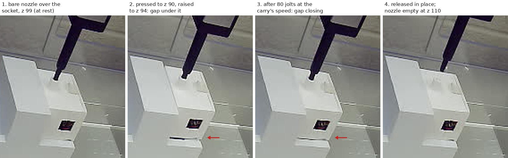

# Enclosure grip, tested over its own pocket: it slides down the nozzle

**2026-09-29, 16:09–16:32 MDT. Asked on [PR #202](https://github.com/vertical-cloud-lab/byu-vcl/pull/202):
can the pipette sense how tightly it holds the enclosure, and if the enclosure is
back on its base, re-run the test from 2026-09-25.** It was back, in the base's
right-hand socket (A2). One pick-up went to full depth with no jam. Then a new
grip test shook the enclosure while it still hung inside its own pocket. It slid
down the nozzle under the same jolts a carry makes, so it was never carried. It
was released back onto its seat, the robot was homed, and the deck was left as
it started. Nothing fell.

All numbers below are in [`enclosure-grip-2026-09-29.json`](enclosure-grip-2026-09-29.json).

## Can the OT-2 sense how tightly it holds the enclosure? No

Checked in the source of `opentrons==8.8.1`, the robot's own version:

- **OT-2 pipettes have no tip-presence sensor.** In
  `protocol_engine/execution/tip_handler.py`, `get_tip_presence()` and
  `verify_tip_presence()` both catch `HardwareNotSupportedError` with the comment
  *"Tip presence sensing is not supported on the OT2"*. The first returns
  `UNKNOWN` and the second does nothing. Tip-presence, pressure and capacitive
  sensing are Flex hardware.
- **Its motors have no encoders.** Encoder handling exists only in the Flex
  (`ot3*`) backends. The OT-2 does not know whether a move happened, which is why
  the 2026-09-25 jam lost 7 mm of steps without an error.
- **Acceleration is fixed and does not depend on the commanded speed:** X 3000,
  Y 2000, Z 1500 mm/s² (`config/defaults_ot2.py`). A slow move still starts and
  stops at full acceleration; it only makes each jolt's change in velocity
  smaller.

That leaves three indirect ways to judge the grip:

| | tells you | limit |
| --- | --- | --- |
| the enclosure's light sensor (the old "grip check") | the enclosure has left its base | nothing about how tightly it is held: 10.7× on 09-25, then it fell |
| the robot camera | whether a gap opens under the enclosure, and closes again | about ±0.5 mm |
| a proof test: apply the carry's loads where a fall is harmless | whether the grip survives those loads | only as good as how closely it matches the carry |

This run used the last two.

## The test

`enclosure_height_cal.py --no-sensor --no-live --carry-z 125 --carry-segment 400 --drop-dx -4.0`

| MDT | step |
| --- | --- |
| 16:12 | read-only check: enclosure on its base in A2, board not answering (see below) |
| 16:23 | bare nozzle over A2 at (92.8, 316.5, 102): the enclosure's top matches 2026-09-25's photo at this pose **to 0 px**, so the same pick-up point applies |
| 16:25–16:26 | pressed from z 99 to z 90 in five steps, a photo after each. The nozzle's image moved 9.63 px for 9.0 mm with no lag at any step. **No jam** (the 09-25 jam lost 7 mm) |
| 16:27 | lifted to z 92.5: the enclosure had not moved |
| 16:28 | up to z 94: **a gap opened under it**, ~2.1 mm |
| 16:29 | `jiggle y 0.3 20 10`: 20 there-and-back moves of ±0.3 mm in Y at 10 mm/s, 12 s |
| 16:29 | **the gap had mostly closed**: ~0.4 mm left |
| 16:31 | script stopped (no motion); raised 1 mm to the back-out pose (z 95), ejected, rose to z 110: **nozzle empty, enclosure on its seat** |
| 16:32 | homed, maintenance run closed, rail lights back off |

**Why that shake matches the carry.** Every move starts and stops at the
firmware's full acceleration. At 10 mm/s the Y axis reaches speed in 5 ms and
0.025 mm, so a ±0.3 mm move gives the full jolt. The 09-25 carry was 36 segments
at 10 mm/s, i.e. 72 jolts, each with the same 10 mm/s change in velocity. The
shake gave 80 of them. The difference is where they happened: with the
enclosure's foot about 2 mm above its seat, a failing grip drops it about 2 mm,
back where it belongs.

## What the photos measure

[`grip_shift.py`](grip_shift.py) phase-correlates three patches of each robot
camera frame against the bare-nozzle frame at z 99: the pipette housing, the
enclosure's front face, and the base's front edge as a control. Rows are positive
downwards; the nozzle moved 1.07 px per mm.

| pose | nozzle | enclosure | enclosure above its rest position |
| --- | --- | --- | --- |
| z 99, before contact | 0 | 0 | 0 |
| z 90, pressed | +9.63 px | +0.69 px | pushed ~0.6 mm *into* its seat |
| z 92.5 | +6.92 | −0.03 | 0 |
| z 94 | +5.21 | −2.22 | **2.1 mm** |
| z 94, after 80 jolts | +5.39 | −0.43 | **0.4 mm** |
| z 95, before the eject | +4.31 | −0.30 | 0.3 mm |
| z 110, after the eject | −12.07 | +0.02 | 0: seated, nozzle empty |

The base patch stayed within 0.02 px throughout, so neither the camera nor the
base moved. Measuring the enclosure against the z 94 frame instead of the z 99
one gives a slide of 1.0 px rather than 1.8, so take the size as **1–1.8 mm in
12 s**. The direction is not in doubt: the photos show the gap closing.

**Even the lift was lossy.** From the press to z 94 the nozzle rose 4 mm and the
enclosure 2.1 mm. Some of that is expected: the press pushed the enclosure 0.6 mm
into its springy seat, and 09-25 measured 0.6 mm of give in the Z axis under a
press. That still leaves about a millimetre of slip before any shaking.

## Why it slides, probably

The fit is looser than it was. On 2026-09-10 the same press depth (z 90.0) held so
tightly that a release once failed. Since then, on 09-25, the first press into A2
went in off-centre and jammed, and the Z motor drove down on the enclosure's top
until it skipped 7 mm of steps. Then the enclosure fell ~85 mm onto the deck.
Either could have opened up the bore of the collar on the enclosure's top. **Nobody
has looked at it since**, and the camera cannot see inside it.

A slide under ~0.2 g jolts also fits 09-25's fall: the enclosure came off after
about 6 s of lateral carry.

## Also found

- **The sensor board does not answer.** Three reads × 20 s got nothing while the
  broker round-tripped our own probe. The most likely cause is a flat battery, 4 days after 09-25; on
  2026-09-10 it went flat within ~24 h off USB. It is not needed for a height
  calibration, but it is needed for every colour reading. The run used
  `--no-sensor`.
- **The livestream named "OT-2 stream picam-ot2" is pointed at a different machine**,
  and somebody was working in shot. The channel's `/live` URL, which
  `live_frame.py` used, returned the powder doser's stream instead. `live_frame.py`
  now picks the OT-2 stream by its title, but the camera itself needs turning back
  to the OT-2. Until then, the robot's own camera is the only view.
- **A `nohup`'d run ignores Ctrl-C.** A background job started from a
  non-interactive shell inherits SIGINT as *ignored*. `kill -TERM <pid>` stops it
  with no motion and leaves the maintenance run open. The docstring says so now.
- **Silence inside the pocket used to mean "lift it to z 130 and move it".** The
  10-minute timeout called `set_down()` from wherever the enclosure was. That is
  the wrong move for a grip that has just failed a test. The script now lets go
  where it is (`back_out()`, the same as the new `release-here` command), and
  without a sensor it waits for `seated`/`aboard` instead of homing on a guess.
  This run was stopped and released by hand with
  [`release_in_place.py`](release_in_place.py), before that change existed.
- **A refused `carry` still switched the script's phase**, which would have let the
  next `z` command move the enclosure sideways out of its pocket. A simulated run
  (`--simulate`) caught this before the robot moved. Fixed.

## What would have to be true before carrying again

1. **Someone looks at the collar on top of the enclosure**: a split, a burr or a
   widened bore from the 09-25 jam.
2. **The in-pocket shake passes.** For example, no visible slip after twice the
   carry's jolts: `jiggle y 0.3 40 10`, then `jiggle x 0.3 20 10`. It is safe to
   repeat, and one attempt per change is enough. If the collar is sound, the first
   thing to try is a 0.5 mm deeper press (`--press-z 89.5`, since the nozzle is
   tapered). If it is not sound, reprint it.
3. **Then carry low and in one move.** `--carry-z 125` puts the foot ~45 mm off the
   deck instead of ~85, and `--carry-segment 400` makes the trip 2 jolts instead of
   72. Both are in the script and simulated. Neither has been run with the
   enclosure aboard.
4. **Charge the board**, if the reading is wanted as a cross-check.

## Files

| file | what |
| --- | --- |
| [`enclosure_height_cal.py`](enclosure_height_cal.py) | now with `jiggle`, `up`, `release-here`, `lift [z]`, `--carry-z`, `--carry-segment`, `--no-sensor`, `--no-live`, `--simulate` |
| [`grip_shift.py`](grip_shift.py) | the measurements in the table above, from the robot camera's photos |
| [`release_in_place.py`](release_in_place.py) | the hand release used here, from a stopped run |
| [`live_frame.py`](live_frame.py) | picks the OT-2 stream by title |
| [`enclosure-grip-2026-09-29.json`](enclosure-grip-2026-09-29.json) | every number above |

On the Pi (`RPI_STREAM_CAM_HOSTNAME`): the working copy and all 14 robot-camera
photos are in `~/enclosure-cal-0929/`. The first attempt, which was stopped over
the socket with an empty nozzle to drop the livestream grabs, is in `attempt0/`.
No services, timers or settings were changed.
