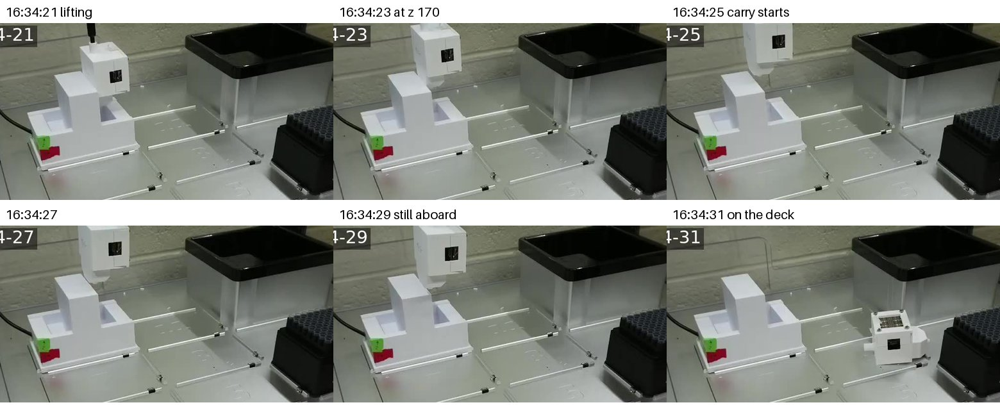
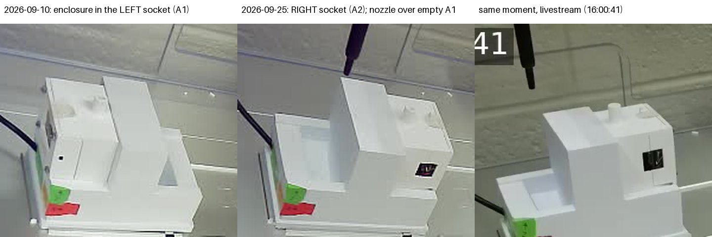
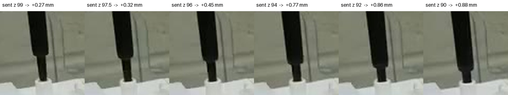

# Enclosure height over the 96-well plate: not calibrated, and the enclosure fell

**2026-09-25, 15:42–16:38 MDT. Asked for on [PR #202](https://github.com/vertical-cloud-lab/byu-vcl/pull/202):
set the colour-sensor enclosure "so that it just barely rests above the 96-well
plate", one pick-up at a time, "because no one will be able to fix any drops this
weekend". It did not get that far.** The enclosure came off the nozzle about six
seconds into the carry and fell about 85 mm to the deck. Someone in the lab set
it back on its base within 30 s. It still answers and reads the same as before the
run (440–442 counts on its base, against 437–438 before). Nothing was measured
over the plate.

All numbers below are in [`enclosure-height-2026-09-25.json`](enclosure-height-2026-09-25.json).

## What happened, in order

| MDT | what |
| --- | --- |
| 15:38 | Pi 5 boots after a power cycle; the robot's cable is in the RTL8153 dongle, on a **USB 3** port again |
| 15:45:57 | dongle wedges, `Stop submitting intr, status -71` — robot unreachable |
| 15:51:26 | SuperSpeed side of that port switched off in software; dongle comes back at **USB 2.0**. 2 787 pings over the next 46 min, none lost |
| 16:00 | bare nozzle hovered over the base's **left** socket (A1), where every September run picked up. **Empty.** Homed, run closed |
| 16:07–16:11 | first try at the **right** socket (A2), at (92.5, 315.5): the press **jammed ~2.3 mm into the enclosure's top**. The Z motor lost 7.0 mm of steps without reporting it; the nozzle came up empty |
| 16:15 | re-homed, which is the only thing that clears lost steps |
| 16:17–16:28 | camera model fitted from nine bare-nozzle poses; socket position corrected to (92.8, 316.5) |
| 16:29–16:33 | second try, pressed in 1.5–2 mm steps with a depth check after each: full depth, grip check **10.7×** |
| 16:34:19 | carry starts: lift to z 170 at 15 mm/s, then 8.3 mm steps at 10 mm/s toward slot 1 |
| **16:34:29–31** | **enclosure falls** from carry height, ~85 mm, onto the deck just in front of the base |
| 16:34:55–16:35:01 | someone reaches in and puts it back in the right-hand socket |
| 16:35–16:38 | script frozen then killed; the fall confirmed in the livestream's replay; robot homed, maintenance run deleted, rail lights back off |



## Why it fell, as far as can be told from here

**The grip check is not a grip test.** It compares the sensor's light level after
the lift with the level seated on the base. 10.7× says the enclosure left its base
on the nozzle. It says nothing about how firmly it is held, and 3.2× to 5.3× was
enough on every September cycle that did not fall.

**The first press probably loosened the fit.** It went in about 1 mm off-centre (see
below), jammed, and the motor kept driving down on the enclosure's top until it had
skipped 7 mm of steps. That is the full force of the Z axis on a printed friction
fit, sideways. The second press went to full depth, never more than 1 mm short of
where it was sent. But the socket it went into may no longer grip the way it did on
2026-09-10. Photos show no crack at the top; they would not show a scuffed bore.

**It is the same failure as 2026-09-09.** That fall also happened mid-carry, with
the September recipe. The deeper press adopted after it (z 90.0, used here too) held
for every cycle on 09-10. A likely trigger: the carry moves in 8.3 mm steps at 10 mm/s. Every stop jolts a
load that hangs off-centre on a friction fit, and this time the fit let go.

Not established: whether the enclosure's socket is damaged, and whether the fall
hurt anything that does not show in a seated reading.

## The enclosure had moved to the other socket



The base in slot 10 has two sockets, 55.95 mm apart in the charging-port
definition. Every run through 2026-09-10 used the left one, A1, at (36.55, 315.5).
By 2026-09-12 the enclosure was in the right one, A2. The livestream screenshot
posted on PR #202 that day already shows it there. That may well have been
deliberate: the AccelerationConsortium's own OT-2 script picks up from
`dock["A2"]`. The hover photo over A1 caught
this before anything pressed. Had it not, the press would have gone into an empty
pocket and the grip check would have stopped the run. That would have been
harmless, but it would have looked like a failed pickup rather than a moved
enclosure.

**A2's working pick-up point is (92.8, 316.5).** That is A1 + (56.25, 1.0), not the
definition's A1 + (55.95, 0). The mouth of the enclosure's socket sits at about z 99.2.

## The camera model, and what it can and cannot see

Both cameras look back and down from the front left. A millimetre of X, Y or Z
moves the nozzle's image in a different direction, and nine photographed bare-nozzle
poses fit those directions well (`camera_model.py fit`):

| camera | image px per mm of X | … of Y | … of Z | fit residual |
| --- | --- | --- | --- | --- |
| livestream (1280×720) | (+1.59, −0.17) | (−0.41, −0.50) | (−0.16, −1.63) | 0.15 / 0.28 px |
| robot camera (640×480) | (+1.00, +0.17) | (−0.25, −0.72) | (+0.34, −0.92) | 0.11 / 0.17 px |

**X is easy; Y is not.** In both cameras, Y and Z move the image almost the same
way, down the frame, and the two cameras are too alike to separate them. From the
livestream, the enclosure's socket was centred under the nozzle in X to 0.3 mm. Y was
only known to ±2 mm, and the jam was a Y error. The correction to 316.5 used A1's
history instead: every September pick-up at y 315.5 had worked, and July had shown
the socket accepting 225–227 in slot 8. **A camera looking along X, i.e. from the
side, is what would fix this.**

**It does catch a press that jams.** The nozzle's shoulder, the step from the wide
section to the narrow tip, stays visible above the enclosure while the tip is inside
it. Its row in the livestream gives the nozzle's true height to within about 0.2 mm
(`camera_model.py press`):

| sent z | nozzle actually higher by |
| --- | --- |
| 99.0 | 0.35 mm (no contact yet) |
| 97.5 | 0.40 |
| 96.0 | 0.53 |
| 94.0 | 0.86 |
| 92.0 | 0.95 |
| 90.0 | 0.96 |
| lifted to 110 | 0.28 — back to the no-contact figure, so no steps were lost |
| **first try, lifted to 110** | **6.98** — a jam, invisible to the robot |



## The link

The dongle was back in a blue USB 3 port for the power cycle and wedged 8 minutes
after boot. Rather than cycle its power, the SuperSpeed side of that port was
switched off:

```bash
echo 1 | sudo tee /sys/bus/usb/devices/4-0:1.0/usb4-port1/disable
```

The RTL8153 then re-enumerated on the port's USB 2.0 companion (`3-1`, 480 Mbit/s).
That is the move to a black USB 2.0 port that the README asked for, without anyone
touching the Pi. Not one of the 2 787 pings over the following 46 minutes was lost.
It is **runtime only**: a reboot puts the port back to USB 3. To undo it by hand,
`echo 0 | sudo tee .../usb4-port1/disable`. If the dongle is ever on the other blue
port, the path is `2-0:1.0/usb2-port1`. The Pi's own Ethernet jack, with its
`ot2-eth0` profile, is still the better fix.

## What would have to be true before trying again

1. **Someone looks at the enclosure.** It fell ~85 mm onto its side. Check the socket
   in its top for scuffing or splitting from the jam.
2. **Pick a socket and say so.** A1 has the long record; A2 has one full-depth press
   at (92.8, 316.5). If the enclosure goes back in A1, `run_xscan_test.py`'s defaults
   apply again unchanged.
3. **Test the grip, not the light.** For example, a slow lateral shake over the base
   with the enclosure a few millimetres above its pocket, so a weak grip drops it
   back where it belongs. Or carry low over the empty slots between the base and the
   plate, so that a fall is short.
4. **Only then the height ladder.** The script still has it, stepping down in at most
   2 mm, with the floor at nozzle z 108 until photos show the real gap. From this
   session's geometry, the enclosure's foot should be about 82 mm below the nozzle.
   So "just above" a 14.2 mm plate would be near nozzle z 97–98. That is an estimate
   to check with photos, not a number to use.

The tips-and-liquid stage was not started. It was to follow a confirmed enclosure
calibration.

## Files

| file | what |
| --- | --- |
| [`enclosure_height_cal.py`](enclosure_height_cal.py) | the run itself: lives on the Pi, one step per command, 10 min of silence sets the enclosure down; stepped press with a depth check |
| [`camera_model.py`](camera_model.py) | fits the two cameras' image Jacobians; measures press depth from the nozzle's shoulder |
| [`live_frame.py`](live_frame.py) | newest livestream frame, ~3 s behind, from the Pi |
| [`livestream_replay.py`](livestream_replay.py) | frames from the stream's last ~15 min, by lab clock time |
| [`enclosure-height-2026-09-25.json`](enclosure-height-2026-09-25.json) | every number above |

On the Pi (`RPI_STREAM_CAM_HOSTNAME`): working files and all photos in
`~/enclosure-cal/`. No services, timers or cron entries were added. The USB port
change above is the only system change, and a reboot reverts it.
