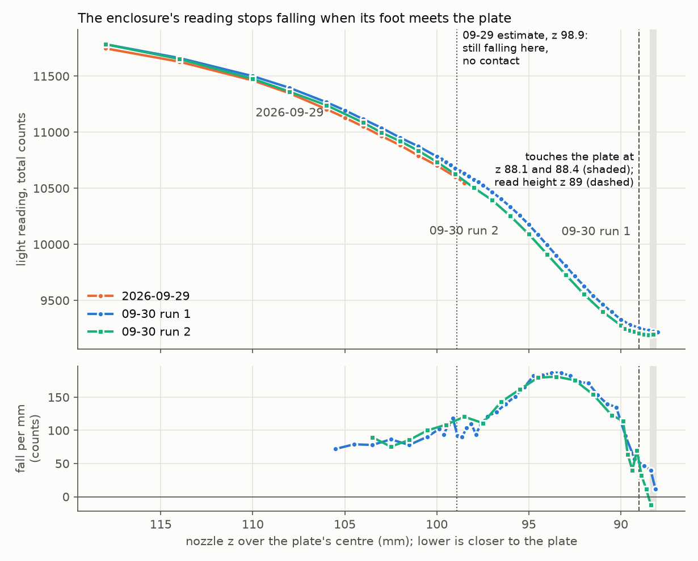
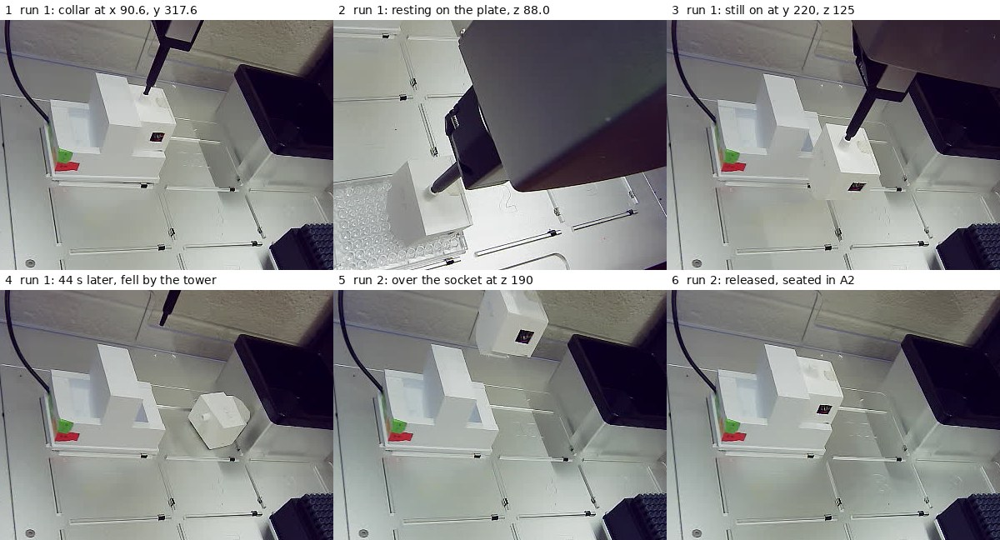

# Enclosure height over the plate found, and a return route that brings it back

**2026-09-30, 09:25–11:03 MDT. Asked on [PR #202](https://github.com/vertical-cloud-lab/byu-vcl/pull/202):
test that the enclosure won't fall off (over the base, so a slip lands back on it),
press a little deeper, then run the height calibration, and keep going until the job
is done or the enclosure can no longer be picked up.** Three pick-ups.

- **Height: the enclosure's foot touches the plate's centre at nozzle z ≈ 88.1
  (run 1) and ≈ 88.4 (runs 2 and 3). Read at z 89.0**, which is 0.5–0.9 mm clear
  for all three pick-ups.
- **The 09-29 figure (touches at 98.9, read at 99.5) was wrong by ~10 mm.** At 98.9
  the enclosure was still moving freely. See [below](#why-09-29-got-989).
- **Run 1 fell off on the way back**, in the last 44 s before the socket, while
  it moved sideways beside the base's tower. It landed to the right of the base.
- **Runs 2 and 3 made every sideways move near the base at z 190**, above the
  tower, and came down beside the tower only vertically. Both were carried to the
  plate and back and released into the socket, seated (502–504 and 507–508 counts).
- **The grip held everywhere it was tested**: 400 jolts plus ~95 s of slow
  strokes in the socket (run 1), 240 jolts (run 2), 80 (run 3), the carries, and
  three touch-downs on the plate, with no slip.

All numbers are in [`enclosure-height-2026-09-30.json`](enclosure-height-2026-09-30.json).

## Before anything moved

- Robot: link 0.86 ms, API 8.8.1, no run open, rail lights off.
- Sensor: 437 counts with the lights off, 494–500 with them on, i.e. closed on
  its base.
- The enclosure was right way up in A2 (put back that morning). But at z 120 its
  front face sat −2.97, −0.85 px from its 09-29 position, and the dark seam under
  it was gone (contrast 8.5 against 37).
- The stream titled "OT-2 stream" still shows another machine, with people in
  view, so only the robot's camera was used and no frame was kept.

## Run 1

**Finding the collar.** The shift in the photo didn't give the answer on its own. The
seated light level said the enclosure was at its usual height, so it pointed at a
point ~4.5 mm further back, and at that point the bare nozzle landed on the collar's
rim at z ≈ 101. It was actually sitting ~2 mm high as well. Light touches then
found the bore. Each pushed the enclosure less than 1 mm on its springy seat, and
it sprang back each time:

| nozzle x, y | result |
| --- | --- |
| 93.4, 321.0 | flat contact at z ≈ 101, pushed down 0.89 px |
| 91.7, 317.9 | side contact at z 100.5, pushed +X 0.85 px |
| 92.8, 316.5 (09-29's point) | flat contact at z ≈ 101 |
| 91.0, 317.6 | graze at z 100.5, 0.2 px |
| **90.6, 317.6** | **clean to z 100: used** |

A touch on a chamfer moves the hole towards the pin, which is what steered the
search.

**Press.** The collar gripped at z ≈ 94, not ~91, because the enclosure sat high.
At z 91.5 it dropped 1.1 px onto its seat in one step. The press went on to
z 89.0 in 0.5 mm steps, and the nozzle advanced the full amount on every step.

**Shake tests, in the socket at z 93, all at 3 mm/s** (measured with
[`grip_shift.py`](grip_shift.py) against the photo just after the lift):

| test | enclosure moved |
| --- | --- |
| `jiggle y 0.3 40 3`, `x 0.3 40 3`, `z 1.0 20 3`, `y 0.5 40 3`, `x 0.5 40 3` (400 jolts) | ≤ 0.02 px |
| `jiggle z 7 20 3`: 20 strokes of 7 mm, ~95 s of continuous motion | −0.10 px |

The long strokes are new ([`enclosure_height_cal.py`](enclosure_height_cal.py)
allows z strokes up to 7 mm since this run). They are the nearest thing the socket
allows to the 91 s leg that preceded the 09-29 fall. The enclosure held, but they
pressed it against its socket wall. The pipette sat 0.9 mm off in X until the lift
(elastic), the base's left front moved 0.8 px, and the light rose from 512 to
1392 counts through a gap under a tilted foot. At z 110 the grip check read
**11.3×**.

**Carry.** Up to z 150 over the socket, out to y 220, down to z 125 and to the
plate: 11,942 counts over it at z 125, the same as 09-29.

**Height.** It went down to z 100 in 1 mm steps, then in 0.25–0.5 mm steps. The
light kept falling, ~100 counts per mm and faster as the gap closed (up to ~185
per mm). Then it flattened: −10 counts from 88.5 to 88.25, −3 from 88.25 to 88.0.
A camera patch that sees only the enclosure stopped at the same step (4.55 → 4.44
px). **Contact at z ≈ 88.1.** Back at z 90 afterwards, the enclosure sat
0.1–0.2 mm *higher* on the nozzle (+31 counts): the plate had pushed it further on,
not loosened it.

**The fall.** From the move log (UTC) and photos:

| MDT | |
| --- | --- |
| 10:10:47 | at y 220, z 125, in front of the base |
| 10:10:50 | photo 109: still on the nozzle |
| 10:10:58 | up to z 150, still at y 220 |
| 10:11:31 | back along x 90.6 to the socket's y 317.6 at z 150 (33 s) |
| 10:11:34 | photo 110: nozzle empty, enclosure on the deck just right of the base |

A person reached in at 10:11:44 and it lay on its side in slot 11 afterwards.
The empty nozzle was homed, the run closed and the lights turned back off. Someone
put it back in A2 by 10:19.

## Why run 1 fell, and what run 2 changed

The base has a tower next to the right-hand socket. Its definition gives the base
a zDimension of 100 mm, and the photos show the tower about as tall as the seated
enclosure. **The enclosure's foot hangs ~74 mm below the nozzle** (88.1 − 14.22).
So at z 150 its lower ~25 mm is below the top of the tower, and at 09-29's z 125
its lower ~50 mm was.

Every fall so far happened while it moved sideways next to that tower with its
foot below the top:

| date | when | landed |
| --- | --- | --- |
| 09-25 | ~6 s into the carry, on a diagonal drifting towards the tower | slot 11, right of the base |
| 09-29 | the return along the socket's column at z 125 | against the base's front, in A2's column |
| 09-30 run 1 | the last 44 s of the return, at z 150 | right of the base |

Leaving straight up, or straight out along the tower's face, has always worked. It
has come off when moving towards the tower (09-25's diagonal) or back in beside it.
In run 1 the pick-up point was also 2.2 mm closer to the tower than usual.

Run 2 set `--approach-z 190` (the nozzle homes at z 199.6). That puts the foot
~116 mm off the deck, ~16 mm above the tower. Out: straight up to z 190 over the
socket, then out to y 220, then down to z 125. Back: up to z 190 at y 220, over
the socket at 190, then straight down, the way every lift out of the socket has
gone (photos 5–6). **It came back and seated, and did so again in run 3.** Two round
trips fit the tower explanation, but they don't prove it.

## Run 2

- It was sitting normally this time (−0.40, −0.06 px from 09-29 at z 120). The
  bare nozzle went into the collar at 09-29's point, (92.8, 316.5), with nothing
  touched down to z 100.
- It was pressed to z 89.0 in ≤ 2 mm steps. That is ~0.75 mm deeper into the collar
  than 09-29's press to 89.5 (nozzle 11.03 px, enclosure 1.05 px). After lifting at
  3 mm/s it hung like 09-29's test 2 (1026–1027 counts against 1064–1065).
- 240 jolts in the socket: ≤ 0.01 px. Grip check at z 110: **11.5×**.
- Carried out via z 190: 12,760 counts at z 190 over the socket, 11,942–11,945 over
  the plate at z 125.
- Down to z 90 in 1 mm steps, then 0.25 mm. The light flattened from 88.75 to 88.5
  (−3), and the enclosure-only camera patch stopped between 88.5 and 88.25 (3.95 →
  3.98 px). **Contact at z ≈ 88.4**, 0.3 mm above run 1's.
- Read at z 89.0: 9,235–9,237 counts.
- Returned via z 190: 2,976 counts hanging in the socket at z 100, **502–504
  after the release**, 503–505 after homing. The run closed at 10:41:17.

## Run 3: the same round trip again

The enclosure sat where run 2 had released it (0.05 px from 09-29 at z 120). It was
picked up at (92.8, 316.5) with nothing touched down to z 100 and pressed to 89.0. It
gripped at z ≈ 90, like 09-29 (nozzle 10.99 px, enclosure 0.89 px). At z 93: 80 jolts,
−0.01 px. Grip check at z 110: **11.4×**. It was carried out via z 190 (11,928–11,934
counts over the plate at z 125). The light flattened and the camera patch stopped
between 88.5 and 88.25 (3.98 px at both). **Contact at z ≈ 88.4 again.** Read at
z 89.0: 9,226–9,229 counts. It returned via z 190: 2,982 counts hanging in the socket,
**507–508 after the release**, 506–507 after homing. The run closed at 11:03:00.

## Why 09-29 got 98.9

That run took 0.5 mm steps near the plate and read them with a phase-correlation
patch that had the still plate behind the enclosure. With a moving object and a
still background in one patch, sub-pixel estimation gets pulled towards zero shift:

- On 09-29, 99 → 98.5 read 0.13 px where 0.6 px was expected. It was taken as
  contact.
- This run's 0.25 mm steps read the same way: 0.05–0.08 px each. Yet z 100 → 99
  measured in one go was the full 1.27 px. Going back up to 100 matched the first
  z 100 photo to 0.00 px.
- On 09-29 the light also kept falling at the free rate through 98.5 (−56 counts
  per 0.5 mm). It said so; it was read as the sensor being unable to see contact.

This run's hang matched 09-29's within ~0.1 mm (at z 100–104), so on 09-29 the
enclosure was ~10 mm above the plate at "just above", not 0.6 mm. **Use the light
reading to find contact**, confirmed by a camera patch that contains only the
enclosure, measured against a photo a few mm higher. The foot sitting ~74 mm below
the nozzle also agrees with the charging-base definition (socket floor z 16 while
pressed to 89 → 73–74 mm). 09-29 had doubted the 16.

## What this does not show

- **One point on the plate.** Both heights are over the plate's centre. Whether
  the plate is level under A1–A3 wasn't checked.
- **The height depends on the pick-up.** The three pick-ups spanned 0.3 mm. Allow
  for that, or re-check contact after each pick-up.
- **Two successful returns.** Runs 2 and 3, on the new route.
- **Liquid.** Still no paint in the wells, so no colour reading was taken.

## Files

| file | what |
| --- | --- |
| [`enclosure-height-2026-09-30.json`](enclosure-height-2026-09-30.json) | every reading, press step, shake result, both ladders, the return timeline |
| [`enclosure-height-2026-09-30.png`](enclosure-height-2026-09-30.png) | light against height, 09-29 and both runs; [`plot_enclosure_height.py`](plot_enclosure_height.py) redraws it |
| [`enclosure-height-2026-09-30.jpg`](enclosure-height-2026-09-30.jpg) | the six photos above, robot camera |
| [`enclosure_height_cal.py`](enclosure_height_cal.py) | `--approach-z` default 190; z strokes up to 7 mm |

On the Pi (`RPI_STREAM_CAM_HOSTNAME`): run 1 in `~/enclosure-cal-0930b/`, run 2 in
`~/enclosure-cal-0930c/`, run 3 in `~/enclosure-cal-0930d/`, each with all robot-camera photos, `log.txt` and
`run.out`. A dry run is in `~/enclosure-cal-0930b/sim/`. No services, timers or
settings were changed.
