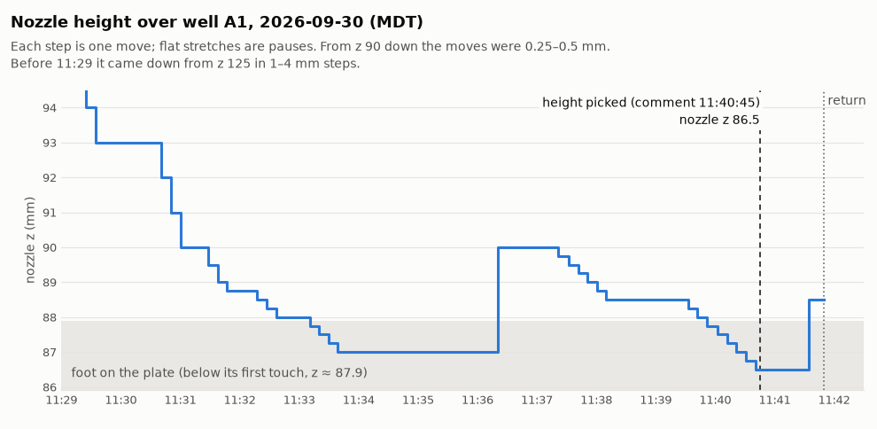
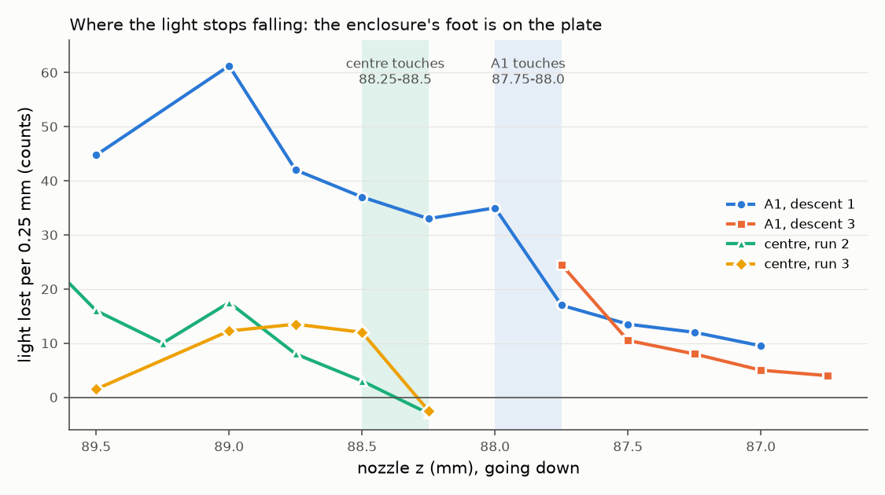
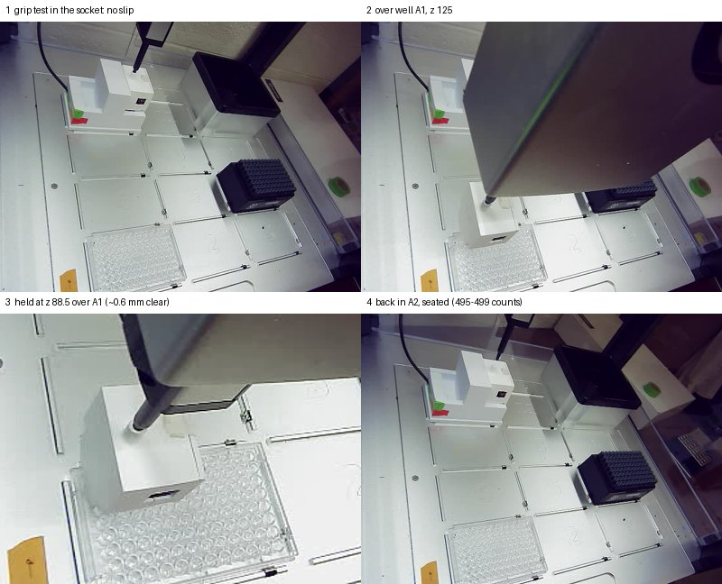

# Enclosure height over well A1: first touch at nozzle z ≈ 87.9; read at z 86.5

**2026-09-30, 11:18–11:46 MDT. Asked on [PR #202](https://github.com/vertical-cloud-lab/byu-vcl/pull/202):
run the enclosure test for the correct height, very close to the 96-well plate.**
One pick-up. The morning's runs 1–3 had measured the plate's centre
([`results-enclosure-height-2026-09-30.md`](results-enclosure-height-2026-09-30.md)).
This run went to **well A1** instead, where the yellow paint will go.

## The read height: nozzle z 86.5 over A1, picked by eye

Timothy Commins, watching the run, at [11:40:45 MDT](https://github.com/vertical-cloud-lab/byu-vcl/pull/202#issuecomment-5916514275):
*"cancel the test ... the height that it currently is at is perfect."* The nozzle
had reached **z 86.5 over A1** at 11:40:41 and was still there. **That is the read
height over A1. It replaces "read at z 88.5", the session's own suggestion below.**

- **At z 86.5 the enclosure sits on the plate.** Its foot first touches at z ≈ 87.9,
  so 86.5 is ~1.4 mm further down. The extra travel did not push the enclosure up
  the nozzle: afterwards it hung within ~0.3 mm of where it had on the way down
  ([below](#finding-the-touch)), and it let go normally in A2 (495–499 counts).
- **The AC's protocol does the same.** It reads at `plate[well].top(z=-1.3)`, which
  asks for the enclosure's bottom 1.3 mm below the well rim, i.e. pressed onto the
  plate ([`README.md`](README.md#calibrating-with-the-opentrons-ui-instead-of-hand-tuned-offsets)).
- **The exact second of the judgement doesn't matter much.** In the ~70 s before the
  comment the nozzle stepped from 88.25 (11:39:33) to 86.5 in 0.25 mm steps, and
  everything from 87.75 down has the foot on the plate. Before that it had paused at
  z 88.5 for 75 s (11:38:10–11:39:25), ~0.6 mm clear. If that pause is what looked
  right, the number is 88.5 instead.
- **Only A1 has been pressed this far.** At the plate's centre, 1.4 mm past its touch
  would be z ≈ 87.0, untested. A single z for the whole plate would press ~1.4 mm at
  A1 and ~1.9 mm at the centre.
- **The session running the test ended it**, not the comment: its own plan was to
  hold at z 88.5 for a photo and go back, and it sent `return` at 11:41:50, 65 s
  after the comment, without having read it. A second session (triggered by the
  comment) only watched the return and then wrote this section.

**Why it looked stopped for 20 minutes.** It wasn't stopped: between 11:26 and
11:41 the nozzle made 46 moves over A1, most of them ~10 s apart. Below z 90 each
move was 0.25–0.5 mm, too small to see, and five times it held still for 1–2.7 min
while the session looked at the numbers. Its PR comment was last updated at 11:22,
so from outside nothing seemed to be happening. On a long ladder, update the
comment as it goes.

## What the session measured

- **Over A1 the foot first touches at nozzle z ≈ 87.9** (between 88.0 and 87.75).
  z 88.5 there is ~0.6 mm clear. (That was this session's suggested read height,
  before the pick above.)
- **That is ~0.5 mm lower than the plate's centre** (88.4 in runs 2 and 3). This
  pick-up hung the same way as those two, so the difference is the plate, not the
  grip: under the pipette, the plate's back-left corner sits lower than its middle.
- **If it must stay clear of the plate everywhere: z 89.0.** It is ~0.6 mm clear
  at the centre and ~1.1 mm clear at A1. A2 and A3 lie between A1 and the centre,
  so they should touch between 87.9 and 88.4. That hasn't been tested.
- **The grip held**: 160 jolts in the socket with no slip, grip check 11.7×, the
  carry out, three descents onto the plate, the carry back. **Released seated in A2**
  (495–499 counts).

## The run

| step | result |
| --- | --- |
| before | sensor 489–492 seated; the enclosure within 0.02 px of where run 3 left it |
| bare nozzle z 150 → 100 over (92.8, 316.5) | nothing touched (enclosure ≤ 0.06 px) |
| press to z 89.0 in ≤ 2 mm steps | nozzle 11.01 px, enclosure 0.81 px (run 3: 10.99, 0.89); gripped at z ≈ 90 |
| lift to z 93, `jiggle y 0.3 40 3`, `jiggle x 0.3 40 3` | 160 jolts, enclosure −0.00 px |
| up to z 110 | 5,755 counts, grip check **11.7×** |
| carry via z 190, down to z 125, along x 92.8, across to A1 | 14,224 counts over A1 at z 125 |
| three descents over A1 | below |
| return via z 190, release over the pocket | 2,776–2,781 hanging, **495–499 after the release**, 498 after homing |

Script and arguments as in runs 2–3, plus `--target-x 14.38 --target-y 74.24`:
`--press-z 89.0 --carry-z 125 --carry-segment 400 --drop-dx 0 --max-speed 3 --no-live`,
commit `12634c5`. Every sideways move with the enclosure aboard was at 3 mm/s.

## Finding the touch

**Descent 1** (1 mm steps, then 0.5 and 0.25 mm): the light fell 33–38 counts per
0.25 mm down to z 88.0, then **16** from 88.0 to 87.75, then 13.5, 12 and 9.5 on to
z 87.0. The room light was steady then: repeats at z 88.75 and 88.0 matched to 2
counts.

**Descent 3** (after going back up): 24.5 counts from 88.0 to 87.75, then 10.5, 8,
5 and 4 on to z 86.75.

So both descents break in the same step, **88.0 → 87.75**. At the centre the light
goes flat at once (≤ 3 counts per step). At A1 it keeps easing off for another
~1 mm. The foot overhangs the plate's back and left edges at A1, so it probably
comes down on the plate's corner first and settles from there.

**Descent 2** was taken while the room light was drifting and isn't used. Over the
run, the reading at a fixed height moved by up to ~300 counts a minute (z 93: 9,816
then 10,001 a minute later; z 87.0: 9,119 then 8,825), most likely someone moving
near the robot. That is bigger than a step's signal, so **check a repeated reading
at a fixed height before trusting a step's drop.**

**The camera** saw the enclosure's dark front slot move 0.5–0.8 px per mm with the
nozzle down to z 89 on descents 1 and 2. Below that, a 0.25 mm step moves it ~0.1 px,
inside the JPEG noise, so the camera doesn't locate the touch on its own here.
The morning's centre patch doesn't apply at A1 either.

**The grip didn't shift.** After descent 1 went down to z 87.0, the enclosure hung
at z 90 within 0.13 px of where it had on the way down. After descent 3 (to 86.5) it
hung at z 88.5 within 0.13 px. That's ≤ ~0.3 mm up the nozzle each time.

## What this does not show

- **A2 and A3.** Only A1 and the centre have been measured, on different pick-ups.
- **Liquid.** The wells are still empty, so there is no colour reading.
- **Why the plate is lower at A1.** It could be the plate's seat in slot 1, the
  deck, or the gantry. No pipette calibration has been run since the lab move.

## Files

| file | what |
| --- | --- |
| [`enclosure-height-a1-2026-09-30.json`](enclosure-height-a1-2026-09-30.json) | every reading and photo name for the three descents, the press, the grip test, the return |
| [`enclosure-height-a1-2026-09-30.png`](enclosure-height-a1-2026-09-30.png) | light lost per 0.25 mm, A1 against the centre; [`plot_enclosure_height_a1.py`](plot_enclosure_height_a1.py) redraws it |
| [`enclosure-height-a1-2026-09-30.jpg`](enclosure-height-a1-2026-09-30.jpg) | four robot-camera photos |
| [`enclosure-height-a1-timeline-2026-09-30.png`](enclosure-height-a1-timeline-2026-09-30.png) | nozzle z against time, with the moment the height was picked; [`plot_enclosure_height_a1_timeline.py`](plot_enclosure_height_a1_timeline.py) redraws it |

On the Pi (`RPI_STREAM_CAM_HOSTNAME`): `~/enclosure-cal-0930e/`, with all 88
robot-camera photos, `log.txt`, `run.out` and `drive.py` (sends one command and
waits for the step to finish). A dry run is in `~/enclosure-cal-0930e/sim/`. No
services, timers or settings were changed.
