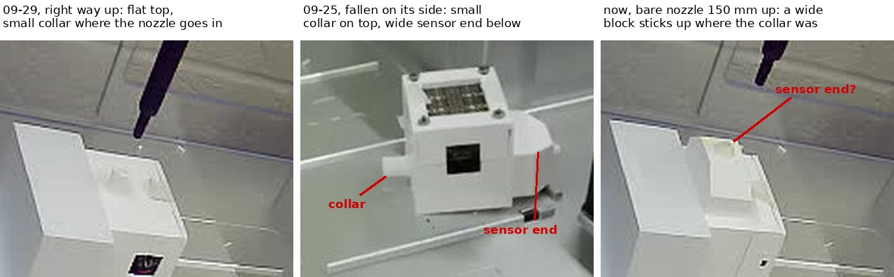

# Enclosure back in its socket, but upside down: stopped before the pick-up

**2026-09-29 23:50 – 2026-09-30 00:08 MDT. Asked on [PR #202](https://github.com/vertical-cloud-lab/byu-vcl/pull/202):
test that the enclosure won't fall off (over the base, so a slip lands back in its
pocket), pressing a little deeper, then run the height calibration, and keep going
until the job is done, the enclosure falls during a carry, or it can no longer be
picked up.** It stopped at the last condition, before anything touched the
enclosure. It had been put back in the right-hand socket (A2) upside down: its wide
sensor end was standing up where the small collar the nozzle presses into had been.
Pressing into that would have pushed the nozzle into the sensor end.



## What was checked, and how

- **Robot:** answered on the link (0.85 ms), API 8.8.1, no run open, rail lights off.
- **Sensor board: not answering.** From the runner the broker connected and passed
  `check_delivery`, but the board sent nothing in 2 × 20 s. It was last heard at
  17:33 MDT, just after the 09-29 fall.
- **Livestream:** the stream titled "OT-2 stream picam-ot2" still shows a
  different machine (frame at 23:57:24), so the robot's own camera was the only view.
- **The enclosure, robot camera, rail lights on and off:** a different face is
  towards the camera than on 09-25 and 09-29. It is the face with a vertical seam and
  a small black dot, not the face with the black square label. On top, a wide block
  stands above the enclosure's top face, where the collar used to be (panel 3).

**Why that block is the sensor end.** The 09-25 livestream shows the enclosure's
shape (panel 2): a box with a small cylindrical collar on top and a wider block at
the bottom, around the sensor. The block in panel 3 is about half the box's width;
the collar is about a fifth. The collar is not visible anywhere on top.

**How high it stands.** At the socket's X and Y, the bare nozzle's tip is at image
row 43 at z 150, row 72 at z 120 and row 90 at z 99 (the last two from 09-29, same
camera). The block's top face spans rows ~73–87. If the block is centred under the
nozzle, its top is at about z 111. The top face's depth makes that ±8 mm, so
**z ≈ 105–120**, against z ~99 for the collar's mouth. The old alignment stop at
z 120 might just have cleared it. The pick-up ladder below it (z 105, 101, 99, then
the press to 89) would not have.

## What moved

Only the bare nozzle, and only down to z 150 over the socket:

| MDT | step |
| --- | --- |
| 00:05:01 | maintenance run `5ec25ae8`, homed, rail lights on |
| 00:05:29 | bare nozzle to (92.8, 316.5, 150), photo (panel 3) |
| 00:07:58 | homed without descending further |
| 00:08:28 | run closed, rail lights back off |

Nothing touched the enclosure or the base.

## What changed in the script

[`enclosure_height_cal.py`](enclosure_height_cal.py), simulated end to end on the
runner (`--simulate`) with the flags below before the robot moved:

- **The bare nozzle's first alignment stop is z 150** (was 120). From there it comes
  down only by `align` commands, one photo each.
- **The carry leaves and comes back high over the base.** Up to `--approach-z`
  (default 150, foot ~65 mm off the deck) over the pocket, straight out to the front
  to `--approach-y` (default 220; the base's front edge is at y 271.5), then down to
  `--carry-z`. The return is the reverse, then straight down into the pocket, with a
  photo at z 130 before it goes in. On 09-29 the return stayed at z 125 (foot ~40 mm
  off the deck) all the way to the base, and the enclosure was found on the deck
  against the base's front, in its own column. That is where a foot catching the
  front edge would leave it. A slide off the nozzle would more likely have landed it
  somewhere along the 274 mm leg. This is an inference from where it landed; there
  was no video.
- **The long leg along the socket's column is split every `--leg` mm** (default
  60), with a photo at each stop. The stops are the same on the way out and back, so
  each return photo has an outbound twin at the same pose, and a slide down the
  nozzle shows as a difference between them.

## Before the next attempt

1. Someone puts the enclosure back in A2 **right way up**: collar on top, black
   square label facing the front, as on 09-29. It has now fallen twice (09-25 ~85 mm,
   09-29 ~40 mm), so look it over.
2. Check that the sensor board turns on. It is not needed for the height (that comes
   from the camera), but it is for the light-based grip check and every colour
   reading.
3. Then, from a fresh working folder on the Pi, with the `xscan` venv:

   ```
   ~/.venvs/xscan/bin/python -u enclosure_height_cal.py --press-z 89.0 --carry-z 125 \
       --carry-segment 400 --drop-dx 0 --max-speed 3 --no-live [--no-sensor]
   ```

   `align 92.8 316.5 130`, `120`, `110`, `102`, each checked against 09-29's photos,
   then `pickup` and `down` in ≤ 2 mm steps to 89.0. `lift 93`, then the in-pocket
   shake at the carry's speed. The 09-29 pass was 240 jolts. Aim for more, and for
   longer stepping, closer to the 91 s leg: `jiggle y 0.3 40 3`, `jiggle x 0.3 40 3`,
   `jiggle z 1.0 20 3`, then `jiggle y 0.3 40 3` and `jiggle x 0.3 40 3` again,
   comparing each photo with `grip_shift.py`. A slip there drops it a millimetre or
   two into its pocket. Release it (`release-here`), pick it up again and carry on.
   Then `up 110`, `carry`, the ladder over the plate (09-29: touches at z ≈ 98.9,
   just above at 99.5; re-measure, since a deeper press may change how it hangs), and
   `return`.

## Files

| file | what |
| --- | --- |
| [`enclosure-upside-down-2026-09-30.jpg`](enclosure-upside-down-2026-09-30.jpg) | 09-29 right way up; the enclosure's shape from the 09-25 fall; now |
| [`enclosure_height_cal.py`](enclosure_height_cal.py) | z 150 first stop, `--approach-z`, `--approach-y`, `--leg` |

On the Pi (`RPI_STREAM_CAM_HOSTNAME`): `~/enclosure-cal-0930/`, with the three
robot-camera photos, `log.txt` and `run.out`. No services, timers or settings were
changed.
