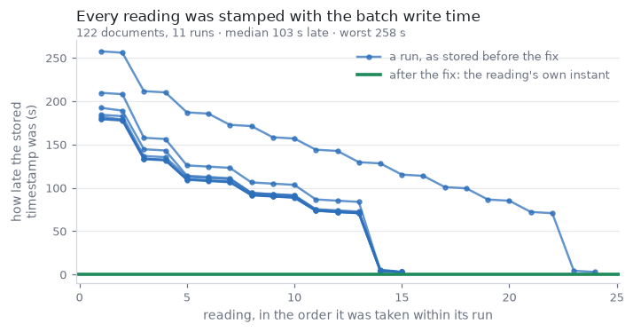

# Did PR #201's timestamp fixes actually work?

**2026-09-10, 03:05–03:15 UTC. 39 of 40 checks pass. No robot motion — nothing
was sent to the OT-2 at all.** The one failure is not the fix: the sensor board
is asleep and did not answer, so the only leg that could not be exercised
against real hardware is *sensor → timestamp*.

Everything here is reproducible:

```bash
python3 test_measurement_timestamps.py          # offline, 25 checks, no network
python3 test_measurement_timestamps.py --live   # + MQTT, Atlas: 40 checks
```

## What PR #201 claimed, and what happened when it was tested

| # | claim | verdict |
| --- | --- | --- |
| 1 | `sensor_read.read()` brackets each reading with `t_request_utc` / `t_response_utc` from the same clock read that mints `experiment_id` | **holds** — proven against a fake broker; the ISO strings, the epoch fields and the id all agree to the millisecond, and the pair brackets an independent outside measurement of the same call |
| 2 | `store_in_mongodb` writes the reading's own instant as `timestamp` and keeps the write time as `stored_at` | **holds, end to end against Atlas** — the instant survives BSON with 0.0 ms drift, two readings 163 s apart stay 163 s apart in the database, `stored_at` is separate and later |
| 3 | `stream_index.py` turns those instants into livestream links, with a −67 s archive correction | **holds** — the committed index regenerates byte-for-byte, 114/114 readings link, and all 27 frames' OCR'd clocks match the readings they belong to (worst error 0.8 s) |

## The bug is still measurable in the database, which is the clearest proof

`digital-wetlab.sensor-data` holds 122 pre-fix documents from 11 runs. Recovering
each reading's true instant from the epoch-ms in its `experiment_id` and
comparing it with the `timestamp` that was stored:

* the stored value was **always later, never earlier** — minimum 2.8 s
* **median 103 s late, worst 258 s**
* every multi-reading run collapsed onto **one** instant (one run has two
  distinct values, 1 ms apart — its write loop straddled a millisecond boundary,
  which is the same defect, not an exception)



The sawtooth is the signature: within a run the lateness falls linearly toward
zero, because every document was stamped when the batch was written rather than
when it was read. Regenerate with `plot_timestamp_lag.py --from-cache`.

**No document has yet been written by the fixed code** — 0 of 122 carry
`stored_at`. The fix landed after the last run, so section 9 of the test is the
first time it has run against the real database.

## What could not be tested, and why

**The board did not answer.** The broker link is healthy *from the runner
itself* — `check_delivery` round-trips our own probe, so credentials and
subscription are fine — but three read attempts over 45 s got nothing. Checked
on the stream-cam Pi: there is **no `2e8a` device on USB** (only the Arduino on
`ttyACM0` and a CH340 on `ttyUSB0`), so the board is on battery in the
enclosure, not tethered. Last reading on record is 2026-09-09 02:40 UTC, about
24 h earlier. A flat battery is the simple explanation.

So section 8 verified the read path against a *fake* broker rather than the
AS7341. When the board is back, `--live` closes that gap in about a minute.

## Two things found while testing

**`t_request_epoch` could disagree with `experiment_id` by 1 ms.** The id
truncated (`int(t * 1000)`) while the field rounded (`round(t, 3)`), so about
half of all readings had an id and a field that differed by one millisecond —
harmless for a measurement, but it makes the two stop being interchangeable for
anything matching on them, and the docstring claimed they "cannot disagree".
`sensor_read.py` now truncates to whole milliseconds once and derives the id,
both ISO strings and both epoch fields from that single value.

**The −67 s archive correction is a constant, and it is only right past the
step.** For `bQDrYpT3vaE` the offset is ~−6 s at the very start of the stream
and +67 s from the third hour onward. Every 2026-09-09 reading sits at video
offset 22 000–26 900 s, well past the step, so one constant is correct for all
114 — but a future session whose readings fall in a stream's first hours needs
`--offset-shift` set for that segment, or the OCR loop in
`frames_from_stream.py` to establish it. Nothing warns you if you get this
wrong; the links simply look plausible.

## Incidental confirmations

* Both clocks in the chain are right: the runner is within 0.9 s of an internet
  time source, and the Pi that draws the burned-in overlay has NTP active and
  agrees with the runner to ~0.1 s (SSH round trip included).
* **MQTT works straight from a GitHub Actions runner** — no Pi, no tailnet.
  Only the OT-2 HTTP API and the YouTube frame grabs need the Pi.
* The 27 committed spectra regenerate from the index, still 300 px wide.
