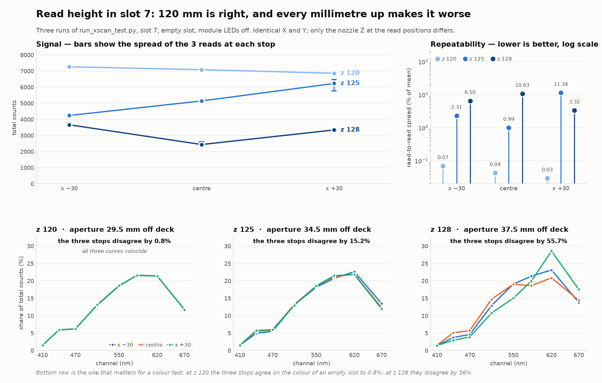

# Read height in slot 7: z 120 vs 125 vs 128

**2026-09-09 · `OT2CEP20210722R13` · slot 7, empty · module LEDs off (`--rgb 0,0,0`)**

Requested on [#197](https://github.com/vertical-cloud-lab/byu-vcl/issues/197): repeat the
slot 7 scan 3 mm higher than the previous run. Combined with the two runs earlier the same
day, that gives a three-point height series in which **only the nozzle Z at the read
positions changes** — same slot, same X, same Y, same settle time, same pickup, same room.

```
run_xscan_test.py --scan-slot 7 --read-z 128
```

The cycle completed with no aborts: seated 440 → grip check 2329 (**5.3×**, threshold 2.0)
→ three positions × 3 reads → reseat confirmation **439**.



## The answer

**z 120 is the right height of the three, and it is not close.** Every measure degrades
monotonically as the nozzle goes up.

| | z 120 | z 125 | z 128 |
| --- | --- | --- | --- |
| Aperture off the deck | 29.5 mm | 34.5 mm | 37.5 mm |
| Mean total counts | **7069** | 5203 | 3147 |
| Worst read-to-read spread | **0.07 %** | 11.34 % | 10.63 % |
| Spread across the 3 X stops | **5.7 %** | 38.2 % | 39.0 % |
| **Disagreement in spectral shape between the 3 stops** | **0.8 %** | 15.2 % | 55.7 % |

The last row is the one that decides a colour test. It is the largest relative difference,
across the three X stops, in any channel's *share* of the total — i.e. how much the three
stops disagree about the **colour** of the slot, with intensity divided out. At z 120 the
instrument reports the same colour at all three stops to within 0.8 %. At z 128 it disagrees
with itself by 56 % — larger than the difference between two of the paints.

## The three positions at z 128

Mean of 3 reads. Same Y (225.0) and Z (128.0) at each stop; only X changes.

| X (mm) | dx | 410 | 440 | 470 | 510 | 550 | 583 | 620 | 670 | **total** |
| --- | --- | --- | --- | --- | --- | --- | --- | --- | --- | --- |
| 33.88 | −30 | 53 | 137 | 168 | 473 | 699 | 782 | 847 | 505 | **3663** |
| 63.88 | centre | 37 | 124 | 139 | 359 | 464 | 454 | 508 | 351 | **2436** |
| 93.88 | +30 | 48 | 97 | 130 | 359 | 502 | 666 | 954 | 586 | **3342** |
| — | *seated* | 6 | 4 | 10 | 168 | 174 | 39 | 21 | 18 | *440* |

Individual reads: −30 `3533 / 3771 / 3686`, centre `2607 / 2348 / 2353`,
+30 `3274 / 3368 / 3385`.

## Two earlier conclusions this run revises

**1. "The spectral shape is identical in all three conditions."** Recorded after the z 125
run, from the shape of the plotted curves. Computed rather than eyeballed, it holds only at
z 120 (0.8 %). At z 125 the 440 nm share already varies by 15.2 % between stops, and at
z 128 by 55.7 %. The gross shape — a rise to a 583/620 nm peak — does persist everywhere;
what stops persisting is the *proportion*, which is exactly what a colour measurement is.

**2. The inverse-square fit was a coincidence of one point.** The z 125 run noted that the
centre-position falloff (0.726) matched a point source at 29.5 → 34.5 mm (0.731). Extended
to a third height it does not survive:

| position | measured 120→125 | measured 120→128 |
| --- | --- | --- |
| −30 | 0.583 | 0.504 |
| centre | **0.726** | 0.344 |
| +30 | 0.908 | 0.487 |
| *inverse square predicts* | *0.731* | *0.619* |

One of six ratios lands on the prediction. There is no single point source; raising the
aperture changes *which* ambient light reaches it, not just how much.

## What to use

- **Read at z 120.** Of the heights tested it is the only one where the sensor gives the
  same answer twice (0.07 % vs 10 %) and the same colour at different X (0.8 % vs 56 %).
- **Lower may be better still** — the trend points that way — but z 120 is the lowest read
  height ever run with the module on the nozzle, so anything below it is outside the proven
  envelope and wants a human watching the first descent. Not attempted here.
- **Set `--rgb` before drawing conclusions about paint.** Every run in this series was taken
  with the module's own LEDs off, so these are ambient-light readings. The height ranking is
  a property of the geometry and should carry over, but the absolute numbers will not.
