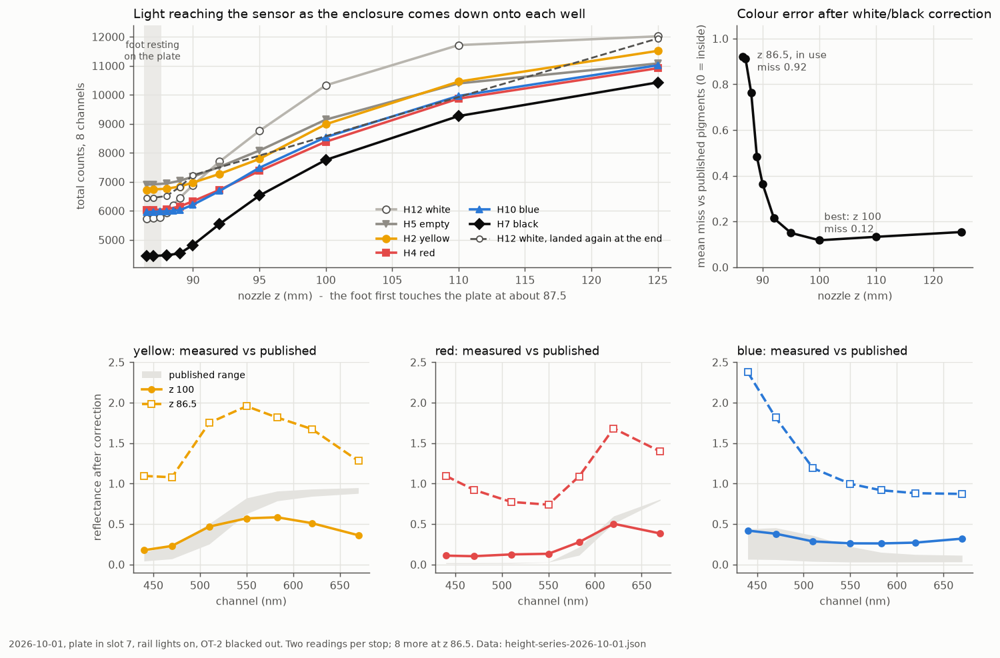

# 2026-10-01 — read height, gain and integration time: what changes the accuracy

Asked on [PR #202](https://github.com/vertical-cloud-lab/byu-vcl/pull/202): so far
only the physical setup has been changed; try changing how the sensor is used
instead — the read height, the gain, how long each reading takes, and anything
else the manufacturer says matters. Remember the read height in use. The OT-2 is
now mostly blacked out (cardboard and a piece of wood, temporary).

The linked claude.ai conversation could not be read: it needs a claude.ai login
(tried from the runner, from the Pi and in a real browser). The manufacturer's
datasheet, ams OSRAM [DS000504 v3-00](https://look.ams-osram.com/m/24266a3e584de4db/original/AS7341-DS000504.pdf),
stands in for it below.

## Answers

| factor | tried? | what it does here |
| --- | --- | --- |
| **height** | yes, 10 heights × 6 wells | the biggest lever. Resting on the plate (z 86.5) is the *least* accurate height; ~12 mm above it (z 100) the most. Contact's error was overstated ~2× (see the correction in §1) |
| **landing** | yes, H12 twice | landing on the same well again read **12%** more light. Not chance: the H10 landing in between pushed the enclosure ~0.7 mm up the nozzle (§2, corrected 10-02) |
| **repeats / time** | yes, 16 in a row | one landing already repeats to **0.04–0.12%** per channel. More readings, or longer ones, cannot fix a 12% landing error |
| **rail lights off** | yes | 400 counts = the board's own green lamp. **The blackout leaves no measurable room light** |
| **gain** | **no** — needs firmware | fixed in the board's `main.py`; and it was never set (below). Firmware change ready in [`../pico/`](../pico/) |
| **integration time** | **no** — needs firmware | the same |

## The run

One pick-up, one carry, 13:43–14:10 MDT, maintenance run `ec3d711f`.

- **The deck had changed since 09-30:** the plate had been moved by hand from slot 1
  to **slot 7**, directly in front of the base, and the enclosure was in the
  right-hand socket (A2), label to the front. `enclosure_height_cal.py` only allowed
  slot 1, so it gained `--plate-slot` (dry-run end to end with `--simulate` first).
- Pick-up at A2 (92.8, 316.5): the bare nozzle at z 102 was over the collar at the
  same pixel as 09-30's A2 pick-up; pressed 99 → 89 in ≤2 mm steps (enclosure
  +0.65 px, base 0.00). Lift to z 93: −2.12 px; after 160 jolts (y and x, 0.3 mm,
  3 mm/s): −2.09 px, no slip. Grip check at z 110: 9.2×.
- Carried via z 190 to H12. Each well was then read at nozzle z 125, 110, 100, 95,
  92, 90, 89, 88, 87 and 86.5 (two readings per stop, plus 88.5 and 87.5 on H12 and
  H10), then 8 more at z 86.5. Order: H12 white, H10 blue, H7 black, H5 empty, H4
  red, H2 yellow, and H12 again.
- Returned via z 190 and released into A2: 471 counts after the release, 463 homed
  (441 before the pick-up). Lights off, run closed.

**Where the foot touches.** Over H12 the light fell 247, 266 and 164 counts per
0.5 mm from z 89 to 87.5, then 20 and 18: the foot lands at **z ≈ 87.5**, ~0.5 mm
lower than the slot-1 H row on 09-30. So **z 86.5 presses ~1 mm past first
contact** here, close to the ~1.4 mm Tim picked over A1.

## 1. Height: resting on the plate is the least accurate height tested

At every height the three colours were calibrated against *that height's* white
(H12) and black (H7), the 09-30 method, and scored against the published pigment
ranges at 440–670 nm (21 values) as in
[`analyse_white_black_correction.py`](analyse_white_black_correction.py):

| nozzle z | gap | miss | black reads | squeeze | R² | colour channels brighter than white (of 21) |
| --- | --- | --- | --- | --- | --- | --- |
| 125 | ~37.5 mm | 0.154 | 0.28 | 2.36× | 0.53 | 0 |
| 110 | ~22.5 mm | 0.133 | 0.21 | 3.06× | 0.60 | 0 |
| **100** | **~12.5 mm** | **0.118** | **0.20** | 2.68× | 0.65 | 0 |
| 95 | ~7.5 mm | 0.150 | 0.28 | 2.23× | 0.59 | 0 |
| 92 | ~4.5 mm | 0.214 | 0.38 | 1.66× | 0.73 | 0 |
| 90 | ~2.5 mm | 0.365 | 0.53 | 1.46× | 0.73 | 7 |
| 89 | ~1.5 mm | 0.484 | 0.64 | 1.38× | 0.67 | 9 |
| 88 | ~0.5 mm | 0.763 | 0.89 | 1.25× | 0.44 | 14 |
| 87 | pressed ~0.5 mm | 0.912 | 1.03 | 1.19× | 0.37 | 15 |
| **86.5** | **pressed ~1 mm** | **0.920** | 1.04 | 1.18× | 0.36 | **16** |

(miss: mean distance outside the published range, 0 = inside. Black reads: what a
perfectly black paint would read, 0 = accurate. Squeeze: how many times too small
colour differences come out, 1 = accurate. Gap: foot above the plate's top, from
the touch at z ≈ 87.5.)

> **Correction, 2026-10-02.** The white in this table was read on the first H12
> landing, *before* the H10 landing pushed the enclosure up the nozzle (§2). The
> black, the empty well, the red and the yellow were all read after it. Re-scored
> with the white from the second H12 landing, which was read in the same state as
> the rest ([`landing_shift.py`](landing_shift.py)):
>
> | nozzle z | 90 | 89 | 88 | 87 | 86.5 |
> | --- | --- | --- | --- | --- | --- |
> | miss, as in the table | 0.365 | 0.484 | 0.763 | 0.912 | 0.920 |
> | miss, second-landing white | 0.269 | 0.344 | 0.426 | 0.441 | **0.442** |
> | black reads | 0.45 | 0.52 | 0.59 | 0.60 | 0.60 |
> | colour channels brighter than white | 4 | 5 | 8 | 8 | 8 |
>
> Contact is about half as bad as the table says, but it is still the worst height,
> and z 100 (0.118) is still the best. No second-landing white exists above z 90.
> The shift matters less with height (+5% at z 90, −0.6% at z 125), so those rows
> should move less. The blue (H10) was read during the landing that moved the
> enclosure, so its state is unknown.

**Why contact fails: the white stops being the brightest well.** At z 86.5 the
empty well read 1.21× the white in total, yellow and red read up to 1.18× it at
620 nm, and blue 1.44× it at 440 nm. A white/black correction assumes the white
is the brightest thing on the plate; here 16 of the 21 colour values come out
above it, so they calibrate to reflectances of 1.1–2.4, which no paint has.
In contact the enclosure shades the well from above, and what reaches it comes
up through the clear plate from the deck below — and an opaque white paint film
blocks that light, while thin colours and an empty well let it through. Lifted,
the rail light reaches the paint from above and the white is brightest again at
every height from z 92 up.

**z 100 is the best of the ten, not accurate.** It has the lowest miss and the
lowest floor (where a pigment is near-black the colours read 0.10–0.32, against
0.24–0.36 on 09-30), and all three shapes are right. But the squeeze is 2.7×:
at 12 mm the sensor also sees the empty wells and deck around the well, which
dilutes every colour towards grey. 92–95 is the compromise if the squeeze matters
more than the floor.

**Caveat: the paints are ~19 hours old.** On 09-30 the same wells, read wet at
z 86.5 from slot 1 before the blackout, scored miss 0.14 — today's contact
readings score 0.92. Drying, the slot move and the blackout all changed between
the two, so this run cannot say which made contact fail. It does say that today,
on this plate, lifting the enclosure helps and resting it hurts.

## 2. Landing: the same well twice differs by 12%, because the H10 landing moved the enclosure

> **Corrected 2026-10-02** ([`landing_shift.py`](landing_shift.py)). This section
> first said the robot camera showed the two landings "identical to the pixel"
> (phase correlation 0, 0). That check only resolved whole pixels. Measured to
> ~0.01 px, the enclosure *had* moved, by under a millimetre, during one landing.

H12 was read first at 13:51 and again at 14:06, in the same pick-up, approached the
same way (+x at z 125, then down):

| nozzle z | 125 | 90 | 89 | 88 | 87 | 86.5 |
| --- | --- | --- | --- | --- | --- | --- |
| 2nd landing − 1st, total | −0.6% | +5.0% | +5.8% | +9.8% | +12.2% | +12.3% |

Each landing repeats to 0.1% on its own (§3), and the free-hanging light over H12 at
z 125 drifted only −0.95% over the run (12,056, 11,978, 11,942), so this is not the
lamp or the sensor.

**What moved, and when.** Every landing starts and ends with a robot-camera photo at
z 125 over the same well, so each before/after pair brackets one landing. In each
pair the enclosure, the nozzle and two fixed controls were registered separately,
and each shift converted to the upward travel a real Z move gives in this camera
(+0.52, −0.66 px per mm, from the run's own z 125 → 90 step):

| landing (run order) | 1. H12 white | 2. H10 blue | 3. H7 black | 4. H5 empty | 5. H4 red | 6. H2 yellow |
| --- | --- | --- | --- | --- | --- | --- |
| enclosure front | −0.12¹ | **0.88** | 0.00 | 0.01 | 0.00 | −0.01 |
| enclosure top | 0.02 | **0.55** | 0.00 | 0.02 | 0.00 | 0.02 |
| nozzle | 0.05 | 0.15 | 0.00 | 0.03 | 0.03 | 0.01 |
| tip rack (control) | 0.03 | 0.02 | 0.02 | 0.02 | 0.02 | 0.01 |

(mm of upward travel. ¹ a 0.19 px sideways shift, not along Z.)

Only the landing on **H10** moved it. The enclosure rose ~0.7 mm on the nozzle, more
at the front than at the top, so it also tilted slightly. The plate, the deck and the
camera stayed put (≤ 0.1 mm over the whole run). 0.7 px is invisible to a whole-pixel
check and to the eye.

**What that did to the light.** On the second visit the enclosure hung ~0.85 mm higher:
its light at z 89–90 matches the first visit's at +0.85 mm. Resting on the plate, it
let in exactly the light of the first visit **hovering at z 89, 1.5 mm above the
plate**: all 8 channels agree within 0.7%. So the foot no longer sat down against the
plate the way it had on the first landing. That is also why the extra light has the
"bluish" spectrum of the light that gets in under a raised foot.

**Why H10, probably.** Over H10 the light stopped falling earlier than over any other
well, at z ≈ 89. From z 89 to 88 it fell 37 counts, against 65–515 elsewhere. If
that is where the foot met the plate, that landing pressed ~2.5 mm past first touch,
not the ~1–1.5 mm of the others. Why it met resistance early there isn't known.

The 09-30 runs saw the same thing, smaller ("the landing alone moves it", red read
twice).

## 3. Repeats and reading time

- **One landing:** 16 readings on H12 in 22 s: totals 5,724–5,730; per-channel
  standard deviation 0.0–0.68 counts, **0.04–0.12%**. Before the blackout, readings
  at one landing agreed to ~0.7%. Averaging more readings, or longer ones, shrinks
  an error that is already 100× smaller than the landing error.
- **Drift:** −0.06%/min at a fixed pose. Read the white and black within ~10 min of
  the colours if 0.5% matters.
- **Settling:** none needed; the first reading after each move matched the rest.

## 4. Gain and integration time (not tried: needs firmware)

The board's `main.py` builds `Sensor()` with fixed settings and ignores everything
in a read command except `experiment_id` (`R`/`Y`/`B` are paint volumes it never
reads). There is no way to change gain or integration time over MQTT, and no
WebREPL, so changing them takes one USB visit.

**The gain was never set.** Upstream `as7341_sensor.Sensor.__init__` calls
`set_again(128)`, but `set_again()` takes a *code* (0–10, where 8 = 128x) and
silently ignores anything out of range. So the chip stays at its power-on AGAIN,
code 9 = **256x** (DS000504, CFG1 0xAA, default 9). The reply time fits: every
reading on record took 1.35–1.42 s command-to-reply, ±20 ms, which needs the
2 × 558.8 ms integration of `atime=200, astep=999`. Caveat: the board's own files
were backed up on 2026-09-03 (`~/pico-backups/` on the Pi) with an older wrapper
(`atime=100, gain=8` → code 8 = 128x, 2 × 280.8 ms); the timing rules that version
out unless something else adds ~0.8 s per reading. Reading register 0xAA settles
it, and the firmware change below reports it in every reply.

> **Correction, 2026-10-09.** Register 0xAA settled it the other way: the board still runs
> that older wrapper, and the chip read CFG1 8 (**128x**), ATIME 100, ASTEP 999. Something
> else does add ~0.8 s per reading: on 10-09, 2 × 280.8 ms of integration gave the same
> 1.41–1.43 s round trip. The firmware change below was withdrawn, and a gain-only one
> installed instead; see [`../pico/README.md`](../pico/README.md).

**What more gain or integration would and would not do:**

- The brightest channel at the plate is 1,464 counts and 2,402 hanging at z 125:
  **2–4% of the 65,535 full scale.** There is ~25× headroom.
- The 410 nm channel reads 66–107 counts, where one count is 1–1.5%. That channel
  would gain resolution from more counts; the other seven are already at
  0.04–0.12% noise.
- **Gain and integration time scale the paint's light and the stray light
  equally.** They cannot change the 12% landing error or the light coming up
  through the plate.
- The manufacturer's gain ratios are not exact powers of two: 256x is 3.75–4.25×
  and 512x is 7.25–8.25× the 64x response (DS000504 Fig. 17). **Re-read the white
  and black at every gain**; never mix gains in one calibration.

## 5. Other manufacturer factors (DS000504)

- **Light should arrive through a diffuser.** Every channel's response in the
  datasheet is measured with an ED1-C50 diffuser on top of the package; the filters
  are "nano-optic deposited interference" filters behind a built-in aperture, with a
  half-cone acceptance of 40°. Whether our enclosure has a diffuser over the sensor
  is not recorded — worth checking, because interference filters respond
  differently to light arriving at an angle, and in contact most of the light
  arrives at an angle, through the plate.
- **Dark counts** are 0–3 (ADC 0–4) and 0–5 (ADC 5) at 512x and 98 ms, with
  auto-zero before every integration. Negligible here.
- **Flicker:** the chip has a 50/60 Hz flicker channel. The 0.1% repeatability says
  the rail lights don't flicker at a level that matters for 558.8 ms integrations.
- **Temperature:** rated −30 to 85 °C; the −0.06%/min drift is small enough not
  to need correcting yet.

## 6. The light under blackout

With the enclosure on the white well and the rail lights **off**, the reading was
`[4.5, 2.0, 8.0, 162.2, 169.0, 33.7, 13.2, 8.3]` (410 → 670 nm), the same as the
board's own green lamp sealed in its base on 2026-09-10 (`4, 3, 8, 160.5, 168.5,
35, 16, 11.5`). **No measurable room light reaches the sensor.** Every count with
the lights on is the rail lights' light. Turning them back on returned the reading
to within 0.1% in 3 s.

So the light's colour is now fixed by the rail lights alone. With the enclosure 37 mm
above the white well (z 125) the reading is `[192, 974, 902, 1610, 2191, 2393, 2348,
1405]`: a white LED's shape, strong at 440 nm, weak at 410 nm. That is the
illuminant every reflectance here is measured under; it is the next thing to
characterise properly once the blackout is finished.

## What to do next

1. **Change the read height to ~z 95–100**, or test it once more on fresh, wet
   paint before deciding. It is the one change in this run that made the
   calibration better instead of worse.
2. **Stop pressing hard onto the plate.** The one landing that pressed furthest past
   first touch (H10, probably ~2.5 mm) pushed the enclosure ~0.7 mm up the nozzle,
   and every later contact reading inherited it. Reading lifted (item 1) avoids the
   press entirely. If contact is kept, read the white and black in the same pick-up
   as the colours, and re-read the first well at the end: a change there means the
   enclosure has moved. A key or flat on the collar, or a printed sleeve, would stop
   it turning or tilting on the nozzle.
3. **One USB visit to flash [`../pico/`](../pico/)**, then sweep gain (64–512x) and
   integration (ATIME 100–255) over white, black and one colour.

## Files

| file | what |
| --- | --- |
| [`height-series-2026-10-01.json`](height-series-2026-10-01.json) | all 242 readings with pose, well, paint, visit and lights state |
| [`analyse_height_series.py`](analyse_height_series.py) | the scoring and the chart |
| [`height-series-analysis-2026-10-01.json`](height-series-analysis-2026-10-01.json) | per-height scores, repeatability, lights-off reading |
| [`height-series-2026-10-01.png`](height-series-2026-10-01.png) | the chart |
| [`landing_shift.py`](landing_shift.py) | 10-02: which landing moved the enclosure, from the photos; the second landing's light; the re-scored near-plate heights |
| [`landing-shift-2026-10-01.json`](landing-shift-2026-10-01.json), [`.png`](landing-shift-2026-10-01.png) | its output |
| [`photos-2026-10-01/`](photos-2026-10-01/) | the 14 robot-camera photos it reads (z 125 before and after each landing, plus z 90), from `~/color-read-1001/enc/` on the Pi |
| [`../pico/`](../pico/) | the firmware change for gain and integration time |
