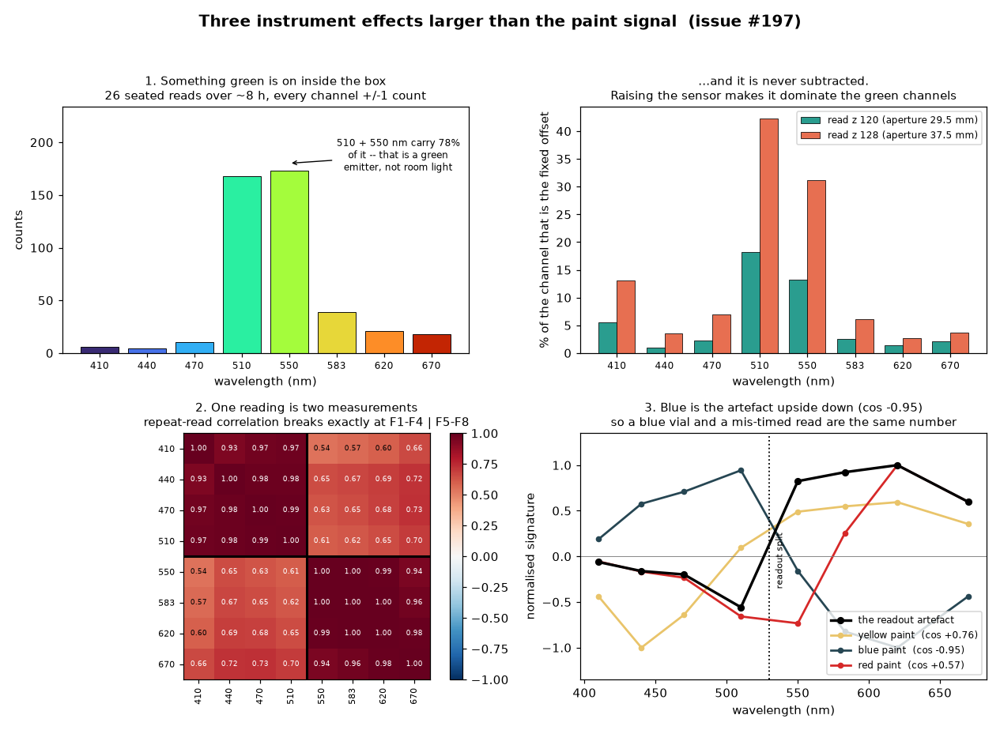

# Yes — there are three other causes, and one of them is why it is always *yellow*

**Question (issue #197):** `ac-dev-lab#552` blames ambient light, but their sample was thin
columns in a transparent part; ours is a vial with a ~3/4 in top. Is something else going on?

**Answer: yes.** Three instrument-side effects, all measurable in the data already committed,
are each larger than the signal a diluted-paint vial can produce. None of them is ambient
light, and none of them goes away with blackout curtains.

No hardware was touched to establish any of this — it is a re-analysis of the seven
`xscan-*.json` runs. Reproduce with `python3 analyse_instrument_artefacts.py`.

---

## 1. There is a green light on inside the enclosure, and it is 47% of ch510

Every time the module sits closed on its base the sensor reports **439 counts**, and the
shape is not room light:

| | 410 | 440 | 470 | **510** | **550** | 583 | 620 | 670 |
| --- | --- | --- | --- | --- | --- | --- | --- | --- |
| mean of 26 reads | 6.00 | 4.15 | 10.12 | **167.9** | **173.2** | 38.77 | 21.12 | 17.96 |
| std dev | **0.00** | 0.36 | 0.32 | 0.51 | 0.68 | 0.64 | 0.58 | 0.44 |

Those 26 reads are spread over **seven runs and about eight hours**, with people walking up
to the open machine in between. `ch410` was exactly `6` on all 26. Ambient light does not do
that. A narrow peak straddling 510 and 550 nm with a steep drop to 470 and 583 is a **green
LED at roughly 525–535 nm** — the Pico W's onboard status LED, or the power LED on the sensor
breakout, seen directly or by one bounce off the housing wall.

**It is added to every single reading and has never been subtracted.** Because it is a fixed
*additive* term, its share of the total changes whenever the total changes:

| | ch510 | ch550 |
| --- | --- | --- |
| read z 120 (aperture 29.5 mm) | 18% | 13% |
| read z 128 (aperture 37.5 mm) | **36 – 47%** | **25 – 37%** |

So at the height the paint runs used, **between a third and a half of the green channel is the
board's own indicator**, and the fraction is different at each scan position (36%, 47%, 47%)
purely because the total signal is different there. That alone bends the normalised spectrum
from position to position with no sample present.

*This one is free to fix:* subtract the seated vector before normalising. It is already
recorded at the start and end of every run.

## 2. One "reading" is two measurements taken at different times

The AS7341 has 11 photodiodes and **only 6 ADCs**. The eight spectral channels cannot be
sampled simultaneously: every driver configures the SMUX for **F1–F4**, integrates, then
reconfigures for **F5–F8** and integrates again. A "spectrum" is two measurements
concatenated.

That boundary sits between **ch510 and ch550** — and the data breaks there and nowhere else.
Taking the 72 repeat reads and correlating each channel's deviation from its own position mean:

| split tried | 410\|440 | 440\|470 | 470\|510 | **510\|550** | 550\|583 | 583\|620 | 620\|670 |
| --- | --- | --- | --- | --- | --- | --- | --- |
| within − across | +0.054 | +0.068 | +0.157 | **+0.325** | +0.137 | +0.020 | −0.036 |

Within F1–F4 the channels correlate at **+0.970**; within F5–F8 at **+0.978**; across the
split, **+0.649**. Note what this rules out: 410 and 510 are 100 nm apart and correlate at
0.97, while 510 and 550 are 40 nm apart and correlate at 0.61. **Spectral adjacency does not
predict this. ADC scheduling does.**

The half-to-half mismatch on a single read reaches **12.4%**, median 0.19%.

> *The honest alternative:* two illuminants mixing in varying proportion (cool overhead LED +
> warm bounce) would also produce block structure, since white LEDs have a phosphor dip near
> 480–500 nm. But that model predicts 510 and 550 — both on the phosphor hump — should track
> each other closely. They are the *least* correlated adjacent pair in the matrix. The
> firmware is on the board, not in this repo, so the mechanism is inferred rather than read;
> §"What to do" below has a three-line test that settles it.

## 3. Yellow paint and a mis-timed readout are the same measurement

This is the part that answers "why is it always yellow."

Yellow pigment absorbs below ~480 nm and passes everything above. The readout artefact
scales F1–F4 differently from F5–F8. **These are nearly the same operation on the spectrum.**
Cosine similarity of each pigment's signature against the artefact's:

| | vs. the readout artefact |
| --- | --- |
| **blue paint** | **−0.954** |
| **yellow paint** | **+0.761** |
| red paint | +0.566 |

- **Blue is the artefact upside down.** A real blue vial and "the first ADC cycle caught more
  light" are, to within 5%, the same number. Blue cannot register as anything but noise.
- **Yellow is the artefact right way up**, which is why it "appeared" — and why it appeared
  over an empty slot too.
- Red is the only one with structure the artefact cannot imitate, and red is the band the
  warm ambient spectrum already saturates.

Applying this to the x = 33.88 feature that was reported as yellow on 2026-09-09: it matches
real yellow pigment at **+0.808** and matches a pure readout half-step at **+0.804**. Those
are not distinguishable. The measurement does not contain the information needed to tell them
apart.

## 4. On the 3/4 in top surface

It is a fair point and it helps — but not as much as it looks, and it got worse at every
height increase this issue asked for. The AS7341 sees a ~±20° cone with no lens:

| read z | aperture above deck | spot on the deck | a 19.05 mm vial fills |
| --- | --- | --- | --- |
| 120 | 29.5 mm | 21.5 mm | **79%** |
| 125 | 34.5 mm | 25.1 mm | 58% |
| **128** | 37.5 mm | 27.3 mm | **49%** |
| 129 | 39.0 mm | 28.4 mm | 45% |

At the height the paint runs used, **more than half of what the sensor sees is bare deck.**
Exclude the glass wall and the meniscus ring, which return specular white rather than sample
colour, and the clear-liquid disc is nearer **26%**.

Then the harder part: **a transparent vial viewed from above is not a reflector, it is a
double-pass filter over the deck.** The deck is the reflector; the liquid attenuates on the
way down and again on the way up. So

> contrast = *f* · (1 − *T*²)

with *f* the fill fraction and *T* the single-pass transmittance. At *f* = 0.49 and a
generous *T* = 0.8, that is **17.6%** — against a measured position-to-position artefact of
**7.69 points of channel share (~38% in the affected channels) with the slot empty**. The
artefact is roughly double the best case.

This is also why `ac-dev-lab#552` put a **light panel underneath the plate**: it converts a
double-pass reflectance geometry, whose reflector is an uncontrolled deck, into a
single-pass transmission geometry with a known source.

## 5. Two smaller things worth fixing while you are in there

**The sensor runs at 5% of its range.** The largest count ever recorded across all 114
readings is **3404 of 65535**. Roughly 4 bits are being thrown away, and at that level the
439-count fixed offset of §1 and simple quantisation are both material. Gain and integration
time are register writes.

**The payload cannot tell you whether two runs are comparable.** It returns eight numbers and
nothing else — no `Clear`, no `NIR`, no gain, no integration time. Two consequences:

- Runs taken minutes apart cannot be checked for having the same sensor configuration.
- **The AS7341 samples `Clear` and `NIR` in *both* SMUX cycles.** The firmware measures the
  exact quantity needed to stitch the two halves together correctly — and discards it.

---

## What to do

**Cheapest first, and the first two need no hardware work at all.**

1. **Turn the OT-2's own rail lights on.** They are a controllable, repeatable source already
   bolted to the machine, addressable with one HTTP call from the stream-cam Pi and no motion:
   `POST /robot/lights {"on": true}` on the robot server, `GET` to read the current state.
   (The Python API calls the same thing `protocol.set_rail_lights(True)` /
   `protocol.rail_lights_on`, which is documented; check the HTTP path with a `GET` first,
   since it is the one this repo's maintenance-run tooling would use.) The `#552` comment
   mentions turning them on and finding them *too bright* — with 20× of headroom left in the
   ADC, that is the good failure mode. Take an empty-slot reference with them on, then the
   vials, both at z 120, changing nothing else.

2. **Subtract the seated vector before you normalise anything.** Already recorded twice per run.

3. **Return `Clear` from each SMUX cycle** (and the gain / integration time) in the MQTT
   payload. Three lines of firmware. `clear_cycle2 / clear_cycle1` is the correction factor
   for §2 and it also *measures* the artefact so you can see whether it is a problem on any
   given read.

4. **The test that settles §2**, if you want it settled before touching the firmware: read the
   same pose repeatedly under a *DC* light — daylight or an incandescent bulb, not a phone
   torch, which is PWM'd — and look at whether the read-to-read difference is still a step at
   510\|550. If it is, the driver is not waiting for a fresh integration after switching SMUX.
   If it is not, the two cycles are seeing genuinely different light, and averaging pairs of
   reads fixes it.

5. **Go back to z 120** and put the vials under it. Every height increase in this issue moved
   the sensor further from the sample and made §1 and §4 worse together.

6. **A flat opaque painted card** remains the fastest way to prove the system can tell colours
   apart at all, because it removes §4 entirely — no double pass, no meniscus, no glass wall,
   and it can sit at z 120 without a collision risk.

## What this does *not* change

Ambient light is still a genuine problem, and `#552` is still right about it. The point is
that fixing only the lighting would not have made red or blue appear: §2 alone puts blue at
−0.954 against the instrument's own noise axis, and it would still be there in a blacked-out
room. These stack.
