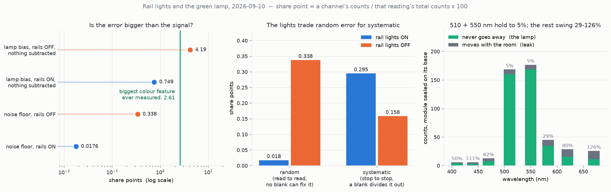

# Rail lights, the green lamp, and what every percentage is a percentage of

**2026-09-10.** No hardware, no robot motion, no sensor traffic — arithmetic on
the committed `xscan-*.json` and `background-*.json`.
[`analyse_lights_and_offset.py`](analyse_lights_and_offset.py) reproduces every
number below; [`plot_lights_and_offset.py`](plot_lights_and_offset.py) draws the
figure.



## The two answers

**Rail lights: ON.** 5.6× the signal, and it resolves colour changes **8–19×
smaller** than lights-off can.

**The green lamp: not worth removing for accuracy.** It is pure bias, it adds no
measurable noise, and subtracting the seated baseline — which every run already
takes — removes it exactly. Remove it only if you would rather not depend on that
subtraction being done.

## The units, since this was the complaint

Every percentage in this file names its denominator. There are only three units:

| unit | definition |
| --- | --- |
| **counts** | the AS7341's raw ADC output for one channel, 0 … 65535. Never a percentage. All eight summed is a reading's **total**. |
| **share** | one channel's counts ÷ *that same reading's* total counts, ×100. Units: **percent of that one reading's total counts.** This is what "colour" means for this sensor — it is the only quantity that survives the brightness of the room. |
| **share point** | one percentage point of share. The unit an error and a colour signal are compared in. |

And one derived figure of merit:

> **Resolution floor** = 2 × the standard deviation of a channel's share across
> the three repeat reads at one position, in **share points**. A sample that moves
> a channel's share by less than this cannot be told apart from doing nothing.

"Accuracy" for a colour test is the resolution floor. Everything else is
bookkeeping.

## Q1 — is the data more accurate with the rail lights on or off?

Two full pick–scan–reseat cycles at slot 7 / read z 129 / press z 90.0, four
minutes apart, nobody near the machine, differing only in the lights.

| | rails **ON** | rails OFF | |
| --- | --- | --- | --- |
| Mean total, counts (mean of 3 stops × 3 reads) | **15224** | 2724 | ON is 5.6× brighter |
| **Resolution floor, worst of 3 stops, share points** | **0.018** | 0.338 | **ON resolves 19× smaller colour changes** |
| Resolution floor, second-worst stop, share points | 0.015 | 0.121 | still 8×, with OFF's one contaminated stop dropped |
| Read-to-read spread, worst stop, % of *that stop's own total counts* | 0.31 % | 2.71 % | |
| Green-lamp share of the reading, % of *that stop's total counts* | 3.1 % | 14.9 % | |
| … the same on ch510 alone, % of *that stop's ch510 counts* | 8.3 % | 38.3 % | |
| Stop-to-stop colour disagreement, share points | 0.295 | 0.158 | ← **the one thing the lights make worse** |

**The last row is the honest cost**, and it is not a reason to turn them off. The
two errors are not equally harmful:

- **Read-to-read spread is random.** Lights-off stop 2 dropped 2.71 % between one
  read and the next, 1.4 s apart with the gantry parked — the room changed
  mid-run. **No blank can cancel a background that moved between the blank and
  the sample.**
- **Stop-to-stop disagreement is systematic.** The rails don't light the deck
  evenly, so x = 93.88 is brighter than x = 33.88 today, tomorrow, and next week.
  A per-position blank divides that out exactly.

Turning the lights on converts a random error into a systematic one, and
`blank_correction.py` only removes systematic ones.

Headroom is untouched: the largest single channel in the lit run is 3216 counts
of 65535 — **4.9 % of full scale**. The 5.6× cost nothing in dynamic range.

## Q2 — would removing the green lamp make the readings more accurate?

### First: it really is a lamp, not reflected room light

Sealed reads, module closed on its base, across **ten conditions** — two rooms,
rails on and off, ~24 h apart:

| ch | lowest seen, counts | highest seen | swing | swing as % of the lowest |
| --- | --- | --- | --- | --- |
| 410 | 4.0 | 6.0 | 2.0 | 50 % |
| 440 | 3.0 | 6.2 | 3.3 | 111 % |
| 470 | 8.0 | 13.0 | 5.0 | 62 % |
| **510** | **160.5** | 168.5 | 8.0 | **5 %** |
| **550** | **168.5** | 176.8 | 8.2 | **5 %** |
| 583 | 35.0 | 45.2 | 10.2 | 29 % |
| 620 | 16.0 | 28.8 | 12.8 | 80 % |
| 670 | 11.5 | 26.0 | 14.5 | 126 % |

A self-emitting lamp inside a closed box does not care what the room does; light
leaking in does. **510 and 550 hold to 5 % while everything else swings 29–126 %.**
Same result from the cleanest single comparison — rails on minus rails off, same
enclosure, four minutes apart: ch670 +55.8 %, ch620 +44.3 %, but **ch510 +3.0 %
and ch550 +4.7 %**.

**Green core = 329 counts, 81 % of the darkest sealed reading (406.5).** It is
0.62 % of the AS7341's full scale, so it costs no dynamic range.

*What it physically is, this repo cannot say* — the firmware lives on the board,
not here. The spectrum (narrow, ~510–550 nm, ~330 counts) fits a green indicator
LED: the Pico W's onboard status LED or a power LED on the sensor breakout, seen
directly or after one bounce off the housing wall.

### The math

The lamp is **additive**. Write the counts in channel *i* as

```
C_i  =  L_i  +  K_i  +  S_i
        lamp    leak    light off the sample   <- the only term you want
```

What you want is the sample's colour, `f_i = S_i / ΣS`. What you get if you just
divide is `f'_i = C_i / ΣC`. Those differ, and the difference is the bias:

```
                 C_i                      C_i − O_i
   f'_i  =  ───────────       f_i  =  ────────────────       O = L + K
               Σ C                        Σ C − Σ O
```

Three consequences, each of which is a number below:

1. **Subtracting O makes the bias exactly zero.** Not approximately — the two
   expressions above are the same arithmetic. Section 8 of the script computes
   the residual rather than asserting it: **0.00 share points**.
2. **Physically removing L is the same operation as subtracting L.** If the lamp
   were gone the reading would be `C − L` and the seated baseline would be
   `O − L`; the ratio is unchanged. There is no accuracy that removal buys and
   subtraction does not.
3. **What subtraction cannot fix is O being *stale*.** That error is the drift
   in O between the blank and the sample — and **L is the stable part**. Across
   the whole day the sealed total moved 60.2 counts; only **13.2 of those were
   the green core** and 47.0 were the leak. Removing the lamp removes the
   well-behaved 82 %, and leaves the badly-behaved 18 % exactly where it was.

### Does it add noise? No.

30 sealed reads, one unchanged condition, ~100 s:

| ch | mean counts | sd counts | sd as % of that mean | sd ÷ √mean |
| --- | --- | --- | --- | --- |
| 410 | 4.83 | 0.379 | 7.84 % | 0.172 |
| 470 | 8.97 | 0.183 | 2.04 % | 0.061 |
| **510** | **162.03** | **0.183** | **0.11 %** | **0.014** |
| **550** | **169.60** | **0.498** | **0.29 %** | **0.038** |
| 670 | 12.20 | 0.407 | 3.33 % | 0.116 |

Every channel's sd is **0.18–0.54 counts regardless of its level**, and 1.4–17 %
of the shot noise a photon-counting detector would show. So the counts are
heavily integrated, the noise is a fixed ~0.2–0.5 count floor, and the lamp's
329 counts contribute essentially none of it.

**The lamp is bias only, never noise.**

### The decision, on one ruler

Everything in share points, so it is directly comparable:

| quantity | share points |
| --- | --- |
| **Largest colour feature this rig has ever measured** (the ch440 dip in the 9-position sweep) | **2.61** |
| Green-lamp bias, rails OFF, nothing subtracted | **4.19** ← *bigger than the signal* |
| Green-lamp bias, rails ON, nothing subtracted | 0.75 |
| Green-lamp bias, seated baseline subtracted | **0.00** |
| A one-day-stale offset, rails ON | 0.037 |
| Resolution floor, rails OFF | 0.338 |
| Resolution floor, rails ON | 0.018 |

Read it as three cases:

- **Lights off, nothing subtracted** — the lamp's bias (4.19) is *larger than the
  largest colour signal ever measured* (2.61). Unusable. This is what every run
  before 2026-09-10 was doing when it compared raw counts.
- **Lights on, nothing subtracted** — bias 0.75, 29 % of the signal. Survivable,
  but it fakes a green peak that isn't in the sample.
- **Either, with the seated baseline subtracted** — 0.00. Done.

### So: remove it or not?

**Not for accuracy.** Subtraction is free, exact, and already happening.

Reasons you might still want to:

- **You would rather not depend on the arithmetic.** Every run before today
  compared raw counts, and the bias is 4.19 share points when nobody subtracts.
  Hardware that can't be forgotten beats software that can.
- **It sharpens the operational checks.** Sealed reads ~406 counts against ~2100
  lifted is 5×; with the lamp gone it would be ~77 against ~2100, i.e. **27×**.
  The grip check and the reseat confirmation both get less ambiguous. `GRIP_RATIO
  = 2.0` and `SEATED_MAX = 800` would need re-checking against the new levels.

Reasons not to:

- **It cannot help you see colour.** 81 % of its light is in two green channels,
  so even if all of it reflected off the sample it could only discriminate in the
  green band — it emits nothing at 410–470 or 583–670 to tell blue from red with.
- **It costs a session** and cannot be undone from a runner.

### The better third option, if the LED is under software control

If it is the Pico W's onboard LED (`machine.Pin("LED")` in MicroPython), it can
be **strobed**: read with it on, read with it off, subtract. That measures `L` at
the exact position, pose and instant of the measurement rather than inferring it
from a baseline taken minutes earlier at a different pose. It removes the lamp
term *and* removes any argument about drift, without a soldering iron.

It is a firmware change on the board, so it is not free — but it is strictly
better than either removing the LED or leaving it.

**Thirty seconds to find out which LED it is:** power the board, watch the
enclosure interior in a dark room, and see whether the green is the Pico's
onboard LED or the breakout's power LED. If it is the Pico's, it is
software-controllable and the strobe is available.

## What actually limits this measurement

Neither of the two questions above is the binding constraint, and it is worth
saying so:

All in share points, so they can be ranked against the 2.61-point signal:

| error source | share points | measured from |
| --- | --- | --- |
| Resolution floor, rails ON | **0.018** | the two runs of 2026-09-10 |
| Green-lamp bias, seated baseline subtracted | **0.00** | identity, computed not asserted |
| A one-day-stale offset, rails ON | 0.037 | 2026-09-09 baseline against a 2026-09-10 reading |
| Blank taken at the wrong X stop, rails ON | 0.295 | between the three stops of the lit run |
| **A person at the machine during the reading** | **1.40** | z 128 run, within one position, three reads 1.4 s apart |
| **Blank taken with the lights in the other state** | **2.55 – 2.80** | lit vs unlit run, same slot, same pose, 4 min apart |
| **Blank taken at a different read height** | **3.12 – 9.67** | z 120 against z 128, same slot, same X stops |

The bottom three rows all exceed the 0.295 that the lights' unevenness costs,
and the bottom two exceed the whole colour signal. **The instrument is far better
than the procedure around it.** With the rails on and a per-position blank taken
minutes before the sample at the same pose and the same lights state, with nobody
near the machine, the floor is **0.018 share points against a 2.61-point signal —
a signal-to-noise ratio of about 150.** Everything that has gone wrong so far
went wrong in the procedure, not the instrument.
