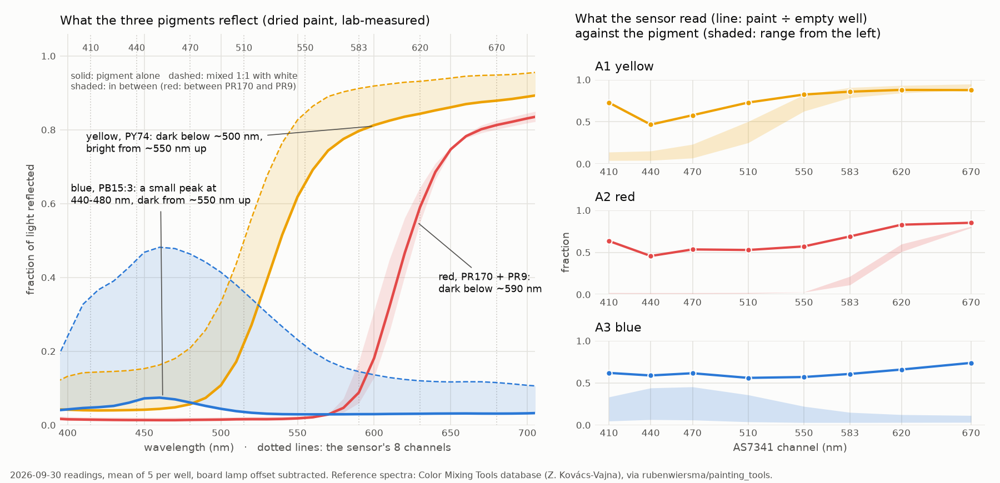

# How accurate were the paint readings? Against the pigments' own spectra

**2026-09-30, no hardware.** Asked on
[PR #202](https://github.com/vertical-cloud-lab/byu-vcl/pull/202) by Timothy Commins:
red and blue looked right but yellow looked "too wide of a spectrum"; the paints are
Liquitex BASICS Primary Yellow, Cadmium Red Medium Hue and Primary Blue; what do the
results say about accuracy? The side blackout had been applied.

Re-analysis of the readings in
[`results-paint-plate-2026-09-30.md`](results-paint-plate-2026-09-30.md).
[`analyse_paint_accuracy.py`](analyse_paint_accuracy.py) reproduces every number
below and draws the chart.

## The pigments

From Liquitex's own product pages:

| paint | pigment | reflects |
| --- | --- | --- |
| [Primary Yellow](https://www.liquitex.com/products/basics-acrylic-color-primary-yellow) | PY74 (arylide yellow) | from ~550 nm up; dark below ~500 nm |
| [Cadmium Red Medium Hue](https://www.liquitex.com/products/basics-acrylic-color-cadmium-red-medium-hue) | PR170 + PR9 (naphthol reds) | from ~620 nm up; dark below ~590 nm |
| [Primary Blue](https://www.liquitex.com/products/basics-acrylic-color-primary-blue) | PB15:3 (phthalo blue) | a small peak at 440–480 nm; dark from ~550 nm up |

The spectra are dried drawdowns from Zsolt Kovács-Vajna's Color Mixing Tools
database (University of Brescia), as redistributed in
[rubenwiersma/painting_tools](https://github.com/rubenwiersma/painting_tools/tree/72f2ced444c1508dfa13ccf5e5d4e25af83fbc38/painting_tools/measurements/pigments/cmt)
under CC BY-NC-SA 4.0. The script fetches them from that pinned commit rather than
copying them here. They are not these exact paints: BASICS carry less pigment, the
drawdowns are dry, and ours was watered down in its vials
([#197](https://github.com/vertical-cloud-lab/byu-vcl/issues/197); the ratio wasn't
recorded). Water alone shouldn't change what an opaque layer reflects, since it
thins what absorbs and what scatters equally, and ~5 mm of paint should be opaque
wherever these pigments absorb. Wet acrylic is milky until it dries, so for yellow
and blue the chart also shows the pigment mixed 1:1 with titanium white (white
paint, not water), and the wet paint should fall between the two. Red is shown as
the range between PR170 and PR9.

Each channel is modelled as a Gaussian at the AS7341 datasheet centre and FWHM
(415/26, 445/30, 480/36, 515/39, 555/39, 590/40, 630/50, 680/52 nm) under even
light. Weighting by a CIE white-LED illuminant instead moves no channel by more
than 0.06.

## Yellow is supposed to be wide

A yellow paint doesn't reflect a narrow band near 580 nm. It absorbs violet and
blue and reflects everything from green to red. So yellow and red should both be
bright at 620–670 nm, and what separates them is 510–583 nm. The readings get
that right: at 550 nm yellow read 0.82 of the empty well and red 0.57.

**The part of yellow that is wrong is 410 nm.** PY74 reflects as little at 410 nm
as at 440 nm (0.040 against 0.042; 0.14 against 0.15 mixed with white), but it read
0.73 of the empty well at 410 against 0.47 at 440. A typical white LED emits ~2% of
its peak at 410–415 nm (CIE LED-B3 to B5), so under the rail lights that channel
gets little light of its own colour, and the order of the three paints there
(yellow 0.73 > red 0.64 > blue 0.62) follows how bright each is at long
wavelengths. Treat 410 as unreliable under the rail lights.

**Red has the right shape.** It is flat and dark to 550 nm, rises at 583 and is
bright at 620–670, where PR170 and PR9 turn.

**Blue doesn't.** PB15:3 should be brightest at 440–480 nm and dark from ~550 nm
up. Blue read 0.56–0.62 from 410 to 583 nm, then rose to 0.66 and 0.74 at 620 and
670. It reads as blue only next to the other two paints, which read darker than it
at 440–470 nm.

## Every reading is squeezed toward the middle

Each paint ÷ the empty well A6, after subtracting the board lamp's sealed offset
from both (the lowest sealed reading of 2026-09-10,
[`results-lights-and-offset-2026-09-10.md`](results-lights-and-offset-2026-09-10.md)),
against the range of the pigment's reflectance at that channel:

| | 410 | 440 | 470 | 510 | 550 | 583 | 620 | 670 |
| --- | --- | --- | --- | --- | --- | --- | --- | --- |
| yellow, read | 0.73 | **0.47** | 0.58 | 0.73 | 0.82 | 0.86 | 0.88 | 0.88 |
| PY74 | 0.04–0.14 | 0.04–0.15 | 0.07–0.23 | 0.25–0.50 | 0.63–0.82 | 0.79–0.91 | 0.84–0.93 | 0.88–0.95 |
| red, read | 0.64 | **0.46** | **0.54** | **0.53** | **0.57** | 0.69 | 0.83 | 0.85 |
| PR170 / PR9 | 0.01–0.02 | 0.01–0.02 | 0.01–0.02 | 0.01–0.02 | 0.03 | 0.11–0.21 | 0.51–0.60 | 0.79–0.81 |
| blue, read | 0.62 | 0.59 | 0.62 | 0.56 | 0.57 | 0.61 | 0.66 | 0.74 |
| PB15:3 | 0.05–0.33 | 0.06–0.44 | 0.06–0.45 | 0.04–0.36 | 0.03–0.22 | 0.03–0.15 | 0.03–0.12 | 0.03–0.11 |

- **Repeatable.** Across the five readings in a well, no channel's share had a
  standard deviation above 0.04 share points.
- **Not accurate.** Red reflects 1–3% of the light from 440 to 550 nm and read
  0.46–0.57 of the empty well there (bold). About half of what the sensor sees
  doesn't depend on the paint.
- **One straight line, reading = a + b × reflectance, through all three paints at
  440–670 nm** (21 points): a perfectly black paint would read **a = 0.57** of the
  empty well and a perfectly white one 0.95, with the pure pigments as the
  reference (R² 0.80); **0.53** and 0.89 with the white-mixed yellow and blue
  (R² 0.72). The slope, 0.36–0.38,
  means colour differences come out **~2.7× smaller** than they are.
- **Ratios suffer far more than differences.** Yellow reflects 6–20× more at 620 nm
  than at 440 nm; it read 1.9×.
- **Blue suffers most** because it is dark almost everywhere, so most of what the
  sensor sees in every channel is the extra light.

The lowest paint reading at each channel (440–670 nm) climbs from 0.46 to 0.74,
so the extra light is redder than the empty well's. That is also why blue, which
sits at the bottom from 550 nm up, rises at 620–670.

## Where the extra light comes from

Mostly the rail lights (5.6× the signal when on, 2026-09-10), so the side blackout,
which blocks room light, doesn't remove it. Seated in its closed base the enclosure
reads ~490 counts, most of it the board's own green lamp; resting on the plate over
the empty well it reads ~8,100. So it enters at the bottom of the enclosure. Two
paths fit, and these readings can't tell them apart:

- **Through the clear plate.** Polystyrene carries light sideways from the lit
  deck into the well's walls, which glow in the sensor's view whatever is in the
  well. Neighbouring wells may add to it: A3's red channels, where blue sets the
  floor, sit next to the red in A2.
- **Through the enclosure's own white walls** near the sensor, which the base
  covers when seated and nothing covers on the plate. White plastic passes red
  better than blue, which would fit the redder floor.

## What would fix it

1. **A white well and a black well on every plate**: Liquitex BASICS
   [Titanium White](https://www.liquitex.com/products/basics-acrylic-color-titanium-white)
   (PW6) and [Mars Black](https://www.liquitex.com/products/basics-acrylic-color-mars-black)
   (PBk11), **watered down in the same ratio as the colour vials**, 200 µL each,
   read the same way as the paints. Then, per channel,
   `reflectance = (paint − black) ÷ (white − black)`. The black well measures the
   extra light directly, and the white well replaces the empty well, which is a
   white deck seen through clear plastic, not a white paint. A per-well white
   reference is what took the Acceleration Consortium's spread from 6–7% to
   1.2–2.3% ([`accuracy-provenance.md`](accuracy-provenance.md)); the black well
   adds the offset, which is large here.

   Watered down, not straight from the tube, because they are the scale the
   colours are read against, so they should differ from the colours only in
   pigment: same liquid, same volume, same surface. Water doesn't make them less
   white or less black at ~5 mm deep, since it thins what absorbs and what
   scatters equally, and Liquitex rates both pigments opaque. Straight BASICS is
   a medium-viscosity paint, too thick to pipette reliably with the P300;
   upstream, even Crayola washable paint left sticky bubbles after blow-out at
   1:15–1:20 ([`accuracy-provenance.md`](accuracy-provenance.md)). No white or
   black was on the 2026-09-30 plate, and the 2026-09-04 receipt on
   [#197](https://github.com/vertical-cloud-lab/byu-vcl/issues/197) has only the
   three colours, so both still need buying.
2. **Leave out 410 nm** under the rail lights.
3. **Read every well the same time after pipetting.** Wet acrylic darkens as it
   dries. These wells were read 31–38 min after dispensing (yellow 12:48 → 13:25,
   red 12:54 → 13:27, blue 12:59 → 13:29 MDT).
4. **Stir every vial just before the run.** Watered-down paint settles: upstream,
   paint left overnight settled and the pipette drew the denser bottom layer
   ([ac-dev-lab#152](https://github.com/AccelerationConsortium/ac-dev-lab/issues/152#issuecomment-2605861484)).
   Titanium white and iron-oxide black are about three times as dense as the
   organic pigments in the three colours (~4.2 and ~5.2 g/cm³ against ~1.4–1.6),
   so they settle faster. The robot draws from ~10 mm under the surface.

To find the path: read the black well as it is, then again with black tape around
the enclosure's lower sides. If the reading falls, the walls leak. Spacing the
paints (A1, A3, A5…) tests the neighbour effect.

## Not used

The LBNL Pigment Database has films of Liquitex paints with exactly these pigments
(Y13 PY74, R09 PR9, U12 PB15, W03 PW6, B04 PBk11), but its data files are encrypted
for Cool Colors project members. PR170 as it is in the BASICS red isn't in the
Color Mixing Tools set; the closest is Liquitex Heavy Body Naphthol Crimson, the
bluer F5RK form.

## Files

| file | what |
| --- | --- |
| [`analyse_paint_accuracy.py`](analyse_paint_accuracy.py) | the analysis and the chart |
| [`paint-accuracy-2026-09-30.json`](paint-accuracy-2026-09-30.json) | every ratio, reference range, floor and fit above |
| [`paint-accuracy-2026-09-30.png`](paint-accuracy-2026-09-30.png) | the chart |
