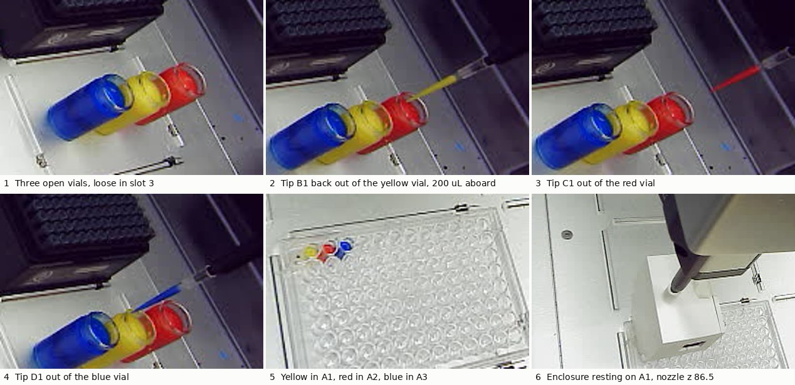
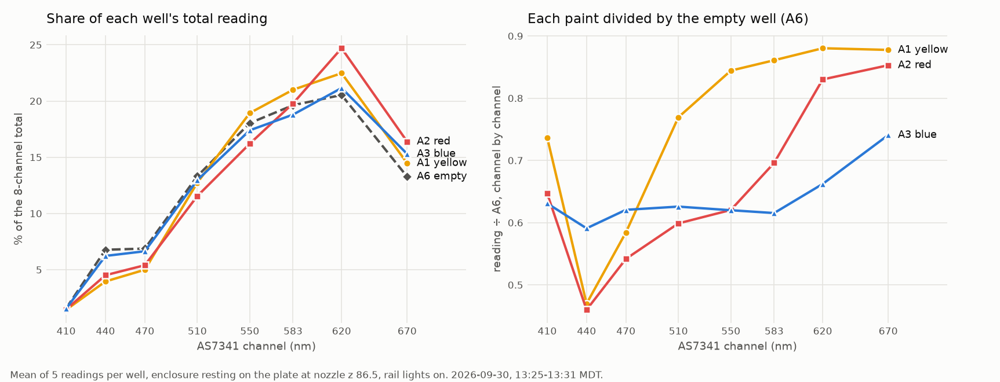

# Paint into the plate, then read: yellow A1, red A2, blue A3

**2026-09-30, 12:09–13:36 MDT. Asked on [PR #202](https://github.com/vertical-cloud-lab/byu-vcl/pull/202)
by Timothy Commins:** "the color vials are on the ot-2 well 3, please use a tip to
take the liquid color and put them in their own slot on the 96-slot well plate.
then please read the color with the color sensor".

- **Done.** 200 µL each of yellow, red and blue went into wells A1, A2 and A3,
  each with its own fresh tip (B1, C1, D1). All three tips went into the trash.
- **Then the enclosure read each well**, and the empty well A6 for comparison. It
  rested on the plate at nozzle z 86.5 (the height picked over A1 earlier that day)
  and took five full-spectrum readings per well, with the rail lights on.
- **Yellow and red read as yellow and red.** Red's 620 nm share is **4.16 share
  points** above the empty well's. That is the largest colour signal this rig has
  produced; the previous record was 2.61. Yellow's 440 nm share is 2.82 points
  below the empty well's.
- **Blue is weaker.** It has the most 440–470 nm of the three paints. Against the
  empty well, though, it is mainly darker across every channel, with a rise at
  670 nm, and not a clear blue peak.
- **The enclosure went back seated in A2** (482–488 counts, against 487 before).
  The robot is homed with nothing running, and the lights are off.
- **The pipette's body pressed down on the vials once** while the camera was being
  fitted ([below](#the-pipette-body-pressed-on-the-vials)). Nothing moved, and a
  home recovered the robot's height.

All numbers are in [`paint-plate-2026-09-30.json`](paint-plate-2026-09-30.json), and
[`plot_paint_plate.py`](plot_paint_plate.py) redraws the chart from it.

## The readings

Mean of five readings per well. Each channel is shown as a share of that well's
8-channel total, so the numbers compare colour rather than brightness:

| well | paint | total | 410 | 440 | 470 | 510 | 550 | 583 | 620 | 670 |
| --- | --- | --- | --- | --- | --- | --- | --- | --- | --- | --- |
| A1 | yellow | 6,497 | 1.44 | **3.96** | **5.00** | 12.73 | 18.93 | 21.00 | 22.47 | 14.47 |
| A2 | red | 5,576 | 1.47 | 4.51 | 5.40 | 11.55 | 16.21 | 19.78 | **24.69** | **16.39** |
| A3 | blue | 5,191 | 1.54 | 6.23 | 6.64 | 12.96 | 17.39 | 18.79 | 21.16 | 15.29 |
| A6 | none | 8,076 | 1.57 | 6.77 | 6.88 | 13.31 | 18.04 | 19.63 | 20.54 | 13.27 |

Each paint divided by the empty well, channel by channel:

| well | 410 | 440 | 470 | 510 | 550 | 583 | 620 | 670 |
| --- | --- | --- | --- | --- | --- | --- | --- | --- |
| A1 yellow | 0.74 | **0.47** | 0.58 | 0.77 | 0.84 | 0.86 | 0.88 | 0.88 |
| A2 red | 0.65 | **0.46** | 0.54 | 0.60 | 0.62 | 0.70 | 0.83 | 0.85 |
| A3 blue | 0.63 | 0.59 | 0.62 | 0.63 | 0.62 | 0.62 | 0.66 | 0.74 |

- **Yellow** absorbs the blue end (440–470 nm) and passes almost everything from
  550 nm up.
- **Red** absorbs everything below ~583 nm and passes 620–670 nm.
- **Blue** passes 440–470 nm better than the other two paints do, and 583 nm
  worst. Against the empty well it is flat at ~0.62 from 410 to 583 nm, then rises
  at 620–670 nm. Phthalo-type blues also reflect in the deep red, but that is a
  guess about the pigment, not a measurement.
- **The readings repeat well.** Across the five readings in a well, no channel's
  share moved by more than 0.036 share points (standard deviation). The totals'
  standard deviation was 2–22 counts.

**What the empty well is and isn't.** It is the same clear plate over the same
white deck, three wells right of the blue, under the same lights. It is not a
white reference, and not the same position as the paints. The 2026-09-10 work
found per-position blanks worth ~0.3 share points
([`accuracy-provenance.md`](accuracy-provenance.md)). That is small next to the
2–4 share-point colour signals here, but it's why the blue result shouldn't be
over-read. A per-position blank would have needed a second enclosure trip before
the paint went in.

## How the paint went in

[`paint_transfer.py`](paint_transfer.py) is a new step-by-step driver built on
`tip_cal.py`. It ran on the OT-2 link Pi and took one command at a time.

**The vials are loose.** There are three open glass vials standing in a row across
slot 3, with no rack, so the robot had no labware for them. Their positions came
from the robot's camera in two steps:

1. **Fitting the camera.** The bare nozzle was photographed at 40 known positions
   (z 20–100) over empty deck and high over the vials. A projective camera model
   fitted those to **0.40 px** rms.
2. **Fitting each vial.** A cylinder standing on the deck was fitted to each
   vial's coloured outline, allowing for the vials in front hiding the ones behind.

| vial | centre x, y (mm) | radius | paint top | fit (IoU) |
| --- | --- | --- | --- | --- |
| blue | 291.6, 41.9 | 11.7 | z 49.4 | 0.94 (unhidden) |
| yellow | 326.4, 39.4 | 12.0 | z 48.8 | 0.79 |
| red | 367.6, 41.8 | 12.9 | z 47.2 | 0.76 |

**Each transfer:**
- Fresh tip, Opentrons' own `pickUpTip`.
- Over the vial's centre with the tip end at z 80, plunger to the bottom in air.
- Straight down in 8–10 mm steps to z 38, which is ~10 mm under the paint. A photo
  at each step, checked for the vial moving: none shifted more than ~1 px, and
  none stayed shifted.
- Aspirate 200 µL at 30 µL/s, wait 3 s, then up at 3 mm/s until clear of the rim.
- Over the well, down to 2.7 mm above its floor, dispense at 30 µL/s, wait 3 s.
- Blow out 1 mm below the rim, then the tip goes into the trash.

Every photo out of a vial showed the tip full of that colour (panels 2–4).

## The enclosure trip

[`enclosure_height_cal.py`](enclosure_height_cal.py) ran as in runs 2–4, with
`--press-z 89.0 --carry-z 125 --carry-segment 400 --drop-dx 0 --max-speed 3 --no-live`
and target A1, plus a new `--clear-z 91`. That lets it go from z 125 straight to
z 91 over each well, instead of stepping the ladder that found the touch heights.
From z 91 it went down 1 mm at a time to z 86.5.

| step | result |
| --- | --- |
| seated | 487 counts |
| bare nozzle z 150 → 100 over (92.8, 316.5) | enclosure ≤ 0.01 px |
| press to z 89.0, ≤ 2 mm steps | gripped at z 90 (enclosure +0.82 px; runs 3–4: 0.81–0.89) |
| `jiggle y 0.3 40 3`, `jiggle x 0.3 40 3` at z 93 | 160 jolts, enclosure −0.01 px |
| up to z 110 | 4,433 counts, grip check **9.1×** |
| carry via z 190 to A1 at z 125 | 11,753 counts |
| A1, A2, A3, A6: z 125 → 91 → 86.5 | readings above |
| return via z 190, release over the pocket | 2,340 hanging, **482–488 after release** |

The light settles on the way down to z 86.5, as it did over A1 in the morning.
From z 88 to 87 it fell by 41 counts at A1, 175 at A2, 148 at A3 and 261 at A6.
From z 87 to 86.5 it fell by 14–31 at A1, 61–124 at A2 and 13–18 at A3, and rose
by 29–45 at A6. So A2 was still settling at its last step, and its foot may land
a little lower than A1's. That changes brightness, not colour shares.

**The enclosure script records totals only.** The full spectra above were read
from the runner, over the same MQTT link, while the enclosure sat still at z 86.5
([`sensor_read.py`](sensor_read.py)). The script's own two readings per step, in
the JSON's `ladder`, are totals.

## The pipette body pressed on the vials

At 12:32:51 MDT, while fitting the camera, the bare nozzle was sent to
(245, 45, 20). That is over empty slot 2, ~35 mm left of the blue vial's edge.
The pipette's body reaches at least that far to +X of the nozzle, and (inferred
from where it stopped) sits roughly 30 mm above the nozzle's end, so it came down
onto the vials' tops:

- Between z 30 and z 20 the nozzle's image moved 1.8 px instead of ~8.
- Every later position was ~7 mm high. Photos after the next home put that at
  **7.25 mm**: fitting the camera with that offset on the in-between photos cut
  the error from 0.94 px to 0.40 px.
- **Nothing moved.** The vials' outlines before and after agree to < 0.5 px, and
  the paint was still in them.
- `home` at 12:40 recovered Z. Every photo after that matched the camera model.

`paint_transfer.py` now only allows low looks at x ≤ 200. With a tip on, the body
is ~80 mm above the tip end, so it clears the vials' tops (~60 mm) wherever the
tip end is above z ~20, which the script's `--vial-floor` enforces off the plate.

## What this doesn't show

- **Whether 200 µL is the right amount.** The paint sat ~5 mm deep, about 5 mm
  under the enclosure's foot. More or less paint changes the distance.
- **Any other wells**, or a second read of these, or a per-position blank.
- **The paint's colour as a number.** These are raw sensor shares under the
  rail lights. Neither the illumination nor the sensor has been calibrated to a
  reference.

## Files

| file | what |
| --- | --- |
| [`paint-plate-2026-09-30.json`](paint-plate-2026-09-30.json) | all 20 readings (8 channels, timestamps), the transfers, the vial fits, the 40 camera-model points, the enclosure's ladder |
| [`paint-plate-2026-09-30.png`](paint-plate-2026-09-30.png) | the two charts above; [`plot_paint_plate.py`](plot_paint_plate.py) redraws them |
| [`paint-plate-2026-09-30.jpg`](paint-plate-2026-09-30.jpg) | six robot-camera photos |
| [`paint_transfer.py`](paint_transfer.py) | the transfer driver |
| [`drive.py`](drive.py) | sends one command and waits for the step to finish |

On the Pi (`RPI_STREAM_CAM_HOSTNAME`):
- `~/paint-0930/`: 123 photos from the transfer run and its log. The first run's
  photos are in `look1/`.
- `~/enclosure-cal-0930f/`: 67 photos from the enclosure trip and its log.

No services, timers or settings were changed.
