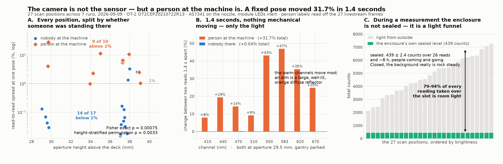

# Does a person at the machine actually change what the sensor reads?

2026-09-10 · re-analysis of the seven runs of 2026-09-09 · no hardware touched,
no robot motion · reproduce with `python3 analyse_person_effect.py`

Raised on #197:

> it shouldnt matter that there is a person in the live stream footage, all that
> matters is what the color sensor is reading. the background for the color
> sensor enclosure (not the live cam) should not change significantly when a
> person appears in the ot-2 live stream.

Two claims there, and they come apart.

**The camera is not the cause, and the 2026-09-09 write-up was sloppy about
that.** It repeatedly said "a person in shot", which reads as though the
livestream were doing something to the measurement. It is not. The frame is
*evidence* that somebody was standing at an open machine at that instant, and
nothing more. The right label is **person at the machine**, and it is used
throughout this file and in `analyse_person_effect.py`.

**The background did change, though, and by a lot.** That part is testable
against the sensor's own numbers, which is the standard the comment asks for.

---

## The one measurement that settles it

The three reads at a scan position are **1.4 s apart with the gantry parked**.
Between them nothing mechanical moves, nothing on the deck moves, the pose is
identical and the sensor's own configuration is identical. The only thing that
can differ is the light.

| aperture 29.5 mm, same pose, 1.4 s between reads | reads | worst step |
| --- | --- | --- |
| `xscan-slot7-z120` pos2, nobody at the machine | 7084, 7083, 7086 | **0.04 %** |
| `xscan-run` pos2, person at the machine | 3431, 3298, **4345** | **+31.7 %** |

Per channel across that step, against the same channel in the quiet run:

| nm | before → after | change | quiet run, three reads | range |
| --- | --- | --- | --- | --- |
| 410 | 51 → 55 | +7.8 % | 108, 108, 108 | 0 |
| 440 | 155 → 185 | +19.4 % | 419, 419, 419 | 0 |
| 470 | 176 → 201 | +14.2 % | 440, 440, 439 | 1 |
| 510 | 470 → 513 | +9.1 % | 925, 925, 926 | 1 |
| 550 | 624 → 893 | **+43.1 %** | 1314, 1314, 1315 | 1 |
| 583 | 672 → 987 | **+46.9 %** | 1528, 1527, 1528 | 1 |
| 620 | 721 → 976 | **+35.4 %** | 1517, 1517, 1518 | 1 |
| 670 | 429 → 535 | +24.7 % | 833, 833, 833 | 0 |

Every channel in the quiet run repeats to within one count. In the other, the
warm channels move by nearly half. The change is **warm-weighted** — 550/583/620
gain far more than 410 — which is what a large, close, well-lit **skin-coloured
diffuse reflector** does. A bare forearm held over an open deck is exactly that.
This is light being *added*, not a shadow.

## Why the enclosure does not protect the reading

The premise the comment rests on is that the enclosure has its own background.
It does — and while the module is **closed on its base** that background is
extraordinarily good:

```
26 sealed reads, 7 runs, ~8 hours, people coming and going:  439.2 counts, sd 2.39
```

`ch410` was exactly `6` on all 26. So the comment is right about the sealed case,
and if the enclosure stayed shut nothing outside it would matter.

But a measurement is taken with the module **lifted off its base and hovering
over the deck**, aperture pointing down at an open slot. Then:

| | counts |
| --- | --- |
| sealed level | 439 |
| quietest lifted read on record (z 129 centre) | 2134 |
| brightest lifted read on record (z 120) | 7263 |

**79–94 % of every reading ever taken over a slot is light that came in from
outside.** The enclosure is not a dark box during a measurement; it is a funnel
pointed at a deck that is lit by the room. Its "own background" is the room's,
five to sixteen times over.

## Across all 27 positions

| aperture | person at the machine | nobody there |
| --- | --- | --- |
| 29.5 mm | n=2, median **16.22 %** (4.08–28.36) | n=4, median **0.06 %** (0.03–0.13) |
| 34.5 mm | n=3, median 2.31 % (0.99–11.34) | none at this height |
| 37.5 mm | n=3, median **6.50 %** (5.50–10.63) | n=3, median **1.35 %** (0.16–3.32) |
| 39.0 mm | n=2, median 1.76 % (1.04–2.48) | n=1, 2.56 % |

- Spread over 1 %: **9 of 10** with a person there, **3 of 17** without.
  Fisher exact **p = 0.00075**.
- Shuffling the person label *within each aperture height*, so the known height
  effect cannot leak in: median gap **+4.64 points**, one-sided **p = 0.0033**.

At 29.5 mm and 37.5 mm the two groups separate completely — the mildest
person-present position is worse than the worst quiet one.



## Where this argument is weak

- **The 39.0 mm stratum goes the other way.** Its one quiet position (2.56 %) is
  worse than both of its person-present positions. One stratum in four
  contradicts the trend, on n=1.
- **Small numbers.** 10 positions with, 17 without, across 7 runs of one session.
- **Person and object are entangled.** Somebody at the machine is usually there
  *because* they are putting a vial down, so "body in the light path" and "object
  appearing near the slot" are the same event. The 1.4 s step above is not
  vulnerable to this — nothing standing on the deck moves itself in 1.4 s — but
  the position-level statistics are.
- **The label is one frame per position**, and a position spans ~4.2 s. "Nobody
  there" really means "nobody there in the middle frame". That mislabels quiet
  positions as clean, which *understates* the effect rather than inflating it.

## What follows, and it is the useful part

The comment's own principle — *all that matters is what the colour sensor is
reading* — turns out to give a **better contamination detector than the video**,
because the sensor already measures the thing that matters.

A quiet background repeats to **0.03–0.13 %**. So the three reads at a position
police themselves: if they disagree by more than a few tenths of a percent, the
light moved while that position was being read, whatever the camera saw.

```bash
python3 analyse_person_effect.py --gate xscan-slot7-z120-2026-09-09.json
```

Gate at **0.5 %** — four times the worst quiet position, twice below the mildest
position with somebody at the machine. Run over the seven committed runs it
flags **13 of 27** positions, including three that the frames called clear
(`z128 pos3` 3.32 %, `z129 pos3` 2.56 %, `paint pos3` 1.35 %). Somebody just out
of frame, or a light changing for some other reason, is invisible to the camera
and obvious to the sensor.

For tomorrow's water/blank run that is one line: take the blank, gate it, and if
any position is over 0.5 %, re-take it before pipetting anything. A blank whose
own background moved cannot cancel the sample's.

## What this does not change

The instrument artefacts stand on their own and are not affected by any of this:
the ~439-count green offset inside the enclosure, the F1–F4 | F5–F8 readout seam,
and the absence of a controlled light source. A blacked-out room with nobody in
it would still leave those. This finding is about **when a reading is usable**,
not about what the reading means.
