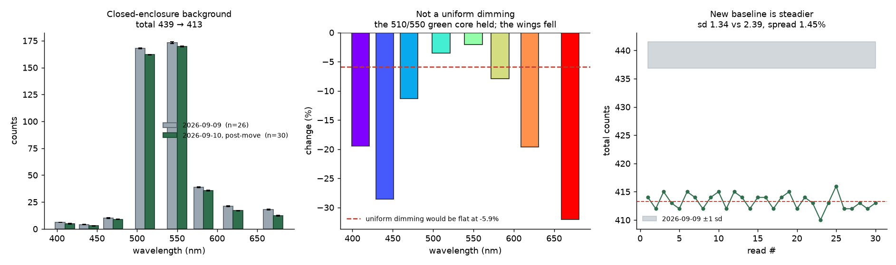
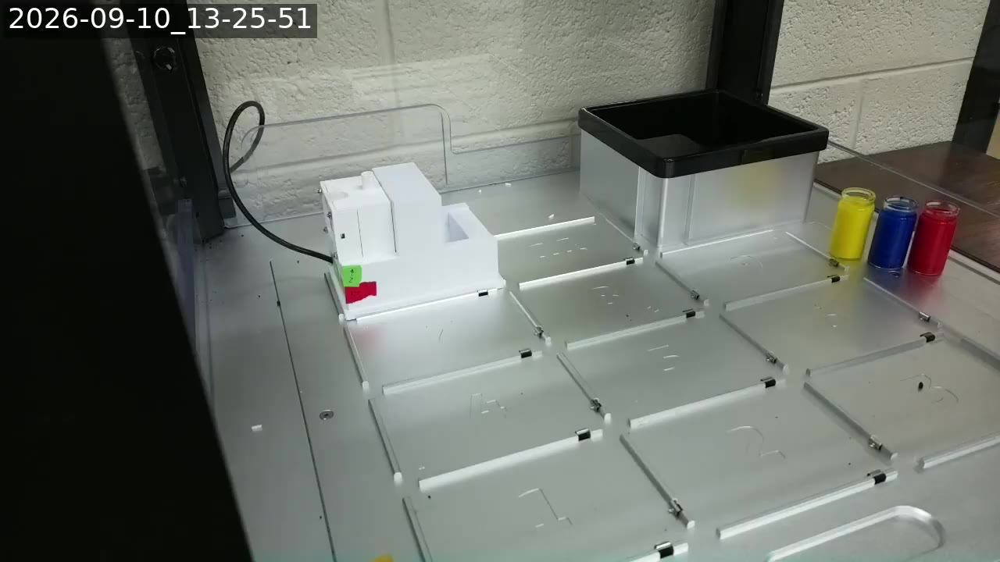

# Post-move checkout, 2026-09-10 — everything answers except the OT-2's network link

The lab setup was moved and re-assembled. Asked on #197 to confirm the system
works, to take a background reading now that the coloured vials have been
removed, and — as a standing instruction from here on — to turn the OT-2's rail
lights on for every test.

**No robot motion this session, and none was possible.** The OT-2 has no network
link. Everything downstream of the sensor was exercised end to end.

## What answers, and what does not

| link | result |
| --- | --- |
| Sensor over MQTT | **alive** — answers in ~1.4 s, straight from a GitHub Actions runner |
| MQTT broker | delivering |
| MongoDB Atlas | read + write, `digital-wetlab.sensor-data` |
| Stream-cam Pi (`RPI_STREAM_CAM_HOSTNAME`) | up 28 min, tailnet, camera present |
| OT-2 cam Pi (`OT2_STREAM_CAM_HOSTNAME`) | up 11 min, livestream running |
| YouTube livestream | live, `IybPYz4uOcs` |
| **OT-2 HTTP API** | **unreachable** |

### The OT-2's ethernet cable is not connected

The robot answers only on the link-local address `169.254.51.252`, over the
USB-ethernet adapter plugged into the stream-cam Pi. That adapter is still
there and its driver still loads:

```
Bus 004 Device 003: ID 0bda:8153 Realtek Semiconductor Corp. RTL8153 Gigabit Ethernet Adapter
[    7.528049] r8152 4-1:1.0 eth1: v1.12.13
```

But the interface has no carrier, and has had none since the Pi booted:

```
eth1   DOWN   00:e0:96:68:fa:ee   <NO-CARRIER,BROADCAST,MULTICAST,UP>
/sys/class/net/eth1/carrier -> 0
```

`NO-CARRIER` is a physical-layer fact: nothing is on the other end of the RJ45,
or the robot is powered down. Ruled out in passing:

- **Not a wrong-Pi mix-up.** The other Pi has no ethernet interface at all and
  no USB devices, so it cannot be holding the link.
- **Not moved onto Wi-Fi.** Port 31950 is closed across all 254 addresses of
  the Pi's own `/24`, and the robot does not answer mDNS.
- **Not a stale address.** With `carrier = 0` no address on that interface can
  work.

The fix is a cable, at the machine.

## The background has moved, and it did not simply dim

The coloured vials are off the deck, so the closed enclosure was measured on
its own: **30 reads over one minute, module sealed on its base, no motion.**
This is the additive offset `blank_correction.py` subtracts from both sample
and blank before dividing, so if it moves, every normalised spectrum computed
against the old value is wrong by the difference.

It moved.

| ch | 2026-09-09 (n=26) | sd | 2026-09-10 (n=30) | sd | change |
| --- | --- | --- | --- | --- | --- |
| 410 | 6.00 | 0.00 | 4.83 | 0.37 | **−19.4 %** |
| 440 | 4.15 | 0.36 | 2.97 | 0.18 | **−28.6 %** |
| 470 | 10.12 | 0.32 | 8.97 | 0.18 | −11.4 % |
| 510 | 167.88 | 0.51 | 162.03 | 0.18 | **−3.5 %** |
| 550 | 173.19 | 0.68 | 169.60 | 0.49 | **−2.1 %** |
| 583 | 38.77 | 0.64 | 35.70 | 0.53 | −7.9 % |
| 620 | 21.12 | 0.58 | 16.97 | 0.18 | **−19.6 %** |
| 670 | 17.96 | 0.44 | 12.20 | 0.40 | **−32.1 %** |
| **total** | **439.19** | 2.39 | **413.27** | 1.34 | **−5.9 %** |

−25.9 counts is **10.9 sd** of the old spread, so this is a step, not drift.

**The shape changed, which rules out the obvious explanation.** A flatter
battery would dim the indicator LED and move every channel by the same
percentage. Instead the 510/550 nm core — the LED itself — barely moved
(−2 to −3.5 %), while the wings fell 8–32 %. The LED is steady; what has gone
is a *broadband* component, i.e. room light that used to leak into the closed
box and now does not. Consistent with the module having been re-seated, or with
the new bench simply being darker.

Supporting that reading: the new baseline is **steadier** — total sd 1.34
against 2.39, and 0.18 counts on four channels. Less external leak means less
to fluctuate. The old "`ch410` is exactly 6 on every read" invariant is gone
because the level dropped to 4.83, straddling a quantisation boundary.



**Consequence:** every blank and every offset vector from 2026-09-09 is stale.
`blank_correction.py` already defaults to taking its offset from the blank and
sample runs themselves, so a fresh blank/sample pair is self-consistent without
any change — but a 2026-09-09 blank must not be reused against a new sample.

Note what this is *not*: it is the background of the **closed enclosure**, not
of an empty well seen through the aperture. The latter needs the module lifted
over a slot, which needs the robot.

## The measurement chain verifies end to end

`test_measurement_timestamps.py --live` — **44/44**, up from 39/40. The gap the
2026-09-10 03:02 session left open was the *sensor → reading* leg, untested
because the board was silent. It answers now:

```
=== 8. a real reading over MQTT (no robot motion) ===
  PASS  reading 1: bracketed by an independent clock -- total=417, latency=1.41s
  PASS  reading 1: experiment_id epoch == t_request_epoch
=== 9. the real database: does the reading's instant survive the write? ===
  PASS  stored timestamp == the reading's own instant, through BSON and back -- worst drift 0.0 ms
  PASS  the two documents do NOT share one timestamp (this was the bug) -- 13s apart
```

One check needed correcting. Section 10 asserted *"none of them were written by
the fixed code — it has never run for real"*, a deliberate marker that the fix
was unexercised. It has now run, so the marker was spent and inverted into a
failure. It is replaced by the question that actually matters from here on:
does a post-fix document keep its reading time and its write time apart? All
four do. The lag statistics that quantify the old bug are now computed over the
pre-fix documents only — a post-fix document differs from its `experiment_id`
by the read latency (~1.4 s), which is correct behaviour and was quietly
dragging the "always late" floor down from 2.8 s to 1.4 s.

## Rail lights are now on by default

`POST /robot/lights` has never been exercised on this machine — it was a
recommendation from 2026-09-09 that no session acted on. It is now wired in:

- **`run_xscan_test.py --lights {on,off,leave}`, default `on`.** The lights are
  set **before the seated baseline**, not after: setting them later would leave
  that baseline under a different illuminant from the scan it is the reference
  for, which is exactly the mistake `blank_correction.py` exists to avoid. A
  2 s settle follows a change of state.
- If the robot cannot be reached, the run **stops** rather than silently
  producing a reading that is not comparable with a lit one. `--lights leave`
  is the explicit opt-out.
- The state is recorded in the run JSON and in every MongoDB document as
  `run.lights` = `{requested, before, during}`, so two runs can be checked for
  comparability. Previously the payload carried eight numbers and nothing else.
- **`robot_lights.py`** is the standalone version: one HTTP call, no maintenance
  run, no pipette, no motion. Safe with the deck loaded.

**Untested against hardware**, because the robot is unreachable. The endpoint
and payload follow the Opentrons HTTP API; the first run with a live robot is
the first real exercise of it.

## Deck state

Grabbed from the live stream (the OT-2 cam Pi's camera is held exclusively by
the streamer, so this comes off the HLS playlist rather than the camera):



The enclosure is on its base, the trash is in slot 12, the rest of the deck is
bare, and the three coloured vials are standing **off the deck**, on the ledge
to the right — which matches "the colored vials have been removed".

## Left behind

- `~/postmove/` on the stream-cam Pi: the frame-grab scratch files, ~300 kB.
- The 30 background readings are in `digital-wetlab.sensor-data`, tagged
  `kind: background-baseline`, `motion: none`.
- Four documents written by `test_measurement_timestamps.py --live` are also in
  `sensor-data`, tagged `stage: fix-verification-1` / `-2`. They are genuine
  readings with correct provenance, but they are test traffic rather than an
  experiment — filter them out when analysing.
