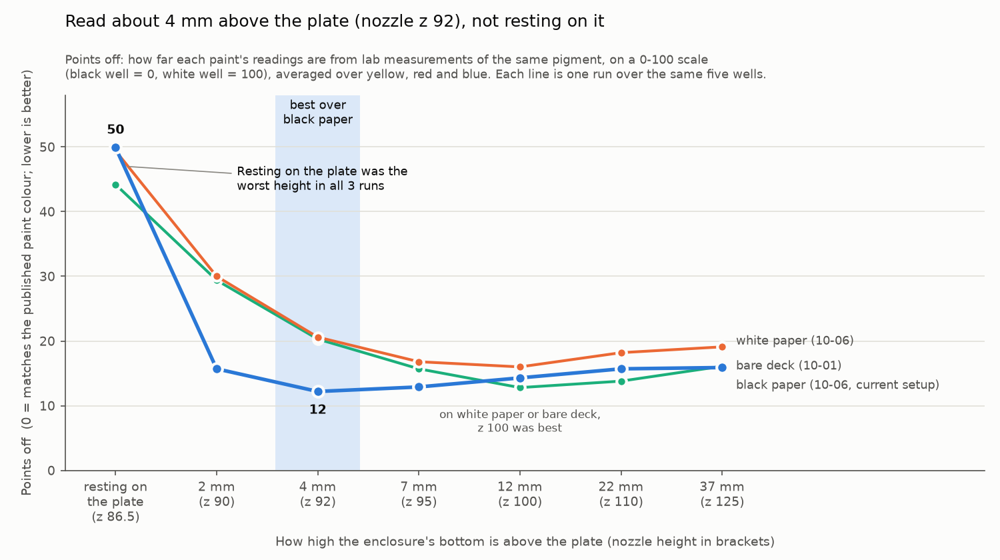
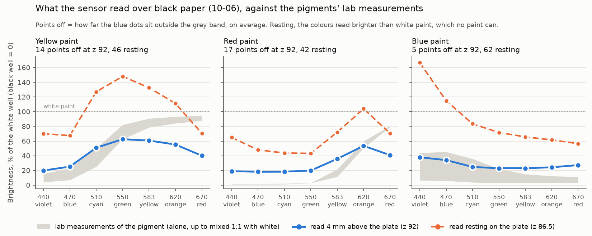

# 2026-10-09 (evening) — Read height, what the accuracy numbers mean, firmware over MQTT, the maker's references

Asked on [PR #202](https://github.com/vertical-cloud-lab/byu-vcl/pull/202) by
@timothy-commins after the [10-09 summary](accuracy-summary-2026-10-09.md): what the
percentages meant (most charts and percentages weren't clear); whether reading above the
well beats resting on it, and at exactly what height; whether the Pico W's firmware can be
installed over the MQTT broker; and which colour references the sensor's maker recommends,
and how. Also two notes to check: "at max 1.7% variation in readings when reading the same
plate in the same conditions", and "the darker the color, the more accurate it is".

No hardware. Numbers from [`analyse_read_height.py`](analyse_read_height.py) →
[`read-height-2026-10-09.json`](read-height-2026-10-09.json) and two charts, re-scored from
the values the earlier analyses committed.

## What the percentages meant

**Points off** (the 10-09 summary's "error"): for each paint, how far its 7 readings
(440–670 nm) fall outside the range of published lab measurements of its pigment, averaged,
on a scale where our black well = 0 and our white well = 100. Inside the range counts as 0.
The summary's "accuracy" was 100 minus this.

Worked example, yellow at z 92 over black paper: at 670 nm (red light) the pigment should
read 88–95 and read 40, so that channel is 48 points off; the 7 channels average 15.

Why the percentages misled:

- A sensor that sees no colour at all, reading every paint as the same grey (the grey picked
  with the answers in hand), scores 20 points off overall ("80%") and under 1 point off on
  blue ("99%"). So "86–88%" sounded far better than it is.
- The published ranges are thick, dried paint films. Ours is watered-down wet paint in a
  well, so the range itself is only roughly right.

From here on: points off (lower is better), with the readings themselves drawn against the
published band.

## Above the plate or resting on it, and which height

| points off (all three paints) | resting | z 90 | **z 92** | z 95 | z 100 | z 110 | z 125 |
| --- | --- | --- | --- | --- | --- | --- | --- |
| gap above the plate (±1.5 mm) | 0 | 2 mm | **4 mm** | 7 mm | 12 mm | 22 mm | 37 mm |
| **10-06 evening, black paper (current)** | 49.9 | 15.7 | **12.2** | 12.9 | 14.3 | 15.7 | 15.9 |
| 10-06 afternoon, white paper | 49.4 | 30.0 | 20.6 | 16.8 | **16.0** | 18.2 | 19.1 |
| 10-01, bare deck | 44.2 | 29.4 | 20.3 | 15.7 | **12.8** | 13.8 | 16.1 |
| mean of the three | 47.8 | 25.0 | 17.7 | 15.1 | **14.4** | 15.9 | 17.0 |

- **Resting on the plate was the worst height in all three runs**, 3–4× worse than the best.
- **With the black paper, the best tested height is z 92**, foot about 4 mm above the plate.
  A parabola through z 90, 92 and 95 puts the minimum at z 93.2 (11.6 points). Without the
  black paper, z 100 was best both times (interpolated z 100.7 and z 103.9).
- **Why the best height moved down:** as the enclosure comes down it sees more of its own
  well and less of the plate around it, so more of the colour difference survives (contrast
  b over black paper: 0.17 at z 125, 0.23 at z 100, 0.39 at z 92). It also lets in more
  light from under the plate, which lifts every reading like a haze (a: 0.11 at z 100,
  0.22 at z 92, 0.30 at z 90). The black paper cut that haze at z 92 from 0.38–0.39 to 0.22,
  so the closer height now wins. Shape (r²) was best at z 90–92 in every run.
- **Why resting fails:** the foot blocks the rail light from above, and the only light left
  reaches the wells sideways through the clear plate. The opaque white blocks it, the
  watered-down colours let it through, and the colours read brighter than white paint (up
  to 148% for yellow, 167% for blue at 440 nm), which no paint can. On top of that, pressing
  can push the enclosure up the nozzle (10-01: +12% on the same well).

| per paint, black paper | resting | z 90 | z 92 | z 95 | z 100 |
| --- | --- | --- | --- | --- | --- |
| yellow | 45.6 | 13.5 | 14.5 | 23.3 | 26.9 |
| red | 42.0 | 20.2 | 17.0 | 13.5 | 14.3 |
| blue | 62.1 | 13.6 | 5.3 | 1.9 | 1.5 |

**How sure:** z 92 rests on one run over black paper. z 92 and z 95 are 0.7 points apart,
the same size as the difference between that run's two ways of handling its white (direct,
or corrected for the 0.85 mm shift up the nozzle: up to 0.7 points).
A 1 mm ladder, z 90–96, two landings per well, over black paper, would settle the
millimetre. **Standing read height not switched**: still z 86.5, @timothy-commins's pick on
09-30 (made before any height comparison), pending his OK.

## The two notes

- **"At most 1.7% variation"**: right while the enclosure doesn't touch the plate. 16
  readings in one landing agree within 0.1%; separate trips 30 min apart within 1.7%
  (09-30). A landing that presses on the plate can push the enclosure up the nozzle: +12% on
  the same well on 10-01, and +0.85 mm of travel on 10-06 evening. Reading above the plate
  removes that.
- **"The darker the colour, the more accurate"**: not a property of the sensor; it flips
  with what is under the plate. At z 92 over black paper blue scored 5, yellow 15; over
  white paper and bare deck yellow scored 10, blue 26–29. The black paper takes away stray
  light that made dark paints read too light, but not the light the watered-down yellow
  loses into it. The scoring also favours blue: its published range is the widest (0.23 on
  average, red's 0.03), and a colour-blind grey lands in it at almost every channel.

## Can the Pico W be updated over the MQTT broker?

**Not with the code on the board now.** Upstream `sensor_file/main.py` (`07efedd`) and the
board's own copy (both backups on the `RPI_STREAM_CAM_HOSTNAME` Pi, `~/pico-backups/`, 09-03)
subscribe to one topic, `command/picow/{PICO_ID}/as7341/read`. The handler only reads `R`,
`Y`, `B` and `experiment_id`, takes a reading and publishes it; the only file either opens
is the broker's certificate. Nothing receives, writes or runs code, so the first change has
to go in over USB.

**After one USB visit, yes**, if that visit also installs a small updater. MicroPython can
write files to its own flash and reset itself, and the updates in question
([`../pico/`](../pico/)) are `.py` files, not the MicroPython image. What it would need:

- **A signature.** The HiveMQ free tier has no per-topic permissions: all four logins (CI,
  Hugging Face Space, OT-2, Pico) can publish anywhere. Without a check, anyone holding any
  of them could put code on the board. HMAC-SHA256 over the file with a key that only the
  board and a new GitHub secret hold; `hashlib.sha256` is in MicroPython, HMAC is a few
  lines on top.
- **A way back.** Write to a temporary name, check length and hash, then rename (atomic on
  littlefs). Keep the previous file, and boot back into it if the new code doesn't reach the
  broker within a few minutes. Otherwise one bad update means opening the enclosure again.
- **Power.** Only update with the board on its charging base.

The files that would change are small (upstream `main.py` 6.2 KB, `sensor_settings.py`
4.3 KB): one MQTT message each, well within the board's free memory. Not written: it's a security decision (@sgbaird). If it's a yes, it goes in
with the gain/integration-time change, so the USB visit for that is the last one.

## The maker's recommended colour references, and how

From ams OSRAM's *Spectral Sensor Calibration Methods*, AN000633 v2-00 (re-downloaded
10-09; page numbers are the PDF's):

1. **What we do now is its simplest method.** Two references, black and white, scaled
   `(X − Xmin)/(Xmax − Xmin)`, the "Black/White Scale" (p. 12–13): "good for such a
   primitive correction method but can be better using matrices … A higher number of
   reference targets can increase accuracy for calibration dramatically."
2. **The reference target ams uses is the 24-colour X-Rite ColorChecker** (p. 18, footnote 7:
   "a general calibration matrix based on 24 Color of X-Rite Color Checker Large"; p. 20:
   "24 measured reference targets from the Color Checker").
3. **The true colour of each target comes from a reference instrument**: "Monochromatic test
   systems and/or spectrometers are required as reference devices", and "The reference
   instrument should be at least ten times more accurate or higher than the sensor requires"
   (p. 6). Without one, the chart's own published values will do, at a cost: "use the values
   here as reference values AND accept a lower accuracy depending on the differences between
   your ColorChecker and the values used here" (p. 21).
4. **Same conditions as the samples**: "It is important to make all measurements with the
   Sensor and reference device under identical conditions closed to the application. Each
   deviation from calibration and application decreases the accuracy." (p. 16)
5. **Subtract a dark offset first.** In ams's example it is "the direct radiation of the used
   LEDs into the sensor, measured in a DARK room" (p. 21). Ours is the board's green LED,
   already subtracted.
6. **Then fit a matrix** from the 8 channels to the targets' true values by least squares,
   `K = (T Sᵀ)(S Sᵀ)⁻¹` (p. 17), with at least as many independent targets as channels:
   "the number of linearly independent targets, which must be greater than or equal to the
   number of filters used in the sensor to obtain a stable matrix" (p. 29), i.e. 8 or more.
7. **Optionally local**: refit with only the targets near the colours you care about; in
   ams's example, 12 of the 24 cut the error for one colour from ΔE 1.7 to 1.4 (p. 15–16).
8. **Per device**: "Device Calibration: This method is the most complex but has the highest
   accuracy" (p. 17). ams's own 24-patch device calibration reached "Average DeltaE 0,98487"
   and "Max DeltaE 2,30337" on the patches it was fitted to (p. 24). ΔE ≈ 1 is about the
   smallest colour difference a person can see.

**What that means here.** Printed patches can't sit in a well, and item 4 asks for the
sample's own conditions. Two ways in, cheapest first:

- **A ColorChecker under the sensor** at the read height, with its published values. It
  calibrates the sensor's channels and the rail lights, but not the plate.
- **Our own targets in the plate**: 8 or more wells of our paints and their mixtures, the
  white and the black included, each measured once on a reference spectrophotometer, then
  the matrix. That is ams's "local correction" in the same conditions as the samples.

Either way the output becomes a colour (XYZ, then ΔE) rather than our points off, which is
the standard way colour accuracy is reported.
