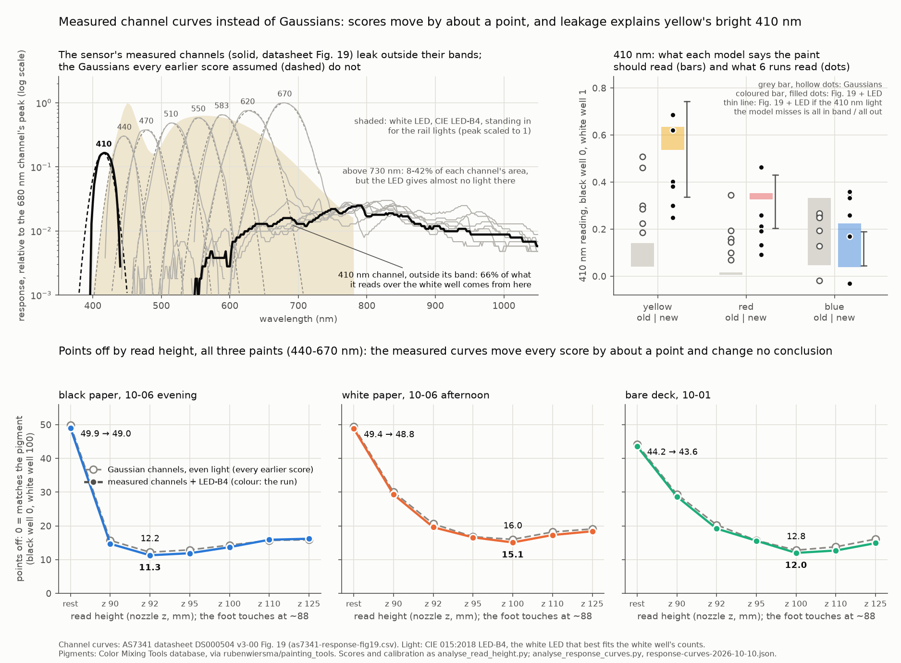

# 2026-10-10 — The sensor's measured channel curves instead of Gaussians

Asked on [PR #202](https://github.com/vertical-cloud-lab/byu-vcl/pull/202): every accuracy
score so far modelled each AS7341 channel as a Gaussian at the datasheet's typical centre and
width, under even light. Use the datasheet's full measured response curves instead, leakage
outside each band included.

No hardware. Numbers from [`analyse_response_curves.py`](analyse_response_curves.py) →
[`response-curves-2026-10-10.json`](response-curves-2026-10-10.json) and
[`response-curves-2026-10-10.png`](response-curves-2026-10-10.png). The curves are
DS000504 v3-00 Figure 19, read out of the PDF's vector paths by
[`extract_as7341_response.py`](extract_as7341_response.py) into
[`as7341-response-fig19.csv`](as7341-response-fig19.csv).

## The answer

- **The scores move by about a point, and no conclusion changes.** Over black paper at z 92
  it goes from 12.2 to 11.3 points off. Resting goes from 49.9 to 49.0. Every height in every
  run moves by 1.2 points or less, and the best heights stay where they were: z 92 over black
  paper, z 100 over white paper and over the bare deck. On the height ladders, haze and
  contrast move by 0.02 at most (black paper z 92: a 0.22 → 0.21, b 0.39 → 0.41). The
  Gaussians were not what limited the accuracy.
- **The light matters more than the curves.** Above 730 nm (near infrared) sits 8–42% of
  each channel's area. Under even light that leakage counts, and the scores then hinge on a
  guess about how the paints reflect past 730 nm, where the published spectra stop: up to 9
  points. But even light is not what the sensor sees. It predicts the white well's
  channel-to-channel ratios with a 28% error. A standard white LED (CIE LED-B4, 5100 K)
  predicts them to about 10%. It also gives little light above 750 nm, so under it the
  infrared leakage stops mattering: 0.2 points at most, whatever the guess.
- **Leakage explains why yellow read bright at 410 nm.** The white LED has little violet
  light. So 66% of what the 410 nm channel reads over the white well comes from outside its
  own band (390–440 nm), almost all of it from 440–730 nm. The channel partly sees yellow's
  bright long wavelengths. The model now expects yellow to read 0.54–0.63 there, where the
  Gaussians expected 0.04–0.14. The 09-30 runs read 0.62 and 0.69. In those runs, 410 now
  sits on the same line as the other channels (details below), and it did not before.
- **Still, 410 stays out of the score for now.** Over the white well, the 410 channel reads
  62% more than the model predicts, in all eight white readings checked. That points to light
  the model is missing. Where that light sits decides what yellow should read at 410: 0.34–0.44
  if it is violet, 0.65–0.74 if it is not. A shift of up to 0.2 is about twice the black-paper
  run's typical miss (0.11 at z 92). An
  8-channel score is given below as an extra (black paper z 92: 10.9 points, against 11.3 on
  the usual 7 channels). A measured spectrum of the rail lights would settle it.

## Details

### Which light

The rail lights are white LEDs of unknown spectrum, so each candidate light is tested
against the white well. A candidate predicts the white well's counts at each channel:
light × channel curve × the published titanium-white reflectance, summed over wavelength.
The comparison is with the counts measured over the white H12, board lamp subtracted, up to
one overall brightness. That brightness is fitted at 440–670 nm only, so 410 is a
prediction, not a fit.

Measured ÷ predicted − 1 (%), 10-06 evening over black paper, z 92, second visit to H12
(the white the black-paper scores use):

| light | 410 | 440 | 470 | 510 | 550 | 583 | 620 | 670 | rms 440–670, z 92 and 100 | rms, 6 checks |
| --- | --- | --- | --- | --- | --- | --- | --- | --- | --- | --- |
| even | −60.8 | 4.7 | −17.4 | 2.2 | 32.0 | 42.1 | 6.5 | −43.4 | 27.9 | 27.9 |
| LED-B1, 2733 K | 29.3 | 111.8 | 59.5 | 30.6 | −7.7 | −26.8 | −43.4 | −40.7 | 61.2 | 62.0 |
| LED-B2, 2998 K | 39.9 | 84.1 | 48.3 | 24.5 | −7.6 | −21.6 | −37.7 | −34.8 | 48.7 | 49.5 |
| LED-B3, 4103 K | 52.5 | 16.0 | 25.4 | 2.1 | −7.0 | −7.5 | −18.6 | −3.8 | 17.4 | 17.8 |
| **LED-B4, 5109 K** | **60.7** | −12.0 | 13.6 | 2.7 | −15.2 | −1.5 | −0.8 | 17.5 | **10.3** | **10.6** |
| LED-B5, 6598 K | 67.2 | −26.6 | −12.7 | −5.7 | −11.7 | 8.7 | 16.1 | 48.6 | 18.8 | 18.5 |

- LED-B4 fits best, both on the two readings it was picked on (z 92 and z 100) and on the six
  checks: the evening's first visit, the 10-06 afternoon and 10-01, each at z 92 and z 100.
- The leftover differences follow the height, not the run. At z 92, 440 nm is −11% to −13%
  and 670 nm +16% to +18% in all three runs. At z 100 both are within +1% to +4%. The light
  near the plate is redder.
- The 410 residual is +59% to +63% in all eight white readings. Those readings are 84–165
  counts over a 4-count lamp offset, so it is not noise.
- If one of the other LEDs had been picked, black paper z 92 would score 10.4 (B1), 10.5 (B2),
  11.1 (B3) or 11.5 (B5) instead of 11.3. The choice of LED is worth about a point.

### Points off, three ways

Points off is the measure from [`results-read-height-2026-10-09.md`](results-read-height-2026-10-09.md):
for each paint, how far its 7 readings (440–670 nm) fall outside the published range of its
pigment, averaged, on a scale where black well = 0 and white well = 100.

| run | model | resting | z 90 | z 92 | z 95 | z 100 | z 110 | z 125 |
| --- | --- | --- | --- | --- | --- | --- | --- | --- |
| black paper, 10-06 evening | Gaussian, even light (as committed) | 49.9 | 15.7 | **12.2** | 12.9 | 14.3 | 15.7 | 15.9 |
| | Fig. 19, even light | 43.7 | 12.6 | 11.8 | 18.1 | 21.3 | 24.1 | 24.5 |
| | **Fig. 19 + LED-B4** | 49.0 | 14.7 | **11.3** | 11.9 | 13.7 | 15.9 | 16.2 |
| white paper, 10-06 afternoon | Gaussian, even light (as committed) | 49.4 | 30.0 | 20.6 | 16.8 | **16.0** | 18.2 | 19.1 |
| | Fig. 19, even light | 43.1 | 23.7 | 16.3 | 16.9 | 18.5 | 20.2 | 19.5 |
| | **Fig. 19 + LED-B4** | 48.8 | 29.3 | 19.6 | 16.6 | **15.1** | 17.3 | 18.4 |
| bare deck, 10-01 | Gaussian, even light (as committed) | 44.2 | 29.4 | 20.3 | 15.7 | **12.8** | 13.8 | 16.1 |
| | Fig. 19, even light | 37.8 | 23.3 | 17.0 | 17.9 | 16.9 | 15.0 | 13.4 |
| | **Fig. 19 + LED-B4** | 43.6 | 28.7 | 19.2 | 15.6 | **12.0** | 12.7 | 14.9 |

| black paper, z 92 | yellow | red | blue | haze a | contrast b |
| --- | --- | --- | --- | --- | --- |
| Gaussian, even light | 14.5 | 17.0 | 5.3 | 0.22 | 0.39 |
| Fig. 19, even light | 18.4 | 9.7 | 7.2 | 0.19 | 0.38 |
| Fig. 19 + LED-B4 | 13.8 | 14.8 | 5.3 | 0.21 | 0.41 |

The three 2026-09-30 runs, resting on the plate, scored as in
[`results-white-black-correction-2026-10-01.md`](results-white-black-correction-2026-10-01.md)
(points off; a = what a black paint reads, b = contrast):

| 09-30 run | Gaussian, even light | Fig. 19, even light | Fig. 19 + LED-B4 |
| --- | --- | --- | --- |
| 13:25, ÷ the empty well | 29.1 (a 0.55, b 0.38) | 22.3 (a 0.52, b 0.36) | 28.3 (a 0.54, b 0.39) |
| 15:47, white A4 and black A5 | 20.5 (a −0.23, b 1.78) | 26.4 (a −0.42, b 1.90) | 21.5 (a −0.27, b 1.85) |
| 19:15, spaced wells | 14.2 (a 0.27, b 0.78) | 9.4 (a 0.20, b 0.81) | 13.0 (a 0.25, b 0.80) |

The even-light column is here only to show what the infrared leakage would do. It fails the
white-well test, and its numbers move by up to 9 points with the guess beyond 730 nm.

### How much the guess beyond 730 nm matters

The published pigment spectra stop at 730 nm. Past that they are held at their 730 nm value.
Two alternatives were tried on every pigment, the white and black included:

| model | R = 0.5 beyond 730 nm | R = 0.8 × R(730) | LED continued past 780 nm |
| --- | --- | --- | --- |
| Fig. 19, even light: references move by up to | 0.20 | 0.08 | — |
| Fig. 19, even light: points off move by up to | 8.8 | 1.8 | — |
| Fig. 19 + LED-B4: references move by up to | 0.016 | 0.007 | 0.009 |
| Fig. 19 + LED-B4: points off move by up to | 0.2 | 0.1 | 0.1 |

The CIE LED data ends at 780 nm. The last column continues it with the exponential fall of
its 730–780 nm stretch (47 nm per factor e). Under the white LED, near-infrared leakage does
not matter.

### 410 nm

What the 410 nm channel should read for each pigment's published range, and what the runs read
there. All runs are white/black calibrated except "13:25 ÷ empty". The last two columns put
the white well's unexplained 62% of 410 light all inside 390–440 nm, or all outside it.

| 410 nm | Gaussian | Fig. 19 + LED-B4 | … extra light in band | … extra light out of band |
| --- | --- | --- | --- | --- |
| published: yellow | 0.04–0.14 | 0.54–0.63 | 0.34–0.44 | 0.65–0.74 |
| published: red | 0.01–0.02 | 0.33–0.35 | 0.20–0.22 | 0.40–0.43 |
| published: blue | 0.05–0.33 | 0.04–0.23 | 0.04–0.29 | 0.04–0.19 |
| read, yellow / red / blue: 09-30 13:25 ÷ empty | 0.73 / 0.64 / 0.62 | same | same | same |
| 09-30 15:47 | 0.46 / 0.10 / −0.02 | 0.62 / 0.13 / −0.03 | 0.60 / 0.13 / −0.03 | 0.63 / 0.13 / −0.03 |
| 09-30 19:15 | 0.51 / 0.34 / 0.26 | 0.69 / 0.46 / 0.34 | 0.66 / 0.45 / 0.33 | 0.70 / 0.47 / 0.35 |
| 10-06 black paper z 92 | 0.30 / 0.19 / 0.19 | 0.40 / 0.26 / 0.26 | 0.39 / 0.25 / 0.25 | 0.41 / 0.27 / 0.27 |
| 10-06 black paper z 100 | 0.18 / 0.07 / 0.13 | 0.25 / 0.09 / 0.17 | 0.24 / 0.09 / 0.16 | 0.25 / 0.09 / 0.17 |
| 10-06 white paper z 100 | 0.22 / 0.16 / 0.27 | 0.30 / 0.21 / 0.36 | 0.29 / 0.20 / 0.35 | 0.31 / 0.22 / 0.37 |
| 10-01 z 100 | 0.28 / 0.14 / 0.25 | 0.38 / 0.19 / 0.33 | 0.37 / 0.18 / 0.32 | 0.39 / 0.20 / 0.34 |

A run's readings are not expected to land in the published ranges: the haze and the lost
contrast distort every channel. The fairer test is whether 410 suffers the same distortion as
the other channels. Each run gives a straight line, reading = a + b × published (fitted at
440–670 nm), and the question is how far 410 sits off that line compared with the channels
that made it (rms over the three paints):

| how far off the run's own line | Gaussian: 410 vs 440–670 | Fig. 19 + LED-B4: 410 vs 440–670 |
| --- | --- | --- |
| 09-30 13:25 ÷ empty | 0.10 vs 0.06 | 0.04 vs 0.07 |
| 09-30 15:47 | 0.36 vs 0.15 | 0.17 vs 0.14 |
| 09-30 19:15 | 0.14 vs 0.09 | 0.04 vs 0.09 |
| 10-06 black paper z 92 | 0.06 vs 0.07 | 0.06 vs 0.07 |
| 10-06 black paper z 100 | 0.04 vs 0.06 | 0.06 vs 0.06 |
| 10-06 white paper z 100 | 0.06 vs 0.08 | 0.09 vs 0.08 |
| 10-01 z 100 | 0.05 vs 0.09 | 0.09 vs 0.10 |

- **The 09-30 puzzle is explained.** With Gaussians, 410 sat 1.5–2.4× further off each 09-30
  run's line than the other channels. Yellow at 13:25 read 0.15 above its line. With the
  measured curves, all three paints are within 0.04 of the line in that run (yellow −0.04,
  red −0.04, blue +0.03), closer than the other channels.
- **In the later runs (z 92–100) 410 was never the outlier.** It sits as close to the line
  as the other channels under either model. The haze then squeezes every channel so much
  that the model hardly matters.
- **Where F1's light comes from**, over the white well: under LED-B4, 34% from inside
  390–440 nm, 62% from 440–730 nm and 4% from above 730 nm. Under even light it is 34%, 19%
  and 47%. For comparison, the other seven channels get 89–98% of their light from within
  ±1 FWHM of their centre under LED-B4. If the missing 62% is violet light, F1's share from
  outside its band drops to 40%. If it is out of band, the share rises to 79%.
- **8 channels as an extra.** Over every run and height, the 8-channel score averages 0.3
  points below the 7-channel one (range −1.6 to +0.5). Black paper z 92: 10.9 against 11.3.
  The 8-channel values are in the JSON (`eight_channel_extra`). Not adopted, for the reason in
  the answer: the 410 reference rests on the rail lights' violet, and the white well says the
  model has that wrong by 62%.

### Method

- Each channel reads Σ E·r·R ÷ Σ E·r on the curves' 2 nm grid, 350–1050 nm. E is the light,
  r the Fig. 19 curve, R the reflectance. The Gaussian model is the committed
  `analyse_paint_accuracy.per_channel`. Both the light and the curves are taken per unit
  energy.
- The published references, R_white and R_black, are recomputed with each model. The raw
  readings are then re-calibrated by calling the earlier analyses' own functions:
  `analyse_white_paper.score_at` and `oct1_ladders`; `analyse_black_paper.ladders`, `scores`
  and `bottom`; `analyse_white_black_correction.score`; `analyse_read_height.row`. The 10-01
  resting value uses the second-landing white, as `analyse_white_paper.main` does. Nothing is
  approximated. One addition: that row's per-paint values are computed now, where before only
  its total was stored.
- **Check first.** The Gaussian model, run through this code, gives all 144 committed values
  compared: every points off per run, height and paint, a, b, r², and the 09-30 misses
  (0.291 / 0.205 / 0.142). The largest difference is 0.0. It gives black paper z 92 = 12.2 and
  resting 49.9, and the script stops if any of them does not match.
- Re-runs are byte-identical.

### Caveats

- Fig. 19 was measured at 256x; our readings are at 128x. The channels' relative
  sensitivities are taken as the same at both gains.
- Fig. 19 is one typical part, measured with a diffuser on the package. Whether our board's
  unit, and its angle of view, match it is untested. The datasheet allows each centre ±10 nm
  ([`accuracy-sources-2026-10-02.md`](accuracy-sources-2026-10-02.md)).
- LED-B4 is a stand-in, the best of five standard white LEDs, not a measurement of the rail
  lights. The 10% residuals, and the 62% at 410 nm, say the real light differs. The light also
  reaches the well through the clear plate and past the white PLA enclosure, which can tint it.
- The 410 analysis rests on the curve extraction's resolution near zero. F1's leakage plateau
  (0.003–0.02 of F8's peak at 550–1000 nm) is well above the CSV's 0.001 steps.
