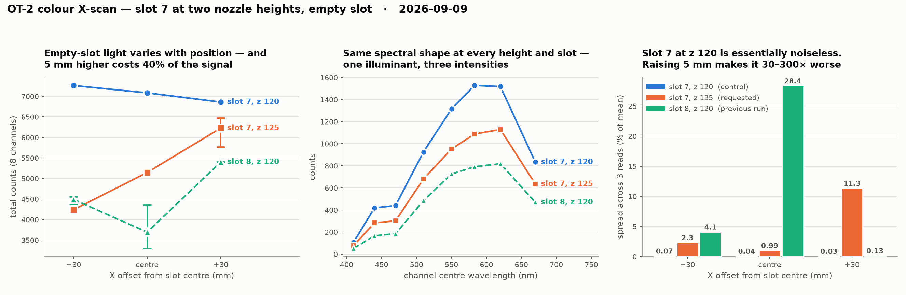

# X-scan in slot 7, at two nozzle heights — 2026-09-09

Requested on [#197](https://github.com/vertical-cloud-lab/byu-vcl/issues/197):
*"try doing it exactly as it was before but this time in well 7, and also 5mm
higher"*.

Two runs, both with slot 7 empty:

| run | scan slot | read Z | aperture above deck | flags |
| --- | --- | --- | --- | --- |
| **requested** | 7 | 125.0 | 34.5 mm | `--scan-slot 7 --read-z 125` |
| **control** | 7 | 120.0 | 29.5 mm | `--scan-slot 7 --read-z 120` |

The control was added because the requested run changes *two* variables at once
against the 2026-09-09 slot 8 baseline — the slot and the height — so on its own
it cannot say which of them moved the numbers. Nothing else was altered: the
motion recipe, Y (225.0), the ±30 mm X offsets, settle time and read count are
all as before.

Both runs completed the full cycle with no aborts.

| | requested (z 125) | control (z 120) |
| --- | --- | --- |
| Seated baseline | 438 | 442 |
| Grip check | 438 → 2242 = **5.1×** | 442 → 2336 = **5.3×** |
| Reseat confirmation | **441** | **438** |

## Results

Read positions are an exact one-slot-pitch mirror of the slot 8 run — same Y,
same offsets, 132.5 mm to the left.

**Requested: slot 7, z 125** (mean of 3 reads)

| X (mm) | dx | 410 | 440 | 470 | 510 | 550 | 583 | 620 | 670 | **total** |
| --- | --- | --- | --- | --- | --- | --- | --- | --- | --- | --- |
| 33.88 | −30 | 63 | 208 | 234 | 554 | 770 | 878 | 960 | 571 | **4238** |
| 63.88 | centre | 78 | 283 | 301 | 681 | 952 | 1087 | 1128 | 634 | **5144** |
| 93.88 | +30 | 94 | 357 | 372 | 808 | 1154 | 1339 | 1358 | 745 | **6227** |

**Control: slot 7, z 120**

| X (mm) | dx | 410 | 440 | 470 | 510 | 550 | 583 | 620 | 670 | **total** |
| --- | --- | --- | --- | --- | --- | --- | --- | --- | --- | --- |
| 33.88 | −30 | 111 | 431 | 452 | 946 | 1344 | 1571 | 1557 | 852 | **7263** |
| 63.88 | centre | 108 | 419 | 440 | 925 | 1314 | 1528 | 1517 | 833 | **7084** |
| 93.88 | +30 | 104 | 405 | 424 | 900 | 1279 | 1479 | 1465 | 805 | **6861** |

## What the 5 mm did

**It cost 9–42% of the signal, and it cost most of the precision.**

| position | z 120 | z 125 | ratio |
| --- | --- | --- | --- |
| −30 | 7263 | 4238 | 0.583 |
| centre | 7084 | 5144 | **0.726** |
| +30 | 6861 | 6227 | 0.908 |

A pure inverse-square falloff from 29.5 mm to 34.5 mm predicts
`(29.5/34.5)² = 0.731`. The **centre** position lands on that almost exactly
(0.726); the two off-centre positions do not. So the light reaching the aperture
behaves like a point source directly beneath the slot centre, and increasingly
not like one as you move away from it.

Precision is the sharper difference. Spread across the three reads at each
position, as a percentage of the mean:

| position | z 120 | z 125 | z 120 (slot 8, previous run) |
| --- | --- | --- | --- |
| −30 | **0.07%** | 2.31% | 4.08% |
| centre | **0.04%** | 0.99% | 28.36% |
| +30 | **0.03%** | 11.34% | 0.13% |

At z 120 in slot 7 the three reads agree to within 2–5 counts out of ~7000.
That is 30–300× tighter than the same positions at z 125, and it is the best
repeatability any run has produced.

**The gradient also reverses.** At z 120 the total *falls* gently with X
(7263 → 6861, −5.5% over 60 mm). At z 125 it *rises* steeply
(4238 → 6227, +47%). Two different things dominate at the two heights: something
stable and nearly position-independent when the aperture is low, something
strongly position-dependent when it is raised. One pair of runs does not isolate
the mechanism, so this is a measurement, not an explanation.

**The spectral shape is identical in all three conditions** — the same rise to a
583/620 nm peak, only scaled. One illuminant at several intensities, and a good
sign the sensor is behaving linearly.

## The finding that matters most for the paint test

**Every reading taken so far — this run, the control, and the 2026-09-09 slot 8
run — was made with the module's own illumination switched off.**

`run_xscan_test.py --rgb` defaults to `0,0,0`, and `SensorLink.read()` publishes
that straight through as `{"command": {"R": 0, "Y": 0, "B": 0}}`. So these
numbers are ambient room and deck light leaking into the enclosure, not a
controlled measurement. That is exactly why they wander 47% across 60 mm of
travel, and why the height mattered so much.

For red/blue/yellow acrylic in vials, the reading wanted is the paint's
reflectance under *known* illumination. That means running with `--rgb` set, and
it makes the light-tightness of the enclosure the thing to fix — not the
normalisation strategy.

## Recommended configuration

Based on the four scans now on record:

- **Slot 7, not slot 8.** Slot 7 gives ~7000 counts against slot 8's ~4500, with
  a far gentler positional gradient (−5.5% vs +46%) and no sign of the 28%
  mid-run wobble slot 8 showed at its centre.
- **z 120, not 125.** The extra 5 mm buys nothing and costs both signal and
  repeatability.
- **Turn the LEDs on** (`--rgb`) before measuring paint, and re-baseline.

## Files

| file | contents |
| --- | --- |
| `xscan-slot7-2026-09-09.json` | requested run, 15 readings |
| `xscan-slot7-z120-2026-09-09.json` | control run, 15 readings |
| `xscan-slot7-2026-09-09.png` | the three-panel comparison above |
| `deck-before-slot7-2026-09-09.jpg` | deck before any motion |
| `deck-after-slot7-2026-09-09.jpg` | deck after, module reseated |

All 30 readings were also written to `digital-wetlab.sensor-data`.
