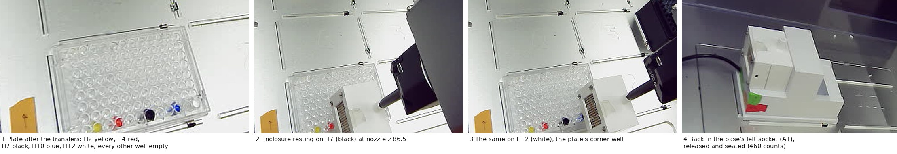
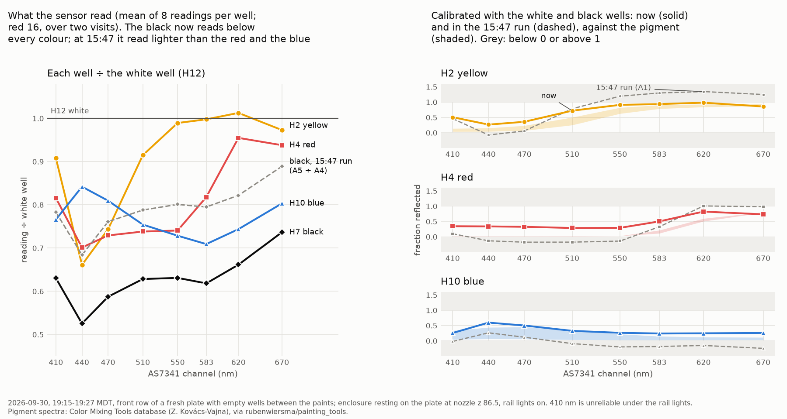

# Five paints with empty wells between them: the black is black now, but the colours read too light where they should be dark

**2026-09-30, 17:53–19:32 MDT. Asked on [PR #202](https://github.com/vertical-cloud-lab/byu-vcl/pull/202)
by Timothy Commins:** "i put white in slot h12 and black in slot h 7. please run the
test again but following your recommendations of having the color slots have an
empty slot in between them". A fresh plate, with Timothy's white in H12 and black in
H7 (how much water they have wasn't recorded). The robot put yellow, red and blue
into H2, H4 and H10, then one enclosure trip read all five.

- **The black is now the darkest well in every channel.** At 440–670 nm every colour
  reads 9–61% above it. In the 15:36 run the red and the blue read 3–8% *below* the
  black. The black reads 0.53–0.74 of the white, against 0.68–0.89 then, so the
  white–black span is about twice as wide.
- **The calibration now stays between 0 and 1**: 0.24 to 0.98 at 440–670 nm, against
  −0.25 to 1.35 before. The shapes are right. Yellow is dark at 440–470 and bright
  from 550, red is bright only from 620, and blue is brightest at 440–470, its
  clearest peak yet.
- **It still isn't accurate: every colour has a floor.** Where its pigment is
  near-black, each colour calibrates to 0.24–0.36. The red reads 0.29–0.34 at
  440–550 nm, where its pigments reflect 0.01–0.03. Some bright channels read high
  too: blue by 0.16 at 440 nm and red by 0.23 at 620 nm.
- **By the numbers**: the mean distance outside the pigment's published range is
  0.09 for yellow (0.27 before), 0.09 for blue (0.15) and 0.25 for red (0.20). One of
  21 values lands inside its range (2 before).
- **The white is only just bright enough.** At 550–620 nm the yellow reads within
  1.3% of it, and 1.3% above it at 620. Titanium white should reflect more than PY74 there.
- **Likely cause: the bright background gets into the colour readings.** The plate
  is clear and the deck under it is lit, and there are two ways that light can get
  in. It can come up *through* a watered-down colour, or the sensor can see some of
  the empty plate *around* the paint. Red shows the second one happens: see the
  next point. A sheet of black paper under the plate blocks both.
- **Where the enclosure lands matters.** Red's two visits, five minutes apart,
  differ by up to 12.5% at 440 nm and agree at 620–670 nm. That change matches the
  sensor trading 13% of its view of red paint for empty plate (R² 0.91). Its
  calibrated 440–550 nm values move from 0.23–0.26 to 0.35–0.41.

Every reading is in [`paint-spaced-2026-09-30.json`](paint-spaced-2026-09-30.json);
[`analyse_spaced_wells.py`](analyse_spaced_wells.py) reproduces every number below
and the chart, and writes them to [`spaced-wells-2026-09-30.json`](spaced-wells-2026-09-30.json).

## The wells

All in the plate's front row, so every paint sits on the same edge with empty
wells on both sides and the whole of row G empty behind it:

| H1 | **H2** | H3 | **H4** | H5 | H6 | **H7** | H8 | H9 | **H10** | H11 | **H12** |
|---|---|---|---|---|---|---|---|---|---|---|---|
| | yellow | | red | | | black | | | blue | | white |

| well | what | how it got there |
| --- | --- | --- |
| H2 | yellow (PY74) | 200 µL from its vial by the robot, 18:32 |
| H4 | red (PR170 + PR9) | 200 µL by the robot, 18:39 |
| H7 | black, BASICS Mars Black (PBk11) | by hand, before 17:53; volume and water ratio not recorded |
| H10 | blue (PB15:3) | 200 µL by the robot, 18:45 |
| H12 | white, BASICS Titanium White (PW6) | by hand, before 17:53; volume and water ratio not recorded |

## The readings

Mean counts at nozzle z 86.5 (enclosure resting on the plate), rail lights on, eight
readings per well, 19:15–19:27. Red is the mean of its two visits.

| well | 410 | 440 | 470 | 510 | 550 | 583 | 620 | 670 | total |
| --- | --- | --- | --- | --- | --- | --- | --- | --- | --- |
| H2 yellow | 94 | 239 | 300 | 803 | 1217 | 1368 | **1488** | 966 | 6,476 |
| H4 red | 84 | 254 | 294 | 648 | 911 | 1122 | 1404 | 931 | 5,648 |
| H7 black | 65 | 190 | 237 | 552 | 776 | 848 | 972 | 731 | 4,372 |
| H10 blue | 79 | 304 | 327 | 662 | 896 | 972 | 1093 | 798 | 5,132 |
| H12 white | 103 | 362 | 404 | 878 | 1230 | 1371 | 1470 | 993 | 6,810 |

Bold: the yellow above the white. The eight readings of a visit agree within 0.55%
in every channel for black, white, blue and yellow, and within 1.4% for red.

The two checks proposed after the 15:36 run:

| check | 15:36 run (A row, paints side by side) | now (H row, spaced) |
| --- | --- | --- |
| black below every colour, 440–670 nm | **no**: red 4–8% below it at 440–550, blue 3–6% at 510–670 | **yes**: every colour 9–61% above it |
| white above every colour, 440–670 nm | **no**: yellow 4–8% above it at 550–670 | **almost**: yellow −1.1, −0.2, +1.3, −2.7% at 550, 583, 620, 670 |
| black ÷ white | 0.68–0.89 | 0.53–0.74 |

## The calibration

`reflectance = R_black + (R_white − R_black) × (paint − black) ÷ (white − black)`,
exactly as in [`analyse_white_black.py`](analyse_white_black.py), with `R_white`
and `R_black` the mean of seven published PW6 and two PBk11 spectra.

| | 410 | 440 | 470 | 510 | 550 | 583 | 620 | 670 |
| --- | --- | --- | --- | --- | --- | --- | --- | --- |
| yellow | 0.51 | **0.27** | **0.36** | 0.72 | 0.91 | 0.94 | 0.98 | 0.86 |
| PY74 | 0.04–0.14 | 0.04–0.15 | 0.07–0.23 | 0.25–0.50 | 0.63–0.82 | 0.79–0.91 | 0.84–0.93 | 0.88–0.95 |
| red | 0.35 | **0.34** | **0.33** | **0.29** | **0.29** | 0.50 | 0.82 | 0.73 |
| PR170 / PR9 | 0.01–0.02 | 0.01–0.02 | 0.01–0.02 | 0.01–0.02 | 0.03 | 0.11–0.21 | 0.51–0.60 | 0.79–0.81 |
| blue | 0.26 | 0.60 | 0.50 | 0.33 | **0.26** | **0.24** | **0.25** | **0.26** |
| PB15:3 | 0.05–0.33 | 0.06–0.44 | 0.06–0.45 | 0.04–0.36 | 0.03–0.22 | 0.03–0.15 | 0.03–0.12 | 0.03–0.11 |

The ranges are the pigment alone and mixed 1:1 with white (red: PR170 to PR9).
Bold: where the pigment is near-black. Swapping which published white and black
spectra are used moves no value by more than 0.12.

| | mean outside the range, 440–670 | channels inside | where the pigment is dark | where it is bright |
| --- | --- | --- | --- | --- |
| yellow | 0.09 (15:36: 0.27) | 0 of 7 (0) | 0.27–0.36 at 440–470 (pigment ≤ 0.23) | +0.09, +0.03, +0.05, −0.09 at 550, 583, 620, 670 |
| red | 0.25 (0.20) | 0 of 7 (0) | 0.29–0.34 at 440–550 (≤ 0.03) | +0.23 at 620, −0.07 at 670 |
| blue | 0.09 (0.15) | 1 of 7 (2) | 0.24–0.26 at 550–670 (≤ 0.22) | +0.16 at 440, +0.05 at 470 |

"Where it is bright" is the distance above (+) or below (−) the top of the range.
Red got worse by the first measure because it went from below zero to above its
range: its 440–550 nm values were −0.13 to −0.18 at 15:36 and are +0.29 to +0.34
now. The yellow's 620 ÷ 440 ratio is 3.7, against 20 for pure PY74 and 6.1 mixed
with white (at 15:36 it was −18.5).

## Why the colours still read too light

The black is now darker than the colours' darkest channels, so it is no longer the
problem. What's left has the same signature in all three colours: a floor where the
pigment absorbs, and some bright channels above the pigment. The background under
and around the paint is brighter than any paint: an empty well read brighter than
the white well in the 15:36 run. Three things could let it in, and this run can't
fully separate them:

- **Through the paint.** A thin, watered-down colour lets some of the lit deck show
  through it: a little at every wavelength, and more in the paint's own colour.
- **Around the paint.** If the sensor sees past the edge of the paint, some of what
  it sees is empty plate. Red's two visits show that this happens (next section).
  It cancels in the calibration only if every well gets the same share, and red's
  two visits show that share isn't fixed.
- **Different depths.** The colours are 200 µL each. The white and black volumes
  weren't recorded, and a well with a different depth reads differently.

A sheet of black paper under the plate makes the background dark, which takes the
first two out together.

## Red's two visits

| | 410 | 440 | 470 | 510 | 550 | 583 | 620 | 670 | total |
| --- | --- | --- | --- | --- | --- | --- | --- | --- | --- |
| visit 1, 19:22 | 82 | 239 | 282 | 626 | 883 | 1096 | 1401 | 933 | 5,541 |
| visit 2, 19:27 | 86 | 269 | 307 | 670 | 940 | 1148 | 1406 | 930 | 5,754 |
| change | +4 | +30 | +25 | +44 | +57 | +52 | +5 | −3 | +213 |
| 13% empty plate | | +31 | +27 | +45 | +57 | +44 | +14 | +8 | |

The last row is what the change would be if the sensor saw 13% empty plate instead
of red paint, fitted at 440–670 nm (R² 0.91). It uses the 15:47 run's empty A6 for
"empty plate", since this run read no empty well. The fit is close, so a small
difference in where the enclosure sits over the well moves the reading this much.
Visit 1 came from H10, moving left, and visit 2 from H2, moving right.

Two smaller things were also different about the last three wells:
- **Red drifted within each visit**, by 3–5% of its total, about equally in every
  channel. The other four wells' totals stayed within 0.3%.
- **The ladder wasn't steady.** On the way down over blue, the first red visit and
  yellow, the light dropped at z 89 and rose again at z 88. Over black and white it
  fell steadily. A foot that lands tilted and then settles would do this, but that
  is a guess.

## What to change

1. **Black paper under the plate**, then read the same wells again. This needs no new
   paint. If the bright background is the cause, the colours' dark channels drop
   towards their pigments.
2. **Make the colours less watery, and put 200 µL in every well**, the white and the
   black too, so every paint is the same depth. Write down the water-to-paint ratio
   of each.
3. **Read every well twice, arriving from opposite sides**, to measure how much the
   landing moves the reading. That's a change to the next run, not to the deck.

## How it ran

**Before anything moved.** At 17:55 the sensor didn't answer, though the broker was
fine. At 18:05 it answered again: someone had moved the enclosure from the base's
right socket (A2) to the left one (A1), turned to show a different face. The first
robot-camera photo, at 17:56 with the rail lights on, was overexposed and hid the
plate entirely; the H7 black was the only thing that showed. The comment briefly
said the plate was missing, which was wrong.

**The transfers** ([`paint_transfer.py`](paint_transfer.py), maintenance runs
`d9339bb2` and `f0df2948`):
- **The vials hadn't moved.** Photos at the same poses as the 12:46–12:59 transfers
  differ from them by 2.8–6.4 grey levels on average.
- **Each vial was stirred before the draw**, with the new `mix` command: 3 × (150 µL
  in, 150 µL back out) at 30 µL/s, at the draw depth (tip end at z 38, ~10 mm under
  the paint). Then 200 µL at 30 µL/s, a 3 s wait, and slowly out.
- **The first try stopped at the stir.** Opentrons 8.8.1 refused the second
  aspirate in place (`PipetteNotReadyToAspirateError`), because a dispense that
  empties the tip counts as pushing the plunger past the bottom unless it says
  `pushOut: 0`. `mix` now does. That tip (E1) had stirred once and held nothing. It
  went to the trash, and the driver was restarted.
- **Tips F1, G1 and H1**, one per colour. Each dispensed 2.7 mm above the well
  floor at 30 µL/s, blew out 1 mm below the rim, and went to the trash.
- **Loaded tips never passed over a well.** They went up to tip-end z 110, out to
  y 2 in front of the plate's front row, along it, and into the well. The empty tips
  went round the tip rack to the trash, not over it.

**The enclosure trip** ([`enclosure_height_cal.py`](enclosure_height_cal.py),
maintenance run `c467292d`, `--socket-x 36.55 --socket-y 315.5 --press-z 89.0
--carry-z 125 --carry-segment 400 --drop-dx 0 --max-speed 3 --no-live --floor 86
--clear-z 90`):
- **Pick-up from the left socket at its usual point, unadjusted.** Seated: 440
  counts. The bare nozzle came down to z 102 without touching the enclosure
  (≤ 0.05 px). It pressed to z 89 in 2 mm steps (≤ 0.13 px), and the collar's rim
  showed round the nozzle from z 93.
- **Grip.** Lifted to z 93, the enclosure's face rose 2.2 px: it hung ~2 mm over its
  seat, as the right-socket runs did. After 80 jolts at 3 mm/s it was at −2.29 px,
  so no slip. The grip check at z 110 was 7.2×.
- **Carry and reads.** Carried via z 190 to the front row. Wells in the order H7,
  H12, H10, H4, H2, then H4 again. Each went z 125 → 90 → 1 mm steps → 86.5, then
  eight readings.
- **Contact.** Over the black and the white, the light fell 216 and 540 counts from
  z 90 to 89, 44 and 210 to z 88, 28 and 42 to z 87, then 8 and 0 to z 86.5. So the
  foot lands between z 88 and 87, as it did over A1 (87.9) and the plate's centre
  (88.1–88.4) that morning.
- **Back home.** Released in the left socket at 19:31: 460 counts after (440 before).
  The camera check of the same pose before and after gave −0.10 px. The robot
  homed, the run closed and the rail lights went off.
- **The sensor lasted the whole trip**: 22 minutes off its base (19:09:35–19:31:25),
  where this afternoon it lasted 14 and 16.

## Files

| file | what |
| --- | --- |
| [`paint-spaced-2026-09-30.json`](paint-spaced-2026-09-30.json) | every reading (8 channels, times, positions), the transfers, the trip, every ladder step |
| [`analyse_spaced_wells.py`](analyse_spaced_wells.py) | the analysis and the chart |
| [`spaced-wells-2026-09-30.json`](spaced-wells-2026-09-30.json) | its output: means, both checks, calibration, red's two visits, ladders |
| [`spaced-wells-2026-09-30.png`](spaced-wells-2026-09-30.png) | the chart |
| [`spaced-wells-2026-09-30.jpg`](spaced-wells-2026-09-30.jpg) | four robot-camera photos |

On the Pi (`RPI_STREAM_CAM_HOSTNAME`), in `~/color-read-0930h/`: `paint/` (the
first transfer try), `paint2/` (the three transfers, 87 photos and the log) and
`enc/` (the enclosure trip: photos, `log.txt`, `readings.jsonl`, the release
check). No services, timers or settings were changed.
