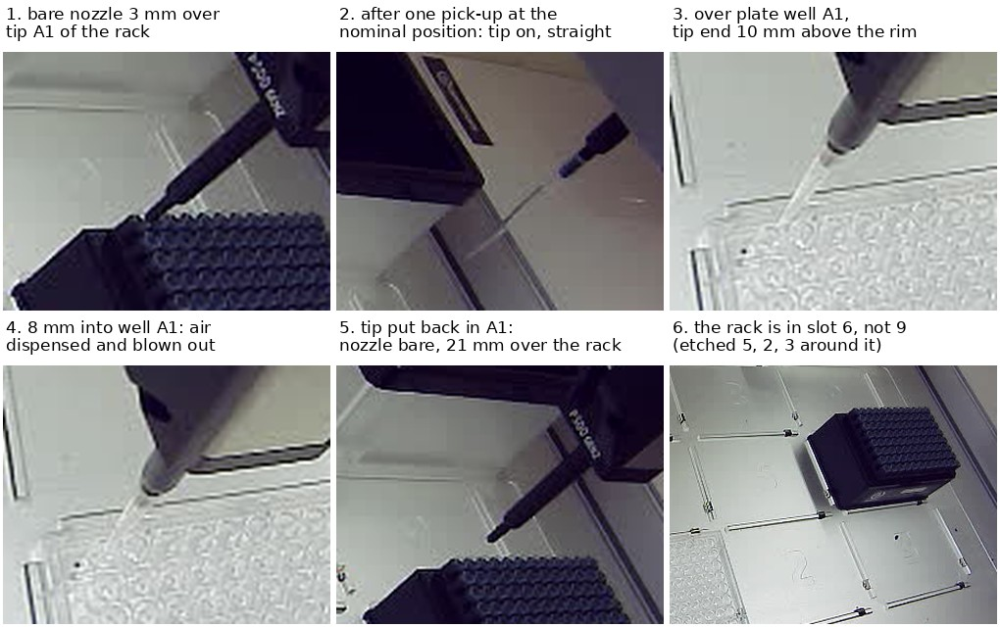

# One 300 µL tip picked up, taken into a plate well, and put back

**2026-09-29, 19:00–19:09 MDT. Asked on [PR #202](https://github.com/vertical-cloud-lab/byu-vcl/pull/202):
"while the enclosure is not in position, please do the calibration test for the
pipette plastic tips".** This is the tips-and-liquid stage from 09-25: pick up a
300 µL tip from the rack and check that the P300 can place liquid in the 96-well
plate. One pick-up, as asked.

**It worked first time, at the robot's nominal position with no correction.** The
tip came up straight, went 8 mm down into plate well A1, and air was aspirated
above the well and dispensed and blown out inside it. Then the tip went back into
its own rack position, the robot homed, and the run closed.

All numbers below are in [`tip-pickup-2026-09-29.json`](tip-pickup-2026-09-29.json).

## Before anything moved

- The robot answered (0.8 ms), with no run open and the rail lights off.
- The enclosure was still on the deck in front of its base (back of slot 7), where
  it fell at 17:30. Every sideways move stayed high over it: nozzle z ≥ 150 bare,
  tip end z ≥ 110 with a tip on.
- **The tip rack is in slot 6.** Earlier notes only said "right-hand column", and
  the AC protocol puts it in slot 9. The first run assumed 9 and hovered the bare
  nozzle over that slot, 30 mm above tip height. The photo showed empty deck under
  it, and the slot numbers etched in the deck (5, 2 and 3 around the rack, panel 6)
  settled it. That run homed and closed without touching anything.

## The pick-up

[`tip_cal.py`](tip_cal.py) drives the robot one step at a time, like
`enclosure_height_cal.py`. If it hears nothing for 15 minutes, it puts any tip back
and homes.

1. **Hover.** The bare nozzle went to 30, 10 and 3 mm over tip A1 (slot 6), with a
   robot-camera photo at each height, plus 2 mm offsets in X and Y at 3 mm. It sat
   over A1 as closely as this camera can tell (panel 1). That is about 1 px per mm
   here, with a black nozzle over a black rack, so the check is good to 1–2 mm, not
   better. So no offset was applied.
2. **Pick-up** with Opentrons' own `pickUpTip`. On this pipette (P300 single GEN2,
   `p300_single_v2.1` in opentrons 8.8.1) that is a 17 mm press at 10 mm/s with the
   Z motor limited to 0.125 A, then back up and a Z re-home. That low current is why
   it was safe to try blind: a nozzle that lands on a tip's rim just stalls there.
   It didn't need to. **The clear tip is on the nozzle, in line with the pipette's
   axis** (panel 2).

The robot used the nominal tip length, 59.3 mm tip minus 8.2 mm overlap = 51.1 mm,
because it has no tip-length calibration for this pipette.

## The well

The tip went to plate well A1 (slot 1) and down in steps, with a photo at each:
10, 5, 0, −4 and −8 mm from the rim. The floor is 10.67 mm down, so the deepest step
left the tip end 2.67 mm over it, by the robot's nominal numbers.

- 50 µL of air was aspirated at 10 mm over the rim (panel 3).
- At −8 mm it was dispensed and blown out (panel 4).
- No step showed the tip bending or catching on the well.

**There is no liquid on the deck**, so this checks the motion and the plunger, not
the liquid itself.

## Putting it back

`dropTip` into its own rack position, the way `return_tip()` does it: tip end
lowered to 29.65 mm below the rim, ejected, plunger homed. Afterwards the bare
nozzle hung 21 mm over the rack (panel 5). Then home, run closed, rail lights back
off as they were found. **The tip is back in A1 and has only touched air.** Reuse
it or throw it out.

## What this does and doesn't show

- **Shown:** at this robot's current calibration, the nominal positions are good
  enough to pick up a 300 µL tip from A1 of a rack in slot 6 and put it into A1 of
  the plate in slot 1.
- **Not shown:**
  - **Centring better than 1–2 mm.** This camera can't resolve it.
  - **The height to better than about a millimetre.** The robot has no tip-length or
    pipette-offset calibration for this P300, so the heights are nominal. The tip
    didn't visibly touch the floor at a nominal 2.67 mm clearance.
  - **Anywhere else on the plate.** Only A1 was visited. A1 and H12 together would
    check the plate's position and squareness.
  - **Real liquid.**
- **For a protocol**, use slot 6 for the tips, or move the rack to 9 to match the AC
  protocol. Every descent in this test was stepped. A protocol's are not, so a
  first real run should still go slowly over one well.

## Files

| file | what |
| --- | --- |
| [`tip_cal.py`](tip_cal.py) | the step-by-step driver: hover, pick-up, well, air, dispense, return |
| [`tip-pickup-2026-09-29.jpg`](tip-pickup-2026-09-29.jpg) | the six panels above, from the robot camera |
| [`tip-pickup-2026-09-29.json`](tip-pickup-2026-09-29.json) | positions, commands and results |

On the Pi (`RPI_STREAM_CAM_HOSTNAME`): `~/tipcal-0929/`, with all 19 robot-camera
photos, `log.txt` and `state.json`. The aborted slot-9 hover is in
`~/tipcal-0929/slot9-hover/`. No services, timers or settings were changed.
