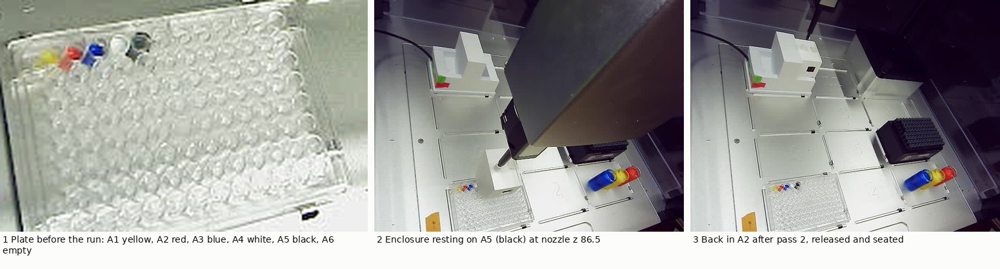
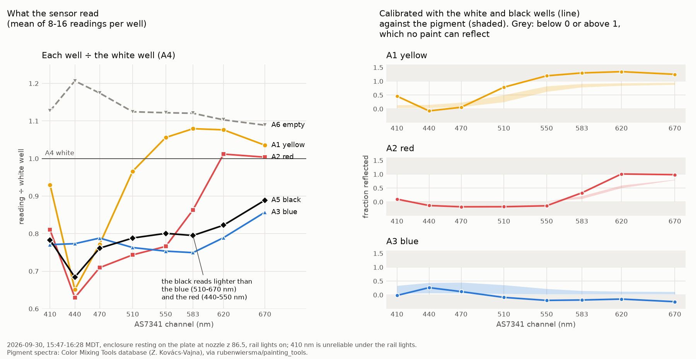

# A white and a black well: the correction doesn't work yet, because the black reads grey

**2026-09-30, 15:26–16:40 MDT. Asked on [PR #202](https://github.com/vertical-cloud-lab/byu-vcl/pull/202)
by Timothy Commins:** "i put the titanium white in a4, and the mars black in a5. for
the black color, to my eyes when watered down it appears to be gray. please run just
the color sensing test for the purpose of testing accuracy". No pipetting; the
enclosure was carried to the plate twice and read every well it could before the
sensor board ran out.

- **The white/black correction doesn't make these readings accurate.** Per channel,
  `(paint − black) ÷ (white − black)`, scaled to what titanium white and Mars black
  reflect, puts the three colours between **−0.25 and 1.35** at 440–670 nm. A paint
  can only reflect between 0 and 1. Only 2 of the 21 values land inside the
  pigments' published ranges.
- **To the sensor the black is grey, as it looks to the eye.** The red is near-black
  from 440 to 550 nm and the blue from 510 to 670 nm (both reflect 1–3% there), yet
  they read **3–8% below the black well**. To put them on their pigments, the black
  would have to reflect 13–24%, where Mars black reflects ~2%.
- **The white is too dim.** The yellow reads 4–8% above it from 550 to 670 nm, and
  the red matches it at 620–670 nm. Titanium white reflects more than either there.
- **The readings repeat well.** Eight readings in a visit agree within 0.7% in every
  channel. The same well on two trips half an hour apart agreed within 0.8% for red
  and blue, 0.9% for the white and 1.7% for the black.
- **A well's reading depends on what is next to it.** After the white and black went
  into A4 and A5, the empty A6 read **7–13% lower** than at 13:31 and the blue A3
  2–5% lower. A1 and A2, whose neighbours didn't change, repeated within 1% over the
  three hours. So light passes from well to well through the clear plate, and the
  black sits between the white and an empty well, the two brightest neighbours on
  the plate.
- **The sensor board ran out twice.** It answered for 16 and then 14 minutes after
  leaving its base, and was silent after the second release. It needs a full charge.

Every reading is in [`paint-white-black-2026-09-30.json`](paint-white-black-2026-09-30.json);
[`analyse_white_black.py`](analyse_white_black.py) reproduces every number below
and the chart, and writes them to [`white-black-2026-09-30.json`](white-black-2026-09-30.json).

## The wells

| well | what | how it got there |
| --- | --- | --- |
| A1 | yellow (PY74) | 200 µL from its vial by the robot, 12:48 |
| A2 | red (PR170 + PR9) | 200 µL by the robot, 12:54 |
| A3 | blue (PB15:3) | 200 µL by the robot, 12:59 |
| A4 | white, BASICS Titanium White (PW6) | watered down, by hand, before 15:25; volume and ratio not recorded |
| A5 | black, BASICS Mars Black (PBk11) | the same; looks grey to the eye |
| A6 | empty | |

Row B below them is empty, so every well has at least one empty neighbour; A5 and
A6 have two.

## The readings

Mean counts at nozzle z 86.5 (enclosure resting on the plate), rail lights on: 16
readings per well over the two trips, 8 for A1 and A6.

| well | 410 | 440 | 470 | 510 | 550 | 583 | 620 | 670 | total |
| --- | --- | --- | --- | --- | --- | --- | --- | --- | --- |
| A1 yellow | 94 | 257 | 324 | 832 | 1242 | 1379 | **1472** | 944 | 6,544 |
| A2 red | 82 | **249** | **298** | **641** | **900** | 1103 | 1384 | 915 | 5,571 |
| A3 blue | 78 | 306 | 331 | **657** | **886** | **957** | **1080** | **781** | 5,076 |
| A4 white | 101 | 395 | 420 | 862 | 1176 | 1277 | 1368 | 912 | 6,510 |
| A5 black | 79 | 270 | 319 | 679 | 941 | 1016 | 1125 | 811 | 5,241 |
| A6 empty | 114 | 477 | 493 | 969 | 1319 | 1431 | 1509 | 993 | 7,304 |

The black reads 68–89% of the white, channel by channel, so the span between them
is only 11–32% of the white's reading. Bold: the colours reading below the black,
and the yellow's peak above the white.

## The calibration

`reflectance = R_black + (R_white − R_black) × (paint − black) ÷ (white − black)`,
with `R_white` the mean of seven published PW6 spectra and `R_black` of two PBk11
([`analyse_paint_accuracy.py`](analyse_paint_accuracy.py) has the source). The
board lamp's offset and any stray light that is the same in every well cancel.

| | 410 | 440 | 470 | 510 | 550 | 583 | 620 | 670 |
| --- | --- | --- | --- | --- | --- | --- | --- | --- |
| yellow | 0.46 | −0.07 | 0.06 | 0.78 | **1.20** | **1.30** | **1.35** | **1.25** |
| PY74 | 0.04–0.14 | 0.04–0.15 | 0.07–0.23 | 0.25–0.50 | 0.63–0.82 | 0.79–0.91 | 0.84–0.93 | 0.88–0.95 |
| red | 0.10 | **−0.13** | **−0.18** | **−0.17** | **−0.14** | 0.33 | 1.01 | 0.98 |
| PR170 / PR9 | 0.01–0.02 | 0.01–0.02 | 0.01–0.02 | 0.01–0.02 | 0.03 | 0.11–0.21 | 0.51–0.60 | 0.79–0.81 |
| blue | −0.02 | 0.26 | 0.12 | −0.09 | **−0.20** | **−0.18** | **−0.15** | **−0.25** |
| PB15:3 | 0.05–0.33 | 0.06–0.44 | 0.06–0.45 | 0.04–0.36 | 0.03–0.22 | 0.03–0.15 | 0.03–0.12 | 0.03–0.11 |

The ranges are the pigment alone and mixed 1:1 with white (red: PR170 to PR9).
Swapping which published white and black spectra are used moves no value by more
than 0.09, so that choice isn't the problem. The shapes are right, as before:
yellow dark at 440–470 and bright from 550, red bright only from 620, blue brightest
at 440–470. The scale is what fails: the correction stretches the colours past both
ends because they already lie outside the white–black span in the raw counts.

## Is the black black?

Where the red and the blue should be as dark as Mars black, they read below it:

| paint | nm | below the black | R the black would need |
| --- | --- | --- | --- |
| red | 440, 470, 510, 550 | 7.9, 6.8, 5.7, 4.3% | 0.14, 0.17, 0.18, 0.16 |
| blue | 510, 550, 583, 620, 670 | 3.2, 5.9, 5.7, 4.0, 3.6% | 0.13, 0.20, 0.20, 0.18, 0.24 |

So the black well behaves like a ~15–20% grey. Two things fit, and this run can't
separate them:

- **It's watered down enough to let light through.** That's what makes it look grey
  from above. The 2026-09-30 accuracy write-up assumed water wouldn't lighten it at
  ~5 mm deep; by eye and by sensor, at this dilution it does.
- **Its neighbours are the brightest on the plate.** See the next section. The blue
  and red each have one empty neighbour; the black has two, plus the white.

The white's problem points the same way. A thin paint that lets light through from
below can outshine an opaque white wherever it transmits: the yellow from 550 nm up
and the red from 620 nm, which is exactly where they beat the white here.

## Neighbours

Change since the 13:25–13:31 readings of the same wells (A4 and A5 were empty then):

| well | neighbours that changed | 410 | 440 | 470 | 510 | 550 | 583 | 620 | 670 |
| --- | --- | --- | --- | --- | --- | --- | --- | --- | --- |
| A1 yellow | none | +0.8% | +0.1 | −0.3 | +0.6 | +1.0 | +1.0 | +0.8 | +0.4 |
| A2 red | none | 0.0 | −1.0 | −1.1 | −0.5 | −0.3 | 0.0 | +0.5 | +0.1 |
| A3 blue | A4: empty → white | −2.5 | −5.4 | −4.1 | −2.3 | −1.9 | −1.9 | −1.7 | −1.6 |
| A6 empty | A5: empty → black | −10.1 | −12.8 | −11.3 | −9.9 | −9.4 | −9.7 | −9.0 | −7.4 |

The light level itself didn't change: over A1 at z 125 it read 11,753 at 13:24,
11,761 at 15:43 and 11,740 at 16:28. An empty well lets the most light through the
plate and a black one the least, which fits the effect being largest where an empty
neighbour became black. Wet paint drying and settling can also move a
well, but not A6, which is empty.

## Repeatability

| | 8 readings in a visit (worst channel CV) | pass 2 ÷ pass 1 (same well, ~32 min apart) |
| --- | --- | --- |
| A1 yellow | 0.4% | (pass 1 only) |
| A2 red | 0.07–0.12% | −0.8 to 0.0% |
| A3 blue | 0.15% | −0.4 to 0.0% |
| A4 white | 0.35–0.53% | −0.9 to −0.6% |
| A5 black | 0.44–0.66% | −1.7 to −1.0% |
| A6 empty | 0.11% | (pass 2 only) |

The white and black, poured ~20 minutes before the first pass, drifted down ~1% in
half an hour; the colours, poured three hours earlier, by 0.4% or less. Each pass
calibrated on its own white and black gives the red and blue within +0.02 to +0.05
of the other pass.

## What to change

1. **Charge the sensor board** before the next run.
2. **Give every paint the same neighbours**: empty wells all round each one (for
   example B2, B4, B6, D2, D4, D6), so the light that arrives through the plate is
   the same in every well and cancels in the correction.
3. **Make the black look black**: less water, until it doesn't look grey in the
   well. The same for the white. The earlier advice to water them down like the
   colours was wrong for this rig.
4. Read again the same way. The check that the references work is simple: the black
   must read below every colour, and the white above every colour, in every channel
   from 440 to 670 nm.

Black paper under the plate would test the light-from-below explanation directly,
without new paint: if it is right, every paint well drops and the yellow falls below
the white.

## How it ran

[`enclosure_height_cal.py`](enclosure_height_cal.py) as in the 13:18 run
(`--press-z 89.0 --carry-z 125 --carry-segment 400 --drop-dx 0 --max-speed 3 --no-live
--floor 86 --clear-z 91`). It now also writes every reading's 8 channels to
`readings.jsonl`, so no reading was taken from the runner this time.

- **Sensor.** Silent at 15:27 (broker fine), answering from 15:34:37.
- **Pass 1, 15:36–16:11.** Seated 482–483 counts. The enclosure sat where it had at
  13:18 (0.09 px). Gripped at z 90 (+0.79 px at z 89; 13:18: +0.82). 160 jolts in the
  pocket: −0.02 px. Grip check 9.3×. Wells A1–A5, each z 125 → 91 → 1 mm steps →
  86.5, then 8 readings. A1's first visit dipped ~21% in every channel for three
  readings and recovered, the neutral dimming a person near the robot causes; it
  was dropped and A1 read again (0.4% spread). **The sensor stopped between 15:54:59
  and 15:55:17**, just after A5. With nothing to read, the driver's 10-minute timeout
  brought the enclosure back via z 190 and let go at 16:10:10.
- **The release with no sensor.** The driver can't tell seated from still-aboard
  without a reading, so a watcher compared the release photo with the pre-pickup
  photo at the same pose (z 110), ready to stop the driver before it homed:
  −0.08 px, seated. The sensor then answered again: 486 counts.
- **Pass 2, 16:13–16:40.** Seated 482. Same seat (0.10 px), gripped at z 90, 80 jolts:
  +0.00 px, 9.3×. Wells A6, A5, A4, A3, A2. **The sensor stopped again at ~16:29** on
  the way down into A1. Returned on command; release photo −0.02 px, seated. The
  sensor stayed silent.
- The robot was homed, both maintenance runs closed, the rail lights back off.

## Files

| file | what |
| --- | --- |
| [`paint-white-black-2026-09-30.json`](paint-white-black-2026-09-30.json) | every reading (8 channels, times, positions): the well visits, the excluded A1 visit, the ladder steps; the earlier 13:25 means |
| [`analyse_white_black.py`](analyse_white_black.py) | the analysis and the chart |
| [`white-black-2026-09-30.json`](white-black-2026-09-30.json) | its output: means, calibration, black check, repeatability, neighbour changes |
| [`white-black-2026-09-30.png`](white-black-2026-09-30.png) | the chart |
| [`white-black-2026-09-30.jpg`](white-black-2026-09-30.jpg) | three robot-camera photos |

On the Pi (`RPI_STREAM_CAM_HOSTNAME`): `~/color-read-0930g/` (pass 1's photos,
`log.txt` and `readings.jsonl`) and `~/color-read-0930g/pass2/` (the same for pass 2). No services, timers or settings were changed.
