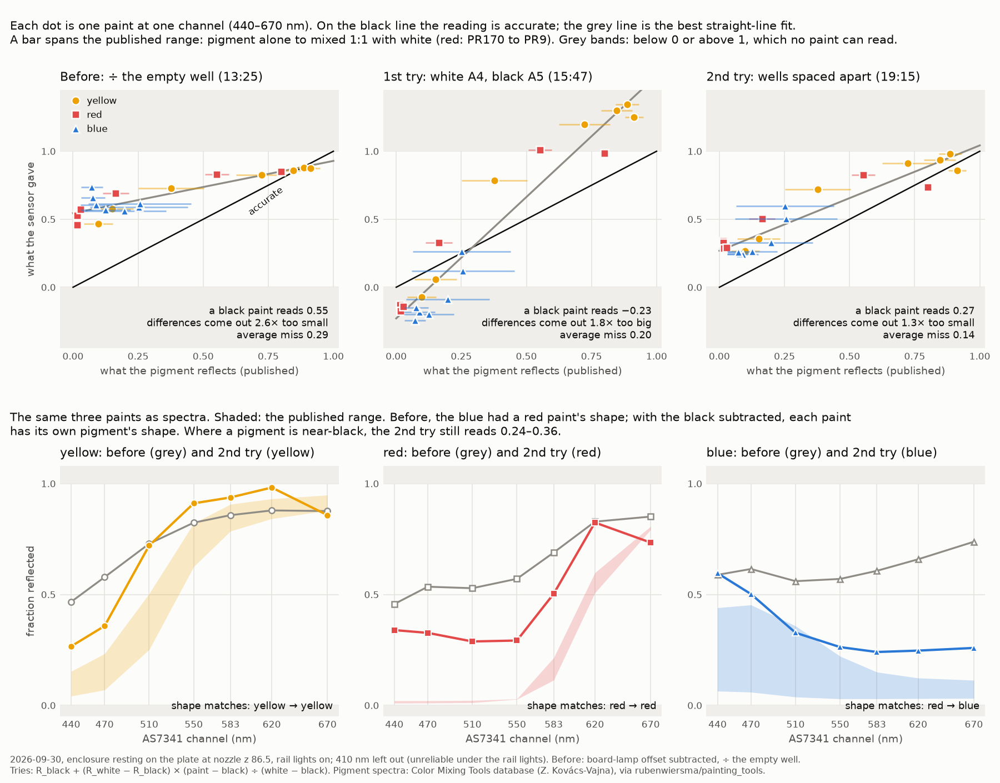

# How much did the white and black wells fix? About half of the squeeze, and the blue's shape

**2026-10-01, no hardware.** Asked on
[PR #202](https://github.com/vertical-cloud-lab/byu-vcl/pull/202) by Timothy Commins:
"you said you could fix the distortion of the wavelengths gathered by using the black
and white. To what degree was that successful?" The distortion was the squeeze found
in the first paint readings ([`results-paint-accuracy-2026-09-30.md`](results-paint-accuracy-2026-09-30.md)):
every reading pulled towards the middle, so a black paint read about half as bright
as an empty well and colour differences came out ~2.7× too small. This scores all
three 2026-09-30 runs the same way.

- **The 1st try (white A4, black A5, next to the colours) didn't work.** Its black
  read grey and its white dim, so the span between them was too small and dividing by
  it over-stretched everything: a black paint would read −0.23, and differences came
  out 1.8× too big.
- **The 2nd try (empty wells between the paints) took out about half of the
  squeeze.** A black paint would read 0.27 instead of 0.55, and differences come out
  1.3× too small instead of 2.6×. The average distance from the published spectra
  halved, 0.29 to 0.14.
- **All three paints now have their own pigment's shape.** Before, the blue's
  readings rose towards the red end and had a red paint's shape (correlation 0.94
  with the red pigments, −0.55 with phthalo blue). With the black subtracted, both
  tries give phthalo blue's shape (0.90–0.91).
- **The black did the work, not the white.** On the same 19:15 readings, dividing by
  the white alone leaves them as squeezed as before (a black paint reads 0.64,
  differences 2.8× too small) and the blue still red-shaped.
- **What's left is a floor where the pigments are near-black**: 0.24–0.36, where the
  pigments reflect 0.01–0.23 (red 0.01–0.03). Only 1 of 21 values lands inside its
  published range (2 before). The floor isn't the white or the black being off: a
  grey black would push those values down, and a dim white leaves them alone. It is
  light that reaches the colour wells and not the black well.

[`analyse_white_black_correction.py`](analyse_white_black_correction.py) reproduces
every number below and the chart, and writes them to
[`white-black-correction-2026-10-01.json`](white-black-correction-2026-10-01.json).

## The scorecard

Each run at 440–670 nm (3 paints × 7 channels = 21 values), against the published
range of each paint's pigments: the pigment alone to mixed 1:1 with titanium white,
and PR170 to PR9 for the red. A straight line, reading = a + b × reference, is
fitted through all 21 with the reference at the middle of its range: a is what a
perfectly black paint would read, and 1/b is how many times too small colour
differences come out.

| | before (13:25) | 1st try (15:47) | 2nd try (19:15) | accurate |
| --- | --- | --- | --- | --- |
| how it was read | ÷ the empty well A6 | white A4, black A5 | white H12, black H7, spaced | |
| a black paint reads (a) | 0.55 | −0.23 | 0.27 | 0 |
| colour differences come out (1/b) | 2.6× too small | 1.8× too big | 1.3× too small | 1× |
| straight-line R² | 0.79 | 0.93 | 0.88 | |
| average miss outside the published range | 0.29 | 0.20 | 0.14 | 0 |
| yellow, 620 nm ÷ 440 nm | 1.9 | −18.5 | 3.7 | 6–20 |
| values inside the published range | 2 of 21 | 2 of 21 | 1 of 21 | 21 |
| blue's shape matches | the red pigments | phthalo blue | phthalo blue | phthalo blue |

Against before, the 2nd try took out 51% of the floor (a), 63% of the squeeze
(1 − b) and 51% of the average miss. The answer doesn't depend on where in the
published range the reference sits:

| a black paint reads; differences come out | pigment alone | middle | 1:1 with white |
| --- | --- | --- | --- |
| before | 0.57; 2.6× too small | 0.55; 2.6× too small | 0.53; 2.8× too small |
| 1st try | −0.10; 1.7× too big | −0.23; 1.8× too big | −0.30; 1.7× too big |
| 2nd try | 0.33; 1.35× too small | 0.27; 1.29× too small | 0.23; 1.34× too small |

By paint, the average miss went from 0.13 to 0.09 for yellow, 0.39 to 0.25 for red
and 0.35 to 0.09 for blue. Where each pigment is near-black, the floor went from
0.47–0.58 to 0.27–0.36 (yellow, 440–470 nm), 0.46–0.57 to 0.29–0.34 (red,
440–550 nm) and 0.57–0.74 to 0.24–0.26 (blue, 550–670 nm).

## The white's part and the black's

Controls on the same readings, so that nothing but the arithmetic changes. "÷ white
alone" is `R_white × (paint − lamp offset) ÷ (white − lamp offset)`, the old way with
the white well in place of the empty one:

| | a black paint reads | differences | average miss | blue's shape |
| --- | --- | --- | --- | --- |
| 15:47 readings ÷ empty A6, the old way | 0.60 | 2.4× too small | 0.35 | red |
| 15:47 readings ÷ white A4 alone | 0.65 | 2.3× too small | 0.40 | red |
| 15:47 readings, white/black | −0.23 | 1.8× too big | 0.20 | blue |
| 19:15 readings ÷ white H12 alone | 0.64 | 2.8× too small | 0.37 | red |
| 19:15 readings, white/black | 0.27 | 1.3× too small | 0.14 | blue |

Swapping the empty well for a white well changes almost nothing. Subtracting the
black is what lowers the floor and turns the blue the right way up. The light the
black well measures rises towards the red end (at 19:15 it read 0.53 of the white at
440 nm and 0.74 at 670 nm, [`spaced-wells-2026-09-30.json`](spaced-wells-2026-09-30.json)),
so it was what made the blue look red. It is the part of the stray light that is the
same in every well, which is the part a black well can measure.

## Why the floor that's left isn't the references

Per channel, `reflectance = R_black + (R_white − R_black) × (paint − black) ÷ (white − black)`.

- **A black that is greyer than R_black** makes a paint as dark as the black read
  R_black, and a darker paint read below it. That is the 1st try: −0.25 to −0.13.
  It pushes near-black values *down*.
- **A white that is dimmer than R_white** inflates each value in proportion to
  `paint − black`, which is ~0 for a near-black paint. It leaves near-black values
  alone. It could add to the bright values that read high (the red by 0.23 at
  620 nm, the blue by 0.16 at 440 nm), but not to the floor.

The 2nd try's near-black values are too *high*, so neither applies. In counts, the
red at 440 nm reads 64 above the black on a white–black span of 172, where its
pigments reflect about as little as Mars black. The colour wells collect light the
black well doesn't.

One parameter fits that as well as the free line does. If a colour well reads as if
a fraction f of its view were empty plate, every value is pulled towards the empty
plate's level R_E, so b = 1 − f and a = f × R_E. With R_E = 1.23–1.30 (the 15:47
run's empty-to-white ratio applied to this white, since this run read no empty
well), f = 0.21 fits with an rms of 0.091, against 0.090 for the free line. That is
a consistency check, not a cause: paint too thin to hide the lit deck under the
clear plate, a different fill in the hand-filled white and black, or where the
enclosure lands would all add light that behaves like that.

The landing alone moves it. The red, read twice five minutes apart, calibrates to
0.23–0.26 at 440–550 nm on the first visit and 0.35–0.41 on the second
([`results-spaced-wells-2026-09-30.md`](results-spaced-wells-2026-09-30.md#reds-two-visits)).

## What to change

Unchanged from [`results-spaced-wells-2026-09-30.md`](results-spaced-wells-2026-09-30.md#what-to-change):

1. **Black paper under the plate**, then read the same wells again. No new paint.
   If the lit deck is the source, the floor drops.
2. **200 µL in every well**, the white and the black too, with the water-to-paint
   ratio of each written down, so every well has the same depth.
3. **Read every well twice, arriving from opposite sides**, to measure how much the
   landing moves it.

The test of success stays the same scorecard: a near 0, b near 1, and most of the 21
values inside their ranges.

## Files

| file | what |
| --- | --- |
| [`analyse_white_black_correction.py`](analyse_white_black_correction.py) | the scorecard, the controls, the one-parameter check and the chart |
| [`white-black-correction-2026-10-01.json`](white-black-correction-2026-10-01.json) | its output |
| [`white-black-correction-2026-10-01.png`](white-black-correction-2026-10-01.png) | the chart |

It reads [`paint-plate-2026-09-30.json`](paint-plate-2026-09-30.json),
[`paint-white-black-2026-09-30.json`](paint-white-black-2026-09-30.json) and
[`paint-spaced-2026-09-30.json`](paint-spaced-2026-09-30.json), and uses the
calibration and pigment spectra of [`analyse_white_black.py`](analyse_white_black.py)
and [`analyse_paint_accuracy.py`](analyse_paint_accuracy.py) unchanged.
