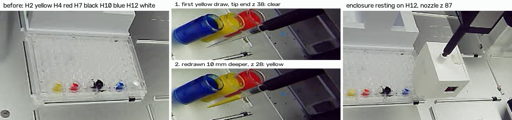

# 2026-10-06 — fresh colours over white paper, undiluted white and black: no gain in accuracy

**2026-10-06, 13:05–14:41 MDT. Asked on [PR #202](https://github.com/vertical-cloud-lab/byu-vcl/pull/202)
by Timothy Commins:** "i put the white paper underneath the 96-slot well. the paint has run
dry in their tiny slots, please refill them from the vials. Also, please run a test to check
how the accuracy changed with this run. I re-filled the black and white slots with undiluted
paint".

The robot refilled the three dried colours from the vials, then one enclosure trip read the
five paint wells at the 2026-10-01 heights. Same plate, slot (7), wells, blackout and driver
settings as 10-01, so the two runs compare height for height.

- **Refilled:** yellow → H2 (13:24), red → H4 (13:34), blue → H10 (13:49), 200 µL each, one
  fresh tip each (A2, B2, A3), each vial stirred first.
- **The accuracy did not improve.** z 100 is again the best height, but its mean miss is
  **0.160 against 0.128** on 10-01. At z 92 and 90 nothing changed (0.206 vs 0.203, 0.300 vs
  0.294). Resting on the plate it is 0.49 against 0.44, still the worst.
- **The white and black did improve.** Above the plate the black reads 8–9% darker and the
  white 1–3.5% brighter than on 10-01, so black ÷ white at z 100 fell from 0.65–0.82 to
  0.54–0.77.
- **The colours did not follow.** The yellow reads 6–9% darker than on 10-01 at z ≥ 100, so
  its bright channels (550–620 nm) calibrate to 0.42–0.45, where PY74 is at least 0.63. The
  red's dark channels came out *lighter* (0.16–0.18, was 0.10–0.13): with a darker black, the
  stray light reaching the colour wells but not the black shows up as a higher floor.
- **The white paper made no difference above the plate**: at z 90–92 every well except the
  (now darker) black read within 2% of 10-01. Resting on the plate it made the white 7–9% brighter, and there the
  colours still read brighter than the white (up to 1.3×), as on 10-01.
- **Only H12 rested on the plate.** Over the other four wells the enclosure was still moving
  down with the nozzle at z 86.5 (robot camera), so it was at most just touching. Check that
  the plate lies flat on the paper.
- **The H12 landing pushed the enclosure ~0.5 mm up the nozzle**, the same failure as 10-01's
  H10 landing (0.85 mm), smaller. Every score above z 90 is corrected for it, in both runs.
- **The vials have lost about 1 cm of paint since 09-30.** The first yellow draw, at the
  09-30 depth, came up clear; it went back into the vial and every colour was drawn 10 mm
  deeper.

Every reading is in [`white-paper-2026-10-06.json`](white-paper-2026-10-06.json);
[`analyse_white_paper.py`](analyse_white_paper.py) reproduces every number below and the
chart, and writes [`white-paper-analysis-2026-10-06.json`](white-paper-analysis-2026-10-06.json).
The photos it reads are in [`photos-2026-10-06/`](photos-2026-10-06/).

## The wells

| H2 | H4 | H7 | H10 | H12 |
|---|---|---|---|---|
| yellow, PY74 | red, PR170 + PR9 | black, BASICS Mars Black | blue, PB15:3 | white, BASICS Titanium White |
| dried 09-30 paint + 200 µL by the robot | the same | undiluted, by Tim | dried + 200 µL by the robot | undiluted, by Tim |

Every other well empty; the empty H5 was not read this time (below). Under the plate, a sheet
of white paper, where 10-01 had the bare deck.

## The scores

Each height's three colours calibrated against that height's white and black, and scored
against the published pigment ranges at 440–670 nm, as on 10-01
([`analyse_height_series.py`](analyse_height_series.py)). Corrected for the enclosure riding up
the nozzle (below):

| nozzle z | gap | miss, 10-01 | miss, 10-06 | black ÷ white, 10-01 | black ÷ white, 10-06 |
| --- | --- | --- | --- | --- | --- |
| 125 | ~37 mm | 0.161 | 0.191 | 0.81–0.91 | 0.70–0.86 |
| 110 | ~22 mm | 0.138 | 0.182 | 0.71–0.86 | 0.60–0.81 |
| **100** | **~12 mm** | **0.128** | **0.160** | 0.65–0.82 | **0.54–0.77** |
| 95 | ~7 mm | 0.157 | 0.168 | 0.62–0.81 | 0.56–0.78 |
| 92 | ~4 mm | 0.203 | 0.206 | 0.58–0.78 | 0.54–0.76 |
| 90 | ~2 mm | 0.294 | 0.300 | 0.54–0.76 | 0.54–0.75 |
| resting | 0 | 0.442¹ | 0.494² | 0.72–0.82³ | 0.63–0.77 |

(miss: mean distance outside the published range, 0 = inside. Black ÷ white: per channel,
lamp subtracted; published Mars black on titanium white is ~0.02.)
¹ 10-01 at z 86.5 with the second-landing white, as corrected on 10-02. ² 10-06's eight
readings at the bottom of each ladder: H12 at z 87, the rest at 86.5. ³ As measured.

At z 100, per paint:

| | miss 10-01 → 10-06 | where the pigment is dark, 10-01 → 10-06 |
| --- | --- | --- |
| yellow | 0.172 → 0.215 | 0.17–0.22 → 0.16–0.20 at 440–470 nm |
| red | 0.122 → 0.157 | 0.10–0.13 → 0.16–0.18 at 440–550 nm |
| blue | 0.090 → 0.107 | 0.29–0.35 → 0.32–0.39 at 550–670 nm |

All three still have their own pigment's shape.

**Each well against 10-01**, total counts with the lamp subtracted, 10-06 ÷ 10-01:

| nozzle z | white | black | yellow | red | blue |
| --- | --- | --- | --- | --- | --- |
| 125 | 1.012 | 0.911 | 0.918 | 0.943 | 0.968 |
| 100 | 1.035 | 0.917 | 0.944 | 0.963 | 0.988 |
| 92 | 1.008 | 0.945 | 0.988 | 0.997 | 0.999 |
| 90 | 0.995 | 0.960 | 0.983 | 0.989 | 0.997 |

The lights didn't drift: after H12, every well's z 125 reading before and after its own
landing agreed within 0.1%.

## Why it didn't improve

Three things changed at once — the paper, the undiluted white and black, and fresh colours
in place of 5-day-dry ones — so this run can't pin the result on any one of them. What it
does show:

- **The undiluted black and white are better references.** The black is darker and the white
  brighter, which is what a wider span needs.
- **The colours got darker, the yellow most.** Fresh paint drawn from 10 mm deeper in vials
  that have lost water is probably thicker than the paint that had dried in the wells. The
  yellow's whole spectrum fell, so its bright half now reads too dark.
- **The colour wells get light the black well doesn't.** With the black darker, the red's dark
  channels calibrated higher, not lower. The black is opaque; the colours, watered down, are
  not (Liquitex rates even the undiluted colours semi-opaque). Light that passes through a
  colour and back is counted as colour.
- **The paper only matters close to the plate.** At z 90–92 every well but the black read within
  2% of 10-01.
  Resting on the plate the white read 7–9% brighter, and from z 92 to the bottom the white
  lost only 20% of its light (26% on 10-01). That is light coming up through the clear plate.
  It also flattens the light curve ~1 mm above contact, so the light no longer shows when
  the foot lands.

## Where the enclosure touched

Below z 90 every step was photographed, and the enclosure's front face registered against the
same well's z 90 photo (`landing_shift.register`, ~0.01 px). A face that moves less than 0.4 mm
per mm of nozzle travel is resting on the plate.

| well | face movement per mm of nozzle travel, each step from z 90 down |
| --- | --- |
| H12 | 0.64, 0.74, 1.37 to z 88; **0.12, 0.19 at z 87.5 and 87**: resting from ~88 |
| H10 | 0.68, 1.04, 0.96, 0.83, 1.90, 0.69 down to 86.5 |
| H7 | 0.90, 1.01, 1.02, 0.94 down to 86.5 |
| H4 | 0.79, 1.04, 1.24, 0.71 down to 86.5 |
| H2 | 0.92, 1.16, 1.29, 0.94 down to 86.5 |

So only H12 rested on the plate; on 10-01 the foot touched at ~87.5 across the row. Two things
fit: the H12 landing raised the enclosure 0.5 mm (below), and the plate may no longer lie flat
on the paper. The second can be checked by hand: press each corner of the plate.

A stop rule based on the light did not work: over H12 the light went flat from z 89 (−0.6%
per 0.5 mm) while the camera shows the enclosure still descending. The run switched to the
camera rule before H12's second descent.

## The landing that moved the enclosure

Robot-camera photos at z 125 before and after each landing, registered as in
[`landing_shift.py`](landing_shift.py), in mm of upward travel:

| landing | front | top | nozzle | tip rack (control) |
| --- | --- | --- | --- | --- |
| H12, pressed to z 87 | **+0.57** | **+0.48** | +0.17 | +0.02 |
| H10 | −0.09 | −0.03 | −0.06 | −0.01 |
| H7 | −0.01 | +0.01 | 0.00 | +0.03 |
| H4 | +0.01 | +0.02 | −0.01 | +0.02 |
| H2 | −0.03 | +0.01 | +0.02 | +0.02 |

Before it, the enclosure hung as on 10-01 (H12 at z 125: front −0.10, top −0.01 mm against
10-01's photo). So the white was read before the shift and everything else after it, as on
10-01. The corrected rows take the white at z + 0.5 (10-01: z + 0.85, and the blue too, read
before that run's shift), interpolated in its own ladder. Pressing ~1 mm past contact was
enough to move it this time; on 10-01 the same press at H12 didn't.

## What to do next

1. **Read at z 100, not resting on the plate.** It was the best height on dried paint (10-01)
   and again on fresh paint today; resting was the worst both times. It also never presses,
   so no landing can move the enclosure.
2. **Black paper under the plate**, then read the same wells again. Together with today's
   white paper, that is the backing test from ISO 13655
   ([`accuracy-sources-2026-10-02.md`](accuracy-sources-2026-10-02.md)): a paint that reads
   differently over the two isn't opaque.
3. **Thicker colours.** Every well should be opaque like today's white and black, so the
   backing stops mattering.
4. **Cap the vials between runs** and shake them before one. They lost ~1 cm in six days.

## How it ran

**Before anything moved.** Robot link 0.87 ms, no run open, sensor 382–387 counts on its base
(lights off). The vials matched their 09-30 photos (7.8 grey levels on average over the vial
region). The robot camera was overexposed with the rail lights on, as on 10-01.

**The transfers** ([`paint_transfer.py`](paint_transfer.py), maintenance run `fc3777c7`,
`--plate-slot 7 --rack-slot 6`):
- Route with paint: up to tip-end z 110 over the vial, to y 2 in front of the vials, along y 2
  to the well's x, along that x to y 178 in front of the plate, then into the well. Empty tips:
  out to y 178, along it to x 250, up x 250 to y 300, then the trash. A loaded tip never passed
  over another well, a vial or the tip rack.
- Stir 5 × 200 µL at 30 µL/s, draw 200 µL at 30 µL/s, dispense at tip-end z 6.22 (2.7 mm off
  the well floor), blow out at z 13.22.
- **The first yellow draw**, at tip-end z 38 as on 09-30, came out clear. It was blown back
  into the yellow vial from z 54 and redrawn at **z 28**, which came out yellow; red and blue
  went straight to z 28. On 09-30 the paint tops were at z 47–49, so the level has dropped
  ~11 mm or more: evaporation from the open vials fits (a diffusion estimate gives ~11 mm in
  six days at 25% humidity), but pigment settling out of the top layer would look the same.
- **The first blue pick-up got no tip.** Tips C2–H2 had already gone before this run (the
  rack photo from 13:05 shows the gap). The OT-2 can't sense a tip, so the run carried a bare
  nozzle to the blue vial; its end never came within ~18 mm of the vial's rim. The photos
  showed it before any paint moved. The driver was cleared through the trash and A3 used.
- **H7 and H12 probed.** Before going to the trash, the used yellow and red tips were lowered
  into H7 and H12 to 2 mm below the rim, with photos at the same pose before and after. No
  black or white on either tip end, so neither hand-filled well reaches within 2 mm of its
  rim, and the enclosure's cone (it reaches ~1.4 mm into a well) couldn't dip into them.

**The enclosure trip** ([`enclosure_height_cal.py`](enclosure_height_cal.py), maintenance run
`04c34ce1`, the standing arguments with `--target-x 113.38`):
- Pick-up from A2: the bare nozzle at z 102 sat over the collar where it did on 10-01 (0.2 px).
  Pressed 99 → 89 in 2 mm steps (enclosure +0.78 px at z 89; 10-01 +0.65). Lifted to z 93:
  −2.09 px (10-01 −2.12). 160 jolts at 3 mm/s: −2.09 px, no slip. Grip check 9.2×, as on 10-01.
- Carried via z 190 to H12: 12,156 counts at z 125 (10-01 12,056).
- Each well: z 125, 110, 100, 95, 92, 90 (two readings each), then down in 1 mm steps (0.5 mm
  on H12 and H10), then eight readings at the bottom. Order H12, H10, H7, H4, H2.
- H12 was descended twice: the first stop rule (light) stopped it at z 88; the camera then
  showed it still hanging free, so it went on to z 87.
- **Skipped:** the empty H5 and a second H12 landing, to stay inside the sensor's battery. The
  sensor was off its base 14:13–14:40 and answered throughout.
- Returned via z 190 and released into A2: 471 counts after (438 before), 468 homed. Rail
  lights off, run closed.

## Files

| file | what |
| --- | --- |
| [`white-paper-2026-10-06.json`](white-paper-2026-10-06.json) | every reading (8 channels, time, pose, well, stage), the transfers, the trip |
| [`analyse_white_paper.py`](analyse_white_paper.py) | the scores against 10-01, the contact and landing checks, the chart |
| [`white-paper-analysis-2026-10-06.json`](white-paper-analysis-2026-10-06.json) | its output |
| [`white-paper-2026-10-06.png`](white-paper-2026-10-06.png) | the chart |
| [`white-paper-2026-10-06.jpg`](white-paper-2026-10-06.jpg) | robot-camera photos: before, the two yellow draws, resting on H12 |
| [`photos-2026-10-06/`](photos-2026-10-06/) | the 41 robot-camera photos the analysis reads |

On the Pi (`RPI_STREAM_CAM_HOSTNAME`), in `~/color-read-1006/`: `pre/` (the first deck
photos), `paint/` (the transfers: 146 photos, log), `enc/` (the trip: 87 photos, log,
`readings.jsonl`), and `sim-paint/`, `sim-enc/` (dry runs). MQTT credentials went in over
stdin. No services, timers or settings were changed.
