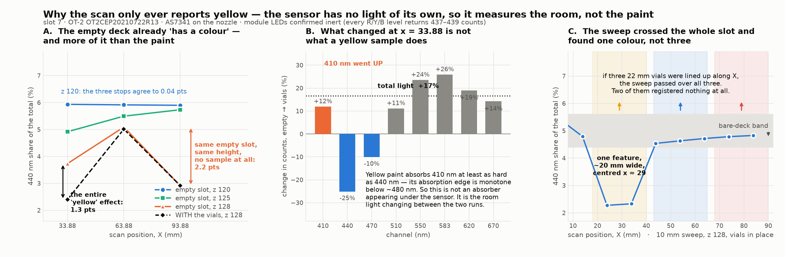

# Why the colour scan only ever reports yellow

**2026-09-09, no robot motion.** Re-analysis of every scan on record, prompted by the
question on #197: if the aperture clears the deck and passes over a vial at every stop,
why does only one colour register?

Regenerate the figure with `python3 plot_why_only_yellow.py`.



## The finding

**The instrument's own position-to-position variation, on an empty slot, is larger than
the effect being attributed to the paint — and it is larger *in the same channels*.**

Spectral shape of an **empty** slot 7, spread across the three read stops, in percentage
points of each channel's share of the total:

| aperture height | 410 | 440 | 470 | 510 | 550 | 583 | 620 | 670 |
| --- | --- | --- | --- | --- | --- | --- | --- | --- |
| **29.5 mm** (z 120) | 0.00 | **0.04** | 0.04 | 0.09 | 0.14 | 0.06 | 0.09 | 0.03 |
| 34.5 mm (z 125) | 0.02 | 0.82 | 0.46 | 0.26 | 0.38 | 0.80 | 0.84 | 1.52 |
| 37.5 mm (z 128) | 0.11 | 2.18 | 1.84 | 3.97 | 4.05 | 2.71 | **7.69** | 3.74 |

Nothing is on the deck in any of those rows. At z 120 the three stops agree on the colour
of the empty slot to **0.14 points, worst channel**. At z 128 they disagree by **7.69
points** — 55× worse — for an 8 mm rise.

The whole claimed yellow effect is **1.34 points** (440 nm share, 3.73 % empty → 2.40 %
with vials, x = 33.88, same height). That is:

- **1.6× smaller** than the spread the *empty* slot shows across the three stops at that
  height (2.18 pts)
- **1.6× smaller** than the spread the *same stop* shows from height alone, with no vials
  present (5.93 → 4.92 → 3.73 % over z 120/125/128 = 2.20 pts)
- **10× larger** than the entire noise floor at z 120

## The change at x = 33.88 is not a yellow sample

Absolute counts, empty z 128 → vials z 128, at the one position that "saw yellow":

| ch | empty | vials | change |
| --- | --- | --- | --- |
| 410 | 53 | 59 | **+11.9 %** |
| 440 | 137 | 102 | −25.1 % |
| 470 | 168 | 151 | −10.1 % |
| 510 | 473 | 525 | +11.1 % |
| 550 | 699 | 863 | +23.6 % |
| 583 | 782 | 984 | +25.9 % |
| 620 | 847 | 1009 | +19.0 % |
| 670 | 505 | 577 | +14.2 % |
| **total** | **3663** | **4272** | **+16.6 %** |

Two things rule out a yellow absorber:

1. **The total went up 17 %.** An absorber entering a passive sensor's field removes light.
2. **410 nm went *up* 12 % while 440 nm fell 25 %.** Yellow pigment's absorption is a
   long-pass edge — monotone below ~480 nm — so it must suppress 410 at least as hard as
   440. The observed pattern (410 up, 440/470 down, everything ≥ 510 up) is the signature
   of the *illuminant* changing, not of a sample appearing.

440 and 470 nm sit on the blue pump peak of a phosphor white LED; 410 nm sits below where
such a source emits anything. So "440/470 down, 410 flat, red up" is what you get when the
share of cool overhead light reaching the aperture drops and warm bounced light takes over.
That is a **shadow**, and a shadow is spectrally indistinguishable from a yellow absorber
when you have no light source of your own.

The empty-z128 and vials-z128 runs were six minutes apart with a person at the open machine
in between. They are not a controlled comparison.

## Control: the sensor is not the problem

Six reads taken this session with the module seated and the robot idle, ~25 s apart:

```
0  ch410=6 ch440=4 ch470=10 ch510=167 ch550=172 ch583=38 ch620=21 ch670=18  total=436
1  ch410=6 ch440=4 ch470=10 ch510=167 ch550=173 ch583=40 ch620=21 ch670=18  total=439
2  ch410=6 ch440=4 ch470=10 ch510=167 ch550=172 ch583=38 ch620=21 ch670=18  total=436
3  ch410=6 ch440=4 ch470=10 ch510=167 ch550=173 ch583=39 ch620=21 ch670=18  total=438
4  ch410=6 ch440=5 ch470=10 ch510=167 ch550=172 ch583=38 ch620=21 ch670=18  total=437
5  ch410=6 ch440=4 ch470=10 ch510=167 ch550=173 ch583=39 ch620=22 ch670=18  total=439
```

Every channel repeats to ±1 count; the total is 437 ± 1.5 (±0.3 %), and it matches the
436–445 seated baselines from every run earlier in the day. **The AS7341 is stable to a
fraction of a percent.** All of the variation in this issue is environmental and geometric,
none of it is the sensor. (The seated spectrum is also 510/550-dominant, unlike every lifted
reading — it is the inside of a closed base, which is why it is not usable as a dark
reference.)

## Why blue and red cannot show up at all

Bare-deck spectrum, from the spectrally flat z 120 run:

```
410 1.52%  440 5.92%  470 6.20%  510 13.07%  550 18.56%  583 21.58%  620 21.40%  670 11.74%
violet+blue (410+440+470) = 13.6%      orange+red (583+620+670) = 54.7%      ratio 4.0x
```

- **Blue** reflects only where there is almost no incident flux. There is nothing to return.
- **Red** reflects where the background is already strongest. A dark red vial *removes*
  light rather than adding red, and "dimmer and warmer" is exactly the artefact signature —
  so a red vial and a shadow produce the same reading.
- **Yellow** is the brightest of the three and its absorption band is the only band with
  measurable dynamic range. It is the only colour that can register — and its signature is
  the artefact's signature, so it registers whether or not it is there.

## The sweep crossed the whole slot and found one feature

The 10 mm sweep covered x = 3.88 → 83.88 at y = 225, z 128, vials in place. One feature,
~20 mm wide, centred x ≈ 29. Everywhere else the 440 nm share runs 4.54 → 5.47 % and the
total rises smoothly — textbook bare deck. If three ~22 mm vials were lined up along X the
sweep passed over all three, and **two of them returned nothing distinguishable from an
empty slot**, which is what the paragraph above predicts.

## What this changes

- **The height that lets the aperture clear a ~36 mm vial is the height at which the
  instrument stops working.** z 120 has a 0.14-point noise floor; z 128 has a 7.7-point
  one. Tall vials and a usable read height are mutually exclusive with this enclosure.
- **The `--rgb` LEDs being inert is not a footnote, it is the root cause.** Without them
  every number here is a survey of the room's light field.

## Two things to do

**The decisive test, one command, no code change.** Swap the vials left-to-right (put
yellow where red is) and re-run the identical scan:

```bash
cd ~/xscan && set -a && . ~/.xscan_env && set +a
~/.venvs/xscan/bin/python run_xscan_test.py --scan-slot 7 --read-z 128
```

If the feature follows the yellow vial to its new X, the sensor is reading paint. If it
stays at x ≈ 29, it is the machine's own geometry and no colour is being measured.

**The test that will actually work today.** Use **flat opaque targets** — card painted red,
blue and yellow, taped to the deck at (33.88, 225), (63.88, 225), (93.88, 225) — and run at
**z 120**, where the empty-slot noise floor is 0.14 points. A painted card is an
order of magnitude better reflector than dilute paint in a clear vial viewed from above,
where most light passes into the liquid and the strongest return is a colourless specular
glint off the meniscus. Flat targets also remove the collision constraint that forced the
aperture up to 128 in the first place.

## Corrections to earlier sessions on this issue

- The 01:47 session reported the yellow detection as "confirmed twice independently". Both
  confirmations share the same empty-slot baseline, and that baseline is not controlled —
  see the absolute-count table above.
- The 02:15 session explained the same feature as "stray light off the brightest vial".
  That is also not supported: the total *rose* and 410 nm *rose*.
- The 01:22 session's advice to set `--rgb` was already withdrawn when the LEDs were found
  inert; the point stands that fixing them is the highest-value change here.
