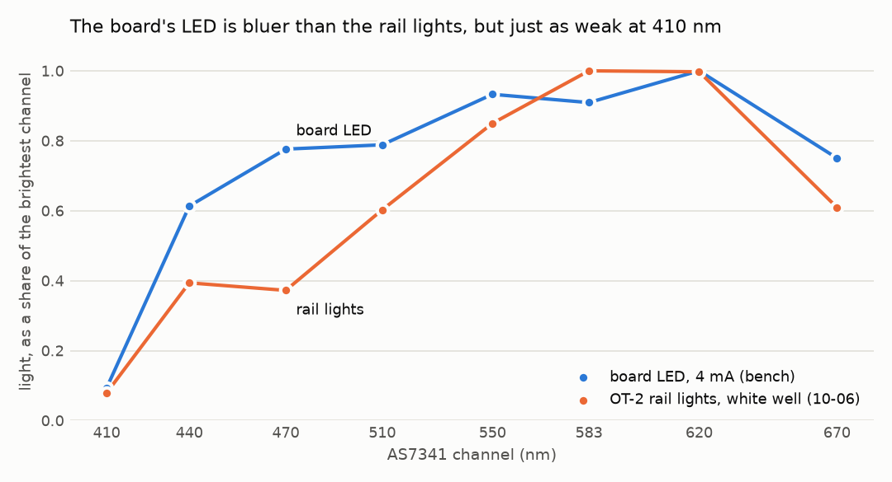
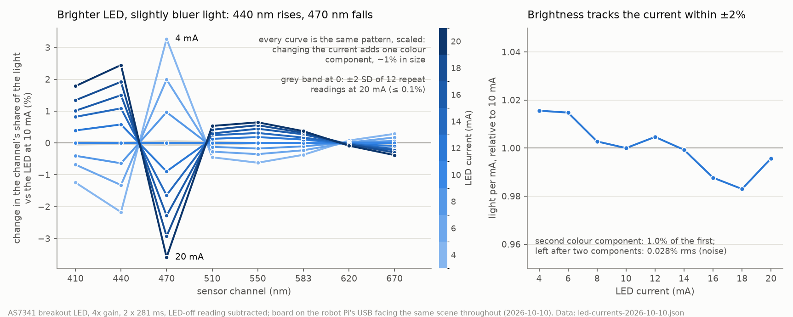

# Pico W firmware: per-reading gain, integration time and LED (installed 2026-10-09 and 2026-10-10)

The colour sensor's Pico W (USB serial `e6647c15673a2438`) runs the board's own copy of
[`AccelerationConsortium/wireless-color-sensor`](https://github.com/AccelerationConsortium/wireless-color-sensor)
`sensor_file/`. Two changes have gone in, both to `main.py` only:

- **2026-10-09: a read command can ask for a gain.**
- **2026-10-10: it can also ask for an integration time (ATIME, ASTEP) and switch on the
  breakout's white LED (4–20 mA)**, and every reply now carries both halves' Clear and NIR
  counts. A command that asks for nothing reads exactly as before: 128x, 2 × 281 ms, LED off.

Wi-Fi, MQTT and every other file are as they were.

**Firmware goes in over USB, never over the air** (@sgbaird, 2026-10-10). The board can
stay on the robot Pi's USB for testing. The signed MQTT updater offered on 10-09 is not
going to be written.

| file | what |
| --- | --- |
| [`main.py`](main.py) | what is on the board now (since 2026-10-10 10:42 MDT): gain, ATIME, ASTEP and LED per reading |
| [`main.py.settings.patch`](main.py.settings.patch) | the 10-10 change on its own, against the gain-only `main.py` |
| [`board-2026-10-10/`](board-2026-10-10/) | the gain-only `main.py` as found on the board before the 10-10 change, and a [`MANIFEST.md`](board-2026-10-10/MANIFEST.md) of all 33 files with their on-board hashes |
| [`test_settings.py`](test_settings.py) | 52 checks without the board: the patch, the settings parsing, and `main.py` driven with fake MQTT messages and a fake chip that has the driver's LED call |
| [`settings-test-2026-10-10.json`](settings-test-2026-10-10.json) | every reading taken on the board while testing the 10-10 change, and the chip's registers before and after |
| [`inventory.py`](inventory.py) | read-only, from RAM: every file's size and sha256, the MicroPython version, and the AS7341's gain, timing and LED registers |
| [`led-currents-2026-10-10.json`](led-currents-2026-10-10.json), [`analyse_led_currents.py`](analyse_led_currents.py) | the LED at every even current 4–20 mA; the analysis writes [`led-currents-analysis-2026-10-10.json`](led-currents-analysis-2026-10-10.json) and the chart ([below](#does-the-led-give-different-information-at-different-brightnesses-2026-10-10)) |
| [`main.py.gain.patch`](main.py.gain.patch) | the 10-09 change on its own (two hunks), against the board's earlier `main.py` |
| [`board-2026-10-09/`](board-2026-10-09/) | every non-secret file as it was on the board before the 10-09 change; [`MANIFEST.md`](board-2026-10-09/MANIFEST.md) lists all 32 with their on-board hashes |
| [`test_gain.py`](test_gain.py) | 40 checks of the gain-only version (`board-2026-10-10/main.py`): the patch, the gain parsing, and both files driven with fake MQTT messages |
| [`gain-test-2026-10-09.json`](gain-test-2026-10-09.json) | every reading taken on the board while testing, plus the chip's registers before and after |
| [`led_check.py`](led_check.py), [`led_hold.py`](led_hold.py) | 2026-10-10: switch the AS7341's white LED on at 4, 10 and 20 mA and read it, run from RAM ([below](#the-as7341s-white-led-switched-on-2026-10-10-off-in-every-reading-on-record)) |
| [`led-test-2026-10-10.json`](led-test-2026-10-10.json), [`analyse_led.py`](analyse_led.py) | every LED reading and register value; the analysis writes [`led-test-analysis-2026-10-10.json`](led-test-analysis-2026-10-10.json) and the chart |

## What is on the board

**Since 2026-10-10 10:42 MDT:** `main.py` is [`main.py`](main.py) (11,514 bytes, `eb550154…`),
and `main.py.before-settings` is the gain-only version (8,990 bytes, `0876445a…`,
[`board-2026-10-10/main.py`](board-2026-10-10/main.py)). Everything else, MicroPython included,
is as in the table below, read on 10-10 at 10:38 MDT with [`inventory.py`](inventory.py)
(MicroPython `v1.29.0 on 2026-08-24`; registers CFG1 8, ATIME 100, ASTEP 999, CONFIG 0, LED 0).

Read off the board on 2026-10-09 at 16:56 MDT, before anything changed.

| part | version |
| --- | --- |
| MicroPython | `v1.29.0 on 2026-08-24 (GNU 16.1.0 MinSizeRel)`, build `RPI_PICO_W`. Byte-identical to the official [`RPI_PICO_W-20260824-v1.29.0.uf2`](https://micropython.org/resources/firmware/RPI_PICO_W-20260824-v1.29.0.uf2): all 3,538 of its blocks match the board's flash. 1.29.0 is the version `CLAUDE.md` requires (I²C bug in 1.26–1.28) |
| Wi-Fi chip firmware | built into the MicroPython image above, so covered by the same file |
| `main.py` | 6,432 bytes, `469a5a6d…`. Upstream `07efedd` plus a `SoftI2C` import and a comment that MicroPython 1.29 is required. Both 09-03 backups call `Sensor()` with its defaults too |
| `lib/as7341_sensor.py` | 4,577 bytes, `d9b673c5…`, unchanged since at least the 09-03 backup. **Older than upstream:** `Sensor(atime=100, astep=999, gain=8)` |
| `lib/as7341.py`, `lib/mqtt_as.py`, other libraries | see [`MANIFEST.md`](board-2026-10-09/MANIFEST.md); all identical to the 09-03 backup |
| AS7341 sensor chip | no firmware. ID register `0x24` (AS7341), revision 0 |

**The sensor reads at 128x gain, 2 × 281 ms per reading.** That's what the board's
`Sensor()` sets (gain code 8, ATIME 100, ASTEP 999), and the chip's own registers said so
when read live: CFG1 = 8, ATIME = 100, ASTEP = 999. This corrects 10-01, when I read
upstream's newer `as7341_sensor.py` instead of the board's, and concluded the chip ran at
256x and 2 × 559 ms. Since the file hasn't changed since at least 09-03, **every reading
on record was taken at 128x, 2 × 281 ms.**

## Backups

**Before the 10-10 change**, in `~/pico-backups/20261010_103827_before-settings/` on the robot
Pi (mode 700): all 33 files in `files/`, each sha256 matched against the one computed on the
board; and `inventory.out`. Only `main.py` differs from 10-09 (see
[`board-2026-10-10/MANIFEST.md`](board-2026-10-10/MANIFEST.md)). The board also keeps the
gain-only `main.py` as `main.py.before-settings`.

**Before the 10-09 change**, on the robot Pi (`RPI_STREAM_CAM_HOSTNAME`), in
`~/pico-backups/20261009_165748_before-gain/` (mode 700, as it holds the Wi-Fi and MQTT
credentials):

| file | what | checked |
| --- | --- | --- |
| `files/` | all 32 files, including `my_secrets.py` | each sha256 matched the one computed on the board |
| `flash-full-2MB.bin` | the whole 2 MB flash: MicroPython, Wi-Fi firmware and every file | sha256 `c9944136…135c`, matched the board's own |
| `flash-full-2MB-restore.uf2` | that image as a UF2, for drag-and-drop | converts back to the image exactly |
| `RPI_PICO_W-20260824-v1.29.0.uf2` | the official MicroPython download | identical to the board's firmware |
| `inventory.out` | the version and file report above | |

The board also keeps its old `main.py` as `main.py.before-gain`.

## Rolling back

Always address the board by its USB serial, never by `/dev/ttyACM*`:

```bash
M="$HOME/.venvs/mpremote/bin/mpremote connect id:e6647c15673a2438"
B=~/pico-backups/20261009_165748_before-gain
```

0. **Undo the 10-10 change only** (back to gain-only):
   ```bash
   $M fs cp ~/pico-backups/20261010_103827_before-settings/files/main.py :main.py + reset
   ```
1. **Undo both changes** (the board's `main.py` as it was before 10-09):
   ```bash
   $M fs cp $B/files/main.py :main.py + reset
   ```
2. **Put back every file** exactly as on 10-09:
   ```bash
   cd $B/files && for f in $(find . -type f | sed 's|^\./||'); do $M fs cp "$f" ":$f"; done; $M reset
   ```
3. **Put back the whole flash** (MicroPython and all files), if the board won't boot or
   `mpremote` can't reach it: hold **BOOTSEL** while plugging the USB in (or run
   `$M bootloader`), and copy `flash-full-2MB-restore.uf2` onto the `RPI-RP2` drive that
   appears. Easiest from a laptop; on the Pi the drive has to be mounted by hand, which needs
   `sudo`. To reinstall MicroPython alone and keep the files, copy the official
   `RPI_PICO_W-20260824-v1.29.0.uf2` instead: it ends at `0x100DD200`, well before the
   filesystem.

## Using the settings

From the runner or the Pi:

```python
with sensor_read.SensorLink() as link:
    r = link.read(settings={"gain": 512})                  # one reading at 512x
    r = link.read(settings={"gain": 4, "led_ma": 10})      # LED on at 10 mA, 4x
    r = link.read(settings={"atime": 50})                  # half the integration time
    r = link.read()                                        # 128x, 2 x 281 ms, LED off, as before
```

In `../ot2/enclosure_height_cal.py`: `read 8 white gain=4 led_ma=10`, and `lights off` /
`lights on` for the rail lights.

On the wire, a read command may carry `settings`, with any of these keys:

```json
{"command": {"R": 0, "Y": 0, "B": 0}, "experiment_id": "...", "settings": {"gain": 4, "atime": 100, "astep": 999, "led_ma": 10}}
```

| key | values | default |
| --- | --- | --- |
| `gain` | 0.5, 1, 2, 4, 8, 16, 32, 64, 128, 256 or 512 | 128 |
| `atime` | 0–255 | 100 |
| `astep` | 0–65534 | 999 |
| `led_ma` | 0 (off), or an even number from 4 to 20 | 0 |

- **Integration time per half** is (ATIME + 1) × (ASTEP + 1) × 2.78 µs, at most 1,500 ms;
  a reading takes two halves (F1–F4, then F5–F8). The counts can't exceed
  (ATIME + 1) × (ASTEP + 1) or 65,535, whichever is smaller (`full_scale` in the reply).
- **LED: 4–20 mA only**, the limits of the board's own driver (`lib/as7341.py`). The chip goes
  to 258 mA, but the LED's rating isn't known, so nothing above 20 mA is offered. The LED is
  switched on for that one reading (the driver waits 100 ms after switching it) and off
  straight afterwards.
- **Every setting applies to that one reading** and is put back straight afterwards, even if
  the reading fails. ATIME and ASTEP are only written when a reading changes them.
- **Every reply says what it used:** `"sensor_settings": {"gain": 4, "again_code": 3,
  "analog_saturated": false, "atime": 100, "astep": 999, "integration_ms": 280.8,
  "full_scale": 65535, "led_ma": 10}`. The code and the saturation flag come from the chip's
  ASTATUS register, read straight after each half's counts. **`sensor_extra`** carries both
  halves' Clear and NIR (`{"clear": [a, b], "nir": [a, b]}`): Clear is the channel that
  saturates first, and the two halves' Clear disagreeing means the light changed mid-reading.
- **Anything else** (another key, a value out of range, an integration over 1,500 ms) gets an
  `error` reply and no reading.
- `SensorLink.read()` refuses a reply that doesn't echo every setting it asked for.
- **To bracket exposure, change ATIME or ASTEP at one gain, not the gain.** Counts follow the
  integration time exactly (ATIME 50 read 0.504× of ATIME 100, against 0.505 expected), but gain
  steps don't (512x read 3.84× of 128x, 16x 3.87× of 4x).

**Gain ratios aren't exact powers of two.** On the board, 512x read 3.84× the 128x counts,
not 4×; the datasheet allows 7.25–8.25× between 64x and 512x. So re-read the white and
black wells at every gain you use; never scale one gain's readings to another.

## How it was tested

### 2026-10-10: gain, integration time and LED

1. `python3 test_settings.py` (52 checks, no board): the patch turns the gain-only `main.py`
   into [`main.py`](main.py) byte for byte; plain reads give exactly the gain-only firmware's
   counts; each setting applies to its own reading, both halves, and the defaults come back
   after it, including after a failed read with the LED on; bad settings are refused with no
   reading. Four deliberate bugs (no LED-off afterwards, no timing restore, timing always
   written, an off-by-one LED limit) each made it fail. `mpy-cross` 1.29.0 compiles `main.py`
   for armv6m.
2. **On the board, from RAM first** (`mpremote run`, flash untouched), then **installed and
   after a hard reset**, over MQTT from the runner, the board on the Pi's USB facing the same
   thing throughout:

   | reading | total (8 channels) |
   | --- | --- |
   | plain, before / after | 2,378–2,380 / 2,366 (RAM); 2,373–2,374 / 2,368 (flash) |
   | 512x / 32x | 9,134 / 599 |
   | ATIME 50 / ASTEP 499 / ASTEP 4999 (1,404 ms) | 1,200 / 1,186 / 11,891 |
   | 4x, LED off / 4 / 10 / 20 mA | 78 / 15,034 / 36,875 / 73,209 |
   | 4x, ATIME 29, ASTEP 599 (50 ms), 20 mA | 13,038 |

   `led_ma` 30 and 5, `atime` 300, an unknown key and a 46.6 s integration were refused.
3. After the install the chip's registers read CFG1 8, ATIME 100, ASTEP 999, CONFIG 0, LED 0,
   and the only file differences on the board were `main.py` and the added
   `main.py.before-settings`.

### 2026-10-09: gain

1. `python3 test_gain.py` (40 checks, no board). Among them: the patch turns the board's own
   `main.py` into [`main.py`](main.py) byte for byte; a plain read gives exactly the old
   `main.py`'s counts; integration time is never written.
2. **On the board, from RAM first** (`mpremote run`, nothing written to flash), then
   **installed and after a hard reset**, over MQTT from the runner. Totals of all 8 channels,
   with the sensor wherever it sat while plugged into the Pi:

   | gain | 32x | 64x | 128x (plain) | 256x | 512x |
   | --- | --- | --- | --- | --- | --- |
   | total | 601 | 1,185 | 2,382–2,385 | 4,696 | 9,146–9,157 |
   | reported code | 6 | 7 | 8 | 9 | 10 |

   Plain reads before, between and after the other gains agreed to within 3 counts, and gains
   300 and 1000 and an `atime` key were refused.
3. After the install, the chip's registers read CFG1 8, ATIME 100, ASTEP 999, as before, and
   the only file differences on the board were `main.py` and the added `main.py.before-gain`.

**One thing found while testing:** the ASTATUS byte that `lib/as7341.py` keeps from its own
bulk read showed code 8 at every gain, even though the counts scaled. Reading ASTATUS again
straight afterwards gave the right code, with the same counts. So `main.py` reads it
directly.

**And one observation:** after the hard reset the board answered over MQTT normally while
still plugged into the Pi's USB, with no program reading its serial port (every check from
17:09 to 17:13 MDT). `CLAUDE.md` warns that `main.py` can stall in that state. Probably
because nothing had opened the port since the reset: as I read MicroPython's USB code, it
drops output when no program has the port open, and only waits when one has it open but
isn't reading. Not tested further.

## The AS7341's white LED: switched on 2026-10-10, off in every reading on record

The breakout's white LED is switched by the AS7341's own LED driver (its LDR pin). In
register bank 1, CONFIG (0x70) bit 3 hands that pin to register LED (0x74); there, bit 7
turns the LED on and bits 6:0 set the current, 4 mA + 2 mA per step (4–258 mA).
`lib/as7341.py`'s `set_led_current(mA)` does both and accepts only 4–20 mA.
`lib/as7341_sensor.py` wraps it as `Sensor.LED` (4 mA). `main.py` has `sensor.LED = True`
and `sensor.LED = False` commented out, so **every reading on record was taken with it
off, and a read command can't turn it on.** Upstream dropped it deliberately
([ac-dev-lab#87](https://github.com/AccelerationConsortium/ac-dev-lab/issues/87#issuecomment-2521312788),
[#152](https://github.com/AccelerationConsortium/ac-dev-lab/issues/152#issuecomment-2643136155)):
with it on, the colours stopped being distinguishable.

**Tested 2026-10-09, 23:16–23:20 MDT (05:16 UTC on 10-10), with the board on the robot Pi's
USB. Run from RAM; nothing written to flash.** [`led_check.py`](led_check.py) builds `Sensor()` exactly as `main.py`
does (128x, ATIME 100, ASTEP 999), reads with the LED off, at 4, 10 and 20 mA, and off again,
and repeats a block at 32x when 128x saturates. [`led_hold.py`](led_hold.py) held it at 4 mA
for a robot-camera photo:

| | 4 mA | 10 mA | 20 mA |
| --- | --- | --- | --- |
| LED register (CONFIG = 0x08 for all three) | 0x80 | 0x83 | 0x88 |
| at 128x | 3 channels and Clear at 65,535 | 7 channels at 65,535 | 7 channels at 65,535 |
| at 32x, ch410 / ch440 | 1,836 / 12,025 | 4,568 / 30,222 | 9,346 / 61,567 |

- **The current sets the brightness.** At 32x, 10 mA read 2.38–2.51× the 4 mA counts in every
  channel, and 20 mA 5.09–5.12× in the two that didn't saturate. Three 4 mA readings agreed to
  0.11%. From 10 mA the chip's analog-saturation flag was set even at 32x, most likely by the
  Clear channel, which read 65,535.
- **It's bright.** At the minimum current, the sensor got ~51× as much light as the rail
  lights give it over the white well (10-06, z 125). That ratio is rough: the sensor was
  facing whatever happened to be next to it, which nobody could see. The robot camera's
  photos with the LED on and off looked the same, so the board wasn't in its view.
- **Its colour**, as the sensor saw it there: relative to the brightest channel,
  1.6–2.1× the rail lights' share at 440–470 nm, but only 1.2× at 410 nm. So it wouldn't
  rescue the weak 410 nm channel.
- **Put back:** registers CONFIG 0 and LED 0 straight afterwards, then `mpremote reset`. Plain
  128x reads over MQTT gave 2,370–2,371 counts, against 2,376–2,377 before.
  `main.py`'s `Sensor()` also clears CONFIG on every boot (`AS7341.reset()` → `disable()`),
  so a reset always leaves the LED off.



*(10-10: done. `led_ma` is now a per-reading setting; see [Using the settings](#using-the-settings).)*

## Does the LED give different information at different brightnesses? (2026-10-10)

**Mostly no: brighter is the same colour, scaled.** With the new firmware, the LED at every
even current from 4 to 20 mA, twice each in an up-and-down order, with LED-off readings
between and subtracted, at 4x so nothing saturates. Board on the robot Pi's USB, facing the
same unknown scene throughout ([`analyse_led_currents.py`](analyse_led_currents.py)).

- **Brightness tracks the current within ±2%** (light per mA, 4–20 mA, against 10 mA).
- **The colour shifts a little, in one direction.** From 4 to 20 mA the 440 nm channel's
  share of the light rises 4.7% and the 470 nm channel's falls 6.7%; the others move ≤ 1.3%.
  That is the LED's blue peak moving to shorter wavelengths as the current rises.
- **That is all a current sweep adds.** The nine currents' colours have one extra component,
  1.0% the size of the main one; after removing those two, 0.028% rms is left, the same as
  the noise of 12 repeat readings (0.025%). So several brightnesses give one reading's
  information plus a 1% change confined to 440–470 nm. They buy dynamic range, not colour
  information.
- **What does add information is LED off against LED on**, which separates the light the LED
  provides from the rail lights and the room. It does not remove LED light that reaches the
  sensor off the enclosure walls, the plate or the liquid's surface without passing through the
  paint, which is what upstream ran into.
- **Literature** (Edison, [`../ot2/edison-led-brightness-2026-10-10/answer.md`](../ot2/edison-led-brightness-2026-10-10/answer.md)):
  the same advice. One LED-off and one well-exposed LED-on reading per well; sweep the current
  only to characterise the LED once; change integration time at a fixed gain to bracket; no
  published accuracy gain from dimming one white LED; a light-tight black shroud and a baffle
  between the LED and the sensor first. Genuinely different illuminants (LEDs of different
  colours) are what add spectral information.
- Other checks: 16x over 4x read 3.87× at 4 and 8 mA with the same colour (≤ 0.2%); the first
  of 12 back-to-back readings at 20 mA read 0.15% above the rest (warm-up).



Not yet known: how the LED performs on the plate. That needs the board back in the
enclosure; the plan is in the [10-10 entry of the OT-2 README](../ot2/README.md).

## The 10-01 version, withdrawn

[`3a74e00`](https://github.com/vertical-cloud-lab/byu-vcl/commit/3a74e00) made gain *and*
integration time settable. It was written against upstream's `main.py` and
`as7341_sensor.py`, not the board's, so its default (256x, 2 × 559 ms) would have changed
every plain reading 4×. It was never installed, and its files were removed from this folder
on 10-09.
